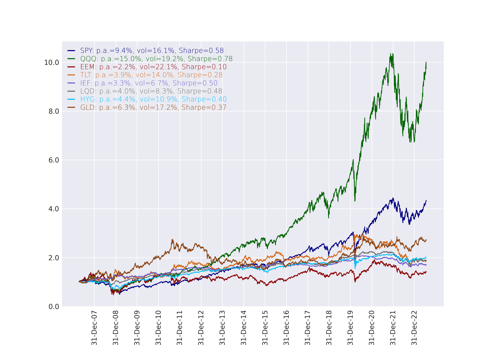
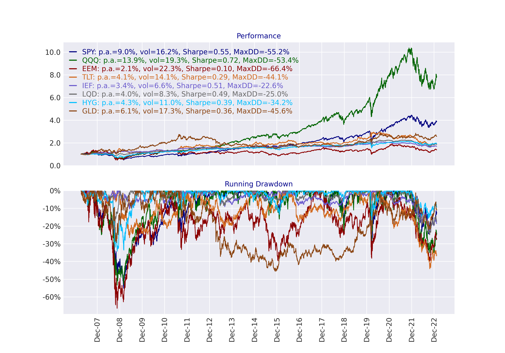
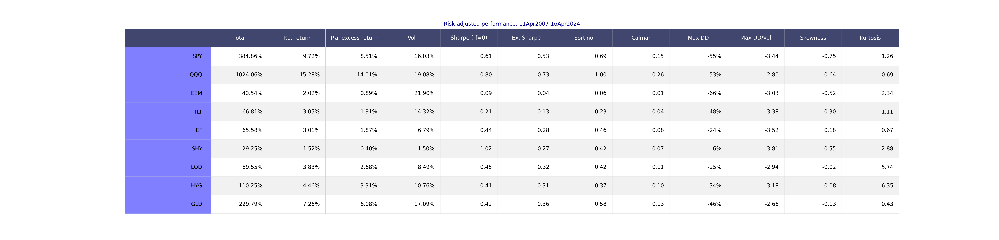
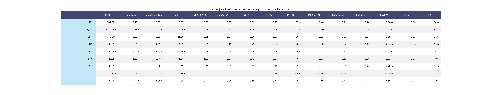
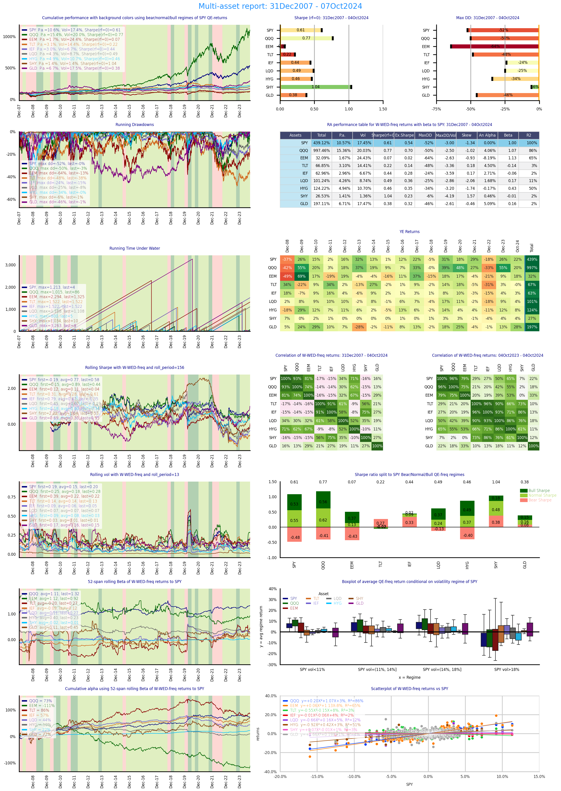
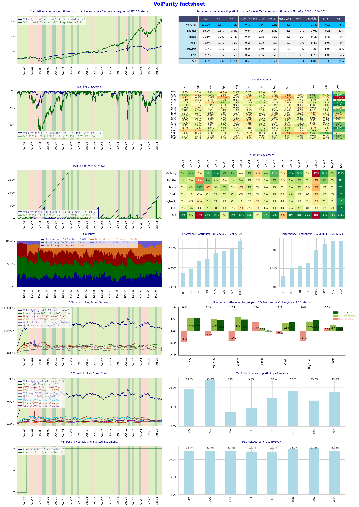
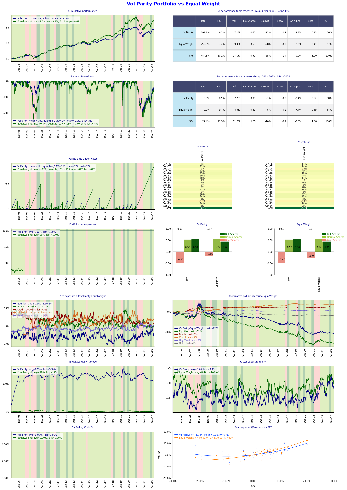
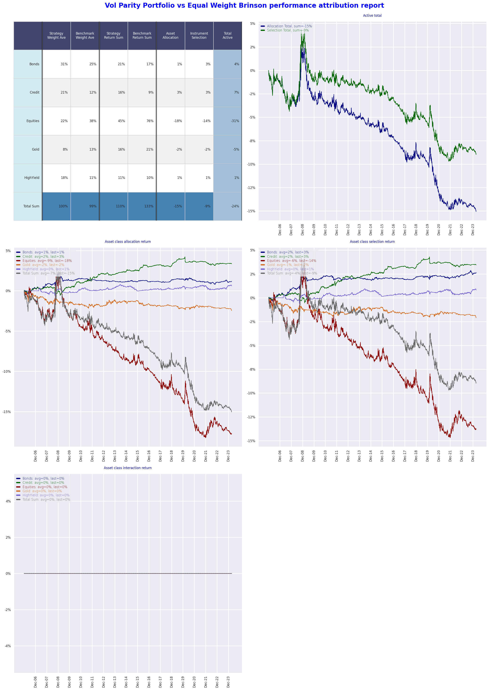
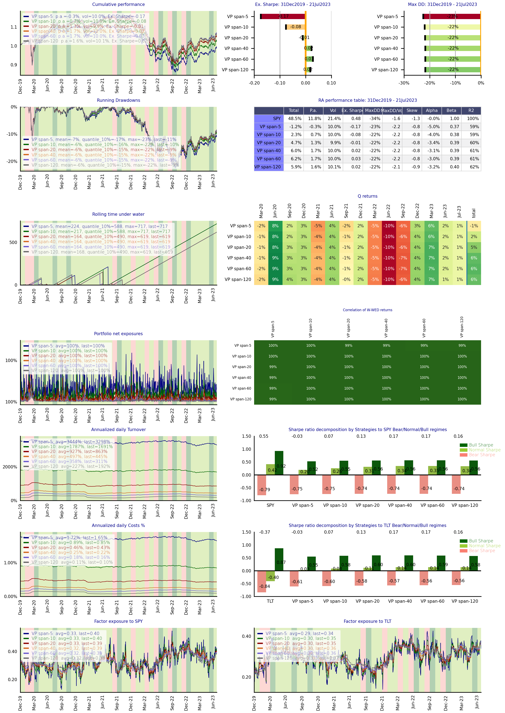

## **Quantitative Investment Strategies: QIS** <a name="analytics"></a>

qis package implements analytics for visualisation of financial data, performance
reporting, analysis of quantitative strategies. 

qis package is split into 5 main modules with the 
dependecy path increasing sequentially as follows.

1. ```qis.utils``` is module containing low level utilities for operations with pandas, numpy, and datetimes.

2. ```qis.perfstats``` is module for computing performance statistics and performance attribution including returns, volatilities, etc.

3. ```qis.plots``` is module for plotting and visualization apis.

4. ```qis.models``` is module containing statistical models including filtering and regressions.

5. ```qis.portfolio``` is high level module for analysis, simulation, backtesting, and reporting of quant strategies.

```qis.examples``` contains scripts with illustrations of QIS analytics.


# Table of contents
1. [Analytics](#analytics)
2. [Installation](#installation)
3. [Examples](#examples)
   1. [Visualization of price data](#price)
   2. [Multi assets factsheet](#multiassets)
   3. [Strategy factsheet](#strategy)
   4. [Strategy benchmark factsheet](#strategybenchmark)
   5. [Multi strategy factsheet](#multistrategy)
   6. [Notebooks](#notebooks)
4. [Contributions](#contributions)
5. [Updates](#updates)
6. [ToDos](#todos)
7. [Disclaimer](#disclaimer)

## **Updates** <a name="updates"></a>

## **Installation** <a name="installation"></a>
Install using
```python 
pip install qis
```
Upgrade using
```python 
pip install --upgrade qis
```

Close using
```python 
git clone https://github.com/ArturSepp/QuantInvestStrats.git
```

Core dependencies:
    python = ">=3.8,<3.11",
    numba = ">=0.56.4",
    numpy = ">=1.22.4",
    scipy = ">=1.10",
    statsmodels = ">=0.13.5",
    pandas = ">=1.5.2",
    matplotlib = ">=3.2.2",
    seaborn = ">=0.12.2"

Optional dependencies:
    yfinance ">=0.1.38" (for getting test price data),
    pybloqs ">=1.2.13" (for producing html and pdf factsheets)

To use pybloqs for pandas > 2.x, locate file "...\Lib\site-packages\pybloqs\jinja\table.html" and 
change line 44 from  to 


## **Examples** <a name="examples"></a>

### 1. Visualization of price data <a name="price"></a>

The script is located in ```qis.examples.performances``` (https://github.com/ArturSepp/QuantInvestStrats/blob/master/qis/examples/performances.py)

```python 
import matplotlib.pyplot as plt
import seaborn as sns
import yfinance as yf
import qis

# define tickers and fetch price data
tickers = ['SPY', 'QQQ', 'EEM', 'TLT', 'IEF', 'SHY', 'LQD', 'HYG', 'GLD']
prices = yf.download(tickers, start=None, end=None)['Adj Close'][tickers].dropna()

# plotting price data with minimum usage
with sns.axes_style("darkgrid"):
    fig, ax = plt.subplots(1, 1, figsize=(10, 7))
    qis.plot_prices(prices=prices, x_date_freq='YE', ax=ax)
```

```python 
# 2-axis plot with drawdowns using sns styles
with sns.axes_style("darkgrid"):
    fig, axs = plt.subplots(2, 1, figsize=(10, 7))
    qis.plot_prices_with_dd(prices=prices, x_date_freq='YE', axs=axs)
```


```python 
# plot risk-adjusted performance table with excess Sharpe ratio
ust_3m_rate = yf.download('^IRX', start=None, end=None)['Adj Close'].dropna() / 100.0
# set parameters for computing performance stats including returns vols and regressions
perf_params = qis.PerfParams(freq='ME', freq_reg='QE', alpha_an_factor=4.0, rates_data=ust_3m_rate)
# perf_columns is list to display different perfomance metrics from enumeration PerfStat
fig = qis.plot_ra_perf_table(prices=prices,
                             perf_columns=[PerfStat.TOTAL_RETURN, PerfStat.PA_RETURN, PerfStat.PA_EXCESS_RETURN,
                                           PerfStat.VOL, PerfStat.SHARPE_RF0,
                                           PerfStat.SHARPE_EXCESS, PerfStat.SORTINO_RATIO, PerfStat.CALMAR_RATIO,
                                           PerfStat.MAX_DD, PerfStat.MAX_DD_VOL,
                                           PerfStat.SKEWNESS, PerfStat.KURTOSIS],
                             title=f"Risk-adjusted performance: {qis.get_time_period_label(prices, date_separator='-')}",
                             perf_params=perf_params)
```



```python 
# add benchmark regression using excess returns for linear beta
# regression frequency is specified using perf_params.freq_reg
# regression alpha is multiplied using perf_params.alpha_an_factor
fig = qis.plot_ra_perf_table_benchmark(prices=prices,
                                       benchmark='SPY',
                                       perf_columns=[PerfStat.TOTAL_RETURN, PerfStat.PA_RETURN, PerfStat.PA_EXCESS_RETURN,
                                                     PerfStat.VOL, PerfStat.SHARPE_RF0,
                                                     PerfStat.SHARPE_EXCESS, PerfStat.SORTINO_RATIO, PerfStat.CALMAR_RATIO,
                                                     PerfStat.MAX_DD, PerfStat.MAX_DD_VOL,
                                                     PerfStat.SKEWNESS, PerfStat.KURTOSIS,
                                                     PerfStat.ALPHA_AN, PerfStat.BETA, PerfStat.R2],
                                       title=f"Risk-adjusted performance: {qis.get_time_period_label(prices, date_separator='-')} benchmarked with SPY",
                                       perf_params=perf_params)
```



### 2. Multi assets factsheet <a name="multiassets"></a>
This report is adopted for reporting the risk-adjusted performance 
of several assets with the goal
of cross-sectional comparision

Run example in ```qis.examples.factsheets.multi_assets.py``` https://github.com/ArturSepp/QuantInvestStrats/blob/master/qis/examples/factsheets/multi_assets.py




### 3. Strategy factsheet <a name="strategy"></a>
This report is adopted for report performance, risk, and trading statistics
for either backtested or actual strategy
    with strategy data passed as PortfolioData object

Run example in ```qis.examples.factsheets.strategy.py``` https://github.com/ArturSepp/QuantInvestStrats/blob/master/qis/examples/factsheets/strategy.py




### 4. Strategy benchmark factsheet <a name="strategybenchmark"></a>
This report is adopted for report performance and marginal comparison
  of strategy vs a benchmark strategy 
(data for both are passed using individual PortfolioData object)

Run example in ```qis.examples.factsheets.strategy_benchmark.py``` https://github.com/ArturSepp/QuantInvestStrats/blob/master/qis/examples/factsheets/strategy_benchmark.py



Brinson-Fachler performance attribution (https://en.wikipedia.org/wiki/Performance_attribution)



### 5. Multi strategy factsheet <a name="multistrategy"></a>
This report is adopted to examine the sensitivity of 
backtested strategy to a parameter or set of parameters:

Run example in ```qis.examples.factsheets.multi_strategy.py``` https://github.com/ArturSepp/QuantInvestStrats/blob/master/qis/examples/factsheets/multi_strategy.py




### 6. Notebooks <a name="notebooks"></a>

Recommended package to work with notebooks:  
```python 
pip install notebook
```
Starting local server
```python 
jupyter notebook
```


## **Contributions** <a name="contributions"></a>
If you are interested in extending and improving QIS analytics, 
please consider contributing to the library.

I have found it is a good practice to isolate general purpose and low level analytics and visualizations, which can be outsourced and shared, while keeping 
the focus on developing high level commercial applications.

There are a number of requirements:

- The code is [Pep 8 compliant](https://peps.python.org/pep-0008/)

- Reliance on common Python data types including numpy arrays, pandas, and dataclasses.

- Transparent naming of functions and data types with enough comments. Type annotations of functions and arguments is a must.

- Each submodule has a unit test for core functions and a localised entry point to core functions.

- Avoid "super" pythonic constructions. Readability is the priority.


## **Updates** <a name="updates"></a>

#### 30 December 2022,  Version 1.0.1 released

#### 08 July 2023, Version 2.0.1 released

Core Changes

1. Portfolio optimization (qis.portfolio.optimisation) layer is removed with core
functionality moved to a stand-alone Python package: Backtesting Optimal Portfolio (bop)
    
* This allows to remove the dependency from cvxpy and sklearn packages and 
thus to simplify the dependency management for qis

2.	Added factsheet reporting using pybloqs package https://github.com/man-group/PyBloqs
* Pybloqs is a versatile tool to create customised reporting using Matplotlib figures and table
and thus leveraging QIS visualisation analytics

3. New factsheets are added
* Examples are added for the four type of reports:
    1. multi assets: report performance of several assets with goal of cross-sectional comparision:
    see qis.examples.factsheets.multi_asset.py
  2. strategy: report performance, risk, and trading statictics for either backtested or actual strategy
    with strategy data passed as PortfolioData object: see qis.examples.factsheets.strategy.py
  3. strategy vs benchmark: report performance and marginal comparison
  of strategy vs a benchmark strategy (data for both are passed using individual PortfolioData object): 
  see qis.examples.factsheets.strategy_benchmark.py
  4. multi_strategy: report for a list of strategies with individual PortfolioData. This report is 
  useful to examine the sensetivity of backtested strategy to a parameter or set of parameters: 
  see qis.examples.factsheets.multi_strategy


## **ToDos** <a name="todos"></a>

1. Enhanced documentation and readme examples.

2. Docstrings for key functions.

3. Reporting analytics and factsheets generation enhancing to matplotlib.


## **Disclaimer** <a name="disclaimer"></a>

QIS package is distributed FREE & WITHOUT ANY WARRANTY under the GNU GENERAL PUBLIC LICENSE.

See the [LICENSE.txt](https://github.com/ArturSepp/QuantInvestStrats/blob/master/LICENSE.txt) in the release for details.

Please report any bugs or suggestions by opening an [issue](https://github.com/ArturSepp/QuantInvestStrats/issues).

