# 🚀 **Quantitative Investment Strategies: QIS**

> qis package implements analytics for visualisation of financial data, performance
reporting, factsheets and analysis of quantitative strategies.

---

| 📊 Metric | 🔢 Value |
|-----------|----------|
| PyPI Version |  |
| Python Versions |  |
| License | |
| CI Status | [](https://github.com/ArturSepp/QuantInvestStrats/actions) |


### 📈 Package Statistics

| 📊 Metric | 🔢 Value |
|-----------|----------|
| Total Downloads | [](https://pepy.tech/project/qis) |
| Monthly |  |
| Weekly |  |
| GitHub Stars |  |
| GitHub Forks |  |


## **Quantitative Investment Strategies: QIS** <a name="analytics"></a>
 

The package is split into 5 main modules with the 
dependency path increasing sequentially as follows.

1. ```qis.utils``` is module containing low level utilities for operations with pandas, numpy, and datetimes.

2. ```qis.perfstats``` is module for computing performance statistics and performance attribution including returns, volatilities, etc.

3. ```qis.plots``` is module for plotting and visualization apis.

4. ```qis.models``` is module containing statistical models including filtering and regressions.

5. ```qis.portfolio``` is high level module for analysis, simulation, backtesting, and reporting of quant strategies.
Function ```backtest_model_portfolio()```  in ```qis.portfolio.backtester.py``` takes instrument prices 
and simulated weights from a generic strategy and compute the total return, performance attribution, and risk analysis

```qis.market_data``` is an auxiliary module of market-data containers and FX analytics. ```FxRatesData``` holds FX spot and domestic short-rate panels and derives cross rates, covered-interest-parity forward premia, carry decomposition, and reference-currency / FX-hedged return translation of multi-asset panels, together with single- and multi-asset FX-hedging reports. ```FactorsData``` is a generic container for tradable-factor prices. Examples build the container from free Yahoo data or from Bloomberg via ```bbg-fetch```; see the module README at ```qis/market_data/README.md``` for the data contract and conventions.

```qis.examples``` contains runnable scripts showcasing the analytics, organised by sub-package:

* ```qis.examples.perfstats``` — performance metrics on price series: quickstart usage, Sharpe vs Sortino across return frequencies, rolling performance, bond-ETF risk/return frontier, multi-figure performance reports, miss-best-worst-days impact, infrequent-returns interpolation, and an end-to-end de-levering / unsmoothing walkthrough on a bundled BDC vs private-credit dataset.

* ```qis.examples.models``` — numba-vs-pandas EWM kernel benchmarks, multivariate EWM linear factor models, multivariate OLS, EWM correlation tables, OHLC realised-volatility estimators, intraday/overnight return decomposition, rolling correlations, and block bootstrap of price paths.

* ```qis.examples.regimes``` — regime-conditional analytics: bull/bear/normal Sharpe attribution, conditional return boxplots by VIX regime, calendar-month seasonality, US election regime study.

* ```qis.examples.portfolios``` — backtests using ```backtest_model_portfolio```: balanced 60/40 with and without a BTC sleeve, constant-notional short, leveraged-ETF combinations, long/short pairs, and vol-target / trend-following parameter sweeps.

* ```qis.examples.factsheets``` — full multi-page factsheets for simulated and actual strategies, cross-sectional asset-class comparisons, multi-strategy parameter sweeps, and optional pybloqs-rendered variants.

* ```qis.examples.plots``` — plotting primitives showcase: dual-axis figures, scatter with regression diagnostics.

* ```qis.examples.utils``` — date schedules and rolling calendars: option / futures roll generation via ```generate_fixed_maturity_rolls```.

* ```qis.examples.case_studies``` — cross-cutting domain studies: VIX beta to equities and bonds, VIX term-structure correlation with SPX, conditional returns on the front-month short-VIX strategy, credit-spread regression vs equity / rates.

A README inside ```qis/examples/``` lists every script with a one-line description; examples that need a Bloomberg terminal are flagged inline.


# Table of contents
1. [Analytics](#analytics)
2. [Installation](#installation)
3. [Examples](#examples)
   1. [Visualization of price data](#price)
   2. [Multi assets factsheet](#multiassets)
   3. [Strategy factsheet](#strategy)
   4. [Strategy benchmark factsheet](#strategybenchmark)
   5. [Multi strategy factsheet](#multistrategy)
   6. [Notebooks](#notebooks)
4. [Contributions](#contributions)
5. [Changelog](#changelog)
6. [ToDos](#todos)
7. [Disclaimer](#disclaimer)


## **Installation** <a name="installation"></a>
Install using
```python 
pip install qis
```
Upgrade using
```python 
pip install --upgrade qis
```

Close using
```python 
git clone https://github.com/ArturSepp/QuantInvestStrats.git
```

Core dependencies:
    python = ">=3.10",
    numba = ">=0.63.0",
    numpy = ">=2.0",
    scipy = ">=1.12.0",
    statsmodels = ">=0.14.0",
    pandas = ">=2.2.0",
    matplotlib = ">=3.8.0",
    seaborn = ">=0.13.0",
    openpyxl = ">=3.1.0",
    PyYAML = ">=6.0",
    yfinance = ">=0.2.40",
    pandas-datareader = ">=0.10.0"

Python 3.14 is supported (numba 0.63+ ships cp314 wheels).

Optional dependencies:
    pybloqs ">=1.2.13" (for producing html and pdf factsheets — install with `pip install qis[reports]`),
    bbg-fetch ">=2.0.0" (third-party; for examples that pull data from a Bloomberg terminal)

See `pyproject.toml` for the full list of optional extras (`reports`, `visualization`, `io`, `database`, `jupyter`, `dev`, `all`).


## **Examples** <a name="examples"></a>

### 1. Visualization of price data <a name="price"></a>

The script is located in ```qis.examples.performances``` (https://github.com/ArturSepp/QuantInvestStrats/blob/master/qis/examples/performances.py)

```python 
import matplotlib.pyplot as plt
import seaborn as sns
import yfinance as yf
import qis

# define tickers and fetch price data
tickers = ['SPY', 'QQQ', 'EEM', 'TLT', 'IEF', 'SHY', 'LQD', 'HYG', 'GLD']
prices = yf.download(tickers, start="2003-12-31", end=None, ignore_tz=True, auto_adjust=True)['Close'][tickers].dropna()

# plotting price data with minimum usage
with sns.axes_style("darkgrid"):
    fig, ax = plt.subplots(1, 1, figsize=(10, 7))
    qis.plot_prices(prices=prices, x_date_freq='YE', ax=ax)
```
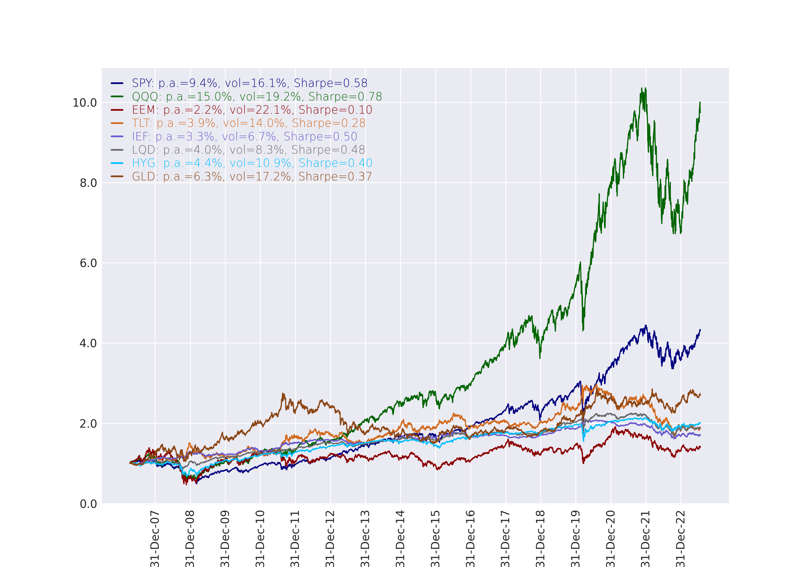
```python 
# 2-axis plot with drawdowns using sns styles
with sns.axes_style("darkgrid"):
    fig, axs = plt.subplots(2, 1, figsize=(10, 7), tight_layout=True)
    qis.plot_prices_with_dd(prices=prices, x_date_freq='YE', axs=axs)
```
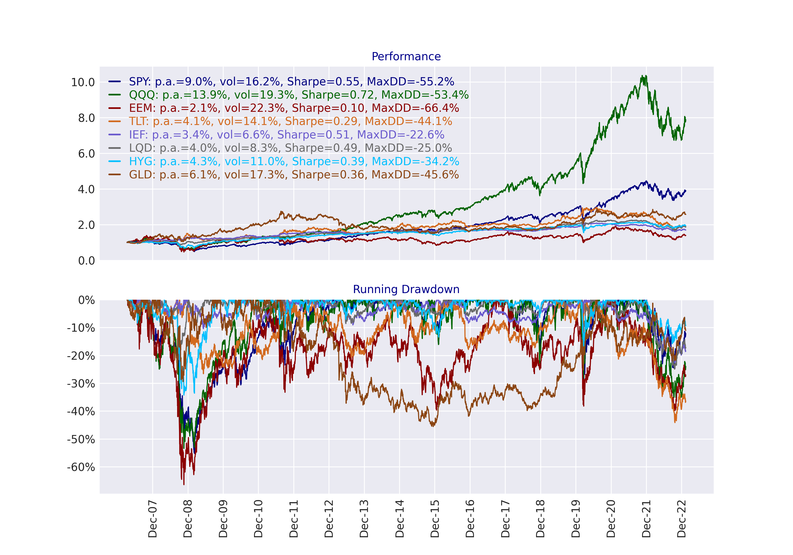

```python 
# plot risk-adjusted performance table with excess Sharpe ratio
ust_3m_rate = yf.download('^IRX', start="2003-12-31", end=None, ignore_tz=True, auto_adjust=True)['Close'].dropna() / 100.0
# set parameters for computing performance stats including returns vols and regressions
perf_params = qis.PerfParams(freq='ME', freq_reg='QE', rates_data=ust_3m_rate)
# perf_columns is list to display different perfomance metrics from enumeration PerfStat
fig = qis.plot_ra_perf_table(prices=prices,
                             perf_columns=[PerfStat.TOTAL_RETURN, PerfStat.PA_RETURN, PerfStat.PA_EXCESS_RETURN,
                                           PerfStat.VOL, PerfStat.SHARPE_RF0,
                                           PerfStat.SHARPE_EXCESS, PerfStat.SORTINO_RATIO, PerfStat.CALMAR_RATIO,
                                           PerfStat.MAX_DD, PerfStat.MAX_DD_VOL,
                                           PerfStat.SKEWNESS, PerfStat.KURTOSIS],
                             title=f"Risk-adjusted performance: {qis.get_time_period_label(prices, date_separator='-')}",
                             perf_params=perf_params)
```
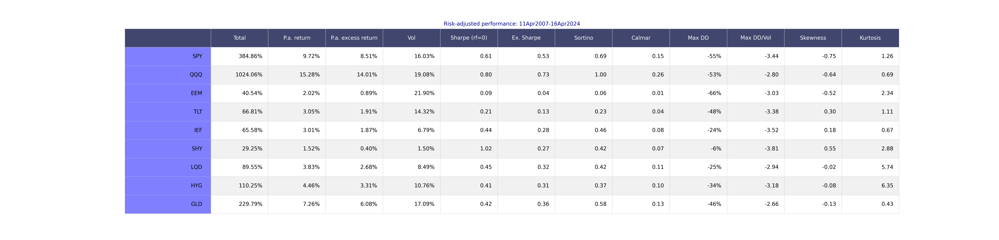


```python 
# add benchmark regression using excess returns for linear beta
# regression frequency is specified using perf_params.freq_reg
# regression alpha is multiplied using alpha_an_factor
fig, _ = qis.plot_ra_perf_table_benchmark(prices=prices,
                                          benchmark='SPY',
                                          perf_columns=[PerfStat.TOTAL_RETURN, PerfStat.PA_RETURN, PerfStat.PA_EXCESS_RETURN,
                                                        PerfStat.VOL, PerfStat.SHARPE_RF0,
                                                        PerfStat.SHARPE_EXCESS, PerfStat.SORTINO_RATIO, PerfStat.CALMAR_RATIO,
                                                        PerfStat.MAX_DD, PerfStat.MAX_DD_VOL,
                                                        PerfStat.SKEWNESS, PerfStat.KURTOSIS,
                                                        PerfStat.ALPHA_AN, PerfStat.BETA, PerfStat.R2],
                                          title=f"Risk-adjusted performance: {qis.get_time_period_label(prices, date_separator='-')} benchmarked with SPY",
                                          perf_params=perf_params)
```
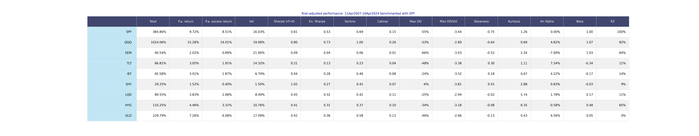


### 2. Multi assets factsheet <a name="multiassets"></a>
This report is adopted for reporting the risk-adjusted performance 
of several assets with the goal
of cross-sectional comparision

Run example in ```qis.examples.factsheets.multi_assets.py``` https://github.com/ArturSepp/QuantInvestStrats/blob/master/qis/examples/factsheets/multi_assets.py

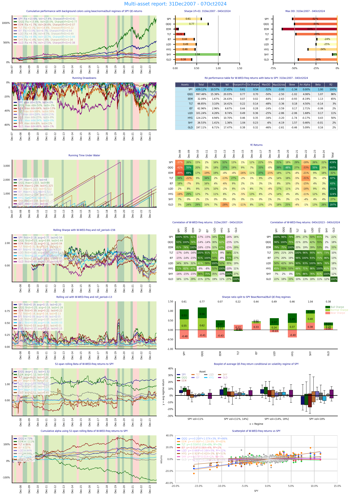


### 3. Strategy factsheet <a name="strategy"></a>
This report is adopted for report performance, risk, and trading statistics
for either backtested or actual strategy
    with strategy data passed as PortfolioData object

Run example in ```qis.examples.factsheets.strategy.py``` https://github.com/ArturSepp/QuantInvestStrats/blob/master/qis/examples/factsheets/strategy.py

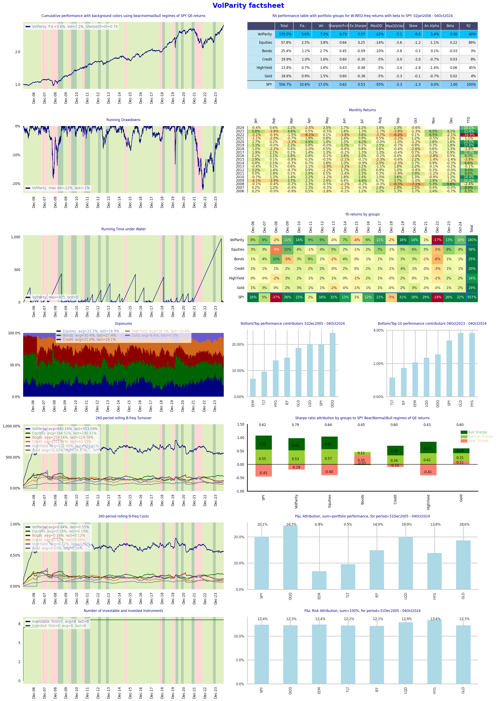
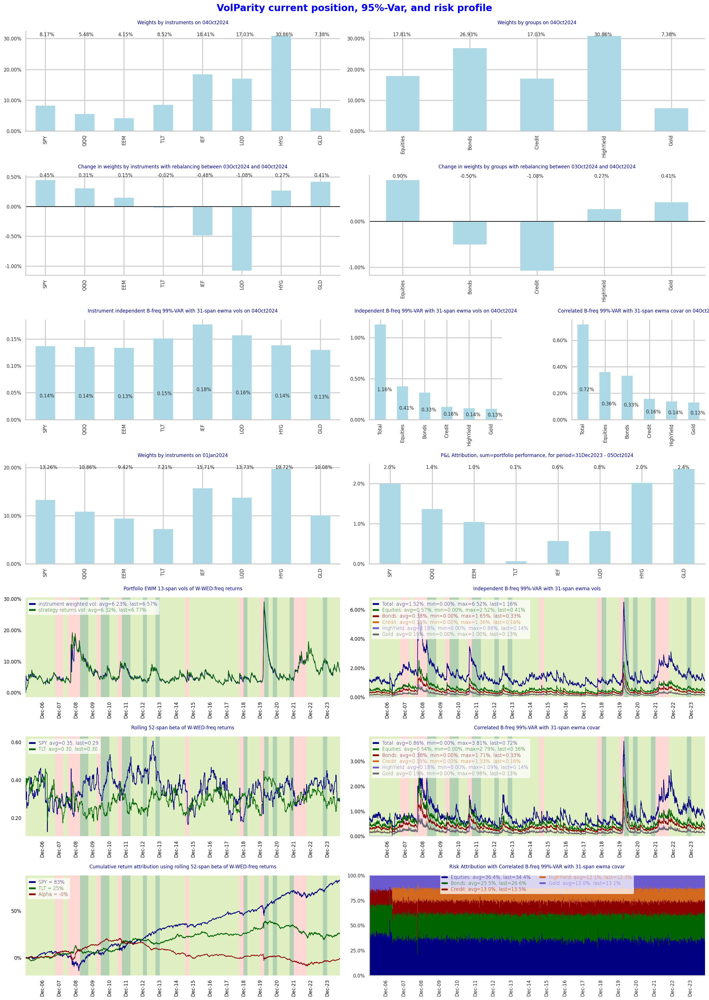
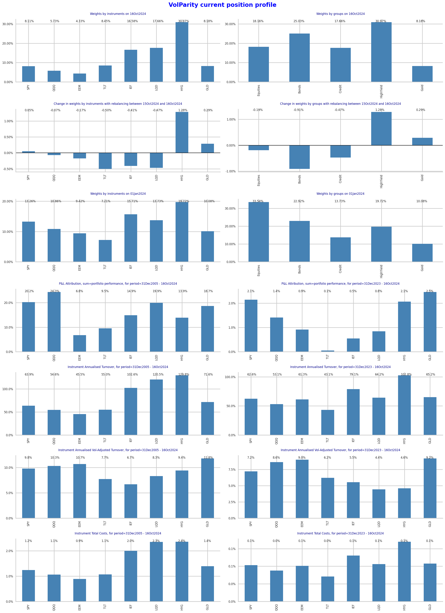

### 4. Strategy benchmark factsheet <a name="strategybenchmark"></a>
This report is adopted for report performance and marginal comparison
  of strategy vs a benchmark strategy 
(data for both are passed using individual PortfolioData object)

Run example in ```qis.examples.factsheets.strategy_benchmark.py``` https://github.com/ArturSepp/QuantInvestStrats/blob/master/qis/examples/factsheets/strategy_benchmark.py

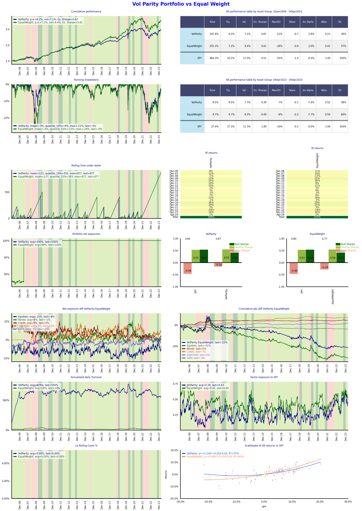

Brinson-Fachler performance attribution (https://en.wikipedia.org/wiki/Performance_attribution)
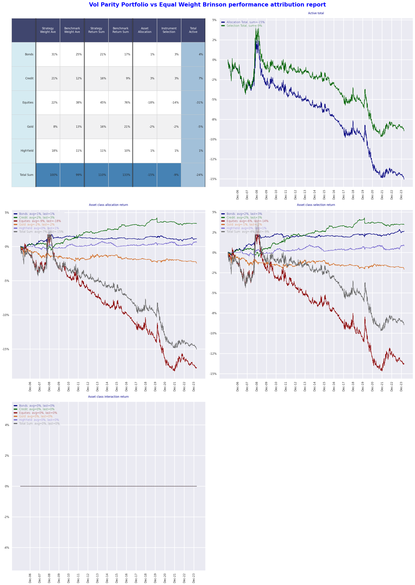


### 5. Multi strategy factsheet <a name="multistrategy"></a>
This report is adopted to examine the sensitivity of 
backtested strategy to a parameter or set of parameters:

Run example in ```qis.examples.factsheets.multi_strategy.py``` https://github.com/ArturSepp/QuantInvestStrats/blob/master/qis/examples/factsheets/multi_strategy.py

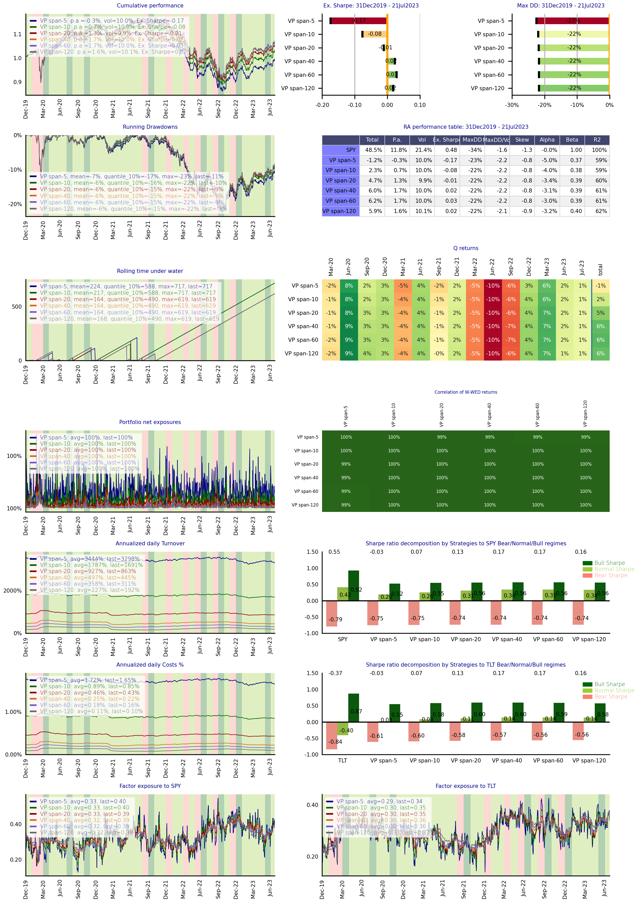


### 6. Notebooks <a name="notebooks"></a>

Recommended package to work with notebooks:  
```python 
pip install notebook
```
Starting local server
```python 
jupyter notebook
```

Examples of using qis analytics jupyter notebooks are located here
https://github.com/ArturSepp/QuantInvestStrats/blob/master/qis/examples/notebooks


## **Contributions** <a name="contributions"></a>
If you are interested in extending and improving QIS analytics, 
please consider contributing to the library.

I have found it is a good practice to isolate general purpose and low level analytics and visualizations, which can be outsourced and shared, while keeping 
the focus on developing high level commercial applications.

There are a number of requirements:

- The code is [Pep 8 compliant](https://peps.python.org/pep-0008/)

- Reliance on common Python data types including numpy arrays, pandas, and dataclasses.

- Transparent naming of functions and data types with enough comments. Type annotations of functions and arguments is a must.

- Each submodule has a unit test for core functions and a localised entry point to core functions.

- Avoid "super" pythonic constructions. Readability is the priority.


## **Changelog** <a name="changelog"></a>

Release history is maintained in [CHANGELOG.md](CHANGELOG.md).


## **ToDos** <a name="todos"></a>

1. Enhanced documentation and readme examples.

2. Docstrings for key functions.

3. Reporting analytics and factsheets generation enhancing to matplotlib.


## **Disclaimer** <a name="disclaimer"></a>

QIS package is distributed FREE & WITHOUT ANY WARRANTY under the GNU GENERAL PUBLIC LICENSE.

See the [LICENSE.txt](https://github.com/ArturSepp/QuantInvestStrats/blob/master/LICENSE.txt) in the release for details.

Please report any bugs or suggestions by opening an [issue](https://github.com/ArturSepp/QuantInvestStrats/issues).

.
## BibTeX Citation

If you use BloombergFetch in your research, please cite it as:

```bibtex
@software{sepp2024qis,
  author={Sepp, Artur},
  title={Qua: A Python Package for Bloomberg Terminal Data Access},
  year={2024},
  url={https://github.com/ArturSepp/BloombergFetch},
  version={1.0.27}
}
```

## BibTeX Citations for QIS (Quantitative Investment Strategies) Package

If you use QIS in your research, please cite it as:

```bibtex
@software{sepp2024qis,
  title={qis: Implementation of visualisation and reporting analytics for Quantitative Investment Strategies},
  author={Sepp, Artur},
  year={2024},
  url={https://github.com/ArturSepp/QuantInvestStrats}
}
```
