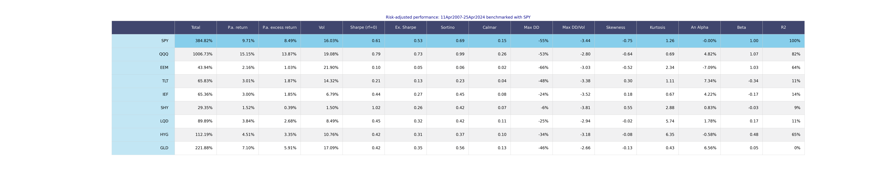
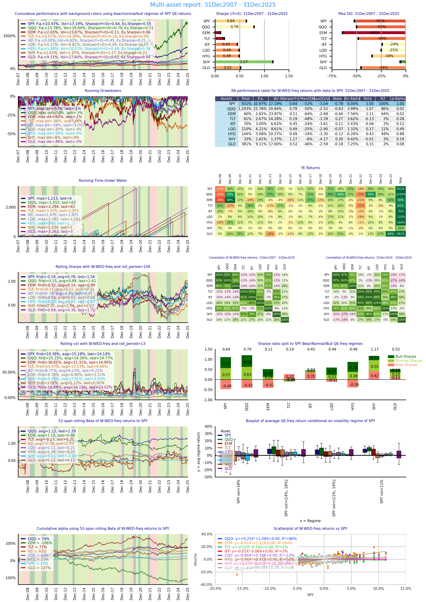
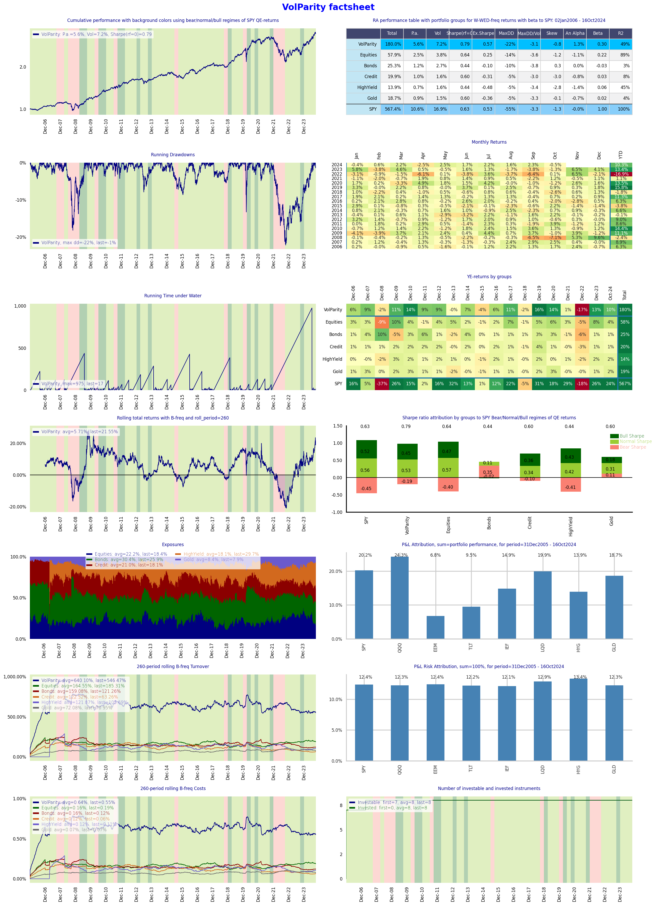
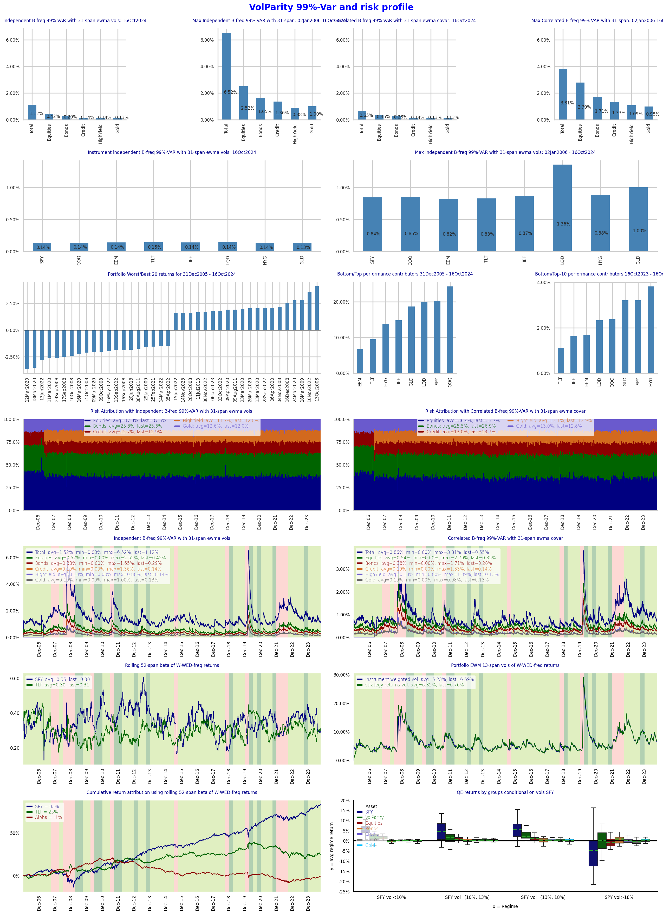
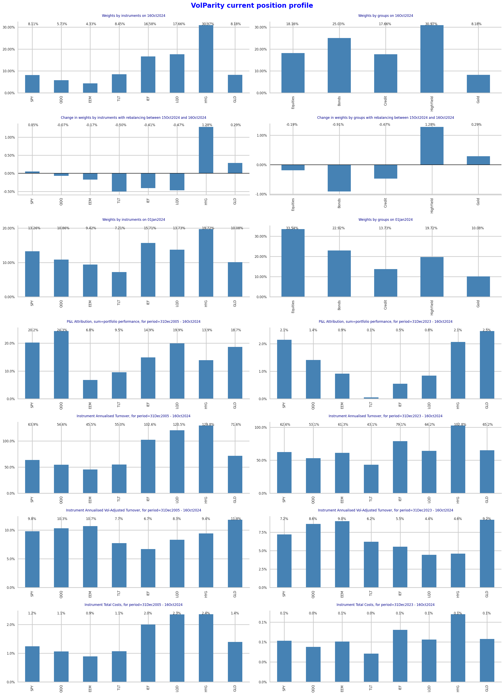
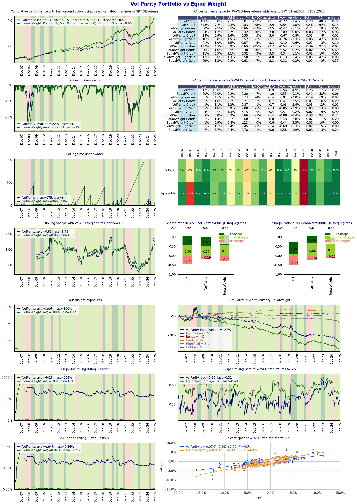
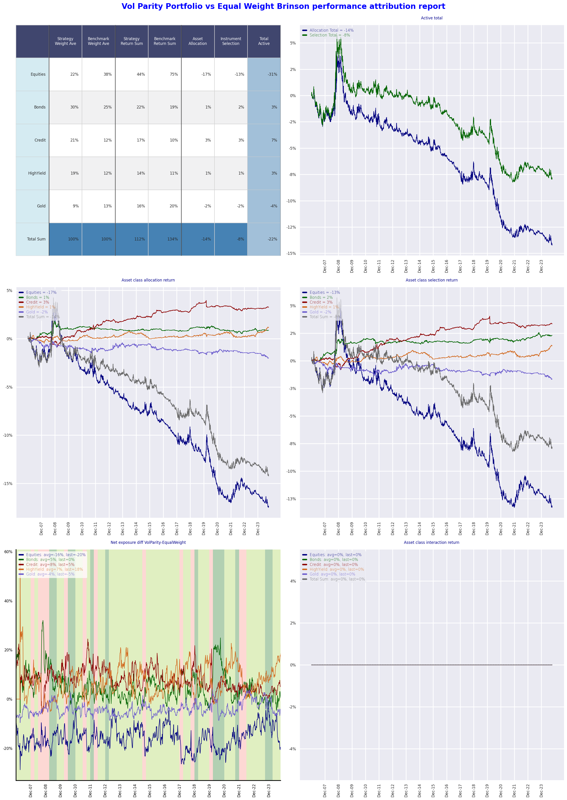
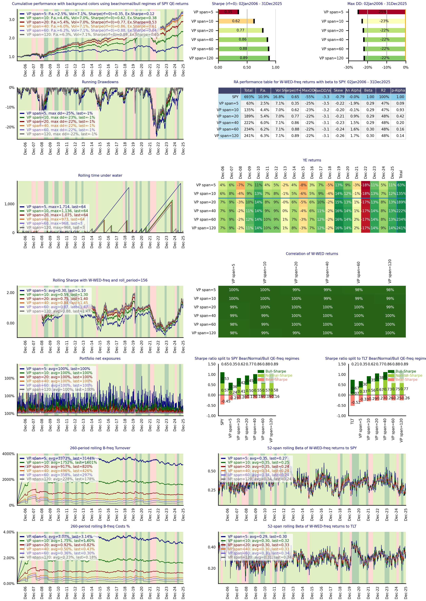

# qis

**Performance analytics, portfolio backtesting, risk analysis, and factsheet reporting in
Python.**

Quantitative Investment Strategies covers time-series and cross-sectional performance,
drift-aware portfolio histories, ex-ante and ex-post risk, and reproducible reports. Bring your
own strategy logic and weight targets; `qis` measures, backtests, analyses, and reports them.

**Install:** `pip install qis` · **Import:** `qis` · **Status:** Beta

[](https://pypi.org/project/qis/)
[](https://pypi.org/project/qis/)
[](https://github.com/ArturSepp/QuantInvestStrats/actions/workflows/ci.yml)
[](https://quantinveststrats.readthedocs.io/en/latest/)
[](LICENSE.txt)
[](https://pepy.tech/project/qis)
[](https://pepy.tech/project/qis)

---

## Why qis

`qis` separates strategy research from portfolio accounting. Strategy logic stays in your code;
the library turns instrument prices and externally computed weights into drift-aware portfolio
histories, performance attribution, risk analysis, and reproducible reports.

### Key differentiators

**Backtesting of externally computed weights.** `generate_static_weights_schedule()` can create
live-universe-aware target schedules from desired allocations. `backtest_model_portfolio()` then
consumes the prices and supplied weights, holds units between rebalancings, and applies explicit
transaction costs. The backtester does not generate a strategy's target schedule.

**Factsheet reporting.** Four report archetypes — multi-asset, strategy, strategy versus
benchmark, and multi-strategy parameter sweeps — produce reproducible multi-page factsheets, with
optional PyBloqs HTML/PDF rendering.

**Consolidated risk and tracking-error layer.** The point-in-time `qis.RiskModel` covers ex-ante
tracking error, factor exposures, benchmark beta, Euler risk contributions, and fractional,
overlapping, or signed loading matrices. Ex-post analytics cover realised EWMA tracking error,
whole-sample TE/IR, and EWMA beta/alpha. The same conventions serve the wider package stack.

**Documentation checked against the code.** The core dependency list is checked against
`pyproject.toml`; README Python blocks are parsed for unresolved names; repository examples are
checked for public symbols and introspectable keyword arguments; and examples without a data
vendor are run. Network-backed examples remain subject to their providers.

## When to use it — and when not

Use `qis` for performance and risk statistics on price panels, backtests of supplied weight
schedules with costs, ex-ante and ex-post tracking error, regime-conditional analytics, and
factsheets for backtested or live strategies.

For portfolio construction use
[`optimalportfolios`](https://github.com/ArturSepp/OptimalPortfolios). For Bloomberg data use the
separately installed [`bbg-fetch`](https://github.com/ArturSepp/BloombergFetch) companion; it is
not a `qis` extra. `qis` is a research and reporting library, not an execution system.

## Overview <a name="analytics"></a>
 

The package is split into five main modules, with the dependency path increasing sequentially:

1. `qis.utils` contains low-level utilities for pandas, NumPy, and datetime operations.

2. `qis.perfstats` computes performance statistics and attribution, including returns and
   volatilities.

3. `qis.plots` provides plotting and visualisation APIs.

4. `qis.models` contains statistical models, including filters and regressions.

5. `qis.portfolio` is the high-level module for analysis, simulation, backtesting, and reporting
   of quantitative strategies. `backtest_model_portfolio()` in `qis.portfolio.backtester.py`
   takes instrument prices and supplied weights from a generic strategy and computes total
   returns, performance attribution, and risk analysis.

Risk and tracking-error analytics are consolidated in `qis.portfolio.risk`. The public
`qis.RiskModel` is the point-in-time weights-and-covariance layer for ex-ante tracking
error, standalone group risk, factor exposures, benchmark beta and loadings,
systematic/residual tracking-error decomposition, and Euler marginal tracking-error
contributions. Its loading-matrix interface also supports fractional, overlapping, and signed
standalone sleeves without reducing them to categorical groups. Ex-post analytics use portfolio
and benchmark NAVs or return differences:
`compute_ewma_realised_tracking_error` produces a conditional annualised series, while
`compute_te_ir_errors` and `compute_info_ratio_table` produce whole-sample tracking
error and information-ratio estimates. The
`weights_tracking_error_report_by_ac_subac` report brings these views together with
ex-ante versus realised tracking error, ex-ante versus ex-post beta, annualised ex-post alpha,
and optional factor panels. Some established API names retain the abbreviation `tre`, but
all refer to tracking error.

Covariance-implied Euler attribution also lives here for the whole OSS stack:
`compute_portfolio_risk_contributions` returns asset contributions in volatility units,
`compute_portfolio_risk_contribution_ratios` returns their dimensionless shares, and
`compute_group_portfolio_risk_contribution_ratios` aggregates those shares over clusters,
sectors, asset classes, or any other complete labelled partition.

`qis.market_data` is an auxiliary module of market-data containers and FX analytics. `FxRatesData`
holds FX spot and domestic short-rate panels and derives cross rates, covered-interest-parity
forward premia, carry decomposition, and reference-currency / FX-hedged return translation of
multi-asset panels, together with single- and multi-asset FX-hedging reports. `FactorsData` is a
generic container for tradable-factor prices. Examples build the container from free Yahoo data
or from Bloomberg through the separately installed `bbg-fetch` package; see
[`src/qis/market_data/README.md`](src/qis/market_data/README.md) for the data contract and conventions.

The repository-root [`examples/`](examples/) directory contains runnable scripts showcasing the
analytics. It is intentionally separate from the installed `qis` package:

* `examples/perfstats` — performance metrics on price series: quickstart usage, Sharpe vs Sortino across return frequencies, rolling performance, bond-ETF risk/return frontier, multi-figure performance reports, miss-best-worst-days impact, infrequent-returns interpolation, and an end-to-end de-levering / unsmoothing walkthrough on a bundled BDC vs private-credit dataset.

* `examples/models` — numba-vs-pandas EWM kernel benchmarks, multivariate EWM linear factor models, multivariate OLS, EWM correlation tables, intraday/overnight return decomposition, rolling correlations, and block bootstrap of price paths.

* `examples/regimes` — regime-conditional analytics: bull/bear/normal Sharpe attribution, conditional return boxplots by VIX regime, calendar-month seasonality, US election regime study.

* `examples/portfolios` — backtests using `backtest_model_portfolio`: balanced 60/40 with and without a BTC sleeve, constant-notional short, leveraged-ETF combinations, long/short pairs, vol-target / trend-following parameter sweeps, and separate offline ex-ante and ex-post tracking-error workflows.

* `examples/factsheets` — full multi-page factsheets for simulated and actual strategies, cross-sectional asset-class comparisons, multi-strategy parameter sweeps, and optional PyBloqs-rendered variants.

* `examples/plots` — plotting primitives showcase: dual-axis figures, scatter with regression diagnostics.

* `examples/utils` — date schedules and rolling calendars: option / futures roll generation via `generate_fixed_maturity_rolls`.

* `examples/case_studies` — cross-cutting domain studies: VIX beta to equities and bonds, VIX term-structure correlation with SPX, conditional returns on the front-month short-VIX strategy, credit-spread regression vs equity / rates.

The [`examples/README.md`](examples/README.md) index lists every script with a one-line
description; examples that need a Bloomberg terminal are flagged inline.


## Table of contents

1. [Why qis](#why-qis)
2. [When to use it — and when not](#when-to-use-it-and-when-not)
3. [Overview](#analytics)
4. [Installation](#installation)
5. [Offline quickstart](#offline-quickstart)
6. [Examples](#examples)
   1. [Visualisation of price data](#price)
   2. [Multi assets factsheet](#multiassets)
   3. [Strategy factsheet](#strategy)
   4. [Strategy benchmark factsheet](#strategybenchmark)
   5. [Multi strategy factsheet](#multistrategy)
   6. [Runnable examples](#runnable-examples)
7. [Ecosystem](#ecosystem)
8. [Feedback & contributing](#feedback-contributing)
9. [Changelog](#changelog)
10. [License](#license)
11. [Disclaimer](#disclaimer)
12. [Citation](#citation)


## Installation <a name="installation"></a>
Install using
```bash
pip install qis
```
Upgrade using
```bash
pip install --upgrade qis
```

Clone using
```bash
git clone https://github.com/ArturSepp/QuantInvestStrats.git
```

Core dependencies:
    python = ">=3.10",
    numba = ">=0.63.0",
    numpy = ">=2.0",
    scipy = ">=1.12.0",
    statsmodels = ">=0.14.0",
    pandas = ">=2.2.0",
    matplotlib = ">=3.8.0",
    seaborn = ">=0.13.0",
    openpyxl = ">=3.1.0",
    PyYAML = ">=6.0"

`src/qis/tests/test_documentation.py` asserts that this list is the `dependencies` table of
`pyproject.toml`, so it cannot drift from what `pip install qis` actually pulls.

Python 3.14 is supported (numba 0.63+ ships cp314 wheels).

Published extras keep optional integrations out of a core install:

| Extra | Adds |
|---|---|
| `data` | yfinance and pandas-datareader for free market-data examples |
| `reports` | PyBloqs and Jinja for HTML/PDF factsheets |
| `visualization` | Plotly output |
| `io` | PyArrow and fsspec storage support |
| `database` | PostgreSQL and SQLAlchemy support |
| `jupyter` | Local notebook tooling |
| `docs` | Sphinx, MyST, and Furo documentation builds |
| `all` | All published extras above |

Bloomberg access is supplied by the separately installed
[`bbg-fetch`](https://github.com/ArturSepp/BloombergFetch) companion; it is not a `qis` extra.
Contributor tests and linting use locked PEP 735 groups rather than a `dev` extra:

```bash
uv sync --group test --locked
uv run --no-sync pytest
```

See [`CONTRIBUTING.md`](CONTRIBUTING.md) for the CI-equivalent lint, documentation, and wheel
commands.


## Offline quickstart <a name="offline-quickstart"></a>

[](https://colab.research.google.com/github/ArturSepp/QuantInvestStrats/blob/main/notebooks/offline_quickstart_colab.ipynb)

The authoritative first-success workflow is
[`examples/getting_started/offline_quickstart.py`](examples/getting_started/offline_quickstart.py).
It generates seeded data in-process, builds a live-universe-aware quarterly weight schedule,
backtests with explicit transaction costs, and prints performance plus benchmark-relative risk.
It needs only the core `qis` installation and writes no files.

In that workflow, `generate_static_weights_schedule()` creates targets over the instruments live
at each rebalance. `backtest_model_portfolio()` consumes that supplied schedule; it does not create
the strategy weights itself.

From a repository checkout:

```bash
python examples/getting_started/offline_quickstart.py
```

With only `pip install qis`, copy the complete code from the
[hosted offline quickstart](https://quantinveststrats.readthedocs.io/en/latest/quickstart.html).
That page includes the runnable script directly, so the README, documentation, and example cannot
develop independent full-code versions.

The Colab entry point installs the latest release from public PyPI, reports its exact version and
import path, and runs that same mechanically checked source with no saved notebook outputs.


## Examples <a name="examples"></a>

### 1. Visualisation of price data <a name="price"></a>

This is an optional network-backed plotting example. For the core-install first-success path, use
the offline quickstart above.

The script is located at [`examples/perfstats/quickstart.py`](examples/perfstats/quickstart.py).
Run `python -m examples.perfstats.quickstart` from the repository root to produce the figures
below; `perf1` to `perf3` are excluded from the repository by `.gitignore` on size, so only the
last is embedded here.

```python
import matplotlib.pyplot as plt
import seaborn as sns
import yfinance as yf
import qis
from qis import PerfStat

# define tickers and fetch price data
tickers = ['SPY', 'QQQ', 'EEM', 'TLT', 'IEF', 'SHY', 'LQD', 'HYG', 'GLD']
prices = yf.download(tickers, start="2003-12-31", end=None, ignore_tz=True, auto_adjust=True)['Close'][tickers].dropna()

# plotting price data with minimum usage
with sns.axes_style("darkgrid"):
    fig, ax = plt.subplots(1, 1, figsize=(10, 7))
    qis.plot_prices(prices=prices, x_date_freq='YE', ax=ax)
```
```python
# 2-axis plot with drawdowns using sns styles
with sns.axes_style("darkgrid"):
    fig, axs = plt.subplots(2, 1, figsize=(10, 7), tight_layout=True)
    qis.plot_prices_with_dd(prices=prices, x_date_freq='YE', axs=axs)
```

```python
# plot risk-adjusted performance table with excess Sharpe ratio
ust_3m_rate = yf.download('^IRX', start="2003-12-31", end=None, ignore_tz=True, auto_adjust=True)['Close'].dropna() / 100.0
# set parameters for computing performance stats including returns vols and regressions
perf_params = qis.PerfParams(freq='ME', freq_reg='QE', rates_data=ust_3m_rate)
# perf_columns is list to display different performance metrics from enumeration PerfStat
fig = qis.plot_ra_perf_table(prices=prices,
                             perf_columns=[PerfStat.TOTAL_RETURN, PerfStat.PA_RETURN, PerfStat.PA_EXCESS_RETURN,
                                           PerfStat.VOL, PerfStat.SHARPE_RF0,
                                           PerfStat.SHARPE_EXCESS, PerfStat.SORTINO_RATIO, PerfStat.CALMAR_RATIO,
                                           PerfStat.MAX_DD, PerfStat.MAX_DD_VOL,
                                           PerfStat.SKEWNESS, PerfStat.KURTOSIS],
                             title=f"Risk-adjusted performance: {qis.get_time_period_label(prices, date_separator='-')}",
                             perf_params=perf_params)
```


```python
# add benchmark regression using excess returns for linear beta
# regression frequency is specified using perf_params.freq_reg
# regression alpha is multiplied using alpha_an_factor
fig, _ = qis.plot_ra_perf_table_benchmark(prices=prices,
                                          benchmark='SPY',
                                          perf_columns=[PerfStat.TOTAL_RETURN, PerfStat.PA_RETURN, PerfStat.PA_EXCESS_RETURN,
                                                        PerfStat.VOL, PerfStat.SHARPE_RF0,
                                                        PerfStat.SHARPE_EXCESS, PerfStat.SORTINO_RATIO, PerfStat.CALMAR_RATIO,
                                                        PerfStat.MAX_DD, PerfStat.MAX_DD_VOL,
                                                        PerfStat.SKEWNESS, PerfStat.KURTOSIS,
                                                        PerfStat.ALPHA_AN, PerfStat.BETA, PerfStat.R2],
                                          title=f"Risk-adjusted performance: {qis.get_time_period_label(prices, date_separator='-')} benchmarked with SPY",
                                          perf_params=perf_params)
```



### 2. Multi assets factsheet <a name="multiassets"></a>
This report is adapted for reporting the risk-adjusted performance
of several assets with the goal
of cross-sectional comparison

Run [`examples/factsheets/multi_assets.py`](examples/factsheets/multi_assets.py).




### 3. Strategy factsheet <a name="strategy"></a>
This report is adapted for reporting performance, risk, and trading statistics
for either backtested or actual strategy
    with strategy data passed as PortfolioData object

Run [`examples/factsheets/strategy.py`](examples/factsheets/strategy.py).





### 4. Strategy benchmark factsheet <a name="strategybenchmark"></a>
This report is adapted for reporting performance and marginal comparison
  of strategy vs a benchmark strategy 
(data for both are passed using individual PortfolioData object)

Run [`examples/factsheets/strategy_benchmark.py`](examples/factsheets/strategy_benchmark.py).



Brinson-Fachler performance attribution (https://en.wikipedia.org/wiki/Performance_attribution)



### 5. Multi strategy factsheet <a name="multistrategy"></a>
This report is adapted to examine the sensitivity of
backtested strategy to a parameter or set of parameters:

Run [`examples/factsheets/multi_strategy.py`](examples/factsheets/multi_strategy.py).




### 6. Runnable examples <a name="runnable-examples"></a>

The examples are plain scripts under
[`examples/`](https://github.com/ArturSepp/QuantInvestStrats/tree/main/examples), each
runnable top to bottom. `src/qis/tests/test_examples.py` checks them for symbols and keyword
arguments that exist, and runs the examples that need no data vendor. Most network-backed examples
receive those static checks but are not executed unattended.

The four factsheet archetypes shown above are
[`multi_assets.py`](https://github.com/ArturSepp/QuantInvestStrats/blob/main/examples/factsheets/multi_assets.py),
[`strategy.py`](https://github.com/ArturSepp/QuantInvestStrats/blob/main/examples/factsheets/strategy.py),
[`strategy_benchmark.py`](https://github.com/ArturSepp/QuantInvestStrats/blob/main/examples/factsheets/strategy_benchmark.py)
and
[`multi_strategy.py`](https://github.com/ArturSepp/QuantInvestStrats/blob/main/examples/factsheets/multi_strategy.py).

The consolidated tracking-error analytics are demonstrated offline in
[`ex_anti_tracking_error_and_risk.py`](https://github.com/ArturSepp/QuantInvestStrats/blob/main/examples/portfolios/ex_anti_tracking_error_and_risk.py)
for the covariance-based ex-ante view and
[`ex_post_tracking_error_and_risk.py`](https://github.com/ArturSepp/QuantInvestStrats/blob/main/examples/portfolios/ex_post_tracking_error_and_risk.py)
for realised EWMA tracking error, whole-sample TE/IR, and EWMA beta/alpha.


## Ecosystem

This package is part of an open-source Python stack for quantitative finance. The
[ArturSepp profile](https://github.com/ArturSepp) is the canonical full catalogue:

| Package | Purpose |
|---|---|
| [`qis`](https://github.com/ArturSepp/QuantInvestStrats) *(this package)* | Performance and risk analytics, factsheets, and visualisation |
| [`optimalportfolios`](https://github.com/ArturSepp/OptimalPortfolios) | Portfolio construction and backtesting |
| [`factorlasso`](https://github.com/ArturSepp/factorlasso) | Sparse factor models and factor covariance estimation |
| [`bbg-fetch`](https://github.com/ArturSepp/BloombergFetch) | Bloomberg data fetching |
| [`option-chain-analytics`](https://github.com/ArturSepp/OptionChainAnalytics) | Point-in-time option-chain normalisation, reconstruction, querying, and visualisation |
| [`vanilla-option-pricers`](https://github.com/ArturSepp/VanillaOptionPricers) | Vectorised vanilla option pricers and implied volatility fitters |
| [`stochvolmodels`](https://github.com/ArturSepp/StochVolModels) | Stochastic volatility pricing analytics |
| [`trendfollowing`](https://github.com/ArturSepp/TrendFollowingSystems) | Trend-following systems: closed-form theory and replication |
| [`privateassets`](https://github.com/ArturSepp/privateassets) | Money-weighted multi-factor alpha from private-asset cash flows |
| [`goal-based-allocation`](https://github.com/ArturSepp/GoalBasedAllocation) | Dynamic MV allocation under regime-switching jump-diffusions |

`qis` is the base analytics layer. It is a direct dependency of `optimalportfolios`,
`trendfollowing`, `privateassets`, and `option-chain-analytics`, and an optional research
dependency of `stochvolmodels`.

## Feedback & contributing

- **Bug:** use the [bug-report form](https://github.com/ArturSepp/QuantInvestStrats/issues/new?template=bug_report.yml) with the `qis` version, Python/platform, a minimal public-data reproducer, and expected versus actual output.
- **Feature:** use the [feature-request form](https://github.com/ArturSepp/QuantInvestStrats/issues/new?template=feature_request.yml) and describe the user goal, current workaround, and smallest useful API. In particular: which report, risk measure, or portfolio-analytics workflow cannot be expressed today?
- **Question or methodology:** search or open an [issue](https://github.com/ArturSepp/QuantInvestStrats/issues) and name the statistic, convention, or example involved.
- **Contribution:** follow [CONTRIBUTING.md](CONTRIBUTING.md); focused work is listed under [`good first issue`](https://github.com/ArturSepp/QuantInvestStrats/labels/good%20first%20issue) and [`help wanted`](https://github.com/ArturSepp/QuantInvestStrats/labels/help%20wanted).

[GOVERNANCE.md](GOVERNANCE.md) records the maintainer decision model, release and compatibility
policy, support expectations, and private route for sensitive reports.

Planned improvements are tracked in [Issues](https://github.com/ArturSepp/QuantInvestStrats/issues)
rather than in a static README checklist.

I have found it is a good practice to isolate general-purpose and low-level analytics and visualisations, which can be outsourced and shared, while keeping
the focus on developing high level commercial applications.

There are a number of requirements:

- The code is [Pep 8 compliant](https://peps.python.org/pep-0008/)

- Reliance on common Python data types including numpy arrays, pandas, and dataclasses.

- Transparent naming of functions and data types with enough comments. Type annotations of functions and arguments is a must.

- Each submodule has a unit test for core functions and a localised entry point to core functions.

- Avoid "super" pythonic constructions. Readability is the priority.


## Changelog <a name="changelog"></a>

Release history is maintained in [CHANGELOG.md](CHANGELOG.md).


## License

MIT — see [LICENSE.txt](LICENSE.txt).

## Disclaimer <a name="disclaimer"></a>

QIS package is distributed FREE & WITHOUT ANY WARRANTY under the MIT License.

See the [LICENSE.txt](https://github.com/ArturSepp/QuantInvestStrats/blob/main/LICENSE.txt) in the release for details.

Use the dedicated routes in [Feedback & contributing](#feedback-contributing) for bugs, feature
requests, and methodology questions.


## Citation

A machine-readable citation is available in [`CITATION.cff`](CITATION.cff).

If you use QIS in your research, please cite it as:

```bibtex
@software{sepp2026qis,
  title={qis: Implementation of visualisation and reporting analytics for Quantitative Investment Strategies},
  author={Sepp, Artur},
  year={2026},
  version={5.21.2},
  url={https://github.com/ArturSepp/QuantInvestStrats}
}
```
