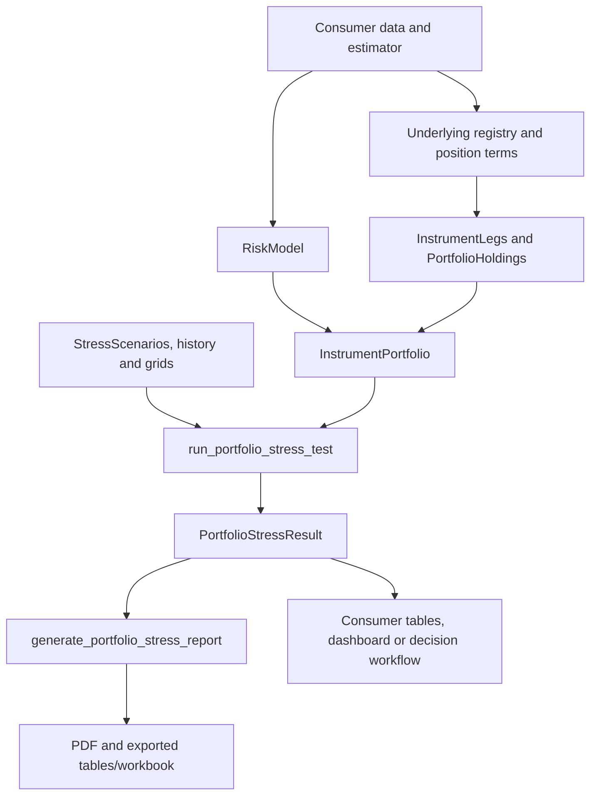

# Roadmap: public portfolio valuation and stress interfaces

**Date:** 12 September 2026
**Status:** Public QIS stages Q0–Q4 implemented and verified locally; ROSAA/UAE migration complete locally; JSR/FS pending.
**Public namespace:** `qis.portfolio.stress`.

## Implementation record - 12 September 2026

The shared public stages **Q0-Q4 are implemented and verified locally** on
`codex/arturdesktop-portfolio-stress-20260912`. Source is in the locked linked
worktree at [implementation](C:/Users/artur/AppData/Local/AgentWork/tasks/arturdesktop-portfolio-stress-20260912/source/src/qis/portfolio/stress);
the authoritative Git object database remains in the OneDrive QIS repository.
This branch uses development version **5.28.0** and has not been published or
merged into the primary checkout, which has an independent 5.27.0 turnover change.

| Stage | Status | Evidence |
|---|---|---|
| Q0 | Complete | All 98 existing risk/stress baseline checks passed before implementation. |
| Q1 | Complete | Public imports, signed primitive payoffs and executable shipped example pass. |
| Q2 | Complete | Independent FX arithmetic, finite differences, zero marks and shared-residual cancellation pass. |
| Q3 | Complete | Exact historical ranking, attribution, family-split grid parity and row completion policies pass. |
| Q4 | Complete for the public package | Two synthetic consumers, ten-page PDF rendering, numerical exports, public docs and result-only rendering checks pass. |

**Final verification:** 955 checks passed across the new stress suite, existing risk
suite, public API/docstring conventions, package layout, version metadata and paper
measurement contracts. Ruff passes for all new modules and changed risk/API code;
the only whole-file findings in the existing portfolio initializer are four
pre-existing long import lines. Affected stress/risk modules have 100% docstring
coverage; the repository production check passes at 75.2%.
The lockfile changes only the local QIS version.

**Independent defect checks:** removing reference/local FX decomposition caused
three scalar payoff assertions to fail; restoring full per-member Credit bumps
caused the split-scenario test to fail. The export was restored after each check.
An explicit-zero conditional-anchor rounding defect was caught and corrected.

**Report checks:** funded and derivative examples both have ten pages, confirmed by
Poppler. Reviewed pages cover contributor labels, monetary axes, Credit grid units,
derivative band omissions, fitted diagnostics and coverage. Each export includes
full numerical tables, a workbook contents index and a manifest mapping file/sheet
names with content hashes. Samples are at
[funded](C:/Users/artur/AppData/Local/AgentWork/tasks/arturdesktop-portfolio-stress-20260912/outputs/funded) and
[derivatives](C:/Users/artur/AppData/Local/AgentWork/tasks/arturdesktop-portfolio-stress-20260912/outputs/derivatives).

**Execution environment:** external `C:\Python\QuantInvestStrats312` and C-local
Git-archive source exports were used. The required shared `Enter-AgentRepo.ps1`
is absent from this host; a task-local setup applied the prescribed external
environment and C-local cache/output paths explicitly. No OneDrive environment
or generated test/output directory was created.

**Consumer connection:** ROSAA/UAE now call the public runner/renderer through
a thin core adapter. MATF definitions supply family metadata. Cached MAC (23 holdings)
and UAE (18 holdings) match the ordinary baseline across scenarios, risk, attribution,
historical rankings, curves and conditional bands. The final reports include supplied
labels, pinned scenario markers and unit-response volatility diagnostics. No client data
were copied into QIS. Consumer reproduction and evidence are documented in ROSAA.

**Next stage:** JSR vanilla/composite and FS futures/collateral adapters. JSR terminal
KO/FCN/TARF wrappers and settlement/collateral decisions remain consumer work.
The 5.28 public interfaces have not been published or merged into the primary checkout.

## 1. Public API and naming

Expose reusable holdings, payoff valuation, factor stress analysis and report rendering under one subpackage of `qis.portfolio`. Applications supply positions and a fitted `qis.RiskModel`; the shared engine does not depend on their estimator, portfolio construction library or data provider.

Implemented public names:

| Public name | Purpose |
|---|---|
| `InstrumentPortfolio` | A dated holdings-and-payoffs portfolio referencing one shared `qis.RiskModel`. |
| `Underlying` | Baseline spot/futures quote, currency and response ID in the RiskModel. |
| `InstrumentLeg` | Primitive type, signed quantity, multiplier, underlying and strike where applicable. |
| `PortfolioHolding` | Original position identity, observed mark and a set of legs or composite payoff. |
| `InstrumentType` | Enum with `DELTA_1`, `CALL`, `PUT`, `FUTURE`. |
| `ResponseBasis` / `KinkPolicy` | Explicit local/reference response basis and one-sided holding derivative policy. |
| `FactorGroupSpec` | Generic RiskModel family membership and total-bump weights. |
| `ScenarioMode` / `ShockConvention` | Independent/conditional completion and explicit log/simple return units. |
| `HoldingPayoff` | Public extension protocol for a composite payoff and its local sensitivity. |
| `PayoffContext` | Public read-only view of labelled scenario/baseline quotes, FX, shocks and reference currency passed to a custom payoff. |
| `PortfolioValuationResult` | Scenario-by-holding values and P&L from direct portfolio evaluation. |
| `StressScenarios` | Labelled requested factor log-return anchors, labels and scenario-resolution policies. |
| `StressTestConfig` | Analysis settings: historical ranking count, explicit risk horizon, confidence/band policy and attribution policy. |
| `PortfolioStressResult` | Reusable numerical result: resolved shocks, valuations, rankings, exposures, risk, attribution, grids and coverage. |
| `run_portfolio_stress_test` | Evaluate all requested, conditional, historical and grid scenarios through the portfolio. |
| `StressReportConfig` | Presentation settings and optional plain-data diagnostics; includes factor labels/groups and selected sensitivity panels. |
| `StressReportArtifacts` | Paths/identifiers of written PDF, table exports and optional workbook. |
| `generate_portfolio_stress_report` | Render a completed result; no refit, data acquisition or payoff re-evaluation. |

`InstrumentPortfolio` distinguishes the new snapshot valuation object from the existing `PortfolioData`, which represents portfolio/backtest history. Keep both interfaces. The `stress` namespace is short and covers the portfolio, analysis and reporting entry points together. Avoid a second stateful stress-test controller class: the function-plus-config-plus-result contract is sufficient.

These names are implemented and verified on the branch identified above. They are not yet part of a published QIS release.

### Supported import contract

The canonical public import path will be:

```text
from qis.portfolio.stress import (
    InstrumentPortfolio, Underlying, InstrumentLeg, PortfolioHolding,
    InstrumentType, HoldingPayoff, PayoffContext, PortfolioValuationResult,
    StressScenarios, StressTestConfig, PortfolioStressResult,
    run_portfolio_stress_test,
    StressReportConfig, StressReportArtifacts, generate_portfolio_stress_report,
)
from qis import RiskModel
```

Re-export these public names through `qis.portfolio` and the top-level `qis` namespace, following the existing export policy. Register the top-level surface in `qis.__all__` and synchronize `qis.api.PUBLIC_API` with `tools/sync_public_api.py`. Register/document the intended core API according to the existing API checks. Re-exports refer to the same implementations, not wrappers with different defaults.

Keep `qis.portfolio.risk.stress_testing` and its existing exports/signatures available. It remains the low-level source of conditional factor calculations and ordinary-asset stress helpers. The new subpackage orchestrates those functions and adds payoff valuation; it does not duplicate their mathematics.

## 2. Module map

```text
src/qis/portfolio/
  risk/
    risk_model.py                  existing RiskModel; extend only for missing general risk methods
    stress_testing.py              existing low-level factor stress helpers; preserve public API
  stress/
    __init__.py                    canonical public exports
    instruments.py                 Underlying, InstrumentLeg, InstrumentType, HoldingPayoff, PayoffContext
    portfolio.py                   PortfolioHolding, InstrumentPortfolio, PortfolioValuationResult
    scenarios.py                   StressScenarios and factor-neutral scenario resolution
    analytics.py                   StressTestConfig, PortfolioStressResult, run_portfolio_stress_test
    reporting.py                   StressReportConfig, StressReportArtifacts, report entry point
    _valuation.py                  internal batch quote/FX context and valuation helpers
    _figures.py                    reusable QIS/matplotlib report pages
    tests/
      instruments_test.py
      portfolio_test.py
      scenarios_test.py
      analytics_test.py
      reporting_test.py
      public_api_test.py
      consumer_contract_test.py
    run_local/
      portfolio_stress_run.py      synthetic/manual demonstration following QIS runner conventions
```

These are ownership targets, not a requirement to create empty files. Add each module with the stage that needs it. Keep public contracts small and move helper functions internally only where that improves clarity. Do not implement a second covariance/risk engine inside `stress`.

## 3. RiskModel is the boundary

`InstrumentPortfolio` accepts an already constructed `qis.RiskModel` plus an explicit `risk_date`, valuation date, reference currency, positive reporting denominator and its label. Require the risk date to be an exact available model date and not later than the valuation date; do not silently select a future or nearest snapshot.

Each `Underlying.response_id` references a row in `risk_model.factor_loadings[risk_date]`. Betas are resolved from that shared source, not stored as independent estimates on every leg. Distinct quotes may share a response ID when a proxy is intentionally used; actual spot/strike units remain distinct. Document cash with a deterministic zero response explicitly. If a consumer needs an overridden response estimate, it supplies a coherent RiskModel containing that response rather than overriding a leg's beta privately.

Factor stress requires factor loadings and factor covariance. Systematic/residual risk pages additionally require the complete factor/residual block. A covariance-only RiskModel retains its existing uses but is insufficient for the full factor-stress interface. Annualised covariance and residual variances, log-return response betas, and a horizon measured in years follow the current QIS stress convention.

A covariance assembled from factor estimates must follow the authoritative upstream construction convention. The new stress API validates and consumes the supplied RiskModel; it does not silently replace its authoritative asset covariance with another estimate.

`optimalportfolios.build_risk_model()` is an optional adapter used by a consumer whose estimator returns factorlasso containers. It is not part of the required stress API and is never called from QIS. Other consumers can construct `qis.RiskModel` directly from its documented labelled matrices.

R², estimation coverage and fitted cluster topology are optional plain-data diagnostics supplied by the caller. They are not currently properties of RiskModel and must not introduce a dependency on an estimator-specific object. Missing diagnostics are labelled unavailable, never inferred from unrelated numbers.

## 4. Proposed execution contract

The following is a workflow sketch; the shipped [usage guide](C:/Users/artur/AppData/Local/AgentWork/tasks/arturdesktop-portfolio-stress-20260912/source/src/qis/docs/portfolio_stress.md) contains a complete executable synthetic example:

```text
portfolio = InstrumentPortfolio(
    holdings=holdings,
    underlyings=underlyings,
    risk_model=risk_model,
    risk_date=risk_date,
    valuation_date=valuation_date,
    reference_currency="USD",
    reporting_denominator=reporting_value,
    denominator_label="Portfolio value",
)

valuation = portfolio.evaluate(factor_log_shocks)

result = run_portfolio_stress_test(
    portfolio=portfolio,
    scenarios=scenarios,
    historical_factor_log_returns=monthly_factor_history,
    factor_grids=factor_grids,
    config=StressTestConfig(...),
)

artifacts = generate_portfolio_stress_report(
    result=result,
    output_dir=fresh_output_directory,
    config=StressReportConfig(...),
)
```

`get_mtm(delta_f)` returns stressed value and `get_pnl(delta_f)` returns change from zero shock. A single vector is a labelled Series; batches have scenarios as rows and factors as columns. The holding-level methods use the shared portfolio valuation context rather than privately cloning a risk model. Missing, duplicate, non-finite and incompatible factor IDs fail before valuation.

`run_portfolio_stress_test` is a numerical operation with no file writes or network access. `PortfolioStressResult` includes the values and frozen report metadata needed for rendering and auditing. A subsequent change to the live portfolio/model must not silently change a previously computed report. Plotting, PDF and spreadsheet serialization occur only through the report/export entry point, with optional dependencies imported inside the relevant operation. Core import and numerical analysis work without report/provider extras.

The report accepts arbitrary factor identifiers. Economic labels, factor families, rate-to-return assumptions, predefined scenario lists and portfolio-specific constraints belong to callers. Explicit-return, price-target and conditional-completion policies are carried as generic request metadata rather than inferred from a private model class.

## 5. Object workflows



Inside each analysis:

1. Resolve the selected RiskModel snapshot and validate response/factor alignment.
2. Complete requested anchors with the existing QIS conditioning helpers; retain explicit zeros and complete supplied vectors.
3. Cache scenario response returns, actual underlying quotes and currency conversions.
4. Ask every holding to evaluate its legs/composite, apply its observed-mark anchor, and return MTM/P&L.
5. Sum by original holding and portfolio, rank historical scenarios by actual portfolio P&L, and reconcile attribution.
6. Differentiate current values into a holding-by-response dollar Jacobian; aggregate shared response exposures and use RiskModel for current risk analytics.
7. Store the complete numerical result for reusable reporting.

The report operates on these results. It does not parse provider workbooks, reconstruct derivative quantities, refit factors or maintain its own payoff formulas.

## 6. Numerical contract

### Valuation

Let `g = beta dot delta_f`, with log factor shocks. For a reference-currency delta-one holding, `V(f) = MTM0 * exp(g)` and `PnL(f) = MTM0 * expm1(g)`. `MTM0 * g` is first-order P&L, not MTM.

With signed quantity `q`, multiplier `m`, actual scenario quote `S` and strike `K`, primitive call/put values are `q*m*max(S-K,0)` and `q*m*max(K-S,0)`. A future changes by `q*m*(F-F0)` in its settlement currency before conversion. Its source mark can be zero without implying zero risk. Require supported positive quote baselines for the initial multiplicative shock policy; additive shocks for nonpositive futures quotes are a later explicit extension.

For a derivative holding with modeled reference-currency payoff `H(f)`, use `V(f) = observed_mtm + H(f) - H(0)`. Thus zero-shock P&L is zero even when the source mark differs from intrinsic value. Anchor the original holding, not an invented allocation of its mark among synthetic legs. Record the model baseline and constant reference-currency basis offset.

FX conversion happens once. If an underlying response is already in the reference currency but its strike is local, subtract the quote-currency FX response before shocking the local quote, evaluate locally, then convert the payoff at stressed FX. Preserve quote direction, multipliers and units. The consumer specifies the response basis; the engine must not guess it from a ticker.

### Current risk and nonlinear attribution

Use the local holding-by-response dollar Jacobian to compute effective underlying exposure. Shared underlying residuals remain shared across stocks, options and futures; never give each synthetic leg an independent fitted residual. Use existing RiskModel computations for volatility, factor/residual decomposition and risk contributions, adding a missing general mapping method in its owning module if necessary.

Preserve exact ordinary-asset factor attribution. For nonlinear holdings, use explicitly labelled local factor contributions plus a nonlinear payoff adjustment that reconciles to total P&L. Do not invent a derivative log return by dividing by zero/negative marks. Define holding-level derivatives at strikes, barriers and worst-of ties; verify smooth points and boundary conventions separately.

Deterministic sensitivity curves revalue the full payoff. Preserve supported ordinary-asset Gaussian bands; omit unsupported nonlinear bands and quadratic summaries with a clear status. Path-dependent uncertainty is not described by renaming a local Gaussian approximation.

### Composite extension

`HoldingPayoff` is a public, documented extension protocol. It receives `PayoffContext`, a read-only view containing labelled scenario quotes, baseline quotes, scenario/baseline FX, factor log shocks, response mappings and reference currency. `evaluate(context)` returns a scenario-indexed Series of model payoff values in the reference currency; `response_jacobian(context)` returns current dollar sensitivities indexed by shared response ID at zero shock, with an explicitly supported fallback/status if unavailable. A consumer implementation uses these public types and must not import `_valuation` or other private QIS internals. Internal batching can cache the same data behind this stable view.

A sum of vanilla legs is the default. A consumer may supply a composite implementation for a terminal barrier or basket payoff, provided it declares its model baseline, currencies, coverage and boundary derivative policy. Record implementation identifier/version and parameters for replay. The generic engine neither imports nor serializes private executable code; the consumer reconstructs its known implementation at the input boundary.

Financial payoff equivalence does not automatically establish physical-delivery or margin-cash equivalence. Those additional outputs require explicit contract information and remain consumer extensions.

## 7. Migration and compatibility

The initial reusable report template preserves the ten-page ordinary-portfolio layout and existing numerical behavior while making labels, factor selections and diagnostics caller supplied. Existing application entry points can become adapters to the public QIS functions. Keep compatibility wrappers for their callers; do not leave duplicate analytics or renderers operating independently.

Existing `PortfolioData`, ordinary projection, conditioning and sensitivity functions retain their signatures and behavior. `RiskModel` gains one optional `factor_groups` constructor field and a family-exposure method; its existing constructor arguments and risk semantics remain available. The new layer has no import dependency on private applications or factor estimation/optimization packages. Public examples and tests use synthetic data and generic contracts.

For futures consumers, distinguish actual contract quantity/multiplier/expiry/settlement currency from a continuous-futures response proxy. Keep cash or collateral as separately supplied holdings and avoid adding contract notional as portfolio value. Changing the reporting denominator of an absolute-position portfolio changes percentages only.

Default model-specific scenarios stay in their consumer. Generic examples should use an arbitrary two- or three-factor model to demonstrate that the interface does not require a named production factor model.

## 8. Implementation stages

The acceptance paths below are implemented test modules. Follow the repository's current `AGENTS.md`; on the Windows host use `C:\Python\QuantInvestStrats312\Scripts\python.exe`, run `Enter-AgentRepo.ps1` in the same session, and execute pure test runs from the approved C-local source export. Do not create generated state under OneDrive. No tests or runtime code are added by this roadmap itself.

### Stage Q0 — Freeze existing contracts

**Status:** Complete on the implementation branch; see verification record above.

**Deliver:** Record existing public signatures and synthetic ordinary-asset stress references; finalize labels, covariance units, denominator semantics and compatibility expectations.

**Verification:**

```powershell
& C:\Python\QuantInvestStrats312\Scripts\python.exe -m pytest -q src/qis/portfolio/risk/tests/stress_testing_test.py src/qis/portfolio/risk/tests/risk_model_test.py
```

**Acceptance:** Existing checks pass and references are reproducible without provider data.
**Out of scope:** New estimation, changed existing APIs or changing defaults to simplify migration.

### Stage Q1 — Public objects and primitive payoffs

**Status:** Complete on the implementation branch; see verification record above.

**Deliver:** `instruments.py`, the initial `portfolio.py` contracts and the stable public composite extension contract. Finalize the named public fields and single-vector/batch shapes. Validate enum sizing, actual quote identity, shared response references and long/short payoffs.

**Verification:**

```powershell
& C:\Python\QuantInvestStrats312\Scripts\python.exe -m pytest -q src/qis/portfolio/stress/tests/instruments_test.py src/qis/portfolio/stress/tests/public_api_test.py
```

**Acceptance:** Independent scalar payoff references pass; public imports and executable synthetic examples work with documented types; old PortfolioData remains available. Any new exported API follows the changelog, version and API registration procedure in the same implementation change.
**Out of scope:** Consumer mappings, report migration, full option pricing or an optimizer.

### Stage Q2 — Portfolio valuation and current risk mapping

**Status:** Complete on the implementation branch; see verification record above.

**Deliver:** Shared quote/FX context, portfolio batching, observed-mark anchoring, audit results and local response Jacobian mapping to RiskModel. Include the zero-MTM futures and shared-residual cases.

**Verification:**

```powershell
& C:\Python\QuantInvestStrats312\Scripts\python.exe -m pytest -q src/qis/portfolio/stress/tests/portfolio_test.py src/qis/portfolio/risk/tests/risk_model_test.py
```

**Acceptance:** Zero-shock marks/P&L reconcile; single/batch results match; FX agrees with independent local-then-convert arithmetic; finite differences agree away from kinks; equal opposite shared-response exposures cancel local risk.
**Out of scope:** Provider data acquisition, changing covariance estimation or inferring physical settlement from payoff legs.

### Stage Q3 — Public stress runner and result

**Status:** Complete on the implementation branch; see verification record above.

**Deliver:** `StressScenarios`, `StressTestConfig`, `PortfolioStressResult` and `run_portfolio_stress_test`. Unify requested/conditional/history/grid evaluation and exact holding aggregation. Implement attribution and supported band policies using existing QIS primitives.

**Verification:**

```powershell
& C:\Python\QuantInvestStrats312\Scripts\python.exe -m pytest -q src/qis/portfolio/stress/tests/scenarios_test.py src/qis/portfolio/stress/tests/analytics_test.py src/qis/portfolio/risk/tests/stress_testing_test.py
```

**Acceptance:** Ordinary-asset parity passes; nonlinear payoffs can change historical ranking; all result totals reconcile; invalid dates/labels fail; an arbitrary factor universe works. The numerical call does not write files or access the network.
**Out of scope:** Nonlinear probability simulation, forecast carry/time decay or renderer-specific recalculation.

### Stage Q4 — Public report, consumer contract and documentation

**Status:** Complete on the implementation branch; see verification record above.

**Deliver:** Generic ten-page template, public report/config/artifact interface, plain-data diagnostics, table exports and optional workbook serialization. Migrate the reusable renderer to QIS without copying private data or model-specific configuration. Complete public import registration, a shipped `src/qis/docs/portfolio_stress.md` guide linked from the existing low-level stress note, and executable synthetic ordinary/derivative examples. Downstream adapters consume the same public API.

**Verification:**

```powershell
& C:\Python\QuantInvestStrats312\Scripts\python.exe -m pytest -q src/qis/portfolio/stress/tests/ src/qis/portfolio/risk/tests/ src/qis/tests/test_core_api.py src/qis/tests/test_docstring_convention.py
& C:\Python\QuantInvestStrats312\Scripts\python.exe tools/sync_public_api.py --check
```

**Acceptance:** Two independently built synthetic consumers—funded assets and futures/options—produce correct results through the same imports. Core numerical tests run without report/provider extras; rendering tests run with declared report extras and verify totals/artifact structure. Inspect the produced pages. Run the owning repository's required changed-file static checks and applicable release/wheel checks before a later authorized release.
**Out of scope:** Package publication, private client attachments, a live dashboard service or changes to downstream strategy logic.

Stages are implemented in reviewable patches; this is not an instruction to modify every listed module in one change. Changes to numerical behavior are limited to the requested instrument support and have independent reference checks. Demonstrate meaningful regression tests fail when their target defect is restored.

## 9. Definition of done

An application with labelled matrices, quotes and contract terms can construct `qis.RiskModel`, construct `InstrumentPortfolio`, run stress analysis and generate a report using documented public imports. It needs no private estimator type, helper module or report renderer. A consumer can also use `PortfolioStressResult` directly in its own workbook or dashboard without rerunning valuation.

Public documentation states the intrinsic/anchoring, FX, annualisation, date, exposure and unsupported-feature conventions. Tests cover signed and zero-MTM instruments, shared residual identity, quote proxies, nonlinear boundaries, attribution, explicit coverage and backward compatibility. Provider-specific parsing, model-specific default scenarios and specialized contract validation stay in their owning applications.
