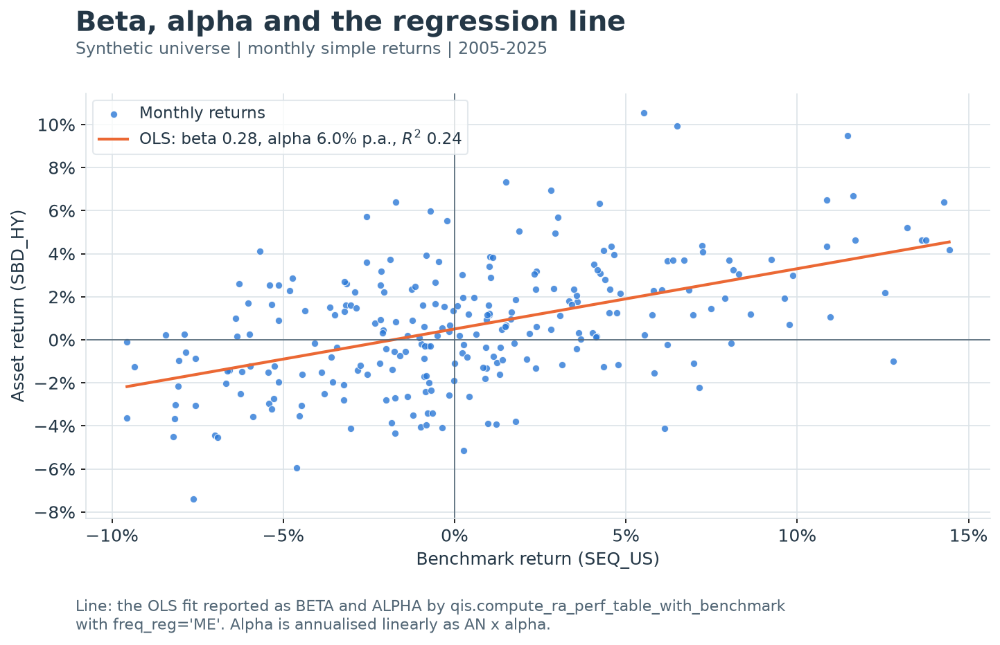

---
myst:
  html_meta:
    description: >-
      Single-index alpha, beta and R-squared, active-return tracking error and information
      ratio, and lagged EWMA benchmark-beta return attribution, as computed by qis.
---

# Alpha, beta and benchmark-relative performance

*Author: [Artur Sepp](https://github.com/ArturSepp)*

Implemented in [qis — Quantitative Investment Strategies](https://github.com/ArturSepp/QuantInvestStrats).
Software citation: [CITATION.cff](https://github.com/ArturSepp/QuantInvestStrats/blob/main/CITATION.cff).

Benchmark-relative performance splits a portfolio's return into a part explained by exposure to a
benchmark and a part that is not. Beta is the slope of the portfolio return on the benchmark
return, alpha is the intercept, and $R^2$ is the share of variance the benchmark explains
([Jensen, 1968](https://doi.org/10.1111/j.1540-6261.1968.tb00815.x)). The active return, the
plain difference of the two returns, has its own volatility, the tracking error, and its own
Sharpe ratio, the information ratio. This chapter defines the three objects, shows where they
disagree, and states exactly what qis computes for each.

## Overview

qis answers the benchmark question with five families of entry points. They answer different
sub-questions, and their numbers need not agree.

| Question | qis entry point | Output |
|---|---|---|
| Full-sample alpha, beta, $R^2$ and alpha p-value against a benchmark | `qis.compute_ra_perf_table_with_benchmark` | `PerfStat.ALPHA`, `ALPHA_AN`, `BETA`, `R2`, `ALPHA_PVALUE` columns |
| Whole-sample tracking error and information ratio of active returns | `qis.compute_te_ir_errors`, `qis.compute_info_ratio_table` | TE and IR per column |
| Time-varying one-factor beta and alpha of return series | `qis.compute_ewm_beta_alpha_forecast` | EWMA beta, alpha, prediction and $R^2$ frames |
| Holdings-based portfolio beta to one or several benchmarks | `qis.compute_portfolio_ewm_benchmark_betas`, `PortfolioData.compute_portfolio_benchmark_betas` | Portfolio beta per benchmark and date |
| Each period's return split into benchmark contributions and a residual | `qis.compute_portfolio_benchmark_ewm_beta_alpha_attribution`, `qis.compute_benchmarks_beta_attribution_from_prices`, `qis.compute_benchmarks_beta_attribution_from_returns`, `PortfolioData.compute_portfolio_benchmark_attribution` | Additive contributions plus an `Alpha` column |

The chapter's main messages:

1. The table's alpha and beta are a full-sample ordinary least squares (OLS) fit on the grid
   `PerfParams.freq_reg`, quarterly by default. They describe the sample; they are not point in
   time.
2. `ALPHA_AN` annualises alpha linearly, $\mathrm{AN}\,\hat\alpha$. Scatter-plot legends can
   show $e^{\mathrm{AN}\hat\alpha}-1$ instead. The two conventions differ at second order.
3. Alpha is estimated with a standard error of about the residual volatility divided by the
   square root of the sample length. When $R^2$ is low, alpha is as noisy as a mean return.
4. Tracking error is the volatility of the return *difference*. It is not the difference of
   volatilities, and when $\beta\neq1$ it contains a beta-mismatch term as well as residual risk.
5. The attribution applies the beta estimated at $t-1$ to the benchmark return over $(t-1,t]$,
   so it is point in time. Its residual is booked as `Alpha`.

Ex-ante and EWMA realised tracking error are covered in
[Tracking error and benchmark-relative risk](tracking_error_and_risk.md); this chapter only uses
the whole-sample estimators and links to that chapter for the rest.

## Inputs, notation, and assumptions

| Convention | This article |
|---|---|
| Return basis | Table regression: simple returns (`is_log_returns=False`), in excess of cash on both sides when `PerfParams.rates_data` is set. EWMA betas: log returns. Attribution: simple returns |
| Sampling grid | `PerfParams.freq_reg`, default `QE`; with `perf_params=None` the grid is inferred from the price index. EWMA betas and attribution: `freq_beta`, default the input grid |
| Annualisation | `ALPHA_AN` is $\mathrm{AN}\,\hat\alpha$ with $\mathrm{AN}$ of `freq_reg`; TE is $\sqrt{\mathrm{AN}}\,s(x)$ and IR is $\sqrt{\mathrm{AN}}\,\bar x/s(x)$ with $\mathrm{AN}$ inferred from the return index; beta and $R^2$ are not annualised |
| Mean adjustment | OLS with an intercept and a centred $R^2$; TE demeaned with `ddof=1`; EWMA betas demeaned by an EWMA mean (`MeanAdjType.EWMA`) |
| Timing | Table statistics and TE/IR are full-sample and descriptive. Attribution applies the beta known at $t-1$ to the return over $(t-1,t]$ |
| Output units | Alpha as a decimal return per `freq_reg` period (`ALPHA`) and per year (`ALPHA_AN`); beta, IR dimensionless; $R^2$ in $[0,1]$; TE annualised decimal |
| qis default | `compute_ra_perf_table_with_benchmark(perf_params=None, is_log_returns=False, drop_benchmark=False)`; `PerfParams()` has `freq_reg='QE'`, `rates_data=None` |

| Symbol or input | Meaning | Units and convention |
|---|---|---|
| $r_{p,t}$, $r_{b,t}$ | Portfolio and benchmark simple returns over $(t-1,t]$ | Decimal per period of the grid; $p$ and $b$ are labels, not indices |
| $\tilde r_{p,t}$, $\tilde r_{b,t}$ | Returns in excess of the cash return $r^{f}_t$ | Used by the table when `rates_data` is given |
| $x_t=r_{p,t}-r_{b,t}$ | Active return | Decimal per period |
| $\hat\alpha$, $\hat\beta$, $\hat\varepsilon_t$ | OLS intercept, slope and residual | Alpha per period; beta dimensionless |
| $\alpha_J$ | Jensen's alpha: the intercept of the excess-return regression | Per period |
| $\hat\alpha_{\mathrm{an}}$ | Annualised alpha, the column `ALPHA_AN` | Decimal per year |
| $S_{bb}$, $S_{pp}$, $S_{bp}$ | Centred sums of squares and cross-products over the sample | For example $S_{bp}=\sum_t(r_{b,t}-\bar r_b)(r_{p,t}-\bar r_p)$ |
| $\hat\rho$, $R^2$ | Sample correlation of $r_p$ and $r_b$; coefficient of determination | Dimensionless |
| $s_\varepsilon$ | Residual standard error, $\sum_t\hat\varepsilon_t^2/(T-2)$ under the root | Per period |
| $\mathrm{se}(\cdot)$ | Classical OLS standard error | Units of the estimate |
| $\hat\sigma_b^2$ | Benchmark variance with divisor $T$, $S_{bb}/T$ | Per period squared |
| $q$, $Q$ | Benchmark index and number of benchmarks in the attribution | $q=1,\ldots,Q$ |
| $\beta_{i,q,t}$, $\beta_{p,q,t}$ | EWMA beta of instrument $i$ and of the portfolio to benchmark $q$ at $t$ | Uses returns up to and including $t$ |
| $m_t$, $C_{i,t}$, $V_t$ | EWMA mean, cross-moment vector and benchmark second-moment matrix | Local to the EWMA recursion |
| $A_{q,t}$ | Return attributed to benchmark $q$ over $(t-1,t]$ | Decimal per period |
| $\eta_t$ | Attribution residual, the column `Alpha` | Decimal per period |
| $\lambda$, $N$ | EWM decay and span, $\lambda=1-2/(N+1)$ | `factor_beta_span` or `span` is $N$ |
| $\mathrm{AN}$, $Y$ | Periods per year; elapsed years $T/\mathrm{AN}$ | 12 for `ME`, 4 for `QE` |

Inputs are price or NAV levels with a sorted `DatetimeIndex`. The benchmark is either a column of
`prices` (argument `benchmark`) or a separate Series (`benchmark_price`). Each asset is regressed
on the benchmark over their joint sampled history, so rows with different inception dates use
different samples.

## Methodology

### The single-index regression

**Definition (single-index regression).** For $T$ returns on one sampling grid,

$$
r_{p,t}=\alpha+\beta\,r_{b,t}+\varepsilon_t ,
\qquad t=1,\ldots,T .
$$

The OLS estimates are

$$
\hat\beta=\frac{S_{bp}}{S_{bb}}=\hat\rho\,\frac{s(r_p)}{s(r_b)},
\qquad
\hat\alpha=\bar r_p-\hat\beta\,\bar r_b .
$$

Beta is the benchmark exposure: a benchmark move of 1% comes with a portfolio move of
$\hat\beta$ percent on average. Alpha is the mean return per period not explained by that
exposure. Jensen (1968) states the regression in excess returns,
$\tilde r_{p,t}=\alpha_J+\beta\,\tilde r_{b,t}+\varepsilon_t$, so that $\alpha_J$ is the return
above the security market line at the portfolio's beta. Sharpe (1966) ranks funds by reward to
variability, return per unit of total volatility; Jensen's alpha measures the return left after
paying for benchmark exposure.

`qis.compute_ra_perf_table_with_benchmark` computes, for every column including the benchmark:

1. prices sampled on `PerfParams.freq_reg` with forward fill, each column cut after its own last
   observation;
2. simple returns, or log returns when `is_log_returns=True`;
3. excess returns when `PerfParams.rates_data` is set, with the same cash return
   $r^{f}_t$ (the rate one observation earlier, accrued ACT/365, as in
   [Notation and conventions](notation_and_conventions.md)) subtracted from both sides;
4. OLS with an intercept on the rows where both the column and the benchmark are finite.

**Proposition (total-return alpha).** If the cash return is a constant $r^{f}$ per period, the
total-return regression has the same slope as Jensen's regression and the intercept

$$
\hat\alpha=\hat\alpha_J+(1-\hat\beta)\,r^{f} .
$$

**Proof.** Shifting both series by the constant $r^{f}$ leaves the centred sums, hence
$\hat\beta$, unchanged. Then
$\hat\alpha=(\bar{\tilde r}_p+r^{f})-\hat\beta(\bar{\tilde r}_b+r^{f})=\hat\alpha_J+(1-\hat\beta)r^{f}$.
$\square$

With a time-varying cash rate the relation holds approximately. The consequence is systematic:
without `rates_data`, a defensive portfolio reports cash carry as alpha.

> **Pitfall.** With $\beta=0.5$ and a 4% cash rate, 2% per annum of the table's alpha is
> $(1-\beta)r^{f}$, not skill. Set `PerfParams.rates_data` to report Jensen's alpha. The
> combination `is_log_returns=True` with `rates_data` subtracts a simple cash return from a log
> return, a mixed basis that the table does not flag.

**Identity ($R^2$ is the squared correlation).** With one regressor and an intercept,

$$
R^2=1-\frac{\sum_t\hat\varepsilon_t^2}{S_{pp}}=\frac{S_{bp}^2}{S_{bb}\,S_{pp}}=\hat\rho^{2} .
$$

**Proof.** The residual is $\hat\varepsilon_t=(r_{p,t}-\bar r_p)-\hat\beta(r_{b,t}-\bar r_b)$, so
$\sum_t\hat\varepsilon_t^2=S_{pp}-2\hat\beta S_{bp}+\hat\beta^2S_{bb}=S_{pp}-S_{bp}^2/S_{bb}$.
Divide by $S_{pp}$. $\square$

A by-product used below is $\sum_t\hat\varepsilon_t^2=S_{pp}(1-R^2)$: residual risk is total risk
scaled by $\sqrt{1-R^2}$.



[Open full-resolution preview](images/handbook_benchmark_regression.png).

The exhibit regresses the monthly simple returns of the synthetic high-yield index on those of
the synthetic US equity benchmark with `freq_reg='ME'`. The slope $\hat\beta=0.28$ and the
intercept, annualised linearly to $12\hat\alpha=6.0\%$, are the `BETA` and `ALPHA_AN` columns of
`qis.compute_ra_perf_table_with_benchmark`, and $R^2=0.24$ is the squared sample correlation of
the two series. Three quarters of the asset's variance is residual, which is why its alpha is
estimated far less precisely than its beta (see [Inference for alpha](#inference-for-alpha)).

### Annualising alpha

**Definition.** `PerfStat.ALPHA` is $\hat\alpha$ per `freq_reg` period, and `PerfStat.ALPHA_AN`
is

$$
\hat\alpha_{\mathrm{an}}=\mathrm{AN}\,\hat\alpha ,
$$

with $\mathrm{AN}$ from `qis.get_annualization_factor(freq_reg)`. This is the arithmetic-mean
convention: $\hat\alpha$ is a difference of means, and means annualise by $\mathrm{AN}$.

Scatter-plot legends use another convention. `qis.plot_scatter` and `qis.plot_returns_scatter`
format the fitted equation with the internal helper `qis.utils.regression.reg_model_params_to_str`.
When the keyword `alpha_an_factor` is passed through their keyword arguments, the legend prints
$e^{\mathrm{AN}\hat\alpha}-1$ as a whole percentage. Without it, the legend prints the
per-period intercept as a two-decimal number, which rounds a typical monthly alpha to `+0.00`.

**Proposition (gap between the conventions).** For $z=\mathrm{AN}\hat\alpha$,

$$
e^{z}-1-z=\tfrac12 z^{2}e^{\xi}\quad\text{for some }\xi\text{ between }0\text{ and }z .
$$

**Proof.** Taylor's theorem with the Lagrange remainder applied to $e^{z}$ at $0$. $\square$

The gap is $0.5$ basis points at $z=1\%$ and $2.14$ percentage points at $z=20\%$
($22.14\%$ against $20\%$). It is asymmetric: $z=-20\%$ prints as $-18.13\%$. The exponential
form is the exact compounding of an intercept estimated on log returns. For a simple-return
intercept, neither form is a compounded return, because the intercept is not a return that can be
held without the benchmark leg.

The annual figure also depends on the grid. A quarterly regression uses compounded quarterly
returns and fewer observations, so `ALPHA_AN` from `QE` and from `ME` differ by more than rounding
(0.93% against 0.98% in the worked example).

> **Insight.** `freq_reg='QE'` is a deliberate default. Asynchronous closing times and stale
> prices bias daily betas towards zero and push the missing exposure into alpha
> ([Scholes and Williams, 1977](https://doi.org/10.1016/0304-405X%2877%2990041-1);
> [Dimson, 1979](https://doi.org/10.1016/0304-405X%2879%2990013-8)). Quarterly returns
> aggregate the lagged responses at the cost of fewer observations. Calling
> `compute_ra_perf_table_with_benchmark` with `perf_params=None` does not use this default: it
> builds `PerfParams(freq=pd.infer_freq(prices.index))`, which sets `freq_reg` to the native grid
> of the prices, `B` for a regular business-day index. Only when no frequency can be inferred
> does `QE` apply.

### Inference for alpha

**Definition (classical standard errors).** With
$s_\varepsilon^2=\frac{1}{T-2}\sum_t\hat\varepsilon_t^2$,

$$
\mathrm{se}(\hat\alpha)^2=s_\varepsilon^2\left(\frac{1}{T}+\frac{\bar r_b^2}{S_{bb}}\right),
\qquad
\mathrm{se}(\hat\beta)^2=\frac{s_\varepsilon^2}{S_{bb}} .
$$

`ALPHA_PVALUE` is the two-sided p-value of $H_0:\alpha=0$ from the Student $t$ distribution with
$T-2$ degrees of freedom, the default non-robust statsmodels OLS inference. It assumes
uncorrelated, homoskedastic residuals. It is not adjusted for serial correlation, for
heteroskedasticity, or for the number of rows tested in one table.

Heteroskedasticity- and autocorrelation-consistent (HAC) inference is available but is not used
by the table: the internal `qis.utils.regression.estimate_ols_alpha_beta_hac` (Bartlett kernel,
`hac_lags=3` by default, normal reference) and the public `qis.estimate_ewma_alpha_beta_hac`
(EWMA-weighted least squares with Bartlett HAC). Their construction, lag choice and the
[Newey and West (1987)](https://www.nber.org/papers/t0055) estimator are covered in
[Regression and HAC inference](regression_and_hac.md).

**Proposition (alpha is noisy).** The standard error of alpha is

$$
\mathrm{se}(\hat\alpha)=\frac{s_\varepsilon}{\sqrt{T}}\sqrt{1+\frac{\bar r_b^{2}}{\hat\sigma_b^{2}}},
\qquad
s_\varepsilon^{2}=\frac{T-1}{T-2}\,s(r_p)^{2}\,(1-R^{2}) .
$$

**Proof.** Factor $1/T$ out of the bracket in the definition and use $S_{bb}=T\hat\sigma_b^2$.
For the second equality, $\sum_t\hat\varepsilon_t^2=S_{pp}(1-R^2)$ and $S_{pp}=(T-1)s(r_p)^2$.
$\square$

The correction factor involves the benchmark's per-period mean-to-volatility ratio, which is
small: at 8% per annum and 16% volatility on monthly data it adds about 1%. Hence
$\mathrm{se}(\hat\alpha)\approx s_\varepsilon/\sqrt{T}$ per period, and for the annualised alpha

$$
\mathrm{se}(\mathrm{AN}\,\hat\alpha)\approx\frac{\sqrt{\mathrm{AN}}\,s_\varepsilon}{\sqrt{Y}},
\qquad Y=\frac{T}{\mathrm{AN}} .
$$

The $t$-statistic of alpha is therefore about the residual information ratio,
$\mathrm{AN}\hat\alpha/(\sqrt{\mathrm{AN}}\,s_\varepsilon)$, times $\sqrt{Y}$: the rule of
thumb $t\approx\mathrm{IR}\sqrt{Y}$ of Grinold and Kahn (2000), with IR the residual ratio.

When $R^2$ is low, $s_\varepsilon$ is close to the portfolio's own volatility. For a 15% volatile
fund with $R^2=10\%$ and five years of data, the standard error of annualised alpha is about
$15\%\times\sqrt{0.9}/\sqrt{5}\approx6.4\%$. A reported alpha of 3% then has a $t$-statistic
near 0.5 and carries almost no information. A high $R^2$ does not rescue alpha either; it only
shrinks $s_\varepsilon$.

> **Insight.** Sampling more often helps beta but not alpha. Over a fixed calendar span,
> $\mathrm{se}(\hat\beta)\approx s_\varepsilon/(\sqrt{T}\,\hat\sigma_b)$: the ratio
> $s_\varepsilon/\hat\sigma_b$ does not depend on the period length, so the error falls as $T$
> grows. $\mathrm{se}(\mathrm{AN}\hat\alpha)$ depends on the calendar length $Y$ only. Monthly
> instead of quarterly returns sharpen beta, subject to the asynchronous-price bias above; they do
> not make a six-year alpha significant.

### The benchmark row and degenerate samples

The benchmark is regressed on itself: $\hat\alpha=0$ up to rounding, $\hat\beta=1$, $R^2=1$, and
the residuals vanish, so the $t$-statistic is undefined. qis sets the benchmark's
`ALPHA_PVALUE` to 1.0; with `drop_benchmark=True` the row is removed instead.

Other degenerate cases:

- Fewer than two joint observations: `ALPHA`, `BETA`, `R2` and `ALPHA_PVALUE` are missing.
- Exactly two: a perfect fit with $R^2=1$ and a missing p-value.
- An exception inside the fit: a warning and `(0, 0, 0, 0)`. The p-value of 0 reads as highly
  significant; check the warning log before trusting a zero row.
- A benchmark with zero returns over the sample: beta 0 and alpha equal to the mean return.
- A benchmark whose sampled returns are all equal and non-zero currently raises `IndexError`:
  statsmodels treats the regressor as the constant and returns a single coefficient.

### Active return, tracking error and information ratio

**Definition.** With $x_t=r_{p,t}-r_{b,t}$ on a regular grid,

$$
\mathrm{TE}=\sqrt{\mathrm{AN}}\,s(x),
\qquad
\mathrm{IR}=\frac{\sqrt{\mathrm{AN}}\,\bar x}{s(x)} .
$$

TE is the volatility and IR the Sharpe ratio of the active return
([Goodwin, 1998](https://doi.org/10.2469/faj.v54.n4.2196)). The active return is the return of a
zero-cost position, long the portfolio and short the benchmark, so cash cancels:
$\tilde r_{p,t}-\tilde r_{b,t}=x_t$. `qis.compute_te_ir_errors` implements these two formulas
with NaNs omitted per column; `qis.compute_info_ratio_table` applies it to a dictionary of
panels. [Tracking error and benchmark-relative risk](tracking_error_and_risk.md) covers the
EWMA realised and ex-ante versions.

Grinold and Kahn (2000) define the information ratio on *residual* return, annualised alpha over
annualised residual risk. qis does not report that residual ratio as a table column; the IR of
`compute_te_ir_errors` is the active-return version. The two coincide only when $\beta=1$.

**Proposition (TE is not a difference of volatilities).**

$$
s(x)^{2}=s(r_p)^{2}+s(r_b)^{2}-2\hat\rho\,s(r_p)\,s(r_b)
=\big(s(r_p)-s(r_b)\big)^{2}+2(1-\hat\rho)\,s(r_p)\,s(r_b) .
$$

**Proof.** The sample variance of a difference is the sum of the variances minus twice the
sample covariance, $\hat\rho\,s(r_p)s(r_b)$. The second form adds and subtracts
$2s(r_p)s(r_b)$. $\square$

The difference of volatilities is only a lower bound on TE, attained at $\hat\rho=1$. It can be
negative when the portfolio is less volatile than the benchmark; TE cannot. Controlling tracking
error alone leaves total risk and beta free:
[Roll (1992)](https://doi.org/10.3905/jpm.1992.701922) shows that portfolios minimising tracking
error for a target active return are not mean/variance efficient and typically carry a beta above
one.

**Proposition (active return through the regression).**

$$
\bar x=\hat\alpha+(\hat\beta-1)\,\bar r_b,
\qquad
s(x)^{2}=(\hat\beta-1)^{2}\,s(r_b)^{2}+\frac{1}{T-1}\sum_t\hat\varepsilon_t^{2} .
$$

**Proof.** $x_t=\hat\alpha+(\hat\beta-1)r_{b,t}+\hat\varepsilon_t$ holds for every $t$. With an
intercept the residuals sum to zero, which gives the mean. The residuals are also orthogonal to
the centred regressor, so the cross term vanishes in the centred sum of squares. $\square$

When $\beta\neq1$, the mean active return mixes alpha with a beta bet $(\hat\beta-1)\bar r_b$, and
tracking error mixes a beta-mismatch term with residual risk. A portfolio with $\beta=0.8$ can
have a negative IR in a strongly rising market despite a positive alpha, so IR and Jensen's alpha
can have opposite signs. Report both, together with beta.

### EWMA benchmark betas

Holdings-based betas track exposure through time. They are estimated per instrument and
aggregated with the portfolio weights.

**Definition (EWMA beta).** Let $\ell_{b,t}$ be the vector of the $Q$ benchmark log returns and
$\ell_{i,t}$ the log return of instrument $i$ on the grid `freq_beta`. Each series is demeaned by
its own EWMA mean, marked by a check accent, and

$$
\begin{aligned}
m_t&=\lambda\,m_{t-1}+(1-\lambda)\,\ell_t,\qquad \check\ell_t=\ell_t-m_t,\\
C_{i,t}&=\lambda\,C_{i,t-1}+(1-\lambda)\,\check\ell_{b,t}\,\check\ell_{i,t},\\
V_t&=\lambda\,V_{t-1}+(1-\lambda)\,\check\ell_{b,t}\,\check\ell_{b,t}^{\top},\\
\beta_{i,t}&=V_t^{-1}C_{i,t},
\end{aligned}
$$

where $\beta_{i,t}=(\beta_{i,1,t},\ldots,\beta_{i,Q,t})^{\top}$ and $\lambda=1-2/(N+1)$ with
$N$ = `factor_beta_span`. With several benchmarks this is a joint multivariate regression, not a
set of one-benchmark betas.

Implementation details of `qis.compute_portfolio_ewm_benchmark_betas`:

- The means start from zero at the first finite return (`InitType.X0` with a missing first
  return); $C$ and $V$ start from zero. The normalisation $1-\lambda^{t}$ is common to $C$ and
  $V$ and cancels in the ratio.
- Because $m_t$ includes $\ell_t$, $\check\ell_t=\lambda(\ell_t-m_{t-1})$. The factor $\lambda^2$
  cancels between $C$ and $V$, so the beta equals the one demeaned by the previous EWMA mean.
- Betas are missing on the first 21 dates of the grid, the start date and the first 20 returns
  (warm-up, `warmup_period=20`). A singular $V_t$ falls back to its diagonal; a missing return
  carries both moments forward.
- $\beta_{i,t}$ uses returns up to and including $t$ and is known at the close of $t$.

**Proposition (portfolio beta).** qis reports

$$
\beta_{p,q,t}=\sum_i w_{i,t}\,\beta_{i,q,t} .
$$

If the weights are constant over the EWMA memory and the portfolio log return is approximated by
$\sum_i w_i\ell_{i,t}$, this is the EWMA beta of the portfolio itself.

**Proof.** $V_t$ does not depend on the dependent series, and the EWMA demeaning and $C_{i,t}$ are
linear in it. Hence $V_t^{-1}C_t$ of a fixed linear combination of instruments is the same
combination of their betas. $\square$

Both conditions are approximations. Weighted log returns are not the portfolio log return (see
[Notation and conventions](notation_and_conventions.md)), and after a rebalance the holdings-based
beta moves at once while a beta estimated from the NAV would adjust over the EWMA memory.

After aggregation, dates whose portfolio beta is exactly zero are set to missing and forward
filled, to bridge holidays. A genuinely zero exposure, for example a portfolio fully in cash, is
therefore reported with the previous beta. `PortfolioData.compute_portfolio_benchmark_betas`
passes `PortfolioData.get_weights()`, which by default samples weights weekly (`W-WED`) and
forward-fills them onto the price grid.

`qis.compute_ewm_beta_alpha_forecast` is the one-factor estimator for return series. With the
default `mean_adj_type=MeanAdjType.NONE` it uses second moments about zero, so for a benchmark
return $r_{b,t}$ and an asset return $r_{i,t}$,

$$
\beta_{i,t}=\frac{\mathrm{EWM}_t\big(r_b\,r_i\big)}{\mathrm{EWM}_t\big(r_b^{2}\big)},
\qquad
\alpha_{i,t}=\mathrm{EWM}_t\big(r_i-\beta_i\,r_b\big),
$$

where $\mathrm{EWM}_t$ is the recursion $m_t=\lambda m_{t-1}+(1-\lambda)z_t$ applied to the
bracketed series $z_t$. The residual inside $\alpha_{i,t}$ uses the same-date beta, and the
returned prediction $\beta_{i,t}r_{b,t}+\alpha_{i,t}$ uses $r_{i,t}$ through both terms; it is a
fit, not a forecast, unless the caller shifts it. The default `init_type=InitType.MEAN` seeds
the recursions with full-sample means, so early values depend on later data. Use
`InitType.X0` or `beta_init_value` for a point-in-time path, and shift the beta by one period
before applying it, as the model-layer attribution does
([Model-layer attribution](model_layer_attribution.md)).

### Beta attribution of returns

**Definition (beta attribution).** On the beta grid, with simple benchmark returns $r_{q,t}$ and
the simple NAV return $r_{p,t}$,

$$
A_{q,t}=\beta_{p,q,t-1}\,r_{q,t},
\qquad
\eta_t=r_{p,t}-\sum_{q=1}^{Q}A_{q,t} .
$$

By construction $r_{p,t}=\sum_qA_{q,t}+\eta_t$ in every period, and each term uses only the beta
known at $t-1$. The residual $\eta_t$ is the column named by `residual_name`, `Alpha` by default.

> **Pitfall.** The betas are estimated on EWMA-demeaned *log* returns, but the attribution
> multiplies them by *simple* benchmark returns and subtracts them from the *simple* NAV return.
> The basis mismatch is second order, about half a squared return per period, and $\eta_t$
> absorbs it. In the worked example the two bases give betas within 0.002 of each other; for
> volatile assets on a coarse grid the gap is larger.

**Proposition (beta level and beta timing).** Let $\bar\beta=\frac1T\sum_t\beta_{p,t-1}$ for a
single benchmark. Then

$$
\bar x=\bar\eta+(\bar\beta-1)\,\bar r_b
+\frac{1}{T}\sum_t\big(\beta_{p,t-1}-\bar\beta\big)\big(r_{b,t}-\bar r_b\big) .
$$

**Proof.** Substitute $r_{p,t}=\beta_{p,t-1}r_{b,t}+\eta_t$ into $x_t=r_{p,t}-r_{b,t}$ and
average. The mean of a product equals the product of the means plus the covariance with divisor
$T$. $\square$

The last term is beta timing: it is positive when exposure was higher before benchmark gains. A
full-sample regression with one constant beta has no term for it and cannot separate it from
alpha. The lagged attribution books it in the benchmark contributions $A_{q,t}$, not in
$\eta_t$.

While the lagged beta is still missing in the warm-up, $A_{q,t}$ is missing, the row sum skips it,
and $\eta_t=r_{p,t}$: the whole return is reported as `Alpha`. Start cumulative attribution after
the warm-up, for example with `time_period`, or drop those rows.

`qis.compute_benchmarks_beta_attribution_from_prices` applies the definition to a NAV and
benchmark prices reindexed with forward fill onto the beta dates.
`qis.compute_benchmarks_beta_attribution_from_returns` applies it to returns: benchmark returns
are reindexed onto the portfolio return dates without fill, the first row of the (optionally
clipped) output is set to zero, and `total_name` adds the total return as a column.

## Worked example

The example uses six years of month-end returns from a fixed seed. The benchmark has monthly
simple returns drawn with mean 0.6% and volatility 4.5%. The portfolio is
$r_{p,t}=0.001+0.8\,r_{b,t}+\varepsilon_t$ with residual volatility 0.5% per month, so the true
alpha is 1.2% per annum. With `PerfParams(freq='ME')` the table regression runs on the same
monthly returns, and it must equal a direct numpy OLS: $\hat\beta\approx0.805$,
$\hat\alpha\approx0.082\%$ per month, `ALPHA_AN` $\approx0.98\%$, and
$R^2\approx97.9\%=\hat\rho^2$ with $\hat\rho\approx0.990$. The alpha p-value is about 0.20. The
benchmark row has beta 1 and p-value 1.

```python
import numpy as np
import pandas as pd
from scipy import stats
import qis

rng = np.random.default_rng(20260725)
T = 72  # six years of month-end returns
dates = pd.date_range('2019-12-31', periods=T + 1, freq='ME')
r_b = rng.normal(0.006, 0.045, T)
r_p = 0.001 + 0.8 * r_b + rng.normal(0.0, 0.005, T)
prices = pd.DataFrame({'Benchmark': 100.0 * np.r_[1.0, np.cumprod(1.0 + r_b)],
                       'Portfolio': 100.0 * np.r_[1.0, np.cumprod(1.0 + r_p)]}, index=dates)

table = qis.compute_ra_perf_table_with_benchmark(prices=prices, benchmark='Benchmark',
                                                 perf_params=qis.PerfParams(freq='ME'))
row = table.loc['Portfolio']
ALPHA, ALPHA_AN, BETA, R2, P_ALPHA = (stat.to_str() for stat in (
    qis.PerfStat.ALPHA, qis.PerfStat.ALPHA_AN, qis.PerfStat.BETA, qis.PerfStat.R2,
    qis.PerfStat.ALPHA_PVALUE))

# independent OLS on the same monthly simple returns
X = np.column_stack([np.ones(T), r_b])
coef = np.linalg.solve(X.T @ X, X.T @ r_p)
resid = r_p - X @ coef
s_eps = np.sqrt(resid @ resid / (T - 2))
se = s_eps * np.sqrt(np.diag(np.linalg.inv(X.T @ X)))
p_value = 2.0 * stats.t.sf(abs(coef[0] / se[0]), df=T - 2)
rho = np.corrcoef(r_b, r_p)[0, 1]

np.testing.assert_allclose([row[ALPHA], row[BETA], row[R2], row[P_ALPHA]],
                           [coef[0], coef[1], rho ** 2, p_value], rtol=1e-9)
assert np.isclose(row[ALPHA_AN], 12.0 * coef[0], rtol=1e-12)
assert table.loc['Benchmark', P_ALPHA] == 1.0
assert np.isclose(table.loc['Benchmark', BETA], 1.0, rtol=1e-12)
assert abs(coef[1] - 0.805) < 5e-4 and abs(coef[0] - 0.00082) < 5e-6
assert abs(row[ALPHA_AN] - 0.0098) < 5e-5 and abs(rho ** 2 - 0.979) < 5e-4
assert abs(rho - 0.990) < 5e-4 and abs(p_value - 0.20) < 0.01
```

The alpha is not significant although $R^2$ is 97.9%. The residual standard error is
$s_\varepsilon\approx0.54\%$ per month, so
$\mathrm{se}(\hat\alpha)\approx s_\varepsilon/\sqrt{72}\approx0.064\%$ per month and the
$t$-statistic is about 1.28. Annualised, the residual volatility is 1.88% and the standard error
of `ALPHA_AN` is about $1.88\%/\sqrt{6}\approx0.77\%$. The same prices with the default
`PerfParams()` regress 24 quarterly returns: $\hat\alpha\approx0.231\%$ per quarter, `ALPHA_AN`
$\approx0.93\%$, $\hat\beta\approx0.784$ and p-value about 0.35. A legend with
`alpha_an_factor=12` shows $e^{12\hat\alpha}-1\approx0.99\%$, printed as `+1%`.

```python
# classical standard error of alpha and its residual-volatility approximation
assert abs(se[0] / (s_eps / np.sqrt(T)) - 1.0) < 0.01
assert abs(s_eps - 0.0054) < 5e-5 and abs(se[0] - 0.00064) < 5e-6
assert abs(coef[0] / se[0] - 1.28) < 5e-3
years = T / 12
assert abs(np.sqrt(12.0) * s_eps - 0.0188) < 5e-5
assert np.isclose(12.0 * se[0], np.sqrt(12.0) * s_eps / np.sqrt(years), rtol=0.01)

# default PerfParams(): quarterly grid, AN = 4
table_q = qis.compute_ra_perf_table_with_benchmark(prices=prices, benchmark='Benchmark',
                                                   perf_params=qis.PerfParams())
quarterly = prices.iloc[::3].pct_change().dropna()  # 2019-12-31 is a quarter-end
assert len(quarterly) == 24 and quarterly.index[-1] == pd.Timestamp('2025-12-31')
Xq = np.column_stack([np.ones(len(quarterly)), quarterly['Benchmark']])
coef_q = np.linalg.solve(Xq.T @ Xq, Xq.T @ quarterly['Portfolio'].to_numpy())
q_row = table_q.loc['Portfolio']
np.testing.assert_allclose([q_row[ALPHA], q_row[BETA]], coef_q, rtol=1e-9)
assert np.isclose(q_row[ALPHA_AN], 4.0 * coef_q[0], rtol=1e-12)
assert abs(q_row[ALPHA] - 0.00231) < 5e-6 and abs(q_row[ALPHA_AN] - 0.0093) < 5e-5
assert abs(q_row[BETA] - 0.784) < 5e-4 and abs(q_row[P_ALPHA] - 0.35) < 0.01

# legend convention against the linear table convention
assert abs(np.expm1(12.0 * coef[0]) - 0.0099) < 5e-5
assert abs(np.expm1(0.20) - 0.2214) < 5e-5 and abs(np.expm1(-0.20) + 0.1813) < 5e-5
```

The portfolio is less volatile than the benchmark, 13.0% against 16.0% per annum, so the
difference of volatilities is $-3.0\%$. The tracking error is 3.63% and the information ratio
0.21. The regression decomposition splits the tracking error into a beta-mismatch part of 3.11%
and a residual part of 1.87%, with $3.11^2+1.87^2\approx3.63^2$ in squared percentage points.
The mean active return, 0.75% per annum, is the 0.98% alpha less 0.24% from the beta bet on a
benchmark that returned only 0.10% per month in this sample.

```python
active = pd.DataFrame({'Portfolio': r_p - r_b}, index=dates[1:])
te, ir = qis.compute_te_ir_errors(return_diffs=active)
s_p, s_b = r_p.std(ddof=1), r_b.std(ddof=1)

# TE from volatilities and correlation, not from their difference
assert np.isclose(te.iloc[0], np.sqrt(12.0 * (s_p ** 2 + s_b ** 2 - 2.0 * rho * s_p * s_b)),
                  rtol=1e-12)
assert abs(np.sqrt(12.0) * s_p - 0.130) < 5e-4 and abs(np.sqrt(12.0) * s_b - 0.160) < 5e-4
assert abs(np.sqrt(12.0) * (s_p - s_b) + 0.030) < 5e-4
assert abs(te.iloc[0] - 0.0363) < 5e-5 and abs(ir.iloc[0] - 0.21) < 5e-3

# beta-mismatch and residual parts of TE, and the mean active return
mismatch = np.sqrt(12.0) * abs(coef[1] - 1.0) * s_b
residual = np.sqrt(12.0 * (resid @ resid) / (T - 1))
assert np.isclose(te.iloc[0] ** 2, mismatch ** 2 + residual ** 2, rtol=1e-12)
assert abs(mismatch - 0.0311) < 5e-5 and abs(residual - 0.0187) < 5e-5
x = r_p - r_b
assert np.isclose(x.mean(), coef[0] + (coef[1] - 1.0) * r_b.mean(), rtol=1e-12)
assert abs(12.0 * x.mean() - 0.0075) < 5e-5 and abs(r_b.mean() - 0.0010) < 5e-5
assert abs(12.0 * (coef[1] - 1.0) * r_b.mean() + 0.0024) < 5e-5
```

Finally, a fund holds 60% in the portfolio and 40% in the benchmark, rebalanced monthly. Its
EWMA benchmark beta with span 24 is computed by qis and, independently, by the recursion of the
Methodology section on log returns. The benchmark's beta to itself is 1, so the fund beta is 0.6
times the portfolio sleeve's beta plus 0.4. The first beta is dated 2021-09-30, after the 21-row
warm-up; the last is about 0.87, against $0.6\times0.805+0.4\approx0.88$ from the full-sample
regression. The attribution uses the previous month's beta times the simple benchmark return and
reconciles exactly to the fund return. During the warm-up, the 21 monthly returns are booked
entirely as `Alpha`.

```python
weights = pd.DataFrame({'Portfolio': 0.6, 'Benchmark': 0.4}, index=dates)
fund_r = 0.6 * r_p + 0.4 * r_b  # monthly rebalanced to fixed weights
fund_nav = pd.Series(100.0 * np.r_[1.0, np.cumprod(1.0 + fund_r)], index=dates, name='Fund')
span = 24
betas = qis.compute_portfolio_ewm_benchmark_betas(
    instrument_prices=prices, weights=weights, benchmark_prices=prices[['Benchmark']],
    factor_beta_span=span)
attribution = qis.compute_portfolio_benchmark_ewm_beta_alpha_attribution(
    instrument_prices=prices, weights=weights, benchmark_prices=prices[['Benchmark']],
    portfolio_nav=fund_nav, factor_beta_span=span)

lam = 1.0 - 2.0 / (span + 1.0)


def ewm_beta(y, x, warmup=20):
    """EWMA-demeaned beta of y on x; the recursions start from zero."""
    beta = np.full(len(x), np.nan)
    m_x = m_y = c = v = 0.0
    for t in range(1, len(x)):
        m_x = lam * m_x + (1.0 - lam) * x[t]
        m_y = lam * m_y + (1.0 - lam) * y[t]
        c = lam * c + (1.0 - lam) * (x[t] - m_x) * (y[t] - m_y)
        v = lam * v + (1.0 - lam) * (x[t] - m_x) ** 2
        if t > warmup:
            beta[t] = c / v
    return beta


l_b, l_p = np.r_[np.nan, np.log1p(r_b)], np.r_[np.nan, np.log1p(r_p)]
beta_fund = 0.6 * ewm_beta(l_p, l_b) + 0.4 * ewm_beta(l_b, l_b)
np.testing.assert_allclose(betas['Benchmark'].to_numpy(), beta_fund, rtol=1e-10)
assert betas['Benchmark'].first_valid_index() == pd.Timestamp('2021-09-30')
assert abs(beta_fund[-1] - 0.87) < 5e-3

# log-return betas against simple-return betas: a second-order difference
beta_simple = 0.6 * ewm_beta(np.r_[np.nan, r_p], np.r_[np.nan, r_b]) + 0.4
assert np.nanmax(np.abs(beta_fund - beta_simple)) < 0.0025

# attribution: beta at t-1 times the simple benchmark return over (t-1, t]
np.testing.assert_allclose(attribution['Benchmark'].to_numpy(),
                           np.r_[np.nan, beta_fund[:-1] * r_b], rtol=1e-10, atol=1e-15)
np.testing.assert_allclose(attribution.sum(axis=1).iloc[1:], fund_r, atol=1e-14)

# warm-up: while the lagged beta is missing, the whole return is reported as Alpha
warm = attribution['Benchmark'].isna().to_numpy()[1:]
assert warm.sum() == 21
np.testing.assert_allclose(attribution['Alpha'].iloc[1:][warm], fund_r[warm], atol=1e-14)

# beta level and beta timing after the warm-up
b_lag, r_bt, x_f = beta_fund[:-1][~warm], r_b[~warm], (fund_r - r_b)[~warm]
eta = attribution['Alpha'].iloc[1:][~warm].to_numpy()
timing = np.mean((b_lag - b_lag.mean()) * (r_bt - r_bt.mean()))
assert np.isclose(x_f.mean(), eta.mean() + (b_lag.mean() - 1.0) * r_bt.mean() + timing,
                  rtol=1e-10)
```

After the warm-up, the residual averages 0.068% per month against a true fund alpha of
$0.6\times0.1\%=0.06\%$. The beta-timing term is $-0.023\%$ per month, noise around zero,
because the synthetic fund does not time its exposure.

## Implementation in qis

| Quantity | Formula | qis entry point |
|---|---|---|
| Alpha, beta, $R^2$ | OLS of $r_p$ (or $\tilde r_p$) on $r_b$ (or $\tilde r_b$) on `freq_reg` | `qis.compute_ra_perf_table_with_benchmark` columns `PerfStat.ALPHA`, `PerfStat.BETA`, `PerfStat.R2`; internal `qis.utils.regression.estimate_ols_alpha_beta` |
| Annualised alpha | $\mathrm{AN}\,\hat\alpha$ with $\mathrm{AN}$ of `freq_reg` | `PerfStat.ALPHA_AN` |
| Alpha p-value | Student $t$, $T-2$ degrees of freedom, classical standard error; 1.0 for the benchmark row | `PerfStat.ALPHA_PVALUE` |
| Legend alpha | $e^{\mathrm{AN}\hat\alpha}-1$ when `alpha_an_factor` is passed | `qis.plot_scatter`, `qis.plot_returns_scatter`; internal `qis.utils.regression.reg_model_params_to_str` |
| HAC alpha inference | Bartlett-kernel HAC standard error | internal `qis.utils.regression.estimate_ols_alpha_beta_hac`; `qis.estimate_ewma_alpha_beta_hac` |
| Tracking error, information ratio | $\sqrt{\mathrm{AN}}\,s(x)$, $\sqrt{\mathrm{AN}}\,\bar x/s(x)$ | `qis.compute_te_ir_errors`, `qis.compute_info_ratio_table` |
| One-factor EWMA beta and alpha | $\mathrm{EWM}(r_br_i)/\mathrm{EWM}(r_b^2)$, $\mathrm{EWM}(r_i-\beta_ir_b)$ | `qis.compute_ewm_beta_alpha_forecast` |
| Portfolio EWMA benchmark betas | $\sum_iw_{i,t}\beta_{i,q,t}$ on log returns | `qis.compute_portfolio_ewm_benchmark_betas`, `PortfolioData.compute_portfolio_benchmark_betas` |
| Beta attribution | $A_{q,t}=\beta_{p,q,t-1}r_{q,t}$, $\eta_t=r_{p,t}-\sum_qA_{q,t}$ | `qis.compute_benchmarks_beta_attribution_from_prices`, `qis.compute_benchmarks_beta_attribution_from_returns` |
| Betas and attribution in one call | both of the above | `qis.compute_portfolio_benchmark_ewm_beta_alpha_attribution`, `PortfolioData.compute_portfolio_benchmark_attribution` |
| Rendered table | selected `PerfStat` columns | `qis.plot_ra_perf_table_benchmark`, `PortfolioData.plot_ra_perf_table` with `BENCHMARK_TABLE_COLUMNS` |

Defaults verified with `inspect.signature`:

| Function | Defaults |
|---|---|
| `qis.compute_ra_perf_table_with_benchmark` | `benchmark=None`, `benchmark_price=None`, `perf_params=None`, `is_log_returns=False`, `drop_benchmark=False` |
| `qis.PerfParams` | `freq=None`, `freq_vol='ME'`, `freq_reg='QE'`, `rates_data=None`; passing `freq` sets `freq_reg` too |
| `qis.compute_portfolio_ewm_benchmark_betas` | `freq_beta=None`, `factor_beta_span=63`, `mean_adj_type=MeanAdjType.EWMA` |
| `qis.compute_portfolio_benchmark_ewm_beta_alpha_attribution` | `freq_beta=None`, `factor_beta_span=63`, `residual_name='Alpha'` |
| `PortfolioData.compute_portfolio_benchmark_betas` | `freq_beta=None`, `factor_beta_span=65` |
| `PortfolioData.compute_portfolio_benchmark_attribution` | `freq_beta='B'`, `factor_beta_span=63` |
| `qis.compute_ewm_beta_alpha_forecast` | `span=None`, `ewm_lambda=0.94`, `mean_adj_type=MeanAdjType.NONE`, `init_type=InitType.MEAN`, `beta_init_value=None`, `annualize=False` |

With their defaults, the two `PortfolioData` methods estimate betas with different spans and
grids. Pass `freq_beta` and `factor_beta_span` explicitly when a beta chart and an attribution
chart must describe the same betas, as the strategy factsheet does.

Sources:
[perf_stats.py](https://github.com/ArturSepp/QuantInvestStrats/blob/main/src/qis/perfstats/perf_stats.py),
[regression.py](https://github.com/ArturSepp/QuantInvestStrats/blob/main/src/qis/utils/regression.py),
[ex_post_tracking_error.py](https://github.com/ArturSepp/QuantInvestStrats/blob/main/src/qis/portfolio/risk/ex_post_tracking_error.py),
[factor_model.py](https://github.com/ArturSepp/QuantInvestStrats/blob/main/src/qis/portfolio/risk/factor_model.py),
[ewm_factor_model.py](https://github.com/ArturSepp/QuantInvestStrats/blob/main/src/qis/portfolio/risk/ewm_factor_model.py),
[ewm.py](https://github.com/ArturSepp/QuantInvestStrats/blob/main/src/qis/models/linear/ewm.py) and
[portfolio_data.py](https://github.com/ArturSepp/QuantInvestStrats/blob/main/src/qis/portfolio/portfolio_data.py).

## Interpretation and limitations

- **Alpha is relative to the chosen benchmark.** An omitted factor, such as size, credit or
  carry, shows up as alpha. A different benchmark gives a different alpha for the same fund.
- **Full-sample statistics are descriptive.** The table's alpha, beta and p-value use the whole
  sample; they are not forecasts and must not drive decisions inside a backtest. Use the lagged
  EWMA betas for point-in-time exposure.
- **Linear beta misses convexity.** Options, trend-following and other state-dependent exposures
  have betas that change with the market regime
  ([Sepp, 2019](https://thehedgefundjournal.com/trend-following-ctas-vs-alternative-risk-premia/)).
  `qis.plot_returns_scatter` fits a quadratic by default (`order=2`), and
  [Regime-conditional performance](regime_conditional_performance.md) conditions on regimes.
- **Smoothed or stale returns** bias beta down and move exposure into alpha; see
  [Private-asset unsmoothing](private_asset_unsmoothing.md) and
  [Serial dependence and autocorrelation](serial_dependence.md).
- **Rows use different samples.** Each asset is regressed over its joint history with the
  benchmark, so alphas of assets with different inception dates are not directly comparable.
- **Two columns, one header.** `PerfStat.ALPHA` and `PerfStat.ALPHA_AN` share the short label
  `Alpha`, which wide rendered tables use as the column header. `LN_BENCHMARK_TABLE_COLUMNS`
  selects the per-period `ALPHA`; `BENCHMARK_TABLE_COLUMNS` selects `ALPHA_AN`.
- **Cumulated attribution is a sum.** Factsheets plot the cumulative sum of $A_{q,t}$ and
  $\eta_t$. The sum is additive across components but is not the compounded return.
- **Zero beta is overwritten.** An exact zero portfolio beta is treated as a holiday and replaced
  by the previous value.

## See also

- [Tracking error and benchmark-relative risk](tracking_error_and_risk.md)
- [Regression and HAC inference](regression_and_hac.md)
- [Exponentially weighted estimators](ewm_estimators.md)
- [The performance-statistic catalogue](performance_statistics.md)
- [Returns, NAVs, excess returns, fees and leverage](returns_and_navs.md)
- [Model-layer attribution](model_layer_attribution.md)
- [Factor risk models](factor_risk_models.md)
- [Signal diagnostics: information coefficient and information ratio](signal_diagnostics.md)
- [Reporting frequency and annualisation](frequency_convention_note.md)
- {doc}`compute_ra_perf_table_with_benchmark API <api/generated/qis.compute_ra_perf_table_with_benchmark>`
- {doc}`compute_te_ir_errors API <api/generated/qis.compute_te_ir_errors>`
- {doc}`compute_portfolio_benchmark_ewm_beta_alpha_attribution API <api/generated/qis.compute_portfolio_benchmark_ewm_beta_alpha_attribution>`
- {doc}`compute_ewm_beta_alpha_forecast API <api/generated/qis.compute_ewm_beta_alpha_forecast>`

## References

1. Jensen, M. C. (1968). The Performance of Mutual Funds in the Period 1945–1964. *The Journal of Finance*, 23(2), 389–416. [DOI: 10.1111/j.1540-6261.1968.tb00815.x](https://doi.org/10.1111/j.1540-6261.1968.tb00815.x). Defines alpha as the intercept of the excess-return regression on the market.
2. Sharpe, W. F. (1966). Mutual Fund Performance. *The Journal of Business*, 39(1), 119–138. [DOI: 10.1086/294846](https://doi.org/10.1086/294846). Introduces the reward-to-variability ratio that the information ratio applies to active returns.
3. Goodwin, T. H. (1998). The Information Ratio. *Financial Analysts Journal*, 54(4), 34–43. [DOI: 10.2469/faj.v54.n4.2196](https://doi.org/10.2469/faj.v54.n4.2196). The information ratio of active returns, its estimation and interpretation.
4. Grinold, R. C., and Kahn, R. N. (2000). *Active Portfolio Management*, 2nd edition. McGraw-Hill. Residual information ratio and its relation to the $t$-statistic of alpha.
5. Roll, R. (1992). A Mean/Variance Analysis of Tracking Error. *The Journal of Portfolio Management*, 18(4), 13–22. [DOI: 10.3905/jpm.1992.701922](https://doi.org/10.3905/jpm.1992.701922). Tracking-error-efficient portfolios are not mean/variance efficient and typically have beta above one.
6. Newey, W. K., and West, K. D. (1987). A Simple, Positive Semi-Definite, Heteroskedasticity and Autocorrelation Consistent Covariance Matrix. *Econometrica*, 55(3), 703–708. [Working paper and published-version record](https://www.nber.org/papers/t0055). The HAC alternative to the table's classical standard errors.
7. Scholes, M., and Williams, J. (1977). Estimating Betas from Nonsynchronous Data. *Journal of Financial Economics*, 5(3), 309–327. [DOI: 10.1016/0304-405X(77)90041-1](https://doi.org/10.1016/0304-405X%2877%2990041-1). Bias of betas from non-synchronous prices.
8. Dimson, E. (1979). Risk Measurement When Shares Are Subject to Infrequent Trading. *Journal of Financial Economics*, 7(2), 197–226. [DOI: 10.1016/0304-405X(79)90013-8](https://doi.org/10.1016/0304-405X%2879%2990013-8). Aggregated-lag betas for infrequently traded assets.
9. Sepp, A. (2019). Trend-Following CTAs vs Alternative Risk-Premia: Crisis Beta vs Risk-Premia Alpha. *The Hedge Fund Journal*. [Article](https://thehedgefundjournal.com/trend-following-ctas-vs-alternative-risk-premia/). Regime-dependent betas of convex strategies.
10. Sepp, A. qis: Performance analytics, portfolio backtesting, risk analysis, and factsheet reporting in Python. [Software citation metadata](https://github.com/ArturSepp/QuantInvestStrats/blob/main/CITATION.cff).
