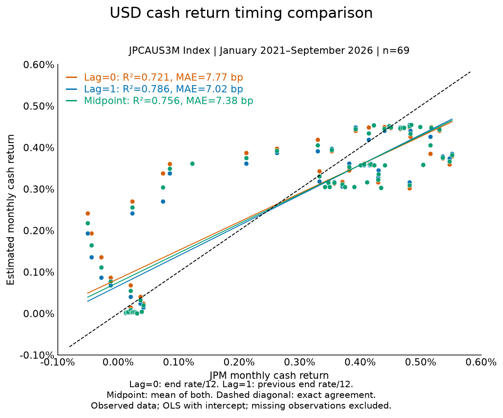
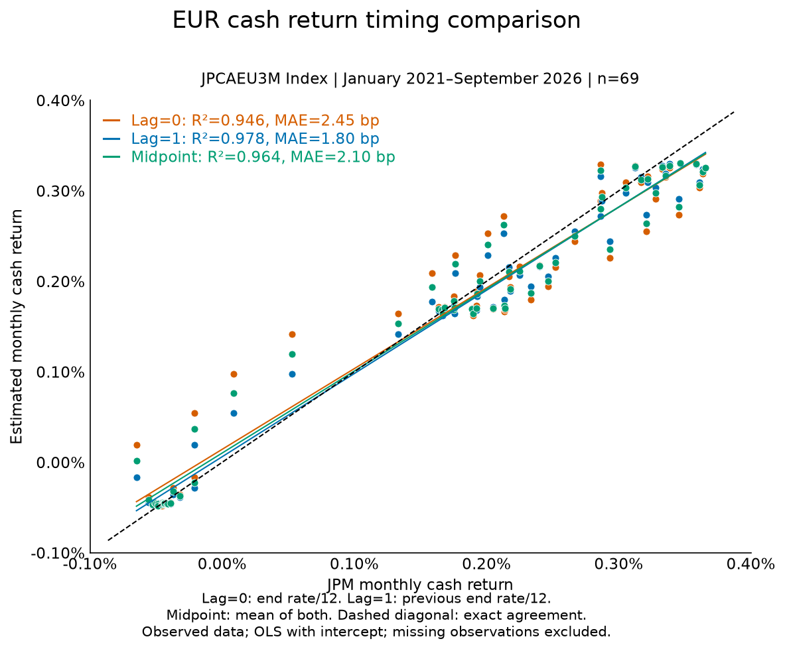
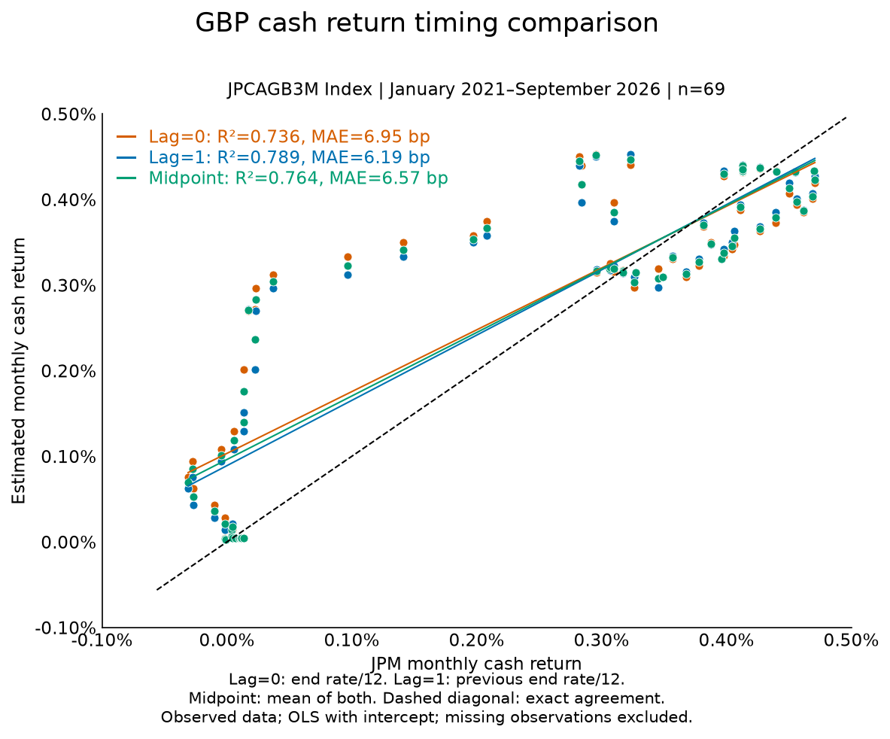
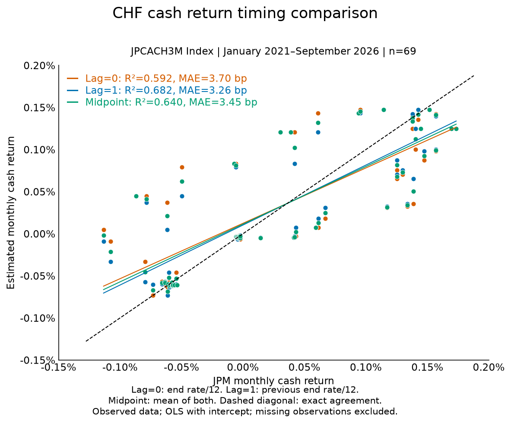
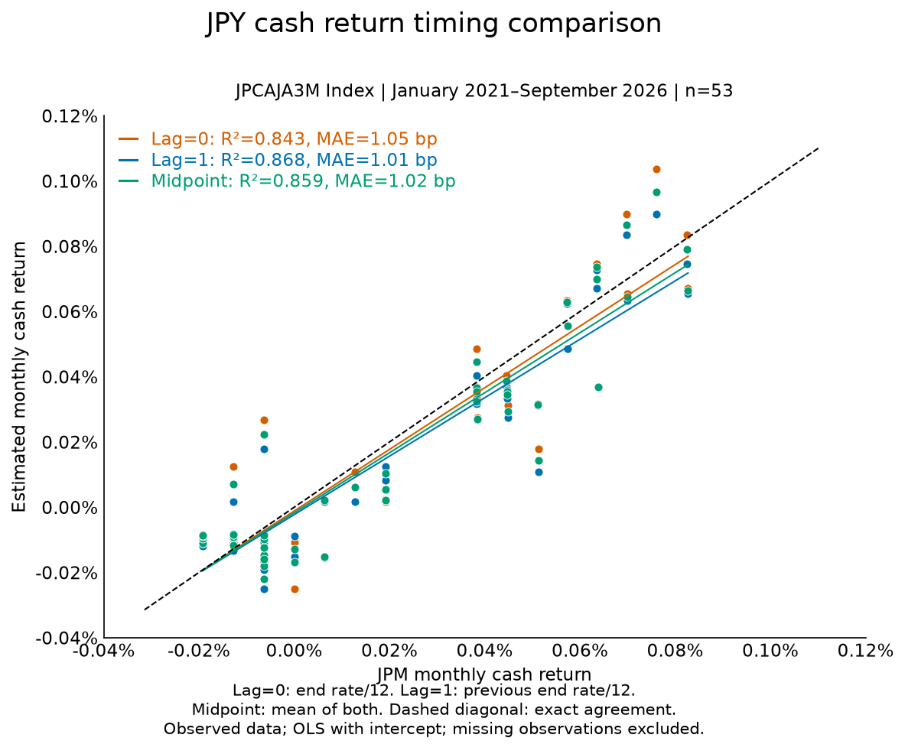
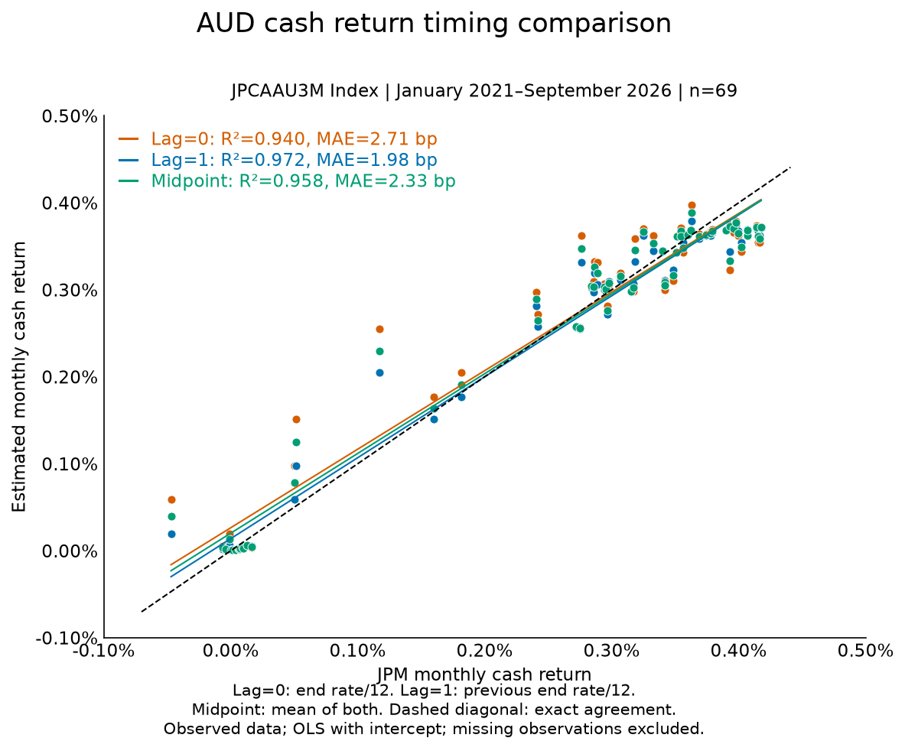
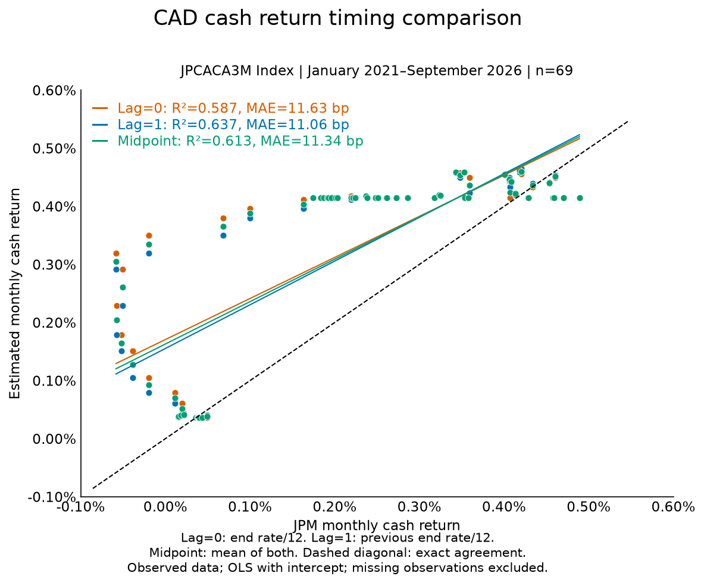
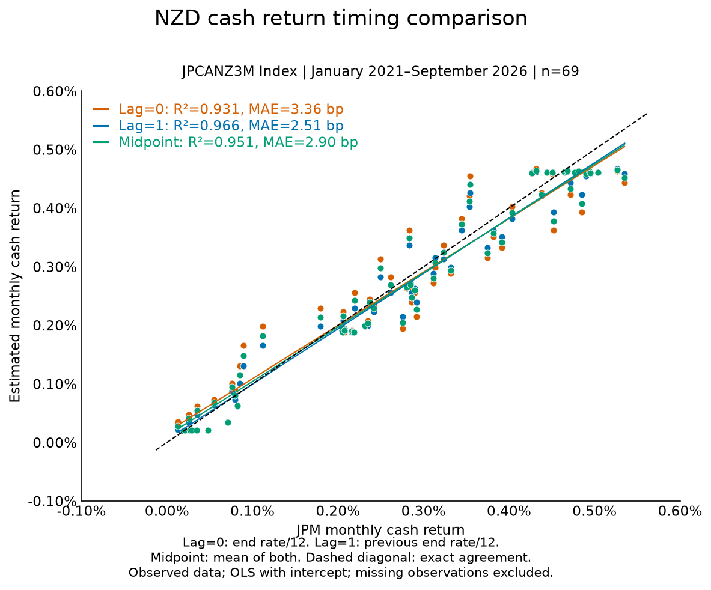

---
myst:
  html_meta:
    description: >-
      Separate FX spot translation, prior-period hedge carry and cash-rate subtraction.
      Compare lag 0, lag 1 and midpoint monthly cash estimates against observed JPM indices.
---

# Cash rate timing and FX adjustments

*Author: [Artur Sepp](https://github.com/ArturSepp)*

Implemented in [qis — Quantitative Investment Strategies](https://github.com/ArturSepp/QuantInvestStrats).
Software citation: [CITATION.cff](https://github.com/ArturSepp/QuantInvestStrats/blob/main/CITATION.cff).

A cash-rate lag chooses which annual quote approximates interest earned over a return period.
It does not shift the realised FX return. Spot translation, forward hedging and excess-return
subtraction have separate timing contracts.

## Overview

This chapter explains which FX inputs must be fixed at the start of a period, whether an ending
rate quote measures cash earned during that period, and whether the midpoint of starting and
ending rates improves that approximation.

An observed-data study compares eight currencies over January 2021–September 2026. Among the
three rate/12 approximations, lag 1 has the highest coefficient of determination and lowest mean
absolute error in every currency in this sample. This is descriptive evidence, not a universal
accrual identity or a forecast. QIS and the production workflow retain lag 1. The cash indices
are validation inputs, not an additional production data dependency.

## Inputs, notation, and assumptions

| Convention | This article |
|---|---|
| Return basis | Simple asset, FX and cash-index returns; log excess returns are treated separately |
| Sampling grid | Calendar month ends; realised returns cover the preceding month |
| Annualisation | $\mathrm{af}=12$; annual decimal short rates divided by 12 estimate one month |
| Mean adjustment | None for cash accrual; full-sample OLS with intercept is descriptive only |
| Timing | Spot uses both endpoints; hedge carry uses the starting quote; cash subtraction defaults to lag 1 |
| Output units | Decimal returns; scatter axes in percent; errors in monthly basis points |
| qis default | `cash_rate_lag=1`; midpoint is a diagnostic, not an API lag setting |

| Symbol or input | Meaning | Units and convention |
|---|---|---|
| $y_t$ | Annual short-rate quote as of month end $t$ | Decimal per annum, not an earned return |
| $c_t^{(0)}$, $c_t^{(1)}$, $c_t^{(m)}$ | End-rate, start-rate and midpoint estimates | Simple monthly cash returns |
| $j_t$ | Observed JPM cash-index return | Simple local-currency monthly return |
| $r_t^L$ | Local asset return | Simple return over $[t-1,t]$ |
| $S_t$, $r_t^{FX}$ | FX cross and its realised return | Reference currency per local unit; $S_t/S_{t-1}-1$ |
| $h_{t-1}$, $f_{t-1}$ | Opening-principal hedge ratio and cash-growth premium | [FX hedging conventions](fx_hedging_and_market_data.md) |
| $x_t$, $z_t$ | Scatter input and output | $x_t=j_t$, $z_t=c_t$ |
| $e_t$, $n$ | Approximation error and paired sample size | $e_t=c_t-j_t$; $n$ is a count |

The study uses supplied month-end annual rate observations and cash-index levels converted to
simple monthly returns. Quotes are first as-of aligned, then shifted on the actual asset-return
grid. A quarterly lag means one quarterly observation, not one month. Leading missing quotes
are not filled from future data.

The recent window has 69 possible months. JPY has 53 paired observations; the other currencies
have 69. Missing index returns are excluded rather than invented. Each currency uses identical
nonmissing support for all three methods. Observation cutoff is 30 September 2026; the historical
input snapshot was analysed on 2 October 2026.

## Methodology

### Three cash accrual approximations

**Definition.** The monthly simple-return approximations are

$$
c_t^{(0)}=\frac{y_t}{12},\qquad
c_t^{(1)}=\frac{y_{t-1}}{12},\qquad
c_t^{(m)}=\frac{y_{t-1}+y_t}{24}.
$$

Lag 1 uses a starting-period quote; lag 0 uses an ending-period quote. Midpoint is a trapezoidal
approximation to a within-month average rate. It does not establish that the rate moved linearly
or that the index earns precisely that rate. Dividing by 12 is a fixed monthly convention,
not an actual-day-count accrual.

If cash is a benchmark, its earned period return is the relevant quantity. Calling cash the
benchmark does not make the ending yield its realised return and therefore does not imply lag 0.
A contemporaneous quote can serve a separately labelled descriptive estimator, but it represents
a different economic object from preceding-period cash accrual.

> **Pitfall.** A closing quote is known to an estimator deciding at that close, so lag 0 is not
> automatically look-ahead for next-period decisions. It is future information if used for
> an investment fixed at the preceding close. State the decision time and economic object.

### Spot translation and forward carry

| Adjustment | Timing | Effect of cash-rate lag |
|---|---|---|
| Unhedged spot translation | Realised FX move over the same period as the asset return | None |
| Opening hedge notional | Prior hedge ratio $h_{t-1}$ | None |
| Short-forward carry | Prior premium $f_{t-1}$, using rates known when the hedge is fixed | None |
| Reference-currency excess return | Subtract reference cash on the chosen return grid | Chooses the cash quote |
| Local-currency excess return | Subtract native-currency cash; no spot conversion | Chooses the cash quote |
| Reporting rate panel | Annual quotes, not periodic earned cash returns | Do not deduct this panel directly |

**Identity.** Unhedged reference-currency return is

$$
1+R_t=(1+r_t^L)(1+r_t^{FX}).
$$

**Proof.** Reference wealth equals local asset value multiplied by spot. Its terminal-to-opening
ratio is the product of the asset-price and spot ratios. $\square$

Do not lag the realised FX move by one month. Inputs fixed before the holding period, such as
hedge ratio and forward premium, are lagged. Under QIS's opening-principal hedge convention,

$$
R_t=r_t^L(1+r_t^{FX})+(1-h_{t-1})r_t^{FX}
-h_{t-1}\frac{f_{t-1}}{1+f_{t-1}}.
$$

The [FX hedging chapter](fx_hedging_and_market_data.md#hedged-unhedged-cash-and-futures-exposures)
derives this payoff and its covered-interest-parity assumptions. Cash-rate subtraction does not
change the total-return payoff. Deduct local cash for native-currency estimation or reference
cash after conversion; do not accidentally deduct both.

### Excess returns and model sensitivity

**Definition.** Simple and log excess returns are

$$
R_t^{\mathrm{excess}}=R_t-c_t,\qquad
\ell_t^{\mathrm{excess}}=\log(1+R_t)-\log(1+c_t).
$$

Log excess is a log relative return. Its `expm1` is not generally arithmetic excess return.

**Identity.** With total return fixed, changing simple cash subtraction from lag 1 to lag 0 gives

$$
R_t^{\mathrm{excess},0}-R_t^{\mathrm{excess},1}
=-\frac{y_t-y_{t-1}}{12}.
$$

**Proof.** Subtract the two excess-return definitions and cancel the common total return.
The remaining difference is starting cash minus ending cash. $\square$

Rate rises lower lag-0 excess returns relative to lag 1; cuts raise them. These changes can offset
in the sample mean while changing covariance with factors. Betas, prior selection, residual
covariance, alphas and constrained allocations can therefore change. A small cash adjustment
need not imply a small allocation adjustment. This mechanism alone does not establish the cause
of an individual allocation: compare identical universes, cutoffs, settings and software.

### Scatter regression and accuracy

Each coloured group fits estimated cash return on observed index return:

$$
z_t=a+b x_t+\varepsilon_t,\qquad x_t=j_t,\quad z_t=c_t.
$$

The fitted intercept is included. The dashed diagonal represents exact agreement. $R^2$
measures regression fit, not agreement with that diagonal. Define errors by

$$
\operatorname{Bias}=\frac{1}{n}\sum_t e_t,\qquad
\operatorname{MAE}=\frac{1}{n}\sum_t\lvert e_t\rvert,\qquad
\operatorname{RMSE}=\left(\frac{1}{n}\sum_t e_t^2\right)^{1/2}.
$$

Multiply decimal monthly errors by 10,000 to obtain basis points. Errors and intercepts
are not annualised.

## Worked example

### Synthetic timing check

An annual quote rising from 2.4% to 3.6% gives cash estimates of 0.20% with lag 1, 0.30% with
lag 0, and 0.25% with midpoint. For a 2% simple asset return, excess returns are respectively
1.80%, 1.70% and 1.75%. Total return stays at 2%.

~~~python
from math import isclose
import pandas as pd
import qis

dates = pd.date_range('2024-01-31', periods=3, freq='ME')
spots = pd.DataFrame({'USD': 1.0}, index=dates)
rates = pd.DataFrame({'USD': [0.024, 0.036, 0.048]}, index=dates)
prices = pd.DataFrame({'Asset': [100.0, 102.0, 104.04]}, index=dates)
ccys = pd.Series({'Asset': 'USD'})
fx = qis.FxRatesData(fx_spots=spots, domestic_rates=rates)
total1, excess1, quotes = fx.compute_returns_adjusted_by_local_rate(
    prices, ccys, freq='ME', is_log_returns=False, cash_rate_lag=1)
total0, excess0, _ = fx.compute_returns_adjusted_by_local_rate(
    prices, ccys, freq='ME', is_log_returns=False, cash_rate_lag=0)
assert total1.equals(total0)
assert isclose(excess1['Asset'].iloc[1], 0.018, abs_tol=1e-12)
assert isclose(excess0['Asset'].iloc[1], 0.017, abs_tol=1e-12)
assert isclose(quotes['Asset'].iloc[1], 0.036, abs_tol=1e-12)
~~~

### Observed cash index comparison

These observed-data summaries are separate from the synthetic example. Bold marks the best fit
or smallest error among the three methods within each currency.

| Currency | Months | $R^2$ lag 0 | $R^2$ lag 1 | $R^2$ midpoint | MAE lag 0 (bp) | MAE lag 1 (bp) | MAE midpoint (bp) |
|---|---:|---:|---:|---:|---:|---:|---:|
| USD | 69 | 0.721 | **0.786** | 0.756 | 7.77 | **7.02** | 7.38 |
| EUR | 69 | 0.946 | **0.978** | 0.964 | 2.45 | **1.80** | 2.10 |
| GBP | 69 | 0.736 | **0.789** | 0.764 | 6.95 | **6.19** | 6.57 |
| CHF | 69 | 0.592 | **0.682** | 0.640 | 3.70 | **3.26** | 3.45 |
| JPY | 53 | 0.843 | **0.868** | 0.859 | 1.05 | **1.01** | 1.02 |
| AUD | 69 | 0.940 | **0.972** | 0.958 | 2.71 | **1.98** | 2.33 |
| CAD | 69 | 0.587 | **0.637** | 0.613 | 11.63 | **11.06** | 11.34 |
| NZD | 69 | 0.931 | **0.966** | 0.951 | 3.36 | **2.51** | 2.90 |

Lag 1 wins both measures in all currencies in this recorded sample. EUR, AUD and NZD have
particularly close fit; USD, GBP and CHF show larger discrepancies. CAD has a stale CDOR-based
input and is not a clean timing test. JPY has incomplete index-return support.

Lag-1 diagnostics also show why high $R^2$ does not mean exact replication:

| Currency | JPM index ticker | Slope | Intercept (bp) | Bias (bp) | RMSE (bp) |
|---|---|---:|---:|---:|---:|
| USD | JPCAUS3M Index | 0.729 | 6.61 | -1.17 | 9.54 |
| EUR | JPCAEU3M Index | 0.920 | 0.62 | -0.66 | 2.44 |
| GBP | JPCAGB3M Index | 0.762 | 8.91 | 3.28 | 9.07 |
| CHF | JPCACH3M Index | 0.712 | 1.03 | 0.37 | 4.75 |
| JPY | JPCAJA3M Index | 0.896 | -0.23 | -0.42 | 1.25 |
| AUD | JPCAAU3M Index | 0.930 | 1.39 | -0.34 | 2.69 |
| CAD | JPCACA3M Index | 0.752 | 15.53 | 10.08 | 14.59 |
| NZD | JPCANZ3M Index | 0.945 | 0.50 | -1.03 | 3.11 |

### Currency scatterplots

Horizontal axes show JPM monthly return; vertical axes show the three monthly cash estimates.
Orange is lag 0, blue lag 1 and green midpoint. Fits include an intercept and are descriptive
full-sample fits, not point-in-time signals. All plots use `qis.plot_scatter`.

#### USD

USD, JPCAUS3M Index: 69 paired months. Lag 1 has $R^2=0.786$ and MAE 7.02 bp. The diagonal tests exact agreement; fitted lines alone do not.

#### EUR

EUR, JPCAEU3M Index: 69 paired months. Lag 1 has $R^2=0.978$ and MAE 1.80 bp. The diagonal tests exact agreement; fitted lines alone do not.

#### GBP

GBP, JPCAGB3M Index: 69 paired months. Lag 1 has $R^2=0.789$ and MAE 6.19 bp. The diagonal tests exact agreement; fitted lines alone do not.

#### CHF

CHF, JPCACH3M Index: 69 paired months. Lag 1 has $R^2=0.682$ and MAE 3.26 bp. The diagonal tests exact agreement; fitted lines alone do not.

#### JPY

JPY, JPCAJA3M Index: 53 paired months. Lag 1 has $R^2=0.868$ and MAE 1.01 bp. The diagonal tests exact agreement; fitted lines alone do not.

#### AUD

AUD, JPCAAU3M Index: 69 paired months. Lag 1 has $R^2=0.972$ and MAE 1.98 bp. The diagonal tests exact agreement; fitted lines alone do not.

#### CAD

CAD, JPCACA3M Index: 69 paired months. Lag 1 has $R^2=0.637$ and MAE 11.06 bp. The diagonal tests exact agreement; fitted lines alone do not.

#### NZD

NZD, JPCANZ3M Index: 69 paired months. Lag 1 has $R^2=0.966$ and MAE 2.51 bp. The diagonal tests exact agreement; fitted lines alone do not.

## Implementation in qis

| Requirement | Verified entry point | Contract |
|---|---|---|
| Native-currency total and excess returns | `FxRatesData.compute_returns_adjusted_by_local_rate` | Total returns, excess returns and annual reporting quotes |
| Reference-currency total and excess returns | `FxRatesData.compute_returns_in_reference_ccy` | Cash lag applies only when `is_excess_returns=True` |
| Mixed frequencies | `FxRatesData.compute_fx_adjusted_returns` | Lag on each group's actual return grid |
| Preserve valid zero returns | `zero_return_to_nan=False` | Independent of cash lag and FX valuation |
| FX payoff | `qis.compute_performance_of_local_ccy_asset_in_reference_ccy` | Prior hedge ratio/carry; realised FX move over the asset period |
| Scatter regression | `qis.plot_scatter` | `order=1`, `fit_intercept=True`, method as `hue`, `add_45line=True` |

Canonical sources are
[fx_rates_data.py](https://github.com/ArturSepp/QuantInvestStrats/blob/main/src/qis/market_data/fx_rates_data.py)
and [fx_hedging.py](https://github.com/ArturSepp/QuantInvestStrats/blob/main/src/qis/market_data/fx_hedging.py).
There is no midpoint value of `cash_rate_lag`: midpoint is an external diagnostic, not a
production API extension. Core QIS does not fetch these cash benchmarks.

### Reproduction and provenance

The [case-study producer](https://github.com/ArturSepp/QuantInvestStrats/blob/main/tools/docs_analytics/cash_rate_case_study.py)
is an approved empirical exception to the synthetic teaching-figure policy. The complete offline
batch preserves reviewed PNG bytes and reconstructs the aggregate table. It checks hashes,
completeness, finite statistics and error bounds. This is not an offline refit of vendor data.

The [registry](https://github.com/ArturSepp/QuantInvestStrats/blob/main/tools/docs_analytics/manifest.json)
records the sample, aggregate fits, private input hashes and preview hashes.
[Published provenance](images/analytics_manifest.json) records actual source content, dependency
versions and generation time. A source commit alone cannot identify uncommitted source edits.

The private inputs are `cash_rate_monthly_comparison.csv` and the original
`cash_lag_scatter_statistics.csv`. Raw vendor observations and private mandate results are
not distributed. An authorised holder of the comparison CSV can reproduce the regression checks
and previews:

~~~console
python -m tools.docs_analytics.cash_rate_case_study --source-csv /private/cash_rate_monthly_comparison.csv --output-dir /local/new-refit
python -m tools.docs_analytics.run --all --output-dir /local/new-complete-bundle
python -m tools.docs_analytics.publish --verify --repo /path/to/checkout
~~~

On Windows, use the prescribed external environment and C-local generated-state setup.
The private refit checks all 24 recorded fits against `scipy.stats.linregress` and direct
error moments. The teaching example above runs without private input.
The [batch workflow](https://github.com/ArturSepp/QuantInvestStrats/blob/main/tools/docs_analytics/README.md)
describes full generation, review and publication.

## Interpretation and limitations

- Lag 1 is a starting-period cash approximation, not an exact realised cash account. Lag 0 can
  serve a separately labelled contemporaneous estimator.
- Midpoint can approximate a changing overnight rate without fitting a cash index better.
  Here it lies between lag 0 and lag 1 on both displayed measures.
- Index maturity, curve shape, roll conventions, fees, quotation basis and day count can differ
  from the proxy. These are candidate explanations for mismatch, not separately identified effects.
- High $R^2$ need not imply smaller bias. JPY lag 1 has smaller MAE but larger absolute bias
  than lag 0.
- Forward-filling does not repair stale rates. Refresh the CAD input before making a clean
  timing inference.
- Synthetic inception returns are not earned observations. Zero-to-NaN treatment can alter
  sample support independently of cash timing.
- This fixed descriptive study has no uncertainty intervals or out-of-sample validation.
  It does not establish that one lag maximises investment performance.
- Do not compensate for a model result by shifting the realised FX-return leg.

> **Insight.** Keep cash timing fixed when comparing covariance models or prior selection,
> so return-input changes do not confound the comparison.

## See also

- [Hedged index replication](hedged_index_replication.md): total-return hedge validation, separate from cash subtraction
- [FX hedging and market-data boundaries](fx_hedging_and_market_data.md)
- [Returns and NAVs](returns_and_navs.md)
- [Performance and Sharpe conventions](performance_analytics_and_sharpe.md)
- [Incomplete and mixed-frequency data](incomplete_and_mixed_frequency_data.md)
- [Regression and HAC](regression_and_hac.md)
- [Notation and conventions](notation_and_conventions.md)

## References

1. Borio, C., McCauley, R., McGuire, P., and Sushko, V. (2016). Covered interest parity lost: understanding the cross-currency basis. *BIS Quarterly Review*, September. [Publisher page](https://www.bis.org/publications/qr-201609/covered-interest-parity-lost-understanding-cross-currency-basis). Forward hedging and rate-only carry limitations.
2. Sepp, A. qis: Performance analytics, portfolio backtesting, risk analysis, and factsheet reporting in Python. [Software citation metadata](https://github.com/ArturSepp/QuantInvestStrats/blob/main/CITATION.cff).
