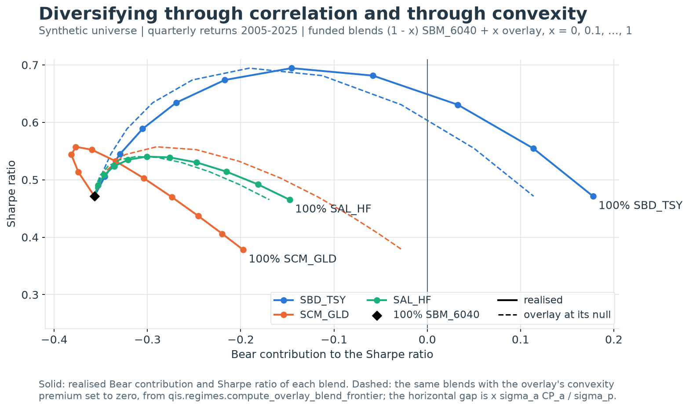

---
myst:
  html_meta:
    description: >-
      The convexity premium in qis: Gaussian and Student-t nulls of the regime Sharpe
      contributions, the premium and its benchmark-adjusted form, the portfolio aggregation
      identity, overlay blend frontiers, smart-diversification curves, regime betas and
      regime-mixture moments.
---

# The convexity premium and smart diversification

*Author: [Artur Sepp](https://github.com/ArturSepp)*

Implemented in [qis — Quantitative Investment Strategies](https://github.com/ArturSepp/QuantInvestStrats).
Software citation: [CITATION.cff](https://github.com/ArturSepp/QuantInvestStrats/blob/main/CITATION.cff).

The [regime decomposition](regime_conditional_performance.md) splits a Sharpe ratio into what an
asset earned in the Bear, Normal and Bull periods of a benchmark. This chapter asks how much of a
Bear contribution correlation alone explains. When the asset and the benchmark are jointly
Gaussian, every regime contribution is a closed form in the asset's Sharpe ratio and its
correlation with the benchmark; the realised Bear contribution less that null is the *convexity
premium* of Sepp and Kastenholz (2026). The premium adds up across the constituents of a
portfolio with risk weights, which makes it the measure of what an overlay adds to a principal
portfolio in the periods when the principal falls. The subpackage `qis.regimes` computes the nulls,
the premia, their bootstrap intervals, regime betas and regime-mixture moments, and
`qis.SmartDiversificationReport` draws the curves that trade the Bear contribution against the
Sharpe ratio.

## Overview

A positive Bear contribution can be bought in two ways. A short benchmark position earns it
through negative correlation and pays for it with a negative Bull contribution. A convex payoff,
such as a long straddle or a trend-following strategy that adapts within the period, earns it
without giving up the Bull regime. The [beta-propagation proposition](regime_conditional_performance.md)
of the regime chapter separates the two with the mean regression residual of each regime; this
chapter turns that separation into one number per asset and shows how it aggregates.

The calculation has four steps:

1. **Classify.** Label each period Bear, Normal or Bull by the quantiles of the benchmark's
   return, as the regime chapter does: the one-sigma cut at 16% and 84% by default.
2. **Decompose.** Compute each asset's arithmetic regime contributions, which add up to its
   Sharpe ratio on the regime grid.
3. **Compare with the null.** Compute the contribution a jointly Gaussian asset with the same
   Sharpe ratio and correlation would have, and subtract it. The difference in the lowest bucket
   is the convexity premium; net of the benchmark's own departure from the null it is the
   benchmark-adjusted premium.
4. **Aggregate.** A portfolio's Bear contribution is its null plus the risk-weighted sum of its
   constituents' premia. Mixing a principal portfolio with one overlay traces a curve of Bear
   contribution against Sharpe ratio: the smart-diversification curve.

The chapter proves the null, identifies what the premium measures, derives the aggregation
identity and the closed-form blend frontier, and treats regime betas and the regime-mixture
covariance, which carry the same non-linearity into risk models. Like the regime labels, every
statistic here is descriptive: the quantile edges use the whole sample.

## Inputs, notation, and assumptions

| Convention | This article |
|---|---|
| Return basis | Simple total returns on the regime grid, as in the arithmetic regime decomposition; no cash is deducted, so pass excess-return NAVs for excess statistics |
| Sampling grid | The regime grid of the sampled frame: quarter-ends from `BenchmarkReturnsQuantilesRegime(freq='QE')`, or any periodic returns through `create_sampled_returns_with_regime_id`; the report's per-annum statistics use `PerfParams(freq='ME')` |
| Annualisation | $\mathrm{AN}$ of the regime grid, passed as `af` (4 for quarters): $\sqrt{\mathrm{AN}}$ in contributions, loadings and $\kappa$; `ann_vol` is $\sqrt{\mathrm{AN}}\,s(r)$ |
| Mean adjustment | Regime means are raw; $s(r)$ is demeaned with `ddof=1`; correlations are Pearson; regression intercepts are estimated and then discarded |
| Timing | Descriptive and full sample: quantile edges use the whole history; the bootstraps reclassify every resample; the regime-time EWMA is seeded with each stream's full-sample mean |
| Output units | Contributions, nulls and premia in annualised Sharpe units; `<tail>_return_pa` in decimal per year; betas dimensionless; covariances annualised |
| qis default | `compute_regime_premium_table(sampled, benchmark, af, q=None, nu=None)`: one-sigma cut `[0.0, 0.16, 0.84, 1.0]`, Gaussian null; `compute_regime_premium_bootstrap(block_size=8, n_boot=2000, seed=7, ci=0.95)` |

| Symbol or input | Meaning | Units and convention |
|---|---|---|
| $r_t$, $r_{b,t}$ | Asset and benchmark simple return on the regime grid | Decimal per period |
| $g$, $G$ | Regime index and number of regimes, from the lowest benchmark bucket up | Bear, Normal, Bull: $G=3$; the code writes $s$ |
| $q_0<q_1<\dots<q_G$ | Partition probabilities, $q_0=0$, $q_G=1$ | `q`; one-sigma cut by default |
| $\pi_g$ | Partition probability of regime $g$, $q_g-q_{g-1}$ | 0.16, 0.68, 0.16 on the one-sigma cut |
| $p_g$ | Realised frequency of regime $g$ | $T_g/T$, as in the regime chapter |
| $m_g$, $m_{b,g}$ | Mean return of the asset and of the benchmark in regime $g$ | Decimal per period |
| $\mathrm{SR}$, $\mathrm{SR}_b$ | Arithmetic Sharpe ratios $\sqrt{\mathrm{AN}}\,\bar r/s(r)$ on the regime grid | Annualised |
| $\mathrm{SR}_g$ | Regime contribution $\sqrt{\mathrm{AN}}\,p_g m_g/s(r)$ | Adds up to $\mathrm{SR}$ over $g$ |
| $\rho$ | Correlation of the asset with the benchmark | Sample Pearson correlation |
| $Z$ | Unit-variance benchmark shock, $(r_b-\mu_b)/\sigma_b$ | Gaussian or Student-t margin |
| $z_g$ | Edge of regime $g$ in units of $Z$, $z_0=-\infty$, $z_G=+\infty$ | Quantile $q_g$ of the margin |
| $\phi$, $\Phi$ | Standard normal density and distribution function | |
| $k_g$ | Null loading of regime $g$, $\sqrt{\mathrm{AN}}\,\mathbb{E}[Z\,1\{z_{g-1}<Z\le z_g\}]$ | Sums to zero over $g$ |
| $\kappa$ | Bull loading of a symmetric three-bucket cut, the Bear one being $-\kappa$ | 0.487 quarterly, 0.843 monthly |
| $\nu$ | Degrees of freedom of a Student-t null | $\nu>2$; calibrated as $4+6/\text{kurtosis}$ |
| $\mathrm{CP}$, $\mathrm{CP}_b$ | Convexity premium of the asset and of the benchmark | Lowest bucket, annualised Sharpe units |
| $\mathrm{CP}^{*}$ | Benchmark-adjusted premium $\mathrm{CP}-\rho\,\mathrm{CP}_b$ | Zero for the benchmark |
| $\bar\varepsilon_g$ | Mean OLS residual of $r$ on $r_b$ in regime $g$ | As in the regime chapter |
| $x$ | Overlay weight of a blend $(1-x)\,$benchmark $+\,x\,$overlay | 0 to 1 |
| $\sigma_p$, $\rho_p$, $\mathrm{SR}_p$ | Volatility, benchmark correlation and Sharpe ratio of a portfolio | Annualised |
| $\beta_{i,g}$ | Regime beta of asset $i$ on the benchmark in regime $g$ | OLS slope within the regime |
| $v_i$ | Per-period residual variance of asset $i$ | `idio_vars` |

Inputs are the frame a regime classifier returns: periodic returns with a categorical `regime`
column, built by `BenchmarkReturnsQuantilesRegime.compute_sampled_returns_with_regime_id` from
prices or by `qis.regimes.create_sampled_returns_with_regime_id` from returns. Every function of
`qis.regimes` works for any partition of the benchmark's returns: three buckets are labelled Bear,
Normal and Bull, other counts Q1 to Qn, and the premium always refers to the lowest bucket. The
subpackage is imported explicitly, `from qis.regimes import ...`; its names are not exported from
`qis`. Classification follows the one quantile rule of qis in `qis.utils.quantile_buckets`,
described in the [regime chapter](regime_conditional_performance.md): linear-interpolation edges,
buckets closed on the right, and a return equal to an interior edge in the lower bucket.

## Methodology

### The Gaussian null of the regime contributions

**Proposition (Gaussian null, Sepp and Kastenholz 2026).** Let the asset and the benchmark
returns of a period be jointly normal with means $\mu$, $\mu_b$, volatilities $\sigma$,
$\sigma_b$ and correlation $\rho$, and let regime $g$ be the event
$z_{g-1}<Z\le z_g$ with $z_g=\Phi^{-1}(q_g)$. The population regime contribution
$\mathrm{SR}_g=\sqrt{\mathrm{AN}}\,\mathbb{E}[r\,1\{g\}]/\sigma$ is

$$
\mathrm{SR}_g=\pi_g\,\mathrm{SR}+\rho\,k_g,
\qquad
k_g=\sqrt{\mathrm{AN}}\,\big(\phi(z_{g-1})-\phi(z_g)\big),
$$

with $\mathrm{SR}=\sqrt{\mathrm{AN}}\,\mu/\sigma$ and $\phi(\pm\infty)=0$.

**Proof.** For a jointly normal pair the conditional mean is linear,
$\mathbb{E}[r\mid Z]=\mu+\rho\,\sigma Z$, so
$\mathbb{E}[r\,1\{g\}]=\mu\,\pi_g+\rho\,\sigma\,\mathbb{E}[Z\,1\{g\}]$. Because
$\phi'(z)=-z\,\phi(z)$, $\int_a^b z\,\phi(z)\,dz=\phi(a)-\phi(b)$. Divide by $\sigma$ and
multiply by $\sqrt{\mathrm{AN}}$. $\square$

The loadings telescope, $\sum_g k_g=\sqrt{\mathrm{AN}}\,(\phi(-\infty)-\phi(+\infty))=0$, so the
null contributions add up to $\mathrm{SR}$ for any partition. On a symmetric three-bucket cut
the loadings are $-\kappa$, $0$ and $\kappa$ with

$$
\kappa=\sqrt{\mathrm{AN}}\;\phi\big(\Phi^{-1}(1-\pi_1)\big),
$$

which is 0.487 for quarterly and 0.843 for monthly regimes on the one-sigma cut. The Bear null is
$\pi_1\mathrm{SR}-\kappa\rho$. The proof uses only two properties: the conditional mean of the
asset is linear in the benchmark, and the benchmark's margin is Gaussian. Any asset whose excess
over its linear projection has zero mean in every bucket sits on the null, whatever its own
distribution.

> **Insight.** In these coordinates one unit of correlation costs $\kappa$ of Bear contribution and
> one unit of Sharpe ratio buys $\pi_1$. At quarterly frequency $\kappa/\pi_1=3.04$: lowering the
> correlation with the benchmark by 0.1 improves the Bear contribution as much as raising the
> Sharpe ratio by 0.30. On monthly regimes the ratio is 5.27. Diversifying away from the
> benchmark is the cheap route to a better Bear contribution; the premium measures what an asset
> earns beyond it.

**Proposition (Student-t null).** Let the pair be jointly Student-t with $\nu>2$ degrees of
freedom, so that $Z=\sqrt{(\nu-2)/\nu}\,W$ with $W$ Student-t of density $f_\nu$, and let
$w_g$ be the quantile $q_g$ of $W$. The conditional mean is still linear, and

$$
k_g=\sqrt{\mathrm{AN}}\,\sqrt{\frac{\nu-2}{\nu}}\,\big(h_\nu(w_{g-1})-h_\nu(w_g)\big),
\qquad
h_\nu(w)=\frac{\nu+w^2}{\nu-1}\,f_\nu(w).
$$

**Proof.** Elliptical distributions have linear conditional means, so the first proof carries
over with $\mathbb{E}[Z\,1\{g\}]$. Write $f_\nu(w)=c_\nu(1+w^2/\nu)^{-(\nu+1)/2}$. Then
$(\nu+w^2)f_\nu(w)=\nu\,c_\nu(1+w^2/\nu)^{-(\nu-1)/2}$, whose derivative is
$-(\nu-1)\,w\,f_\nu(w)$, so $\int_a^b w\,f_\nu(w)\,dw=h_\nu(a)-h_\nu(b)$. The factor
$\sqrt{(\nu-2)/\nu}$ converts $W$ to unit variance. $\square$

A unit-variance Student-t margin puts more mass near the centre and in the far tails. At the
one-sigma cut its $\kappa$ is therefore below the Gaussian value, 0.475 against 0.487 for
$\nu=5$, while at 5% tails it is above, 0.224 against 0.206; both converge to the Gaussian value
as $\nu$ grows. `calibrate_student_t_nu` matches the benchmark's sample excess kurtosis $K$,
which is $6/(\nu-4)$ for a Student-t, by $\nu=4+6/K$ with a floor of 4.5, and returns None for
$K\le0$, when the Gaussian null is the tighter benchmark.

### The convexity premium

**Definition (convexity premium).** With $\mathrm{SR}_1$ the realised contribution of the lowest
bucket, $\pi_1$ its partition probability and $k_1$ its null loading,

$$
\mathrm{CP}=\mathrm{SR}_1-\big(\pi_1\,\mathrm{SR}+\rho\,k_1\big),
\qquad
\mathrm{CP}^{*}=\mathrm{CP}-\rho\,\mathrm{CP}_b,
$$

where $\mathrm{CP}_b$ is the benchmark's own premium, with $\rho=1$. On the one-sigma cut
$\mathrm{CP}=\mathrm{SR}_{\mathrm{Bear}}-(0.16\,\mathrm{SR}-\kappa\rho)$.

The realised contribution uses the realised frequency $p_1$ and the null the partition
probability $\pi_1$, which differ by the rounding of the quantile position: 14 of 83 quarters is
0.169 rather than 0.16. The benchmark itself has a premium when its lowest bucket is shallower or
deeper than a Gaussian's, and every correlated asset inherits that departure in proportion to
$\rho$. The next result makes this precise.

**Proposition (what the premium measures).** Let $r=\alpha+\beta r_b+\varepsilon$ be the
population linear projection, with $\mathbb{E}[\varepsilon]=0$ and
$\operatorname{Cov}(\varepsilon,r_b)=0$, and let the buckets be the population quantile buckets
of $r_b$ with any margin. Then

$$
\mathrm{CP}=\rho\,\mathrm{CP}_b+\frac{\sqrt{\mathrm{AN}}\,\pi_1\,\mathbb{E}[\varepsilon\mid 1]}{\sigma},
\qquad
\mathrm{CP}^{*}=\frac{\sqrt{\mathrm{AN}}\,\pi_1\,\mathbb{E}[\varepsilon\mid 1]}{\sigma}.
$$

**Proof.** Write $r_b=\mu_b+\sigma_b Z$. Since $\alpha+\beta\mu_b=\mu$ and
$\beta\sigma_b=\rho\sigma$, $\mathbb{E}[r\,1\{1\}]=\mu\,\pi_1+\rho\,\sigma\,\mathbb{E}[Z\,1\{1\}]
+\mathbb{E}[\varepsilon\,1\{1\}]$. For the benchmark, with $\rho=1$ and no residual,
$\mathrm{SR}_{b,1}=\pi_1\mathrm{SR}_b+\sqrt{\mathrm{AN}}\,\mathbb{E}[Z\,1\{1\}]$. Substituting,
$\mathrm{SR}_1=\pi_1\mathrm{SR}+\rho(\mathrm{SR}_{b,1}-\pi_1\mathrm{SR}_b)
+\sqrt{\mathrm{AN}}\,\pi_1\mathbb{E}[\varepsilon\mid1]/\sigma$. Subtract the null
$\pi_1\mathrm{SR}+\rho k_1$ and recognise $\mathrm{CP}_b=\mathrm{SR}_{b,1}-\pi_1\mathrm{SR}_b-k_1$.
$\square$

The premium has two sources: the shape of the benchmark's own lower tail, carried at the asset's
correlation, and the lowest-bucket mean of the part of the asset's return that no straight line
in the benchmark explains. The benchmark-adjusted premium keeps only the second. It is zero
whenever the conditional mean is linear, as under the Gaussian and Student-t nulls, and it is
positive for a payoff that is convex in the benchmark.

**Identity (the benchmark-adjusted premium in sample).** Fit $r_t=\hat\alpha+\hat\beta
r_{b,t}+\hat\varepsilon_t$ by OLS with an intercept over the classified periods, let
$\bar\varepsilon_1$ be the mean residual of the lowest bucket and $\hat\rho$ the sample
correlation. Then

$$
\mathrm{CP}^{*}=\frac{\sqrt{\mathrm{AN}}\,p_1\,\bar\varepsilon_1}{s(r)}
+(p_1-\pi_1)\big(\mathrm{SR}-\hat\rho\,\mathrm{SR}_b\big).
$$

**Proof.** From the regime chapter, $m_1=\hat\alpha+\hat\beta m_{b,1}+\bar\varepsilon_1$, with
$\hat\alpha=\bar r-\hat\beta\bar r_b$ and $\hat\beta=\hat\rho\,s(r)/s(r_b)$. Multiplying by
$\sqrt{\mathrm{AN}}\,p_1/s(r)$ gives
$\mathrm{SR}_1=p_1\mathrm{SR}+\hat\rho(\mathrm{SR}_{b,1}-p_1\mathrm{SR}_b)
+\sqrt{\mathrm{AN}}\,p_1\bar\varepsilon_1/s(r)$. Subtract the null
$\pi_1\mathrm{SR}+\hat\rho k_1$, then $\hat\rho$ times
$\mathrm{CP}_b=\mathrm{SR}_{b,1}-\pi_1\mathrm{SR}_b-k_1$. $\square$

The in-sample identity is the population result plus a frequency-mismatch term, which vanishes
when the lowest bucket holds exactly $\pi_1 T$ periods. It ties the premium to the residual
means $\bar\varepsilon_g$ of the [beta-propagation proposition](regime_conditional_performance.md):
the benchmark-adjusted premium is the Bear-regime residual mean expressed as a contribution to
the Sharpe ratio.

`compute_regime_premium_bootstrap` measures the sampling error of the premium. It resamples each
asset jointly with the benchmark by the stationary block bootstrap of
[Politis and Romano (1994)](https://doi.org/10.1080/01621459.1994.10476870), with geometric
blocks of mean length 8 periods, and reclassifies the regimes inside every resample, so the
interval includes the uncertainty of the quantile edges. A resample repeats observations, which
puts returns on the edges; the quantile rule assigns them to the lower bucket.

### Aggregation across a portfolio

**Proposition (aggregation identity, Sepp and Kastenholz 2026).** Let a portfolio hold constant
weights $w_i$ on the regime grid, $r_{p,t}=\sum_i w_i r_{i,t}$, and let every asset and the
portfolio be classified by the same benchmark. With risk weights
$\omega_i=w_i\,\sigma_i/\sigma_p$,

$$
\mathrm{SR}_{p,g}=\sum_i\omega_i\,\mathrm{SR}_{i,g},
\qquad
\mathrm{SR}_p=\sum_i\omega_i\,\mathrm{SR}_i,
\qquad
\rho_p=\sum_i\omega_i\,\rho_i,
\qquad
\mathrm{CP}_p=\sum_i\omega_i\,\mathrm{CP}_i,
$$

and hence $\mathrm{SR}_{p,1}=\pi_1\mathrm{SR}_p+\rho_p k_1+\sum_i\omega_i\,\mathrm{CP}_i$, which
on the one-sigma cut reads $\pi_1\mathrm{SR}_p-\kappa\rho_p+\sum_i\omega_i\mathrm{CP}_i$.

**Proof.** The regime means, the mean and the covariance with the benchmark are linear in the
weights: $m_{p,g}=\sum_i w_i m_{i,g}$ and
$\operatorname{Cov}(r_p,r_b)=\sum_i w_i\,\rho_i\,\sigma_i\sigma_b$. Dividing by $\sigma_p$, or
by $\sigma_p\sigma_b$, turns each into the stated risk-weighted sum, with the regime frequencies
common to all assets. The null $\pi_1\mathrm{SR}+\rho k_1$ is linear in $(\mathrm{SR},\rho)$,
so the premia aggregate with the same weights. $\square$

The identity holds exactly in sample, for the realised contributions and the sample moments,
provided the portfolio's returns are the weighted sums of the constituents' returns on the regime
grid: a portfolio rebalanced at the start of every regime period. The risk weights do not add up
to one; their sum $\sum_i w_i\sigma_i/\sigma_p$ is the diversification ratio of
[Choueifaty and Coignard (2008)](https://doi.org/10.3905/JPM.2008.35.1.40), at least one for a
long-only portfolio. Diversification multiplies the risk-weighted average premium by that ratio,
exactly as it multiplies the average Sharpe ratio.

### The overlay blend frontier

A funded blend holds $1-x$ in the benchmark and $x$ in one overlay $a$. Applying the aggregation
identity to the two assets gives the frontier in closed form.

**Proposition (blend frontier).** With the overlay's Sharpe ratio $\mathrm{SR}_a$, volatility
$\sigma_a$, correlation $\rho$ and premium $\mathrm{CP}_a$, and the benchmark's $\mathrm{SR}_b$,
$\sigma_b$ and $\mathrm{CP}_b$,

$$
\begin{aligned}
\sigma_p^2&=(1-x)^2\sigma_b^2+x^2\sigma_a^2+2x(1-x)\rho\,\sigma_a\sigma_b,
\qquad
\mathrm{SR}_p=\frac{(1-x)\,\mathrm{SR}_b\,\sigma_b+x\,\mathrm{SR}_a\,\sigma_a}{\sigma_p},\\
\rho_p&=\frac{(1-x)\,\sigma_b+x\,\rho\,\sigma_a}{\sigma_p},
\qquad
\mathrm{SR}_{p,1}=\pi_1\mathrm{SR}_p+\rho_p k_1
+\frac{x\,\sigma_a\,\mathrm{CP}_a+(1-x)\,\sigma_b\,\mathrm{CP}_b}{\sigma_p}.
\end{aligned}
$$

**Proof.** The first two lines are the variance and mean of a two-asset portfolio. The
benchmark's correlation with itself is one, so $\rho_p$ and the Bear contribution follow from the
aggregation identity with $\omega=\big((1-x)\sigma_b,\,x\sigma_a\big)/\sigma_p$. $\square$

`compute_overlay_blend_frontier` evaluates the frontier with $\mathrm{CP}_b=0$, a benchmark on
its null. For a benchmark with a premium of its own, add $(1-x)\,\sigma_b\,\mathrm{CP}_b/\sigma_p$
to its `bear_sharpe` column; the worked example shows that the result then equals the realised
contributions of the blends to rounding error.

**Proposition (uncorrelated overlay).** For $\rho=0$ and positive Sharpe ratios the frontier
peaks at $x^{*}=(\mathrm{SR}_a/\sigma_a)/(\mathrm{SR}_a/\sigma_a+\mathrm{SR}_b/\sigma_b)$ with
$\mathrm{SR}_p=\sqrt{\mathrm{SR}_a^2+\mathrm{SR}_b^2}$.

**Proof.** With a diagonal covariance the maximum Sharpe ratio over all weights is
$\sqrt{\mu^{\top}\Sigma^{-1}\mu}=\sqrt{\mathrm{SR}_a^2+\mathrm{SR}_b^2}$, attained at weights
proportional to $\mu_i/\sigma_i^2=\mathrm{SR}_i/\sigma_i$, which normalised to a sum of one give
$x^{*}$ in $(0,1)$. $\square$



[Open full-resolution preview](images/handbook_smart_diversification.png).

The exhibit mixes the synthetic 60/40 benchmark with three overlays in funded blends and plots each
blend's Bear contribution against its Sharpe ratio, from the benchmark alone (the diamond) to the
overlay alone. Solid curves are realised; dashed curves are the same blends with the overlay moved
onto its null, $\mathrm{CP}_a=0$, so the horizontal gap is $x\,\sigma_a\,\mathrm{CP}_a/\sigma_p$.
Treasuries diversify through correlation, $-0.08$, and a premium of $+0.06$: a 60% blend lifts the
Sharpe ratio from 0.47 to 0.69 and the Bear contribution from $-0.36$ to $-0.15$. Gold's correlation
is also low, 0.18, but its premium of $-0.17$ bends its curve to the left: gold falls more in Bear
quarters than its correlation implies, and every blend with up to 40% gold has a worse Bear
contribution than the benchmark alone. The hedge-fund index sits close to its null.

### The smart-diversification exhibit

`qis.SmartDiversificationReport` draws the same curves from NAVs. For each overlay,
`create_overlay_portfolio_curve` backtests eleven mixes of the principal portfolio and the
overlay with `qis.backtest_model_portfolio`, rebalanced at `rebalancing_freq` (quarter-ends by
default), with overlay weights from zero to `max_overlay_weight`. Two mixing rules are available:

- `is_principal_weight_fixed=True` (default) keeps the principal at `principal_weight` and adds
  the overlay on top, weights $(1, x)$. The mix is levered, which suits an overlay that is an
  unfunded, excess-return strategy such as a futures programme.
- `is_principal_weight_fixed=False` funds the overlay from the principal, weights $(1-x, x)$:
  the blends of the frontier above.

`compute_smart_diversification_curve` reads two statistics off the mixes, by default
`PerfStat.BEAR_SHARPE` on the x axis and `PerfStat.SHARPE_RF0` on the y axis, classifying every
mix against the first one, which holds no overlay and so is the principal portfolio.
`plot_smart_diversification_curve` draws one curve per overlay, and
`plot_smart_diversification_scatter` one point per standalone overlay with a cross-sectional fit.

The report's statistics follow its `PerfParams`, `PerfParams(freq='ME')` by default, and hence
`SharpeConvention.PA`: its Bear axis is the per-annum Bear contribution of the regime chapter,
not the arithmetic contribution that the null and the premium use. Pass
`perf_params=qis.PerfParams(freq='ME', sharpe_convention=qis.SharpeConvention.ARITHMETIC)` to
put the curves in the coordinates of this chapter; the funded curves then match the closed-form
frontier, up to the rebalancing dates discussed in the implementation notes.

### Regime betas

`compute_regime_betas` fits, within each regime, an OLS regression of the asset on the benchmark
with an intercept and keeps the slope $\beta_{i,g}$; forcing the fit through the origin would bias
it. The pooled residuals of the piecewise fit give the idiosyncratic volatility.

**Proposition (selection on the benchmark leaves the slope unbiased).** If
$r=\alpha+\beta r_b+\varepsilon$ with $\mathbb{E}[\varepsilon\mid r_b]=0$, then for every event
$\mathcal{A}$ defined by $r_b$ alone the population slope within $\mathcal{A}$ is $\beta$.

**Proof.** $\operatorname{Cov}(r,r_b\mid\mathcal{A})=\beta\operatorname{Var}(r_b\mid\mathcal{A})
+\operatorname{Cov}(\varepsilon,r_b\mid\mathcal{A})$, and the last term is zero because
$\mathbb{E}[\varepsilon\mid r_b]=0$ holds on $\mathcal{A}$. Divide by
$\operatorname{Var}(r_b\mid\mathcal{A})$. $\square$

Under a linear conditional mean every regime beta equals the total beta, so their spread measures
non-linearity; a convex payoff has betas that rise from the Bear to the Bull regime. This is the
contrast with the [conditioning bias](regime_conditional_performance.md) of correlations: the same
selection that leaves the slope unbiased shrinks a within-regime correlation, because it shrinks
the benchmark's variance but not the residual's. `compute_regime_betas_bootstrap` resamples whole
rows of the panel with the stationary block bootstrap, which keeps the cross-section, reclassifies
each resample and re-estimates, and reports the standard deviation of the resampled betas.

`compute_regime_ewm_betas` and `compute_regime_ewm_avg` run EWMA recursions over each regime's own
stream of periods rather than calendar time. A calendar-time EWMA discounts a crisis by its
calendar age, so the Bear moments of a long sample are set by whichever Bear periods are recent;
in regime time the last Bear period carries the most weight among Bear periods however long ago
it occurred. Both recursions are seeded with the stream's full-sample mean (`InitType.MEAN`), so
at a span far longer than the stream they return the equal-weighted estimates, and inside a
backtest they must be evaluated on the data known at each decision date.

### Regime-mixture moments

**Proposition (regime-mixture covariance).** Let asset $i$ follow
$r_i=a_i+\beta_{i,g}\,r_b+\varepsilon_i$ in regime $g$, with a regime-independent intercept $a_i$
and residuals independent across assets and of the benchmark, with variance $v_i$. With
$m_{b,g}$ and $S_g$ the benchmark's mean and second moment in regime $g$,

$$
\operatorname{Cov}(r_i,r_j)=\sum_g\pi_g\,\beta_{i,g}\beta_{j,g}\,S_g
-\Big(\sum_g\pi_g\,\beta_{i,g}\,m_{b,g}\Big)\Big(\sum_g\pi_g\,\beta_{j,g}\,m_{b,g}\Big)
+1\{i=j\}\,v_i .
$$

**Proof.** By total expectation, $\mathbb{E}[r_ir_j]=\sum_g\pi_g\,\mathbb{E}[r_ir_j\mid g]$ and
$\mathbb{E}[r_i]=\sum_g\pi_g\,\mathbb{E}[r_i\mid g]$. The intercept terms cancel in
$\mathbb{E}[r_ir_j]-\mathbb{E}[r_i]\mathbb{E}[r_j]$ because $a_i$ does not depend on $g$, and the
residuals contribute $v_i$ on the diagonal only. $\square$

`compute_regime_mixture_covar` evaluates the formula and multiplies by $\mathrm{AN}$; the
benchmark enters as an asset with unit betas and zero residual. With equal betas in every regime
the first two terms reduce to $\beta_i\beta_j\operatorname{Var}(r_b)$, the single-factor
covariance. The regime intercepts are discarded, as in the regime betas, and residual
correlations are not modelled.

**Identity (Gaussian regime moments).** For a standard normal $Z$ and a bucket $a<Z\le b$ with
probability $\pi$,

$$
\mathbb{E}[Z\mid a<Z\le b]=\frac{\phi(a)-\phi(b)}{\pi},
\qquad
\mathbb{E}[Z^2\mid a<Z\le b]=1+\frac{a\,\phi(a)-b\,\phi(b)}{\pi}.
$$

**Proof.** The first is the truncated first moment of the Gaussian null. For the second,
integrate by parts: $\int_a^b z^2\phi(z)\,dz=\big[-z\,\phi(z)\big]_a^b+\int_a^b\phi(z)\,dz$.
$\square$

On the one-sigma cut the Bear mean is $-1.521$ volatilities, the tail variances are 0.200 and
the Normal variance 0.288 squared volatilities, the variance ratios behind the conditioning bias
of the regime chapter. `compute_gaussian_regime_moments` scales them by the benchmark's periodic
volatility and mean, which gives the regime inputs of the mixture covariance from one
volatility, with nothing else estimated.

## Worked example

The first block checks the null loadings. The quarterly and monthly $\kappa$ of the one-sigma cut
are 0.4866 and 0.8429, the loadings of the symmetric cut are exactly antisymmetric, and the
loadings of an asymmetric partition, $[0,0.05,0.5,1]$, equal the integrated truncated moments:
$-0.206$, $-0.592$ and $0.798$. For a Student-t null with $\nu=5$, $\kappa$ is 0.475 at the
one-sigma cut and 0.224 at 5% tails, against Gaussian values of 0.487 and 0.206; an excess
kurtosis of 1.5 calibrates $\nu=8$.

```python
import numpy as np
import pandas as pd
from scipy import integrate
from scipy.stats import norm
from scipy.stats import t as student_t
import qis
from qis.regimes import (calibrate_student_t_nu, compute_regime_kappa,
                         compute_regime_null_loadings)

kappa = compute_regime_kappa(af=4.0)
np.testing.assert_allclose([kappa, compute_regime_kappa(af=12.0)], [0.4866, 0.8429], atol=5e-5)
np.testing.assert_allclose(kappa, 2.0 * norm.pdf(norm.ppf(0.84)), rtol=1e-14)
loadings = compute_regime_null_loadings(af=4.0)
assert loadings['Bear'] == -loadings['Bull'] == -kappa and loadings['Normal'] == 0.0

# an asymmetric partition against quadrature of the truncated first moment
q = [0.0, 0.05, 0.5, 1.0]
edges = norm.ppf(q)
direct = [2.0 * integrate.quad(lambda z: z * norm.pdf(z), a, b)[0]
          for a, b in zip(edges[:-1], edges[1:])]
np.testing.assert_allclose(compute_regime_null_loadings(af=4.0, q=q), direct, atol=1e-9)
np.testing.assert_allclose(direct, [-0.2063, -0.5916, 0.7979], atol=5e-5)

# Student-t null: the kernel (nu + w^2) f(w) / (nu - 1), scaled to unit variance
nu = 5.0
w = student_t.ppf(0.84, df=nu)
kernel = (nu + w ** 2) / (nu - 1.0) * student_t.pdf(w, df=nu)
kappa_t = compute_regime_kappa(af=4.0, nu=nu)
np.testing.assert_allclose(kappa_t, 2.0 * kernel * np.sqrt((nu - 2.0) / nu), rtol=1e-12)
np.testing.assert_allclose([kappa_t, compute_regime_kappa(af=4.0, tail_prob=0.05),
                            compute_regime_kappa(af=4.0, tail_prob=0.05, nu=nu)],
                           [0.4753, 0.2063, 0.2239], atol=5e-5)
assert calibrate_student_t_nu(excess_kurtosis=1.5) == 8.0
assert calibrate_student_t_nu(excess_kurtosis=-0.05) is None
```

The second block simulates 200,000 periods of a standard normal benchmark and two assets: a *linear*
asset, jointly Gaussian with the benchmark, with a Sharpe ratio of 0.50 and a correlation of 0.60;
and a *straddle* that earns the benchmark's absolute return less its mean, plus noise. The linear
asset sits on its null, with a premium of $-0.001$, and its regime betas, 0.048, 0.048 and 0.047,
equal its total beta of 0.048 to sampling error. The straddle is uncorrelated with the benchmark,
yet its Bear contribution exceeds the null by 0.271, and its regime betas rise from $-0.050$ through
zero to $+0.050$: convexity in both of its signatures.

```python
from qis.regimes import (compute_regime_betas, compute_regime_premium_table,
                         create_sampled_returns_with_regime_id)

rng = np.random.default_rng(20260725)
z = rng.standard_normal((200_000, 3))
simulated = pd.DataFrame({
    'Benchmark': z[:, 0],
    'Linear': 0.02 + 0.08 * (0.6 * z[:, 0] + 0.8 * z[:, 1]),
    'Straddle': 0.01 + 0.05 * (np.abs(z[:, 0]) - np.sqrt(2.0 / np.pi)) + 0.03 * z[:, 2],
})
sim_sampled = create_sampled_returns_with_regime_id(simulated, benchmark='Benchmark')
sim_table = compute_regime_premium_table(sim_sampled, benchmark='Benchmark', af=4.0)
np.testing.assert_allclose(sim_table.loc['Linear', ['sharpe', 'rho']], [0.50, 0.60], atol=5e-3)
assert abs(sim_table.loc['Linear', 'convexity_premium']) < 0.005
np.testing.assert_allclose(sim_table.loc['Straddle', ['rho', 'convexity_premium']],
                           [0.0, 0.271], atol=5e-3)

sim_betas = compute_regime_betas(sim_sampled, benchmark='Benchmark', af=4.0).astype(float)
regime_betas = ['beta_bear', 'beta_normal', 'beta_bull']
np.testing.assert_allclose(sim_betas.loc['Linear', regime_betas + ['beta_total']],
                           [0.0476, 0.0481, 0.0468, 0.0479], atol=5e-5)
np.testing.assert_allclose(sim_betas.loc['Straddle', regime_betas], [-0.050, 0.0, 0.050],
                           atol=1e-3)
```

The third block computes the premium table on the frozen synthetic universe: the 60/40 benchmark
`SBM_6040`, US equities, Treasuries, gold and a hedge-fund index, on quarterly returns from
2005-03-31 to 2025-12-31. Starting on a quarter-end avoids a stub period, and 83 quarters split 14,
55 and 14. The benchmark's own premium is $+0.054$: its 14 Bear quarters average $-5.4\%$, against
$-6.5\%$ for the lowest 16% of a Gaussian with the same mean and volatility. Equities inherit that
departure at their correlation of 0.97 and have a benchmark-adjusted premium of $-0.008$. Treasuries
have $+0.068$ and gold $-0.180$, of which $-0.183$ is gold's Bear-quarter regression residual of
$-4.2\%$ a quarter expressed as a Sharpe contribution. The bootstrap standard errors of the premia
are 0.026 to 0.067, and only gold's 95% interval excludes zero.

```python
from qis.datasets import generate_synthetic_universe
from qis.regimes import compute_regime_premium_bootstrap

universe = generate_synthetic_universe(start='2005-01-03', end='2025-12-31', seed=20260725,
                                       apply_quirks=False)
assets = ['SBM_6040', 'SEQ_US', 'SBD_TSY', 'SCM_GLD', 'SAL_HF']
prices = pd.concat([universe.benchmark_prices, universe.prices], axis=1)[assets]
prices = prices.loc['2005-03-31':]  # start on a quarter-end: no stub period
classifier = qis.BenchmarkReturnsQuantilesRegime(freq='QE')
sampled = classifier.compute_sampled_returns_with_regime_id(prices=prices, benchmark='SBM_6040')
data = sampled.dropna(subset=['regime'])
table = compute_regime_premium_table(sampled, benchmark='SBM_6040', af=4.0)
assert data['regime'].value_counts().to_dict() == {'Normal': 55, 'Bear': 14, 'Bull': 14}
np.testing.assert_allclose(table['convexity_premium'], [0.0543, 0.0449, 0.0636, -0.1703, 0.0217],
                           atol=5e-5)
np.testing.assert_allclose(table['cp_star'], [0.0, -0.0079, 0.0679, -0.1801, -0.0055], atol=5e-5)

# the benchmark's Bear quarters against the lowest 16% of a Gaussian with its mean and volatility
bear = (data['regime'].astype(str) == 'Bear').to_numpy()
b = data['SBM_6040'].to_numpy()
gaussian_bear_mean = b.mean() - norm.pdf(norm.ppf(0.16)) / 0.16 * b.std(ddof=1)
np.testing.assert_allclose([b[bear].mean(), gaussian_bear_mean], [-0.0539, -0.0655], atol=5e-5)

# the adjusted premium: the Bear-mean OLS residual plus the frequency-mismatch term
sr_b = 2.0 * b.mean() / b.std(ddof=1)
residual_part = {}
for asset in assets[1:]:
    r = data[asset].to_numpy()
    slope, intercept = np.polyfit(b, r, 1)
    residual = r - intercept - slope * b
    sr, rho = 2.0 * r.mean() / r.std(ddof=1), np.corrcoef(r, b)[0, 1]
    residual_part[asset] = 2.0 * bear.mean() * residual[bear].mean() / r.std(ddof=1)
    identity = residual_part[asset] + (bear.mean() - 0.16) * (sr - rho * sr_b)
    np.testing.assert_allclose(table.loc[asset, 'cp_star'], identity, atol=1e-12)
    if asset == 'SCM_GLD':
        np.testing.assert_allclose([residual[bear].mean(), residual_part[asset]],
                                   [-0.0422, -0.1827], atol=5e-5)

boot = compute_regime_premium_bootstrap(data[assets], benchmark='SBM_6040', af=4.0, n_boot=500)
np.testing.assert_allclose(boot['premium_se'], [0.0258, 0.0667, 0.0658, 0.0616], atol=5e-5)
assert boot.loc['SCM_GLD', 'premium_ci_high'] < 0.0 < boot.loc['SBD_TSY', 'premium_ci_high']
```


[Open full-resolution preview](images/handbook_convexity_premium.png).

The exhibit draws the table with
`qis.plots.derived.regime_premium.plot_regime_sharpe_decomposition`. The distance from each diamond,
the Gaussian null of the Bear contribution, to the end of the Bear bar is the premium printed beside
the row. The 60/40 benchmark and equities lose 0.36 and 0.37 of Sharpe ratio in Bear quarters,
slightly less than their nulls. Treasuries earn 0.18, above a null of 0.11. Gold's null is almost
zero, $-0.03$, because its correlation is low, but it loses 0.20.

The fourth block checks the aggregation identity on a constant-weight quarterly portfolio of 40%
equities, 40% Treasuries, 10% gold and 10% hedge funds. Its risk weights add up to a diversification
ratio of 1.58, and its premium, 0.031, is the risk-weighted sum of the constituents' premia. It then
evaluates the funded Treasury frontier in closed form: with the benchmark's own premium added back,
it reproduces the Sharpe ratios and Bear contributions of the realised blends to $10^{-12}$. The
frontier peaks at a 60% overlay with a Sharpe ratio of 0.694, and an uncorrelated overlay with equal
Sharpe ratios peaks at $\sqrt2\,\mathrm{SR}$.

```python
from qis.regimes import compute_overlay_blend_frontier, compute_portfolio_bear_sharpe

weights = pd.Series({'SEQ_US': 0.4, 'SBD_TSY': 0.4, 'SCM_GLD': 0.1, 'SAL_HF': 0.1})
portfolio = (data[weights.index] * weights).sum(axis=1).rename('Portfolio')
extended = compute_regime_premium_table(pd.concat([data, portfolio], axis=1),
                                        benchmark='SBM_6040', af=4.0)
row, members = extended.loc['Portfolio'], extended.loc[weights.index]
risk_weights = weights * members['ann_vol'] / row['ann_vol']
aggregated = compute_portfolio_bear_sharpe(
    weights=weights.to_numpy(), vols=members['ann_vol'].to_numpy(),
    srs=members['sharpe'].to_numpy(), rhos=members['rho'].to_numpy(),
    premia=members['convexity_premium'].to_numpy(), portfolio_vol=row['ann_vol'], af=4.0)
np.testing.assert_allclose(aggregated, row['bear_sharpe'], atol=1e-12)
np.testing.assert_allclose(row['convexity_premium'],
                           (risk_weights * members['convexity_premium']).sum(), atol=1e-12)
np.testing.assert_allclose([risk_weights.sum(), row['convexity_premium']], [1.584, 0.0308],
                           atol=5e-4)

# the funded Treasury frontier against the realised blends
x = np.linspace(0.0, 1.0, 11)
b_row, a_row = table.loc['SBM_6040'], table.loc['SBD_TSY']
frontier = compute_overlay_blend_frontier(
    sr_b=b_row['sharpe'], vol_b=b_row['ann_vol'], sr_a=a_row['sharpe'], vol_a=a_row['ann_vol'],
    rho=a_row['rho'], af=4.0, premium_a=a_row['convexity_premium'], overlay_weights=x)
blends = pd.DataFrame({f'{v:.1f}': (1.0 - v) * data['SBM_6040'] + v * data['SBD_TSY'] for v in x})
realised = compute_regime_premium_table(pd.concat([data[['SBM_6040', 'regime']], blends], axis=1),
                                        benchmark='SBM_6040', af=4.0).loc[blends.columns]
benchmark_term = ((1.0 - x) * b_row['ann_vol'] / frontier['portfolio_vol'].to_numpy()
                  * b_row['convexity_premium'])
np.testing.assert_allclose(frontier['sharpe'], realised['sharpe'], atol=1e-12)
np.testing.assert_allclose(frontier['bear_sharpe'] + benchmark_term, realised['bear_sharpe'],
                           atol=1e-12)
assert np.isclose(frontier['sharpe'].idxmax(), 0.6)
np.testing.assert_allclose(realised.loc['0.6', ['sharpe', 'rho', 'bear_sharpe']],
                           [0.6944, 0.7053, -0.1455], atol=5e-5)

# gold blends: a Bear contribution below the benchmark's up to a 40% overlay
gold = pd.DataFrame({f'{v:.1f}': (1.0 - v) * data['SBM_6040'] + v * data['SCM_GLD'] for v in x})
gold_table = compute_regime_premium_table(pd.concat([data[['SBM_6040', 'regime']], gold], axis=1),
                                          benchmark='SBM_6040', af=4.0)
gold_bear = gold_table.loc[gold.columns, 'bear_sharpe']
assert list(gold_bear.index[gold_bear < b_row['bear_sharpe']]) == ['0.1', '0.2', '0.3', '0.4']

uncorrelated = compute_overlay_blend_frontier(sr_b=0.5, vol_b=0.10, sr_a=0.5, vol_a=0.06, rho=0.0,
                                              af=4.0, overlay_weights=[0.625])
np.testing.assert_allclose(uncorrelated['sharpe'], np.hypot(0.5, 0.5), rtol=1e-12)
```

The fifth block runs the report. With the arithmetic convention its standalone points equal the
table's Bear contributions, and its funded Treasury curve matches the realised blends to within
0.0004. Under the report's default per-annum convention the same principal has a Bear value of
$-0.374$ rather than $-0.357$: a different statistic. Finally, mixes built from the full synthetic
history, which starts on 3 January 2005, hold a flat NAV until the first quarter-end rebalance.

```python
from qis.portfolio.smart_diversification import (SmartDiversificationReport,
                                                 create_overlay_portfolio_curve)

bear_column = qis.PerfStat.BEAR_SHARPE.to_str()
overlays = prices[['SBD_TSY', 'SCM_GLD', 'SAL_HF']]
arithmetic = qis.PerfParams(freq='ME', sharpe_convention=qis.SharpeConvention.ARITHMETIC)
report = SmartDiversificationReport(overlay_navs=overlays, principal_nav=prices['SBM_6040'],
                                    perf_params=arithmetic)
points = report.get_overlay_points(principal_nav=prices['SBM_6040'])
np.testing.assert_allclose(points[bear_column], table.loc[points.index, 'bear_sharpe'],
                           atol=1e-12)
curve = report.compute_smart_diversification_curve(principal_nav=prices['SBM_6040'],
                                                   overlay_nav=prices['SBD_TSY'],
                                                   is_principal_weight_fixed=False)
np.testing.assert_allclose(curve[bear_column], realised['bear_sharpe'], atol=5e-4)

default_points = SmartDiversificationReport(
    overlay_navs=overlays, principal_nav=prices['SBM_6040']).get_overlay_points(
    principal_nav=prices['SBM_6040'])
np.testing.assert_allclose(default_points.loc['SBM_6040', bear_column], -0.3738, atol=5e-5)

unaligned = create_overlay_portfolio_curve(principal_nav=universe.benchmark_prices['SBM_6040'],
                                           overlay_nav=universe.prices['SBD_TSY'],
                                           is_principal_weight_fixed=False)
assert (unaligned.loc[:'2005-03-30'] == 100.0).all().all()
```

The sixth block estimates regime betas. Each equals the within-regime covariance ratio. The
hedge-fund index has betas of 0.05, 0.83 and 0.02 in the three regimes against a total beta of
0.42, a pattern that looks like strong non-linearity; its bootstrap standard errors, 0.74 in the
Bear regime and 0.30 in the Bull, show that 14 quarters per tail cannot confirm it.

```python
from qis.regimes import compute_regime_betas_bootstrap

betas = compute_regime_betas(sampled, benchmark='SBM_6040', af=4.0).astype(float)
labels = data['regime'].astype(str)
for asset in betas.index:
    for regime in ('Bear', 'Normal', 'Bull'):
        pair = data.loc[labels == regime, [asset, 'SBM_6040']].to_numpy()
        covariance = np.cov(pair.T)
        np.testing.assert_allclose(betas.loc[asset, f'beta_{regime.lower()}'],
                                   covariance[0, 1] / covariance[1, 1], rtol=1e-10)
np.testing.assert_allclose(betas.loc['SAL_HF', regime_betas + ['beta_total']],
                           [0.050, 0.833, 0.023, 0.424], atol=5e-4)
betas_se = compute_regime_betas_bootstrap(data[assets], benchmark='SBM_6040', af=4.0, n_boot=200)
np.testing.assert_allclose(betas_se.loc['SAL_HF', ['beta_bear_se', 'beta_bull_se']],
                           [0.736, 0.297], atol=5e-4)
```

The last block checks the regime moments. The Gaussian regime moments are $-1.521$, 0 and
$+1.521$ volatilities with variances 0.200, 0.288 and 0.200; weighted by the partition
probabilities they recover the benchmark's variance exactly, and with equal regime betas the
mixture covariance is the single-factor covariance. A regime-time EWMA with a span far longer
than any stream returns the equal-weighted regime means; with a span of eight Bear quarters the
60/40 Bear mean is $-5.03\%$ against the equal-weighted $-5.39\%$.

```python
from qis.regimes import (compute_gaussian_regime_moments, compute_regime_ewm_avg,
                         compute_regime_mixture_covar, get_regime_probabilities)

means, second = compute_gaussian_regime_moments(benchmark_vol=1.0)
np.testing.assert_allclose(means, [-1.5207, 0.0, 1.5207], atol=5e-5)
np.testing.assert_allclose(second - means ** 2, [0.1997, 0.2883, 0.1997], atol=5e-5)

s_b, m_b = data['SBM_6040'].std(), data['SBM_6040'].mean()
means_b, second_b = compute_gaussian_regime_moments(benchmark_vol=s_b, benchmark_mean=m_b)
probs = get_regime_probabilities()
np.testing.assert_allclose((probs * second_b).sum() - (probs * means_b).sum() ** 2, s_b ** 2,
                           rtol=1e-12)
beta_total = betas['beta_total']
flat = pd.DataFrame({regime: beta_total for regime in probs.index})
idio = betas['idio_vol'] ** 2 / 4.0  # per-period residual variances
mixture = compute_regime_mixture_covar(flat, idio, means_b, second_b, af=4.0)
single = 4.0 * (np.outer(beta_total, beta_total) * s_b ** 2 + np.diag(idio))
np.testing.assert_allclose(mixture, single, rtol=1e-12)

long_span = compute_regime_ewm_avg(sampled, span=1e6)
regime_means = data.drop(columns='regime').groupby(data['regime'], observed=True).mean()
np.testing.assert_allclose(long_span, regime_means.reindex(long_span.index), atol=1e-9)
short_span = compute_regime_ewm_avg(sampled, span=8.0)
bear_means = [short_span.loc['Bear', 'SBM_6040'], regime_means.loc['Bear', 'SBM_6040']]
np.testing.assert_allclose(bear_means, [-0.0503, -0.0539], atol=5e-5)
```

## Implementation in qis

| Quantity | Formula | qis entry point |
|---|---|---|
| Partition | $\pi_g=q_g-q_{g-1}$; ids Bear, Normal, Bull or Q1 to Qn | `qis.regimes.get_partition_quantiles`, `get_regime_probabilities`, `get_regime_ids`, `ONE_SIGMA_QUANTILES` |
| Sampled frame from returns | periodic returns with the benchmark-quantile regime | `qis.regimes.create_sampled_returns_with_regime_id(returns, benchmark, q=None)` |
| Null loadings | $k_g$, Gaussian or Student-t | `qis.regimes.compute_regime_null_loadings(af, q=None, nu=None)` |
| $\kappa$ | $\sqrt{\mathrm{AN}}\,\phi(\Phi^{-1}(1-\pi_1))$ | `qis.regimes.compute_regime_kappa(af, tail_prob=0.16, nu=None)` |
| Student-t calibration | $\nu=\max(4+6/K,\,4.5)$ | `qis.regimes.calibrate_student_t_nu(excess_kurtosis, min_nu=4.5)` |
| Null contributions | $\pi_g\mathrm{SR}+\rho k_g$ | `qis.regimes.compute_null_regime_contributions(sr, rho, af, q=None, nu=None)` |
| Convexity premium | $\mathrm{SR}_1-(\pi_1\mathrm{SR}-\kappa\rho)$ | `qis.regimes.compute_convexity_premium(sr_bear, sr, rho, af)` |
| Premium table | contributions, null, $\mathrm{CP}$, $\mathrm{CP}^{*}$, `<tail>_return_pa` | `qis.regimes.compute_regime_premium_table(sampled, benchmark, af, q=None, nu=None)` |
| Premium bootstrap | stationary blocks, reclassified | `qis.regimes.compute_regime_premium_bootstrap(returns, benchmark, af, block_size=8, n_boot=2000)` |
| Aggregation | $\pi_1\mathrm{SR}_p-\kappa\rho_p+\sum_i\omega_i\mathrm{CP}_i$ | `qis.regimes.compute_portfolio_bear_sharpe` |
| Blend frontier | $\sigma_p$, $\mathrm{SR}_p$, $\rho_p$, $\mathrm{SR}_{p,1}$ with $\mathrm{CP}_b=0$ | `qis.regimes.compute_overlay_blend_frontier` |
| Regime betas | within-regime OLS slopes, pooled residual volatility | `qis.regimes.compute_regime_betas`, `compute_regime_betas_bootstrap(block_size=12)` |
| Regime-time EWMA | EWMA over each regime's stream, seeded at its mean | `qis.regimes.compute_regime_ewm_avg`, `compute_regime_ewm_betas` |
| Mixture covariance | law of total covariance times $\mathrm{AN}$ | `qis.regimes.compute_regime_mixture_covar` |
| Gaussian regime moments | truncated normal mean and second moment | `qis.regimes.compute_gaussian_regime_moments(benchmark_vol, benchmark_mean=0.0, q=None)` |
| Exhibits | stacked contributions with null; regime-beta profiles | `qis.plots.derived.regime_premium.plot_regime_sharpe_decomposition`, `plot_regime_beta_profiles` |
| Smart diversification | eleven mixes, Bear contribution against Sharpe ratio | `qis.SmartDiversificationReport`, `qis.create_overlay_portfolio_curve` |

The analytics are in
[src/qis/regimes/](https://github.com/ArturSepp/QuantInvestStrats/tree/main/src/qis/regimes),
the exhibits in
[regime_premium.py](https://github.com/ArturSepp/QuantInvestStrats/blob/main/src/qis/plots/derived/regime_premium.py),
the report in
[src/qis/portfolio/smart_diversification/](https://github.com/ArturSepp/QuantInvestStrats/tree/main/src/qis/portfolio/smart_diversification)
and the quantile rule in
[quantile_buckets.py](https://github.com/ArturSepp/QuantInvestStrats/blob/main/src/qis/utils/quantile_buckets.py).
The {doc}`API reference <api/index>` lists the explicitly imported subpackages beside the
exported names.

Implementation contracts that affect the numbers:

- **Moments.** `compute_regime_premium_table` computes $s(r)$, the regime means and the
  correlation over each asset's available classified periods, $p_g$ over all classified periods
  and the Sharpe ratio with `compute_sharpe_arithmetic(ddof=1)`. On a panel without gaps its
  contributions equal the internal `compute_regime_sharpe_decomposition` and add up to `sharpe`.
- **Frequencies.** The contributions use the realised $p_g$ and the null the partition's $\pi_g$.
  A symmetric partition gives its mirrored buckets exactly equal probabilities, so that
  $1-0.84$ does not leak a rounding error into the moments.
- **Columns.** Column names follow the regime ids: `bear_sharpe`, `normal_sharpe`,
  `bull_sharpe`, `null_bear_sharpe`, `convexity_premium`, `cp_star` and `bear_return_pa`,
  which is `ann_vol` times `bear_sharpe`, on the one-sigma cut; `q1_sharpe` and so on for other
  partitions, with the premium columns always on the lowest bucket. With `nu`, the table adds
  `null_bear_sharpe_t` and `convexity_premium_t`. A `q` that did not produce the regimes raises
  `ValueError`.
- **Bootstraps.** The premium bootstrap resamples each asset with the benchmark over their common
  periods and needs at least five blocks of them; every asset uses the same `seed`. The beta
  bootstrap resamples whole rows of a panel without missing values. Both reclassify every
  resample with `compute_bucket_codes`, the array form of the quantile rule.
- **Report mixes.** `create_overlay_portfolio_curve` backtests each mix from the first price
  date, and the backtest holds no position until the first rebalancing date: a history that
  starts between quarter-ends has a flat NAV, a zero return, in its first quarter in every mix,
  which the principal's own series does not. `backtest_model_portfolio` rebalances on the first
  business day on or after each calendar quarter-end, while the classifier samples the last
  price on or before it; when a quarter ends on a weekend the two dates differ, and the curve
  departs from the exact quarterly blends by up to 0.0004 in the worked example.
- **Report defaults.** `regime_classifier=None` uses `BenchmarkReturnsQuantilesRegime()`,
  quarterly at the 16% and 84% quantiles, and a classifier passed by the caller is kept.
  `perf_params=None` uses `PerfParams(freq='ME')` and hence the per-annum Sharpe convention.
  Up to qis 5.31.0 the report lived in
  `qis/portfolio/reports/overlays_smart_diversification.py`, which remains a valid import path.
- **Regime-time EWMA.** `compute_regime_ewm_betas` demeans each regime's pair at its EWMA means,
  seeds the EWMA covariance at the sample covariance and returns the betas together with the
  per-period residual variances, the calendar-time EWMA of the squared pooled residuals, which the
  caller annualises.

## Interpretation and limitations

### Crisis beta, convexity and the premium

[Sepp (2019)](https://thehedgefundjournal.com/trend-following-ctas-vs-alternative-risk-premia/)
reads a positive Bear contribution as crisis beta. The null makes the reading quantitative: a
positive Bear contribution is expected of any asset with negative correlation, $-\kappa\rho>0$,
and only the excess over $\pi_1\mathrm{SR}-\kappa\rho$ is a premium for convexity.
[Sepp and Kastenholz (2026)](bibliography.md) use the premium to rank portfolio overlays by what
they add to a principal portfolio in its worst periods, beyond what their correlation provides,
and the aggregation identity to carry the ranking into portfolios. The benchmark-adjusted
premium removes the part that comes from the benchmark's own tail shape, and the in-sample
identity shows that it is the Bear-regime mean of the regression residual in Sharpe units.

A premium is not free. A long straddle earns a positive premium and pays for it with a negative
mean in the Normal regime; the Sharpe ratio, which the frontier keeps on the other axis, is where
that cost shows. The smart-diversification curve displays both: an overlay is attractive when it
moves the blend to the right, a better Bear contribution, without moving it down.

### Limitations

- **Descriptive statistics.** Full-sample edges and contemporaneous labels make the premium,
  like every regime statistic, descriptive; do not feed it into a backtest as a signal.
- **Sampling error.** With 83 quarters the bootstrap standard errors of the premia are 0.03 to
  0.07, so premia of a few hundredths are noise. Gold's $-0.17$ is the only one in the worked
  example whose 95% interval excludes zero. The interval includes the uncertainty of the edges
  but assumes the block bootstrap captures the serial dependence.
- **The null is a benchmark.** A premium measures departure from a linear conditional mean on a
  Gaussian or Student-t margin, not skill. Non-linear exposure to the benchmark, fat benchmark
  tails and sampling noise all enter it. Use $\mathrm{CP}^{*}$ to remove the benchmark's tail
  shape and the regime betas to see where the non-linearity sits.
- **Conventions.** The premium is defined on the arithmetic contributions on the regime grid;
  the report's default Bear axis is the per-annum contribution, which differs by the volatility
  drag and the residual patch of the regime chapter. State the convention with every exhibit.
- **Other partitions.** The null applies to partitions of the benchmark's own returns. For
  regimes set by volatility or by sign the decomposition still adds up, but these loadings do
  not apply.
- **Mixture covariance.** The regime-mixture covariance is a single-factor model with
  regime-dependent betas: it discards regime intercepts and ignores residual correlations,
  which can dominate the covariance of two assets with little benchmark exposure.
- **Look-ahead in the regime-time EWMA.** Its seed is the stream's full-sample mean; evaluate it
  on an expanding window inside a backtest.

## See also

- [Regime-conditional performance](regime_conditional_performance.md)
- [Sharpe ratios: conventions and inference](performance_analytics_and_sharpe.md)
- [Alpha, beta and benchmark-relative performance](benchmark_relative_performance.md)
- [Resampling and the bootstrap](reproducibility.md)
- [Portfolio backtesting](portfolio_backtesting.md)
- [Portfolio risk and Euler contributions](risk_contributions.md)
- [Bibliography](bibliography.md)

## References

1. Sepp, A., and Kastenholz, M. (2026). The Convexity Premium of Portfolio Overlays. *Journal of Investment Management*, forthcoming. The Gaussian and Student-t nulls of the regime contributions, the convexity premium, the aggregation identity and the overlay frontier.
2. Sepp, A. (2019). Trend-Following CTAs vs Alternative Risk-Premia: Crisis Beta vs Risk-Premia Alpha. *The Hedge Fund Journal*. [Article](https://thehedgefundjournal.com/trend-following-ctas-vs-alternative-risk-premia/). The Bear, Normal and Bull decomposition that the null refines.
3. Politis, D. N., and Romano, J. P. (1994). The Stationary Bootstrap. *Journal of the American Statistical Association*, 89(428), 1303–1313. [DOI: 10.1080/01621459.1994.10476870](https://doi.org/10.1080/01621459.1994.10476870). The block bootstrap behind the premium and beta standard errors.
4. Choueifaty, Y., and Coignard, Y. (2008). Toward Maximum Diversification. *The Journal of Portfolio Management*, 35(1), 40–51. [DOI: 10.3905/JPM.2008.35.1.40](https://doi.org/10.3905/JPM.2008.35.1.40). The diversification ratio, the sum of the risk weights in the aggregation identity.
5. Boyer, B. H., Gibson, M. S., and Loretan, M. (1999). Pitfalls in tests for changes in correlations. Federal Reserve Board, International Finance Discussion Papers 597. [PDF](https://www.federalreserve.gov/pubs/ifdp/1997/597/ifdp597.pdf). The conditioning bias that regime correlations suffer and regime betas do not.
6. Sepp, A. qis: Performance analytics, portfolio backtesting, risk analysis, and factsheet reporting in Python. [Software citation metadata](https://github.com/ArturSepp/QuantInvestStrats/blob/main/CITATION.cff).
