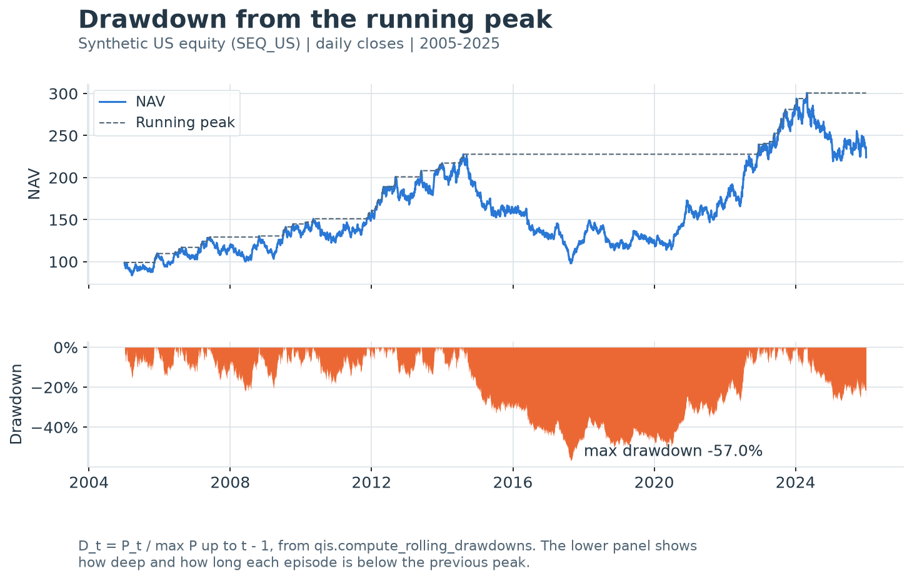

---
myst:
  html_meta:
    description: >-
      Running, maximum and current drawdowns, drawdown episodes, time under water and the
      drawdown-based Calmar and MaxDD/Vol columns, with their grid and horizon dependence, as
      implemented in qis.
---

# Drawdowns and time under water

*Author: [Artur Sepp](https://github.com/ArturSepp)*

Implemented in [qis — Quantitative Investment Strategies](https://github.com/ArturSepp/QuantInvestStrats).
Software citation: [CITATION.cff](https://github.com/ArturSepp/QuantInvestStrats/blob/main/CITATION.cff).

A drawdown is the relative distance of a price or NAV below its highest previously observed
level, $D_t=P_t/\max_{t'\le t}P_{t'}-1$. Its minimum over a history is the maximum drawdown: the
worst loss a buy-and-hold investor could have realised between two observation dates. The time
spent below the peak is the time under water. Unlike volatility, these quantities are path
functionals: they depend on the order of returns, on the sampling grid and on the length of the
history, and this chapter states each dependence for the qis implementation.

## Overview

qis computes six drawdown objects from a level series:

1. the running drawdown $D_t$ (`qis.compute_rolling_drawdowns`);
2. the maximum and the current drawdown (`qis.compute_max_current_drawdown`);
3. the table of drawdown episodes with start, trough, end, depth and durations
   (`qis.compute_drawdowns_stats_table`);
4. time under water (`qis.compute_rolling_drawdown_time_under_water`);
5. summary statistics of a drawdown or time-under-water path (`qis.compute_avg_max_dd`);
6. the performance-table columns `MAX_DD`, `CURRENT_DD`, `MAX_DD_VOL` and `CALMAR_RATIO`
   produced by `qis.compute_ra_perf_table`.

Three facts govern the interpretation of every number these produce. First, sampling the same
path on a coarser nested grid can only make the maximum drawdown shallower, which is why the
performance table measures drawdowns on a calendar-day grid by default. Second, under a
Brownian model of log prices the expected maximum drawdown grows like $\sigma\sqrt{\tau}$ at zero
drift and only logarithmically in $\tau$ at positive drift, so maximum drawdowns of histories of
different lengths are not comparable. Third, the same set of returns in a different order has
the same total return but a different maximum drawdown.

## Inputs, notation, and assumptions

| Convention | This article |
|---|---|
| Return basis | Levels, not returns: price, total-return index or NAV; $D_t$ is a relative (compounded) drawdown; the Calmar numerator is the p.a. compound excess return |
| Sampling grid | Native index for `compute_rolling_drawdowns` and `compute_max_current_drawdown`; calendar days `D`, forward-filled, for the episode table, time under water and `PerfParams.freq_drawdown` |
| Annualisation | None for drawdowns and durations; the Calmar numerator uses 365.25-day years; `MAX_DD_VOL` divides by a volatility annualised with $\sqrt{\mathrm{AN}}$ on `freq_vol` |
| Mean adjustment | None: drawdowns are path functionals, and `compute_avg_max_dd` averages the path over time without demeaning |
| Timing | $D_t$ uses levels up to and including $t$ (point in time); maxima, episode ends and recovery flags are full-sample and known only ex post |
| Output units | Decimal fractions in $(-1,0]$, so `-0.25` is 25% below the peak; episode durations in calendar days (in observations with `freq=None`); time under water in grid steps |
| qis default | `compute_rolling_drawdowns(min_periods=1)`; `compute_drawdowns_stats_table(max_num=None, freq='D')`; `compute_rolling_drawdown_time_under_water(sampling_freq='D')`; `compute_avg_max_dd(is_max=True, q=0.1)`; `PerfParams().freq_drawdown='D'` |

| Symbol or input | Meaning | Units and convention |
|---|---|---|
| $P_t$ | Positive price or NAV at observation $t=1,\dots,T$ | Any scale; drawdowns do not depend on it |
| $M_t$ | Running peak $\max_{t'\le t}P_{t'}$ | Units of $P_t$; includes $t$ itself |
| $D_t$ | Drawdown $P_t/M_t-1$ | Decimal in $(-1,0]$ |
| $\mathrm{MDD}$ | Maximum drawdown $\min_t D_t$ | Signed decimal $\le 0$; column `MAX_DD` |
| $D_T$ | Current drawdown, at the last observation | Signed decimal; column `CURRENT_DD` |
| $X_t$ | Log level $\log P_t$ | Log units |
| $\theta_g$ | Fine-grid date of the $g$-th coarse observation, $g=1,\dots,G$ | Non-decreasing in $g$; coarse-grid quantities carry the superscript coarse |
| $\mathrm{TUW}_t$ | Time under water | Grid steps: calendar days on `D` |
| $t^{\mathrm{start}}$, $t^{\mathrm{peak}}$, $t^{\mathrm{last}}$ | Start, last at-peak point and last under-water point of one episode | Points of the episode grid |
| $t^{\mathrm{trough}}$, $t^{\mathrm{end}}$ | Trough and end of one episode | Points of the episode grid |
| $A$, $q$ | Dates kept by `compute_avg_max_dd`, and its tail level | Default $q=0.1$ |
| $R^{\mathrm{ex}}_{\mathrm{pa}}$ | P.a. compound excess return, column `PA_EXCESS_RETURN` | Decimal per annum; equals $R_{\mathrm{pa}}$ without a cash series |
| $\sigma_v$ | Table volatility, column `VOL` | $\sqrt{\mathrm{AN}}\,s(v)$ on `freq_vol`, log returns by default |
| $\mathrm{CR}$ | Calmar ratio as implemented, column `CALMAR_RATIO` | Dimensionless |
| $W_t$ | Standard Brownian motion | Time $t$ in years in the continuous model |
| $\mu$, $\sigma$ | Drift and volatility of the log level $X_t$ | Per year |
| $\mathcal{D}_\tau$ | Maximum log drawdown of a continuous path over horizon $\tau$ | Log units, $\ge 0$ |
| $\mathcal{D}^{W}_1$, $\mathcal{D}^{\pm}_h$ | Maximum drawdown of $W_t$ on $[0,1]$; of $\pm t+W_t$ on $[0,h]$ | Log units, $\ge 0$ |
| $\mathcal{D}^{(n)}_\tau$ | Maximum log drawdown observed at $n$ equally spaced dates | Log units, $\ge 0$ |
| $S$, $\mathcal{T}$, $z$, $c$, $\xi$ | Proof-local: supremum of $\lvert W_t\rvert$, exit time from $(-1,1)$, rescaled time, level, transform variable | Used in the Brownian proofs only |
| $n$, $\Delta$ | Number of monitoring steps and step length $\Delta=\tau/n$ | $\Delta$ in years |
| $\kappa$, $\zeta$ | Discrete-monitoring constant of Brownian extrema, about 0.5826; Riemann zeta function | Dimensionless |

Inputs are a `pandas.Series` or `pandas.DataFrame` of positive levels with a sorted
`DatetimeIndex`; the episode table accepts a Series only. Use a total-return index or NAV: a
price index that omits distributions overstates both the depth and the duration of drawdowns.
The drawdown of an excess-return NAV differs from the drawdown of the total-return NAV, since
the running peak is taken on a different path. Leading missing values stay missing; interior and
trailing missing values carry the last drawdown forward.

## Methodology

### Running peak and drawdown

**Definition.** For a positive level path $P_1,\dots,P_T$, the running peak, the drawdown, the
maximum drawdown and the current drawdown are

$$
M_t=\max_{t'\le t}P_{t'},
\qquad
D_t=\frac{P_t}{M_t}-1,
\qquad
\mathrm{MDD}=\min_{1\le t\le T}D_t,
\qquad
D_T .
$$

qis reports $\mathrm{MDD}$ and $D_T$ as signed, non-positive numbers. A drawdown of $-0.25$
describes a level 25% below the peak; it is not a return to be applied to the NAV again.

**Identity (range and monotonicity).** $-1<D_t\le 0$ for every $t$, with $D_t=0$ exactly when
$P_t$ is a new (weak) running high. The running maximum drawdown $\min_{t'\le t}D_{t'}$ is
non-increasing in $t$, and $\mathrm{MDD}\le D_T$.

**Proof.** $0<P_t\le M_t$ gives $0<P_t/M_t\le 1$. A minimum over a growing set cannot increase,
and $D_T$ is one of the terms of the minimum defining $\mathrm{MDD}$. $\square$

**Identity (pairwise form).** The maximum drawdown is the worst buy-then-sell return over all
ordered pairs of observation dates,

$$
\mathrm{MDD}=\min_{t'\le t}\left(\frac{P_t}{P_{t'}}-1\right).
$$

**Proof.** For fixed $t$, $P_t/P_{t'}$ is smallest at the $t'\le t$ that maximises $P_{t'}$,
so $\min_{t'\le t}P_t/P_{t'}=P_t/M_t$. Minimise over $t$. $\square$

> **Insight.** The pairwise form is the investor's reading of the statistic: the maximum
> drawdown is the loss of the unluckiest buy-and-hold investor who entered and left on
> observation dates. It also shows why drawdowns are path-dependent. Returns of +10%, −10%,
> +10%, −10% and of −10%, −10%, +10%, +10% have the same total return of −1.99%, but maximum
> drawdowns of −10.9% and −19%.

**Identity (log drawdown).** With $X_t=\log P_t$,

$$
\log(1+D_t)=X_t-\max_{t'\le t}X_{t'},
\qquad
-\log(1+\mathrm{MDD})=\max_{t'\le t}\,(X_{t'}-X_t).
$$

**Proof.** The logarithm is increasing, so it commutes with the maximum:
$\log M_t=\max_{t'\le t}X_{t'}$. The second identity follows from the pairwise form. $\square$

Log drawdowns are the natural object for the Brownian results below; simple drawdowns are what
qis reports. The map $x\mapsto e^{x}-1$ converts one into the other. Drawdowns are invariant to
rescaling the level, so NAVs rebased to 1 or to 100 give identical drawdowns.



[Open full-resolution preview](images/handbook_drawdown.png).

The exhibit plots $P_t$ and $M_t$ for the synthetic US equity series and, below them, $D_t$ from
`qis.compute_rolling_drawdowns`. Every gap between the NAV and its dashed peak is one episode of
the lower panel. The deepest trough, −57.0% on 21 August 2017, is the `MAX_DD` of this history.
The panel also shows why depth alone understates the experience: the years spent below the
previous peak are measured by time under water, defined below.

### Sampling-grid dependence

When qis resamples levels before measuring drawdowns (for `freq_drawdown`, the episode table and
time under water), each sampled value is the last observed level at or before the sampling date.
Month-end sampling of daily levels and forward-filling business-day levels onto calendar days
are both of this form. Let the coarse path be $P_{\theta_1},\dots,P_{\theta_G}$ with
$\theta_1\le\dots\le\theta_G$ fine-grid dates; repeated dates represent forward-filled values.

**Proposition (subsampling cannot deepen the maximum drawdown).** The coarse path satisfies
$D^{\mathrm{coarse}}_g\ge D_{\theta_g}$ for every $g$, and therefore

$$
\mathrm{MDD}^{\mathrm{coarse}}\ge\mathrm{MDD},
\qquad
\lvert\mathrm{MDD}^{\mathrm{coarse}}\rvert\le\lvert\mathrm{MDD}\rvert .
$$

Equality holds when the dates of a deepest peak and of its trough both belong to the coarse grid.

**Proof.** The coarse running peak is
$\max_{g'\le g}P_{\theta_{g'}}\le\max_{t'\le\theta_g}P_{t'}=M_{\theta_g}$, because every
$\theta_{g'}\le\theta_g$. Dividing $P_{\theta_g}$ by a smaller peak gives a larger drawdown. For
the maximum, apply the pairwise form: every coarse pair $(\theta_{g'},\theta_g)$ with $g'\le g$
is an ordered fine pair, and a minimum over a subset of pairs is no smaller. $\square$

Three consequences are used in qis:

- **Forward-filling onto a finer calendar leaves the maximum drawdown unchanged.** Rebasing
  business-day levels to calendar days (`freq='D'`) adds only repeated values, which create no
  new pair ratios, so `MAX_DD` on the default `freq_drawdown='D'` equals the maximum drawdown of
  the native business-day series.
- **Month-end sampling understates daily drawdowns.** `PerfParams(freq_drawdown='ME')` gives a
  shallower `MAX_DD` than the default. The worked example quantifies the gap.
- **Discrete monitoring understates the continuous-time drawdown.** Any observed path is a
  subsample of the underlying continuous path, so the Monte Carlo check below must fall short
  of the continuous-time formula.

The proposition is the correct form of a tempting but false claim that all drawdown statistics
shrink on a coarser grid. Only the depth of the maximum drawdown is ordered. There is no
ordering between grids that are not nested, such as Friday closes and month-end closes. The
number of episodes and their durations are not monotone: a coarse grid can miss a brief new
high and merge two episodes, or register a recovery to its own lower peak and split one. The
current drawdown is ordered only when both grids end on the same date; qis month-end sampling
drops a trailing incomplete month, so the coarse current drawdown can refer to an earlier date.

### Drawdown episodes

`compute_drawdowns_stats_table(price, max_num=None, freq='D')` first builds the episode grid: with
`freq='D'` the series is rebased to calendar days and forward-filled (any other pandas frequency
is sampled the same way); with `freq=None` it stays on its native grid, interior gaps
forward-filled. It then computes $D_t$ on that grid.

**Definition (episode, as implemented).** Let $\{t: D_t<0\}$ be the under-water set of the
episode grid. An episode is a maximal run of consecutive under-water grid points
$t^{\mathrm{peak}}+1,\dots,t^{\mathrm{last}}$; the point $t^{\mathrm{peak}}$ before the run has
$D=0$. For each episode:

- **start** $t^{\mathrm{start}}$: starting at $t^{\mathrm{peak}}$, step back while the previous
  point has the same level and $D=0$. The start is the *first* point of the plateau at the peak
  level immediately preceding the fall, not the last one;
- **trough** $t^{\mathrm{trough}}=\arg\min D_t$ over the run, the earliest point if tied;
  `max_dd` $=D_{t^{\mathrm{trough}}}$;
- **end**: if $t^{\mathrm{last}}$ is not the final grid point, the episode is recovered and
  $t^{\mathrm{end}}=t^{\mathrm{last}}+1$, the first point back at or above the peak. Otherwise
  the episode is unrecovered (`is_recovered=False`) and $t^{\mathrm{end}}=t^{\mathrm{last}}$,
  the final observation;
- **durations**: `days_dd` $=t^{\mathrm{end}}-t^{\mathrm{start}}$, `days_to_trough`
  $=t^{\mathrm{trough}}-t^{\mathrm{start}}$ and `days_recovery`
  $=t^{\mathrm{end}}-t^{\mathrm{trough}}$. With any non-`None` `freq` they are calendar days
  between grid dates, whatever the grid (`freq='B'` still gives calendar days). With
  `freq=None` they are counts of grid steps, that is of observations;
- **levels**: `peak`, `bottom` and `recovery` are the levels at start, trough and end.

The rows are sorted by `max_dd`, deepest first, ties broken by start date; `max_num` keeps the
first `max_num` rows. A path that is never under water returns an empty frame with the eleven
columns `start, trough, end, max_dd, days_dd, days_to_trough, days_recovery, peak, bottom,
recovery, is_recovered`.

Two details matter in practice. The recovery date of one episode can be the start date of the
next, when the recovery observation is itself a new peak and the level falls on the next point.
For an unrecovered episode, `days_recovery` is the time from the trough to the last observation:
a right-censored lower bound, not a recovery time, and `recovery` is the last level, below `peak`.

### Time under water

**Definition.** On a grid of dates, time under water counts the consecutive grid points, up to
and including $t$, at which the level is below its running peak:

$$
\mathrm{TUW}_t=
\begin{cases}
0, & D_t=0,\\
\mathrm{TUW}_{t-1}+1, & D_t<0 .
\end{cases}
$$

`compute_rolling_drawdown_time_under_water(prices, sampling_freq='D')` first rebases the levels
to calendar days (`'D'`) or business days (`'B'`) with forward filling, then returns the drawdown
and $\mathrm{TUW}_t$ on that grid. On `'D'`, $\mathrm{TUW}_t$ is the number of calendar days since
the last day at the running peak. Leading missing levels count as zero.

**Identity (episode duration and time under water).** On the same calendar-day grid, an episode
with start $t^{\mathrm{start}}$, last at-peak day $t^{\mathrm{peak}}$ and end $t^{\mathrm{end}}$
has

$$
t^{\mathrm{end}}-t^{\mathrm{start}}=
\begin{cases}
\mathrm{TUW}_{t^{\mathrm{end}}-1}+1+(t^{\mathrm{peak}}-t^{\mathrm{start}}), & \text{recovered},\\
\mathrm{TUW}_{t^{\mathrm{end}}}+(t^{\mathrm{peak}}-t^{\mathrm{start}}), & \text{unrecovered},
\end{cases}
$$

where the left side is `days_dd`.

**Proof.** $\mathrm{TUW}$ counts the under-water days $t^{\mathrm{peak}}+1,\dots$ of the run. The
episode duration adds the plateau $t^{\mathrm{peak}}-t^{\mathrm{start}}$ in front of the run and,
for a recovered episode, the recovery day after it. $\square$

The plateau term is not a curiosity. A peak on a Friday followed by a fall on Monday is, on the
calendar-day grid, a plateau of three days at the peak level (Saturday and Sunday are
forward-filled). The episode table starts on Friday; time under water counts from Sunday.

### Summary statistics of a drawdown path

**Definition.** For a Series $x_t$, `compute_avg_max_dd(ds=x, is_max, q)` keeps the set
$A=\{t: x_t\le 0\}$ when `is_max=False`, or $A=\{t: x_t\ge 0\}$ when `is_max=True`, ignoring
missing values, and returns the tuple

| Output | `is_max=False` | `is_max=True` |
|---|---|---|
| `avg` | mean of $x_t$ over $A$ | mean of $x_t$ over $A$ |
| `quant` | $q$-quantile over $A$ | $(1-q)$-quantile over $A$ |
| `nmax` | minimum over $A$ | maximum over $A$ |
| `last` | $x_T$, unfiltered | $x_T$, unfiltered |

Quantiles use NumPy's default linear interpolation. Zeros belong to $A$ in both branches.
Applied to $D_t$ with `is_max=False`, `avg` is the time-average drawdown including the dates at
the peak, `quant` is the level below which the drawdown spent a fraction $q$ of the time,
`nmax` is $\mathrm{MDD}$ and `last` is $D_T$. Applied to $\mathrm{TUW}_t$ with `is_max=True`,
the outputs are the average time under water, its $(1-q)$-quantile, the longest spell so far
and the current spell. These are the legends of `plot_rolling_drawdowns` and
`plot_rolling_time_under_water`.

> **Pitfall.** The default is `is_max=True`. Applied to a drawdown series, it keeps only the
> zeros at the peaks and returns `(0, 0, 0, last)`. Pass `is_max=False` for drawdowns.

### Drawdown-based ratios

#### Calmar ratio

**Definition (as implemented).** `compute_ra_perf_table` sets

$$
\mathrm{CR}=\frac{R^{\mathrm{ex}}_{\mathrm{pa}}}{\lvert\mathrm{MDD}\rvert}
=-\frac{R^{\mathrm{ex}}_{\mathrm{pa}}}{\mathrm{MDD}},
$$

where $R^{\mathrm{ex}}_{\mathrm{pa}}$ is `PA_EXCESS_RETURN` over each asset's native observed
support (compounded excess of `PerfParams.rates_data`, and equal to `PA_RETURN` when no cash
series is supplied), and $\mathrm{MDD}$ is `MAX_DD` over the full history on the
`freq_drawdown` grid, calendar days by default. For a history of one year or less the numerator
is the total return, not an annualised one.

Young (1991) introduced the Calmar ratio as the annual rate of return over a trailing 36-month
window divided by the maximum drawdown over the same window, usually computed on monthly data.
The qis column differs in three ways: it uses the full history for both terms, it measures the
drawdown on daily rather than month-end levels (a deeper drawdown by the proposition above,
hence a lower ratio), and it uses an excess return when a cash series is supplied. Because the
expected maximum drawdown grows with the horizon while the p.a. return does not, the
full-history ratio of a stationary strategy drifts down as its history lengthens. A fixed 36-month window removes that drift at the cost of
a noisier estimate. qis has no trailing-window Calmar function; the worked example computes
Young's version from a month-end slice.

The numerator is taken from the native-endpoint return table, whereas the Sharpe and Sortino
numerators use the `freq_vol` boundaries of their risk denominators. A path that is never under
water has $\mathrm{MDD}=0$, for which the column is undefined; the implementation then returns
negative infinity for a positive return.

#### Maximum drawdown over volatility

**Definition (as implemented).** `MAX_DD_VOL` $=\mathrm{MDD}/\sigma_v$ when $\sigma_v>0$, and
0 otherwise (including a missing volatility). By default the two terms live on different grids:
$\mathrm{MDD}$ on calendar days (`freq_drawdown='D'`) and $\sigma_v$ on month-end log returns
(`freq_vol='ME'`, `return_type=ReturnTypes.LOG`). With `perf_params=None`,
`compute_ra_perf_table` infers `freq` from the index, so for daily input $\sigma_v$ is a daily-grid
volatility and the column changes, while `MAX_DD` stays on `'D'`.

The ratio is not dimensionless in time. $\mathrm{MDD}$ is a pure number and $\sigma_v$ is per
square-root year, so the ratio carries square-root years, and the next section shows that at
zero drift its expectation grows like $\sqrt{\tau}$.

### Drawdowns of Brownian motion

Model the log level as $X_t=X_0+\mu t+\sigma W_t$ with $t$ in years. A geometric Brownian motion
for $P_t$ with expected instantaneous return $\mu+\sigma^2/2$ has exactly this log level. The
maximum log drawdown over $[0,\tau]$ is

$$
\mathcal{D}_\tau=\sup_{0\le t'\le t\le\tau}\,(X_{t'}-X_t)=-\log(1+\mathrm{MDD}_\tau),
$$

so the Brownian results below apply to $-\log(1+\mathrm{MDD})$, not to $\mathrm{MDD}$ itself.

**Proposition (scaling).** At zero drift,
$\mathcal{D}_\tau\overset{d}{=}\sigma\sqrt{\tau}\,\mathcal{D}^{W}_1$, where $\mathcal{D}^{W}_1$ is
the maximum drawdown of a standard Brownian motion on $[0,1]$. At drift $\mu\ne 0$,
$\mathcal{D}_\tau\overset{d}{=}(\sigma^2/\lvert\mu\rvert)\,\mathcal{D}^{\pm}_{\mu^2\tau/\sigma^2}$,
where $\mathcal{D}^{\pm}_{h}$ is the maximum drawdown of $\operatorname{sign}(\mu)\,t+W_t$ over
$[0,h]$.

**Proof.** $\mathcal{D}$ is positively homogeneous in the path and unchanged by a linear change of
the time variable. At zero drift, substitute $t=\tau z$ and use
$(W_{\tau z})_{z}\overset{d}{=}(\sqrt{\tau}\,W_z)_{z}$. With drift, substitute
$t=(\sigma^2/\mu^2)z$: then
$\mu t+\sigma W_t\overset{d}{=}(\sigma^2/\lvert\mu\rvert)\big(\operatorname{sign}(\mu)\,z+W_z\big)$,
and the horizon becomes $z\le\mu^2\tau/\sigma^2$. $\square$

**Proposition (zero drift).** For $\mu=0$,

$$
\mathbb{E}[\mathcal{D}_\tau]=\sqrt{\pi/2}\;\sigma\sqrt{\tau}\approx 1.2533\,\sigma\sqrt{\tau}.
$$

**Proof.** By scaling, take $\sigma=\tau=1$. By Lévy's theorem the process
$\max_{t'\le t}W_{t'}-W_t$ has the law of the reflected process $\lvert W_t\rvert$, so
$\mathcal{D}^{W}_1$ has the law of $S=\sup_{t\le 1}\lvert W_t\rvert$. Let $\mathcal{T}$ be the exit
time of $W$ from $(-1,1)$. Brownian scaling gives $\Pr(S\ge c)=\Pr(\mathcal{T}\le c^{-2})$, hence
$\mathbb{E}[S]=\int_0^\infty\Pr(\mathcal{T}\le c^{-2})\,dc=\mathbb{E}[\mathcal{T}^{-1/2}]$. Write
$\mathcal{T}^{-1/2}=\pi^{-1/2}\int_0^\infty\xi^{-1/2}e^{-\xi\mathcal{T}}\,d\xi$ and use the Laplace
transform $\mathbb{E}[e^{-\xi\mathcal{T}}]=1/\cosh\sqrt{2\xi}$; the substitution
$x=\sqrt{2\xi}$ gives
$\mathbb{E}[\mathcal{T}^{-1/2}]=\sqrt{2/\pi}\int_0^\infty\operatorname{sech}x\,dx=\sqrt{\pi/2}$.
[Magdon-Ismail et al. (2004)](https://doi.org/10.1239/jap/1077134674) derive the full
distribution, with and without drift. $\square$

With drift the horizon dependence changes character. Magdon-Ismail et al. (2004) give the
expectation for any drift; its large-horizon asymptotics are

$$
\begin{aligned}
\mathbb{E}[\mathcal{D}_\tau]&\approx
\frac{\sigma^2}{\mu}\left(\frac{1}{2}\log\frac{\mu^2\tau}{2\sigma^2}+0.9818\right),
&& \mu>0,\\
\mathbb{E}[\mathcal{D}_\tau]&\approx\lvert\mu\rvert\,\tau+\frac{\sigma^2}{\lvert\mu\rvert},
&& \mu<0,
\end{aligned}
$$

valid when $\mu^2\tau/\sigma^2$ is large. The scale is $\sigma^2/\lvert\mu\rvert=\sigma/\lvert
\mathrm{SR}\rvert$ with $\mathrm{SR}=\mu/\sigma$ the log-drift Sharpe ratio: at positive drift the
expected drawdown grows only logarithmically in the horizon, at zero drift like its square root,
and at negative drift linearly.

For simple drawdowns, Jensen's inequality applied to the convex map $x\mapsto e^{-x}$ gives
$\lvert\mathbb{E}[\mathrm{MDD}_\tau]\rvert\le 1-e^{-\mathbb{E}[\mathcal{D}_\tau]}$. At
$\sigma=16\%$ and zero drift, $\mathbb{E}[\mathcal{D}_\tau]$ is 0.20 over one year, 0.63 over ten
and 1.10 over thirty, bounding the expected simple maximum drawdown by 18%, 47% and 67%.

> **Insight.** Drawdown depth scales with volatility and with the square root of the horizon.
> Under the zero-drift benchmark, a 20-year history is expected to show a maximum log drawdown
> $\sqrt{20/3}\approx 2.6$ times deeper than a 3-year history of the same process. Ranking
> strategies or managers by maximum drawdown across track records of different lengths,
> or comparing a short track record with a long benchmark history, confounds skill with
> sample length. The same applies to `MAX_DD_VOL` and to the full-history Calmar ratio.

**Discrete monitoring.** Observing the path at $n$ equally spaced dates misses the true peaks and
troughs between observations, so by the grid proposition the discrete maximum drawdown is
pathwise no deeper than $\mathcal{D}_\tau$. For discretely monitored Brownian maxima, a classical
result is that the continuous maximum exceeds the discrete one by about $\kappa\sigma\sqrt{\Delta}$
in expectation, with $\kappa=-\zeta(1/2)/\sqrt{2\pi}\approx 0.5826$ and $\zeta$ the Riemann zeta
function. Applying this to both the peak and the trough is a heuristic that gives

$$
\mathbb{E}\big[\mathcal{D}^{(n)}_\tau\big]\approx
\sqrt{\pi/2}\;\sigma\sqrt{\tau}-2\kappa\,\sigma\sqrt{\Delta},
$$

a relative shortfall of $2\kappa/\sqrt{\pi n/2}\approx 0.93/\sqrt{n}$: 5.9% for $n=250$ daily
steps. The Monte Carlo check below confirms it to within sampling error.

### Drawdown risk in portfolio optimisation

[Chekhlov, Uryasev and Zabarankin (2005)](https://doi.org/10.1142/S0219024905002767) define the
conditional drawdown-at-risk (CDaR) of a portfolio as the mean of the worst fraction of the
drawdowns observed along its sample path. With that fraction equal to $q$, CDaR is the mean of
the drawdowns at or below their $q$-quantile: $q=1$ gives the average drawdown and $q\to 0$ the
maximum drawdown. Portfolio optimisation under CDaR constraints reduces to a linear programme. In
that linear formulation drawdowns are measured on uncompounded cumulative returns, as absolute
differences from the peak, whereas qis measures them relative to the peak of the compounded
level. `compute_avg_max_dd(is_max=False)` returns the two limits (the time-average drawdown and
the maximum drawdown) and the $q$-quantile itself, the drawdown-at-risk threshold. qis does not
compute the tail mean; when it is needed, average the drawdown series below that threshold.

## Worked example

### A hand-built path with two episodes

Twelve business-day closes from Monday 1 January 2024 rise from 100 to a peak of 110, fall to
88, recover to exactly 110 on 8 January, reach a new peak of 120 held for two days (9 and 10
January), fall to 90 and end at 102 on 16 January. The running drawdown is 0, 0, −10%, −20%,
−5%, 0, 0, 0, −10%, −25%, −18% and −15%, so $\mathrm{MDD}=-25\%$ (120 to 90) and $D_T=-15\%$.

On the default calendar-day grid the episode table has two rows, deepest first:

| Start | Trough | End | `max_dd` | `days_dd` | `days_to_trough` | `days_recovery` | Recovered |
|---|---|---|---:|---:|---:|---:|---|
| 9 Jan | 12 Jan | 16 Jan | −0.25 | 7 | 3 | 4 | no |
| 2 Jan | 4 Jan | 8 Jan | −0.20 | 6 | 2 | 4 | yes |

The later episode starts on 9 January, the first day of the plateau at 120, not on 10 January.
Counted in observations (`freq=None`) the durations are 5, 3, 2 and 4, 2, 2. Time under water on
calendar days peaks at 6 on 16 January; on business days it peaks at 4. Both links between the
two objects obey the duration identity: $6=5+1+0$ for the recovered episode (5 days under water
on 7 January, the recovery day, no plateau) and $7=6+1$ for the unrecovered one (6 days under water
on 16 January and a one-day plateau). The path summary gives a time-average drawdown of
$-1.03/12\approx-8.58\%$, a 10% quantile of −19.8%, a maximum of −25% and a last value of −15%.
The history is shorter than a year, so the Calmar numerator is the 2% total return and
$\mathrm{CR}=0.02/0.25=0.08$.

```python
import numpy as np
import pandas as pd
import qis

dates = pd.bdate_range('2024-01-01', periods=12)
price = pd.Series([100.0, 110.0, 99.0, 88.0, 104.5, 110.0,
                   120.0, 120.0, 108.0, 90.0, 98.4, 102.0], index=dates, name='strategy')

# running drawdown against hand values and against a direct numpy running maximum
drawdown = qis.compute_rolling_drawdowns(prices=price)
hand_drawdown = [0.0, 0.0, -0.10, -0.20, -0.05, 0.0, 0.0, 0.0, -0.10, -0.25, -0.18, -0.15]
np.testing.assert_allclose(drawdown.to_numpy(), hand_drawdown, atol=1e-12)
levels = price.to_numpy()
np.testing.assert_allclose(drawdown.to_numpy(), levels / np.maximum.accumulate(levels) - 1.0)

max_dd, current_dd = qis.compute_max_current_drawdown(prices=price)
np.testing.assert_allclose([max_dd, current_dd], [-0.25, -0.15], atol=1e-12)
pairwise = min(levels[t] / levels[s] - 1.0 for t in range(12) for s in range(t + 1))
np.testing.assert_allclose(pairwise, max_dd, atol=1e-12)

# episode table on calendar days (default) and on observation counts
episodes = qis.compute_drawdowns_stats_table(price=price)
assert list(episodes['start']) == list(pd.to_datetime(['2024-01-09', '2024-01-02']))
assert list(episodes['trough']) == list(pd.to_datetime(['2024-01-12', '2024-01-04']))
assert list(episodes['end']) == list(pd.to_datetime(['2024-01-16', '2024-01-08']))
assert episodes['is_recovered'].tolist() == [False, True]
np.testing.assert_allclose(episodes['max_dd'], [-0.25, -0.20], atol=1e-12)
durations = ['days_dd', 'days_to_trough', 'days_recovery']
np.testing.assert_allclose(episodes[durations].to_numpy(), [[7, 3, 4], [6, 2, 4]])
np.testing.assert_allclose(episodes[['peak', 'bottom', 'recovery']].to_numpy(),
                           [[120.0, 90.0, 102.0], [110.0, 88.0, 110.0]])
by_observation = qis.compute_drawdowns_stats_table(price=price, freq=None)
np.testing.assert_allclose(by_observation[durations].to_numpy(), [[5, 3, 2], [4, 2, 2]])

# time under water on calendar days and on business days
_, tuw_days = qis.compute_rolling_drawdown_time_under_water(prices=price)
np.testing.assert_allclose(tuw_days.to_numpy(),
                           [0, 0, 1, 2, 3, 4, 5, 0, 0, 0, 1, 2, 3, 4, 5, 6])
_, tuw_business = qis.compute_rolling_drawdown_time_under_water(prices=price, sampling_freq='B')
np.testing.assert_allclose(tuw_business.to_numpy(), [0, 0, 1, 2, 3, 0, 0, 0, 1, 2, 3, 4])
# duration identity: recovered (no plateau) and unrecovered (one plateau day)
assert episodes.loc[1, 'days_dd'] == tuw_days.loc['2024-01-07'] + 1 + 0
assert episodes.loc[0, 'days_dd'] == tuw_days.loc['2024-01-16'] + 1

# path summaries: drawdowns need is_max=False; time under water uses is_max=True
np.testing.assert_allclose(qis.compute_avg_max_dd(ds=drawdown, is_max=False),
                           [-1.03 / 12, -0.20 + 0.1 * 0.02, -0.25, -0.15], atol=1e-12)
np.testing.assert_allclose(qis.compute_avg_max_dd(ds=drawdown)[:3], [0.0, 0.0, 0.0])
np.testing.assert_allclose(qis.compute_avg_max_dd(ds=tuw_days, is_max=True), [2.25, 5, 6, 6])

# performance-table columns: history < 1 year, so the Calmar numerator is the total return
row = qis.compute_ra_perf_table(prices=price, perf_params=qis.PerfParams(freq='B')).loc['strategy']
np.testing.assert_allclose(row[qis.PerfStat.MAX_DD.to_str()], -0.25, atol=1e-12)
np.testing.assert_allclose(row[qis.PerfStat.CURRENT_DD.to_str()], -0.15, atol=1e-12)
np.testing.assert_allclose(row[qis.PerfStat.CALMAR_RATIO.to_str()], 0.02 / 0.25, atol=1e-12)

# path dependence: the same four returns in two orders
up_down = pd.Series(100.0 * np.cumprod([1.0, 1.1, 0.9, 1.1, 0.9]), index=dates[:5])
down_up = pd.Series(100.0 * np.cumprod([1.0, 0.9, 0.9, 1.1, 1.1]), index=dates[:5])
np.testing.assert_allclose(up_down.iloc[-1], down_up.iloc[-1])  # both 98.01
np.testing.assert_allclose(qis.compute_max_current_drawdown(prices=up_down)[0], 98.01 / 110 - 1)
np.testing.assert_allclose(qis.compute_max_current_drawdown(prices=down_up)[0], -0.19)
```

### Grid and ratio conventions on a synthetic history

The frozen synthetic universe supplies twelve years of business-day NAVs. With `PerfParams()`
the drawdown grid is `'D'` and the volatility grid is `'ME'`. The US equity sleeve `SEQ_US` has a
maximum drawdown of −46.37% on the calendar-day grid, identical to its native business-day value,
and −45.18% on month-end closes; the Treasury sleeve `SBD_TSY` has −10.95% and −9.52%. With
p.a. returns of 1.30% and 4.00%, the full-history Calmar ratios are 0.028 and 0.365. Over the
last 36 month-ends, Young's convention gives −0.39 and 0.36: the equity sleeve lost 16.9% a year
over that window, which the full-history ratio does not show.

```python
from qis.datasets import generate_synthetic_universe

universe = generate_synthetic_universe(start='2014-01-02', end='2025-12-31', seed=20260725,
                                       apply_quirks=False)
prices = universe.prices[['SEQ_US', 'SBD_TSY']]  # business-day NAVs

MAX_DD, CURRENT_DD = qis.PerfStat.MAX_DD.to_str(), qis.PerfStat.CURRENT_DD.to_str()
MAX_DD_VOL, VOL = qis.PerfStat.MAX_DD_VOL.to_str(), qis.PerfStat.VOL.to_str()
CALMAR, PA_EXCESS = qis.PerfStat.CALMAR_RATIO.to_str(), qis.PerfStat.PA_EXCESS_RETURN.to_str()

daily = qis.compute_ra_perf_table(prices=prices, perf_params=qis.PerfParams())
monthly = qis.compute_ra_perf_table(prices=prices,
                                    perf_params=qis.PerfParams(freq_drawdown='ME'))

# forward-filling onto calendar days leaves the maximum drawdown unchanged
native_max_dd, _ = qis.compute_max_current_drawdown(prices=prices)
np.testing.assert_allclose(daily[MAX_DD], native_max_dd, atol=1e-12)
# a coarser nested grid can only make it shallower; same last date, so also for the current one
assert (monthly[MAX_DD] >= daily[MAX_DD]).all()
assert (monthly[CURRENT_DD] >= daily[CURRENT_DD]).all()
np.testing.assert_allclose(daily[MAX_DD], [-0.4637, -0.1095], atol=5e-5)
np.testing.assert_allclose(monthly[MAX_DD], [-0.4518, -0.0952], atol=5e-5)

# independent month-end calculation with pandas and numpy
month_end = prices.resample('ME').last()
np.testing.assert_allclose(monthly[MAX_DD], (month_end / month_end.cummax() - 1.0).min())

# the two ratio columns exactly as implemented
np.testing.assert_allclose(daily[CALMAR], -daily[PA_EXCESS] / daily[MAX_DD])
np.testing.assert_allclose(daily[MAX_DD_VOL], daily[MAX_DD] / daily[VOL])
np.testing.assert_allclose(daily[CALMAR], [0.0281, 0.3648], atol=5e-5)

# Young (1991): p.a. return and maximum drawdown over the last 36 month-ends
window = month_end.iloc[-37:]
young_return = (window.iloc[-1] / window.iloc[0]) ** (1.0 / 3.0) - 1.0
young_max_dd = (window / window.cummax() - 1.0).min()
young_calmar = -young_return / young_max_dd
np.testing.assert_allclose(young_return, [-0.1688, 0.0197], atol=5e-5)
np.testing.assert_allclose(young_calmar, [-0.3934, 0.3620], atol=5e-5)
```

### Monte Carlo check of the Brownian benchmark

The block simulates 4,000 driftless log-level paths of $n=250$ steps over $\tau=1$ year with
$\sigma=20\%$. qis computes each path's maximum drawdown from the level $e^{X_t}$, and
$-\log(1+\mathrm{MDD})$ matches a direct numpy calculation of the maximum log drawdown. The mean
is 0.2345, against a continuous-time value of $\sqrt{\pi/2}\times 0.2=0.2507$: a ratio of 0.935,
below one as the grid proposition requires. The discrete-monitoring prediction is
$0.2507-2\times 0.5826\times 0.2\times\sqrt{1/250}=0.2359$, within one Monte Carlo standard error
(0.0016) of the simulated mean. The test therefore asserts a mean below the continuous value and
within 2% of it after the correction, about three standard errors. Subsampling every fifth step
(a weekly grid) never produces a deeper drawdown on any path.

```python
rng = np.random.default_rng(20260725)
n_paths, n_steps, sigma, tau = 4000, 250, 0.20, 1.0
step = tau / n_steps
shocks = sigma * np.sqrt(step) * rng.standard_normal((n_steps, n_paths))
log_levels = np.vstack([np.zeros((1, n_paths)), np.cumsum(shocks, axis=0)])

# independent numpy maximum log drawdown, and qis on the corresponding levels
log_max_dd = np.max(np.maximum.accumulate(log_levels, axis=0) - log_levels, axis=0)
paths = pd.DataFrame(np.exp(log_levels), index=pd.bdate_range('2025-01-01', periods=n_steps + 1))
qis_max_dd, _ = qis.compute_max_current_drawdown(prices=paths)
np.testing.assert_allclose(-np.log1p(qis_max_dd), log_max_dd, atol=1e-12)

continuous = np.sqrt(np.pi / 2.0) * sigma * np.sqrt(tau)
kappa = 0.5826  # discrete-monitoring constant of Brownian extrema
discrete = continuous - 2.0 * kappa * sigma * np.sqrt(step)
mean = log_max_dd.mean()
standard_error = log_max_dd.std(ddof=1) / np.sqrt(n_paths)
np.testing.assert_allclose([continuous, discrete, mean], [0.2507, 0.2359, 0.2345], atol=5e-5)
np.testing.assert_allclose(standard_error, 0.0016, atol=1e-4)
assert mean < continuous
assert abs(mean - discrete) / continuous < 0.02

# pathwise grid proposition: a weekly subsample is never deeper
weekly = log_levels[::5]
weekly_max_dd = np.max(np.maximum.accumulate(weekly, axis=0) - weekly, axis=0)
assert np.all(weekly_max_dd <= log_max_dd + 1e-15)
```

## Implementation in qis

| Quantity | Formula | qis entry point |
|---|---|---|
| Running drawdown | $D_t=P_t/M_t-1$, carried over missing levels | `qis.compute_rolling_drawdowns(prices, min_periods=1)` |
| Maximum and current drawdown | $\min_t D_t$ and $D_T$ | `qis.compute_max_current_drawdown(prices)` |
| Drawdown and time under water | $D_t$ and $\mathrm{TUW}_t$ on a `'D'` or `'B'` grid | `qis.compute_rolling_drawdown_time_under_water(prices, sampling_freq='D')` |
| Episode table | start, trough, end, depth, durations, levels | `qis.compute_drawdowns_stats_table(price, max_num=None, freq='D')` |
| Path summary | mean, quantile, extreme, last | `qis.compute_avg_max_dd(ds, is_max=True, q=0.1)` |
| Table maximum drawdown | $\mathrm{MDD}$ on `freq_drawdown` | `PerfStat.MAX_DD` in `qis.compute_ra_perf_table` |
| Table current drawdown | $D_T$ on `freq_drawdown` | `PerfStat.CURRENT_DD` |
| Drawdown over volatility | $\mathrm{MDD}/\sigma_v$, or 0 | `PerfStat.MAX_DD_VOL` |
| Calmar ratio | $-R^{\mathrm{ex}}_{\mathrm{pa}}/\mathrm{MDD}$ | `PerfStat.CALMAR_RATIO` |
| Drawdown grid | calendar days by default | `qis.PerfParams(freq_drawdown='D')` |
| Drawdown panel | $D_t$ on the native grid | `qis.plot_rolling_drawdowns(prices, dd_legend_type=DdLegendType.DETAILED)` |
| Time-under-water panel | $\mathrm{TUW}_t$ on `'D'` | `qis.plot_rolling_time_under_water(prices, dd_legend_type=DdLegendType.SIMPLE)` |
| Deepest episode paths | $P_t/P_{t^{\mathrm{start}}}-1$ from start to end | `qis.plot_top_drawdowns_paths(price, freq='D', max_num=10)` |
| Level and drawdown panels | $P_t$ above $D_t$ | `qis.plot_prices_with_dd(prices, dd_legend_type=DdLegendType.SIMPLE)` |

The numerical functions live in
[perf_stats.py](https://github.com/ArturSepp/QuantInvestStrats/blob/main/src/qis/perfstats/perf_stats.py),
the `PerfStat` columns and `PerfParams` in
[config.py](https://github.com/ArturSepp/QuantInvestStrats/blob/main/src/qis/perfstats/config.py),
and the plots in
[drawdowns.py](https://github.com/ArturSepp/QuantInvestStrats/blob/main/src/qis/plots/derived/drawdowns.py)
and [prices.py](https://github.com/ArturSepp/QuantInvestStrats/blob/main/src/qis/plots/derived/prices.py).
API pages: {doc}`compute_rolling_drawdowns <api/generated/qis.compute_rolling_drawdowns>`,
{doc}`compute_drawdowns_stats_table <api/generated/qis.compute_drawdowns_stats_table>` and
{doc}`compute_ra_perf_table <api/generated/qis.compute_ra_perf_table>`.

Contract details:

- `compute_rolling_drawdowns` takes the expanding maximum of the valid levels. With
  `min_periods=k` the drawdown stays missing until $k$ valid levels have been seen; later values
  are unchanged, because the peak is still the maximum over all earlier levels. Missing levels
  after the first valid one carry the previous drawdown forward.
- `compute_max_current_drawdown` returns two floats for a Series and two arrays, one entry per
  column, for a DataFrame. The maximum ignores missing values; the current drawdown is the last
  row after the forward fill, so a column that stopped early reports its last observed drawdown.
- In `compute_ra_perf_table`, `MAX_DD` and `CURRENT_DD` come from `compute_max_current_drawdown`
  on levels sampled at `freq_drawdown` and cut at each asset's last observation. Passing
  `PerfParams(freq=...)` does not change `freq_drawdown`, whose own default `'D'` takes
  precedence.
- `compute_rolling_drawdown_time_under_water` returns both series on the rebased `'D'` or `'B'`
  grid, which has more rows than a business-day input.
- `plot_rolling_drawdowns` and `plot_prices_with_dd` draw $D_t$ on the grid of the supplied
  levels, not on `freq_drawdown`; their legends use `compute_avg_max_dd(is_max=False)`.
  `plot_rolling_time_under_water` counts calendar days. `plot_top_drawdowns_paths` takes its
  episodes from `compute_drawdowns_stats_table` on calendar days and plots each episode as
  $P_t/P_{t^{\mathrm{start}}}-1$ against the number of `freq` observations since its start.
- There is no trailing-window maximum drawdown or Calmar function; slice the levels and call
  `compute_max_current_drawdown`, as in the Young calculation above.

> **Pitfall.** "Rolling" in `compute_rolling_drawdowns` and
> `compute_rolling_drawdown_time_under_water` means running: the peak is an expanding maximum
> from the first observation, not a maximum over a trailing window. A drawdown that began before
> the start of the supplied history is invisible, and truncating the history changes every later
> drawdown.

## Interpretation and limitations

- State the grid with every drawdown number. The table default (`'D'`) equals the native
  business-day value; month-end or quarter-end sampling reports shallower drawdowns, and the
  underlying continuous-time path is deeper still. With `freq_drawdown='ME'`, a fall inside the
  current incomplete month is invisible to both `MAX_DD` and `CURRENT_DD`.
- Maximum drawdown is a single extreme of one path. Its expectation grows with volatility and
  with the horizon, so compare it only across histories of equal length, or against the Brownian
  benchmark $\sqrt{\pi/2}\,\sigma\sqrt{\tau}$ for the same $\sigma$ and $\tau$.
- The full-history Calmar ratio and `MAX_DD_VOL` inherit that horizon dependence. Young's
  36-month Calmar ratio fixes the window; `MAX_DD_VOL` can be compared across horizons only after
  dividing by $\sqrt{Y}$, a normalisation qis does not apply.
- Drawdowns are point in time as a series, but episode ends, troughs and recovery flags are known
  only after the fact. Using the full-sample maximum drawdown to size or select an earlier
  position is look-ahead.
- Unrecovered episodes are right-censored: `days_dd` and `days_recovery` are lower bounds.
- Smoothed or stale marks understate drawdowns, because the reported path is a moving average of
  the economic one; see [private-asset unsmoothing](private_asset_unsmoothing.md). With serially
  correlated returns, the Brownian benchmark applies with the long-run volatility rather than the
  per-period one.
- Drawdowns are defined on positive levels. A long-short P&L that can reach zero, or a series in
  rate or spread units, needs a NAV construction first; see
  [returns and NAVs](returns_and_navs.md).

## See also

- [Performance analytics and Sharpe conventions](performance_analytics_and_sharpe.md)
- [The performance-statistic catalogue](performance_statistics.md)
- [Risk-adjusted returns and volatility targeting](risk_adjusted_returns.md)
- [Returns, NAVs, excess returns, fees and leverage](returns_and_navs.md)
- [Notation and conventions](notation_and_conventions.md)
- [Performance statistics and reporting frequency](frequency_convention_note.md)
- [Incomplete and mixed-frequency data](incomplete_and_mixed_frequency_data.md)
- [Serial dependence and autocorrelation](serial_dependence.md)
- [Private-asset unsmoothing and de-levering](private_asset_unsmoothing.md)
- [Bibliography](bibliography.md)

## References

1. Magdon-Ismail, M., Atiya, A. F., Pratap, A., and Abu-Mostafa, Y. S. (2004). On the Maximum Drawdown of a Brownian Motion. *Journal of Applied Probability*, 41(1), 147–161. [DOI: 10.1239/jap/1077134674](https://doi.org/10.1239/jap/1077134674). The distribution and expectation of the maximum drawdown of Brownian motion with drift.
2. Chekhlov, A., Uryasev, S., and Zabarankin, M. (2005). Drawdown Measure in Portfolio Optimization. *International Journal of Theoretical and Applied Finance*, 8(1), 13–58. [DOI: 10.1142/S0219024905002767](https://doi.org/10.1142/S0219024905002767). Conditional drawdown-at-risk and its linear-programming optimisation.
3. Young, T. W. (1991). Calmar Ratio: A Smoother Tool. *Futures*, 20(1), 40. The 36-month Calmar ratio.
4. Bacon, C. R. (2008). *Practical Portfolio Performance Measurement and Attribution*, 2nd edition. Wiley. Drawdown-based risk-adjusted ratios, including the Calmar ratio, in performance measurement practice.
5. Sepp, A. qis: Performance analytics, portfolio backtesting, risk analysis, and factsheet reporting in Python. [Software citation metadata](https://github.com/ArturSepp/QuantInvestStrats/blob/main/CITATION.cff).
