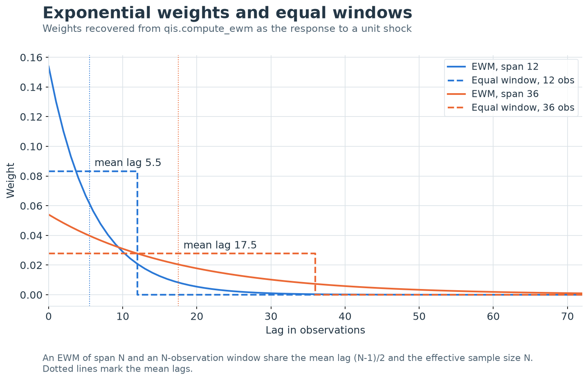

---
myst:
  html_meta:
    description: >-
      Exponentially weighted means, volatilities, covariances, betas, trend filters, Sharpe
      ratios and outlier scores, with the seeds, mean adjustment and missing-data rules of the
      single EWM recursion that qis uses to compute them.
---

# Exponentially weighted estimators

*Author: [Artur Sepp](https://github.com/ArturSepp)*

Implemented in [qis — Quantitative Investment Strategies](https://github.com/ArturSepp/QuantInvestStrats).
Software citation: [CITATION.cff](https://github.com/ArturSepp/QuantInvestStrats/blob/main/CITATION.cff).

An exponentially weighted (EWM) estimator replaces an equal-weight window by weights
$(1-\lambda)\lambda^k$ on the observation $k$ rows old. In qis a single recursion,
$m_t=\lambda m_{t-1}+(1-\lambda)x_t$, produces every such estimator: run on observations it is a
mean, on squares a variance, on outer products a covariance matrix and on cross products a beta.
This chapter derives the properties of the weights, states how the implementation seeds the
recursion, removes means and treats missing rows, and proves the results that users of the
estimators rely on.

## Overview

The chapter answers five questions.

1. **How much history does a span use?** A span $N$ has decay $\lambda=1-2/(N+1)$, mean lag
   $(N-1)/2$, effective sample size $N$ and half-life close to $0.35N$.
2. **What does the recursion start from, and what does it do at a gap?** The seed and the
   missing-data policy are arguments, and two seeds use the full sample.
3. **Which second moment is estimated?** By default a second moment about zero; a centred
   estimate needs an explicit mean adjustment.
4. **Which properties survive?** An EWM covariance matrix is positive semidefinite for complete
   data, but the default missing-data policy can break that. The EWM Newey–West variance can be
   negative.
5. **How are EWM outputs normalised?** Unit-variance scaling, the two-span trend filter, EWM
   Sharpe ratios and the EWM score each have an exact definition, stated here.

| Question | qis entry point | Output |
|---|---|---|
| Smoothed level or mean | `qis.compute_ewm` | EWM mean $m_t$, same container as the input |
| Volatility | `qis.compute_ewm_vol` | $\hat\sigma_t$ per period, or annualised |
| Volatility corrected for autocorrelation | `qis.compute_ewm_newey_west_vol` | Newey–West EWM volatility and its variance ratio |
| Covariance matrix at the last date or at every date | `qis.compute_ewm_covar`, `qis.compute_ewm_covar_tensor` | $n\times n$ matrix or $T\times n\times n$ tensor |
| Covariance from vol-normalised returns | `qis.compute_ewm_covar_tensor_vol_norm_returns` | Covariance tensor, normalised tensor, vols |
| Beta, cross moment or correlation | `qis.compute_ewm_cross_xy`, `qis.compute_one_factor_ewm_betas` | Time series per column |
| Trend signal | `qis.compute_ewm_long_short_filter` | Unit-variance two-span filter |
| Running Sharpe ratio | `qis.compute_ewm_sharpe` | Annualised EWM mean or Sharpe path |
| Outlier score and cleaning | `qis.compute_ewm_score`, `qis.filter_outliers`, `qis.ewm_insample_winsorising` | Score; cleaned series |

## Inputs, notation, and assumptions

| Convention | This article |
|---|---|
| Return basis | Any input series; the estimators do not transform it. The examples use simple returns |
| Sampling grid | The rows of the input. The decay applies per row, so a span counts observations, not calendar time |
| Annualisation | Off by default. With `annualize=True` variances are multiplied by $\mathrm{AN}$ inferred from the index, so volatilities scale by $\sqrt{\mathrm{AN}}$; a bare ndarray uses 1 with a warning |
| Mean adjustment | `MeanAdjType.NONE` by default: second moments about zero. `EWMA` and `EXPANDING` are point in time; `INSAMPLE` is full sample |
| Timing | An estimate dated $t$ uses rows up to and including $t$ and applies from $t+1$. Seeds `InitType.MEAN` and `InitType.VAR`, and the vol-normalised tensor's seed, use the full sample |
| Output units | Per period in the units of the input: $x$ for a mean or volatility, $x^2$ for a variance; betas and correlations are dimensionless |
| qis default | `compute_ewm(ewm_lambda=0.94, init_type=InitType.X0, nan_backfill=NanBackfill.FFILL)`; `compute_ewm_vol` adds `mean_adj_type=MeanAdjType.NONE, annualize=False` |

| Symbol or input | Meaning | Units and convention |
|---|---|---|
| $x_t$, $y_t$ | Input observations at row $t$: returns, signals or residuals | Units of the input; rows $t=0,\dots,T-1$ |
| $\lambda$, $N$ | EWM decay and span, $\lambda=1-2/(N+1)$ | `ewm_lambda` (default 0.94) or `span`, which overrides it |
| $H$ | Half-life, $\lambda^H=1/2$ | Rows |
| $\omega_k$ | Stationary weight on the observation $k$ rows old | Dimensionless; the weights sum to one |
| $\bar k$, $N_{\mathrm{eff}}$ | Mean lag and Kish effective sample size of the weights | Rows; observations |
| $m_t$, $m_0$ | EWM mean and its seed | Units of $x$ |
| $\mathcal{E}_\lambda(X)_t$ | EWM of a series $X$ with decay $\lambda$ and seed $X_0$ | Units of $X$ |
| $\hat\mu_t$, $\tilde x_t$ | Mean removed under `MeanAdjType`; $\tilde x_t=x_t-\hat\mu_t$ | Units of $x$ |
| $v_t$, $\hat\sigma_t$ | EWM second moment of $\tilde x$ and its square root | Per period unless annualised |
| $\underline v_t$, $\gamma$ | Rolling quantile floor of $v_t$ and its level | `vol_floor_quantile` |
| $\hat\Sigma_t$ | EWM covariance matrix | Per period; seed $\hat\Sigma_{-1}$ is `covar0` |
| $\Gamma_t$, $\hat\rho_t$ | EWM covariance of vol-normalised returns; its correlation matrix | Dimensionless |
| $M^{xy}_t$, $M^{xx}_t$, $M^{yy}_t$ | EWM cross and second moments | Units of $xy$, $x^2$, $y^2$ |
| $\hat\beta_t$ | EWM beta | Units of $y$ per unit of $x$ |
| $\xi_t$ | IID noise with mean zero and unit variance | Used in the variance results |
| $N_L$, $N_S$, $\lambda_L$, $\lambda_S$ | Long and short spans and decays of the two-span filter | $1\le N_S<N_L$ |
| $\kappa$, $F_t$ | Normaliser and output of the two-span filter | Dimensionless |
| $X_t$ | Cumulative sum $\sum_{j=1}^{t}x_j$, with $X_0=0$ | Log price relative when $x$ are log returns |
| $q$, $c_{k,t}$ | Newey–West lag count (`num_lags`); EWM lag-$k$ cross moment | Rows; units of $x^2$ |
| $z_t$ | EWM score | Dimensionless |
| $h$ | Horizon of `ewm_xy_convolution` | Rows, from `get_annualization_factor(freq)` |

Rows are counted from $t=0$, the first row of the input. Unless stated otherwise the input is a
panel without missing rows; the section on missing data states what changes when it has them.
Every estimate dated $t$ includes the observation at $t$. To use one inside a backtest, apply it
from $t+1$, and prefer seeds and mean adjustments that are point in time.

## Methodology

### The recursion and its weights

**Definition.** Given a decay $\lambda\in[0,1)$ and a seed $m_0$, the EWM of $x$ is

$$
m_t=\lambda m_{t-1}+(1-\lambda)x_t,\qquad t\ge 1 .
$$

The output at row 0 is the seed itself: $x_0$ enters only through the seed. With a span $N$ the
decay is $\lambda=1-2/(N+1)$; `span` overrides `ewm_lambda` in every function of the chapter.
The default `ewm_lambda=0.94` is the daily decay of RiskMetrics (J.P. Morgan and Reuters,
1996), a span of about 32.3 rows.

**Identity (unrolled recursion).** For $t\ge 0$,

$$
m_t=\lambda^t m_0+\sum_{k=0}^{t-1}(1-\lambda)\lambda^k x_{t-k}.
$$

**Proof.** The case $t=0$ is the seed. If the identity holds at $t-1$, substituting it into
$\lambda m_{t-1}+(1-\lambda)x_t$ multiplies every earlier weight by $\lambda$ and adds weight
$1-\lambda$ on $x_t$. $\square$

The observation weights and the seed weight sum to
$\lambda^t+(1-\lambda)(1-\lambda^t)/(1-\lambda)=1$. As $t$ grows the seed weight vanishes and the
weights approach the stationary weights

$$
\omega_k=(1-\lambda)\lambda^k,\qquad k=0,1,2,\dots,\qquad \sum_{k\ge 0}\omega_k=1 .
$$

With the seed `InitType.X0`, $m_0=x_0$, the recursion is exactly pandas'
`Series.ewm(span=N, adjust=False).mean()`: pandas sets its smoothing factor to
$2/(N+1)=1-\lambda$, starts at $x_0$ and runs the same update. The pandas default
`adjust=True` instead normalises the weights over the available history,
$\sum_{k=0}^{t}\lambda^k x_{t-k}/\sum_{k=0}^{t}\lambda^k$, and differs during warm-up. The two
implementations also differ when a column starts with missing rows or has gaps, as described
below.

### Span, mean lag, effective sample size and half-life

**Identity (mean lag).** The mean age of the stationary weights is

$$
\bar k=\sum_{k\ge 0}k\,\omega_k=\frac{\lambda}{1-\lambda}=\frac{N-1}{2}.
$$

**Proof.** Differentiating the geometric series gives $\sum_k k\lambda^k=\lambda/(1-\lambda)^2$;
multiply by $1-\lambda$. With $\lambda=(N-1)/(N+1)$ and $1-\lambda=2/(N+1)$ the ratio is
$(N-1)/2$. $\square$

**Identity (effective sample size).** The Kish effective sample size of the stationary weights is

$$
N_{\mathrm{eff}}=\frac{\big(\sum_k\omega_k\big)^2}{\sum_k\omega_k^2}=\frac{1+\lambda}{1-\lambda}=N .
$$

**Proof.** $\sum_k\omega_k^2=(1-\lambda)^2/(1-\lambda^2)=(1-\lambda)/(1+\lambda)$, and
$(1+\lambda)/(1-\lambda)=\big(2N/(N+1)\big)\big/\big(2/(N+1)\big)=N$. $\square$

Kish (1965) defines $N_{\mathrm{eff}}$ so that a weighted mean of IID observations with
variance $\sigma^2$ has variance $\sigma^2/N_{\mathrm{eff}}$.

**Identity (half-life).** The half-life $H=\ln 2/(-\ln\lambda)$ satisfies $\lambda^H=1/2$: the
weight at lag $H$ is half the weight at lag 0, and the lags younger than $H$ carry half of the
total weight, $\sum_{k<H}\omega_k=1-\lambda^H$ in the continuous sense. For large $N$,

$$
\begin{aligned}
H&=\frac{\ln 2}{\ln\frac{N+1}{N-1}}\\
&=\frac{\ln 2}{2}\,N\Big(1-\frac{1}{3N^2}+O(N^{-4})\Big)\approx 0.347\,N .
\end{aligned}
$$

**Proof.** $-\ln\lambda=\ln\big((N+1)/(N-1)\big)=2\operatorname{artanh}(1/N)=2/N+2/(3N^3)+\dots$;
invert the series. $\square$

The error of $0.347N$ is about $0.12/N$ rows. The cruder first-order approximation
$-\ln\lambda\approx 1-\lambda$ gives $H\approx 0.347(N+1)$, which overstates the half-life by
about a third of a row.

| Span $N$ | $\lambda$ | Half-life $H$ | Mean lag $(N-1)/2$ | Effective $N$ | Lag beyond which 5% of weight lies |
|---:|---:|---:|---:|---:|---:|
| 12 | 0.8462 | 4.15 | 5.5 | 12 | 17.9 |
| 36 | 0.9459 | 12.47 | 17.5 | 36 | 53.9 |
| 52 | 0.9623 | 18.02 | 25.5 | 52 | 77.9 |
| 260 | 0.9923 | 90.11 | 129.5 | 260 | 389.4 |

The last column is $\ln 20/(-\ln\lambda)\approx 1.5N$. The RiskMetrics decay 0.94 has span 32.3,
half-life 11.2 rows and mean lag 15.7 rows.

> **Insight.** An $N$-span EWM and an $N$-observation equal-weight window have the same mean lag
> $(N-1)/2$ and the same effective sample size $N$, so they carry the same information at the
> same average age. They differ in shape: the EWM puts half of its weight on the most recent
> $0.35N$ rows and keeps 5% beyond lag $1.5N$, where the window has none.



[Open full-resolution preview](images/handbook_ewm_kernels.png).

The exhibit recovers the weights $\omega_k$ from `qis.compute_ewm` as the response to a unit
shock and draws them against equal-weight windows of $N=12$ and $N=36$ observations. Each pair
shares its mean lag, 5.5 and 17.5, and its effective sample size $N$, as the identities above
require. The EWM starts at $2/(N+1)$, about twice the window weight, and decays geometrically
with half-lives of 4.15 and 12.47 observations instead of stopping at lag $N$.

### Initial conditions

`InitType` selects the seed $m_0$ when no explicit `init_value` is passed. The seed is computed on
the series the recursion runs on, so in `compute_ewm_vol` it is a statistic of $\tilde x^2$.

| `InitType` | Seed $m_0$ | Information used |
|---|---|---|
| `ZERO` | 0 | None; row 0 is discarded and the output is shrunk towards zero by the factor $1-\lambda^t$ |
| `X0` | The first row, a missing entry replaced by 0 | Row 0 only; pandas `adjust=False` |
| `MEAN` | Full-sample `nanmean`, 0 when a column is empty | The whole sample (look-ahead) |
| `VAR` | Full-sample `nanvar` with `ddof=0` | The whole sample (look-ahead) |

By the unrolled recursion the seed keeps weight $\lambda^t$ after $t$ rows. It falls below 5%
after $\ln 20/(-\ln\lambda)\approx 1.5N$ rows: 54 rows at $N=36$, 389 at $N=260$. Until then a
full-sample seed leaks later information into early estimates.

Defaults that seed with the full sample:

- `compute_ewm_cross_xy(var_init_type=InitType.MEAN)` seeds the denominators $M^{xx}$ and
  $M^{yy}$ of `CrossXyType.BETA` and `CrossXyType.CORR` with full-sample second moments, and
  `ewm_xy_convolution` inherits this default.
- `compute_ewm_covar_tensor_vol_norm_returns` seeds its volatility recursion with the
  full-sample mean of $x^2$. The seed is hard-coded and has no argument.
- `compute_ewm_beta_alpha_forecast(init_type=InitType.MEAN)` seeds its moments with full-sample
  means, and `EwmLinearModel.fit(init_type=InitType.MEAN)` does so for its mean adjustment
  when one is requested.

The other entry points of the chapter are point in time by default: `compute_ewm`,
`compute_ewm_vol`, `compute_ewm_newey_west_vol` and `compute_rolling_mean_adj` use `X0`;
`compute_ewm_sharpe`, `compute_ewm_long_short_filter`, `compute_one_factor_ewm_betas` and the
covariance functions start from zero.

> **Pitfall.** `InitType.VAR` is on the wrong scale in every wrapper of this chapter. In
> `compute_ewm_vol` it seeds the variance with the variance of $x^2$, a fourth-moment quantity;
> for daily returns with 1% volatility that is of order $10^{-8}$ instead of $10^{-4}$. In
> `compute_ewm` it seeds a mean with a variance. Use `MEAN`, which seeds the variance recursion
> with the full-sample mean of $x^2$, or pass `init_value` explicitly.

`X0` takes the first *row* of the panel. A column whose first row is missing therefore receives
the seed 0. The kernel `ewm_recursion` keeps the output missing until a column's first finite
observation $x_{t_0}$ and then restarts from the seed, so that column starts at
$m_{t_0}=(1-\lambda)x_{t_0}$, not at $x_{t_0}$ as in pandas. At row 0 the output is the seed
itself; at a later start it is the seed updated with the first observation.

### Mean adjustment

The volatility, Newey–West and cross-moment functions first replace $x_t$ by
$\tilde x_t=x_t-\hat\mu_t$, with $\hat\mu_t$ chosen by `MeanAdjType`:

| `MeanAdjType` | $\hat\mu_t$ | Timing and implementation notes |
|---|---|---|
| `NONE` | 0 | The second moment about zero, the default |
| `INSAMPLE` | Full-sample mean | Look-ahead. Uses `np.mean`, so one missing value makes a whole column missing; pandas input to `compute_roll_mean`, and so to `compute_rolling_mean_adj` and `compute_ewm_cross_xy`, raises `ValueError` |
| `EXPANDING` | Expanding mean of rows $0,\dots,t$ | Point in time; includes $x_t$, so $\tilde x_0=0$ |
| `EWMA` | $m_t$ with the same $\lambda$ | Point in time; includes $x_t$; seeded by `init_type`, so `X0` gives $\tilde x_0=0$ |

For returns the difference between `NONE` and a centred estimate is usually small, because the
squared mean is small relative to the variance. A 10% annual mean with 16% volatility adds
$(0.1/252)^2\approx 1.6\times 10^{-7}$ to a daily variance of $1.0\times 10^{-4}$, 0.16% of it;
on a monthly grid the share is 3.3%. For signals, spreads and levels the difference is not small,
and a second moment about zero is not a variance.

**Identity (EWMA-centred residual).** Because $m_t$ includes $x_t$,

$$
x_t-m_t=\lambda\,(x_t-m_{t-1}).
$$

**Proof.** $x_t-\lambda m_{t-1}-(1-\lambda)x_t=\lambda x_t-\lambda m_{t-1}$. $\square$

**Proposition (shrinkage of EWMA-centred residuals).** If $x_t$ are IID with variance
$\sigma^2$, then in the stationary limit

$$
\mathbb{E}\big[(x_t-m_t)^2\big]=\frac{2\lambda^2}{1+\lambda}\,\sigma^2
=\frac{(N-1)^2}{N(N+1)}\,\sigma^2 .
$$

**Proof.** $x_t$ is independent of $m_{t-1}$, $\mathbb{E}m_{t-1}=\mathbb{E}x_t$, and
$\operatorname{Var}(m_{t-1})=\sigma^2(1-\lambda)/(1+\lambda)$ by the unit-variance proposition
below. Hence $\mathbb{E}(x_t-m_{t-1})^2=2\sigma^2/(1+\lambda)$; multiply by $\lambda^2$ from the
identity. $\square$

The factor is 0.920 at $N=36$ and 0.989 at $N=260$: an EWM volatility with
`MeanAdjType.EWMA` is biased low by 4.1% and 0.6% respectively. It is the price of centring on a
mean that has already seen the observation being centred.

### Missing observations

`NanBackfill` decides the state at a row where the update is not finite. The rule applies entry
by entry, so in a covariance recursion a missing asset affects only its own row and column.

| `NanBackfill` | State at a missing row | Equivalent reading |
|---|---|---|
| `FFILL` (default) | $m_t=m_{t-1}$ | Time stops for this series |
| `DEFLATED_FFILL` | $m_t=\lambda m_{t-1}$ | The missing observation is a zero |
| `ZERO_FILL` | $m_t=0$ | The memory is erased; the next observation gives $(1-\lambda)x_t$ |
| `NAN_FILL` | As `ZERO_FILL` | In the two covariance tensors only, entries that are exactly zero afterwards are reported as missing |

Before a column's first observation `FFILL` and `DEFLATED_FFILL` keep the output missing, while
`ZERO_FILL` and `NAN_FILL` output zeros from row 1 onwards and never restart from the seed.

> **Pitfall.** A missing return that is economically a zero return corresponds to
> `DEFLATED_FFILL`, not to `ZERO_FILL`: `ZERO_FILL` sets the *estimate* to zero, so one missing
> daily return wipes out a year of variance history. The `NanBackfill` enum docstring describes
> `ZERO_FILL` as substituting a zero observation and `NAN_FILL` as restoring missing values at
> the gaps; the code does neither (the module docstring is accurate).

### Volatility and annualisation

**Definition.** The EWM variance and volatility are

$$
v_t=\lambda v_{t-1}+(1-\lambda)\tilde x_t^2,\qquad
\hat\sigma_t=\sqrt{\mathrm{AN}\,\max\big(v_t,\underline v_t\big)} .
$$

`compute_ewm_vol` applies the steps in this order: mean adjustment, squaring, seeding (with `X0`,
$v_0=\tilde x_0^2$), the recursion, the optional floor, warm-up masking, annualisation and the
square root (`apply_sqrt=False` returns the variance).

- **Annualisation.** It applies when `annualize=True` or `annualization_factor` is given. For
  pandas input $\mathrm{AN}$ is inferred from the index by
  `qis.infer_annualisation_factor_from_df`, which returns 12 for month-ends and 252 for business
  days, and falls back to 252 with a warning when no frequency can be inferred. A bare ndarray
  has no index and uses $\mathrm{AN}=1$ with a warning. Otherwise $\mathrm{AN}=1$.
- **Floor.** With `vol_floor_quantile` $=\gamma$, $\underline v_t$ is the trailing rolling
  $\gamma$-quantile of $v$ over `vol_floor_quantile_roll_period` rows (default 1300, five years of
  260 days), with at least 20% of the window present and the `'lower'` interpolation. The floor
  is point in time. Since the square root is monotone, flooring the variance at its quantile is
  flooring the volatility at its quantile; $\gamma=0.16$ is the suggested value.
- **Warm-up.** `warmup_period` sets that many leading finite values of each column to missing.

> **Pitfall.** The floor is correct for DataFrame and two-dimensional ndarray input only. A
> Series raises `ValueError`, and a one-dimensional ndarray silently returns a $T\times T$ array,
> because the quantile is computed on a one-column frame and broadcast against a vector.

### Covariance and correlation

**Definition.** For a vector of observations $x_t$ of $n$ assets, `compute_ewm_covar` and
`compute_ewm_covar_tensor` run

$$
\hat\Sigma_t=\lambda\hat\Sigma_{t-1}+(1-\lambda)\,x_t x_t^{\top},\qquad t=0,\dots,T-1,
$$

from the seed $\hat\Sigma_{-1}$ given by `covar0` (zero by default; non-finite entries become
zero). The first returns $\hat\Sigma_{T-1}$ and the second the whole path. Unlike the scalar
kernel, the matrix recursions update at row 0 as well, so with a zero seed

$$
\operatorname{diag}\big(\hat\Sigma_t\big)=v_t-\lambda^{t+1}x_0^2
$$

elementwise, where $v_t$ is the `X0`-seeded variance of `compute_ewm_vol`. The functions take $x$
as given: there is no mean-adjustment argument, and a centred estimate requires demeaning the
input first.

**Proposition (positive semidefiniteness).** If $\hat\Sigma_{-1}$ is positive semidefinite and
every $x_t$ is complete, every $\hat\Sigma_t$ is positive semidefinite.

**Proof.** For any vector $a$,
$a^{\top}\hat\Sigma_t a=\lambda\,a^{\top}\hat\Sigma_{t-1}a+(1-\lambda)(a^{\top}x_t)^2$, which is
non-negative if $a^{\top}\hat\Sigma_{t-1}a$ is. Equivalently, $\hat\Sigma_t$ is a combination
with non-negative coefficients of the seed and of rank-one matrices $x_s x_s^{\top}$. $\square$

The matrix is semidefinite, not definite: with a zero seed and fewer than $n$ rows its rank is at
most the number of rows.

**Proposition (missing data).** With missing entries, `DEFLATED_FFILL` and `ZERO_FILL` preserve
positive semidefiniteness; `FFILL`, the default, does not.

**Proof.** Under `DEFLATED_FFILL` the row and column of a missing asset $i$ become
$\lambda\hat\Sigma_{t-1}$, which is exactly the full update with $x_{i,t}$ replaced by zero;
apply the previous proposition. Under `ZERO_FILL` the block of observed assets is updated with
their observed sub-vector, a principal submatrix of a semidefinite matrix plus a rank-one term,
and the rest is set to zero; padding a semidefinite block with zero rows and columns keeps it
semidefinite. For `FFILL`, take $\lambda=0.94$, the seed with unit diagonal and off-diagonal
0.99, and $x_t=(\text{missing},0)$: the held entries give
$\begin{pmatrix}1&0.99\\0.99&0.94\end{pmatrix}$, whose determinant $0.94-0.99^2=-0.0401$ is
negative. $\square$

> **Pitfall.** Asynchronous gaps, such as exchange holidays in a multi-country panel, combined
> with the default `FFILL` can produce EWM covariance matrices with negative eigenvalues. Use
> `NanBackfill.DEFLATED_FFILL`, fill missing returns with zero before estimation, or repair the
> matrix before inverting it.

With `is_corr=True` each matrix is converted to a correlation matrix
$\hat\Sigma_{ij}/\sqrt{\hat\Sigma_{ii}\hat\Sigma_{jj}}$ (entries of assets without positive
variance are missing, the diagonal is one). An EWM correlation of raw returns is *uncentred*: it
is the weighted cosine of two return vectors, not the Pearson correlation, unless the returns are
mean-adjusted first. For one-dimensional input `compute_ewm_covar` makes a single update and
ignores `is_corr`.

**Vol-normalised covariance.** `compute_ewm_covar_tensor_vol_norm_returns` estimates the
correlation on returns scaled by their own EWM volatility and rescales it:

$$
\begin{aligned}
v_t&=\lambda v_{t-1}+(1-\lambda)x_t^2,\qquad v_0=\tfrac{1}{T}\textstyle\sum_{s}x_s^2,\\
\Gamma_t&=\lambda\Gamma_{t-1}+(1-\lambda)\,z_t z_t^{\top},\qquad z_{i,t}=x_{i,t}/\hat\sigma_{i,t},\\
\hat\Sigma_t&=\operatorname{diag}(\hat\sigma_t)\,\hat\rho_t\,\operatorname{diag}(\hat\sigma_t),
\qquad \hat\rho_t=\text{the correlation matrix of }\Gamma_t ,
\end{aligned}
$$

elementwise in $i$ for the first line, with $\hat\sigma_{i,t}=\sqrt{v_{i,t}}$ and $\Gamma_{-1}$
given by `covar0`. The function returns $(\hat\Sigma_t,\Gamma_t,\hat\sigma_t)$ as tensors of
shape $(T,n,n)$, $(T,n,n)$ and $(T,n)$; with `is_corr=True` the second output is $\hat\rho_t$ and
the first is unchanged. The volatility seed is the full-sample mean of $x^2$, which is look-ahead.
Scaling first prevents a volatile episode or asset from dominating the correlation estimate. It
also caps the normalised returns: for $t\ge 1$, $v_t\ge(1-\lambda)x_t^2$, so

$$
\lvert z_{i,t}\rvert\le\frac{1}{\sqrt{1-\lambda}}=\sqrt{\frac{N+1}{2}},
$$

4.30 at $N=36$. Every $\hat\Sigma_t$ is positive semidefinite, being a congruence of the
correlation matrix of a semidefinite matrix.

### Betas and cross moments

`compute_ewm_cross_xy` forms the products after the optional mean adjustment (seeded by
`init_type`), then runs three recursions:

$$
M^{xy}_t=\lambda M^{xy}_{t-1}+(1-\lambda)\tilde x_t\tilde y_t,\qquad
M^{xx}_t=\lambda M^{xx}_{t-1}+(1-\lambda)\tilde x_t^2,\qquad
M^{yy}_t=\lambda M^{yy}_{t-1}+(1-\lambda)\tilde y_t^2 .
$$

$M^{xy}$ is seeded by `init_type` (default `ZERO`, so the product at row 0 is discarded) and
$M^{xx}$, $M^{yy}$ by `var_init_type` (default `MEAN`, the full-sample second moments).

| `CrossXyType` | Output | Notes |
|---|---|---|
| `COVAR` (default) | $M^{xy}_t$ | A cross moment about zero unless mean-adjusted |
| `BETA` | $\hat\beta_t=M^{xy}_t/M^{xx}_t$ | Missing where $\lvert M^{xx}_t\rvert$ is below $10^{-8}$ |
| `CORR` | $\hat\rho_t=M^{xy}_t/\sqrt{M^{xx}_tM^{yy}_t}$ | Uncentred unless mean-adjusted; missing where the denominator is below $10^{-8}$ |

On complete data and with the default seeds, $\lvert\hat\rho_t\rvert\le 1$ by the
Cauchy–Schwarz inequality, because the numerator's seed is zero and the denominators' seeds are
non-negative. The function pairs the
columns of two DataFrames of equal shape position by position, or two two-dimensional ndarrays.

> **Pitfall.** The docstring of `compute_ewm_cross_xy` promises a Series factor against a
> DataFrame of assets and two Series. In the code a Series with a DataFrame raises `TypeError` or
> `AttributeError`, two Series fail in the numba kernel, and one-dimensional ndarrays raise
> `IndexError`. Pass one-column frames, as `qis.compute_fx_vol_beta` does with `to_frame()`.

`compute_one_factor_ewm_betas(x, y)` is the one-factor beta for a Series factor and a DataFrame of
assets on an identical index. It has no mean adjustment and zero seeds, updates at row 0, and
applies `nan_backfill` to both moments:

$$
\hat\beta_{j,t}=\frac{M^{x y_j}_t}{M^{xx}_t},\qquad M^{xy}_{-1}=M^{xx}_{-1}=0 .
$$

The first 21 rows ($t\le 20$) are missing to suppress the unstable start. Where $M^{xx}_t\le
10^{-8}$ the kernel `qis.compute_ewm_xy_beta_tensor` replaces the inverse by one, so the
reported value is the raw cross moment $M^{xy}_t$, not a missing value; that threshold is in the
units of $x^2$.

`ewm_xy_convolution(returns, freq, signals, convolution_type)` measures lagged dependence at a
horizon of $h$ rows, $h$ being `get_annualization_factor(freq)`: 252 for `'B'`, 12 for `'ME'`.
The input is assumed daily, so `freq='ME'` means 12 rows, not one month. The decay is
$\lambda=1-2/(h+1)$ (0.2 when $h=1$). Returns are optionally divided by their `compute_ewm_vol`
volatility at decay 0.94 lagged one row (`is_ra_returns=True`) and summed over $h$ rows,
$R_t=\sum_{j=0}^{h-1}r_{t-j}$. `ConvolutionType.AUTO_CORR` correlates $R_{t-h}$ with $R_t$;
`SIGNAL_CORR` and `SIGNAL_BETA` correlate or regress $R_t$ on the signal (its last value or its
$h$-row mean) shifted by $h$ rows. The call is `compute_ewm_cross_xy` with its default seeds, so
the denominators carry the full-sample `MEAN` seed. Overlapping $h$-row sums make consecutive
products strongly dependent; see [serial dependence](serial_dependence.md) and
[signal diagnostics](signal_diagnostics.md).

### Unit-variance scaling

**Proposition (variance of an EWM of white noise).** If $\xi_t$ are IID with mean zero and unit
variance and the seed is zero, then

$$
\begin{aligned}
\operatorname{Var}\Big(\sum_{k=0}^{t-1}(1-\lambda)\lambda^k\xi_{t-k}\Big)
&=\frac{1-\lambda}{1+\lambda}\big(1-\lambda^{2t}\big)\\
&\longrightarrow\ \frac{1-\lambda}{1+\lambda}=\frac{1}{N}.
\end{aligned}
$$

**Proof.** Independence makes the variance the sum of squared weights,
$(1-\lambda)^2\sum_{k<t}\lambda^{2k}=(1-\lambda)^2(1-\lambda^{2t})/(1-\lambda^2)$; cancel
$1-\lambda$. $\square$

The stationary variance $1/N$ is that of an $N$-observation equal-weight mean, which restates
$N_{\mathrm{eff}}=N$. Multiplying by $\sqrt{(1+\lambda)/(1-\lambda)}=\sqrt{N}$ therefore gives unit
variance; this is `is_unit_vol_scaling=True` in `ewm_recursion` and `compute_ewm`. With a
non-zero seed the variance approaches the same limit.

`compute_ewm_std1_norm(data, span=260)` builds a unit-variance smoothed signal in three steps:
$\tilde x_t=x_t-m_t$ with the same-span EWMA mean (`is_demean=True`, `MeanAdjType.EWMA`), a
volatility $\hat\sigma_t$ from the `X0`-seeded EWM of $\tilde x^2$, and the output
$\sqrt{N}\,\mathcal{E}_\lambda(\tilde x/\hat\sigma)_t$, with missing values set to zero by
default. The ratio is missing where $\hat\sigma_t$ is below $10^{-8}$; because
$v_t\ge(1-\lambda)\tilde x_t^2$ it is bounded by $1/\sqrt{1-\lambda}$, and it equals that bound
(11.4 at $N=260$) at the first update, a warm-up transient.

> **Pitfall.** The docstring of `compute_ewm_std1_norm` states that the output has unit
> standard deviation. With the default `is_demean=True` it does not. Demeaning by the same-span
> EWMA removes the low-frequency content that the final EWM keeps: the linear map
> $x\mapsto\sqrt{N}\,\mathcal{E}_\lambda\big(x-\mathcal{E}_\lambda(x)\big)$ has weights
> $\sqrt{N}(1-\lambda)\lambda^k\big(1-(1-\lambda)(k+1)\big)$, whose squares sum to 0.496 at
> $N=260$ and tend to $1/2$ as $N$ grows. For IID input the output standard deviation is near
> $1/\sqrt{2}\approx 0.71$; with `is_demean=False` it is near one.

### The two-span long–short filter

`compute_ewm_long_short_filter(data, long_span=63, short_span=5)` combines two EWMs with zero
seeds; a missing row holds both legs (`FFILL`). In the code each leg is `weight * load * EWM`,
with load $\sqrt{(1+\lambda)/(1-\lambda)}$ and weight
$1/\big(\sqrt{1-\lambda^2}\,\kappa\big)$. Their product is $1/\big((1-\lambda)\kappa\big)$,
which turns each leg into the unnormalised sum $\kappa^{-1}\sum_k\lambda^k x_{t-k}$:

$$
F_t=\frac{1}{\kappa}\sum_{k=0}^{t-1}\big(\lambda_L^k-\lambda_S^k\big)\,x_{t-k},\qquad
\kappa^2=\frac{1}{1-\lambda_L^2}+\frac{1}{1-\lambda_S^2}-\frac{2}{1-\lambda_L\lambda_S}.
$$

**Proposition (unit variance).** For IID unit-variance input the stationary variance of $F_t$ is
one.

**Proof.** The variance is $\kappa^{-2}\sum_{k\ge 0}(\lambda_L^k-\lambda_S^k)^2$. Expanding the
square gives three geometric series, $\sum\lambda_L^{2k}=1/(1-\lambda_L^2)$,
$\sum\lambda_S^{2k}=1/(1-\lambda_S^2)$ and $\sum(\lambda_L\lambda_S)^k=1/(1-\lambda_L\lambda_S)$,
whose combination is $\kappa^2$. $\square$

With `short_span=None` the filter is $\sqrt{(1+\lambda_L)/(1-\lambda_L)}\,m_t$, unit variance by
the previous proposition. With two legs the weight at lag 0 is $\lambda_L^0-\lambda_S^0=0$: $F_t$
does not depend on $x_t$ and is known one row earlier.

**Identity (moving-average crossover).** Let $X_t=\sum_{j=1}^{t}x_j$ with $X_0=0$ and let
$\mathcal{E}_\lambda(X)$ be the EWM of $X$ seeded at $X_0$. Then for $t\ge 0$

$$
\kappa\,F_{t+1}=\mathcal{E}_{\lambda_S}(X)_t-\mathcal{E}_{\lambda_L}(X)_t .
$$

**Proof.** By the unrolled recursion and $X_t-X_{t-k}=\sum_{j<k}x_{t-j}$,
$X_t-\mathcal{E}_\lambda(X)_t=\lambda^t(X_t-X_0)+\sum_{k=1}^{t-1}(1-\lambda)\lambda^k(X_t-X_{t-k})
=\sum_{j=0}^{t-1}\lambda^{j+1}x_{t-j}$. Subtract this for $\lambda_S$ from the same for
$\lambda_L$, and compare with
$\kappa F_{t+1}=\sum_{k=1}^{t}(\lambda_L^k-\lambda_S^k)x_{t+1-k}$. $\square$

With log returns $X_t$ is the log price relative, so the filter is the fast-minus-slow EWMA
crossover of log prices, lagged one row and scaled to unit variance under white noise. The
kernel is hump-shaped with its maximum at lag
$\ln(\ln\lambda_S/\ln\lambda_L)/\ln(\lambda_L/\lambda_S)$, 6.8 rows for the defaults, and its
response to a permanent unit shift in $x$ is
$\sum_k(\lambda_L^k-\lambda_S^k)/\kappa=(N_L-N_S)/(2\kappa)$, 8.23 for the defaults
($\kappa=3.52$). Signals of this type are smoothed versions of the
time-series momentum of
[Moskowitz, Ooi and Pedersen (2012)](https://doi.org/10.1016/j.jfineco.2011.11.003), which
trades on the sign of the past twelve-month return.

The spans are validated: both must be at least 1 (span 1 is a pass-through with $\lambda=0$), and
`short_span` must be strictly below `long_span`, since equal spans give $\kappa=0$. The first
`warmup_period=21` finite values are set to missing. The numba kernel `compute_ewm_long_short`
does no validation.

### Newey–West EWM variance

**Definition.** `compute_ewm_newey_west_vol(data, num_lags=q)` corrects the EWM variance of
`compute_ewm_vol` with Bartlett-weighted EWM autocovariances of the mean-adjusted series:

$$
\begin{aligned}
v^{\mathrm{NW}}_t&=v_t+\sum_{k=1}^{q}\Big(1-\frac{k}{q+1}\Big)\,2\,c_{k,t},\\
c_{k,t}&=\lambda c_{k,t-1}+(1-\lambda)\,\tilde x_t\tilde x_{t-k}\ \ (t\ge k),
\qquad c_{k,t}=0\ \ (t<k).
\end{aligned}
$$

$v_t$ is seeded with $\tilde x_0^2$ under `X0`, as in `compute_ewm_vol`, so `num_lags=0`
reproduces the EWM variance exactly; every lag term uses the same effective decay (given by `span`
or `ewm_lambda`). The lag recursions start from zero and hold their state at missing rows,
whatever `nan_backfill` is. The second output is the ratio $v^{\mathrm{NW}}_t/v_t$, set to one
where $v_t\le 0$ or where the ratio is not positive. Annualisation multiplies $v^{\mathrm{NW}}_t$
by $\mathrm{AN}$, and the square root is taken last. The weights are those of
[Newey and West (1987)](https://www.nber.org/papers/t0055); the regression use of the same kernel
is in [regression and HAC inference](regression_and_hac.md).

The equal-weight Bartlett estimator is positive semidefinite by construction. The exponentially
weighted one is not, because its weights on $x_t^2$ and on $x_tx_{t-k}$ are indexed by the later
date only.

**Proposition (no positivity guarantee).** With $q=1$, decay $\lambda$, `X0` seed and
$x_t=(-1)^t\lambda^{t/2}$,

$$
v^{\mathrm{NW}}_t=\lambda^t\Big(1-(1-\lambda)\,t\,\big(\lambda^{-1/2}-1\big)\Big),
$$

which is negative for $t>1/\big((1-\lambda)(\lambda^{-1/2}-1)\big)$, that is from row 531 at
$\lambda=0.94$.

**Proof.** $x_t^2=\lambda^t$ and $x_tx_{t-1}=-\lambda^{t-1/2}$. The unrolled recursion gives
$v_t=\lambda^t+(1-\lambda)\sum_{k<t}\lambda^k\lambda^{t-k}=\lambda^t\big(1+(1-\lambda)t\big)$ and
$c_{1,t}=-(1-\lambda)\sum_{s=1}^{t}\lambda^{t-s}\lambda^{s-1/2}=-(1-\lambda)\,t\,\lambda^{t-1/2}$.
With $q=1$ the lag weight is $(1-\tfrac12)\cdot 2=1$; add. $\square$

The example is contrived, a decaying alternating sequence, but it shows that the guarantee of the
equal-weight estimator does not carry over. qis then reports a missing volatility and a ratio of
one.

### EWM Sharpe ratios

`compute_ewm_sharpe(returns, span=260, norm_type=1)` fills missing returns with zero, infers
$\mathrm{AN}$ from the index and runs $m_t$ and a second-moment recursion from zero seeds, so
row 0 is discarded. With `initial_sharpes` $=\mathrm{SR}_0$ the seeds are instead a prior with
10% annual volatility, $m_0=0.1\,\mathrm{SR}_0/\mathrm{AN}$ and $v_0=0.01/\mathrm{AN}$.

| `norm_type` | Output $\mathrm{SR}^{(n)}_t$ | Reading |
|---|---|---|
| 0 | $\mathrm{AN}\,m_t$ | Annualised EWM mean return, not a ratio |
| 1 (default) | $\sqrt{\mathrm{AN}}\,m_t\big/\sqrt{\mathcal{E}_\lambda(x^2)_t}$ | Mean over root mean square |
| 2 | $\sqrt{\mathrm{AN}}\,m_t\big/\sqrt{\mathcal{E}_\lambda\big((x-m)^2\big)_t}$ | Mean over the root EWM of squared deviations from the running mean $m_s$ |

Norms 1 and 2 are missing where the denominator is zero, in particular at row 0.

**Proposition (EWM Sharpe biases).** With zero seeds,
$\lvert\mathrm{SR}^{(1)}_t\rvert\le\sqrt{\mathrm{AN}}$. For IID returns with per-period Sharpe
ratio $s=\mu/\sigma$, the ratio of stationary expectations is
$\sqrt{\mathrm{AN}}\,s/\sqrt{1+s^2}$ for norm 1 and
$\sqrt{\mathrm{AN}}\,s\,\sqrt{N(N+1)}/(N-1)$ for norm 2.

**Proof.** The weights of $m_t$ sum to $1-\lambda^t\le 1$, so by Cauchy–Schwarz
$m_t^2\le\mathcal{E}_\lambda(x^2)_t$. The stationary expectations are $\mathbb{E}m_t=\mu$ and
$\mathbb{E}x^2=\mu^2+\sigma^2$, which gives norm 1; for norm 2 use the shrinkage proposition,
$\mathbb{E}(x_t-m_t)^2=\sigma^2(N-1)^2/(N(N+1))$. $\square$

Norm 1 compresses the annualised Sharpe ratio $\mathrm{SR}$ by the factor
$1/\sqrt{1+\mathrm{SR}^2/\mathrm{AN}}$: by 4% for $\mathrm{SR}=1$ on monthly data and by 0.2%
on daily data. Norm 2 inflates it by 4.3% at $N=36$ and 0.6% at $N=260$. Both statements are
about ratios of expectations; the ratio of two noisy EWMs has additional small-sample bias.
`compute_ewm_sharpe_from_prices` resamples prices to `freq` (default `'QE'`), takes log returns
and calls norm 2 with span 40.

### EWM score and outlier filtering

**Definition.** `compute_ewm_score(data, ewm_lambda=0.94)` returns $(m_t,z_t)$ with

$$
z_t=\frac{x_t-m_t}{\max(\hat\sigma_t,\,c)},
$$

where $m_t$ is the `X0`-seeded EWM mean, $\hat\sigma_t$ the `compute_ewm_vol` volatility about
zero and $c$ the full-sample `clip_quantile` (0.16) quantile of $\hat\sigma$ pooled over all rows
and columns (`is_clip=True`). The score is missing where $x_t$ is. Both $m_t$ and $\hat\sigma_t$
include $x_t$, and $c$ uses the whole sample.

**Proposition (score bound).** For $t\ge 1$ with $x_t$ observed,

$$
\lvert z_t\rvert\le\sqrt{\frac{\lambda}{1-\lambda}}=\sqrt{\frac{N-1}{2}},
$$

3.96 at $\lambda=0.94$, and the bound is sharp.

**Proof.** $m_t$ and $v_t$ are the mean and second moment of one discrete distribution: the seed
$x_0$ (or 0) and the observations, with the same weights, of which $x_t$ has weight
$p=1-\lambda$. Write $m_t=p\,x_t+(1-p)\mu'$, with $\mu'$ the mean of the other mass. The variance
of the distribution is at least its between-group part,
$p(x_t-m_t)^2+(1-p)(\mu'-m_t)^2=p(x_t-m_t)^2/(1-p)$. Hence
$(x_t-m_t)^2\le\frac{1-p}{p}(v_t-m_t^2)\le\frac{\lambda}{1-\lambda}v_t$; clipping only raises the
denominator. Equality holds when the other mass sits at one point $\mu'$ and $m_t=0$. $\square$

> **Insight.** Because the score is measured against estimates that already contain the
> observation, a single observation can never score above $\sqrt{(N-1)/2}$, however extreme. A
> threshold $c$ can bind only if $\lambda>c^2/(1+c^2)$: $\lambda>0.990$ for $c=10$ and
> $\lambda>0.962$ for $c=5$. At the default $\lambda=0.94$ a cut at 10, used by the preset
> policies `SOFT_RANGE_CEIL_POLICY` and `SOFT_POSITIVE_LOG_POLICY` of the internal enum
> `qis.models.linear.ewm_winsor_outliers.OutlierPolicyTypes`, can never remove a point.

`filter_outliers(data, outlier_policy)` applies a `qis.OutlierPolicy` in this order, setting
rejected points to missing: the absolute ceiling and floor; the optional log transform (which
requires `abs_floor`); a cut at the full-sample `nanmean` plus `std_abs_ceil` (or
`std_abs_floor`) times the full-sample `nanstd` with `ddof=0`; a cut of the EWM score of the
cleaned data at `std_ewm_ceil` and `std_ewm_floor`; and the inverse log. With
`nan_replacement_type=ReplacementType.EWMA_MEAN` every non-finite value, including the input's
own missing values, is then replaced by the EWM mean of the cleaned data; otherwise rejected and
missing points stay missing. The function calls `np.seterr(invalid='ignore')`, which changes
numpy's error handling for the rest of the process.

`ewm_insample_winsorising(data, ewm_lambda=0.94, quantile_cut=0.025)` computes $z_t$, then the
full-sample `quantile_cut` and `1 - quantile_cut` quantiles of $z$ per column. Points outside are
replaced by $m_t$ (`EWMA_MEAN`, the default), set missing (`NAN`), or, for `QUANTILES`, replaced
by the corresponding full-sample quantile of the *data*, not of the score. It uses `np.quantile`,
so a column with any missing value is left unchanged. All three functions use the full sample and
belong in descriptive cleaning, not in a backtest. The non-anticipating variant, the internal
`qis.models.linear.ewm_winsor_outliers.ewm_winsdor_markovian_score`, scores $x_t$ against the
state at $t-1$.

## Worked example

The first block runs the recursion by hand on three numbers with $\lambda=0.5$, the decay of span
3. With the `X0` seed the outputs are 2, then $0.5\cdot 2+0.5\cdot 4=3$, then
$0.5\cdot 3+0.5\cdot 0=1.5$, which pandas reproduces with `adjust=False`. With the `ZERO` seed
the first number is discarded: 0, 2, 1. On a series with two missing rows the four
`NanBackfill` policies give the values in the table of the missing-data section, and
`DEFLATED_FFILL` equals the recursion with the gaps filled by zeros.

```python
import numpy as np
import pandas as pd
import qis

x = pd.Series([2.0, 4.0, 0.0])
m_x0 = qis.compute_ewm(x, ewm_lambda=0.5)
np.testing.assert_allclose(m_x0, [2.0, 3.0, 1.5])
np.testing.assert_allclose(qis.compute_ewm(x, span=3), m_x0)
np.testing.assert_allclose(x.ewm(span=3, adjust=False).mean(), m_x0)
np.testing.assert_allclose(qis.compute_ewm(x, ewm_lambda=0.5, init_type=qis.InitType.ZERO),
                           [0.0, 2.0, 1.0])

gappy = pd.Series([1.0, 2.0, np.nan, np.nan, 4.0])
expected = {qis.NanBackfill.FFILL: [1.0, 1.5, 1.5, 1.5, 2.75],
            qis.NanBackfill.DEFLATED_FFILL: [1.0, 1.5, 0.75, 0.375, 2.1875],
            qis.NanBackfill.ZERO_FILL: [1.0, 1.5, 0.0, 0.0, 2.0],
            qis.NanBackfill.NAN_FILL: [1.0, 1.5, 0.0, 0.0, 2.0]}
for policy, values in expected.items():
    np.testing.assert_allclose(qis.compute_ewm(gappy, ewm_lambda=0.5, nan_backfill=policy), values)
np.testing.assert_allclose(qis.compute_ewm(gappy.fillna(0.0), ewm_lambda=0.5),
                           expected[qis.NanBackfill.DEFLATED_FFILL])
```

The second block checks the span table against the weights themselves: the mean lag and the Kish
size are computed by summing the weight series, and the half-life is checked by counting how many
lags hold half the weight.

```python
lags = np.arange(20_000)
rows = []
for span in [12, 36, 52, 260]:
    decay = 1.0 - 2.0 / (span + 1.0)
    omega = (1.0 - decay) * decay ** lags
    mean_lag = np.sum(lags * omega)
    n_eff = omega.sum() ** 2 / np.sum(omega ** 2)
    half_life = np.log(2.0) / -np.log(decay)
    assert np.isclose(mean_lag, (span - 1) / 2) and np.isclose(n_eff, span)
    assert omega[:int(half_life)].sum() < 0.5 < omega[:int(half_life) + 1].sum()
    tail_lag = np.log(20.0) / -np.log(decay)
    assert np.isclose(omega[lags >= tail_lag].sum(), 0.05, atol=(1 - decay) * 0.05)
    rows.append([decay, half_life, mean_lag, n_eff, tail_lag])
table = pd.DataFrame(rows, index=[12, 36, 52, 260],
                     columns=['lambda', 'half-life', 'mean lag', 'effective N', '5% tail lag'])
np.testing.assert_allclose(table['lambda'], [0.8462, 0.9459, 0.9623, 0.9923], atol=5e-5)
np.testing.assert_allclose(table['half-life'], [4.15, 12.47, 18.02, 90.11], atol=5e-3)
np.testing.assert_allclose(table['5% tail lag'], [17.9, 53.9, 77.9, 389.4], atol=0.05)
np.testing.assert_allclose(table['half-life'], np.log(2.0) / 2 * table.index, atol=0.12 / 12)
```

The third block uses 119 month-end simple returns (February 2015 to December 2024) of the
synthetic US equity and Treasury series. `compute_ewm` with span 36 equals pandas
`ewm(span=36, adjust=False)`, and the annualised `compute_ewm_vol` equals
$\sqrt{12\,v_t}$ from an independent loop seeded with $x_0^2$. The index is month-end, so qis
infers $\mathrm{AN}=12$. The last EWM volatilities are 19.3% for equities and 5.9% for
Treasuries, against full-sample volatilities of 18.5% and 5.8%.

```python
from qis.datasets import generate_synthetic_universe

universe = generate_synthetic_universe(start='2015-01-01', end='2024-12-31', seed=20260725,
                                       apply_quirks=False)
prices = universe.prices[['SEQ_US', 'SBD_TSY']].resample('ME').last()
returns = qis.to_returns(prices, is_log_returns=False, drop_first=True)
span = 36
lam = 1.0 - 2.0 / (span + 1.0)
assert len(returns) == 119 and qis.infer_annualisation_factor_from_df(returns) == 12.0

np.testing.assert_allclose(qis.compute_ewm(returns, span=span),
                           returns.ewm(span=span, adjust=False).mean(), atol=1e-15)

r = returns.to_numpy()
v = np.empty_like(r)
v[0] = r[0] ** 2
for t in range(1, len(r)):
    v[t] = lam * v[t - 1] + (1.0 - lam) * r[t] ** 2
vol = qis.compute_ewm_vol(returns, span=span, annualize=True)
np.testing.assert_allclose(vol, np.sqrt(12.0 * v), rtol=1e-12)
np.testing.assert_allclose(vol.iloc[-1], [0.193, 0.059], atol=5e-4)
np.testing.assert_allclose(returns.std() * np.sqrt(12.0), [0.185, 0.058], atol=5e-4)
```

The fourth block checks the covariance results. On complete data the final matrix is
semidefinite and its diagonal differs from the `X0` variance by $\lambda^{T}x_0^2$. With the
`FFILL` counterexample of the proof, the smallest eigenvalue is −0.020; `DEFLATED_FFILL` returns
$0.94$ times the seed, which is positive definite.

```python
cov = qis.compute_ewm_covar(r, span=span)
assert np.linalg.eigvalsh(cov).min() >= 0.0
np.testing.assert_allclose(np.diag(cov), v[-1] - lam ** len(r) * r[0] ** 2, rtol=1e-10)

seed = np.array([[1.0, 0.99], [0.99, 1.0]])
one_gap = np.array([[np.nan, 0.0]])
held = qis.compute_ewm_covar(one_gap, ewm_lambda=0.94, covar0=seed,
                             nan_backfill=qis.NanBackfill.FFILL)
np.testing.assert_allclose(held, [[1.0, 0.99], [0.99, 0.94]])
np.testing.assert_allclose(np.linalg.eigvalsh(held).min(), -0.0205, atol=5e-5)
deflated = qis.compute_ewm_covar(one_gap, ewm_lambda=0.94, covar0=seed,
                                 nan_backfill=qis.NanBackfill.DEFLATED_FFILL)
np.testing.assert_allclose(deflated, 0.94 * seed)
assert np.linalg.eigvalsh(deflated).min() > 0.0
```

The fifth block builds the covariance tensors. Every matrix of the path is semidefinite up to
rounding. The vol-normalised construction starts its volatility at the full-sample root mean
square, rebuilds the covariance as
$\operatorname{diag}(\hat\sigma)\hat\rho\operatorname{diag}(\hat\sigma)$, and keeps the
normalised returns below the cap $\sqrt{37/2}\approx 4.30$; the largest here is 2.70.

```python
tensor = qis.compute_ewm_covar_tensor(r, span=span)
for matrix in tensor:
    eigenvalues = np.linalg.eigvalsh(matrix)
    assert eigenvalues.min() >= -1e-12 * eigenvalues.max()

cov_t, norm_t, vols = qis.compute_ewm_covar_tensor_vol_norm_returns(r, span=span)
np.testing.assert_allclose(vols[0], np.sqrt(np.mean(r ** 2, axis=0)))
gamma = norm_t[-1]
rho = gamma / np.sqrt(np.outer(np.diag(gamma), np.diag(gamma)))
np.testing.assert_allclose(cov_t[-1], np.outer(vols[-1], vols[-1]) * rho, rtol=1e-12)
z = np.abs(r[1:] / vols[1:])
assert z.max() <= np.sqrt((span + 1) / 2) and np.isclose(z.max(), 2.70, atol=5e-3)
```

The sixth block checks the betas and cross moments. `compute_one_factor_ewm_betas` equals a
zero-seeded loop and masks the first 21 rows. `compute_ewm_cross_xy` with `BETA` seeds its
denominator with the full-sample second moment of the factor, which is visible in the value at
row 1. The uncentred EWM correlation of the two series at the last date is −0.091; with EWMA mean
adjustment it is −0.050.

```python
bench, asset = returns['SEQ_US'], returns[['SBD_TSY']]
betas = qis.compute_one_factor_ewm_betas(x=bench, y=asset, span=span)
mxy = mxx = 0.0
loop_betas = []
for xb, ya in zip(bench, asset['SBD_TSY']):
    mxy = lam * mxy + (1.0 - lam) * xb * ya
    mxx = lam * mxx + (1.0 - lam) * xb * xb
    loop_betas.append(mxy / mxx)
assert betas.iloc[:21].isna().all().all()
np.testing.assert_allclose(betas['SBD_TSY'].iloc[21:], loop_betas[21:], rtol=1e-10, atol=1e-15)

x_frame, y_frame = returns[['SEQ_US']], returns[['SBD_TSY']]
beta_xy = qis.compute_ewm_cross_xy(x_frame, y_frame, span=span,
                                   cross_xy_type=qis.CrossXyType.BETA)
x1, y1 = r[1]
full_sample_seed = np.mean(r[:, 0] ** 2)
assert np.isclose(beta_xy.iloc[1, 0],
                  (1 - lam) * x1 * y1 / (lam * full_sample_seed + (1 - lam) * x1 ** 2))
corr = qis.compute_ewm_cross_xy(x_frame, y_frame, span=span, cross_xy_type=qis.CrossXyType.CORR)
centred = qis.compute_ewm_cross_xy(x_frame, y_frame, span=span, cross_xy_type=qis.CrossXyType.CORR,
                                   mean_adj_type=qis.MeanAdjType.EWMA)
assert corr.abs().max().iloc[0] <= 1.0
np.testing.assert_allclose([corr.iloc[-1, 0], centred.iloc[-1, 0]], [-0.091, -0.050], atol=5e-4)
```

The seventh block checks the variance results through impulse responses, which are the weights
themselves. The EWM of a unit impulse has squared weights summing to $1/N$, and to one after
unit-variance scaling. The same-span demeaned map of `compute_ewm_std1_norm` retains 0.496 at
$N=260$. The two-span filter with the default spans 63 and 5 has weights
$(\lambda_L^k-\lambda_S^k)/\kappa$, zero at lag 0, a peak at lag 7, squared weights summing to
one and a sum of 8.23. On 2,608 daily log returns of the synthetic US equity series, $\kappa$ times
the filter equals the fast-minus-slow EWMA crossover of the cumulative log return one row earlier.

```python
impulse = pd.Series(np.zeros(6000))
impulse.iloc[1] = 1.0
response = qis.compute_ewm(impulse, span=span, init_type=qis.InitType.ZERO)
assert np.isclose(np.sum(response ** 2), 1.0 / span)
scaled = qis.compute_ewm(impulse, span=span, init_type=qis.InitType.ZERO, is_unit_vol_scaling=True)
assert np.isclose(np.sum(scaled ** 2), 1.0)

demeaned = impulse - qis.compute_ewm(impulse, span=260, init_type=qis.InitType.ZERO)
linear_part = np.sqrt(260) * qis.compute_ewm(demeaned, span=260, init_type=qis.InitType.ZERO)
assert np.isclose(np.sum(linear_part ** 2), 0.496, atol=5e-4)

ls = qis.compute_ewm_long_short_filter(impulse, long_span=63, short_span=5, warmup_period=None)
lam_l, lam_s = 1.0 - 2.0 / 64, 1.0 - 2.0 / 6
kappa = np.sqrt(1 / (1 - lam_l ** 2) + 1 / (1 - lam_s ** 2) - 2 / (1 - lam_l * lam_s))
k = np.arange(len(impulse) - 1)
np.testing.assert_allclose(ls.iloc[1:], (lam_l ** k - lam_s ** k) / kappa, atol=1e-15)
assert abs(ls.iloc[1]) < 1e-15 and int(np.argmax(ls.to_numpy())) - 1 == 7
assert np.isclose(np.sum(ls ** 2), 1.0)
assert np.isclose(ls.sum(), (63 - 5) / (2 * kappa)) and np.isclose(ls.sum(), 8.23, atol=5e-3)

daily = qis.to_returns(universe.prices['SEQ_US'], is_log_returns=True, drop_first=True)
assert len(daily) == 2608
cumulative = pd.Series(np.r_[0.0, np.cumsum(daily.to_numpy()[1:])], index=daily.index)
crossover = qis.compute_ewm(cumulative, span=5) - qis.compute_ewm(cumulative, span=63)
trend = qis.compute_ewm_long_short_filter(daily, long_span=63, short_span=5, warmup_period=None)
np.testing.assert_allclose(kappa * trend.iloc[1:].to_numpy(), crossover.iloc[:-1].to_numpy(),
                           atol=1e-12)
```

The eighth block checks the Newey–West variance against an independent loop with $q=2$, then
the counterexample to positivity: the closed form holds, the variance turns negative at row 531,
the volatility there is missing and the ratio is one. At the last date of the monthly sample the
Newey–West variance is 1.22 times the EWM variance for equities and 1.10 times for Treasuries.

```python
nw_var, nw_ratio = qis.compute_ewm_newey_west_vol(returns, num_lags=2, span=span,
                                                  apply_sqrt=False)
adjustment = np.zeros_like(r)
for lag in (1, 2):
    c = np.zeros_like(r)
    for t in range(1, len(r)):
        c[t] = lam * c[t - 1] + (1.0 - lam) * (r[t] * r[t - lag] if t >= lag else 0.0)
    adjustment += (1.0 - lag / 3.0) * 2.0 * c
np.testing.assert_allclose(nw_var, v + adjustment, rtol=1e-10)
np.testing.assert_allclose(nw_ratio.iloc[-1], [1.22, 1.10], atol=5e-3)

rows_idx = np.arange(1000)
alternating = pd.Series((-1.0) ** rows_idx * 0.94 ** (rows_idx / 2))
alt_var, alt_ratio = qis.compute_ewm_newey_west_vol(alternating, num_lags=1, ewm_lambda=0.94,
                                                    apply_sqrt=False)
closed_form = 0.94 ** rows_idx * (1 - 0.06 * rows_idx * (0.94 ** -0.5 - 1))
np.testing.assert_allclose(alt_var, closed_form, rtol=1e-8)
assert alt_var.iloc[530] > 0 > alt_var.iloc[531]
alt_vol, _ = qis.compute_ewm_newey_west_vol(alternating, num_lags=1, ewm_lambda=0.94)
assert np.isnan(alt_vol.iloc[531]) and alt_ratio.iloc[531] == 1.0
```

The last block checks the Sharpe definitions and the score bound. Norm 0 is twelve times the EWM
mean; norm 1 is $\sqrt{12}$ times the mean over the root mean square and stays within
$\sqrt{12}$. A 50% one-day return injected into the daily equity returns scores 3.82 at
$\lambda=0.94$, below the bound 3.96, so a filter at ten scores removes nothing.

```python
mean_loop = np.zeros_like(r)
square_loop = np.zeros_like(r)
for t in range(1, len(r)):
    mean_loop[t] = lam * mean_loop[t - 1] + (1.0 - lam) * r[t]
    square_loop[t] = lam * square_loop[t - 1] + (1.0 - lam) * r[t] ** 2
sharpe_0 = qis.compute_ewm_sharpe(returns, span=span, norm_type=0)
sharpe_1 = qis.compute_ewm_sharpe(returns, span=span, norm_type=1)
np.testing.assert_allclose(sharpe_0, 12.0 * mean_loop, atol=1e-15)
np.testing.assert_allclose(sharpe_1.iloc[1:],
                           np.sqrt(12.0) * mean_loop[1:] / np.sqrt(square_loop[1:]))
assert sharpe_1.iloc[0].isna().all() and (sharpe_1.iloc[1:].abs() <= np.sqrt(12.0)).all().all()

shocked = qis.to_returns(universe.prices, drop_first=True).to_numpy().copy()
shocked[1000, 0] = 0.5
_, score = qis.compute_ewm_score(shocked, ewm_lambda=0.94, is_clip=False)
bound = np.sqrt(0.94 / 0.06)
assert np.nanmax(np.abs(score)) <= bound and np.isclose(bound, 3.96, atol=5e-3)
assert np.isclose(score[1000, 0], 3.82, atol=5e-3)
with np.errstate():  # filter_outliers changes numpy's error state; restore it on exit
    cleaned = qis.filter_outliers(shocked, qis.OutlierPolicy(std_ewm_ceil=10.0,
                                                             std_ewm_floor=-10.0))
assert np.array_equal(np.isnan(cleaned), np.isnan(shocked))
```

## Implementation in qis

| Quantity | Formula | qis entry point |
|---|---|---|
| EWM recursion (numba, ndarray only) | $m_t=\lambda m_{t-1}+(1-\lambda)x_t$, seed at row 0 | `qis.ewm_recursion(a, init_value, span, ewm_lambda, is_unit_vol_scaling, nan_backfill)` |
| EWM mean | the recursion with `InitType` seed | `qis.compute_ewm(data, span, ewm_lambda=0.94, init_type=InitType.X0)` |
| Unit-variance EWM | $\sqrt{N}\,m_t$ | `qis.compute_ewm(..., is_unit_vol_scaling=True)` |
| EWM volatility | $\sqrt{\mathrm{AN}\max(v_t,\underline v_t)}$ | `qis.compute_ewm_vol(data, span, mean_adj_type, annualize, vol_floor_quantile, warmup_period)` |
| Newey–West EWM volatility | $v_t+\sum_k(1-k/(q+1))\,2c_{k,t}$ | `qis.compute_ewm_newey_west_vol(data, num_lags=2)`, second output the ratio to $v_t$ |
| Covariance at the last date | $\hat\Sigma_{T-1}$ | `qis.compute_ewm_covar(a, span, covar0, is_corr, nan_backfill)` |
| Covariance path | $\hat\Sigma_t$ for all $t$ | `qis.compute_ewm_covar_tensor(a, span, covar0, is_corr, nan_backfill)` |
| Vol-normalised covariance path | $\operatorname{diag}(\hat\sigma_t)\hat\rho_t\operatorname{diag}(\hat\sigma_t)$ | `qis.compute_ewm_covar_tensor_vol_norm_returns(a, span)` returns $(\hat\Sigma,\Gamma,\hat\sigma)$ |
| Cross moment, beta, correlation | $M^{xy}_t$, $M^{xy}_t/M^{xx}_t$, $M^{xy}_t/\sqrt{M^{xx}_tM^{yy}_t}$ | `qis.compute_ewm_cross_xy(x_data, y_data, cross_xy_type=qis.CrossXyType.COVAR)` |
| One-factor beta | $M^{xy}_t/M^{xx}_t$, zero seeds, rows $t\le 20$ missing | `qis.compute_one_factor_ewm_betas(x, y, span)` |
| Lagged cross dependence | CORR or BETA of $h$-row sums | `qis.ewm_xy_convolution(returns, freq, signals, convolution_type)` |
| Two-span filter | $\kappa^{-1}\sum_k(\lambda_L^k-\lambda_S^k)x_{t-k}$ | `qis.compute_ewm_long_short_filter(data, long_span=63, short_span=5, warmup_period=21)`; kernel `qis.compute_ewm_long_short` |
| Unit-variance normalised signal | $\sqrt{N}\,\mathcal{E}_\lambda(\tilde x/\hat\sigma)_t$ | `qis.compute_ewm_std1_norm(data, span=260, is_demean=True)` |
| EWM Sharpe ratio | $\mathrm{AN}\,m_t$ or $\sqrt{\mathrm{AN}}\,m_t/\sqrt{\cdot}$ | `qis.compute_ewm_sharpe(returns, span=260, norm_type=1)` |
| EWM score | $(x_t-m_t)/\max(\hat\sigma_t,c)$ | `qis.compute_ewm_score(data, ewm_lambda=0.94, is_clip=True, clip_quantile=0.16)` |
| Outlier filter | policy steps, then optional EWM-mean fill | `qis.filter_outliers(data, qis.OutlierPolicy(...))` |
| Score winsorising | full-sample score quantiles | `qis.ewm_insample_winsorising(data, quantile_cut=0.025)` |
| Mean path | $\hat\mu_t$ | `qis.compute_roll_mean(data, mean_adj_type=MeanAdjType.EWMA)` |
| Mean-adjusted data | $x_t-\hat\mu_t$ | `qis.compute_rolling_mean_adj(data, mean_adj_type=MeanAdjType.EWMA, init_type=InitType.X0)` |
| Conventions | seed, mean, gaps, cross type | `qis.InitType`, `qis.MeanAdjType`, `qis.NanBackfill`, `qis.CrossXyType` |

The implementations are in
[ewm.py](https://github.com/ArturSepp/QuantInvestStrats/blob/main/src/qis/models/linear/ewm.py),
[ewm_winsor_outliers.py](https://github.com/ArturSepp/QuantInvestStrats/blob/main/src/qis/models/linear/ewm_winsor_outliers.py)
and
[ewm_convolution.py](https://github.com/ArturSepp/QuantInvestStrats/blob/main/src/qis/models/linear/ewm_convolution.py).
API pages: {doc}`compute_ewm <api/generated/qis.compute_ewm>`,
{doc}`compute_ewm_vol <api/generated/qis.compute_ewm_vol>`,
{doc}`compute_ewm_newey_west_vol <api/generated/qis.compute_ewm_newey_west_vol>`,
{doc}`compute_ewm_cross_xy <api/generated/qis.compute_ewm_cross_xy>`,
{doc}`compute_ewm_long_short_filter <api/generated/qis.compute_ewm_long_short_filter>`,
{doc}`compute_ewm_sharpe <api/generated/qis.compute_ewm_sharpe>` and
{doc}`NanBackfill <api/generated/qis.NanBackfill>`.

Contracts worth knowing at the call site:

- **Containers.** `compute_ewm`, `compute_ewm_vol`, `compute_ewm_newey_west_vol`,
  `compute_roll_mean`, `compute_rolling_mean_adj` and `compute_ewm_long_short_filter` return the
  container they receive. The covariance functions, `ewm_recursion` and `compute_ewm_long_short`
  take ndarrays only; pass `.to_numpy()` and rebuild the frame. `compute_ewm_score` is typed for
  ndarrays.
- **Decay.** `span` overrides `ewm_lambda`. The column-wise functions accept a vector of decays,
  one per column; the covariance kernels take a scalar.
- **Infinite values.** The pandas-facing wrappers convert infinite values to missing values,
  and the kernels treat any non-finite update as missing, so both follow the `NanBackfill`
  policy.
- **One-dimensional ndarrays.** `compute_ewm_long_short_filter` fails in numba on a
  one-dimensional ndarray (its zero seed is a 0-d array); pass a Series or a two-dimensional
  array. `compute_ewm` and `compute_ewm_vol` handle it.
- **Related public functions** not derived here: `qis.compute_ewm_xy_beta_tensor` (multi-factor
  betas with the one-factor conventions), `qis.compute_ewm_covar_newey_west` (the matrix analogue
  of the Newey–West correction), `qis.compute_ewm_beta_alpha_forecast` and
  `qis.compute_ewm_sharpe_from_prices`.

## Interpretation and limitations

- **Point in time or not.** The recursion itself is point in time. Look-ahead enters only
  through `InitType.MEAN` and `InitType.VAR`, `MeanAdjType.INSAMPLE`, the vol-normalised tensor's
  seed, the pooled clip quantile of the score, and the full-sample cuts of the outlier functions.
  The seed's weight decays as $\lambda^t$, so a full-sample seed matters for about $1.5N$ rows;
  the mean adjustment and the outlier cuts matter at every row.
- **Contemporaneous estimates.** Every estimate dated $t$ contains $x_t$. Inside a backtest lag
  it one period. Contemporaneous estimates also shrink what they measure: EWMA-centred
  residuals by $\lambda$, normalised returns to at most $\sqrt{(N+1)/2}$, scores to at most
  $\sqrt{(N-1)/2}$.
- **Second moments about zero.** The default volatility, covariance, beta and correlation are
  uncentred. For daily returns this matters little; for monthly returns, spreads, signals and
  factor returns with a large mean it does.
- **Span choice.** A span trades noise against lag. The mean lag of $(N-1)/2$ rows is the delay
  with which a step change in volatility is absorbed; the effective size $N$ sets the sampling
  error, roughly $1/\sqrt{2N}$ relative error for a Gaussian volatility estimate.
- **Missing data.** The default `FFILL` treats a gap as stopped time. It can break positive
  semidefiniteness of covariance matrices with asynchronous gaps; `DEFLATED_FFILL` treats a gap
  as a zero observation and does not; `ZERO_FILL` erases history.
- **Newey–West.** The EWM version is a heuristic correction for serial correlation, not a
  consistent HAC estimator, and it is not guaranteed non-negative.
- **Container gaps.** `compute_ewm_cross_xy` works for pairs of DataFrames or two-dimensional
  arrays only, `MeanAdjType.INSAMPLE` fails on pandas input to the mean helpers and on any
  missing value, and the volatility floor works for DataFrames and two-dimensional arrays only.

## See also

- [Notation and conventions](notation_and_conventions.md)
- [Covariance, correlation and principal components](covariance_correlation_pca.md)
- [Regression and HAC inference](regression_and_hac.md)
- [Serial dependence and autocorrelation](serial_dependence.md)
- [Risk-adjusted returns and volatility targeting](risk_adjusted_returns.md)
- [Signal diagnostics: information coefficient and information ratio](signal_diagnostics.md)
- [Incomplete and mixed-frequency data](incomplete_and_mixed_frequency_data.md)
- [Tracking error and benchmark-relative risk](tracking_error_and_risk.md)
- [Model-layer attribution](model_layer_attribution.md)
- [Bibliography](bibliography.md)

## References

1. J.P. Morgan and Reuters (1996). *RiskMetrics — Technical Document*, 4th edition. J.P. Morgan. The source of the 0.94 daily decay used as the qis default.
2. Kish, L. (1965). *Survey Sampling*. Wiley. Defines the effective sample size of a weighted mean.
3. Newey, W. K., and West, K. D. (1987). A Simple, Positive Semi-Definite, Heteroskedasticity and Autocorrelation Consistent Covariance Matrix. *Econometrica*, 55(3), 703–708. [Working paper and published-version record](https://www.nber.org/papers/t0055). The Bartlett weights of the Newey–West EWM variance.
4. Moskowitz, T. J., Ooi, Y. H., and Pedersen, L. H. (2012). Time Series Momentum. *Journal of Financial Economics*, 104(2), 228–250. [DOI: 10.1016/j.jfineco.2011.11.003](https://doi.org/10.1016/j.jfineco.2011.11.003). Context for trend signals such as the two-span filter.
5. Sepp, A. qis: Performance analytics, portfolio backtesting, risk analysis, and factsheet reporting in Python. [Software citation metadata](https://github.com/ArturSepp/QuantInvestStrats/blob/main/CITATION.cff).
