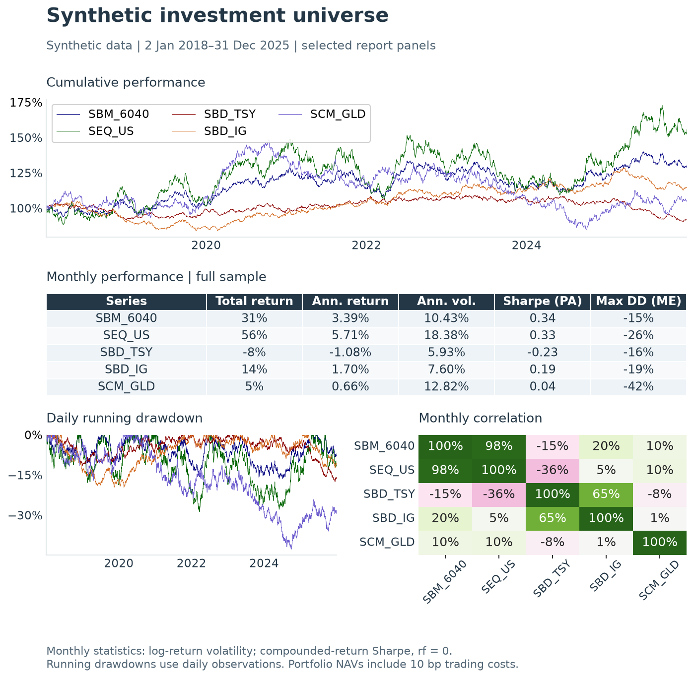
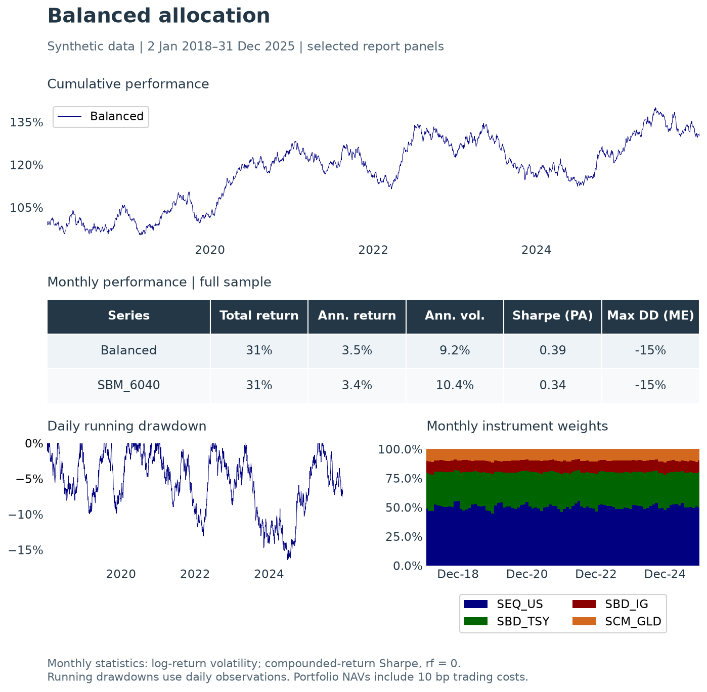
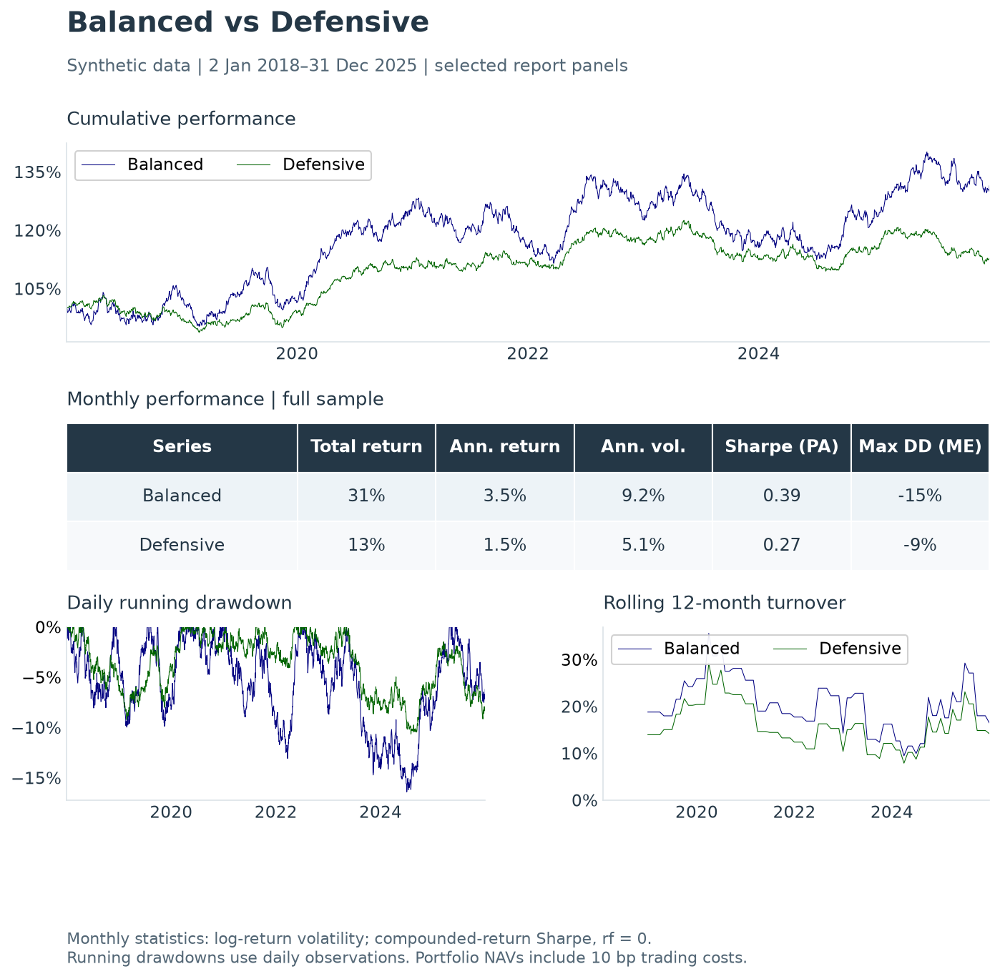
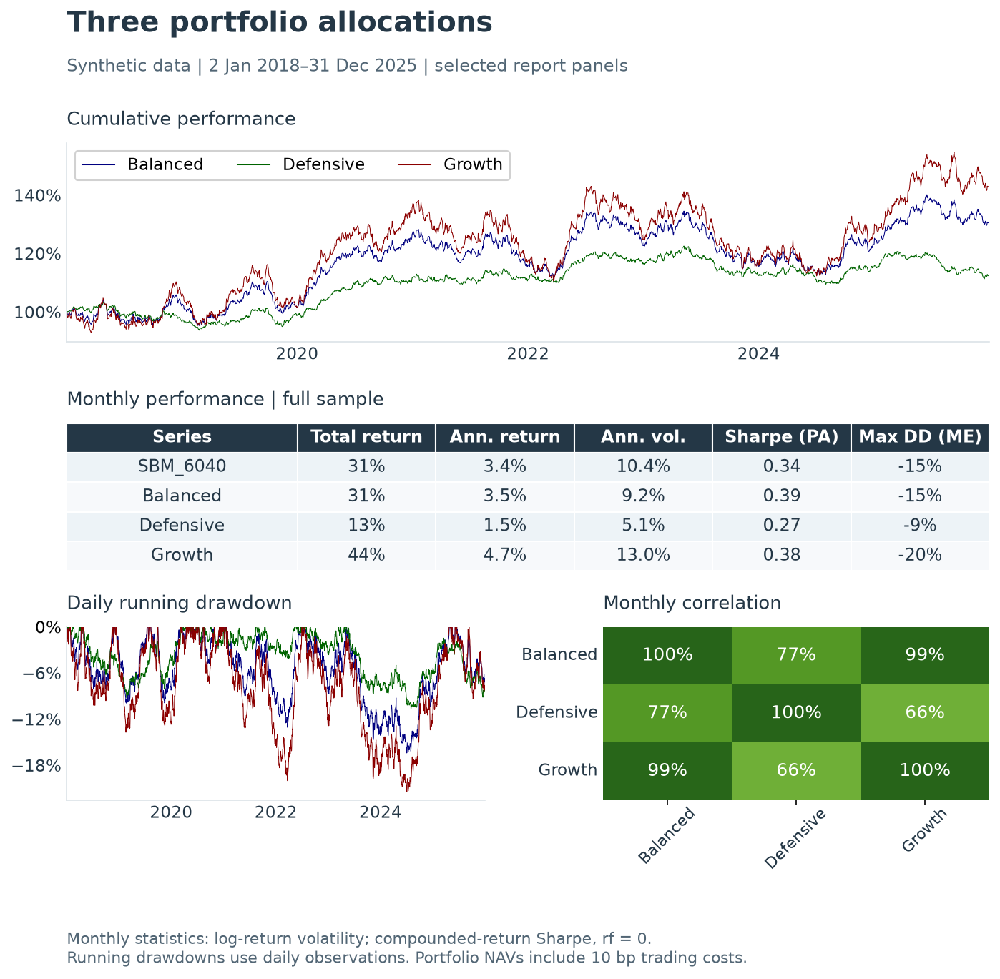

---
myst:
  html_meta:
    description: >-
      Four qis factsheet forms, what their panels show, an offline example, and
      the common scripts for regenerating documentation figures with provenance.
---

# Factsheet gallery

*[author / affiliation / date — placeholder]*

Implemented in [qis — Quantitative Investment Strategies](https://github.com/ArturSepp/QuantInvestStrats).
Software citation: [CITATION.cff](https://github.com/ArturSepp/QuantInvestStrats/blob/main/CITATION.cff).

These previews illustrate four report forms. Choose by the analytical question and the input
object; the [reporting reference](factsheets.md) maps each form to its API.

Each preview selects four panels from a complete qis report, using a fixed synthetic sample
from 2 January 2018 to 31 December 2025. The instruments represent US equities (`SEQ_US`),
government bonds (`SBD_TSY`), investment-grade bonds (`SBD_IG`) and gold (`SCM_GLD`);
`SBM_6040` is the synthetic market reference. These are teaching examples of reporting behavior.

The [published provenance record](images/analytics_manifest.json) identifies the sample, seeds,
calculation settings, actual source version and content hashes for all seven documentation images.
The [analytics scripts](https://github.com/ArturSepp/QuantInvestStrats/tree/main/tools/docs_analytics)
also reproduce the complete reports. Fixed sample dates do not indicate current market performance.

## Multi-asset universe

Compare instruments with a reference series using cumulative performance, risk-adjusted
statistics, rolling risk, drawdowns, correlations and regime-conditioned summaries.

*Figure 1. Synthetic investment universe. The equity series has the highest total return in this
sample, while gold has the deepest drawdown. Monthly correlations describe co-movement over the
whole sample. The table's maximum drawdown uses month-end observations; the daily drawdown panel
can therefore show a deeper trough.*

[Open full-resolution preview](images/multi_asset.png).

## Single strategy

A portfolio report adds holdings, exposure, turnover, costs and contribution panels to its
performance history. Those diagnostics require a portfolio accounting object; a raw price
panel alone does not provide them.

*Figure 2. Balanced allocation: 50% equities, 30% government bonds, 10% investment-grade bonds and
10% gold at quarterly rebalancing. Holdings drift between trades, so the monthly weights vary
around their targets. The strategy NAV includes trading costs; the reference series does not.*

[Open full-resolution preview](images/strategy.png).

## Strategy vs. benchmark

Compare a strategy portfolio with another portfolio, including their cumulative P&L difference.
The comparison portfolio is distinct from a reference market series used for regimes and beta.

*Figure 3. Balanced versus Defensive. The lower-equity Defensive allocation has lower volatility
and a shallower drawdown in this sample. Turnover is the rolling sum of 12 monthly observations,
using the two-sided convention described in [turnover conventions](turnover_conventions.md).
The optional [Brinson attribution](brinson_attribution.md) appendix is omitted.*

[Open full-resolution preview](images/strategy_vs_benchmark.png).

## Multiple strategies

Compare portfolio variants on shared performance, risk, turnover and cost panels. Their
relative results reflect the supplied portfolios and assumptions; correlation alone does
not explain why performance differs.

*Figure 4. Three allocations under the same data, quarterly schedule and trading-cost assumption.
Growth has the highest equity weight, return and volatility in this sample. Its high correlation
with Balanced does not imply equal risk or an equivalent drawdown path.*

[Open full-resolution preview](images/multi_strategy.png).

## Build the four report types

This independent workflow uses the same fixture, sample, allocations and trading assumptions
as the current gallery producer. It renders the four main report forms in memory and closes
them. The producer also attaches asset-class labels and exports supporting tables. By default it
selects four panels from each report for the readable previews above, preserving the plotted data
and displayed statistics. Its `full_reports=True` option retains the complete reports;
the [batch instructions](https://github.com/ArturSepp/QuantInvestStrats/blob/main/tools/docs_analytics/README.md)
include a PNG/PDF export example.

The four synthetic instruments represent US equities, government bonds, investment-grade bonds
and gold. Allocation weights below follow that column order. The schedule includes the initial
allocation and quarterly rebalancing; units are held between trades, with zero implementation
lag and costs of 10 basis points per unit of traded notional. The synthetic market benchmark
has no strategy trading-cost deduction. No missing observations are filled.

~~~python
import matplotlib.pyplot as plt

import qis
from qis.datasets import generate_synthetic_universe

universe = generate_synthetic_universe(
    start='2018-01-02', end='2025-12-31', seed=20260725, apply_quirks=True
)
prices = universe.prices[['SEQ_US', 'SBD_TSY', 'SBD_IG', 'SCM_GLD']]
assert prices.notna().all().all() and (prices > 0).all().all()
benchmark = universe.benchmark_prices
allocations = {
    'Balanced': [0.5, 0.3, 0.1, 0.1],
    'Defensive': [0.2, 0.5, 0.2, 0.1],
    'Growth': [0.7, 0.1, 0.1, 0.1],
}
portfolios = []
for name, weights in allocations.items():
    schedule = qis.generate_static_weights_schedule(
        prices=prices, weights=weights, rebalancing_freq='QE'
    )
    portfolios.append(qis.backtest_model_portfolio(
        prices=prices, weights=schedule, rebalancing_freq=None,
        rebalancing_costs=0.001, weight_implementation_lag=0, ticker=name,
    ))

pair = qis.MultiPortfolioData(
    portfolio_datas=portfolios[:2], benchmark_prices=benchmark
)
multi = qis.MultiPortfolioData(
    portfolio_datas=portfolios, benchmark_prices=benchmark
)
common = dict(reporting_frequency='monthly', add_rates_data=False)
reports = {
    'multi_asset': qis.factsheet(prices, benchmark_prices=benchmark, **common),
    'strategy': qis.factsheet(portfolios[0], benchmark_prices=benchmark, **common),
    'strategy_benchmark': qis.factsheet(
        pair, kind='strategy_benchmark', add_brinson_attribution=False, **common
    ),
    'multi_strategy': qis.factsheet(
        multi, add_group_exposures_and_pnl=False, add_strategy_factsheets=False, **common
    ),
}
assert all(pages for pages in reports.values())
for pages in reports.values():
    for figure in pages:
        assert isinstance(figure, plt.Figure)
        figure.canvas.draw()
        plt.close(figure)
~~~

These prices have business-day observations. The monthly long preset uses ME statistics
with 12 periods per year, 36-observation risk/beta windows or spans, 12-observation turnover/cost
sums, and quarterly regimes. Default performance tables use log-return volatility and
zero-rate Sharpe conventions. Refer to the [reporting methodology](factsheets_and_reporting.md)
for native-path drawdowns, missing-data limitations and the distinction between spans and windows.

## Regenerate the documentation images together

The [batch instructions](https://github.com/ArturSepp/QuantInvestStrats/blob/main/tools/docs_analytics/README.md)
describe environment and output-directory setup. From a prepared source export, one command
regenerates all registered documentation analytics, including the gallery and model-layer figures:

~~~text
python -m tools.docs_analytics.run --all --output-dir <new-local-bundle-directory>
~~~

Replace the directory placeholder with a new local output directory below `AGENT_LOCAL_ROOT`,
outside OneDrive and the source export. Use the interpreter required by the repository's
`AGENTS.md`. This command writes a new bundle; it does not overwrite published previews.

Each bundle contains PNGs, supporting CSVs and `analytics_manifest.json`, which records
sample dates, seeds, calculation settings, source/package versions and file hashes.
The [coverage manifest](https://github.com/ArturSepp/QuantInvestStrats/blob/main/tools/docs_analytics/manifest.json)
maps every registered image to its producer. The [reproducibility note](reproducibility.md)
explains why fixed samples and recorded source state matter.

A new generation timestamp means the implementation was rerun. It does not turn a fixed
synthetic sample into recent market data. Review figures at full resolution and at the final
page width before publishing them with their provenance.

## References

- qis contributors. [Gallery producer](https://github.com/ArturSepp/QuantInvestStrats/blob/main/tools/docs_analytics/gallery.py)
  and [analytics coverage manifest](https://github.com/ArturSepp/QuantInvestStrats/blob/main/tools/docs_analytics/manifest.json).
- Sepp, A. qis: Performance analytics, portfolio backtesting, risk analysis, and factsheet
  reporting in Python. [Software citation metadata](https://github.com/ArturSepp/QuantInvestStrats/blob/main/CITATION.cff).
