---
myst:
  html_meta:
    description: >-
      An empirical comparison of QIS rate-implied monthly hedges with observed CHF, EUR
      and GBP bond indices and CHF equity indices, including tracking error and return drift.
---

# Hedged index replication

*Author: [Artur Sepp](https://github.com/ArturSepp)*

Implemented in [qis — Quantitative Investment Strategies](https://github.com/ArturSepp/QuantInvestStrats).
Software citation: [CITATION.cff](https://github.com/ArturSepp/QuantInvestStrats/blob/main/CITATION.cff).

Currency-hedged index replication compares a synthetic hedge on a supplied base index with
the provider's observed hedged index. Similar monthly movements do not establish identical
compounded returns: a small persistent difference in hedge carry can accumulate even when
regression fit is almost perfect.

## Overview

This fixed observed-data study asks how closely QIS's monthly opening-principal hedge,
using supplied FX spots and domestic short rates, matches the currency-hedged indices in
a capital-market-assumptions universe. It tests six bond families in CHF, EUR and GBP,
a US equity CHF hedge, and two separately labelled regional equity diagnostics.

The main window covers 69 monthly returns, January 2021–September 2026, corresponding to
a NAV comparison from 31 December 2020 to 30 September 2026. All 18 bond comparisons have
$R^2$ between 0.99931 and 0.99987, with annual tracking error of 6.9–12.1 basis points.
However, QIS's annual geometric returns exceed the observed bond returns by 30.6–33.7 bp
in CHF, 18.7–21.8 bp in EUR and 16.5–19.5 bp in GBP. This is close movement replication,
not exact return replication or evidence that the synthetic hedge is economically superior.

Observation cutoff is 30 September 2026; the source snapshot was analysed on 2 October 2026.
The partial 1 October observation is excluded. The study does not alter QIS defaults or
any consuming production configuration.

## Inputs, notation, and assumptions

| Convention | This article |
|---|---|
| Return basis | Monthly simple provider total returns; no cash deduction or additional implementation costs; provider dividend and tax conventions retained |
| Sampling grid | Calendar month ends; common recent sample January 2021–September 2026 |
| Annualisation | $\mathrm{af}=12$ for means and sample tracking error; geometric returns use elapsed calendar days divided by 365.25 |
| Mean adjustment | Sample error mean removed for tracking error; descriptive OLS includes an intercept |
| Timing | Hedge fixed on opening principal; prior month-end rates; contemporaneous realised spot move over the asset-return period |
| Output units | Decimal input returns and annual rates; plots in percent; MAE/RMSE in monthly bp; TE and geometric-return differences in annual bp |
| qis default | Cash-rate lag remains 1; this study sets a 100% hedge and computes total returns, so no excess-cash subtraction applies |

| Symbol or input | Meaning | Units and convention |
|---|---|---|
| $r_t^L$ | Supplied base-index return | Simple return over $(t-1,t]$ |
| $S_t$, $r_t^{FX}$ | FX cross and realised move | Reference currency per local unit; $S_t/S_{t-1}-1$ |
| $y_{t-1}^L$, $y_{t-1}^R$ | Local and reference short-rate quotes | Annual decimals observed at the preceding month end |
| $k_{t-1}$ | Rate-implied hedge carry | Ratio of reference to local one-month cash-growth factors, minus one |
| $R_t^Q$, $R_t^B$ | QIS reconstruction and observed hedged-index return | Simple monthly returns |
| $e_t$, $\bar e$, $n$ | Replication error, its sample mean and paired count | $e_t=R_t^Q-R_t^B$ |
| $a$, $b$ | Descriptive regression intercept and slope | Intercept in monthly return units; slope dimensionless |
| $G_Q$, $G_B$, $\tau$ | Compounded gross returns and elapsed horizon | Products of monthly gross returns; $\tau$ in calendar years |

### Data and pairing policy

The sources are raw, nonbackfilled CMA return observations, their corresponding price and
metadata panels, and supplied FX spot and annual domestic-rate panels. Month-end quotes
are as-of aligned before forming the realised cross return and shifting the carry.
Leading missing inputs are not filled from future observations. Observed benchmark returns
are not forward-filled. Valid zero returns are retained. All 21 recent pairs have 69 complete
monthly observations and no internal gaps.

Index identity is part of the test, not merely a currency label. All tickers below have the
Bloomberg suffix `Index`; they identify data supplied through Bloomberg, not necessarily
a Bloomberg-designed equity index.

| Bond family | USD base | CHF target | EUR target | GBP target |
|---|---|---|---|---|
| Global aggregate | LEGATRUH Index | LEGATRCH Index | LEGATREH Index | LEGATRGH Index |
| Global government | LGTRTRUH Index | LGTRTRCH Index | LGTRTREH Index | LGTRTRGH Index |
| Global IG corporate | LGCPTRUH Index | LGCPTRCH Index | LGCPTREH Index | LGCPTRGH Index |
| Global high yield | H23059US Index | H23059CH Index | H23059EU Index | H23059GB Index |
| EM hard-currency bonds | H04386US Index | H04386CH Index | H04386EU Index | H04386GB Index |
| Global inflation-linked 1–10Y | H21247US Index | H21247CH Index | H21247EU Index | H21247GB Index |

The global multi-currency bond USD bases are already USD-hedged series. Applying a second
USD-to-reference hedge tests a layered approximation to the provider's direct hedge.
USD-denominated hard-currency sleeves are simpler cases; an already hedged quotation still
does not supply the provider's underlying forward book.

| Equity base | Target | Comparison status |
|---|---|---|
| NDDUUS Index, USD | M0USHCHF Index, CHF | Matched MSCI USA parent and CHF hedge |
| NDDLUK Index, GBP | GBNHC Index, CHF | Diagnostic only: MSCI UK parent versus Bloomberg UK target |
| MSDEXKSN Index, EUR | M1CXFBC Index, CHF | Diagnostic only: aggregate EUR quote versus a constituent-currency hedge |
| NDDUWI Index, USD | MXWOH Index, USD | Not replicated: world constituent currencies cannot be recovered from the aggregate USD NAV |

No matched EUR- or GBP-hedged global-equity target was available in this snapshot. None was
substituted or invented. The two regional tests must not be interpreted as clean USD-parent
replication tests.

## Methodology

### Monthly opening principal hedge

**Definition.** With annual quotes divided by $\mathrm{af}=12$, rate-implied carry is

$$
k_{t-1}=
\frac{1+y_{t-1}^{R}/12}{1+y_{t-1}^{L}/12}-1.
$$

**Identity.** For a 100% opening-principal hedge, the QIS simple-return payoff is

$$
R_t^Q=r_t^L(1+r_t^{FX})+k_{t-1}.
$$

**Proof.** Unhedged reference-currency wealth earns
$(1+r_t^L)(1+r_t^{FX})-1$. Hedging the opening local principal cancels the principal's
$r_t^{FX}$ term and adds the opening forward carry. The asset-return cross term remains.
See the [FX hedge derivation](fx_hedging_and_market_data.md#hedged-unhedged-cash-and-futures-exposures).
$\square$

Do not shift the realised FX move to the preceding month. The hedge notional and carry
are opening-period inputs; the spot valuation uses both endpoints of the same holding period.
A principal hedge does not hedge gains or losses earned during the period.

No cash return is deducted here. Changing the excess-return cash-rate lag is therefore not
a correction for this replication difference. Domestic annual quotes are rate proxies,
not realised cash-index returns or observed forward quotes.

### Fit and absolute replication error

**Definition.** The descriptive OLS regression is

$$
R_t^Q=a+bR_t^B+\varepsilon_t.
$$

Fits include an intercept. Exact agreement requires the diagonal, not merely high $R^2$.
Full-sample fits are descriptive diagnostics, not point-in-time trading signals.

**Definition.** Monthly error measures and annual sample tracking error are

$$
\operatorname{MAE}=\frac{1}{n}\sum_t\lvert e_t\rvert,\qquad
\operatorname{RMSE}=\left(\frac{1}{n}\sum_t e_t^2\right)^{1/2},
$$

$$
\operatorname{TE}_{\mathrm{pa}}=
\sqrt{\frac{\mathrm{af}}{n-1}\sum_t(e_t-\bar e)^2}.
$$

Monthly errors are multiplied by 10,000 for basis points. The annualised arithmetic mean
difference is $10000\,\mathrm{af}\,\bar e$ bp p.a.

**Identity.** Mean error is absent from TE but present in RMSE:

$$
\operatorname{RMSE}^2=
\frac{n-1}{n}\frac{\operatorname{TE}_{\mathrm{pa}}^2}{\mathrm{af}}
+\bar e^2.
$$

**Proof.** Expand $e_t=(e_t-\bar e)+\bar e$, sum the squares, and use
$\sum_t(e_t-\bar e)=0$. Divide by $n$ and substitute the TE definition. $\square$

> **Pitfall.** A persistent positive carry difference can produce a smooth cumulative drift
> while sample tracking error stays small. Report both, rather than treating correlation
> or tracking error alone as an exact-replication test.

### Compounded return comparison

**Definition.** For an elapsed horizon $\tau$ longer than one year, let

$$
G_Q=\prod_t(1+R_t^Q),\qquad G_B=\prod_t(1+R_t^B).
$$

The annual geometric-return difference reported in the tables is

$$
\Delta R_{\mathrm{pa}}=G_Q^{1/\tau}-G_B^{1/\tau}.
$$

It is a difference of annualised geometric returns, not the annualised arithmetic
mean error and not the geometric return of monthly differences.
The cumulative chart shows $G_Q/G_B-1$ through time. A NAV of one is inserted at the
preceding month end so that the first earned monthly return is not discarded.

## Worked example

### Synthetic payoff check

A USD asset earns 2% during a month and USD appreciates 1% against CHF. With opening annual
USD and CHF rates of 4% and 1%, respectively, the rate-implied hedge carry is approximately
-24.92 bp. The hedged asset earns approximately 1.7708%, including the 2 bp asset/FX cross
term. Removing every FX term would omit those 2 bp.

~~~python
from math import isclose
import pandas as pd
import qis

dates = pd.date_range('2024-01-31', periods=3, freq='ME')
spots = pd.DataFrame({'USD': 1.0, 'CHF': [1.0, 1.0/1.01, 1.0/1.01]}, index=dates)
rates = pd.DataFrame({'USD': 0.04, 'CHF': 0.01}, index=dates)
prices = pd.Series([100.0, 102.0, 102.0], index=dates, name='USD asset')
fx = qis.FxRatesData(fx_spots=spots, domestic_rates=rates)
_, hedged = fx.compute_performance_of_local_ccy_asset_in_reference_ccy(
    asset_price_local_ccy=prices, hedge_ratio=1.0, local_ccy='USD',
    reference_ccy='CHF', freq='ME', is_log_returns=False,
    is_excess_returns=False)
carry = (1.0 + 0.01/12.0)/(1.0 + 0.04/12.0) - 1.0
expected = 0.02*1.01 + carry
assert isclose(hedged.iloc[1], expected, abs_tol=1e-12)
assert isclose(expected, 0.0177083056478405, abs_tol=1e-12)
assert isclose(expected - (0.02 + carry), 0.0002, abs_tol=1e-12)
~~~

This is a deterministic teaching example, not a fit to the empirical indices.

### Common period empirical results

All rows use the same 69 months. Errors are QIS minus observed. TE is annual, MAE monthly,
and the last column is the difference in annual geometric returns. The original fit table
keeps full precision; presentation rounding below does not alter the calculations.

| Observed hedge ticker | Currency | $R^2$ | TE (bp p.a.) | MAE (bp/month) | $\Delta R_{\mathrm{pa}}$ (bp p.a.) |
|---|---|---:|---:|---:|---:|
| LEGATRCH Index | CHF | 0.99947 | 10.9 | 2.97 | +30.6 |
| LEGATREH Index | EUR | 0.99976 | 7.6 | 2.01 | +18.9 |
| LEGATRGH Index | GBP | 0.99981 | 7.1 | 1.74 | +16.6 |
| LGTRTRCH Index | CHF | 0.99940 | 10.7 | 2.92 | +30.6 |
| LGTRTREH Index | EUR | 0.99973 | 7.5 | 2.00 | +18.7 |
| LGTRTRGH Index | GBP | 0.99979 | 6.9 | 1.71 | +16.5 |
| LGCPTRCH Index | CHF | 0.99968 | 11.3 | 3.09 | +31.0 |
| LGCPTREH Index | EUR | 0.99984 | 8.3 | 2.14 | +19.5 |
| LGCPTRGH Index | GBP | 0.99986 | 8.0 | 1.89 | +17.1 |
| H23059CH Index | CHF | 0.99962 | 11.8 | 3.26 | +33.7 |
| H23059EU Index | EUR | 0.99979 | 9.2 | 2.38 | +21.8 |
| H23059GB Index | GBP | 0.99982 | 8.9 | 2.16 | +19.5 |
| H04386CH Index | CHF | 0.99972 | 12.1 | 3.29 | +32.1 |
| H04386EU Index | EUR | 0.99985 | 9.5 | 2.37 | +20.3 |
| H04386GB Index | GBP | 0.99987 | 9.5 | 2.09 | +17.5 |
| H21247CH Index | CHF | 0.99931 | 10.8 | 2.93 | +31.8 |
| H21247EU Index | EUR | 0.99967 | 7.6 | 1.99 | +19.7 |
| H21247GB Index | GBP | 0.99972 | 7.2 | 1.76 | +17.7 |
| M0USHCHF Index | CHF | 0.99992 | 13.9 | 4.16 | +46.1 |
| GBNHC Index | CHF | 0.99519 | 67.2 | 14.21 | +11.1 |
| M1CXFBC Index | CHF | 0.99818 | 61.4 | 14.63 | -7.6 |

US equities hedged to CHF have $R^2=0.99992$, TE 13.9 bp p.a. and a +46.1 bp annual
geometric-return difference. The UK and European diagnostics have larger tracking errors,
67.2 and 61.4 bp p.a.; their pairing/construction limits are stated above.

### Evidence of a common currency component

For the six bond families, the average cross-family standard deviation of monthly errors
is only 0.34–0.35 bp. Regressing each family's monthly error on the other five families'
mean error gives minimum $R^2$ of 0.969 for CHF, 0.947 for EUR and 0.914 for GBP.
These descriptive checks point towards a shared hedge-input or construction difference
rather than unrelated instrument-return failures.

For global aggregate CHF, the annualised mean QIS carry term is -2.975%.
Subtracting the base return and its FX cross term from the observed hedge gives an implied
residual term of -3.289%, a difference of 31.5 bp p.a. That implied term includes every
remaining construction difference; it is not an observed forward quote.

Bloomberg's methodology uses one-month forwards and, for multi-currency indices, opening
currency weights and individual currency hedges.
[Appendix 2 of the fixed-income methodology](https://assets.bbhub.io/professional/sites/10/Bloomberg-Index-Publications-Fixed-Income-Index-Methodology.pdf)
describes these constructions. The MSCI USA hedge likewise uses a one-month USD forward.
[MSCI index definition](https://www.msci.com/indexes/index/137694/msci-usa-100-hedged-to-chf-index).

**Hypotheses, not identified causes.** Actual forward pricing versus domestic short-rate
proxies, tenor, cross-currency basis, fixing time, day count and direct versus layered hedging
may explain part of the difference. The present comparison cannot separate their contributions.
It does not prove that changing one rate proxy alone removes the bias.

### Full available history

Each row uses its own raw-return and FX support; all end on 30 September 2026.
The first date below is the first earned monthly return, not the preceding NAV anchor.
No backfilled or nowcast benchmark observations are used. Older samples show larger persistent
return differences, so the recent window must not be presented as a full-history result.

| Observed hedge ticker | First monthly return | Months | $R^2$ | TE (bp p.a.) | $\Delta R_{\mathrm{pa}}$ (bp p.a.) |
|---|---|---:|---:|---:|---:|
| LEGATRCH Index | 1999-02-28 | 332 | 0.99817 | 14.1 | +45.5 |
| LEGATREH Index | 1999-02-28 | 332 | 0.99666 | 19.2 | +53.4 |
| LEGATRGH Index | 1999-01-31 | 333 | 0.99814 | 14.4 | +30.7 |
| LGTRTRCH Index | 2000-11-30 | 311 | 0.99814 | 14.3 | +44.7 |
| LGTRTREH Index | 2000-11-30 | 311 | 0.99653 | 19.8 | +52.3 |
| LGTRTRGH Index | 2000-11-30 | 311 | 0.99813 | 14.5 | +28.6 |
| LGCPTRCH Index | 2000-11-30 | 311 | 0.99911 | 15.0 | +45.4 |
| LGCPTREH Index | 2000-11-30 | 311 | 0.99840 | 20.3 | +53.1 |
| LGCPTRGH Index | 2000-11-30 | 311 | 0.99916 | 14.9 | +29.1 |
| H23059CH Index | 2001-04-30 | 306 | 0.99967 | 17.2 | +46.7 |
| H23059EU Index | 2001-04-30 | 306 | 0.99948 | 21.7 | +55.0 |
| H23059GB Index | 2001-04-30 | 306 | 0.99975 | 16.1 | +31.1 |
| H04386CH Index | 2001-10-31 | 300 | 0.99964 | 17.0 | +47.6 |
| H04386EU Index | 2001-10-31 | 300 | 0.99948 | 21.0 | +54.9 |
| H04386GB Index | 2001-10-31 | 300 | 0.99977 | 14.6 | +29.5 |
| H21247CH Index | 2007-03-31 | 235 | 0.99827 | 15.8 | +54.5 |
| H21247EU Index | 2007-03-31 | 235 | 0.99674 | 22.0 | +62.4 |
| H21247GB Index | 2007-03-31 | 235 | 0.99838 | 16.1 | +33.0 |
| M0USHCHF Index | 2002-01-31 | 297 | 0.99985 | 18.4 | +52.4 |
| GBNHC Index | 2007-04-30 | 234 | 0.99538 | 90.1 | -29.6 |
| M1CXFBC Index | 2016-04-30 | 126 | 0.99867 | 55.8 | -7.2 |

### Empirical comparison figures

Every figure has a left-hand scatter against exact agreement and a right-hand compounded
relative NAV. All are observed-data exhibits, not synthetic demonstrations or out-of-sample
tests. Their fixed dates, source hashes and aggregate numbers are registered together.

#### Global aggregate hedged to CHF

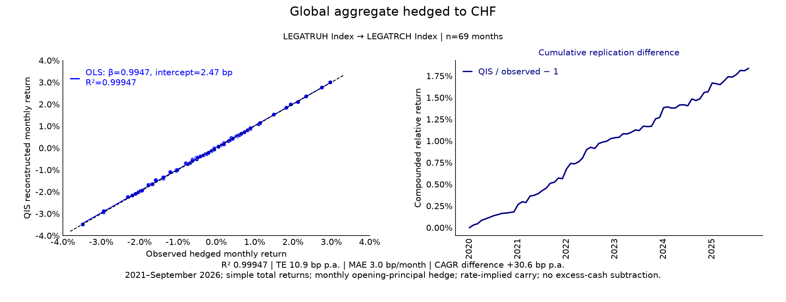

LEGATRUH Index to LEGATRCH Index; 69 paired months. $R^2=0.99947$,
tracking error 10.9 bp p.a., MAE 2.97 bp/month,
and annual geometric-return difference +30.6 bp p.a.
The left panel uses
`qis.plot_scatter` with an intercept and an exact-agreement diagonal; the right uses
`qis.plot_time_series` on the relative compounded NAV.

#### Global aggregate hedged to EUR

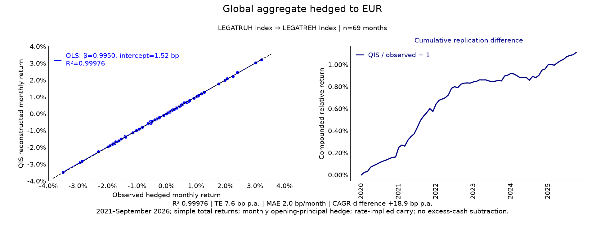

LEGATRUH Index to LEGATREH Index; 69 paired months. $R^2=0.99976$,
tracking error 7.6 bp p.a., MAE 2.01 bp/month,
and annual geometric-return difference +18.9 bp p.a.
The left panel uses
`qis.plot_scatter` with an intercept and an exact-agreement diagonal; the right uses
`qis.plot_time_series` on the relative compounded NAV.

#### Global aggregate hedged to GBP

LEGATRUH Index to LEGATRGH Index; 69 paired months. $R^2=0.99981$,
tracking error 7.1 bp p.a., MAE 1.74 bp/month,
and annual geometric-return difference +16.6 bp p.a.
The left panel uses
`qis.plot_scatter` with an intercept and an exact-agreement diagonal; the right uses
`qis.plot_time_series` on the relative compounded NAV.

#### Global government hedged to CHF

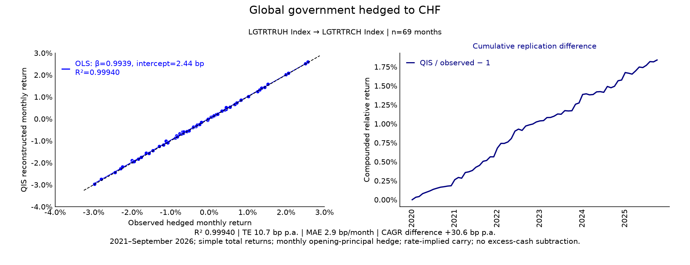

LGTRTRUH Index to LGTRTRCH Index; 69 paired months. $R^2=0.99940$,
tracking error 10.7 bp p.a., MAE 2.92 bp/month,
and annual geometric-return difference +30.6 bp p.a.
The left panel uses
`qis.plot_scatter` with an intercept and an exact-agreement diagonal; the right uses
`qis.plot_time_series` on the relative compounded NAV.

#### Global government hedged to EUR

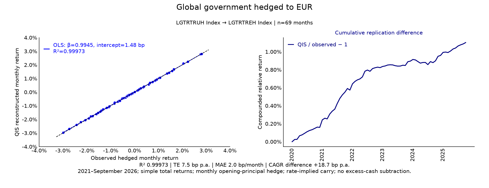

LGTRTRUH Index to LGTRTREH Index; 69 paired months. $R^2=0.99973$,
tracking error 7.5 bp p.a., MAE 2.00 bp/month,
and annual geometric-return difference +18.7 bp p.a.
The left panel uses
`qis.plot_scatter` with an intercept and an exact-agreement diagonal; the right uses
`qis.plot_time_series` on the relative compounded NAV.

#### Global government hedged to GBP

LGTRTRUH Index to LGTRTRGH Index; 69 paired months. $R^2=0.99979$,
tracking error 6.9 bp p.a., MAE 1.71 bp/month,
and annual geometric-return difference +16.5 bp p.a.
The left panel uses
`qis.plot_scatter` with an intercept and an exact-agreement diagonal; the right uses
`qis.plot_time_series` on the relative compounded NAV.

#### Global IG corporate hedged to CHF

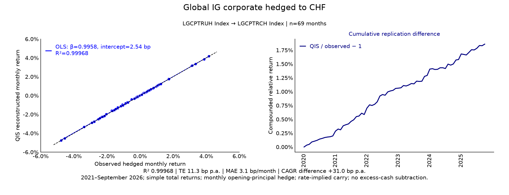

LGCPTRUH Index to LGCPTRCH Index; 69 paired months. $R^2=0.99968$,
tracking error 11.3 bp p.a., MAE 3.09 bp/month,
and annual geometric-return difference +31.0 bp p.a.
The left panel uses
`qis.plot_scatter` with an intercept and an exact-agreement diagonal; the right uses
`qis.plot_time_series` on the relative compounded NAV.

#### Global IG corporate hedged to EUR

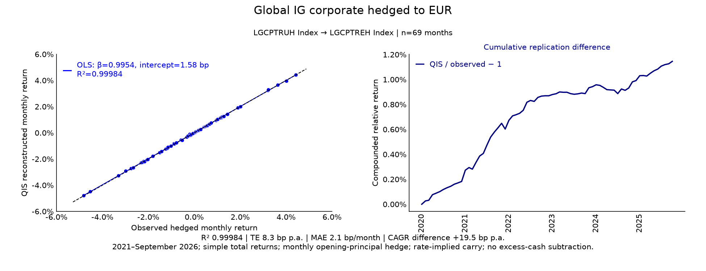

LGCPTRUH Index to LGCPTREH Index; 69 paired months. $R^2=0.99984$,
tracking error 8.3 bp p.a., MAE 2.14 bp/month,
and annual geometric-return difference +19.5 bp p.a.
The left panel uses
`qis.plot_scatter` with an intercept and an exact-agreement diagonal; the right uses
`qis.plot_time_series` on the relative compounded NAV.

#### Global IG corporate hedged to GBP

LGCPTRUH Index to LGCPTRGH Index; 69 paired months. $R^2=0.99986$,
tracking error 8.0 bp p.a., MAE 1.89 bp/month,
and annual geometric-return difference +17.1 bp p.a.
The left panel uses
`qis.plot_scatter` with an intercept and an exact-agreement diagonal; the right uses
`qis.plot_time_series` on the relative compounded NAV.

#### Global high yield hedged to CHF

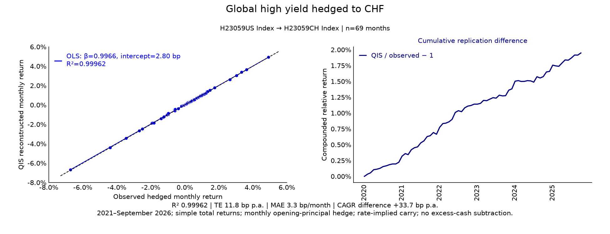

H23059US Index to H23059CH Index; 69 paired months. $R^2=0.99962$,
tracking error 11.8 bp p.a., MAE 3.26 bp/month,
and annual geometric-return difference +33.7 bp p.a.
The left panel uses
`qis.plot_scatter` with an intercept and an exact-agreement diagonal; the right uses
`qis.plot_time_series` on the relative compounded NAV.

#### Global high yield hedged to EUR

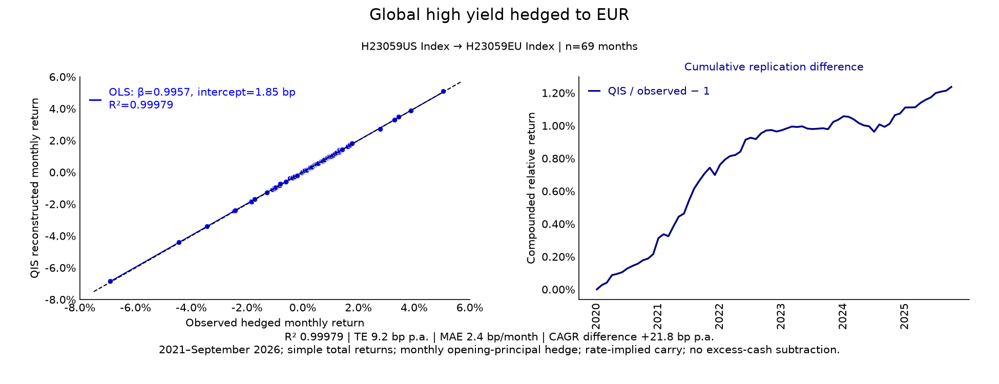

H23059US Index to H23059EU Index; 69 paired months. $R^2=0.99979$,
tracking error 9.2 bp p.a., MAE 2.38 bp/month,
and annual geometric-return difference +21.8 bp p.a.
The left panel uses
`qis.plot_scatter` with an intercept and an exact-agreement diagonal; the right uses
`qis.plot_time_series` on the relative compounded NAV.

#### Global high yield hedged to GBP

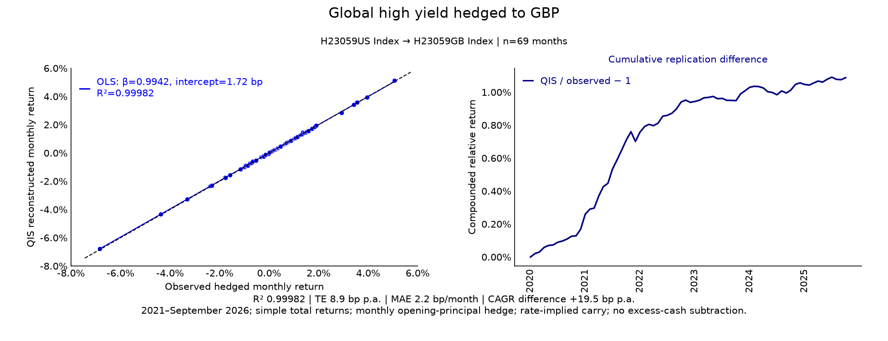

H23059US Index to H23059GB Index; 69 paired months. $R^2=0.99982$,
tracking error 8.9 bp p.a., MAE 2.16 bp/month,
and annual geometric-return difference +19.5 bp p.a.
The left panel uses
`qis.plot_scatter` with an intercept and an exact-agreement diagonal; the right uses
`qis.plot_time_series` on the relative compounded NAV.

#### EM hard-currency bonds hedged to CHF

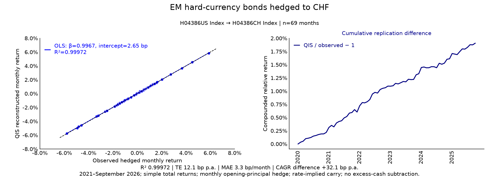

H04386US Index to H04386CH Index; 69 paired months. $R^2=0.99972$,
tracking error 12.1 bp p.a., MAE 3.29 bp/month,
and annual geometric-return difference +32.1 bp p.a.
The left panel uses
`qis.plot_scatter` with an intercept and an exact-agreement diagonal; the right uses
`qis.plot_time_series` on the relative compounded NAV.

#### EM hard-currency bonds hedged to EUR

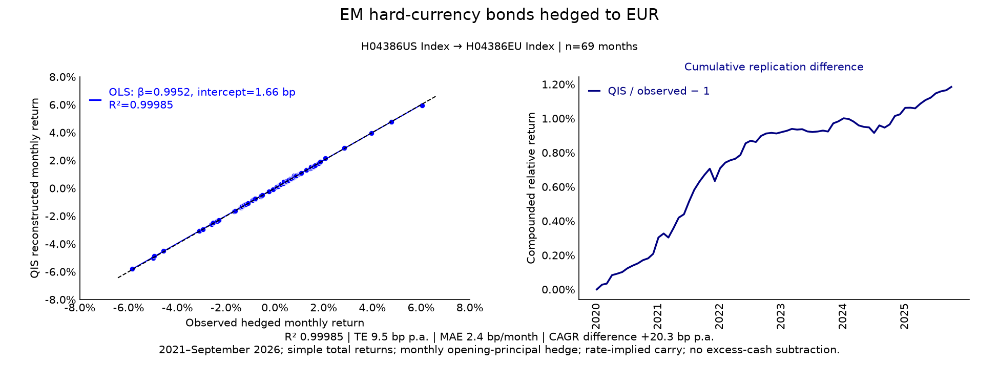

H04386US Index to H04386EU Index; 69 paired months. $R^2=0.99985$,
tracking error 9.5 bp p.a., MAE 2.37 bp/month,
and annual geometric-return difference +20.3 bp p.a.
The left panel uses
`qis.plot_scatter` with an intercept and an exact-agreement diagonal; the right uses
`qis.plot_time_series` on the relative compounded NAV.

#### EM hard-currency bonds hedged to GBP

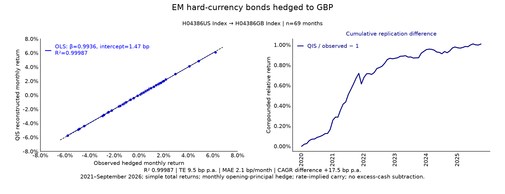

H04386US Index to H04386GB Index; 69 paired months. $R^2=0.99987$,
tracking error 9.5 bp p.a., MAE 2.09 bp/month,
and annual geometric-return difference +17.5 bp p.a.
The left panel uses
`qis.plot_scatter` with an intercept and an exact-agreement diagonal; the right uses
`qis.plot_time_series` on the relative compounded NAV.

#### Global inflation-linked 1–10Y hedged to CHF

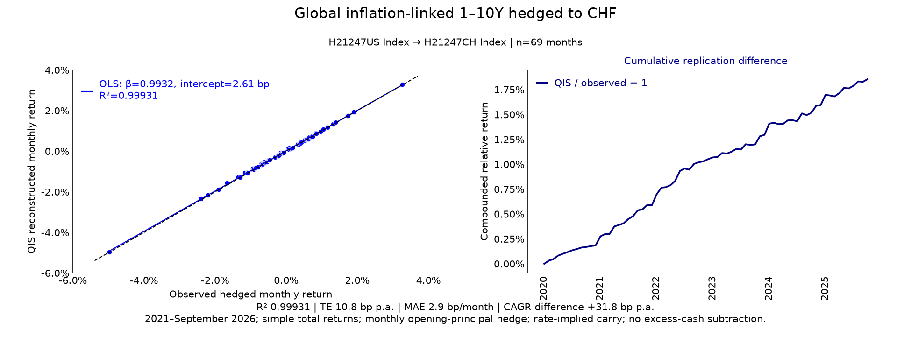

H21247US Index to H21247CH Index; 69 paired months. $R^2=0.99931$,
tracking error 10.8 bp p.a., MAE 2.93 bp/month,
and annual geometric-return difference +31.8 bp p.a.
The left panel uses
`qis.plot_scatter` with an intercept and an exact-agreement diagonal; the right uses
`qis.plot_time_series` on the relative compounded NAV.

#### Global inflation-linked 1–10Y hedged to EUR

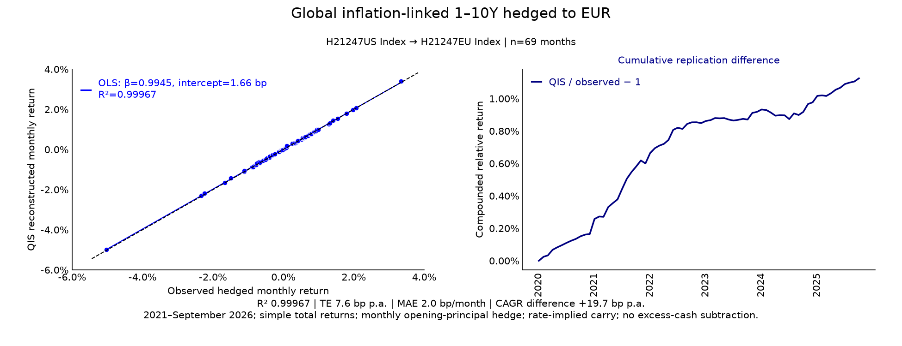

H21247US Index to H21247EU Index; 69 paired months. $R^2=0.99967$,
tracking error 7.6 bp p.a., MAE 1.99 bp/month,
and annual geometric-return difference +19.7 bp p.a.
The left panel uses
`qis.plot_scatter` with an intercept and an exact-agreement diagonal; the right uses
`qis.plot_time_series` on the relative compounded NAV.

#### Global inflation-linked 1–10Y hedged to GBP

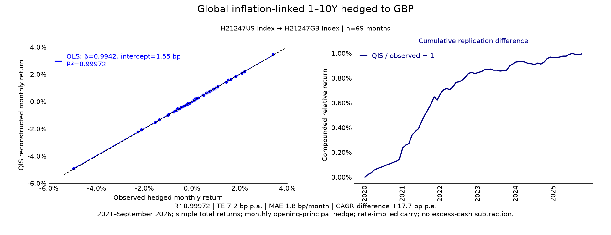

H21247US Index to H21247GB Index; 69 paired months. $R^2=0.99972$,
tracking error 7.2 bp p.a., MAE 1.76 bp/month,
and annual geometric-return difference +17.7 bp p.a.
The left panel uses
`qis.plot_scatter` with an intercept and an exact-agreement diagonal; the right uses
`qis.plot_time_series` on the relative compounded NAV.

#### US equities hedged to CHF

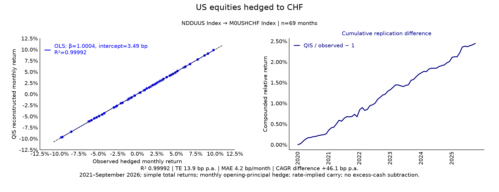

NDDUUS Index to M0USHCHF Index; 69 paired months. $R^2=0.99992$,
tracking error 13.9 bp p.a., MAE 4.16 bp/month,
and annual geometric-return difference +46.1 bp p.a.
The left panel uses
`qis.plot_scatter` with an intercept and an exact-agreement diagonal; the right uses
`qis.plot_time_series` on the relative compounded NAV.

#### UK equities (diagnostic) hedged to CHF

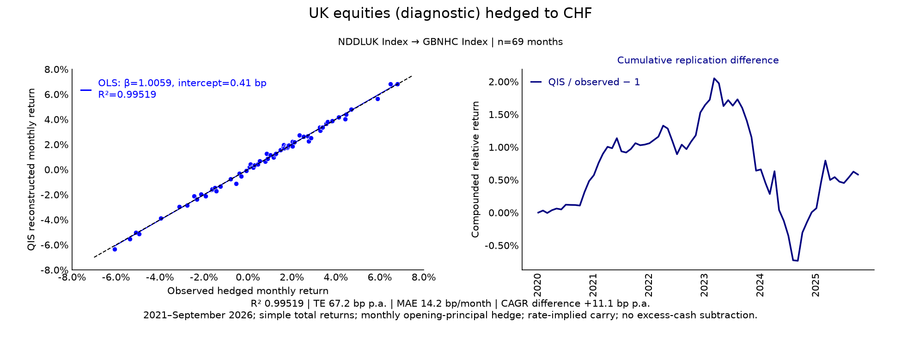

NDDLUK Index to GBNHC Index; 69 paired months. $R^2=0.99519$,
tracking error 67.2 bp p.a., MAE 14.21 bp/month,
and annual geometric-return difference +11.1 bp p.a.
This is a diagnostic comparison, not an exact matched-provider replication. The left panel uses
`qis.plot_scatter` with an intercept and an exact-agreement diagonal; the right uses
`qis.plot_time_series` on the relative compounded NAV.

#### Europe ex UK/Swiss (diagnostic) hedged to CHF

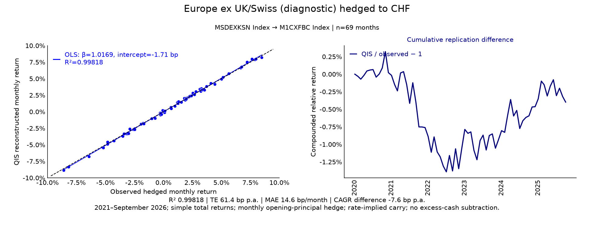

MSDEXKSN Index to M1CXFBC Index; 69 paired months. $R^2=0.99818$,
tracking error 61.4 bp p.a., MAE 14.63 bp/month,
and annual geometric-return difference -7.6 bp p.a.
This is a diagnostic comparison, not an exact matched-provider replication. The left panel uses
`qis.plot_scatter` with an intercept and an exact-agreement diagonal; the right uses
`qis.plot_time_series` on the relative compounded NAV.

## Implementation in qis

| Calculation | Entry point | Contract |
|---|---|---|
| Supplied FX data | `qis.FxRatesData` | FX spots in USD per currency and annual domestic-rate quotes |
| Monthly total-return hedge | `FxRatesData.compute_performance_of_local_ccy_asset_in_reference_ccy` | Hedge ratio 1, frequency ME, simple returns, no cash deduction |
| Price-derived return check | `qis.to_returns` | Simple returns; no missing-return invention |
| NAV and geometric returns | `qis.returns_to_nav`, `qis.compute_pa_return` | Explicit preceding-month anchor; elapsed calendar horizon |
| Sample tracking error | `qis.compute_te_ir_errors` | Complete month-end grid; sample error standard deviation; annualisation 12 |
| Figures | `qis.plot_scatter`, `qis.plot_time_series` | Descriptive linear fit with intercept and relative compounded NAV |

Canonical sources are the
[FX data container](https://github.com/ArturSepp/QuantInvestStrats/blob/main/src/qis/market_data/fx_rates_data.py),
[FX payoff functions](https://github.com/ArturSepp/QuantInvestStrats/blob/main/src/qis/market_data/fx_hedging.py),
[return functions](https://github.com/ArturSepp/QuantInvestStrats/blob/main/src/qis/perfstats/returns.py)
and [ex-post tracking error](https://github.com/ArturSepp/QuantInvestStrats/blob/main/src/qis/portfolio/risk/ex_post_tracking_error.py).
The original source-level OLS check used the internal contributor function
`qis.utils.regression.fit_ols`; it is not a top-level QIS export.

### Reproduction and provenance

The [empirical producer](https://github.com/ArturSepp/QuantInvestStrats/blob/main/tools/docs_analytics/hedged_index_case_study.py)
is a specifically approved exception to the synthetic teaching-figure policy. The complete
offline batch preserves reviewed PNG bytes and reconstructs the 42-row aggregate table from
the registry. It checks pair/window completeness, image hashes, finite statistics, sample
support, TE/RMSE consistency and geometric-return differences. This integrity check is
not an offline refit of undistributed vendor observations.

The original analysis independently checked each QIS payoff against raw base returns,
the FX cross term and prior-period cash-growth ratio; price-derived returns matched the raw
source to numerical tolerance. OLS matched SciPy regression, and QIS TE matched the sample
standard deviation with annualisation 12. A repeated run produced identical statistics.

The [registry](https://github.com/ArturSepp/QuantInvestStrats/blob/main/tools/docs_analytics/manifest.json)
records input basenames and hashes, the original implementation identity, aggregate results
and preview hashes. [Published provenance](images/analytics_manifest.json) separately records
the current bundle source, dependencies and generation time. Preserving an old empirical
figure does not mean refitting it with the current source.

The private source artifacts are `Global_CMA_SAA_Universe.xlsx` (raw sheet
`saa_universe_returns_2026_10_01`), `global_saa_universe_data_prices.csv`,
`global_saa_universe_data_metadata.csv`, `fx_hedging_data_fx_spots.csv`,
`fx_hedging_data_domestic_rates.csv` and the derived `monthly_comparison.csv`.
They are not distributed. Only the plots and aggregate statistics are public; private mandates,
holdings and raw return panels are excluded.

An authorised holder of the derived monthly comparison snapshot can recheck all 21 recent
fits, the derived payoff identity and the figures with the explicit command below.
It does not re-fetch Bloomberg data, reconstruct raw FX quotes or recheck the undistributed
full histories. Those full-history aggregates retain the original analysis verification.

~~~console
python -m tools.docs_analytics.hedged_index_case_study --source-csv /private/monthly_comparison.csv --output-dir /local/new-private-recheck
python -m tools.docs_analytics.run --all --output-dir /local/new-complete-bundle
python -m tools.docs_analytics.publish --verify --repo /path/to/checkout
~~~

Use the prescribed external interpreter and C-local setup on the maintainer's Windows host.
The [complete-bundle workflow](https://github.com/ArturSepp/QuantInvestStrats/blob/main/tools/docs_analytics/README.md)
describes generation, review and publication. The synthetic worked example runs offline
without any private input or Bloomberg access.

## Interpretation and limitations

- The reconstruction is a close approximation to monthly movements, not an exact replacement
  for the provider's return history. Both drift and tracking error matter for long-horizon use.
- Rate-implied carry uses short-rate proxies, including three-month inputs, rather than actual
  one-month forward quotes. Dividing by 12 is a fixed-period convention, not exact day-count accrual.
- Hedging an aggregate USD-hedged multi-currency NAV does not reconstruct the provider's
  constituent-level hedge book. This matters even with apparently matched family names.
- Equity targets retain their provider's dividend, withholding-tax and universe conventions.
  The UK comparison changes provider; the European comparison changes currency-hedge construction.
- An aggregate world USD NAV does not reveal underlying non-USD currency exposures.
  Currency-sleeve weights and returns are needed to replicate its USD-hedged version.
- Fits are descriptive, with no confidence intervals, out-of-sample validation or executable
  forward-pricing cost model. High fit is not evidence of statistical or economic superiority.
- Frozen input hashes identify this historical snapshot, not an immutable vendor history.
  An authorised refresh with changed inputs must be a new reviewed study.
- No arbitrary bias correction, production cash-lag change or vendor-index substitution is
  implemented by this study.

> **Insight.** The next clean diagnostic is a controlled comparison using actual one-month
> forward quotes with identical fixings and index parents. That can distinguish rate-proxy
> error from hedge-construction error without fitting away the discrepancy.

## See also

- [Unhedged index replication](unhedged_index_replication.md): cross-family FX-input diagnostics
- [FX hedging and market-data boundaries](fx_hedging_and_market_data.md)
- [Cash rate timing and FX adjustments](cash_rate_timing_and_fx_adjustments.md)
- [Returns and NAVs](returns_and_navs.md)
- [Tracking error and benchmark-relative risk](tracking_error_and_risk.md)
- [Regression and HAC](regression_and_hac.md)
- [Notation and conventions](notation_and_conventions.md)

## References

1. Bloomberg Index Services Limited (2026). *Bloomberg Fixed Income Index Methodology*, 8 January. [Methodology PDF](https://assets.bbhub.io/professional/sites/10/Bloomberg-Index-Publications-Fixed-Income-Index-Methodology.pdf). Appendix 2: currency hedging and currency returns.
2. MSCI. *MSCI USA 100% Hedged to CHF Index*. [Index definition](https://www.msci.com/indexes/index/137694/msci-usa-100-hedged-to-chf-index). Matched-parent equity hedge and one-month USD forward.
3. Borio, C., McCauley, R., McGuire, P., and Sushko, V. (2016). Covered interest parity lost: understanding the cross-currency basis. *BIS Quarterly Review*, September. [Publisher page](https://www.bis.org/publications/qr-201609/covered-interest-parity-lost-understanding-cross-currency-basis). Rate-only carry limitations.
4. Sepp, A. qis: Performance analytics, portfolio backtesting, risk analysis, and factsheet reporting in Python. [Software citation metadata](https://github.com/ArturSepp/QuantInvestStrats/blob/main/CITATION.cff).
