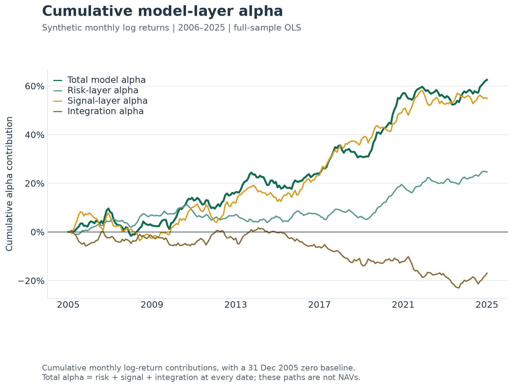
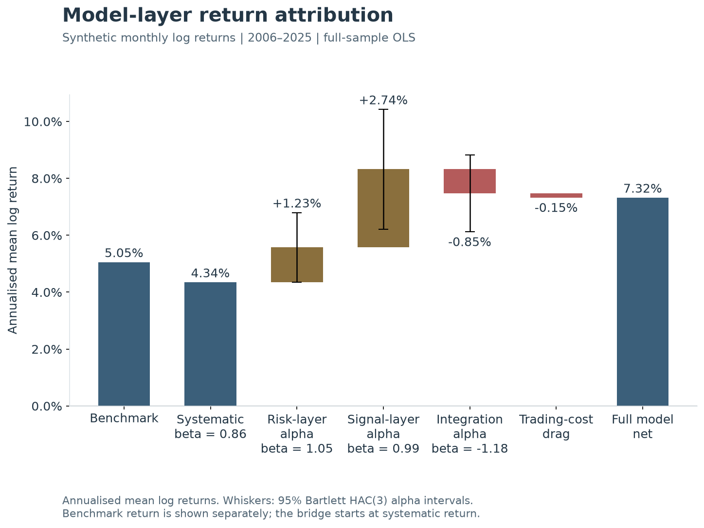
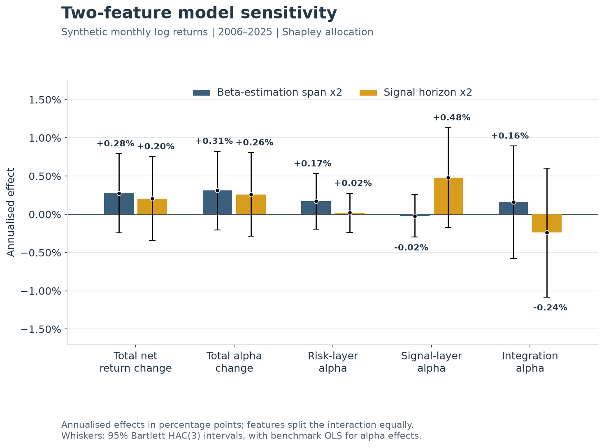

---
myst:
  html_meta:
    description: >-
      Decompose the return of a layered quantitative portfolio model into systematic return,
      risk-layer alpha, signal-layer alpha, and integration alpha, each with a
      heteroskedasticity and autocorrelation consistent (HAC) confidence interval; attribute
      changes to multiple model features; and construct fixed-beta or point-in-time rolling
      cumulative-alpha paths using qis.
---

# Model-layer attribution: risk-layer, signal-layer, and integration alpha

A layered quantitative portfolio allocation model has three components:

1. A risk model (an estimated covariance matrix).
1. A signal layer (estimated expected returns or alphas).
1. An optimiser that combines them by maximising portfolio alpha subject to tracking error,
   turnover, and allocation constraints.

The question this note and the `qis` analytics answer is what each layer added to the realised return
of the full model, with a confidence interval on each addition.

The difficulty is that the full model is not the sum of its layers. The optimiser combines risk
and signals under constraints, so the effects of the two layers run on their own do not add up to
the integrated effect. `qis` resolves the non-additivity with an integration term defined as the
exact log-return residual between the full model and the standalone effects of those two layers.
The four components reconstruct the full-model log return in every period, their sample means
reconstruct the annualised return, and each alpha component is an OLS intercept with a standard
error.

For a descriptive full-sample analysis, use
`qis.compute_model_layer_alpha_beta_attribution`, which returns a
`qis.ModelLayerAlphaBetaAttribution`. For realised point-in-time alpha, use
`qis.compute_model_layer_ewma_alpha_attribution`, which estimates EWMA betas and applies them only
after the configured lag. For a complete experiment over several model features,
`qis.compute_model_feature_alpha_beta_attribution` returns factorial interactions,
order-independent Shapley effects, and a full-sample model-layer attribution for every effect.

## Choose the object that matches the question

| Question | qis object | Required input | Output |
|---|---|---|---|
| What did the risk layer, the signal layer, and their integration each add to the full model's return, and with what uncertainty? | `compute_model_layer_alpha_beta_attribution` | benchmark, risk-layer, signal-layer and full-model NAVs, optional net NAV | regression table with HAC intervals, exact periodic components, annualised components |
| How did realised alpha accumulate using only the beta information available before each return? | `compute_model_layer_ewma_alpha_attribution` and `compute_model_layer_cumulative_alpha_after_warmup` | benchmark, risk-layer, signal-layer and full-model NAVs; beta span, lag, prior and warm-up base date | estimated and applied betas, exact alpha components, expanding annualised alpha and post-warm-up cumulative alpha |
| Which model features changed risk-layer, signal-layer, integration and total full-model alpha or beta? | `compute_model_feature_alpha_beta_attribution` | complete $2^n$ coalition map of `ModelLayerNavs` bundles | factorial and Shapley effect paths, one layer attribution per effect, summary table and identity checks |
| What were whole-sample TE and IR against a benchmark? | `compute_te_ir_errors` | periodic strategy-minus-benchmark returns | annualised TE and IR |
| How did benchmark beta and alpha evolve through time? | `compute_ewm_beta_alpha_forecast` | periodic returns | EWMA beta and alpha series |
| What active risk do current weights carry under a covariance model? | `RiskModel` | dated covariances and weights | ex-ante tracking error and contributions |

The model-layer and feature-attribution entries compare several model layers or variants at once.
They measure how layers and model changes combine, not how one portfolio tracks a benchmark
through time.

## Inputs and the common sample

The inputs are four NAV series and an optional fifth:

1. The benchmark $B$.
1. The risk-layer model $R$ (the full model run with every alpha signal set to zero).
1. The signal layer $S$ (the portfolio built from the signals alone; in the ROSAA production
   exhibit, the top-quartile portfolio of mapped aggregate alpha with weights proportional to
   positive alpha).
1. The full model $F$.
1. Optionally, the full model net of trading costs $F^{\mathrm{net}}$.

Each layer $L$ is converted at frequency `freq` to log returns,

$$
r_L(t) = \log N_L(t) - \log N_L(t-1), \qquad L \in \{B, R, S, F, F^{\mathrm{net}}\},
\quad t = 1, \dots, T.
$$

Log returns are the reason the bridge below is exact. They add across layers within a period and
across periods over time, so the sum of component means is the mean of the full model. Simple
returns add within a period but their compounded annual returns do not add.

The common sample is set before any resampling. The NAVs are trimmed to the range between the
latest first valid observation and the earliest last valid observation, forward-filled inside
that range, and then converted to returns at `freq`. A layer that starts later or ends earlier
than the others therefore shortens the sample for every layer, and no layer contributes flat
forward-filled returns outside its own history. Any date on which a periodic return is still not
finite is dropped for all layers.

The integration return is the log-return residual of the full model against the sum of the risk and signal
layers run on their own, and the trading-cost drag is the difference between the net and gross full
models,

$$
r_I(t) = r_F(t) - r_R(t) - r_S(t), \qquad c(t) = r_F^{\mathrm{net}}(t) - r_F(t).
$$

## Layer regressions

For each layer $L \in \{R, S, I, F, F^{\mathrm{net}}\}$ the function estimates the
full-sample regression on the benchmark,

$$
r_L(t) = \alpha_L + \beta_L \, r_B(t) + \epsilon_L(t),
$$

by ordinary least squares. With $\bar r_L$ the sample mean over the common sample,

$$
\hat\beta_L = \frac{\sum_{t=1}^T (r_L(t) - \bar r_L)(r_B(t) - \bar r_B)}{\sum_{t=1}^T (r_B(t) - \bar r_B)^2},
\qquad
\hat\alpha_L = \bar r_L - \hat\beta_L \, \bar r_B.
$$

The benchmark row of the regression table is fixed at $\hat\alpha_B = 0$ and
$\hat\beta_B = 1$ rather than estimated. The annualised alpha is $A \hat\alpha_L$
with $A$ the number of periods per year implied by `freq`. Beta, $R^2$ and the
periodic standard error are not annualised. Annualisation is linear because $\hat\alpha_L$
is a mean log return, and a mean log return scales with the number of periods.

## The exact return bridge

The gross full-model return is separated into four periodic components,

$$
\begin{aligned}
\hat\beta_F \, r_B(t) && \text{(systematic return)}, \\
a_R(t) &= r_R(t) - \hat\beta_R \, r_B(t) && \text{(risk-layer alpha)}, \\
a_S(t) &= r_S(t) - \hat\beta_S \, r_B(t) && \text{(signal-layer alpha)}, \\
a_I(t) &= r_F(t) - \hat\beta_F \, r_B(t) - a_R(t) - a_S(t)
&& \text{(integration alpha)}.
\end{aligned}
$$

The fourth line defines the integration alpha as the residual, so the identity

$$
r_F(t) = \hat\beta_F \, r_B(t) + a_R(t) + a_S(t) + a_I(t)
$$

holds in every period by construction. When a net NAV is supplied,
$r_F^{\mathrm{net}}(t) = r_F(t) + c(t)$ extends the identity to the net return. Three
properties turn this bookkeeping into an estimator.

### Linearity: the integration term is an estimated alpha

On the common sample, the integration coefficients are exact linear combinations of the layer
coefficients,

$$
\hat\beta_I = \hat\beta_F - \hat\beta_R - \hat\beta_S, \qquad
\hat\alpha_I = \hat\alpha_F - \hat\alpha_R - \hat\alpha_S,
$$

and the residual bridge term is the beta-adjusted integration return,
$a_I(t) = r_I(t) - \hat\beta_I \, r_B(t) = \hat\alpha_I + \hat\epsilon_I(t)$. The reason is
that the OLS estimator $(X^{\intercal}X)^{-1} X^{\intercal} y$ with
$X = [\mathbf{1}, r_B]$ is linear in $y$ for a fixed regressor matrix, and all five
regressions share the regressor matrix because they share the common sample. The residual vector
is linear in $y$ for the same reason, so
$\hat\epsilon_I = \hat\epsilon_F - \hat\epsilon_R - \hat\epsilon_S$. This is why the
function regresses the integration return as a fifth layer and reports its beta, alpha and
interval on the same footing as the observed layers. The integration alpha is not an unexplained
plug. It is the OLS alpha of the log-return series $r_F - r_R - r_S$.

### Bar heights are OLS alphas

The annualised sample mean of each alpha component equals the annualised OLS alpha of its layer,

$$
\frac{A}{T} \sum_{t=1}^T a_L(t) = A \, \hat\alpha_L, \qquad L \in \{R, S, I\},
$$

because OLS residuals have zero sample mean when the regression includes an intercept. The
annualised systematic component equals $A \hat\beta_F \bar r_B$, and the four annualised
components sum to $A(\hat\beta_F \bar r_B + \hat\alpha_R + \hat\alpha_S + \hat\alpha_I) =
A(\hat\beta_F \bar r_B + \hat\alpha_F) = A \bar r_F$. The return bridge and the regression table
are therefore one object: the bars of a bridge chart are the annualised alphas, and the whiskers
on them are the intervals of those same alphas.

### Invariance to the excess-return basis

We do not add the adjustment by the risk-free rate in this layer. For funded long-only portfolios,
we recommend using NAVs computed using total returns. For managed futures portfolios, we recommend
using NAVs computed using excess returns.

Replace the signal-layer return by its excess over the benchmark,
$r_S'(t) = r_S(t) - r_B(t)$. Every alpha, every residual, every HAC standard error, every
confidence bound and every p-value is unchanged. Two betas move, and their $R^2$ with them,

$$
\hat\beta_S' = \hat\beta_S - 1, \qquad \hat\beta_I' = \hat\beta_I + 1.
$$

The benchmark regressed on itself has intercept 0, slope 1 and zero residuals, so subtracting
$r_B$ from a layer subtracts 0 from its alpha, 1 from its beta and nothing from its
residuals, and the HAC covariance depends on the regressor and the residuals only. The same holds
for the risk layer.

The invariance settles how to read the integration beta. A fully invested signal layer carries a
benchmark beta near one, as does the risk layer. Adding the two as total returns doubles the
benchmark exposure, so the integration beta is near $-1$ by construction, for example
$0.85 - 1.05 - 1.00 = -1.20$. On the excess basis for the signal layer the same integration term
has beta near $-0.20$, with identical alphas and intervals. The integration term is a
log-return residual, not a tradeable portfolio, and its beta should be read on the excess basis.

## Additive cumulative alpha with fixed full-sample betas

The annualised alpha table answers how much each component contributed on average. The same
`component_returns` output also shows when the contribution accumulated. For return date $t_k$,
define the cumulative alpha contribution of layer $L$ by

$$
C_L(t_k)=\sum_{t=1}^{k} a_L(t), \qquad L \in \{R,S,I\}.
$$

Because the bridge identity holds in every period, the cumulative total model alpha
$C_F(t_k) = \sum_{t=1}^{k} \big(r_F(t) - \hat\beta_F \, r_B(t)\big)$ is additive at every date,

$$
C_F(t_k)=C_R(t_k)+C_S(t_k)+C_I(t_k).
$$

No new regression is run for this chart. The full-sample OLS betas used to construct
`Risk Layer Alpha`, `Signal Layer Alpha` and `Integration Alpha` remain fixed, and the chart simply
cumulatively sums those exact periodic components. The following produces percentage-point paths
with an explicit 0% origin one attribution period before the first return:

```python
import pandas as pd

alpha_paths = attribution.component_returns.loc[:, [
    'Risk Layer Alpha',
    'Signal Layer Alpha',
    'Integration Alpha',
]].rename(columns={
    'Risk Layer Alpha': 'Risk-layer alpha',
    'Signal Layer Alpha': 'Signal-layer alpha',
    'Integration Alpha': 'Integration alpha',
}).cumsum().mul(100.0)

alpha_paths.insert(0, 'Total model alpha', alpha_paths.sum(axis=1))
initial_date = alpha_paths.index[0] - pd.tseries.frequencies.to_offset(attribution.freq)
alpha_paths = pd.concat([
    pd.DataFrame(0.0, index=[initial_date], columns=alpha_paths.columns),
    alpha_paths,
])
```



The seeded example accumulates 62.5 log-return percentage points of total model alpha over the
20-year sample: approximately 24.6 points from the risk layer and 54.9 from the signal layer,
offset by 17.0 points of negative integration. The terminal identity is only one reading of the
chart. The paths also
show when each source added or detracted and whether the total was diversified across sources.
At every intermediate date, not just at the end, the dark-green total is the exact sum of the
teal, amber and brown paths.

The vertical axis is cumulative log-return contribution in percentage points. It is not a wealth
index. In particular, do not use `100 * exp(cumsum(alpha))` for an additive alpha-attribution
chart. That construction is a compounded pseudo-NAV: its components reconcile multiplicatively,
whereas the alpha bridge is defined and interpreted additively. The cumulative paths are
descriptive because their betas are full-sample estimates; they are not point-in-time alpha
forecasts.

## Rolling point-in-time alpha

Use the rolling estimator when the question is how alpha accumulated under betas that were
available before each realised return. For the default span $h=36$, QIS uses
$\lambda=1-2/(h+1)$ and removes a same-span point-in-time EWMA mean from the benchmark and each
layer. For a generic return $x_t$, the mean recursion is

$$
m_t^x=\lambda m_{t-1}^x+(1-\lambda)x_t, \qquad \tilde x_t=x_t-m_t^x.
$$

The beta estimate after observing date $t$ is the ratio of EWMA cross moment to EWMA benchmark
variance,

$$
q_t^{BL}=\lambda q_{t-1}^{BL}+(1-\lambda)\tilde r_B(t)\tilde r_L(t),
\qquad
q_t^{BB}=\lambda q_{t-1}^{BB}+(1-\lambda)\tilde r_B(t)^2,
\qquad
\hat\beta_L(t)=\frac{q_t^{BL}}{q_t^{BB}}.
$$

The estimator uses `MeanAdjType.EWMA`, the point-in-time `InitType.X0` initial condition, and an
explicit beta prior (one by default). `MeanAdjType.INSAMPLE` is rejected because subtracting a
full-sample mean would introduce look-ahead. Under EWMA mean adjustment and `InitType.X0`, the
first centered observation is zero, so the first estimated beta is deliberately retained as
missing. The applied beta remains finite: QIS uses the prior until a lagged estimate is available.

With the default one-period lag, the beta estimated at $t-1$ is applied to return $t$,

$$
\tilde\beta_L(t)=\hat\beta_L(t-1), \qquad
a_L(t)=r_L(t)-\tilde\beta_L(t)r_B(t),
$$

with the prior substituted before the first lagged finite estimate. Thus return $t$ may update
$\hat\beta_L(t)$, but it cannot change the beta applied to itself. Total and integration alpha are

$$
a_F(t)=r_F(t)-\tilde\beta_F(t)r_B(t), \qquad
a_I(t)=a_F(t)-a_R(t)-a_S(t),
$$

so $a_F(t)=a_R(t)+a_S(t)+a_I(t)$ at every date. The expanding annualised estimate through $t_k$
is $A k^{-1}\sum_{t=1}^{k}a_L(t)$. The post-warm-up exhibit is different: it is the unannualised
cumulative sum $\sum a_L(t)$ after a chosen base date, with an explicit zero row on that date.

The following example uses a 36-month EWMA beta, lags it by one month, allows 12 monthly returns
for estimator warm-up, and then accumulates realised alpha from the next month:

```python
import qis

rolling = qis.compute_model_layer_ewma_alpha_attribution(
    benchmark_nav=benchmark_nav,
    risk_layer_nav=risk_layer_nav,
    signal_layer_nav=signal_layer_nav,
    full_model_nav=full_model_nav,
    freq='ME',
    beta_span=36,
    beta_lag=1,
    beta_init_value=1.0,
    mean_adj_type=qis.MeanAdjType.EWMA,
)

base_date = rolling.periodic_returns.index[11]
post_warmup = qis.compute_model_layer_cumulative_alpha_after_warmup(
    attribution=rolling,
    base_date=base_date,
    warmup_periods=12,
)

expanding_annualised_alpha = rolling.expanding_annualised_alpha
cumulative_alpha = post_warmup.cumulative_alpha
```

`estimated_betas` records estimates after each return; `applied_betas` records the betas actually
used for each return. That distinction is the audit for the one-period lag. The result also exposes
the exact periodic `component_returns`, cumulative alpha from inception, the estimator settings,
and `mean_adj_type`. The post-warm-up result records the base date, first accrued alpha date and the
same settings.

## Inference: HAC standard errors and intervals

Alpha inference uses a Bartlett-kernel heteroskedasticity and autocorrelation consistent (HAC)
covariance with $q$ lags (`hac_lags`, default 3), the statsmodels small-sample correction,
a normal reference distribution and a two-sided interval at `confidence_level` (default 0.95).
With $x_t = (1, r_B(t))^{\intercal}$ and OLS residuals $\hat\epsilon_L(t)$,

$$
\hat\Gamma_\ell = \sum_{t=\ell+1}^{T} x_t \, \hat\epsilon_L(t) \, \hat\epsilon_L(t-\ell) \, x_{t-\ell}^{\intercal},
\qquad
\hat S = \hat\Gamma_0 + \sum_{\ell=1}^{q} \Big(1 - \frac{\ell}{q+1}\Big)\big(\hat\Gamma_\ell + \hat\Gamma_\ell^{\intercal}\big),
$$

$$
\widehat{\mathrm{Var}}(\hat\alpha_L, \hat\beta_L) = \frac{T}{T-2} \, (X^{\intercal}X)^{-1} \hat S \, (X^{\intercal}X)^{-1},
\qquad
\mathrm{se}(\hat\alpha_L) = \sqrt{\widehat{\mathrm{Var}}_{11}}.
$$

The factor $T/(T-2)$ is the `use_correction=True` degrees-of-freedom adjustment for two
regressors. The annualised interval and the p-value are

$$
\mathrm{CI}_{95\%}(A \hat\alpha_L) = A \big(\hat\alpha_L \pm z_{0.975} \, \mathrm{se}(\hat\alpha_L)\big),
\qquad
p_L = 2\big(1 - \Phi(|\hat\alpha_L| / \mathrm{se}(\hat\alpha_L))\big),
$$

with $z_{0.975} = 1.960$ at the default level. The generic estimator lives in
`qis.utils.regression` as `estimate_ols_alpha_beta_hac`, and
`src/qis/utils/tests/regression_test.py` checks it against a hand-rolled Newey and West matrix
calculation. The lag count is a choice. The default of three is fixed for any frequency, and
`qis.utils.regression.newey_west_lag_rule(nobs)` returns the Newey and West rule
$\lfloor 4 (T/100)^{2/9} \rfloor$ for callers who prefer it, which gives four at
$T = 240$ and three at $T = 86$. The result records `freq`, `hac_lags` and
`confidence_level`, so a table or a footnote can quote the settings that produced it.

The interval of the integration alpha carries the covariance between the layers. Let
$\hat V$ be the joint HAC covariance of $(\hat\alpha_F, \hat\alpha_R, \hat\alpha_S)$
built from the stacked score process with the same kernel and correction. Then the HAC variance
of $\hat\alpha_I$ from its own regression equals

$$
\widehat{\mathrm{Var}}(\hat\alpha_I) = c^{\intercal} \hat V c, \qquad c = (1, -1, -1)^{\intercal},
$$

because each HAC estimator is a quadratic form in the scores $x_t \hat\epsilon_L(t)$, and
the integration scores are the linear combination $c$ of the three layer scores. A wide
integration interval is a statement about the joint estimation error of three layers, not a
computational artefact. The three intervals on a bridge chart are marginal intervals. They are
not independent, and their widths do not add. The interval of the total alpha
$A\hat\alpha_F$ is the `Full Model` row of the table.

## Reading the result

`ModelLayerAlphaBetaAttribution` has seven fields.

`periodic_returns`
: The common-sample log returns of the supplied NAVs, one column per layer.

`regression_table`
: One row per layer (`Benchmark`, `Risk Layer`, `Signal Layer`, `Integration`, `Full Model`, and
  `Full Model Net` when a net NAV is supplied). Columns are the `PerfStat` labels for alpha,
  annualised alpha, beta, $R^2$ and the alpha p-value, then `Alpha HAC SE` (periodic),
  `An Alpha CI Low` and `An Alpha CI High` (annualised). The column-label constants are exported
  from `qis.perfstats.model_layer_attribution`.

`component_returns`
: The exact periodic components: `Benchmark Return`, `Risk Layer Return`, `Signal Layer Return`,
  `Systematic Return`, `Risk Layer Alpha`, `Signal Layer Alpha`, `Integration Alpha`,
  `Full Model Return`, then `Trading Cost Drag` and `Full Model Net Return` when a net NAV is
  supplied.

`annualised_components`
: $A$ times the column means of `component_returns`. These are the bar heights of a return
  bridge, and by the bar-height property the three alpha entries equal the annualised alphas in
  `regression_table`.

`freq`, `hac_lags`, `confidence_level`
: The return frequency, Bartlett lag count and interval level used in the estimation.

`ModelLayerEwmaAlphaAttribution` contains `periodic_returns`, `estimated_betas`, `applied_betas`,
`component_returns`, `cumulative_alpha`, `expanding_annualised_alpha`, and the settings `freq`,
`beta_span`, `beta_lag`, `beta_init_value`, and `mean_adj_type`.

`ModelLayerCumulativeAlphaAttribution` contains the post-warm-up `alpha_returns` and
`cumulative_alpha`, the `base_date`, `first_alpha_date`, `warmup_periods`, and the inherited beta
estimator settings.

## Simulated example

The example below simulates 240 monthly log returns for a benchmark (6% mean, 10% volatility), a
risk layer (beta 1.05, alpha 1% per year), a signal layer (beta 1.00, alpha 3% per year) and a
full model that runs at beta 0.85, keeps all of the risk-layer alpha and 60% of the signal-layer
alpha, and carries its own residual. Residuals are AR(1) with autocorrelation 0.3, so the HAC
intervals differ from OLS intervals. By construction the population integration alpha is
$-0.4 \times 3\% = -1.2\%$ per year: the constrained model gives up 40% of the signal-layer
alpha. The seed is chosen so that the realised sample is close to these design values.
The script needs only `pip install qis` and no data.

From a repository checkout, run:

```console
python -m examples.perfstats.model_layer_attribution_simulated
```

```{literalinclude} ../examples/perfstats/model_layer_attribution_simulated.py
:language: python
:linenos:
```

The printed regression table (annualised alpha and bounds in decimal, beta and standard error
periodic) is:

```text
                  Alpha  An Alpha     Beta       R2  p-Alpha  Alpha HAC SE  An Alpha CI Low  An Alpha CI High
Benchmark       0.00000   0.00000  1.00000  1.00000  1.00000       0.00000          0.00000           0.00000
Risk Layer      0.00103   0.01232  1.04715  0.96061  0.04831       0.00052          0.00009           0.02455
Signal Layer    0.00229   0.02743  0.98753  0.85319  0.01073       0.00090          0.00636           0.04851
Integration    -0.00071  -0.00849 -1.17503  0.94954  0.21851       0.00058         -0.02203           0.00504
Full Model      0.00260   0.03126  0.85966  0.83225  0.00354       0.00089          0.01025           0.05227
Full Model Net  0.00248   0.02976  0.85966  0.83225  0.00550       0.00089          0.00875           0.05077
```

The annualised components in percent are benchmark return 5.05, systematic return 4.34,
risk-layer alpha 1.23, signal-layer alpha 2.74, integration alpha −0.85, full-model return 7.47,
trading-cost drag −0.15 and net return 7.32. The identity checks print residuals of order
$10^{-15}$ or smaller for linearity and bar heights, and the excess-basis run changes no
alpha, standard error, bound or p-value while shifting the signal-layer beta by exactly −1 and the
integration beta by exactly +1. The lag-rule check moves from three to four Bartlett lags and
changes the interval half-widths by at most 5 basis points per year, from 122 to 126 for the risk
layer and from 210 to 215 for the full model, so the lag choice does not affect any reading of
this exhibit.



Read the exhibit left to right. The benchmark returned 5.05% per year. The full model runs at
$\hat\beta_F = 0.86$, so its systematic return is 4.34%, and the 0.71% gap between the two
blue bars is the systematic return given up by running below beta one. The risk layer added
1.23% of alpha with an interval that just excludes zero (p = 0.048). The signal layer added
2.74% with an interval of 0.64% to 4.85%. The integration alpha is −0.85% with an interval of
−2.20% to +0.50%: the constrained model kept less than the full signal-layer alpha, and the
loss is not distinguishable from zero at this sample length. The design value of −1.2% lies
inside the interval. Total alpha is 3.13% with an interval of 1.03% to 5.23%, which is the sum of
the three alpha bars and the `Full Model` row of the table. Trading costs at 15 basis points per
year take the net return to 7.32%.

The integration beta is −1.18 on the total-return basis because both the risk and signal layers
carry betas near one. On the excess basis for the signal layer it is −0.18, with the same alpha
and the same whisker. The example checks this invariance at machine precision.

## Measuring the impact of a model feature

The same bridge isolates the effect of one feature $\phi$ on the risk side and on the
signal side. Let subscript 0 denote the model without the feature and subscript 1 the model with
it. For each layer $L \in \{R, S, F\}$ the feature return is
$\Delta_L(t) = r_{L,1}(t) - r_{L,0}(t)$, which is the log return of the NAV ratio
$N_{L,1}(t) / N_{L,0}(t)$. Regressing it on the benchmark gives
$\hat\alpha_{\Delta L} = \hat\alpha_{L,1} - \hat\alpha_{L,0}$ and
$\hat\beta_{\Delta L} = \hat\beta_{L,1} - \hat\beta_{L,0}$ by linearity, with the HAC
interval of the difference from a single regression. The feature's total effect decomposes
exactly into a risk-side, a signal-side and an integration effect,

$$
\hat\alpha_{\Delta F} = \hat\alpha_{\Delta R} + \hat\alpha_{\Delta S} + \hat\alpha_{\Delta I}.
$$

In code this is one call with the benchmark NAV and the three ratio NAVs in place of the layer
NAVs. The `Integration` row then gives $\hat\alpha_{\Delta I}$ without further work, since
$\Delta_F - \Delta_R - \Delta_S = r_{I,1} - r_{I,0}$.

```python
feature_attribution = qis.compute_model_layer_alpha_beta_attribution(
    benchmark_nav=benchmark_nav,
    risk_layer_nav=risk_layer_nav_with / risk_layer_nav_without,
    signal_layer_nav=signal_layer_nav_with / signal_layer_nav_without,
    full_model_nav=full_model_nav_with / full_model_nav_without,
    freq='ME',
)
```

Two conditions apply. The two models of each layer must share the same date index, because a
date missing from one NAV makes the ratio missing there and the forward fill then replaces a
return difference by a level jump. And the identity between the ratio regression and the
difference of two separate attributions holds only when both land on the same common sample, so
subtracting two regression tables is not a substitute: the standard-error and interval columns
of a table difference have no meaning. A feature that changes only the covariance estimator has
$\Delta_S \equiv 0$, and its effect is read from the risk and integration rows. A feature
that changes only a signal has $\Delta_R \equiv 0$.

## Alpha/beta attribution by multiple model features

`qis.compute_model_feature_alpha_beta_attribution` extends the single-feature ratio analysis to a
complete factorial experiment. A scenario is keyed by the `frozenset` of features enabled in that
run; the empty coalition is the production baseline. For $n$ features, all $2^n$ coalitions must be
supplied, and every coalition must use the same benchmark path.

For a layer $L$, let $v_L(S)$ be the log return in the scenario with coalition $S$. QIS first
computes the Harsanyi dividend for every non-empty coalition $T$,

$$
d_L(T)=\sum_{S\subseteq T}(-1)^{|T|-|S|}v_L(S).
$$

Singleton dividends are direct feature effects; larger coalitions are interactions. Their sum is
the joint all-features-versus-production effect. QIS then assigns the interactions without an
arbitrary feature order using the Shapley value,

$$
\phi_{i,L}=\sum_{S\subseteq N\setminus\{i\}}
\frac{|S|!(n-|S|-1)!}{n!}
\left[v_L(S\cup\{i\})-v_L(S)\right].
$$

For two features the Shapley effect of feature $i$ is the average of its effect with and without
the other feature, $\phi_{i,L} = d_L(\{i\}) + \tfrac{1}{2} d_L(\{1, 2\})$, so each feature
receives half of the interaction. Both decompositions are calculated pathwise from NAV products,
so the factorial effects and the Shapley feature paths independently reconstruct the joint log
return at every observation. Each
Shapley path is passed to `compute_model_layer_alpha_beta_attribution`; its alpha, beta and HAC
interval are therefore estimated from one effect-return series rather than by subtracting two
regression tables.

```python
scenarios = {
    frozenset(): qis.ModelLayerNavs(
        benchmark_nav=benchmark_nav,
        risk_layer_nav=production_risk_nav,
        signal_layer_nav=production_signal_nav,
        full_model_nav=production_full_nav,
    ),
    frozenset({'risk_span'}): risk_span_layer_navs,
    frozenset({'signal_span'}): signal_span_layer_navs,
    frozenset({'risk_span', 'signal_span'}): both_spans_layer_navs,
}

decomposition = qis.compute_model_feature_alpha_beta_attribution(
    scenario_layer_navs=scenarios,
    freq='ME',
    hac_lags=3,
)

feature_table = decomposition.summary.loc['Shapley']
risk_span_attribution = decomposition.feature_attributions['risk_span']
pair_interaction = decomposition.factorial_effect_attributions[
    frozenset({'risk_span', 'signal_span'})
]
```

When net full-model NAVs are supplied, they must be present in every coalition. The summary then
includes both gross and net total-return intervals and the net-model regression. Scenario
construction remains outside QIS: the caller decides what enabling a feature means and supplies
the resulting NAVs.

### Two-feature sensitivity exhibit

The simulated example represents a controlled $2 \times 2$ experiment: production, a doubled
beta-estimation span, a doubled signal horizon, and both changes together. In a production study,
the caller reruns the complete model under the same data, constraints and cost assumptions for
all four coalitions. The example supplies seeded illustrative NAVs for those four completed runs;
QIS performs the factorial, Shapley and layer attribution, not the model reruns themselves.



Read each colour across the five groups. The first group is the feature's annualised net-return
change, estimated as a HAC mean. The remaining groups are benchmark-OLS alphas. The doubled
beta-estimation span has a +0.31% total-alpha effect: +0.17% through the risk layer, -0.02%
through the signal layer and +0.16% through integration. The doubled signal horizon has a +0.26%
total-alpha effect: +0.02% risk, +0.48% signal and -0.24% integration. The component bars sum to
the total-alpha bar for each feature; the net-return bar additionally reflects the simulated
implementation-cost change.

The black whiskers are 95% Bartlett HAC(3) intervals from one regression on each Shapley effect
path, and the black point marks the estimate at the interval midpoint. All intervals cross zero
in this illustration: the chart communicates both the estimated direction and the uncertainty,
not a tuning recommendation. One colour is retained for every bar belonging to the same feature,
so the viewer follows a feature across layers rather than mistaking the layers for independent
experiments.

### Reading the feature-attribution result

`ModelFeatureAlphaBetaAttribution` keeps the scenario paths, effect paths and statistical
attributions separate:

- `scenario_layer_navs` contains the aligned, rebased `ModelLayerNavs` input for every coalition.
- `factorial_effect_navs` and `factorial_effect_attributions` contain the Harsanyi direct effects
  and interactions. Singleton coalitions are direct effects; larger coalitions are interactions.
- `shapley_feature_navs` and `feature_attributions` contain the order-independent allocation of
  all interactions to individual features.
- `joint_effect_navs` and `joint_attribution` measure all features enabled versus production.
- `summary` provides factorial, Shapley and joint return estimates, alpha estimates, betas,
  p-values and confidence intervals in one table.
- `identity_errors` audits that both the factorial effects and Shapley effects reconstruct the
  joint path, and that every model-layer alpha bridge reconciles.

Every value in `feature_attributions` is a normal `ModelLayerAlphaBetaAttribution`. Consequently,
the additive cumulative-alpha construction above applies without modification to one feature's
Shapley effect. For example:

```python
risk_span = decomposition.feature_attributions['risk_span']
risk_span_alpha_paths = risk_span.component_returns.loc[:, [
    'Risk Layer Alpha',
    'Signal Layer Alpha',
    'Integration Alpha',
]].cumsum().mul(100.0)
risk_span_alpha_paths.insert(
    0,
    'Total feature alpha',
    risk_span_alpha_paths.sum(axis=1),
)
```

The resulting total path answers when the Shapley-allocated alpha effect of `risk_span`
accumulated. Its three component paths show whether that effect came through the risk layer, the
signal layer, or integration in the constrained full model. As for the base model, the
paths are additive log-return percentage points, not compounded feature NAVs.

## Conventions and limitations

- Returns are log returns at `freq`, and alphas are annualised linearly by the periods per year
  of `freq`. State the frequency when quoting the numbers.
- The OLS/HAC regressions are full-sample and descriptive. Their betas are not point-in-time
  estimates and their components must not be used as backtest inputs or read as forecasts.
- The rolling estimator is point-in-time only when `mean_adj_type` is `EWMA`, `EXPANDING`, or
  `NONE` and the estimated beta is applied after a positive lag. The API rejects `INSAMPLE`.
- The default lag count of three applies at any frequency. At the default quarterly frequency
  three lags span nine months, and `newey_west_lag_rule` gives the sample-size rule instead. The
  normal reference distribution is exact only asymptotically; at 84 quarterly returns the
  $t$ critical value is 1.989 against 1.960.
- The common sample is the intersection of the layers' valid ranges. A short layer shortens the
  sample for every layer, so check `periodic_returns.index` when a layer has a late start or an
  early end.
- The integration term is a log-return residual, not a portfolio. Its beta is read on the
  excess basis for the signal layer.
- Cumulative alpha paths are arithmetic sums of the periodic log-return components. Compounding
  them into NAV indices changes the question from additive alpha attribution to wealth impact.
- A Sharpe bridge built by adding the components sequentially depends on the order of addition,
  because the volatility of a sum is not the sum of the volatilities. Only the return bridge is
  order-free.

## See also

- {doc}`Generated attribution API <api/generated/qis.compute_model_layer_alpha_beta_attribution>`
- {doc}`Generated result API <api/generated/qis.ModelLayerAlphaBetaAttribution>`
- {doc}`Generated rolling attribution API <api/generated/qis.compute_model_layer_ewma_alpha_attribution>`
- {doc}`Generated rolling result API <api/generated/qis.ModelLayerEwmaAlphaAttribution>`
- {doc}`Generated warm-up cumulative API <api/generated/qis.compute_model_layer_cumulative_alpha_after_warmup>`
- {doc}`Generated cumulative result API <api/generated/qis.ModelLayerCumulativeAlphaAttribution>`
- {doc}`Generated feature API <api/generated/qis.compute_model_feature_alpha_beta_attribution>`
- {doc}`Generated feature result API <api/generated/qis.ModelFeatureAlphaBetaAttribution>`
- [Tracking error and benchmark-relative risk](tracking_error_and_risk.md)
- [Simulated example](https://github.com/ArturSepp/QuantInvestStrats/blob/main/examples/perfstats/model_layer_attribution_simulated.py)
