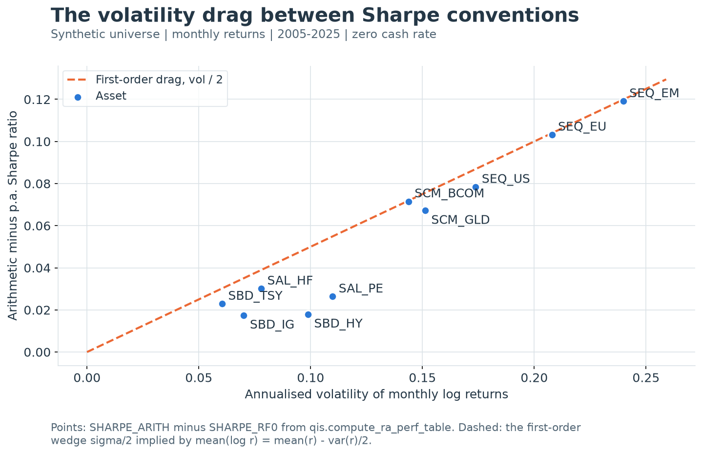

---
myst:
  html_meta:
    description: >-
      Defines the Sharpe ratio, the compound per-annum, arithmetic and log conventions that qis
      computes side by side, every other Sharpe-type estimator in qis, the identities that link
      them, and the standard errors a reader can attach to them.
---

# Sharpe ratios: conventions and inference

*Author: [Artur Sepp](https://github.com/ArturSepp) / First recorded: [2026-08-15](https://github.com/ArturSepp/QuantInvestStrats/commit/b04f87a11327bf814cc38ea46934c5b993ad4ef8)*

Implemented in [qis — Quantitative Investment Strategies](https://github.com/ArturSepp/QuantInvestStrats).
Software citation: [CITATION.cff](https://github.com/ArturSepp/QuantInvestStrats/blob/main/CITATION.cff).

The Sharpe ratio is the mean return of an investment in excess of cash per unit of return
volatility. Its numerator can be an arithmetic mean, a mean log return or a compound per-annum
return; the three give different numbers on the same data, and qis computes all three as
separately named columns. This chapter defines every Sharpe-type estimator in qis exactly as
implemented, proves how the conventions relate, and states how precisely a Sharpe ratio is
estimated from a finite history.

## Overview

The Sharpe ratio of [Sharpe (1966)](https://doi.org/10.1086/294846) and
[Sharpe (1994)](https://web.stanford.edu/~wfsharpe/art/sr/SR.htm) is the most quoted statistic
of a track record and one of the least precisely stated. Four choices define a reported number:
the numerator convention, the return basis of the volatility, the sampling grid, and the funding
rate. qis fixes each of them in `qis.PerfParams` and emits one `qis.PerfStat` column per
numerator convention, so a convention is chosen by selecting a column rather than by a flag.

The main results of the chapter are:

1. The compound per-annum (p.a.) Sharpe ratio is never below the log Sharpe ratio on the same
   data; it exceeds it by about half the volatility times the squared Sharpe ratio.
2. Both sit below the arithmetic Sharpe ratio by about half the annualised volatility: roughly
   0.05 at 10% volatility and 0.08 at 16%. Rankings of assets rarely change, but the sign can:
   an asset whose arithmetic Sharpe ratio is below half its volatility loses money when held.
3. The standard error of an annualised Sharpe ratio is about $1/\sqrt{Y}$ for $Y$ years of
   data, whatever the sampling frequency. A Sharpe ratio of 0.5 needs about 16 years of data to
   be twice its standard error. qis does not compute Sharpe standard errors; the worked example
   computes them with numpy.
4. `PerfParams.sharpe_convention` changes only the regime-conditional Sharpe ratios. Every
   table column is computed on every call and is unaffected by it.

This chapter is the reference for Sharpe ratios. The full column catalogue is in
[the performance-statistic catalogue](performance_statistics.md), drawdowns are in
[drawdowns and time under water](drawdowns.md), and regime-conditional tables are in
[regime-conditional performance](regime_conditional_performance.md). Return, NAV and cash
conventions are defined in [notation and conventions](notation_and_conventions.md) and
[returns, NAVs and excess returns](returns_and_navs.md).

<a id="data-and-calculation-contract"></a>

## Inputs, notation, and assumptions

| Convention | This article |
|---|---|
| Return basis | P.a. and log columns: compound growth over the sampled boundaries, volatility on `PerfParams.return_type` returns (log by default); arithmetic columns: simple returns in numerator and denominator; total, or in excess of `rates_data` |
| Sampling grid | `PerfParams.freq_vol` (default `ME`) for every table Sharpe column, on each asset's complete boundaries; the regime classifier's grid (default `QE`); `roll_freq` for rolling ratios; the caller's grid for EWM ratios and the information ratio |
| Annualisation | $\sqrt{\mathrm{AN}}$ of the sampled grid for volatilities and arithmetic ratios; compound numerators use $Y$ years of 365.25 days; $\mathrm{AN}$ is inferred from the sampled index |
| Mean adjustment | Standard deviations are demeaned, `ddof=1`; numerators are raw means or compound returns; the EWM ratio with `norm_type=1` uses a second moment about zero |
| Timing | Table and regime ratios are full-sample and descriptive; rolling and EWM ratios at $t$ use data up to $t$; the cash rate is lagged one observation of the rate series |
| Output units | Dimensionless annualised ratios; the EWM ratio with `norm_type=0` is an annualised return; standard errors are in Sharpe-ratio units |
| qis default | `compute_ra_perf_table(prices, perf_params=None)` builds `PerfParams(freq=pd.infer_freq(prices.index))`; `PerfParams()` has `freq_vol='ME'`, `return_type=ReturnTypes.LOG`, `sharpe_convention=SharpeConvention.PA`, `rates_data=None` |

| Symbol or input | Meaning | Units and convention |
|---|---|---|
| $P_s$, $P_e$ | First and last complete `freq_vol` boundary prices of one asset | Price units; per asset |
| $T$ | Number of sampled returns between $P_s$ and $P_e$ | Count |
| $Y$ | Elapsed years between the two boundaries | Calendar days divided by 365.25 |
| $r_t$, $\ell_t$ | Simple and log returns on the `freq_vol` grid | Decimal |
| $v_t$ | Returns used for the `VOL` column | $\ell_t$ by default; $r_t$ with `ReturnTypes.RELATIVE` |
| $\sigma_v$ | Table volatility $\sqrt{\mathrm{AN}}\,s(v)$ | Annualised decimal |
| $\sigma_r$ | Volatility of simple returns $\sqrt{\mathrm{AN}}\,s(r)$ | Annualised decimal |
| $R_{\mathrm{pa}}$, $\tilde R_{\mathrm{pa}}$ | P.a. return and p.a. excess return between the sampled boundaries | Decimal per year |
| $y_t$, $d_t$ | Annual cash-rate quote; calendar date of observation $t$ | Decimal per year; date |
| $\mathrm{SR}_{\mathrm{pa}}$, $\mathrm{SR}_{\log}$, $\mathrm{SR}_{\mathrm{arith}}$ | The three table conventions | Dimensionless, annualised |
| $\theta$, $\hat\theta$ | Periodic Sharpe ratio of one-period returns and its plug-in estimate $\bar r/s(r)$ | Per period, not annualised |
| $\gamma_3$, $\gamma_4$ | Skewness and kurtosis of periodic returns | $\gamma_4=3$ for the normal; not excess kurtosis |
| $\rho_k$ | Autocorrelation of periodic returns at lag $k$ | Dimensionless |
| $q$, $\eta(q)$ | Aggregation horizon in periods; Lo's time-aggregation factor | Count; $\eta(q)=\sqrt{q}$ without autocorrelation |
| $g$, $p_g$, $\bar r_g$ | Regime index, its frequency among classified periods, and the conditional mean return | Classifier grid |
| $x_t$, $\hat\mu_t$, $\hat\sigma_{1,t}$, $\hat\sigma_{2,t}$ | Input return of an EWM ratio, its EWM mean, and the two EWM scale estimates | Periodic |

### Inputs and sampling support

Inputs are a `pandas.Series` or `pandas.DataFrame` of positive prices with a sorted
`DatetimeIndex`, one column per asset or strategy. A risk output of `0.10` means 10%; Sharpe
ratios are dimensionless. `PerfParams.return_type` sets the return basis of the volatility and
higher moments. `freq_vol`, `freq_skewness`, `freq_drawdown` and `freq_reg` are separate
sampling grids. A 260-observation business-day rolling window is a window choice; it does not
set the annualisation factor, which is 252 for business days. See the
[frequency convention](frequency_convention_note.md).

Static tables evaluate each asset on its own observed support. Their visible return columns,
such as `PA_RETURN` and `PA_EXCESS_RETURN`, use the asset's native first and last observations.
The p.a., log, excess and Sortino **ratio numerators** instead use the complete `freq_vol`
boundaries on which the volatility denominator is estimated, so numerator and denominator
describe the same sample. Dividing a visible `PA_RETURN` by `VOL` therefore need not reproduce
`SHARPE_RF0` when a history starts or ends between reporting boundaries; the two agree when the
native endpoints fall on the `freq_vol` grid.

Interior gaps keep the table's established forward-fill policy, but an asset is not extended
beyond its last sampled observed price because another column continues. Benchmark regressions
use joint sampled support. Elsewhere, `qis.to_returns` forward-fills by default; use
`ffill_nans=False` when a gap must remain missing. A filled stale mark creates a zero return, not
information, and lowers measured volatility.

## Methodology

### Definition

**Definition (Sharpe ratio).** Let $D_t=r_t-r_{B,t}$ be the differential return of a fund over
a benchmark $B$ in period $t$. The historical (ex post) Sharpe ratio of $T$ periodic
differential returns and its annualised form are

$$
\hat\theta=\frac{\bar D}{s(D)},
\qquad
\mathrm{SR}=\sqrt{\mathrm{AN}}\,\hat\theta .
$$

With cash as the benchmark, $D_t$ is the excess return $\tilde r_t$. Sharpe (1966) introduced
the ratio as the "reward-to-variability" ratio of mutual funds: mean return in excess of the
riskless rate over the standard deviation of return. Sharpe (1994) restated it for any
differential return, defined the historical ratio as above with the arithmetic mean of periodic
differential returns, and noted that multiplying by the square root of the number of periods
annualises it only for serially uncorrelated returns. The population quantity is the periodic
ratio $\theta=\mathbb{E}[D_t]/\sqrt{\operatorname{Var}(D_t)}$.

The definition prescribes an arithmetic mean. The compound and log numerators below are
reporting conventions: well defined, widely used, and different numbers.

### The three table conventions

For one asset, let $P_s$ and $P_e$ be its first and last complete `freq_vol` boundary prices,
$T$ the number of returns between them, and $Y$ the elapsed calendar days divided by 365.25.
The p.a. return helper computes

$$
R_{\mathrm{pa}}=
\begin{cases}
(P_e/P_s)^{1/Y}-1, & Y>1,\\
P_e/P_s-1, & 0<Y\leq 1.
\end{cases}
$$

The three zero-rate table ratios are

$$
\mathrm{SR}_{\mathrm{pa}}=\frac{R_{\mathrm{pa}}}{\sigma_v},
\qquad
\mathrm{SR}_{\log}=\frac{\log(1+R_{\mathrm{pa}})}{\sigma_v},
\qquad
\mathrm{SR}_{\mathrm{arith}}=\frac{\sqrt{\mathrm{AN}}\,\bar r}{s(r)},
$$

with $\sigma_v=\sqrt{\mathrm{AN}}\,s(v)$ the `VOL` column and $v_t=\ell_t$ by default.

| Convention | Columns | Numerator | Denominator |
|---|---|---|---|
| P.a. (compound) | `SHARPE_RF0`, `SHARPE_EXCESS` | $R_{\mathrm{pa}}$ or $\tilde R_{\mathrm{pa}}$ | `VOL` on `return_type` returns |
| Log | `SHARPE_LOG_AN`, `SHARPE_LOG_EXCESS` | $\log(1+R_{\mathrm{pa}})$ or $\log(1+\tilde R_{\mathrm{pa}})$ | `VOL` on `return_type` returns |
| Arithmetic | `SHARPE_ARITH`, `SHARPE_ARITH_EXCESS` | $\mathrm{AN}$ times the mean simple (excess) return | $\sqrt{\mathrm{AN}}$ times the standard deviation of the same series |

Three consequences of the implementation are easy to miss. First, the p.a. and log columns share
`VOL`, so switching `return_type` to `ReturnTypes.RELATIVE` changes their denominator but not the
arithmetic pair's, which always pairs the mean and standard deviation of one simple-return series.
Second, `SHARPE_LOG_AN` annualises its numerator by calendar years, not by $\mathrm{AN}$; it is not
the textbook $\sqrt{\mathrm{AN}}\,\bar\ell/s(\ell)$, although the next identity shows the two
differ only by the factor $T/(\mathrm{AN}\,Y)$. Third, the column presets used by reporting
(for example `RA_TABLE_COLUMNS` in `qis.perfstats.config`) select `SHARPE_RF0` or `SHARPE_EXCESS`;
no preset includes the arithmetic pair, which must be selected by name.

### Identities between the conventions

**Identity (log numerator).** For $Y>1$,

$$
\log(1+R_{\mathrm{pa}})=\frac{T}{Y}\,\bar\ell,
\qquad
\mathrm{SR}_{\log}=\frac{T}{\mathrm{AN}\,Y}\cdot\frac{\sqrt{\mathrm{AN}}\,\bar\ell}{s(\ell)}
\quad\text{when } v_t=\ell_t .
$$

**Proof.** $\log(1+R_{\mathrm{pa}})=\log(P_e/P_s)/Y$, and the log price ratio telescopes into
$\sum_t\ell_t=T\bar\ell$, as in the per-annum identity of
[notation and conventions](notation_and_conventions.md). Divide by
$\sigma_v=\sqrt{\mathrm{AN}}\,s(\ell)$. $\square$

On a complete month-end grid the factor $T/(\mathrm{AN}\,Y)$ differs from one only through
unequal month lengths; it is 1.0001 in the worked example.

**Proposition (p.a. versus log).** If $\sigma_v>0$, then $\mathrm{SR}_{\mathrm{pa}}\geq
\mathrm{SR}_{\log}$, with equality only when $R_{\mathrm{pa}}=0$, and

$$
\mathrm{SR}_{\mathrm{pa}}-\mathrm{SR}_{\log}
=\frac{e^{z}-1-z}{\sigma_v}
\approx\frac{\sigma_v}{2}\,\mathrm{SR}_{\log}^2,
\qquad
z=\log(1+R_{\mathrm{pa}}).
$$

**Proof.** $R_{\mathrm{pa}}=e^{z}-1$, and $e^{z}\geq 1+z$ by convexity, with equality only at
$z=0$. Both ratios share $\sigma_v$. Expanding $e^{z}-1-z=z^2/2+O(z^3)$ and writing
$z=\sigma_v\,\mathrm{SR}_{\log}$ gives the approximation. $\square$

The inequality is exact and holds for negative returns too: for a losing asset the p.a. ratio is
the less negative of the two.

**Identity (volatility drag).** For periodic returns with $\lvert r_t\rvert<1$,

$$
\bar\ell=\bar r-\frac{1}{2}\left(\frac{T-1}{T}\,s(r)^2+\bar r^{\,2}\right)
+\frac{1}{3}\,\overline{r^3}-\cdots
\approx \bar r-\frac{s(r)^2}{2}.
$$

**Proof.** Average the series $\log(1+r)=r-r^2/2+r^3/3-\cdots$ over $t$ and use
$\overline{r^2}=\frac{T-1}{T}s(r)^2+\bar r^{\,2}$. The terms dropped in the approximation,
$\bar r^{\,2}/2$, $s(r)^2/(2T)$ and the cubic moment, are of higher order in the periodic
return. $\square$

**Proposition (convention wedge).** Assume (i) $Y>1$ on a regular grid, so that
$T/Y\approx\mathrm{AN}$; (ii) small periodic returns, with mean of order $1/\mathrm{AN}$ and
standard deviation of order $1/\sqrt{\mathrm{AN}}$, so that third-order terms are negligible;
and (iii) $\sigma_v\approx\sigma_r$. Then

$$
\mathrm{SR}_{\log}-\mathrm{SR}_{\mathrm{arith}}\approx-\frac{\sigma_r}{2},
\qquad
\mathrm{SR}_{\mathrm{pa}}-\mathrm{SR}_{\mathrm{arith}}\approx
-\frac{\sigma_r}{2}\left(1-\mathrm{SR}_{\log}^2\right).
$$

For $\lvert\mathrm{SR}\rvert\ll 1$ both wedges are about $-\sigma_r/2$.

**Proof.** By the two identities,
$\log(1+R_{\mathrm{pa}})=(T/Y)\bar\ell\approx\mathrm{AN}\,\bar r-\mathrm{AN}\,s(r)^2/2
=\mathrm{AN}\,\bar r-\sigma_r^2/2$. Dividing by $\sigma_v\approx\sigma_r$ gives
$\mathrm{SR}_{\log}\approx\mathrm{SR}_{\mathrm{arith}}-\sigma_r/2$. Adding the p.a.-minus-log
difference $(\sigma_r/2)\,\mathrm{SR}_{\log}^2$ from the previous proposition gives the second
wedge. $\square$

The wedge is about $-0.025$ at 5% volatility, $-0.05$ at 10%, $-0.08$ at 16% and $-0.10$ at 20%.
Assumption (iii) is the weakest. Expanding $\ell=r-r^2/2$ gives
$\operatorname{Var}(\ell)\approx\operatorname{Var}(r)-\operatorname{Cov}(r,r^2)$, hence
$s(\ell)\approx s(r)\,(1-\gamma_3 s(r)/2-\bar r)$: the default log volatility is smaller by a
relative amount of the order of the periodic volatility. This raises the p.a. and log ratios by
about $\mathrm{SR}\,(\gamma_3 s(r)/2+\bar r)$, of the order of one percent of the ratio on
monthly data (0.7% in the worked example).



[Open full-resolution preview](images/handbook_sharpe_wedge.png).

The exhibit plots $\mathrm{SR}_{\mathrm{arith}}-\mathrm{SR}_{\mathrm{pa}}$ for the ten synthetic
assets against their volatility, with the first-order wedge $\sigma_r/2$ dashed. Equity and
commodity indices, whose Sharpe ratios are near zero, sit on the line. The bond, hedge-fund and
private-equity indices sit below it because their Sharpe ratios of 0.45 to 0.72 make the factor
$1-\mathrm{SR}_{\log}^2$ matter: at $\mathrm{SR}_{\log}=0.72$ it halves the wedge. The remaining
gap, at most 0.006, is the lower log volatility of assumption (iii).

**Proposition (rankings).** For two assets $A$ and $B$ with small Sharpe ratios,

$$
\mathrm{SR}_{\mathrm{pa},A}-\mathrm{SR}_{\mathrm{pa},B}\approx
\left(\mathrm{SR}_{\mathrm{arith},A}-\mathrm{SR}_{\mathrm{arith},B}\right)
-\frac{\sigma_{r,A}-\sigma_{r,B}}{2}.
$$

**Proof.** Subtract the convention wedge of $B$ from that of $A$. $\square$

The conventions order two assets differently only when the more volatile one leads on the
arithmetic Sharpe ratio by less than half the volatility difference: for a 20% and a 5%
volatility asset, by less than 0.075. Rankings are usually preserved; in the worked example all
ten synthetic assets rank identically under the three conventions.

> **Insight.** Since $\log(1+R_{\mathrm{pa}})\approx\mathrm{AN}\,\bar r-\sigma_r^2/2$, the
> compound return of an asset is negative, to this approximation, exactly when its arithmetic
> Sharpe ratio is below half its volatility. An equity index with 19% volatility and an
> arithmetic Sharpe ratio of 0.05 has a positive mean return and loses money for a buy-and-hold
> investor; the worked example contains such an asset.

### Excess returns and funding

Excess returns follow the cash convention of
[notation and conventions](notation_and_conventions.md) and
[returns, NAVs and excess returns](returns_and_navs.md): an annual rate $y$ accrues on the
calendar days of each period over a 365-day year,

$$
r^{f}_t=y_{(t)}\,\frac{d_t-d_{t-1}}{365},
\qquad
\tilde r_t=r_t-r^{f}_t .
$$

`qis.compute_excess_returns` shifts the rate series by one of its own observations and then
forward-fills it onto the return dates, so $y_{(t)}$ is the quote preceding the last quote on
or before $d_t$. When the rates share the return grid this is the start-of-period quote
$y_{t-1}$; with daily rates and monthly returns it is the second-to-last daily quote of the
period, not the quote at its start. The first row of a return series accrues nothing, so the
table passes returns that begin with the starting price boundary and every realised return
accrues cash. The ACT/365 accrual is separate from the 365.25-day years used to annualise
compound returns. Supply a cash series that starts before the first price: if its first quote
falls on or after the first price boundary, the lag leaves that row without a rate, and the
compounded excess return starts one period late while $Y$ still counts the full history; qis
issues only a missing-price warning.

The excess columns then use

$$
\tilde R_{\mathrm{pa}}=\Big(\prod_{t=1}^{T}(1+\tilde r_t)\Big)^{1/Y}-1\quad(Y>1),
\qquad
\mathrm{SR}^{\mathrm{ex}}_{\mathrm{pa}}=\frac{\tilde R_{\mathrm{pa}}}{\sigma_v},
\qquad
\mathrm{SR}^{\mathrm{ex}}_{\mathrm{arith}}=\frac{\sqrt{\mathrm{AN}}\,\overline{\tilde r}}{s(\tilde r)},
$$

and `SHARPE_LOG_EXCESS` is $\log(1+\tilde R_{\mathrm{pa}})/\sigma_v$. The p.a. and log excess
columns keep the total-return `VOL` as denominator; the arithmetic excess column uses the mean
and standard deviation of $\tilde r_t$, which makes it the Sharpe (1994) estimator on
differential returns. Because the accrual is nearly deterministic, $s(\tilde r)\approx s(r)$,
and with a constant rate $\mathrm{SR}^{\mathrm{ex}}_{\mathrm{arith}}\approx
\mathrm{SR}_{\mathrm{arith}}-y/\sigma_r$: a 2% rate costs 0.13 of Sharpe ratio at 16% volatility.

With `rates_data=None` the code sets every excess numerator to its zero-rate counterpart, so
`SHARPE_EXCESS`, `SHARPE_LOG_EXCESS` and `SHARPE_ARITH_EXCESS` equal `SHARPE_RF0`,
`SHARPE_LOG_AN` and `SHARPE_ARITH`. An "excess" column from a call without a cash series is a
zero-rate Sharpe ratio.

### Every Sharpe-type estimator in qis

| Estimator | Formula | Returns and grid | Entry point and use |
|---|---|---|---|
| Table, p.a. | $R_{\mathrm{pa}}/\sigma_v$; excess $\tilde R_{\mathrm{pa}}/\sigma_v$ | Sampled `freq_vol` boundaries; `VOL` on `return_type` returns | `SHARPE_RF0`, `SHARPE_EXCESS` of `qis.compute_ra_perf_table`; the Sharpe ratio of column presets, factsheets and price-plot legends |
| Table, log | $\log(1+R_{\mathrm{pa}})/\sigma_v$ | As above | `SHARPE_LOG_AN`, `SHARPE_LOG_EXCESS`; log-return presets |
| Table, arithmetic | $\sqrt{\mathrm{AN}}\,\bar r/s(r)$ | Simple (excess) returns on `freq_vol` | `SHARPE_ARITH`, `SHARPE_ARITH_EXCESS`; select by name |
| Arithmetic helper | $\sqrt{\mathrm{AN}}\,\bar x/s(x)$ | Returns supplied by the caller; $\mathrm{AN}$ inferred unless `af` is given | Internal `qis.perfstats.perf_stats.compute_sharpe_arithmetic`; not called by the table |
| Regime, `SharpeConvention.PA` | Patched regime p.a. return over $\sigma_v$ | Classifier grid for regime returns; `freq_vol` for $\sigma_v$ | `qis.compute_bnb_regimes_pa_perf_table`, `qis.plot_regime_data` |
| Regime, `ARITHMETIC` | $\sqrt{\mathrm{AN}}\,p_g\bar r_g/s(r)$ | Classifier grid, simple returns by default | As above |
| Regime, `LOG` | The same on $\log(1+r_t)$ | Classifier grid | As above |
| Returns-level regime split | As `ARITHMETIC` or `LOG` | Caller's returns, explicit `af` | Internal `qis.perfstats.regime_classifier.compute_regime_sharpe_decomposition`; rejects `PA` |
| Rolling | $\sqrt{\mathrm{AN}}\,(e^{\bar\ell}-1)/s(\ell)$ within each window | Log returns on `roll_freq` | `qis.compute_rolling_perf_stat` with `RollingPerfStat.SHARPE`; rolling panels of factsheets |
| EWM, `norm_type=0` | $\mathrm{AN}\,\hat\mu_t$, not a ratio | Caller's returns | `qis.compute_ewm_sharpe` |
| EWM, `norm_type=1` | $\sqrt{\mathrm{AN}}\,\hat\mu_t/\hat\sigma_{1,t}$ | Caller's returns | `qis.compute_ewm_sharpe` default |
| EWM, `norm_type=2` | $\sqrt{\mathrm{AN}}\,\hat\mu_t/\hat\sigma_{2,t}$ | Caller's returns; log returns on `freq` (default `QE`) from prices | `qis.compute_ewm_sharpe_from_prices` default; `qis.compute_model_layer_ewma_stage_sharpes` |
| Information ratio | $\sqrt{\mathrm{AN}}\,\overline{(r_p-r_b)}/s(r_p-r_b)$ | Caller's active returns | `qis.compute_te_ir_errors`, `qis.compute_info_ratio_table` |
| Model-layer contributions | Annualised return component over a common annualised volatility | Full-sample or current EWM | `qis.compute_model_layer_in_sample_sharpe_contributions`, `qis.compute_model_layer_ewma_sharpe_contributions` |

`PerfParams.sharpe_convention` enters one computation: the regime-conditional Sharpe branch of
`qis.compute_regimes_pa_perf_table_from_sampled_returns`, which the regime classifiers and
`compute_bnb_regimes_pa_perf_table` call. The six table columns are computed on every call and
are unchanged by it. The rolling, EWM and information-ratio estimators do not take `PerfParams`.

**Rolling ratio.** The rolling helper divides the periodic geometric mean return
$e^{\bar\ell}-1$ of each window by the window's $s(\ell)$ and multiplies by
$\sqrt{\mathrm{AN}}$. It counts `roll_periods` rows on `roll_freq` and requires all of them to be
present. Over a full-sample window it equals `SHARPE_LOG_AN` times
$\frac{e^{\bar\ell}-1}{\bar\ell}\cdot\frac{\mathrm{AN}\,Y}{T}\approx 1+\bar\ell/2$, a fourth
formula that agrees with the log column to a fraction of a percent on monthly data.

**EWM ratios.** With decay $\lambda=1-2/(N+1)$ for span $N$, missing returns set to zero, and
initial state $\hat\mu_0=\hat\sigma^2_{1,0}=\hat\sigma^2_{2,0}=0$ at the first row, whose
return is not used,

$$
\begin{aligned}
\hat\mu_t&=\lambda\hat\mu_{t-1}+(1-\lambda)x_t,\\
\hat\sigma^2_{1,t}&=\lambda\hat\sigma^2_{1,t-1}+(1-\lambda)x_t^2,\\
\hat\sigma^2_{2,t}&=\lambda\hat\sigma^2_{2,t-1}+(1-\lambda)(x_t-\hat\mu_t)^2 .
\end{aligned}
$$

`initial_sharpes` replaces the zero state by a prior of 10% annual volatility and the given
annualised Sharpe ratio: $\hat\mu_0=0.1\,\mathrm{SR}_0/\mathrm{AN}$ and
$\hat\sigma^2_0=0.01/\mathrm{AN}$. The ratios at $t$ use returns up to $t$ only, so they are
point in time; [exponentially weighted estimators](ewm_estimators.md) covers the recursion.

**Proposition (bound on the `norm_type=1` ratio).** With zero initial state,
$\lvert\hat\mu_t\rvert\leq\hat\sigma_{1,t}$, so the ratio lies in
$[-\sqrt{\mathrm{AN}},\sqrt{\mathrm{AN}}]$; for stationary returns it estimates
$\sqrt{\mathrm{AN}}\,\theta/\sqrt{1+\theta^2}$ rather than $\sqrt{\mathrm{AN}}\,\theta$.

**Proof.** $\hat\mu_t=\sum_k w_kx_k$ and $\hat\sigma^2_{1,t}=\sum_k w_kx_k^2$ with
$w_k=(1-\lambda)\lambda^{t-k}\geq 0$ and $\sum_k w_k=1-\lambda^t\leq 1$. By Cauchy–Schwarz,
$(\sum_k w_kx_k)^2\leq\sum_k w_k\sum_k w_kx_k^2\leq\hat\sigma^2_{1,t}$. In population the second
moment about zero is $\sigma^2+\mu^2$, and $\mu/\sqrt{\sigma^2+\mu^2}=\theta/\sqrt{1+\theta^2}$.
$\square$

For monthly $\theta$ near 0.15 the shrinkage is about 1%; it matters for fast signals with large
periodic Sharpe ratios.

**Information ratio.** `compute_te_ir_errors` returns the annualised tracking error
$\sqrt{\mathrm{AN}}\,s(r_p-r_b)$ and the information ratio, which is the arithmetic Sharpe ratio
of the active return: the Sharpe (1994) differential return with a non-cash benchmark. See
[tracking error](tracking_error_and_risk.md) and
[signal diagnostics](signal_diagnostics.md).

### Regime-conditional Sharpe ratios

**Identity (additive regime decomposition).** Partition the $T$ periods into regimes $g$ with
frequencies $p_g=T_g/T$ and conditional means $\bar r_g$. Then

$$
\frac{\sqrt{\mathrm{AN}}\,\bar r}{s(r)}=\sum_g\frac{\sqrt{\mathrm{AN}}\,p_g\,\bar r_g}{s(r)} .
$$

**Proof.** $\sum_gp_g\bar r_g=\sum_g\frac{T_g}{T}\cdot\frac{1}{T_g}\sum_{t\in g}r_t=\bar r$;
divide by the common $s(r)$. $\square$

`SharpeConvention.ARITHMETIC` computes these terms on the classifier's sampled returns, and
`SharpeConvention.LOG` the same on $\log(1+r_t)$; both add up exactly to the total ratio of their
convention on that grid. The compound numerator has no such identity, because
$e^{\sum_g z_g}-1\neq\sum_g(e^{z_g}-1)$. The `PA` branch forms
$\exp(\mathrm{AN}\,p_g\bar r_g)-1$ from mean simple returns, allocates the gap between their
sum and the visible `PA_RETURN` across regimes in proportion to $p_g$, and divides by `VOL`.
Its bars therefore add up to `PA_RETURN` divided by `VOL`, which differs from `SHARPE_RF0` when
the native endpoints are off the `freq_vol` grid. All three branches decompose total-return
Sharpe ratios: `PerfParams.rates_data` enters the table's excess columns but not the regime
contributions, and the regime column labels, such as `Bear-Sharpe`, do not name the convention.
Classifier grids, partial periods and the patch are treated in
[regime-conditional performance](regime_conditional_performance.md).

### Sampling uncertainty

A Sharpe ratio is an estimate. Let $\hat\theta=\bar r/s(r)$ on $T$ periodic returns; the
arithmetic column is $\sqrt{\mathrm{AN}}\,\hat\theta$.

**Proposition (independent normal returns).** If the $r_t$ are independent
$N(\mu,\sigma^2)$, then $\sqrt{T}(\hat\theta-\theta)$ is asymptotically normal with variance
$1+\theta^2/2$, so

$$
\operatorname{se}(\hat\theta)\approx\sqrt{\frac{1+\hat\theta^2/2}{T}} .
$$

**Proof.** This is the result of [Lo (2002)](https://doi.org/10.2469/faj.v58.n4.2453). Apply the
delta method to $h(m,s^2)=m/\sqrt{s^2}$, with $\partial h/\partial m=1/\sigma$ and
$\partial h/\partial s^2=-\mu/(2\sigma^3)$. Under normality $\bar r$ and $s^2$ are independent
with asymptotic variances $\sigma^2/T$ and $2\sigma^4/T$. The variance of $\hat\theta$ is
$\frac{1}{\sigma^2}\frac{\sigma^2}{T}+\frac{\mu^2}{4\sigma^6}\frac{2\sigma^4}{T}
=(1+\theta^2/2)/T$. $\square$

**Proposition (non-normal independent returns).** If the $r_t$ are independent with skewness
$\gamma_3$ and kurtosis $\gamma_4$,

$$
\operatorname{Var}(\hat\theta)\approx
\frac{1-\gamma_3\,\theta+\frac{\gamma_4-1}{4}\,\theta^2}{T}.
$$

**Proof.** This is Mertens (2002). The derivatives are as before, but now
$\operatorname{Cov}(\bar r,s^2)\approx\gamma_3\sigma^3/T$ and
$\operatorname{Var}(s^2)\approx(\gamma_4-1)\sigma^4/T$. The cross term
$2\cdot\frac{1}{\sigma}\cdot\frac{-\mu}{2\sigma^3}\cdot\frac{\gamma_3\sigma^3}{T}$ equals
$-\gamma_3\theta/T$, and the variance term becomes $(\gamma_4-1)\theta^2/(4T)$. With
$\gamma_3=0$ and $\gamma_4=3$ the normal result is recovered. $\square$

[Opdyke (2007)](https://doi.org/10.1057/palgrave.jam.2250084) obtains the same expression under
weaker assumptions than independence and uses it to test the difference between two Sharpe
ratios. Relative to the normal case the variance changes by
$(-\gamma_3\theta+\frac{\gamma_4-3}{4}\theta^2)/T$. Negative skewness with a positive Sharpe
ratio raises it; fat tails raise it only at order $\theta^2$. For a monthly $\theta=0.15$ with
$\gamma_3=-1$ and $\gamma_4=6$, the standard error rises by 8%.

**Annualisation.** Since $\mathrm{SR}=\sqrt{\mathrm{AN}}\,\hat\theta$,
$\operatorname{se}(\mathrm{SR})=\sqrt{\mathrm{AN}}\operatorname{se}(\hat\theta)$, and with
$T\approx\mathrm{AN}\,Y$ the independent normal case gives

$$
\operatorname{se}(\mathrm{SR})\approx\sqrt{\frac{1+\mathrm{SR}^2/(2\,\mathrm{AN})}{Y}}
\approx\frac{1}{\sqrt{Y}} .
$$

> **Insight.** The precision of a Sharpe ratio is bought with calendar time, not with sampling
> frequency. Ten years of daily or monthly data give a standard error of about 0.32 either way.
> A true Sharpe ratio of 0.5 reaches twice its standard error only after about 16 years.

**Serial correlation.** For stationary returns with autocorrelations $\rho_k$, and $q$-period
returns formed as sums of periodic returns (exact for log returns), Lo (2002) shows that the
$q$-period Sharpe ratio is

$$
\mathrm{SR}(q)=\eta(q)\,\theta,
\qquad
\eta(q)=\frac{q}{\sqrt{q+2\sum_{k=1}^{q-1}(q-k)\rho_k}} .
$$

The proof is one line: the $q$-period sum has mean $q\mu$ and variance
$\sigma^2\big(q+2\sum_{k=1}^{q-1}(q-k)\rho_k\big)$. Hence $\eta(q)=\sqrt{q}$ only without
autocorrelation, and $\eta(q)=\sqrt{q}/\sqrt{\mathrm{VR}(q)}$ with the variance ratio of the
[frequency convention](frequency_convention_note.md). Positive autocorrelation, typical of
smoothed or appraisal-based marks, makes $\sqrt{\mathrm{AN}}$ scaling overstate the annual Sharpe
ratio; see [private-asset unsmoothing](private_asset_unsmoothing.md) and
[serial dependence](serial_dependence.md). Lo (2002) also gives heteroskedasticity- and
autocorrelation-consistent standard errors for this case; the estimator family is covered in
[regression and HAC inference](regression_and_hac.md).

**Probabilistic and deflated Sharpe ratios.** Two tools built on the non-normal variance are
standard context for reading a Sharpe ratio. The probabilistic Sharpe ratio of Bailey and
López de Prado (2012) is the probability that the true periodic ratio exceeds a threshold
$\theta^{*}$,

$$
\mathrm{PSR}(\theta^{*})=\Phi\!\left(
\frac{(\hat\theta-\theta^{*})\sqrt{T-1}}{\sqrt{1-\gamma_3\hat\theta+\frac{\gamma_4-1}{4}\hat\theta^2}}
\right),
$$

with $\Phi$ the standard normal distribution function; the same paper derives the minimum track
record length. The deflated Sharpe ratio of
[Bailey and López de Prado (2014)](https://doi.org/10.3905/jpm.2014.40.5.094) sets $\theta^{*}$
to the expected maximum Sharpe ratio among the independent trials of a strategy search, which
corrects for selection among many backtests.

**What qis computes.** No function in qis returns a Sharpe-ratio standard error, a probabilistic
or a deflated Sharpe ratio. The nearest output is `qis.compute_desc_table(...,
is_add_tstat=True)`, which reports $\sqrt{T}\,\bar x/s(x)$ for each column; on periodic returns
this is $\sqrt{T}\,\hat\theta$, the Sharpe ratio divided by its standard error under the null
$\theta=0$. The worked example computes the standard errors above with numpy, and the bootstrap
of [reproducibility](reproducibility.md) can resample returns for a distribution-free
alternative.

### Short histories

With $Y\leq 1$ the p.a. helper returns the total return unannualised, so `SHARPE_RF0` divides a
sub-annual total return by an annualised volatility, and `SHARPE_LOG_AN` equals
$(T/\mathrm{AN})\cdot\sqrt{\mathrm{AN}}\,\bar\ell/s(\ell)$. A six-month history with a true
annualised Sharpe ratio of 1 therefore shows about 0.5, while `SHARPE_ARITH` is annualised
regardless of $Y$; for short histories the conventions differ by a factor close to $Y$, not by
$\sigma_r/2$. The standalone `qis.compute_pa_return` offers `annualize_less_1y=True` for linear
scaling, but the table does not request it. By the standard-error formula, a history shorter
than a year has a standard error above one, so no convention yields an informative number. A
sample with fewer than two sampled returns has no volatility and a missing ratio.

### Which convention to report

Two traditions use different numerators, and each is the right object for its question.

**Arithmetic, for inference and decomposition.** Sharpe (1994) defines the historical ratio with
the arithmetic mean of periodic differential returns. The inference literature, from Lo (2002),
Mertens (2002) and Opdyke (2007) to Bailey and López de Prado (2012, 2014), derives its
distributions for $\hat\theta=\bar r/s(r)$; standard errors, tests and deflation apply to this
object. Means are linear, so regime decompositions, attribution bridges and portfolio
aggregation of constituent means are exact in this convention; the log convention is exact for
aggregation through time and across regimes, but not across assets.

**Compound p.a., for reporting.** The performance-measurement practice documented by
[Bacon (2008)](bibliography.md) forms risk-adjusted ratios from annualised returns, and
annualises returns by compounding; the R package PerformanceAnalytics, written in that tradition,
annualises its Sharpe ratio geometrically by default. The compound return is what a buy-and-hold
investor earned, it is the headline return of a track record, and it charges the volatility drag
of the path, so a volatile series never looks better than the investor's experience.

qis is a reporting library whose tables and factsheets are reconciled against track records. It
therefore keeps the p.a. convention as the default: the Sharpe ratio printed next to a p.a.
return and a volatility is their ratio, up to the sampling-support rule above, and existing
reports keep their numbers. The other conventions are always computed alongside as named columns.
A practical rule: report `SHARPE_RF0` or `SHARPE_EXCESS` and say so; use `SHARPE_ARITH` or
`SHARPE_ARITH_EXCESS` for standard errors, significance and comparisons with the literature; use
`SharpeConvention.ARITHMETIC` or `SharpeConvention.LOG` for regime attribution.

> **Pitfall.** The column labelled `Sharpe (rf=0)` is the compound p.a. convention; the label does
> not say so, and it is kept because code selects the column by it. Comparing it with an
> arithmetic Sharpe ratio from another system shows a gap of about half the volatility that is
> convention, not performance.

### Rolling statistics and drawdowns

`qis.compute_rolling_perf_stat` returns `(data, label)`. For volatility, Sharpe ratio, skewness
and total returns, `roll_periods` counts observations on `roll_freq`: 36 on `ME` is a 36-month
window, and the default of 260 on `B` is about one year, annualised with 252. The `PA_RETURNS`
branch applies its window to the supplied native price rows; resample prices explicitly when
another grid is required. `EWMA_VOL` uses an exponentially weighted estimator with span
`roll_periods` instead of a fixed window. The rolling Sharpe ratio is the rolling row of the
estimator table above and does not read `PerfParams`. A trailing-window observation and a
full-sample table row describe different periods and should not be compared as if they were one
estimate.

Drawdowns measure the loss from the running peak, $D_t=P_t/\max_{t'\leq t}P_{t'}-1$.
`qis.compute_rolling_drawdowns` returns the drawdown path, and `qis.compute_drawdowns_stats_table`
the episode table of dates, depths and recovery times. Their definitions, sampling on
`freq_drawdown` and the statistics derived from them are in
[drawdowns and time under water](drawdowns.md).

<a id="minimal-offline-example"></a>

## Worked example

### A three-return arithmetic check

Three monthly simple returns of 5%, −2%, and 5% have mean $0.08/3$, annualised sample
volatility 14%, and an arithmetic Sharpe of $0.32/0.14=16/7$, approximately 2.285714.
The following fixed arithmetic illustration checks the named qis column. Three returns are
enough to check arithmetic, not to support a reliable performance assessment.

```python
from math import isclose

import pandas as pd
import qis

illustration = pd.Series(
    [100.0, 105.0, 102.9, 108.045],
    index=pd.date_range('2024-01-31', periods=4, freq='ME'),
    name='Arithmetic illustration',
)
illustration_table = qis.compute_ra_perf_table(
    prices=illustration,
    perf_params=qis.PerfParams(freq='ME', return_type=qis.ReturnTypes.RELATIVE),
)
arithmetic_sharpe = illustration_table.loc[
    illustration.name, qis.PerfStat.SHARPE_ARITH.to_str()
]
assert isclose(arithmetic_sharpe, 16.0 / 7.0, abs_tol=1e-12)
```

### Three conventions on one synthetic asset

The frozen synthetic universe (seed 20260725, reporting quirks disabled) starts on
2 January 2014 and ends on 31 December 2025. Take its gold series, `SCM_GLD`, with a constant 2%
cash rate quoted from December 2013, so that the lagged rate exists for the first return. On the
month-end grid there are $T=143$ returns over $Y=11.915$ years between 31 January 2014 and
31 December 2025, and $T/(\mathrm{AN}\,Y)=1.0001$.

The sampled p.a. return is 8.11% and the log volatility `VOL` is 15.79%, so
`SHARPE_RF0` $=0.513$ and `SHARPE_LOG_AN` $=0.493$. The arithmetic column is
`SHARPE_ARITH` $=0.570$ with a simple-return volatility of 15.90%. The p.a.-minus-arithmetic
wedge is $-0.057$ against the approximation $-(\sigma_r/2)(1-\mathrm{SR}_{\log}^2)=-0.060$; the
log-minus-arithmetic wedge is $-0.077$ against $-\sigma_r/2=-0.079$. The remainders are the
denominator effect of the convention-wedge proposition: $s(\ell)/s(r)=0.993$. The visible
`PA_RETURN` is 8.47%, because it starts on 2 January rather than 31 January 2014; dividing it by
`VOL` gives 0.536, not `SHARPE_RF0`. With 2% cash the excess columns are 0.378 (p.a.), 0.367
(log) and 0.444 (arithmetic), and $0.570-0.02/0.159=0.444$ as predicted.

```python
import numpy as np
import pandas as pd
import qis
from qis.datasets import generate_synthetic_universe

universe = generate_synthetic_universe(
    start='2014-01-02', end='2025-12-31', seed=20260725, apply_quirks=False
)
gold = universe.prices['SCM_GLD']
cash = pd.Series(0.02, index=pd.bdate_range('2013-12-02', '2025-12-31'), name='cash')
gold_params = qis.PerfParams(freq='ME', return_type=qis.ReturnTypes.LOG, rates_data=cash)
gold_row = qis.compute_ra_perf_table(prices=gold, perf_params=gold_params).loc['SCM_GLD']


def column(stat: qis.PerfStat) -> float:
    return float(gold_row[stat.to_str()])


# independent calculation on the complete month-end boundaries 2014-01-31 .. 2025-12-31
month_end = gold.resample('ME').last()
simple = month_end.pct_change().dropna().to_numpy()
log_r = np.log(month_end).diff().dropna().to_numpy()
num_returns = len(log_r)
years = (month_end.index[-1] - month_end.index[0]).days / 365.25
pa_return = (month_end.iloc[-1] / month_end.iloc[0]) ** (1.0 / years) - 1.0
vol = np.sqrt(12.0) * log_r.std(ddof=1)
vol_simple = np.sqrt(12.0) * simple.std(ddof=1)
sr_pa = pa_return / vol
sr_log = np.log1p(pa_return) / vol
sr_arith = np.sqrt(12.0) * simple.mean() / simple.std(ddof=1)
np.testing.assert_allclose(
    [column(qis.PerfStat.VOL), column(qis.PerfStat.SHARPE_RF0),
     column(qis.PerfStat.SHARPE_LOG_AN), column(qis.PerfStat.SHARPE_ARITH)],
    [vol, sr_pa, sr_log, sr_arith], rtol=0.0, atol=1e-12,
)
assert num_returns == 143 and abs(years - 11.915) < 5e-4
np.testing.assert_allclose([pa_return, vol, vol_simple], [0.0811, 0.1579, 0.1590], atol=5e-5)
np.testing.assert_allclose([sr_pa, sr_log, sr_arith], [0.513, 0.493, 0.570], atol=5e-4)

# identity: log(1 + R_pa) = (T / Y) * mean log return, exactly
assert np.isclose(np.log1p(pa_return), num_returns / years * log_r.mean(), rtol=1e-12)
assert abs(num_returns / (12.0 * years) - 1.0) < 2e-4
# proposition: the p.a. ratio is never below the log ratio
assert sr_pa > sr_log
# convention wedges and their approximations
assert np.isclose(sr_pa - sr_arith, -0.057, atol=5e-4)
assert abs((sr_pa - sr_arith) + 0.5 * vol_simple * (1.0 - sr_log ** 2)) < 0.005
assert abs((sr_log - sr_arith) + 0.5 * vol_simple) < 0.005
assert np.isclose(log_r.std(ddof=1) / simple.std(ddof=1), 0.993, atol=5e-4)

# visible PA_RETURN uses the native start 2014-01-02; the ratio numerator does not
assert np.isclose(column(qis.PerfStat.PA_RETURN), 0.0847, atol=5e-5)
assert abs(column(qis.PerfStat.PA_RETURN) / vol - sr_pa) > 0.02

# excess columns: accrual 2% * days / 365 (the lag is immaterial for a constant rate)
days = np.diff(month_end.index.values).astype('timedelta64[D]').astype(float)
excess = simple - 0.02 * days / 365.0
excess_pa = np.prod(1.0 + excess) ** (1.0 / years) - 1.0
np.testing.assert_allclose(
    [column(qis.PerfStat.SHARPE_EXCESS), column(qis.PerfStat.SHARPE_LOG_EXCESS),
     column(qis.PerfStat.SHARPE_ARITH_EXCESS)],
    [excess_pa / vol, np.log1p(excess_pa) / vol,
     np.sqrt(12.0) * excess.mean() / excess.std(ddof=1)], rtol=0.0, atol=1e-12,
)
np.testing.assert_allclose(
    [column(qis.PerfStat.SHARPE_EXCESS), column(qis.PerfStat.SHARPE_LOG_EXCESS),
     column(qis.PerfStat.SHARPE_ARITH_EXCESS)], [0.378, 0.367, 0.444], atol=5e-4,
)
assert abs(column(qis.PerfStat.SHARPE_ARITH_EXCESS) - (sr_arith - 0.02 / vol_simple)) < 1e-3
```

Across all ten assets of the universe, without a cash series, the three conventions produce the
same ranking, and every excess column equals its zero-rate column. The European equity series
`SEQ_EU` illustrates the sign insight: 18.8% volatility, an arithmetic Sharpe ratio of $+0.050$
and a p.a. Sharpe ratio of $-0.043$.

```python
panel = qis.compute_ra_perf_table(prices=universe.prices, perf_params=qis.PerfParams(freq='ME'))
conventions = [qis.PerfStat.SHARPE_RF0, qis.PerfStat.SHARPE_LOG_AN, qis.PerfStat.SHARPE_ARITH]
ranks = panel[[stat.to_str() for stat in conventions]].rank()
assert (ranks.nunique(axis=1) == 1).all()  # every asset has one rank in all conventions

for total, excess_stat in [(qis.PerfStat.SHARPE_RF0, qis.PerfStat.SHARPE_EXCESS),
                           (qis.PerfStat.SHARPE_LOG_AN, qis.PerfStat.SHARPE_LOG_EXCESS),
                           (qis.PerfStat.SHARPE_ARITH, qis.PerfStat.SHARPE_ARITH_EXCESS)]:
    np.testing.assert_array_equal(panel[total.to_str()], panel[excess_stat.to_str()])

europe = panel.loc['SEQ_EU']
assert np.isclose(europe[qis.PerfStat.VOL.to_str()], 0.188, atol=5e-4)
assert np.isclose(europe[qis.PerfStat.SHARPE_ARITH.to_str()], 0.050, atol=5e-4)
assert np.isclose(europe[qis.PerfStat.SHARPE_RF0.to_str()], -0.043, atol=5e-4)
assert europe[qis.PerfStat.SHARPE_ARITH.to_str()] < 0.5 * europe[qis.PerfStat.VOL.to_str()]
```

### Standard errors

For the gold series the monthly plug-in ratio is $\hat\theta=0.1646$, and the moment estimates
of the simple returns are $\gamma_3=0.058$ and $\gamma_4=2.64$. The annualised standard error is
0.292 under independent normal returns and 0.290 with the skewness and kurtosis correction; both
are close to $1/\sqrt{Y}=0.290$. Positive skewness with a positive Sharpe ratio, and kurtosis
below 3, each lower the variance. The arithmetic Sharpe ratio of 0.570 is 1.955 standard errors
from zero under the normal formula and 1.967 under the corrected one: twelve years of a 0.57
Sharpe ratio sit right at the conventional 5% two-sided threshold. The table's `SKEWNESS` and
`KURTOSIS` columns cannot be plugged in directly: they are bias-corrected, computed on
`return_type` returns (log by default) and report excess kurtosis, and for gold they are $-0.054$
and $-0.336$. The sample lag-1 autocorrelation is 0.105. If it were the true value and higher lags
were zero, Lo's factor $\eta(12)/\sqrt{12}=0.916$ would lower the annualised ratio to 0.522; but
its own standard error is about $1/\sqrt{T}=0.084$, so the data cannot tell the two apart.

```python
theta = simple.mean() / simple.std(ddof=1)  # periodic arithmetic Sharpe ratio
z = (simple - simple.mean()) / simple.std(ddof=0)
skewness, kurtosis = np.mean(z ** 3), np.mean(z ** 4)  # gamma_3 and gamma_4 (not excess)
var_iid = (1.0 + 0.5 * theta ** 2) / num_returns
var_non_normal = (1.0 - skewness * theta + 0.25 * (kurtosis - 1.0) * theta ** 2) / num_returns
se_iid, se_non_normal = np.sqrt(12.0 * var_iid), np.sqrt(12.0 * var_non_normal)

assert np.isclose(np.sqrt(12.0) * theta, column(qis.PerfStat.SHARPE_ARITH), atol=1e-12)
assert np.isclose(theta, 0.1646, atol=5e-5)
np.testing.assert_allclose([skewness, kurtosis], [0.058, 2.64], atol=5e-3)
np.testing.assert_allclose([se_iid, se_non_normal], [0.292, 0.290], atol=5e-4)
# the variances differ by exactly the skewness and excess-kurtosis terms
assert np.isclose(var_non_normal - var_iid,
                  (-skewness * theta + 0.25 * (kurtosis - 3.0) * theta ** 2) / num_returns,
                  rtol=0.0, atol=1e-15)
# positive skew with a positive Sharpe ratio, and kurtosis below 3, both shrink the variance
assert skewness * theta > 0.0 and kurtosis < 3.0 and se_non_normal < se_iid
# the annualised standard error is close to one over the square root of the years
assert abs(se_iid - 1.0 / np.sqrt(years)) < 0.003
assert abs(sr_arith / se_iid - 1.955) < 1e-3 and abs(sr_arith / se_non_normal - 1.967) < 1e-3
# the table's moment columns use log returns, bias correction and excess kurtosis
np.testing.assert_allclose(
    [column(qis.PerfStat.SKEWNESS), column(qis.PerfStat.KURTOSIS)], [-0.054, -0.336], atol=5e-4
)

# Lo (2002) time aggregation with only the lag-1 autocorrelation
rho_1 = np.corrcoef(simple[1:], simple[:-1])[0, 1]
eta_12 = 12.0 / np.sqrt(12.0 + 2.0 * 11.0 * rho_1)
assert np.isclose(rho_1, 0.105, atol=5e-4)
assert np.isclose(eta_12 / np.sqrt(12.0), 0.916, atol=5e-4)
assert np.isclose(eta_12 * theta, 0.522, atol=5e-4)
```

### The other estimators

A rolling window of all 143 months gives 0.495, the rolling formula applied to the full sample;
`SHARPE_LOG_AN` is 0.493. The EWM ratio with span 36 and `norm_type=2` on monthly log returns is
1.31 at December 2025: a point-in-time estimate dominated by the last three years, not a
full-sample one. The information ratio of gold against the synthetic Treasury series is 0.301,
the arithmetic Sharpe ratio of the monthly active return.

```python
rolling_sharpe, rolling_label = qis.compute_rolling_perf_stat(
    prices=gold, rolling_perf_stat=qis.RollingPerfStat.SHARPE,
    roll_freq='ME', roll_periods=num_returns,
)
rolling_full = np.sqrt(12.0) * np.expm1(log_r.mean()) / log_r.std(ddof=1)
assert np.isclose(rolling_sharpe.iloc[-1], rolling_full, atol=1e-12)
assert np.isclose(rolling_full, 0.495, atol=5e-4)
factor = np.expm1(log_r.mean()) / log_r.mean() * 12.0 * years / num_returns
assert np.isclose(rolling_full, factor * column(qis.PerfStat.SHARPE_LOG_AN), rtol=1e-12)

# EWM Sharpe ratio, norm_type=2: recursions from a zero state; the first return is not used
log_monthly = qis.to_returns(prices=gold, freq='ME', is_log_returns=True)  # first row is NaN
ewm_sharpe = qis.compute_ewm_sharpe(returns=log_monthly.to_frame(), span=36, norm_type=2)
lam = 1.0 - 2.0 / (36.0 + 1.0)
ewm_mean = ewm_var = 0.0
for x_t in np.nan_to_num(log_monthly.to_numpy())[1:]:
    ewm_mean = lam * ewm_mean + (1.0 - lam) * x_t
    ewm_var = lam * ewm_var + (1.0 - lam) * (x_t - ewm_mean) ** 2
assert np.isclose(ewm_sharpe.iloc[-1, 0], np.sqrt(12.0) * ewm_mean / np.sqrt(ewm_var),
                  atol=1e-12)
assert np.isclose(ewm_sharpe.iloc[-1, 0], 1.307, atol=5e-4)

# information ratio: arithmetic Sharpe ratio of the active return
monthly = qis.to_returns(prices=universe.prices[['SCM_GLD', 'SBD_TSY']], freq='ME',
                         drop_first=True)
active = (monthly['SCM_GLD'] - monthly['SBD_TSY']).to_frame('Gold minus Treasuries')
tracking_error, information_ratio = qis.compute_te_ir_errors(return_diffs=active)
active_np = active.to_numpy().ravel()
assert np.isclose(information_ratio.iloc[0],
                  np.sqrt(12.0) * active_np.mean() / active_np.std(ddof=1), atol=1e-12)
assert np.isclose(information_ratio.iloc[0], 0.301, atol=5e-4)
```

## Implementation in qis

| Quantity | Formula | qis entry point |
|---|---|---|
| P.a. Sharpe ratio | $R_{\mathrm{pa}}/\sigma_v$ | `PerfStat.SHARPE_RF0` of `qis.compute_ra_perf_table` |
| P.a. excess Sharpe ratio | $\tilde R_{\mathrm{pa}}/\sigma_v$ | `PerfStat.SHARPE_EXCESS`; cash from `PerfParams.rates_data` |
| Log Sharpe ratio | $\log(1+R_{\mathrm{pa}})/\sigma_v$ | `PerfStat.SHARPE_LOG_AN`; excess: `PerfStat.SHARPE_LOG_EXCESS` |
| Arithmetic Sharpe ratio | $\sqrt{\mathrm{AN}}\,\bar r/s(r)$ | `PerfStat.SHARPE_ARITH`, computed in `qis.compute_risk_table` |
| Arithmetic excess Sharpe ratio | $\sqrt{\mathrm{AN}}\,\overline{\tilde r}/s(\tilde r)$ | `PerfStat.SHARPE_ARITH_EXCESS` |
| Table volatility | $\sigma_v=\sqrt{\mathrm{AN}}\,s(v)$ | `PerfStat.VOL`; `PerfParams.freq_vol`, `PerfParams.return_type` |
| P.a. return | $R_{\mathrm{pa}}$ | `PerfStat.PA_RETURN` (native endpoints), `qis.compute_pa_return` |
| Cash accrual and excess returns | $r^{f}_t$, $\tilde r_t$ | `qis.compute_excess_returns`, `qis.compute_pa_excess_compounded_returns` |
| Regime Sharpe ratios | $\sqrt{\mathrm{AN}}\,p_g\bar r_g/s(r)$ or patched p.a. | `PerfParams.sharpe_convention`, `qis.SharpeConvention`, `qis.compute_bnb_regimes_pa_perf_table`, `qis.plot_regime_data` |
| Rolling Sharpe ratio | $\sqrt{\mathrm{AN}}\,(e^{\bar\ell}-1)/s(\ell)$ per window | `qis.compute_rolling_perf_stat` with `qis.RollingPerfStat.SHARPE` |
| EWM Sharpe ratios | $\mathrm{AN}\,\hat\mu_t$; $\sqrt{\mathrm{AN}}\,\hat\mu_t/\hat\sigma_{k,t}$ | `qis.compute_ewm_sharpe(norm_type=0, 1, 2)`, `qis.compute_ewm_sharpe_from_prices` |
| Tracking error and information ratio | $\sqrt{\mathrm{AN}}\,s(r_p-r_b)$; $\sqrt{\mathrm{AN}}\,\overline{(r_p-r_b)}/s(r_p-r_b)$ | `qis.compute_te_ir_errors`, `qis.compute_info_ratio_table` |
| t-statistic of the mean | $\sqrt{T}\,\bar x/s(x)$ | `qis.compute_desc_table(..., is_add_tstat=True)` |
| Arithmetic helper | $\sqrt{\mathrm{AN}}\,\bar x/s(x)$ | Internal `qis.perfstats.perf_stats.compute_sharpe_arithmetic` |
| Standard errors, PSR, DSR | See Sampling uncertainty | Not implemented; reader calculation |

The block below shows the contract of `PerfParams.sharpe_convention` on two synthetic assets:
the performance table is identical under the three conventions, while the regime-conditional
Sharpe ratios change. The arithmetic regime bars add up to the arithmetic Sharpe ratio of the
classifier's quarterly returns, which include the partial first and last quarters; the p.a. bars
add up to the visible `PA_RETURN` divided by `VOL`.

```python
import numpy as np
import pandas as pd
import qis
from qis.datasets import generate_synthetic_universe

universe = generate_synthetic_universe(
    start='2014-01-02', end='2025-12-31', seed=20260725, apply_quirks=False
)
prices = universe.prices[['SEQ_US', 'SBD_TSY']]
performance, regime_tables = {}, {}
for convention in qis.SharpeConvention:
    params = qis.PerfParams(
        freq='ME', freq_drawdown='B', return_type=qis.ReturnTypes.LOG,
        sharpe_convention=convention,
    )
    performance[convention] = qis.compute_ra_perf_table(prices=prices, perf_params=params)
    regime_tables[convention] = qis.compute_bnb_regimes_pa_perf_table(
        prices=prices, benchmark='SEQ_US', perf_params=params
    )
table = performance[qis.SharpeConvention.PA]
for convention in qis.SharpeConvention:
    pd.testing.assert_frame_equal(performance[convention], table)

regime_sharpes = [f'{regime}{qis.RegimeData.REGIME_SHARPE.value}'
                  for regime in ('Bear', 'Normal', 'Bull')]
arithmetic_bars = regime_tables[qis.SharpeConvention.ARITHMETIC][regime_sharpes].sum(axis=1)
quarterly = qis.to_returns(prices=prices, freq='QE', include_start_date=True,
                           include_end_date=True, drop_first=True)
np.testing.assert_allclose(arithmetic_bars, 2.0 * quarterly.mean() / quarterly.std(ddof=1),
                           atol=1e-12)
pa_bars = regime_tables[qis.SharpeConvention.PA][regime_sharpes].sum(axis=1)
np.testing.assert_allclose(
    pa_bars, table[qis.PerfStat.PA_RETURN.to_str()] / table[qis.PerfStat.VOL.to_str()],
    atol=1e-12,
)

sharpe_table = table[[qis.PerfStat.SHARPE_RF0.to_str(), qis.PerfStat.SHARPE_ARITH.to_str(),
                      qis.PerfStat.SHARPE_LOG_AN.to_str()]]
rolling_vol, rolling_label = qis.compute_rolling_perf_stat(
    prices=prices, rolling_perf_stat=qis.RollingPerfStat.VOL,
    roll_freq='ME', roll_periods=36,
)
drawdowns = qis.compute_rolling_drawdowns(prices=prices)
```

`table` and `sharpe_table` are indexed by asset. `rolling_vol` and `drawdowns` are indexed by
time; `rolling_label` describes the window. Fixed-window statistics remain missing until their
window has enough observations.

The implementation owners are
[performance tables](https://github.com/ArturSepp/QuantInvestStrats/blob/main/src/qis/perfstats/perf_stats.py),
[configuration](https://github.com/ArturSepp/QuantInvestStrats/blob/main/src/qis/perfstats/config.py),
[returns and funding](https://github.com/ArturSepp/QuantInvestStrats/blob/main/src/qis/perfstats/returns.py),
[regime classifiers](https://github.com/ArturSepp/QuantInvestStrats/blob/main/src/qis/perfstats/regime_classifier.py),
[rolling statistics](https://github.com/ArturSepp/QuantInvestStrats/blob/main/src/qis/models/stats/rolling_stats.py),
[EWM estimators](https://github.com/ArturSepp/QuantInvestStrats/blob/main/src/qis/models/linear/ewm.py)
and [ex-post tracking error](https://github.com/ArturSepp/QuantInvestStrats/blob/main/src/qis/portfolio/risk/ex_post_tracking_error.py).

<a id="constraints-and-common-failure-modes"></a>

## Interpretation and limitations

- Report the sampling grid, return basis, cash series and exact Sharpe column together. Two
  Sharpe ratios are comparable only when all four agree.
- A Sharpe ratio carries a standard error of about $1/\sqrt{Y}$. Differences between two
  Sharpe ratios of correlated strategies over the same period need a paired test (Opdyke 2007),
  which qis does not provide.
- The best of many backtests is biased upwards. The deflated Sharpe ratio of Bailey and
  López de Prado (2014) is the standard correction; qis does not compute it.
- Square-root annualisation assumes serially uncorrelated returns; smoothed or illiquid returns
  violate it (Lo 2002), and it does not make finite-sample statistics invariant to resampling.
- Constant prices, fewer than two sampled returns, or histories of at most one year produce
  missing, undefined or unannualised ratios. Inspect the observations before interpreting one.
- Native-endpoint return columns and complete-boundary ratio numerators may differ intentionally;
  the regime p.a. bars follow the native `PA_RETURN`.
- Full-sample tables are descriptive. Using them to evaluate an earlier allocation decision
  introduces look-ahead; the rolling and EWM ratios are the point-in-time alternatives.

> **Pitfall.** `PerfParams.sharpe_convention` does not switch the Sharpe column of a performance
> table or factsheet. It only selects the regime-conditional Sharpe ratios; select an arithmetic
> or log table column by its `PerfStat` member.

## See also

- [Notation and conventions](notation_and_conventions.md)
- [Returns, NAVs, excess returns, fees and leverage](returns_and_navs.md)
- [The performance-statistic catalogue](performance_statistics.md)
- [Drawdowns and time under water](drawdowns.md)
- [Regime-conditional performance](regime_conditional_performance.md)
- [Performance statistics and reporting frequency](frequency_convention_note.md)
- [Serial dependence and autocorrelation](serial_dependence.md)
- [Regression and HAC inference](regression_and_hac.md)
- [Exponentially weighted estimators](ewm_estimators.md)
- [Tracking error and benchmark-relative risk](tracking_error_and_risk.md)
- [Signal diagnostics: information coefficient and information ratio](signal_diagnostics.md)
- [Model-layer attribution](model_layer_attribution.md)
- [Reproducibility and the bootstrap](reproducibility.md)
- [Incomplete and mixed-frequency data](incomplete_and_mixed_frequency_data.md)
- {doc}`PerfParams API <api/generated/qis.PerfParams>`,
  {doc}`SharpeConvention API <api/generated/qis.SharpeConvention>` and
  {doc}`risk-adjusted table API <api/generated/qis.compute_ra_perf_table>`
- [Bibliography](bibliography.md)

## References

1. Sharpe, W. F. (1966). Mutual Fund Performance. *The Journal of Business*, 39(1), 119–138. [DOI: 10.1086/294846](https://doi.org/10.1086/294846). Introduces the reward-to-variability ratio.
2. Sharpe, W. F. (1994). The Sharpe Ratio. *The Journal of Portfolio Management*, 21(1), 49–58. [Author's copy](https://web.stanford.edu/~wfsharpe/art/sr/SR.htm). The historical differential-return definition and its time-aggregation assumptions.
3. Lo, A. W. (2002). The Statistics of Sharpe Ratios. *Financial Analysts Journal*, 58(4), 36–52. [DOI: 10.2469/faj.v58.n4.2453](https://doi.org/10.2469/faj.v58.n4.2453). The asymptotic standard error under independent normal returns and the time-aggregation factor under serial correlation.
4. Mertens, E. (2002). Comments on Variance of the IID Estimator in Lo (2002). Working paper, University of Basel. The skewness and kurtosis correction to the variance.
5. Opdyke, J. D. (2007). Comparing Sharpe Ratios: So Where Are the p-Values? *Journal of Asset Management*, 8(5), 308–336. [DOI: 10.1057/palgrave.jam.2250084](https://doi.org/10.1057/palgrave.jam.2250084). The same variance under weaker assumptions, and tests of the difference of two Sharpe ratios.
6. Bailey, D. H., and López de Prado, M. (2012). The Sharpe Ratio Efficient Frontier. *Journal of Risk*, 15(2), 3–44. The probabilistic Sharpe ratio and minimum track record length.
7. Bailey, D. H., and López de Prado, M. (2014). The Deflated Sharpe Ratio: Correcting for Selection Bias, Backtest Overfitting, and Non-Normality. *The Journal of Portfolio Management*, 40(5), 94–107. [DOI: 10.3905/jpm.2014.40.5.094](https://doi.org/10.3905/jpm.2014.40.5.094). The correction for selection among many trials.
8. Bacon, C. R. (2008). *Practical Portfolio Performance Measurement and Attribution*, 2nd edition. Wiley. The performance-measurement practice of compound annualised returns in risk-adjusted ratios.
9. Sepp, A. qis: Performance analytics, portfolio backtesting, risk analysis, and factsheet reporting in Python. [Software citation metadata](https://github.com/ArturSepp/QuantInvestStrats/blob/main/CITATION.cff).
