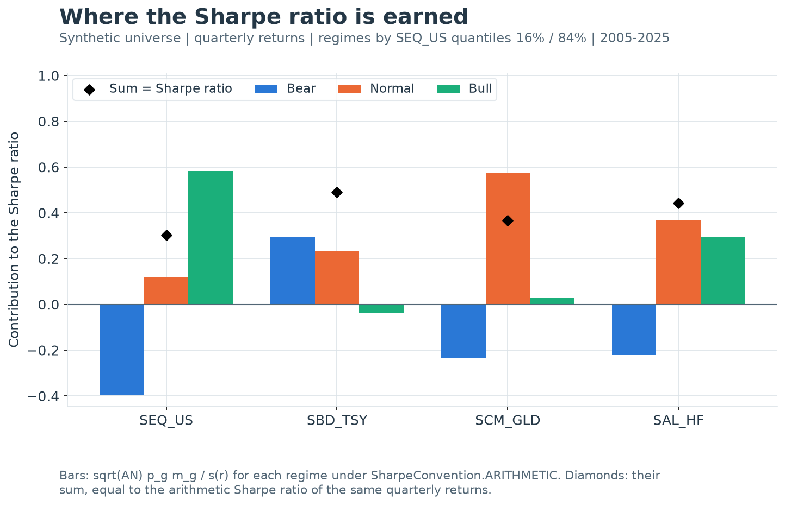

---
myst:
  html_meta:
    description: >-
      Regime-conditional performance in qis: benchmark-quantile Bear, Normal and Bull regimes,
      regime frequencies and conditional means, and the additive decomposition of Sharpe ratios
      and per-annum returns into regime contributions.
---

# Regime-conditional performance

*Author: [Artur Sepp](https://github.com/ArturSepp)*

Implemented in [qis — Quantitative Investment Strategies](https://github.com/ArturSepp/QuantInvestStrats).
Software citation: [CITATION.cff](https://github.com/ArturSepp/QuantInvestStrats/blob/main/CITATION.cff).

Regime-conditional performance partitions the periods of a sample by what a benchmark did in
each period and reports an asset's performance within each part. In qis the default partition
labels every quarter Bear, Normal or Bull by the full-sample 16% and 84% quantiles of the
benchmark's quarterly return, and the reported statistics are the regime frequencies, the
conditional mean returns, and each regime's contribution to the per-annum return and to the
Sharpe ratio. Under the arithmetic and log conventions the Sharpe contributions add up exactly
to the Sharpe ratio on the regime grid; under the default per-annum convention a residual is
allocated so that the regime returns add up to the per-annum return.

## Overview

A full-sample Sharpe ratio says how much return a strategy earned per unit of risk; it does not
say *when* the return was earned. Two strategies with the same Sharpe ratio can earn it in
opposite states of the world: one in the quarters in which equities fall, the other in quiet
quarters, giving part of it back when equities fall.
[Sepp (2019)](https://thehedgefundjournal.com/trend-following-ctas-vs-alternative-risk-premia/)
uses this distinction to separate the *crisis beta* of trend-following managers from the
*risk-premia alpha* of alternative risk premia, and the regime decomposition of this chapter is
the tool that makes the distinction measurable.

The calculation has three steps:

1. **Classify.** Resample the benchmark to a regime grid (quarter-ends by default) and label
   each period Bear, Normal or Bull by the quantile band its return falls into.
2. **Condition.** For each asset, compute the fraction of periods in each regime and the mean
   return within each regime.
3. **Decompose.** Multiply frequency by conditional mean. Divided by the full-sample standard
   deviation, these products are Sharpe ratio contributions that add up to the Sharpe ratio on
   the regime grid; compounded and patched, they are per-annum return contributions that add up
   to the per-annum return.

The chapter proves when the contributions add up exactly, what the per-annum patch allocates,
how large its residual is, how a linear benchmark exposure propagates into the regime profile,
and how noisy a regime contribution is. The classification uses full-sample quantiles and the
same-period benchmark return, so the exhibit is descriptive: it attributes realised
performance and does not forecast regimes.

## Inputs, notation, and assumptions

| Convention | This article |
|---|---|
| Return basis | Simple total returns on the regime grid (`ReturnTypes.RELATIVE`); the `LOG` convention uses $\log(1+r)$ of the same returns; no cash is deducted |
| Sampling grid | Classifier `freq`, default quarter-ends `QE`, with a stub period at each end of an off-grid history; table volatility on `PerfParams.freq_vol`, default `ME` |
| Annualisation | $\mathrm{AN}$ of the regime grid (4 for `QE`) for regime contributions: $\mathrm{AN}$ for means, $\sqrt{\mathrm{AN}}$ for Sharpe ratios; the per-annum branch divides by the table volatility annualised on `freq_vol` |
| Mean adjustment | Conditional means are raw regime averages; the Sharpe denominator $s(r)$ is the unconditional, demeaned standard deviation with `ddof=1` |
| Timing | Descriptive and full sample: quantile edges use the whole history, and period $(t-1,t]$ is labelled by the benchmark return over the same period |
| Output units | Average and P.a. columns in decimals; Sharpe contributions dimensionless and additive to a total |
| qis default | `compute_bnb_regimes_pa_perf_table(freq='QE', return_type=ReturnTypes.RELATIVE, q=None, perf_params=None)`: edges at 0.16 and 0.84, `SharpeConvention.PA` |

| Symbol or input | Meaning | Units and convention |
|---|---|---|
| $t_0<t_1<\dots<t_T$ | Dates of the regime grid | Quarter-ends plus the first and last observation dates |
| $r_{b,t}$ | Benchmark simple return over $(t-1,t]$ on the regime grid | Decimal; the classifying variable |
| $r_t$, $\ell_t$ | Asset simple and log return on the regime grid | $\ell_t=\log(1+r_t)$ |
| $q$ | Quantile probability | `q` argument, default edges at 0.16 and 0.84 |
| $\hat Q_b(q)$ | Empirical quantile of the benchmark returns | Linear interpolation, full sample |
| $g$, $G$ | Regime index and number of regimes | Bear, Normal, Bull: $G=3$ |
| $\mathcal{T}_g$, $T_g$ | Dates labelled $g$ and their number | $\sum_g T_g=T$ classified periods |
| $p_g$ | Regime frequency | $T_g/T$, shared by all assets |
| $m_g$, $m^{\ell}_g$ | Mean simple and log return of the asset in regime $g$ | Periodic, decimal |
| $\mathrm{SR}_g$, $\mathrm{SR}^{\ell}_g$ | Arithmetic and log Sharpe contribution of regime $g$ | Dimensionless |
| $x_g$ | Linear per-annum contribution $\mathrm{AN}\,p_g m_g$ | Decimal per year |
| $C_g$, $\tilde C_g$ | Compounded and patched per-annum regime return | Decimal per year |
| $\Delta$ | Per-annum residual $R_{\mathrm{pa}}-\sum_g C_g$ | Decimal per year |
| $\mathrm{SR}^{\mathrm{pa}}_g$ | Per-annum Sharpe contribution $\tilde C_g/\hat\sigma_{\mathrm{ann}}$ | Dimensionless |
| $\hat\sigma_{\mathrm{ann}}$, $v_t$ | Table volatility `PerfStat.VOL` and the returns it uses | $v_t$ log by default, on `freq_vol` with factor $\mathrm{AN}_{\mathrm{vol}}$ |
| $\bar\varepsilon_g$ | Mean OLS residual in regime $g$ | Decimal per period |
| $\sigma_g$ | Within-regime standard deviation of $r_t$ | Decimal per period |
| $\mathcal{A}$, $\theta_{\mathcal{A}}$ | Conditioning event and its variance ratio | $\theta_{\mathcal{A}}=\operatorname{Var}(r_b\mid\mathcal{A})/\operatorname{Var}(r_b)$ |
| $\Phi$, $\phi$ | Standard normal distribution and density functions | |

Inputs are a price or NAV panel with a sorted `DatetimeIndex` and one benchmark column. Regime
statistics use total returns: `PerfParams.rates_data` changes only the excess-return columns of
the attached performance table, not the regime means, frequencies or contributions. For
regime statistics in excess of cash, pass excess-return NAVs. The packaged note and the code
write the regime index as $s$; this chapter writes $g$ because $s(x)$ is the reserved sample
standard deviation.

## Methodology

### Classification

**Definition (benchmark-return quantile regimes).** Let $r_{b,1},\dots,r_{b,T}$ be the
benchmark's simple returns on the regime grid and $\hat Q_b$ their empirical quantile function
with linear interpolation. With edges $\hat Q_b(0.16)$ and $\hat Q_b(0.84)$, period $t$ is

$$
\text{Bear if } r_{b,t}\le \hat Q_b(0.16),
\qquad
\text{Normal if } \hat Q_b(0.16)<r_{b,t}\le \hat Q_b(0.84),
\qquad
\text{Bull if } r_{b,t}>\hat Q_b(0.84).
$$

This is `pd.qcut(x=r_b, q=[0.0, 0.16, 0.84, 1.0], labels=['Bear', 'Normal', 'Bull'])`:
right-closed bins with the minimum included in the lowest one. The 16% and 84% probabilities
are the one-sigma cut of a normal distribution, $\Phi(-1)=0.1587$, so the Normal band holds the
central 68%.

With $T$ distinct returns, the edges sit at positions $0.16(T-1)$ and $0.84(T-1)$ of the
sorted sample, counted from zero, so Bear holds $\lfloor 0.16(T-1)\rfloor+1$ periods and Bull
holds $T-\lfloor 0.84(T-1)\rfloor-1$. For $T=40$ quarters, $0.16\times 39=6.24$ and
$0.84\times 39=32.76$, so the counts are 7, 26 and 7, and $p_g=(0.175,\,0.65,\,0.175)$ rather
than exactly $(0.16,\,0.68,\,0.16)$. The two tails need not be equal: $T=26$ gives 5 Bear and
4 Bull periods.

The classifier resamples prices to its grid with `include_start_date=True` and
`include_end_date=True`. The grid is therefore the first observation date, every quarter-end in
between, and the last observation date. The first date has no return and stays unclassified.
A history that starts or ends between quarter-ends contributes a *stub* period at each end,
classified against full quarters and annualised as a quarter.

> **Pitfall.** The quantile edges are estimated on the whole sample, so the label of a quarter
> depends on returns that came after it. Extending the sample moves the edges and relabels past
> quarters: in the worked example, classifying 2015–2019 alone labels two of those twenty
> quarters differently from the 2015–2024 classification. The labels are a descriptive device
> for attribution. Used as a trading signal inside a backtest they are look-ahead; a
> point-in-time version would need expanding-window edges, which qis does not provide.

**Definition (sign regimes).** `qis.BenchmarkReturnsPositiveNegativeRegime` labels period $t$
Negative if $r_{b,t}<0$ and Positive if $r_{b,t}\ge 0$. It estimates nothing from the sample, so
a label does not depend on other periods; it is still contemporaneous with the returns it
conditions. Both categories are kept when one is empty, and a missing benchmark return stays
unclassified.

**Definition (volatility regimes).** `qis.BenchmarkVolsQuantilesRegime(q=4)` computes, for each
regime period, the realised volatility of the benchmark's native-frequency returns within the
period, annualised with the native grid's factor, and splits these volatilities into `q`
equal-count buckets at full-sample quantiles. The labels carry the thresholds, for example
`'SPY vol<12%'`, so they are known only after classification. The volatility is measured over
the same period whose returns are conditioned on, and the thresholds use the full sample.

A classifier whose benchmark returns cannot fill every band, such as a constant or back-padded
zero-return block, raises `ValueError` before bucketing.

### Regime frequencies and conditional means

**Definition.** For regime $g$ with dates $\mathcal{T}_g$ and $T_g=\lvert\mathcal{T}_g\rvert$,

$$
p_g=\frac{T_g}{T},
\qquad
m_g=\frac{1}{T_g}\sum_{t\in\mathcal{T}_g} r_t .
$$

The frequencies count benchmark-classified dates, so every asset in the panel shares one set of
$p_g$. The conditional means average each asset's observed returns in the regime. Both are
computed by `qis.compute_mean_freq_regimes` with a pandas `groupby` on the regime column.

### The additive Sharpe decomposition

**Definition.** The arithmetic Sharpe contribution of regime $g$ is

$$
\mathrm{SR}_g=\frac{\sqrt{\mathrm{AN}}\;p_g\,m_g}{s(r)},
$$

where $s(r)$ is the unconditional sample standard deviation of the asset's returns on the
regime grid and $\mathrm{AN}$ is the annualisation factor of that grid.

**Proposition (additivity, Sepp 2019).** If the asset is observed on every classified date and
$s(r)$ is computed on those dates, then

$$
\sum_{g}\mathrm{SR}_g=\frac{\sqrt{\mathrm{AN}}\;\bar r}{s(r)},
$$

the arithmetic Sharpe ratio of the asset's returns on the regime grid.

**Proof.** $p_g m_g=(T_g/T)(1/T_g)\sum_{t\in\mathcal{T}_g}r_t=(1/T)\sum_{t\in\mathcal{T}_g}r_t$.
The regimes partition the classified dates, so summing over $g$ gives $\bar r$: the law of
total expectation, $\mathbb{E}[r]=\sum_g \Pr(g)\,\mathbb{E}[r\mid g]$, under the empirical
measure. The denominator is common to all terms. $\square$

The decomposition splits the numerator only. The denominator is the full-sample standard
deviation, so $\mathrm{SR}_g$ is a *contribution* to the Sharpe ratio, not the Sharpe ratio
*within* regime $g$, which would be $\sqrt{\mathrm{AN}}\,m_g/\sigma_g$ and would not add up to
anything. The same argument on log returns gives the log decomposition.

**Proposition (log decomposition).** With $m^{\ell}_g$ the mean of $\ell_t=\log(1+r_t)$ in
regime $g$,

$$
\sum_g \mathrm{SR}^{\ell}_g=\sum_g\frac{\sqrt{\mathrm{AN}}\;p_g\,m^{\ell}_g}{s(\ell)}=\frac{\sqrt{\mathrm{AN}}\;\bar\ell}{s(\ell)} .
$$

**Proof.** Apply the previous proof to $\ell_t$. The labels do not change, because
$\log(1+x)$ is increasing and so preserves the benchmark's quantile bands. $\square$

The total is the Sharpe ratio *on the regime grid*. It need not equal any Sharpe column of the
attached performance table: `PerfStat.SHARPE_ARITH` is computed on `freq_vol` (month-ends by
default), `PerfStat.SHARPE_LOG_AN` divides $\log(1+R_{\mathrm{pa}})$ by the table volatility,
and `PerfStat.SHARPE_RF0` is per-annum. Quarterly and monthly estimates of the same
Sharpe ratio differ by sampling error and by any serial correlation of monthly returns; in the
worked example the benchmark's quarterly arithmetic Sharpe ratio is 0.248 and its monthly
`SHARPE_ARITH` is 0.265.

> **Insight.** A regime contribution is frequency times conditional mean. The Normal regime
> holds about two thirds of the periods, so a modest Normal mean can outweigh a large Bear or
> Bull mean. Reading the Bear bar as "performance in crises" is right; reading it as "Sharpe
> ratio in crises" is not, because it is scaled by $p_g$ and by the full-sample risk.



[Open full-resolution preview](images/handbook_regime_sharpe.png).

The exhibit classifies quarters by the 16% and 84% quantiles of synthetic US equity returns and
plots $\mathrm{SR}_g$ for four assets under `SharpeConvention.ARITHMETIC`. The diamonds are the
sums, and each equals the asset's quarterly arithmetic Sharpe ratio, as the proposition requires.
Equity earns −0.40 in Bear quarters and +0.58 in Bull quarters, for a total of 0.30. Treasuries
earn +0.29 of their 0.49 in Bear quarters: the profile of a crisis hedge. Gold and the hedge-fund
index lose in Bear quarters and earn most of their totals in Normal quarters, so their similar
totals of 0.37 and 0.44 come from different regime profiles.

### The per-annum convention

The default `SharpeConvention.PA` reports per-annum regime returns that add up to the table's
per-annum return, and divides them by the table volatility.

**Definition.** Let $R_{\mathrm{pa}}$ be the table's `PerfStat.PA_RETURN`: the compound return
$(P_{\mathrm{end}}/P_{\mathrm{start}})^{1/Y}-1$ between the asset's native first and last
observations, with $Y$ in years of 365.25 days, or the total return when $Y\le 1$. With
$x_g=\mathrm{AN}\,p_g m_g$ built from mean *simple* returns,

$$
\begin{aligned}
C_g&=e^{x_g}-1,
\qquad
\Delta=R_{\mathrm{pa}}-\sum_g C_g,\\
\tilde C_g&=C_g+p_g\,\Delta,
\qquad
\mathrm{SR}^{\mathrm{pa}}_g=\frac{\tilde C_g}{\hat\sigma_{\mathrm{ann}}},
\qquad
\hat\sigma_{\mathrm{ann}}=\sqrt{\mathrm{AN}_{\mathrm{vol}}}\;s(v).
\end{aligned}
$$

Here $v_t$ are the `PerfParams.return_type` returns (log by default) on `freq_vol`
(month-ends by default), and $\hat\sigma_{\mathrm{ann}}$ is the `PerfStat.VOL` column.

**Identity (per-annum additivity).** $\sum_g\tilde C_g=R_{\mathrm{pa}}$ and
$\sum_g\mathrm{SR}^{\mathrm{pa}}_g=R_{\mathrm{pa}}/\hat\sigma_{\mathrm{ann}}$.

**Proof.** $\sum_g\tilde C_g=\sum_g C_g+\Delta\sum_g p_g=\sum_g C_g+\Delta=R_{\mathrm{pa}}$,
because the frequencies sum to one. Divide by the common $\hat\sigma_{\mathrm{ann}}$. $\square$

The additivity holds by construction, so it carries no information; the content is in how the
residual is allocated. qis allocates $\Delta$ in proportion to $p_g$. The packaged Sharpe note
described an equal split, $\tilde C_g=C_g+\Delta/G$, which also restores the total but is not
what the code computes.

**Proposition (anatomy of the residual).** Suppose the native endpoints lie on the regime grid
and $T/Y=\mathrm{AN}$, and write $X=\sum_g x_g=\mathrm{AN}\,\bar r$. Then

$$
\Delta=\big(e^{\mathrm{AN}\,\bar\ell}-e^{X}\big)+\sum_{g<h}x_g\,x_h+O\big(\max_g\lvert x_g\rvert^3\big).
$$

**Proof.** $\log(1+R_{\mathrm{pa}})=Y^{-1}\sum_t\ell_t=\mathrm{AN}\,\bar\ell$, so
$R_{\mathrm{pa}}-(e^{X}-1)=e^{\mathrm{AN}\bar\ell}-e^{X}$. Expanding the exponentials to second
order, $(e^{X}-1)-\sum_g(e^{x_g}-1)=\tfrac12\big(X^2-\sum_g x_g^2\big)+O(\lvert x\rvert^3)
=\sum_{g<h}x_g x_h+O(\lvert x\rvert^3)$. Add the two pieces. $\square$

The first term is the volatility drag: $\ell_t\approx r_t-r_t^2/2$, so it is close to
$-e^{X}\,\mathrm{AN}\,T^{-1}\sum_t r_t^2/2$, negative and of the order of half the annualised
variance. The second is the sum of cross-products of the linear contributions; it is negative
when the product of a negative Bear and a positive Bull contribution dominates, as it does for
an equity-like benchmark. For the benchmark of the worked example,
$\Delta=-2.80\%$, of which $-1.90\%$ is drag and $-0.90\%$ cross-products.

> **Insight.** The drag accrues where squared returns are large, which is the Bear and Bull
> tails, but the $p_g$ allocation charges the residual by time spent, so the Normal regime
> absorbs 65% of it. In the log decomposition each term $\mathrm{AN}\,p_g m^{\ell}_g$ carries
> the drag of its own periods, because $\ell_t\approx r_t-r_t^2/2$ period by period, and the
> terms add up to $\mathrm{AN}\,\bar\ell=\log(1+R_{\mathrm{pa}})$. In the worked example 78% of
> the benchmark's drag accrues in the 35% of quarters labelled Bear or Bull, and its Normal
> contribution is 1.1% under the $p_g$ patch against 2.5%, in log units, under the log
> decomposition.

The per-annum Sharpe contributions add up to $R_{\mathrm{pa}}/\hat\sigma_{\mathrm{ann}}$. That
equals `PerfStat.SHARPE_RF0` only when the native endpoints lie on the `freq_vol` grid,
because `SHARPE_RF0` divides a per-annum return taken between complete `freq_vol` boundaries.

> **Pitfall.** The per-annum branch mixes grids and return bases: quarterly simple-return
> contributions on the numerator, the volatility of monthly log returns in the denominator.
> The resulting bars are neither the arithmetic nor the log decomposition, and they differ
> from both by the volatility drag. Use `SharpeConvention.ARITHMETIC` or
> `SharpeConvention.LOG` when the regime bars must be an exact decomposition of a Sharpe ratio
> computed on one series.

### Linear benchmark exposure

**Proposition (beta propagation).** Fit $r_t=\hat\alpha+\hat\beta\,r_{b,t}+\hat\varepsilon_t$
by OLS with an intercept on the classified dates, and let $\bar\varepsilon_g$ be the mean
residual in regime $g$. Then

$$
m_g=\hat\alpha+\hat\beta\,m_{b,g}+\bar\varepsilon_g,
\qquad
\sum_g p_g\,\bar\varepsilon_g=0,
\qquad
\mathrm{SR}_g=\frac{\sqrt{\mathrm{AN}}\,p_g\big(\hat\alpha+\hat\beta\,m_{b,g}+\bar\varepsilon_g\big)}{s(r)},
$$

where $m_{b,g}$ is the benchmark's own conditional mean.

**Proof.** Average the fitted identity over $\mathcal{T}_g$. With an intercept, OLS residuals
sum to zero over the sample, and $\sum_g p_g\bar\varepsilon_g=T^{-1}\sum_t\hat\varepsilon_t$.
$\square$

A regime profile therefore has three parts: alpha, spread over the regimes by time;
beta, a scaled copy of the benchmark's regime means; and $\bar\varepsilon_g$, which is zero on
average and captures what a straight line misses. A negative beta produces a positive Bear
contribution with no skill in timing. Convexity, a payoff that gains in both tails, appears as
$\bar\varepsilon_{\mathrm{Bear}}>0$ and $\bar\varepsilon_{\mathrm{Bull}}>0$ with
$\bar\varepsilon_{\mathrm{Normal}}<0$.

### Sampling error of a contribution

**Proposition.** Condition on the labels, suppose the returns in regime $g$ are independent with
variance $\sigma_g^2$, treat $s(r)$ as fixed, and let the sample span $Y=T/\mathrm{AN}$ years.
Then

$$
\operatorname{se}(\mathrm{SR}_g)=\frac{\sqrt{\mathrm{AN}}\,p_g\,\sigma_g}{\sqrt{T_g}\;s(r)}=\sqrt{\frac{p_g}{Y}}\;\frac{\sigma_g}{s(r)} .
$$

**Proof.** $\operatorname{Var}(m_g)=\sigma_g^2/T_g$, and $\mathrm{SR}_g$ is $m_g$ times the
constant $\sqrt{\mathrm{AN}}\,p_g/s(r)$. Substitute $T_g=p_gT=p_g\,\mathrm{AN}\,Y$. $\square$

For a Bear regime with $p_g=0.175$ over ten years, $\sqrt{p_g/Y}=0.13$: a Bear contribution
carries a standard error of about 0.13 times the ratio of within-regime to total volatility.
For comparison, the standard error of a full-sample Sharpe ratio is about $\sqrt{1/Y}=0.32$
over ten years under IID returns ([Lo, 2002](https://doi.org/10.2469/faj.v58.n4.2453)). The
formula ignores the randomness of the labels and of $s(r)$, so it understates the uncertainty.

## Worked example

The example builds ten years of monthly returns from a fixed seed: a benchmark with a monthly
mean of 0.7% and volatility of 4.5%, and a *hedge* that returns 0.3% a month, has a beta of
$-0.30$ to the benchmark and 1.5% of idiosyncratic volatility. The classifier resamples the
month-end prices to 41 quarter-end dates, 2014-12-31 to 2024-12-31, and so 40 quarterly
returns. These are synthetic inputs, not market data.

The first block checks the classification. The 40 quarters split 7, 26 and 7, so
$p_g=(0.175,\,0.65,\,0.175)$. The benchmark's conditional quarterly means are −12.62%, 1.11%
and 15.38%; the hedge's are 4.75%, 1.41% and −3.62%. The block recomputes the quarterly
returns by compounding three monthly returns with numpy and the frequencies and means with a
direct `pd.qcut` and `groupby`.

```python
import numpy as np
import pandas as pd
import qis

rng = np.random.default_rng(20260725)
n_months = 120
bench = 0.007 + 0.045 * rng.standard_normal(n_months)
hedge = 0.003 - 0.30 * bench + 0.015 * rng.standard_normal(n_months)
monthly = np.column_stack([bench, hedge])
dates = pd.date_range('2014-12-31', periods=n_months + 1, freq='ME')
growth = np.vstack([np.ones((1, 2)), np.cumprod(1.0 + monthly, axis=0)])
prices = pd.DataFrame(100.0 * growth, index=dates, columns=['Benchmark', 'Hedge'])

classifier = qis.BenchmarkReturnsQuantilesRegime()  # freq='QE', edges at 0.16 and 0.84
sampled = classifier.compute_sampled_returns_with_regime_id(prices=prices, benchmark='Benchmark')

# independent quarterly returns: compound three monthly returns
quarterly = (1.0 + monthly).reshape(40, 3, 2).prod(axis=1) - 1.0
np.testing.assert_allclose(sampled[['Benchmark', 'Hedge']].iloc[1:], quarterly, atol=1e-14)
assert pd.isna(sampled['regime'].iloc[0])  # the first grid date has no return

# p_g and m_g from qis against a direct qcut and groupby
means, freqs = qis.compute_mean_freq_regimes(sampled)
q_returns = pd.DataFrame(quarterly, index=sampled.index[1:], columns=['Benchmark', 'Hedge'])
labels = pd.qcut(q_returns['Benchmark'], q=[0.0, 0.16, 0.84, 1.0],
                 labels=['Bear', 'Normal', 'Bull'])
direct_freqs = labels.value_counts(normalize=True).reindex(['Bear', 'Normal', 'Bull'])
np.testing.assert_allclose(freqs, direct_freqs, atol=1e-15)
np.testing.assert_allclose(freqs, [7 / 40, 26 / 40, 7 / 40], atol=1e-15)
np.testing.assert_allclose(means, q_returns.groupby(labels, observed=False).mean(), atol=1e-15)
np.testing.assert_allclose(means['Benchmark'], [-0.1262, 0.0111, 0.1538], atol=5e-5)
np.testing.assert_allclose(means['Hedge'], [0.0475, 0.0141, -0.0362], atol=5e-5)
```

Under `SharpeConvention.ARITHMETIC` the regime table's Sharpe contributions of the hedge are
0.430 (Bear), 0.472 (Normal) and −0.327 (Bull). They add up to 0.575, the arithmetic Sharpe
ratio $2\,\bar r/s(r)$ of the 40 quarterly returns; the benchmark's add up to 0.248. The
table's `SHARPE_ARITH` column, computed on month-end returns, is 0.588 for the hedge and 0.265
for the benchmark: a different number, on a different grid. The log decomposition adds up to
the quarterly log Sharpe ratios, 0.156 and 0.542.

```python
arith = qis.PerfParams(sharpe_convention=qis.SharpeConvention.ARITHMETIC)
table, regime_datas = classifier.compute_regimes_pa_perf_table(
    prices=prices, benchmark='Benchmark', perf_params=arith)
sharpe = regime_datas[qis.RegimeData.REGIME_SHARPE]

q_std = quarterly.std(axis=0, ddof=1)
sr_quarterly = np.sqrt(4.0) * quarterly.mean(axis=0) / q_std
np.testing.assert_allclose(sharpe.sum(axis=1), sr_quarterly, atol=1e-14)
np.testing.assert_allclose(sharpe, 2.0 * means.T.to_numpy() * freqs.to_numpy() / q_std[:, None],
                           atol=1e-14)
np.testing.assert_allclose(sr_quarterly, [0.2475, 0.5745], atol=5e-5)
np.testing.assert_allclose(sharpe.loc['Hedge'], [0.4297, 0.4719, -0.3271], atol=5e-5)
np.testing.assert_allclose(sharpe.loc['Benchmark'], [-0.4533, 0.1482, 0.5527], atol=5e-5)

# the table's SHARPE_ARITH is estimated on freq_vol='ME', not on the regime grid
sr_monthly = np.sqrt(12.0) * monthly.mean(axis=0) / monthly.std(axis=0, ddof=1)
np.testing.assert_allclose(table[qis.PerfStat.SHARPE_ARITH.to_str()], sr_monthly, atol=1e-14)
np.testing.assert_allclose(sr_monthly, [0.2655, 0.5882], atol=5e-5)

# the returns-level counterpart (internal helper) reproduces the table branch
from qis.perfstats.regime_classifier import compute_regime_sharpe_decomposition
standalone = compute_regime_sharpe_decomposition(returns=q_returns,
                                                 benchmark_returns=q_returns['Benchmark'], af=4.0)
np.testing.assert_allclose(standalone[sharpe.columns], sharpe, atol=1e-14)

# LOG: the same identity on log(1 + r)
log_params = qis.PerfParams(sharpe_convention=qis.SharpeConvention.LOG)
_, log_datas = classifier.compute_regimes_pa_perf_table(
    prices=prices, benchmark='Benchmark', perf_params=log_params)
log_q = np.log1p(quarterly)
sr_log = 2.0 * log_q.mean(axis=0) / log_q.std(axis=0, ddof=1)
np.testing.assert_allclose(log_datas[qis.RegimeData.REGIME_SHARPE].sum(axis=1), sr_log,
                           atol=1e-14)
np.testing.assert_allclose(sr_log, [0.1565, 0.5420], atol=5e-5)
```

The hedge's regime profile is almost entirely linear. The quarterly OLS gives
$\hat\alpha=1.44\%$ a quarter and $\hat\beta=-0.276$, the table's `Beta` column. The Bear mean of
4.75% is $1.44\%$ of alpha plus $3.48\%$ of beta times the benchmark's −12.62%, less a residual
of 0.17%. Conditional on the labels, the standard errors of the three contributions are 0.117,
0.201 and 0.076: the Bear contribution of 0.43 is large relative to its error, the Normal one
of 0.47 much less so.

```python
beta, alpha = np.polyfit(quarterly[:, 0], quarterly[:, 1], deg=1)
np.testing.assert_allclose(beta, table.loc['Hedge', qis.PerfStat.BETA.to_str()], atol=1e-12)
residual_means = means['Hedge'] - (alpha + beta * means['Benchmark'])
np.testing.assert_allclose([alpha, beta], [0.0144, -0.2758], atol=5e-5)
np.testing.assert_allclose(residual_means, [-0.0017, 0.0027, -0.0082], atol=5e-5)
np.testing.assert_allclose((freqs * residual_means).sum(), 0.0, atol=1e-15)

# conditional standard errors of the contributions: sqrt(AN) p_g sigma_g / (sqrt(T_g) s(r))
within_std = q_returns['Hedge'].groupby(labels, observed=False).std()
se = 2.0 * freqs * within_std / (np.sqrt(40 * freqs) * q_returns['Hedge'].std())
np.testing.assert_allclose(se, np.sqrt(freqs / 10.0) * within_std / q_returns['Hedge'].std())
np.testing.assert_allclose(se, [0.1168, 0.2011, 0.0759], atol=5e-5)
```

Under the default per-annum convention the benchmark's per-annum return is 3.04%. The
compounded regime returns $C_g$ are −8.45%, 2.93% and 11.37%, which add up to 5.84%, so
$\Delta=-2.80\%$: −1.90% of volatility drag and −0.90% of cross-products. Allocated by $p_g$,
the patched regime returns are −8.94%, 1.11% and 10.88%; an equal split would give −9.39%,
2.00% and 10.43%. Divided by the monthly log-return volatility of 16.40%, they give per-annum
Sharpe contributions of −0.545, 0.068 and 0.663, which add up to `SHARPE_RF0`, 0.186, because
the history starts and ends on month-ends. The log decomposition of the per-annum return,
in log units, is −9.45%, 2.49% and 9.96%. The block also checks that the classifier honours
`additive_pa_returns_to_pa_total=False`, which returns the unpatched $C_g$, and that
`PerfStat.BEAR_AVG` and its analogues select the table's average columns.

```python
pa_table, pa_datas = classifier.compute_regimes_pa_perf_table(
    prices=prices, benchmark='Benchmark', perf_params=qis.PerfParams())  # SharpeConvention.PA
years = (dates[-1] - dates[0]).days / 365.25
r_pa = ((prices.iloc[-1] / prices.iloc[0]) ** (1.0 / years) - 1.0).to_numpy()
np.testing.assert_allclose(pa_table[qis.PerfStat.PA_RETURN.to_str()], r_pa, atol=1e-14)

x = 4.0 * means.T.to_numpy() * freqs.to_numpy()  # rows: assets, columns: regimes
c_g = np.expm1(x)
delta = r_pa - c_g.sum(axis=1)
patched = c_g + delta[:, None] * freqs.to_numpy()
np.testing.assert_allclose(pa_datas[qis.RegimeData.REGIME_PA], patched, atol=1e-14)
np.testing.assert_allclose(pa_datas[qis.RegimeData.REGIME_PA].sum(axis=1), r_pa, atol=1e-14)
np.testing.assert_allclose(c_g[0], [-0.0845, 0.0293, 0.1137], atol=5e-5)
np.testing.assert_allclose(patched[0], [-0.0894, 0.0111, 0.1088], atol=5e-5)
np.testing.assert_allclose(c_g[0] + delta[0] / 3.0, [-0.0939, 0.0200, 0.1043], atol=5e-5)
# the classifier passes the patch switch on: False returns the unpatched C_g
_, raw_datas = classifier.compute_regimes_pa_perf_table(
    prices=prices, benchmark='Benchmark', perf_params=qis.PerfParams(),
    additive_pa_returns_to_pa_total=False)
np.testing.assert_allclose(raw_datas[qis.RegimeData.REGIME_PA], c_g, atol=1e-14)
# the regime members select the table's columns
averages = pa_table[[stat.to_str() for stat in (qis.PerfStat.BEAR_AVG, qis.PerfStat.NORMAL_AVG,
                                                 qis.PerfStat.BULL_AVG)]]
np.testing.assert_allclose(averages, means.T, atol=1e-15)

# anatomy of the residual: volatility drag plus cross-products of the contributions
drag = r_pa - np.expm1(x.sum(axis=1))
cross = (x.sum(axis=1) ** 2 - (x ** 2).sum(axis=1)) / 2.0
np.testing.assert_allclose([delta[0], drag[0], cross[0]], [-0.0280, -0.0190, -0.0090], atol=5e-5)
np.testing.assert_allclose(delta, drag + cross, atol=2e-4)

# per-annum Sharpe contributions divide by the monthly log-return volatility
vol = np.sqrt(12.0) * np.log1p(monthly).std(axis=0, ddof=1)
np.testing.assert_allclose(pa_table[qis.PerfStat.VOL.to_str()], vol, atol=1e-14)
pa_sharpe = pa_datas[qis.RegimeData.REGIME_SHARPE]
np.testing.assert_allclose(pa_sharpe, patched / vol[:, None], atol=1e-14)
np.testing.assert_allclose(pa_sharpe.sum(axis=1), pa_table[qis.PerfStat.SHARPE_RF0.to_str()],
                           atol=1e-14)
np.testing.assert_allclose(pa_sharpe.loc['Benchmark'], [-0.5453, 0.0676, 0.6633], atol=5e-5)

# the log decomposition allocates the drag where it accrues
log_means_b = pd.Series(log_q[:, 0], index=q_returns.index).groupby(labels, observed=False).mean()
log_contrib = 4.0 * freqs * log_means_b
np.testing.assert_allclose(log_contrib, [-0.0945, 0.0249, 0.0996], atol=5e-5)
np.testing.assert_allclose(log_contrib.sum(), np.log1p(r_pa[0]), atol=1e-4)
log_drag = log_contrib.to_numpy() - x[0]  # AN p_g (m_g^log - m_g)
np.testing.assert_allclose((log_drag[0] + log_drag[2]) / log_drag.sum(), 0.78, atol=5e-3)
```

The last block shows the two sampling caveats and checks the conditioning bias of the
interpretation section. Classifying the first five years alone relabels two of those twenty
quarters (2016-06-30 and 2018-12-31, Bull on the short sample and Normal on the full one). A
history cut to 2015-02-15 to 2024-11-15 starts and ends with one-month stubs; the first stub,
March 2015 alone, returns −8.74% and is classified Bear against full quarters. Finally, a
million draws of a bivariate normal with correlation 0.5 give a correlation of about 0.25 in the
Bear band and 0.30 in the Normal band, as the conditioning-bias proposition predicts.

```python
first_half = classifier.compute_sampled_returns_with_regime_id(
    prices=prices.loc[:'2019-12-31'], benchmark='Benchmark')
short_labels = first_half['regime'].iloc[1:].astype(str)
full_labels = sampled['regime'].loc[short_labels.index].astype(str)
relabelled = short_labels.index[short_labels != full_labels]
assert list(relabelled) == [pd.Timestamp('2016-06-30'), pd.Timestamp('2018-12-31')]

stubbed = classifier.compute_sampled_returns_with_regime_id(
    prices=prices.loc['2015-02-15':'2024-11-15'], benchmark='Benchmark')
assert stubbed.index[0] == pd.Timestamp('2015-02-28')
assert stubbed.index[-1] == pd.Timestamp('2024-10-31')
np.testing.assert_allclose(stubbed['Benchmark'].iloc[1], monthly[2, 0], atol=1e-14)
np.testing.assert_allclose(monthly[2, 0], -0.0874, atol=5e-5)
assert stubbed['regime'].iloc[1] == 'Bear'

# conditioning bias: constant correlation 0.5, measured within the return bands
from scipy.stats import norm, truncnorm
draws = np.random.default_rng(1999).standard_normal((1_000_000, 2))
x_b, x_a = draws[:, 0], 0.5 * draws[:, 0] + np.sqrt(0.75) * draws[:, 1]
lower, upper = np.quantile(x_b, [0.16, 0.84])
bear, normal = x_b <= lower, (x_b > lower) & (x_b <= upper)
cut = norm.ppf(0.16)
theta = np.array([truncnorm(-np.inf, cut).var(), truncnorm(cut, -cut).var()])
predicted = 0.5 / np.sqrt(0.25 + 0.75 / theta)
np.testing.assert_allclose(theta, [0.20, 0.29], atol=5e-3)
np.testing.assert_allclose(predicted, [0.25, 0.30], atol=5e-3)
simulated = [np.corrcoef(x_b[mask], x_a[mask])[0, 1] for mask in (bear, normal)]
np.testing.assert_allclose(simulated, predicted, atol=0.01)
```

## Implementation in qis

| Quantity | Formula | qis entry point |
|---|---|---|
| Return-quantile regimes | Bear, Normal, Bull at $\hat Q_b(0.16)$, $\hat Q_b(0.84)$ | `qis.BenchmarkReturnsQuantilesRegime(freq='QE', q=None)`, method `compute_sampled_returns_with_regime_id` |
| Sign regimes | Negative if $r_{b,t}<0$, else Positive | `qis.BenchmarkReturnsPositiveNegativeRegime(freq='QE')` |
| Volatility regimes | `q` equal-count buckets of within-period realised volatility | `qis.BenchmarkVolsQuantilesRegime(freq='QE', q=4)` |
| Frequencies and means | $p_g=T_g/T$, $m_g$ | `qis.compute_mean_freq_regimes` |
| Regime averages and contributions | $m_g$; $C_g=e^{x_g}-1$, or $x_g$ with `is_report_pa_returns=False` | `qis.compute_regime_avg(freq=...)` |
| Patched per-annum returns | $\tilde C_g=C_g+p_g\Delta$ | `additive_pa_returns_to_pa_total=True` (default) in the classifiers' `compute_regimes_pa_perf_table` and in `qis.compute_regimes_pa_perf_table_from_sampled_returns` |
| Benchmark display row | $m_g$ in place of $\tilde C_g$ for the benchmark, display only | `is_use_benchmark_means=True` in `qis.compute_regimes_pa_perf_table_from_sampled_returns` |
| Arithmetic and log contributions | $\mathrm{SR}_g$, $\mathrm{SR}^{\ell}_g$ | `PerfParams(sharpe_convention=SharpeConvention.ARITHMETIC)` or `LOG` |
| Per-annum contributions | $\mathrm{SR}^{\mathrm{pa}}_g=\tilde C_g/\hat\sigma_{\mathrm{ann}}$ | `PerfParams()`, `SharpeConvention.PA` |
| Regime table | all of the above plus the risk-adjusted table | `qis.RegimeClassifier.compute_regimes_pa_perf_table`, `qis.compute_bnb_regimes_pa_perf_table` |
| Returns-level contributions | $\mathrm{SR}_g$, $\mathrm{SR}^{\ell}_g$ and their total | internal `qis.perfstats.regime_classifier.compute_regime_sharpe_decomposition(returns, benchmark_returns, af)` |
| Panels | $m_g$; $\tilde C_g$; $\mathrm{SR}_g$ in the selected convention | `qis.RegimeData.REGIME_AVG`, `REGIME_PA`, `REGIME_SHARPE` |
| Table columns | $m_g$, $\tilde C_g$, $\mathrm{SR}_g$ | `PerfStat.BEAR_AVG` (`'Bear Average'`), `PerfStat.BEAR_PA`, `PerfStat.BEAR_SHARPE`, and the Normal and Bull analogues; `qis.SD_PERF_COLUMNS` carries the three Sharpe columns |
| Exhibits | stacked regime bars; boxplots; shading | `qis.plot_regime_data`, `qis.plot_regime_boxplot`, `qis.add_bnb_regime_shadows` |

The classification and tables are in
[regime_classifier.py](https://github.com/ArturSepp/QuantInvestStrats/blob/main/src/qis/perfstats/regime_classifier.py),
the exhibits in
[regime_data.py](https://github.com/ArturSepp/QuantInvestStrats/blob/main/src/qis/plots/derived/regime_data.py),
and `RegimeData`, `SharpeConvention`, `PerfParams` and the regime `PerfStat` members in
[config.py](https://github.com/ArturSepp/QuantInvestStrats/blob/main/src/qis/perfstats/config.py).
API pages: {doc}`regime table <api/generated/qis.compute_bnb_regimes_pa_perf_table>`,
{doc}`quantile classifier <api/generated/qis.BenchmarkReturnsQuantilesRegime>` and
{doc}`regime exhibit <api/generated/qis.plot_regime_data>`.

Implementation contracts that affect the numbers:

- **Call path.** `compute_bnb_regimes_pa_perf_table` builds a `BenchmarkReturnsQuantilesRegime`
  from `freq`, `return_type` and `q`, unless a `regime_classifier` keyword supplies one, and
  returns only the table. The classifier's `compute_regimes_pa_perf_table` classifies, then
  calls `compute_regimes_pa_perf_table_from_sampled_returns` and returns the table together with
  a dictionary keyed by `RegimeData.REGIME_AVG`, `REGIME_PA` and `REGIME_SHARPE`.
- **Frequency and convention.** $\mathrm{AN}$ is `get_annualization_factor(freq)` of the
  classifier's `freq`. The Sharpe convention is `perf_params.sharpe_convention`;
  `perf_params=None` means `SharpeConvention.PA`, and the attached table then infers its
  frequency from the price index.
- **Options on the classifier path.** The classifiers' `compute_regimes_pa_perf_table` accept
  `additive_pa_returns_to_pa_total` (default True) and pass it on, so
  `additive_pa_returns_to_pa_total=False` reports the unpatched $C_g$. The base
  `RegimeClassifier.compute_regimes_pa_perf_table` also passes its remaining keywords on, among
  them `is_report_pa_returns=False` for the linear contributions $x_g$. The classifiers' own
  methods fix `is_use_benchmark_means=False`; that option is set on
  `compute_regimes_pa_perf_table_from_sampled_returns` called directly. Earlier versions
  accepted `additive_pa_returns_to_pa_total` on the classifier path but did not forward it.
- **`is_use_benchmark_means=True`** replaces the benchmark row of the P.a. columns by its
  periodic conditional means $m_g$, a display choice. The regime Sharpe values are computed
  before the substitution, so the benchmark's per-annum Sharpe contributions stay
  $\tilde C_g/\hat\sigma_{\mathrm{ann}}$. Earlier versions divided the displayed periodic means
  by the annualised volatility.
- **Missing values.** $p_g$ counts benchmark-classified dates, $m_g$ averages the asset's
  observed returns and $s(r)$ uses all of them, so the table's contributions add up exactly only
  when the asset is observed on the classified dates and on no others. The internal
  returns-level function computes every moment per asset over the dates where both the asset
  and the benchmark are observed, and is exact for any gap pattern. An empty regime has no
  mean: the table and the internal function both report a missing contribution, and the plot's
  totals and the function's total skip it, since an empty regime contributes nothing to the
  mean.
- **Return type.** The classifier's `return_type` sets the returns behind $m_g$ and $C_g$. With
  the default `ReturnTypes.RELATIVE` they are simple returns: the `ARITHMETIC` branch uses them
  and the `LOG` branch takes $\log(1+r)$. With `ReturnTypes.LOG` they are log returns: the `LOG`
  branch uses them as they are and the `ARITHMETIC` branch converts them with $e^{\ell}-1$, so
  each convention decomposes its own Sharpe ratio whatever the classifier's basis.
- **Column labels.** The average columns are labelled `'Bear Average'`, `'Normal Average'` and
  `'Bull Average'`, the labels of the `PerfStat.BEAR_AVG` family; the P.a. and Sharpe columns
  match `PerfStat.BEAR_PA` and `PerfStat.BEAR_SHARPE`. Every regime member therefore selects a
  column, for example in `qis.plot_ra_perf_scatter`. The labels do not carry the Sharpe
  convention; state it with the table.
- **Exhibits.** `plot_regime_data` passes `prices`, `benchmark` and `perf_params` through to
  the classifier and stacks the chosen `RegimeData` panel; the bar totals are the row sums.
  `add_bnb_regime_shadows` shades each grid interval $(t-1,t]$ in the colour of the regime of
  the period ending at $t$, which matches the return timing.

## Interpretation and limitations

### Crisis beta and risk-premia alpha

[Sepp (2019)](https://thehedgefundjournal.com/trend-following-ctas-vs-alternative-risk-premia/)
reads the regime profile as a classification of strategies. A strategy whose Bear contribution
is positive earns part of its Sharpe ratio when the benchmark falls: crisis beta, the profile
of trend-following managers. A strategy that earns its Sharpe ratio in the Normal regime and
loses in the Bear regime is paid a premium for bearing crisis risk: risk-premia alpha, the
profile of many alternative risk premia. An equity-like benchmark has a negative Bear, a small
Normal and a large Bull contribution, as in the worked example.

The beta-propagation proposition sharpens the reading. A positive Bear contribution can come
from a negative beta, which a short benchmark position delivers at the cost of a negative Bull
contribution, or from convexity, $\bar\varepsilon_{\mathrm{Bear}}>0$ together with
$\bar\varepsilon_{\mathrm{Bull}}>0$, which pays in the Bear regime without giving up the Bull
regime. The hedge
of the worked example is the first kind: its regime means are the line
$\hat\alpha+\hat\beta\,m_{b,g}$ to within 0.9% a quarter.

### Conditional correlations and the conditioning bias

The chapter's statistics are conditional *means*. Conditional *correlations* and betas
estimated within a regime behave differently, because selecting periods by the value of one
variable changes that variable's variance.

**Proposition (conditioning bias).** Let $(r_b,r)$ be bivariate normal with correlation $\rho$,
and let $\mathcal{A}$ be an event defined by $r_b$ alone, with variance ratio
$\theta_{\mathcal{A}}=\operatorname{Var}(r_b\mid\mathcal{A})/\operatorname{Var}(r_b)$. Then

$$
\rho_{\mathcal{A}}=\frac{\rho}{\sqrt{\rho^2+(1-\rho^2)/\theta_{\mathcal{A}}}} ,
$$

so $\lvert\rho_{\mathcal{A}}\rvert<\lvert\rho\rvert$ when $\theta_{\mathcal{A}}<1$ and
$\lvert\rho_{\mathcal{A}}\rvert>\lvert\rho\rvert$ when $\theta_{\mathcal{A}}>1$.

**Proof.** Standardise both returns and write $r=\rho r_b+\sqrt{1-\rho^2}\,u$ with $u$ standard
normal and independent of $r_b$, so conditioning on $\mathcal{A}$ leaves $u$ unchanged. Then
$\operatorname{Cov}(r_b,r\mid\mathcal{A})=\rho\,\theta_{\mathcal{A}}$ and
$\operatorname{Var}(r\mid\mathcal{A})=\rho^2\theta_{\mathcal{A}}+1-\rho^2$. Divide the
covariance by the square root of the product of the variances. $\square$

This is the pitfall of [Boyer, Gibson and Loretan (1999)](https://www.federalreserve.gov/pubs/ifdp/1997/597/ifdp597.pdf):
a constant-correlation model produces "correlation breakdowns" in subsamples selected by the
size of one return. Truncating a standard normal below $\Phi^{-1}(0.16)=-0.994$ leaves a
variance ratio of about 0.20, and the central band about 0.29. With $\rho=0.5$ the
within-regime correlations are about 0.25 in the Bear band and 0.30 in the Normal band,
although nothing has changed. Conditioning on large absolute returns, $\theta_{\mathcal{A}}>1$,
inflates correlation instead. [Longin and Solnik (2001)](https://doi.org/10.1111/0022-1082.00340)
account for the bias by comparing exceedance correlations, the correlations of returns that
jointly exceed a threshold, with their values under normality, and model the tails with extreme
value theory. Under normality the exceedance correlation goes to zero as the threshold moves
into the tails; they find that it does not for large negative returns, and that equity-market
correlation rises in bear markets but not in bull markets.

> **Insight.** Conditional means do not suffer the variance-truncation bias. Under the model of
> the proposition, $\mathbb{E}[r\mid\mathcal{A}]-\mathbb{E}[r]=\beta\,\big(\mathbb{E}[r_b\mid\mathcal{A}]-\mathbb{E}[r_b]\big)$
> for every $\mathcal{A}$, with the full-sample $\beta$. This is why a mean-based regime profile is
> interpretable with a constant beta while a within-regime beta or correlation needs the
> correction above before it can be read as a change in dependence.

### Model-based regimes

The qis regimes are labels on observed benchmark returns, not a model. A regime-switching
model instead treats the regime as a latent Markov state with its own means, volatilities and
correlations, estimated by maximum likelihood with the filter described in Hamilton (1994).
[Ang and Bekaert (2002)](https://doi.org/10.1093/rfs/15.4.1137) use such a model for
international asset allocation; they find a high-volatility, high-correlation bear regime in
which international diversification still pays. A
model gives state probabilities, persistence and transition probabilities that labels cannot;
its *filtered* probabilities use only past data and can drive a backtest, while its
*smoothed* probabilities use the full sample, like the qis labels. qis does not implement
regime-switching estimation.

### Limitations

- **Look-ahead.** Full-sample edges and contemporaneous labels make every regime statistic
  descriptive. Do not feed the labels, or statistics conditioned on them, into a backtest.
- **Few observations in the tails.** Ten years of quarters leave seven Bear and seven Bull
  observations. The conditional standard error is about $\sqrt{p_g/Y}$ times the ratio of
  within-regime to total volatility, before accounting for label uncertainty.
- **Stubs.** An off-grid history adds a short first and last period, classified against full
  quarters and annualised as quarters. Trim prices to quarter-ends for a clean quarterly
  sample.
- **Conventions differ.** Arithmetic, log and per-annum regime bars are three different numbers
  on the same data. In the worked example the benchmark totals are 0.248, 0.156 and 0.186. State
  the convention with the exhibit: `plot_regime_data`'s default title, *Conditional Sharpe
  ratio*, does not name it. No convention deducts cash.
- **Benchmark dependence.** The regime is a property of the benchmark, and a different
  benchmark gives a different partition. A benchmark back-padded with constant prices adds zero
  returns that crowd the Normal band, and raises `ValueError` if they collapse a quantile edge;
  clip the panel to the benchmark's live window first.

## See also

- [Sharpe ratios: conventions and inference](performance_analytics_and_sharpe.md)
- [The performance-statistic catalogue: every PerfStat column](performance_statistics.md)
- [Alpha, beta and benchmark-relative performance](benchmark_relative_performance.md)
- [Covariance, correlation and principal components](covariance_correlation_pca.md)
- [Notation and conventions](notation_and_conventions.md)
- [Reporting frequency and annualisation](frequency_convention_note.md)
- [Factsheets and reporting](factsheets_and_reporting.md)
- [Bibliography](bibliography.md)

## References

1. Sepp, A. (2019). Trend-Following CTAs vs Alternative Risk-Premia: Crisis Beta vs Risk-Premia Alpha. *The Hedge Fund Journal*. [Article](https://thehedgefundjournal.com/trend-following-ctas-vs-alternative-risk-premia/). Uses the Bear, Normal and Bull decomposition of Sharpe ratios to separate crisis beta from risk-premia alpha.
2. Sharpe, W. F. (1994). The Sharpe Ratio. *The Journal of Portfolio Management*, 21(1), 49–58. [Author's copy](https://web.stanford.edu/~wfsharpe/art/sr/SR.htm). The arithmetic Sharpe ratio of periodic returns that the additive decomposition splits.
3. Lo, A. W. (2002). The Statistics of Sharpe Ratios. *Financial Analysts Journal*, 58(4), 36–52. [DOI: 10.2469/faj.v58.n4.2453](https://doi.org/10.2469/faj.v58.n4.2453). The sampling error of a full-sample Sharpe ratio used as the comparison for regime contributions.
4. Boyer, B. H., Gibson, M. S., and Loretan, M. (1999). Pitfalls in tests for changes in correlations. Federal Reserve Board, International Finance Discussion Papers 597. [PDF](https://www.federalreserve.gov/pubs/ifdp/1997/597/ifdp597.pdf). The conditioning bias of correlations estimated in subsamples.
5. Longin, F., and Solnik, B. (2001). Extreme Correlation of International Equity Markets. *The Journal of Finance*, 56(2), 649–676. [DOI: 10.1111/0022-1082.00340](https://doi.org/10.1111/0022-1082.00340). Exceedance correlations and the asymmetry between bear and bull markets.
6. Ang, A., and Bekaert, G. (2002). International Asset Allocation with Regime Shifts. *The Review of Financial Studies*, 15(4), 1137–1187. [DOI: 10.1093/rfs/15.4.1137](https://doi.org/10.1093/rfs/15.4.1137). The regime-switching alternative to descriptive labels.
7. Hamilton, J. D. (1994). *Time Series Analysis*. Princeton University Press. The filter and smoother of Markov-switching models.
8. Sepp, A. qis: Performance analytics, portfolio backtesting, risk analysis, and factsheet reporting in Python. [Software citation metadata](https://github.com/ArturSepp/QuantInvestStrats/blob/main/CITATION.cff).
