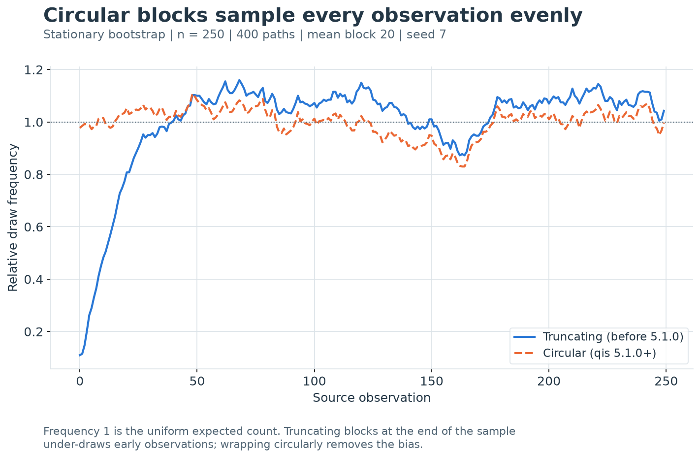

---
myst:
  html_meta:
    description: >-
      Resampling with replacement in qis: the iid, stationary and circular fixed-block bootstraps,
      row-wise and paired panel draws, price paths from resampled returns, the AR(1) residual
      bootstrap, block-length choice, and the seeds and conventions that make a resampled result
      reproducible.
---

# Resampling and the bootstrap

*Author: [Artur Sepp](https://github.com/ArturSepp) / First recorded: [2026-07-26](https://github.com/ArturSepp/QuantInvestStrats/commit/3633b53d0dd486077aff96f2ca752d23efebb4fe)*

Implemented in [qis — Quantitative Investment Strategies](https://github.com/ArturSepp/QuantInvestStrats).
Software citation: [CITATION.cff](https://github.com/ArturSepp/QuantInvestStrats/blob/main/CITATION.cff).

The bootstrap estimates the sampling distribution of a statistic by recomputing it on samples
drawn with replacement from the observed data. For serially dependent returns the draws are
blocks of consecutive rows, and for a multi-asset panel they are whole rows, so that the
dependence a statistic relies on survives the resample. This chapter derives the schemes qis
implements, states exactly what each function computes, and uses a fixed experiment to show that
a resampled number is reproducible only when its sampling convention is recorded.

## Overview

qis separates drawing indices from applying them. `qis.generate_bootstrapped_indices` returns
an integer array of source-row positions and touches no data; `qis.bootstrap_data`,
`qis.bootstrap_price_data`, `qis.bootstrap_ar_process` and
`qis.bootstrap_price_fundamental_data` map such an array onto data. `qis.BootstrapType` selects
one of three schemes: independent draws of single rows (`IID`), the stationary bootstrap of
[Politis and Romano (1994)](https://doi.org/10.1080/01621459.1994.10476870) with blocks of
geometric length (`STATIONARY`), and circular blocks of fixed length (`FIXED_BLOCK`), a circular
variant of the moving block bootstrap of [Künsch (1989)](https://doi.org/10.1214/aos/1176347265).

The chapter answers five questions:

1. **What does the bootstrap approximate?** The law of an estimator around its target, by the
   law of the recomputed estimator around the sample value
   ([Efron, 1979](https://doi.org/10.1214/aos/1176344552)). Resampling single rows destroys
   serial dependence, and the error is quantified below.
2. **What does each block scheme preserve?** Every scheme draws each source row with the same
   marginal probability; the schemes differ in how much lagged dependence they keep.
3. **How are panels, price paths and autoregressive series resampled?** Whole rows, returns
   recompounded from an anchor price, and resampled residuals of a fitted AR(1).
4. **How long should a block be?** qis has no automatic rule; the reference method is
   [Politis and White (2004)](https://doi.org/10.1081/ETC-120028836).
5. **What must be recorded?** The scheme, its block settings, the seed, and the qis version. The
   circular wrap of `STATIONARY` changed in qis 5.1.0; see the
   [change history](https://github.com/ArturSepp/QuantInvestStrats/blob/main/CHANGELOG.md).

The worked example closes with a case study of that change. It preserves the earlier teaching
implementation exactly, including its loop termination rule, and measures the difference between
the two implementations, rather than isolating a single code change while holding every other
detail constant. qis only resamples: statistics, standard errors and confidence intervals
computed on the draws are the caller's.

## Inputs, notation, and assumptions

| Convention | This article |
|---|---|
| Return basis | Rows are resampled as given; `bootstrap_price_data` resamples simple returns by default (`is_log_returns=False`) and recompounds them; the case study uses synthetic arithmetic returns |
| Sampling grid | Row positions of the input: the samplers ignore dates, `block_size` counts rows, and a resampled path carries positions $0,\ldots,K-1$ rather than a calendar |
| Annualisation | None inside the samplers; a statistic computed on the draws uses the $\mathrm{AN}$ of the input grid; the case study uses linear $\mathrm{AN}=260$ as a teaching convention |
| Mean adjustment | None: rows are drawn as observed and never recentred; AR(1) residuals have zero sample mean by construction |
| Timing | Full sample, not point in time: any draw may use any row of the input; each resampled row keeps its own contemporaneous cross-section |
| Output units | Units of the input; indices are zero-based integers; price paths are levels starting at an anchor price |
| qis default | `generate_bootstrapped_indices`: `BootstrapType.IID`, `num_samples=10`, `index_length=1000`, `block_size=30`, `min_block_size=1`, `seed=1`; the `bootstrap_*` functions: `BootstrapType.STATIONARY`, `BootstrapOutput.DF_TO_LIST_ARRAYS`, `bootstrap_price_data` with `block_size=20`, `init_to_end=True`; `bootstrap_ar_process` with `is_positive=True` |

| Symbol or input | Meaning | Units and convention |
|---|---|---|
| $n$ | Number of source rows the sampler draws from (`num_data_index`) | Rows; 250 in the case study |
| $h$ | Source row position | Zero-based integer, $0\le h\le n-1$ |
| $x_h$ | Source row $h$: a value, or a row vector over assets $i$ | Units of the input |
| $K$ | Rows in each resampled path (`index_length`) | Rows; default 1000; 250 in the case study |
| $M$ | Number of resampled paths (`num_samples`) | Default 10; 400 in the case study |
| $t$, $m$ | Output position within a path; path index | $1\le t\le K$, $1\le m\le M$ |
| $J_{t,m}$ | Source row drawn at output position $t$ of path $m$ (also $J_t$) | Zero-based integer |
| $x^*_t$ | Resampled row $x_{J_t}$ | Units of the input |
| $U$ | Start of a block | Uniform on $\{0,\ldots,n-1\}$ |
| $k$ | Offset within a block, or a lag | Integer $\ge 0$ |
| $L$ | Drawn block length | Integer $\ge 1$ |
| $b$ | `block_size`: mean geometric length (`STATIONARY`) or exact length (`FIXED_BLOCK`) | Rows; default 30, or 20 in `bootstrap_price_data`; 20 in the case study |
| $p$ | Probability of ending a geometric block, $1/b$ | 0.05 in the case study |
| $L_{\min}$ | Floor on the drawn length (`min_block_size`) | Rows; default 1 |
| $\hat F_n$, $\theta$, $\hat\theta$, $\hat\theta^*$ | Empirical distribution of the rows; target functional; its sample estimate; a bootstrap replicate | Units of the statistic |
| $\mathbb{E}^*$, $\operatorname{Var}^*$, $\operatorname{Cov}^*$ | Moments under resampling, conditional on the data | Exact, not Monte Carlo |
| $\gamma_k$, $\hat\gamma_k$, $\hat\gamma^{c}_k$ | Autocovariance at lag $k$; its sample and circular sample versions | Divisor $n$, demeaned |
| $\sigma^2_{\mathrm{LR}}$ | Long-run variance $\sum_k\gamma_k$ | Squared units of the input |
| $b^{\mathrm{opt}}$, $G$, $D$ | Politis–White block length and its constants | Rows; constants defined where used |
| $P_{\mathrm{a}}$, $P^*_t$ | Anchor price; resampled price path, $P^*_1=P_{\mathrm{a}}$ | Price units |
| $r^*_t$, $\ell^*_t$ | Resampled simple and log return | Decimal |
| $y_t$, $\bar y$ | Series modelled as an AR(1); mean of all its observations | Units of the input |
| $\bar y^{(1)}$, $\bar y^{(0)}$, $\mu^*$ | Means of $y_t$ and $y_{t-1}$ over $\mathcal{T}$; fixed point of the fitted recursion | Units of the input |
| $\alpha$, $\beta$, $\hat\varepsilon_t$ | AR(1) intercept, slope and residual | Hats denote estimates |
| $\underline{y}_i$ | Positivity floor of column $i$: 25% quantile of its observed values | Units of the input; defined only for a column whose observed values are all positive |
| $\mathcal{T}$ | Dates with a complete lag pair in every column | Set of positions |
| $C_h$, $f_h$ | Case study: draw count and relative draw frequency of source row $h$ | Count; 1 means uniform |
| $\delta$, $\mathrm{AN}$ | Case study: resampled minus source mean; linear annualisation factor | Decimal per period; 260 |
| Index seed, return seed | Case study: seed of the index sampler; NumPy seed of the source series | 7 and 3 |
| $q$, $d$, $Z$, $e_t$, $A$, $B$ | Local dummies: product index; summation index; a non-negative integer variable; expected AR(1) path; two panels | Defined where used |

The block schemes are justified for strictly stationary, weakly dependent series whose
dependence decays within a few block lengths
([Künsch, 1989](https://doi.org/10.1214/aos/1176347265);
[Politis and Romano, 1994](https://doi.org/10.1080/01621459.1994.10476870)); the iid scheme
additionally requires serial independence. qis does not test these conditions.

The case study has no market observations or calendar dates. Its 250 periods and 260-period year
are deliberately fixed teaching conventions. They do not specify a real exchange calendar or
imply that the series contains 250 monthly observations. Its source series has Gaussian noise
with standard deviation 0.01 per period and a deterministic drift rising from 0.0004 to 0.0020
(4 bp to 20 bp). That changing drift is a deliberate departure from stationarity: it exposes the
effect of uneven sampling. It does **not** establish that a stationary bootstrap gives valid
confidence intervals for a process with changing drift.

## Methodology

### The bootstrap principle

**Definition (nonparametric bootstrap).** Let $x_0,\ldots,x_{n-1}$ be a sample with empirical
distribution $\hat F_n$, which puts mass $1/n$ on each row, and let $\hat\theta=\theta(\hat F_n)$
estimate a functional $\theta$ of the data-generating distribution. A bootstrap sample has rows
$x^*_t=x_{J_t}$, $t=1,\ldots,K$, for random row indices $J_t$, and a replicate $\hat\theta^*$ is
the statistic recomputed on it. The bootstrap principle of Efron (1979) approximates the unknown
law of $\hat\theta-\theta$ by the law of $\hat\theta^*-\hat\theta$ under resampling, conditional
on the data. In the iid bootstrap the $J_t$ are independent and uniform on $\{0,\ldots,n-1\}$.

With $M$ replicates, the bootstrap standard error is $s(\hat\theta^*_1,\ldots,\hat\theta^*_M)$
and a percentile interval takes empirical quantiles of the replicates. The resampling law is
fixed by the data; the $M$ Monte Carlo paths only approximate it.

**Proposition (moments of the iid resampled mean).** Under iid resampling of $K$ rows,

$$
\mathbb{E}^*[\bar x^*]=\bar x,
\qquad
\operatorname{Var}^*(\bar x^*)=\frac{\hat\gamma_0}{K},
\qquad
\hat\gamma_0=\frac1n\sum_{h=0}^{n-1}(x_h-\bar x)^2 .
$$

**Proof.** Each $x^*_t$ takes every source value with probability $1/n$, so it has mean
$\bar x$ and variance $\hat\gamma_0$. The $K$ draws are independent, so the variance of their
average is $\hat\gamma_0/K$. $\square$

The resampling variance uses the divisor $n$, not $n-1$, and it scales with the path length $K$,
not the sample length $n$: a replicate computed on $K$ rows describes a sample of $K$
observations.

> **Pitfall.** Every sampler defaults to `index_length=1000`, whatever the length of the data.
> A bootstrap standard error of a statistic estimated on 250 observations needs
> `index_length=250`; with the default, the standard error of a resampled mean comes out at half
> its correct size, the square root of 250/1000. Longer paths suit scenario generation, not
> inference about the observed sample. The default `num_samples=10` is likewise an illustration
> size, not an inference size.

### Serial dependence and the iid bootstrap

For a stationary series with autocovariances $\gamma_k=\operatorname{Cov}(x_t,x_{t+k})$, the
variance of the mean of $n$ observations is

$$
\operatorname{Var}(\bar x)=\frac1n\Big[\gamma_0+2\sum_{k=1}^{n-1}\Big(1-\frac kn\Big)\gamma_k\Big]
\approx\frac{\sigma^2_{\mathrm{LR}}}{n},
\qquad
\sigma^2_{\mathrm{LR}}=\sum_{k=-\infty}^{\infty}\gamma_k .
$$

**Proposition (iid resampling removes serial dependence).** Under iid resampling,
$\operatorname{Cov}^*(x^*_t,x^*_{t+k})=0$ for every lag $k\ge1$, whatever the autocovariances
of the source. For an AR(1) source with slope $\beta$, $\gamma_k=\beta^{k}\gamma_0$ and

$$
\frac{\sigma^2_{\mathrm{LR}}}{\gamma_0}=\frac{1+\beta}{1-\beta}.
$$

**Proof.** $J_t$ and $J_{t+k}$ are independent, so $x^*_t$ and $x^*_{t+k}$ are independent given
the data. For the AR(1) with $\lvert\beta\rvert<1$,
$\sigma^2_{\mathrm{LR}}=\gamma_0\big(1+2\sum_{k\ge1}\beta^k\big)=\gamma_0(1+\beta)/(1-\beta)$.
$\square$

At $\beta=0.5$ the iid bootstrap understates the variance of a mean threefold and its standard
error by a factor of $\sqrt3\approx1.73$. The same failure affects any statistic whose sampling
variance depends on dependence: a Sharpe ratio of smoothed returns, a maximum drawdown, or a
volatility estimate under volatility clustering, where the relevant dependence is that of squared
returns.

### Circular blocks

Block bootstraps keep dependence by resampling runs of consecutive rows. A block starts at $U$,
uniform on $\{0,\ldots,n-1\}$, has length $L$, and covers the source rows

$$
J=(U+k)\bmod n,
\qquad k=0,\ldots,L-1.
$$

Blocks are drawn independently and concatenated until the path holds $K$ rows; only the last
block is cut, to the requested output length. Trimming at the **output** boundary is necessary;
truncating a block at the **source** boundary changes the sampling rule.

**Definition (`FIXED_BLOCK`).** `BootstrapType.FIXED_BLOCK` sets $L=b$ for every block, where
$b$ is `block_size`. Starts are uniform over all $n$ rows, blocks wrap circularly, and
`min_block_size` is ignored. The moving block bootstrap of Künsch (1989) draws starts only from
the $n-b+1$ positions where a full block fits and never wraps.

Without the wrap, interior rows are covered by $b$ of the $n-b+1$ possible blocks but the first
and last rows by exactly one, so their draw frequency relative to uniform is about $1/b$. The
circular construction removes this edge effect.

**Proposition (uniform marginals).** Under `IID`, under `STATIONARY` with any floor, and under
`FIXED_BLOCK`, $\Pr^*(J_t=h)=1/n$ for every output position $t$ and every source row $h$.

**Proof.** Position $t$ lies in some block at an offset $k$ from its start $U$. The offset depends
only on block lengths, which are drawn independently of that block's start. Given $k$,
translation by $k$ modulo $n$ is a bijection of $\{0,\ldots,n-1\}$, so $(U+k)\bmod n$ is
uniform because $U$ is. `IID` is the case $k=0$. $\square$

**Identity (unbiased resampled mean).** For every scheme, $\mathbb{E}^*[x^*_t]=\bar x$ at every
position, hence $\mathbb{E}^*[\bar x^*]=\bar x$; the same holds for any row-wise average, such as
a mean log return.

**Proof.** $\mathbb{E}^*[x^*_t]=\sum_h\Pr^*(J_t=h)\,x_h=\bar x$ by uniform marginals; average
over $t$. $\square$

> **Insight.** Uniform marginals are the whole content of the 5.1.0 change. A sampler that
> truncates blocks at the end of the sample, or a moving block bootstrap without wrap, draws
> edge rows less often than interior rows, so its resampled mean is a reweighted source mean.
> The circular schemes remove the reweighting; they do not remove Monte Carlo noise.

### The stationary bootstrap

**Definition (`STATIONARY`).** `BootstrapType.STATIONARY` draws the block length from the
geometric distribution on $\{1,2,\ldots\}$ with $p=1/b$,

$$
\Pr(L=k+1)=p(1-p)^{k},\quad k=0,1,\ldots,
\qquad
\Pr(L>k)=(1-p)^k,
\qquad
\mathbb{E}[L]=\frac1p=b,
$$

and uses $\max(L,L_{\min})$, where $L_{\min}$ is `min_block_size`. With the default
$L_{\min}=1$ the floor is inactive and the construction is the stationary bootstrap of Politis
and Romano (1994): by the memoryless property, each next row continues the current block with
probability $1-p$ and starts a new block at a uniform row with probability $p$. The resampled
series is then strictly stationary given the data. `block_size=1` makes every block one row,
which is iid resampling in distribution, although from a different random stream.

**Proposition (resampled autocovariance).** With $L_{\min}=1$,

$$
\operatorname{Cov}^*(x^*_t,x^*_{t+k})=(1-p)^k\,\hat\gamma^{c}_k,
\qquad
\hat\gamma^{c}_k=\frac1n\sum_{h=0}^{n-1}(x_h-\bar x)(x_{(h+k)\bmod n}-\bar x),
$$

and the resampled mean of a $K$-row path has

$$
\operatorname{Var}^*(\bar x^*)=\frac1K\Big[\hat\gamma_0+2\sum_{k=1}^{K-1}\Big(1-\frac kK\Big)(1-p)^k\,\hat\gamma^{c}_k\Big].
$$

**Proof.** Positions $t$ and $t+k$ share a block exactly when none of the $k$ intervening steps
starts a new block, which has probability $(1-p)^k$. Then $J_{t+k}=(J_t+k)\bmod n$ with $J_t$
uniform, and the covariance is $\hat\gamma^{c}_k$. Otherwise $J_{t+k}$ lies in a later block
with an independent uniform start, so the two rows are independent given the data. The variance
of an average is the sum of all pairwise covariances divided by $K^2$, with $K-k$ pairs at lag
$k$. $\square$

For $K=n$ this is the variance formula of Politis and Romano (1994), written with circular
rather than ordinary autocovariances. The factor $(1-p)^k$ is the price of
stationarity: dependence at lag one survives almost whole when $b$ is large, and dependence
beyond a few multiples of $b$ is lost. For `FIXED_BLOCK` the weight, averaged over positions, is
approximately $\max(1-k/b,0)$, zero from lag $b$ on. The circular autocovariance joins the last
rows to the first; for $k\ll n$ it differs from $\hat\gamma_k$ by a term of order $k/n$.

**Proposition (floored block length).** For $L$ geometric on $\{1,2,\ldots\}$ with parameter
$p$ and an integer floor $L_{\min}\ge1$,

$$
\mathbb{E}\big[\max(L,L_{\min})\big]
=L_{\min}+\frac{(1-p)^{L_{\min}}}{p}
=\frac1p+\sum_{k=1}^{L_{\min}-1}\big(1-(1-p)^k\big)
\;\ge\;\frac1p,
$$

with equality only for $L_{\min}=1$.

**Proof.** Write $\max(L,L_{\min})=L_{\min}+(L-L_{\min})^+$. For a non-negative integer variable
$Z$, $\mathbb{E}[Z]=\sum_{d\ge1}\Pr(Z\ge d)$, and
$\Pr\big((L-L_{\min})^+\ge d\big)=\Pr(L>L_{\min}+d-1)=(1-p)^{L_{\min}+d-1}$. Summing the geometric
series gives $(1-p)^{L_{\min}}/p$. The second form follows from
$\big(1-(1-p)^{L_{\min}}\big)/p=\sum_{k=0}^{L_{\min}-1}(1-p)^k$; each term of the final sum is
positive when $L_{\min}\ge2$ and $0<p<1$. $\square$

With $b=3$ and $L_{\min}=3$ the mean block is $3+(2/3)^3\cdot3=35/9\approx3.889$ rows, 30% above
`block_size`; with $b=20$ and $L_{\min}=3$ it is 20.15 rows. A floor also ends stationarity: the
first $L_{\min}$ rows of every path belong to one block, while later rows can sit at a block
join, so the joint law of neighbouring rows depends on the position in the path. Uniform
marginals survive. `block_size` is therefore the mean of the geometric draw before the floor,
not the mean block length used: record both parameters, or choose `block_size` so that the
floored mean hits the intended length.

### Circular wrap versus truncation

Before qis 5.1.0, `STATIONARY` cut a block at the last source row and restarted from another
uniform row. Early observations can then be reached only by relatively few forward
continuations, so they are underrepresented, and realised block lengths near the end are not
geometric. The historical comparator of the case study preserves that sampler exactly. Its
retained `while next_row < index_length - 1` loop can also leave the last output position at its
initial zero when a fill ends one position early. The published legacy row includes this
behaviour. Neither sampler is changed to make the illustration cleaner.



[Open full-resolution preview](images/handbook_bootstrap_frequencies.png).

The exhibit counts how often each of $n=250$ source positions is drawn over 400 stationary
bootstrap paths with mean block length 20, relative to the uniform expectation of one. The
truncating sampler draws the first position with relative frequency 0.11 and the whole start of
the sample far below one, because a row near the start can only be reached by a block that begins
there. The circular sampler draws it with frequency 0.98, and all positions scatter around one
with the dispersion of 400 finite paths.

### Cross-sectional and paired resampling

For a panel, $x_h$ is the row vector of all assets $i$ at source row $h$. Every scheme resamples
whole rows: the resampled panel has rows $x^*_t=x_{J_t}$, one index per output row shared by all
columns.

**Proposition (rows keep their cross-section).** Every resampled row is a source row, drawn with
probability $1/n$. Hence every contemporaneous statistic of a resampled row has its source value;
in particular
$\operatorname{Cov}^*(x^*_{t,i},x^*_{t,j})=\frac1n\sum_h(x_{h,i}-\bar x_i)(x_{h,j}-\bar x_j)$.
Resampling the columns with independent index arrays instead gives
$\operatorname{Cov}^*(x^*_{t,i},x^*_{t,j})=0$ for $i\ne j$.

**Proof.** The first statement is row resampling combined with uniform marginals. With
independent arrays, $J^{(i)}_t$ and $J^{(j)}_t$ are independent, so the two coordinates are
independent given the data. $\square$

Blocks carry more than the contemporaneous cross-section: inside a block, lead-lag relations
between assets survive with the same weights $(1-p)^k$ as own autocovariances.

**Identity (paired draws).** For two panels $A$ and $B$ on the same $n$ rows and one index array
$J$, the resample of the column concatenation $[A\;B]$ equals $[A^*\;B^*]$, where $A^*$ and $B^*$
are resampled with the same $J$.

**Proof.** Selecting rows commutes with concatenating columns. $\square$

This is why `qis.generate_bootstrapped_indices` is public: draw $J$ once and pass it as
`bootstrapped_indices` to every function whose outputs must move together, such as factor
returns and residuals, or prices and fundamentals in `qis.bootstrap_price_fundamental_data`.
Supplied indices override every sampling argument.

> **Pitfall.** `qis.generate_bootstrapped_indices` defaults to `BootstrapType.IID`, while the
> `bootstrap_*` functions default to `BootstrapType.STATIONARY`. Paired indices drawn with the
> primitive's defaults silently turn a block bootstrap into an iid one.

### Price paths from resampled returns

`qis.bootstrap_price_data` never resamples price levels. It forms the returns of the input
prices with `qis.to_returns` (simple by default, log with `is_log_returns=True`; missing prices
forward-filled; the first row dropped), resamples their rows and recompounds:

$$
P^*_1=P_{\mathrm{a}},
\qquad
P^*_t=P_{\mathrm{a}}\prod_{q=2}^{t}\big(1+r^*_q\big),\quad t=2,\ldots,K,
$$

or $P^*_t=P_{\mathrm{a}}\exp\big(\sum_{q=2}^{t}\ell^*_q\big)$ with log returns. The anchor
$P_{\mathrm{a}}$ is each column's last positive finite price when `init_to_end=True`, the
default, so paths continue from the current level; with `init_to_end=False` it is the physical
first row, so paths are alternative histories from the first date.

**Definition (anchor row).** The first level of every path is the anchor itself. The return
drawn at position 1 is not used, so a path of $K$ levels carries the $K-1$ returns drawn at
positions $2,\ldots,K$; request `index_length=K+1` for $K$ resampled returns after the anchor.
The convention keeps the anchor in the output, which is what a fan of paths continuing from the
last price needs. Discarding one drawn position costs nothing in distribution: every position has
the uniform marginal of the proposition above, and under `IID`, or `STATIONARY` with
$L_{\min}=1$, positions $2,\ldots,K$ have the joint law of a fresh path of $K-1$ positions,
because those index processes are stationary.

**Identity (expected log growth).** For every scheme, whether simple or log returns are
resampled, $\mathbb{E}^*\big[\log(P^*_K/P_{\mathrm{a}})\big]=(K-1)\,\bar\ell$, where $\bar\ell$ is
the source mean log return.

**Proof.** $\log(P^*_K/P_{\mathrm{a}})=\sum_{q=2}^{K}\log(1+r^*_q)$, and each term has expectation
$\bar\ell$ by uniform marginals. $\square$

The expected terminal level is not pinned the same way: $\mathbb{E}^*\big[\prod_q(1+r^*_q)\big]$
equals $(1+\bar r)^{K-1}$ under iid resampling, but not under block resampling, where returns
within a block are dependent.

Resampling returns and recompounding keeps every path continuous and its one-period returns
distributed as the source's; a block of price levels transplanted from elsewhere in the sample
would jump at its joins. Volatility clustering survives inside blocks only, so a path's
volatility regimes last no longer than its blocks.

A missing return drawn into a path contributes no growth. Leading and trailing stretches of
missing draws stay missing, and the anchor is placed at the first observed position, so a ragged
panel is best resampled over its common history.

### The AR(1) residual bootstrap

`qis.bootstrap_ar_process` resamples the innovations of a fitted first-order autoregression
rather than the observations, for persistent level series such as valuation ratios. For each
column it fits

$$
y_t=\alpha+\beta\,y_{t-1}+\varepsilon_t
$$

with `qis.compute_ar_residuals`.

**Definition (estimation on complete lag pairs).** Let $\mathcal{T}$ be the set of dates $t$ at
which every column is observed at both $t$ and $t-1$; `qis.compute_ar_residuals` raises
`ValueError` when there are no columns or fewer than three such dates. On $\mathcal{T}$, per
column,

$$
\hat\beta=\frac{\widehat{\operatorname{Cov}}(y_t,y_{t-1})}{\widehat{\operatorname{Var}}(y_{t-1})},
\qquad
\hat\alpha=\bar y^{(1)}-\hat\beta\,\bar y^{(0)},
\qquad
\hat\varepsilon_t=y_t-\hat\alpha-\hat\beta\,y_{t-1},
$$

where $\bar y^{(1)}$ and $\bar y^{(0)}$ are the means of $y_t$ and $y_{t-1}$ over $\mathcal{T}$.
This is ordinary least squares of $y_t$ on $y_{t-1}$, the conditional maximum-likelihood
estimate of a Gaussian AR(1). When the lagged values $y_{t-1}$, $t\in\mathcal{T}$, have a range
of at most $10^{-12}$ times their largest absolute value, the column is treated as constant:
$\hat\beta=0$ and $\hat\alpha=\bar y^{(1)}$. The residuals, one row per element of
$\mathcal{T}$, have zero sample mean. A pair that straddles a gap is dropped rather than joined
across it; the [gap example](https://github.com/ArturSepp/QuantInvestStrats/blob/main/examples/models/ar_bootstrap_gaps.py)
measures what joining would cost, since an AR(1) sampled at spacing $k$ has persistence
$\beta^k$.

**Identity (units).** For a constant $c\ne0$, fitting $c\,y_t$ gives the slope $\hat\beta$, the
intercept $c\,\hat\alpha$ and the residuals $c\,\hat\varepsilon_t$.

**Proof.** The sample covariance and variance both scale by $c^2$, so their ratio is unchanged,
and the means scale by $c$. The constant test compares a range with a largest absolute value,
which both scale by $\lvert c\rvert$, so the same columns are treated as constant. $\square$

Earlier versions used an absolute tolerance of $10^{-8}$ on the variance, which set
$\hat\beta=0$ for any series with a standard deviation below about $10^{-4}$, such as a yield in
decimals divided by a thousand; the worked example measures the difference.

**Definition (resampled recursion).** Indices are drawn over the $\lvert\mathcal{T}\rvert$
residual rows, not over the data rows. Each path starts from the column means of all observed
data, $y^*_0=\bar y$, and runs

$$
y^*_t=\hat\alpha+\hat\beta\,y^*_{t-1}+\hat\varepsilon_{J_t},
\qquad t=1,\ldots,K,
$$

where $\hat\varepsilon_{J_t}$ is a whole residual row, so contemporaneous innovations across
columns stay paired. The start value is not part of the output.

**Definition (positivity floor).** With `is_positive=True`, the default, a column $i$ whose
observed values are all strictly positive is constrained, with floor $\underline{y}_i$, the 25%
quantile, with linear interpolation, of those values. After every step a value $y^*_{t,i}\le0$ of
a constrained column is replaced by $\underline{y}_i$, and the replaced value feeds the next step.
A column with a zero or negative observation is not constrained, because positivity is not a
property of its data; `is_positive=False` constrains no column.

**Proposition (positivity).** Every path value of a constrained column is strictly positive, and
the path of column $i$ does not depend on the other columns' floors or levels.

**Proof.** $\underline{y}_i$ is a quantile of positive numbers, so it is positive, and each output
value is either a positive recursion value or $\underline{y}_i$. The recursion of column $i$
uses only $\hat\alpha_i$, $\hat\beta_i$, its own residual column and $\underline{y}_i$; the other
columns enter only through the shared row index $J_t$. $\square$

The floor is a reset, not a reflection: a path that would cross zero restarts at the lower
quartile of the data, which raises the mean path. In earlier versions the replacement was the
25% quantile of that step's values across columns. For a single series that is the value itself, so
the clamp did nothing; for a panel it coupled independent columns, could itself be negative, and
rewrote the negative values of mean-zero columns.

**Proposition (mean path).** While the floor is inactive, which is always the case for an
unconstrained column, and $\hat\beta\ne1$,

$$
\mathbb{E}^*[y^*_t]=\mu^*+\hat\beta^{\,t}\,(\bar y-\mu^*),
\qquad
\mu^*=\frac{\hat\alpha}{1-\hat\beta}.
$$

**Proof.** Take $\mathbb{E}^*$ of the recursion. By uniform marginals
$\mathbb{E}^*[\hat\varepsilon_{J_t}]$ is the residual sample mean, which is zero, so
$e_t=\mathbb{E}^*[y^*_t]$ satisfies $e_t=\hat\alpha+\hat\beta\,e_{t-1}$ with $e_0=\bar y$.
Subtracting the fixed point $\mu^*$ gives $e_t-\mu^*=\hat\beta\,(e_{t-1}-\mu^*)$. $\square$

Since $\hat\alpha=\bar y^{(1)}-\hat\beta\,\bar y^{(0)}$, $\mu^*$ equals the sample mean when the
means of $y_t$ and $y_{t-1}$ over $\mathcal{T}$ coincide; for a complete series they differ by the
last minus the first observation, divided by $\lvert\mathcal{T}\rvert$. The paths therefore start
near the fitted long-run level, not at the last observation: `bootstrap_ar_process` generates
alternative histories around the mean, not forecasts from the current level.

> **Pitfall.** `qis.bootstrap_price_fundamental_data` draws one index array over the $n-1$ return
> rows of the first price panel and applies it to every price panel and every fundamental
> panel, so a return and an AR innovation drawn at the same position move together. The two
> kinds of path start differently and are offset by one step. A price path starts at its anchor,
> the last price by default (`init_to_end` is forwarded), and its level at position $t$ has applied
> the returns drawn at positions $2,\ldots,t$. A fundamental path starts from its full-sample mean,
> which is not part of the output, and its value at position $t$ has applied the innovations drawn
> at positions $1,\ldots,t$. `is_price_weighted_fundamentals=True` multiplies the two element by
> element, position by position. A fundamental panel with gaps has fewer residual rows than
> return rows, and the shared draw then typically raises `ValueError`.

### Choosing the block length

qis has no automatic block-length rule. `block_size` is whatever the caller passes, with
defaults of 30 rows, or 20 in `bootstrap_price_data`, that depend neither on the data nor on the
sampling frequency.

The reference method is Politis and White (2004). For the variance of a sample mean, the
mean-squared-error-optimal expected block length of the stationary bootstrap is

$$
b^{\mathrm{opt}}=\Big(\frac{2G^2}{D}\Big)^{1/3}n^{1/3},
\qquad
G=\sum_{k=-\infty}^{\infty}\lvert k\rvert\,\gamma_k,
\qquad
D=2\,\sigma^4_{\mathrm{LR}},
$$

with $G$ and $\sigma^2_{\mathrm{LR}}$ estimated from sample autocovariances under a flat-top lag
window whose bandwidth is itself chosen from the data. The rate $n^{1/3}$ is the general lesson:
the block should grow with the sample, slowly. The circular fixed-block scheme has an optimum of
the same form with a different constant.

**Identity (AR(1) block length).** For an AR(1) with slope $\lvert\beta\rvert<1$, the formula
gives $b^{\mathrm{opt}}=\big\lvert2\beta/(1-\beta^2)\big\rvert^{2/3}\,n^{1/3}$.

**Proof.** $\sigma^2_{\mathrm{LR}}=\gamma_0(1+\beta)/(1-\beta)$ and
$G=2\gamma_0\sum_{k\ge1}k\beta^k=2\gamma_0\beta/(1-\beta)^2$, so
$2G^2/D=(G/\sigma^2_{\mathrm{LR}})^2=\big(2\beta/(1-\beta^2)\big)^2$. $\square$

At $\beta=0.5$ this is about 7.6 rows for $n=250$ and 9.6 rows for $n=500$; at $\beta=0.1$ and
$n=250$ it is about 2.2 rows. Practical guidance:

- Count in rows of the input grid. Twenty rows are four weeks of business days but twenty
  months of monthly data.
- Size the block from the dependence of the series that drives the statistic: returns for a
  mean, squared or absolute returns for a volatility or drawdown statistic.
- Keep $b\ll n$. A path of $K$ rows holds about $K/b$ independent blocks, and a block longer
  than $n$ cycles through the sample in order.
- Report the result over a grid such as $b/2$, $b$ and $2b$. The
  [bootstrap_analysis example](https://github.com/ArturSepp/QuantInvestStrats/blob/main/examples/models/bootstrap_analysis.py)
  compares the squared-return partial autocorrelations of resampled paths for blocks of 1 to
  180 rows.
- For a mixed-frequency panel, set `min_block_size` to the number of base periods of the
  slowest series, 3 for quarterly data on a monthly grid, and allow for the floored mean.

### Measuring draw frequencies

The case study measures a sampler with two statistics. Let $C_h$ be the number of times source
row $h$ appears across all $MK$ output positions. Its relative draw frequency is

$$
f_h=\frac{nC_h}{MK},
\qquad
\frac{1}{n}\sum_{h=0}^{n-1}f_h=1.
$$

A value of 1 means exactly the uniform expected count. The first and last deciles average $f_h$
over their respective 25 source positions. Circular blocks with independent uniform starts give
equal marginal draw probabilities by the uniform-marginals proposition; a finite run still has
Monte Carlo variation.

### Measuring the reported mean

The average resampled mean, source mean and their difference are

$$
\begin{aligned}
\bar x^*
  &=\frac{1}{MK}\sum_{m=1}^{M}\sum_{t=1}^{K}x_{J_{t,m}}
   =\sum_{h=0}^{n-1}\frac{C_h}{MK}x_h,\\
\bar x&=\frac{1}{n}\sum_{h=0}^{n-1}x_h,\\
\delta&=\bar x^*-\bar x.
\end{aligned}
$$

The count-weighted expression independently checks the direct resampled-array calculation.
Here “bias” labels the measured difference $\delta$ for one fixed source and one finite set of
draws; it is not an exact expectation over all random sources and seeds. For the circular
sampler its expectation is zero by the unbiased-mean identity.

The table reports $10^4\delta$ in basis points per period and $100\,\mathrm{AN}\,\delta$ in
annualised percentage points. This is **linear annualisation of a mean-return difference**, not
a compounded annual return, CAGR, Sharpe ratio or probability of profit.

## Worked example

The blocks below run offline, in page order. The first four check the propositions against
direct numpy calculations; the case study reproduces the measurement behind the 5.1.0 change.

### Floored block lengths

For $b=3$ and $L_{\min}=3$ the closed form gives $35/9\approx3.889$ rows. Four million numpy
geometric draws floored at 3 average 3.888. The block lengths qis actually draws can be read off
its index arrays: a new block begins wherever an index is not the previous index plus one
modulo $n$, and with $n=10^9$ an accidental continuation is negligible. Over four million
positions the mean block is 2.997 rows without the floor and 3.886 rows with it.

```python
import numpy as np
import qis

block, floor = 3, 3
p = 1.0 / block
closed_form = floor + (1.0 - p) ** floor / p
np.testing.assert_allclose(closed_form, 35.0 / 9.0, rtol=1e-14)
np.testing.assert_allclose(closed_form - 1.0 / p,
                           sum(1.0 - (1.0 - p) ** k for k in range(1, floor)), rtol=1e-12)

# (i) numpy: floored geometric draws on {1, 2, ...}
rng = np.random.default_rng(20260725)
floored = np.maximum(rng.geometric(p, size=4_000_000), floor)
assert abs(floored.mean() - closed_form) < 4.0 * floored.std() / np.sqrt(floored.size)
assert abs(floored.mean() - 3.888) < 0.0005

# (ii) qis: block lengths read off the index arrays. With n = 10**9 a new block continues
# the previous one with probability 1e-9, so every break marks a new block.
n_rows = 10 ** 9
mean_length = {}
for min_block in (1, floor):
    indices = qis.generate_bootstrapped_indices(
        num_data_index=n_rows, bootstrap_type=qis.BootstrapType.STATIONARY,
        num_samples=8, index_length=500_000, block_size=block,
        min_block_size=min_block, seed=11)
    breaks = np.count_nonzero(np.mod(np.diff(indices, axis=0), n_rows) != 1)
    mean_length[min_block] = indices.size / (indices.shape[1] + breaks)
print(round(closed_form, 3), round(floored.mean(), 3), mean_length)
assert abs(mean_length[1] - 1.0 / p) < 0.01 and abs(mean_length[1] - 2.997) < 0.0005
assert abs(mean_length[floor] - closed_form) < 0.01
assert abs(mean_length[floor] - 3.886) < 0.0005
assert round(3 + 0.95 ** 3 / 0.05, 2) == 20.15  # b = 20, L_min = 3
```

### Dependence kept and destroyed

An AR(1) source with $\beta=0.5$ and $n=500$ rows has circular lag-one autocorrelation
$\hat\gamma^{c}_1/\hat\gamma_0=0.523$. Resampled with $K=n$ over 4,000 paths, the `STATIONARY`
scheme with $b=10$ keeps a lag-one autocorrelation of 0.469, against $0.9\times0.523=0.470$ from
the autocovariance proposition; the `IID` scheme keeps 0.000. The variance of the resampled mean,
relative to the iid value $\hat\gamma_0/n$, is 0.95 under `IID`, sampling noise around its exact
value of 1, and 2.93 under `STATIONARY`, against the exact 2.97 from the variance formula and the
AR(1) population ratio of 3. A block of 10 rows is also close to the Politis–White value of 9.6
for this $\beta$ and $n$.

```python
n, beta_true, block = 500, 0.5, 10
rng = np.random.default_rng(20260725)
source = np.zeros(n)
for t in range(1, n):
    source[t] = beta_true * source[t - 1] + rng.normal(0.0, 0.01)
centred = source - source.mean()
gamma = np.array([np.mean(centred * np.roll(centred, -k)) for k in range(n)])  # circular
lags = np.arange(1, n)
p = 1.0 / block
exact_ratio = 1.0 + 2.0 * np.sum((1.0 - lags / n) * (1.0 - p) ** lags * gamma[1:]) / gamma[0]

measured = {}
for scheme in (qis.BootstrapType.IID, qis.BootstrapType.STATIONARY):
    indices = qis.generate_bootstrapped_indices(
        num_data_index=n, bootstrap_type=scheme, num_samples=4000, index_length=n,
        block_size=block, seed=5)
    draws = centred[indices]  # rows are output positions, columns are paths
    lag_one = np.mean(draws[1:] * draws[:-1]) / gamma[0]
    variance_ratio = draws.mean(axis=0).var() / (gamma[0] / n)
    measured[scheme.name] = (lag_one, variance_ratio)
print(gamma[1] / gamma[0], exact_ratio, measured)
assert abs(gamma[1] / gamma[0] - 0.523) < 0.0005 and abs(exact_ratio - 2.97) < 0.005
assert abs(measured['IID'][0]) < 0.0005 and abs(measured['IID'][1] - 1.0) < 0.1
assert abs(measured['STATIONARY'][0] - (1.0 - p) * gamma[1] / gamma[0]) < 0.005
assert abs(measured['STATIONARY'][1] / exact_ratio - 1.0) < 0.05
assert abs(measured['STATIONARY'][0] - 0.469) < 0.0005
assert abs(measured['IID'][1] - 0.95) < 0.005 and abs(measured['STATIONARY'][1] - 2.93) < 0.005

# Politis-White length for an AR(1): closed form against truncated sums of G and the
# long-run variance (gamma_0 = 1)
def politis_white_ar1(beta, rows):
    return abs(2.0 * beta / (1.0 - beta ** 2)) ** (2.0 / 3.0) * rows ** (1.0 / 3.0)

k = np.arange(1, 2000)
g_sum = 2.0 * np.sum(k * beta_true ** k)
long_run = 1.0 + 2.0 * np.sum(beta_true ** k)
from_sums = (2.0 * g_sum ** 2 / (2.0 * long_run ** 2)) ** (1.0 / 3.0) * n ** (1.0 / 3.0)
np.testing.assert_allclose(from_sums, politis_white_ar1(beta_true, n), rtol=1e-12)
assert [round(politis_white_ar1(beta, rows), 1)
        for beta, rows in ((0.5, 250), (0.5, 500), (0.1, 250))] == [7.6, 9.6, 2.2]
```

### Rows, pairs and price paths

Month-end prices of three instruments of the frozen synthetic universe over 2016–2020 give
$n=59$ monthly returns. One `STATIONARY` index array with $b=6$ and 300 paths is applied to the
panel, to two column subsets and to the prices. Every resampled row equals a source row, the
subsets reassemble into the full resample, and the pooled covariance of all resampled rows
equals the source covariance weighted by the draw counts. The correlation between `SEQ_US` and
`SEQ_EU` is 0.800 in the source and 0.800 pooled over the resampled rows; drawing the two columns
with independent index arrays gives 0.002. Each price path starts at the last month-end price
and compounds the resampled returns from the second row on, and one Series resampled with the
same 300-column index array returns 300 paths although `num_samples` defaults to 10.

```python
import pandas as pd
from qis.datasets.synthetic import generate_synthetic_prices

daily = generate_synthetic_prices(start='2016-01-01', end='2020-12-31', seed=20260725,
                                  apply_quirks=False)
prices = daily[['SEQ_US', 'SEQ_EU', 'SBD_TSY']].resample('ME').last()
levels = prices.to_numpy()
returns = pd.DataFrame(levels[1:] / levels[:-1] - 1.0, index=prices.index[1:],
                       columns=prices.columns)
source = returns.to_numpy()
n, paths = len(returns), 300
indices = qis.generate_bootstrapped_indices(
    num_data_index=n, bootstrap_type=qis.BootstrapType.STATIONARY, num_samples=paths,
    index_length=n, block_size=6, seed=17)

draws = qis.bootstrap_data(data=returns, bootstrapped_indices=indices)
for m, draw in enumerate(draws):
    # every resampled row is a whole source row ...
    assert (draw[:, None, :] == source[None, :, :]).all(axis=2).any(axis=1).all()
    # ... namely the row that the shared index array names
    np.testing.assert_array_equal(draw, source[indices[:, m]])

# paired draws: two column subsets resampled with one index array reassemble the full resample
equities = qis.bootstrap_data(data=returns[['SEQ_US', 'SEQ_EU']], bootstrapped_indices=indices)
bonds = qis.bootstrap_data(data=returns[['SBD_TSY']], bootstrapped_indices=indices)
for together, left, right in zip(draws, equities, bonds):
    np.testing.assert_array_equal(together, np.hstack([left, right]))

# pooled covariance of the resampled rows = count-weighted covariance of the source rows
stacked = np.vstack(list(draws))
counts = np.bincount(indices.ravel(), minlength=n)
np.testing.assert_allclose(np.cov(stacked, rowvar=False, ddof=0),
                           np.cov(source, rowvar=False, ddof=0, fweights=counts), rtol=1e-10)
other = qis.generate_bootstrapped_indices(
    num_data_index=n, bootstrap_type=qis.BootstrapType.STATIONARY, num_samples=paths,
    index_length=n, block_size=6, seed=18)
unpaired = np.column_stack([source[indices.ravel(), 0], source[other.ravel(), 1]])
correlations = [np.corrcoef(panel, rowvar=False)[0, 1] for panel in (source, stacked, unpaired)]
print(n, correlations)
assert n == 59 and abs(correlations[0] - 0.800) < 0.0005
assert abs(correlations[1] - 0.800) < 0.0005 and abs(correlations[2] - 0.002) < 0.0005

# price paths: the same indices on returns, recompounded from the last price
price_paths = qis.bootstrap_price_data(prices=prices, bootstrapped_indices=indices)
for m, path in enumerate(price_paths):
    growth = np.cumprod(1.0 + source[indices[1:, m]], axis=0)
    np.testing.assert_allclose(path, levels[-1] * np.vstack([np.ones((1, 3)), growth]),
                               rtol=1e-12)

# one Series as a DataFrame of paths: the supplied indices, not num_samples=10, set the count
series_paths = qis.bootstrap_price_data(prices=prices['SEQ_US'],
                                        bootstrap_output=qis.BootstrapOutput.SERIES_TO_DF,
                                        bootstrapped_indices=indices)
assert series_paths.shape == (n, paths)
np.testing.assert_allclose(series_paths.to_numpy(),
                           np.column_stack([path[:, 0] for path in price_paths]), rtol=1e-12)
```

### AR(1) paths: positivity and units

A persistent positive series close to zero, like a dividend yield, shows the positivity floor.
The fixture has 400 monthly observations around 2% with persistence 0.98; every observation is
positive, the smallest 0.197%. The fitted slope is 0.979, equal to ordinary least squares on the
lag pairs. Over 200 `STATIONARY` paths of 1,500 steps with $b=20$, 1.085% of the unconstrained
values (`is_positive=False`) are at or below zero. With the default floor none are: the floor is
the lower quartile of the data, 1.077%, 0.106% of the values sit on it, and the average level
rises from 1.643% to 1.698%. A numpy recursion from the fitted coefficients reproduces the first
floored path. A thousandth of the series has a standard deviation of $7\times10^{-6}$ and the same
fitted slope; the former absolute variance test set it to zero.

```python
n, level, persistence, noise = 400, 0.02, 0.98, 0.0015
rng = np.random.default_rng(5)
values = np.full(n, level)
for t in range(1, n):
    values[t] = level + persistence * (values[t - 1] - level) + rng.normal(0.0, noise)
yields = pd.Series(values, index=pd.date_range('1990-01-31', periods=n, freq='ME'), name='yield')

residuals, intercept, beta = qis.compute_ar_residuals(yields)
target, regressor = values[1:], values[:-1]
np.testing.assert_allclose(
    beta[0], np.cov(target, regressor, ddof=1)[0, 1] / np.var(regressor, ddof=1), rtol=1e-12)

indices = qis.generate_bootstrapped_indices(
    num_data_index=len(residuals), bootstrap_type=qis.BootstrapType.STATIONARY,
    num_samples=200, index_length=1500, block_size=20, seed=5)
free = np.stack(list(qis.bootstrap_ar_process(yields, bootstrapped_indices=indices,
                                              is_positive=False)))
floored = np.stack(list(qis.bootstrap_ar_process(yields, bootstrapped_indices=indices)))
quartile = np.quantile(values, 0.25)

# the first floored path, rerun in numpy: start at the mean, reset to the quartile at or below 0
level_path, y = np.zeros(1500), values.mean()
for t in range(1500):
    y = intercept[0] + beta[0] * y + residuals[indices[t, 0], 0]
    y = quartile if y <= 0.0 else y
    level_path[t] = y
np.testing.assert_allclose(floored[0, :, 0], level_path, rtol=1e-12)

# units: a thousandth of the series has the same slope
_, _, beta_small = qis.compute_ar_residuals(yields / 1000.0)
np.testing.assert_allclose(beta_small, beta, rtol=1e-12)

at_floor = np.isclose(floored, quartile, rtol=0.0, atol=1e-15).mean()
print(values.min(), beta[0], (free <= 0.0).mean(), quartile, at_floor, free.mean(), floored.mean())
assert values.min() > 0.0 and abs(values.min() - 0.00197) < 0.000005
assert abs(beta[0] - 0.979) < 0.0005
assert abs((free <= 0.0).mean() - 0.01085) < 0.000005 and (floored > 0.0).all()
assert abs(quartile - 0.01077) < 0.000005 and abs(at_floor - 0.00106) < 0.000005
assert abs(free.mean() - 0.01643) < 0.000005 and abs(floored.mean() - 0.01698) < 0.000005
assert abs((yields / 1000.0).std() - 7e-6) < 1e-7
```

### Case study: what an unstated convention costs

The last block compares the circular `STATIONARY` sampler with the truncating sampler it
replaced in qis 5.1.0, on the fixed 250-period source, 400 paths and mean block length 20.

#### What it does to the sample

| Convention | First observation | First decile | Last decile |
|---|---:|---:|---:|
| Historical truncating | **0.110** | 0.526 | 1.073 |
| Circular | 0.978 | 1.007 | 1.020 |

The historical comparator draws the first observation at roughly a ninth of its uniform
expected frequency and the first decile at just over half. The circular row is close to
uniform in this finite experiment; it is not exactly uniform.

#### What it does to a reported number

Apply those same index arrays to the changing-drift source:

| Convention | Resampled mean | Bias per period | Bias annualised, $\mathrm{AN}=260$ |
|---|---:|---:|---:|
| Historical truncating | 13.62 bp | **+0.83 bp** | **+2.15%** |
| Circular | 12.67 bp | −0.12 bp | −0.32% |

The source mean is 12.80 bp per period. The annualised mean difference between the implementations
is about 2.47 percentage points for this fixture. Late observations have higher drift here,
so giving them more weight raises the reported mean. The direction and magnitude depend on
the data: they are not a universal bootstrap adjustment. A constant-valued series has no such
mean difference; constant expected drift with noisy realised observations need not give a
zero difference in a finite run.

All entries are rounded independently from full-precision calculations. Subtracting the
displayed 13.62 and 12.80 does not recover the displayed 0.83 exactly.

From a repository checkout, this block regenerates both rows and checks their means by counting
source indices. It imports the frozen historical comparator only for this demonstration.

~~~python
import numpy as np
import qis
from examples.models.bootstrap_convention import (
    draw_truncating_indices, make_trending_returns,
)

n, paths, length, block, seed = 250, 400, 250, 20, 7
source = make_trending_returns(num_periods=n, seed=3)
legacy = draw_truncating_indices(
    num_data_index=n, num_samples=paths, index_length=length,
    block_size=block, seed=seed,
)
circular = qis.generate_bootstrapped_indices(
    num_data_index=n, bootstrap_type=qis.BootstrapType.STATIONARY,
    num_samples=paths, index_length=length, block_size=block,
    min_block_size=1, seed=seed,
)
for label, indices in [('truncating', legacy), ('circular', circular)]:
    counts = np.bincount(indices.ravel(), minlength=n)
    frequencies = counts * n / indices.size
    direct_mean = source[indices].mean()
    counted_mean = np.dot(counts / indices.size, source)
    np.testing.assert_allclose(direct_mean, counted_mean, atol=1e-15)
    assert np.isclose(frequencies.mean(), 1.0)
    bias = direct_mean - source.mean()
    print(label, frequencies[0], frequencies[:25].mean(), frequencies[-25:].mean())
    print('mean bp:', direct_mean * 1e4,
          'bias bp:', bias * 1e4, 'annualised bias %:', bias * 260 * 100)
~~~

## Implementation in qis

| Quantity | Formula | qis entry point |
|---|---|---|
| Resampling scheme | iid rows, geometric circular blocks, fixed circular blocks | `qis.BootstrapType.IID`, `.STATIONARY`, `.FIXED_BLOCK` |
| Index array | $J_{t,m}$, shape $(K,M)$, values in $\{0,\ldots,n-1\}$ | `qis.generate_bootstrapped_indices` |
| Block length | $b$, or $\max(L,L_{\min})$ with $\mathbb{E}[L]=b$ | `block_size`, `min_block_size` |
| Resampled rows | $x^*_t=x_{J_t}$ | `qis.bootstrap_data` |
| Output container | DataFrame of paths, or list of arrays | `qis.BootstrapOutput.SERIES_TO_DF`, `.DF_TO_LIST_ARRAYS` |
| Paired draws | one $J$ shared by several panels | `bootstrapped_indices=` |
| Price path | $P^*_t=P_{\mathrm{a}}\prod_{q=2}^{t}(1+r^*_q)$ | `qis.bootstrap_price_data` (`is_log_returns`, `init_to_end`) |
| AR(1) fit | $\hat\alpha$, $\hat\beta$, $\hat\varepsilon_t$ on $\mathcal{T}$ | `qis.compute_ar_residuals`, returning `(residuals, intercept, beta)` |
| AR(1) paths | $y^*_t=\hat\alpha+\hat\beta y^*_{t-1}+\hat\varepsilon_{J_t}$, then the floor $\underline{y}_i$ | `qis.bootstrap_ar_process` (`is_positive`) |
| Prices with fundamentals | one $J$ over the $n-1$ return rows | `qis.bootstrap_price_fundamental_data` (`init_to_end`, `is_positive`, `is_price_weighted_fundamentals`) |
| Path diagnostics | per-path partial or ordinary autocorrelations | `qis.estimate_acf_from_paths`, with `is_pacf` passed explicitly |

The module is [bootstrap_numba.py](https://github.com/ArturSepp/QuantInvestStrats/blob/main/src/qis/models/bootstrap/bootstrap_numba.py);
the index kernels and the AR recursion are compiled with numba.

### Function contracts

- `qis.generate_bootstrapped_indices` returns an `int64` array of shape
  `(index_length, num_samples)`; it raises `ValueError` for an unknown `bootstrap_type`.
- `qis.bootstrap_data` with `DF_TO_LIST_ARRAYS` returns a numba typed list of arrays, each of
  shape `(index_length, number of columns)`; a Series is resampled as one column. With
  `SERIES_TO_DF` it needs a Series, raises `ValueError` for a DataFrame, and returns columns
  `path_1`, `path_2`, … on a `RangeIndex`. No output carries dates; attach an index when needed.
- Supplied `bootstrapped_indices` set the number of paths, whatever `num_samples` says, and every
  entry must lie in $\{0,\ldots,n-1\}$ for the $n$ rows the function draws from; otherwise the
  function raises `ValueError`, because the compiled kernels do not check bounds.
- `qis.bootstrap_price_data` accepts a Series in both modes and draws over the return rows, one
  fewer than the price rows. Its first output row is the anchor.
- `qis.bootstrap_ar_process` draws over the residual rows, which gaps can shorten below $n-1$,
  and applies the positivity floor unless `is_positive=False`.
- `qis.bootstrap_price_fundamental_data` asserts that every fundamental panel has the index, and
  for DataFrames the columns, of the first price panel, and forwards `init_to_end` to the price
  paths and `is_positive` to the fundamental paths.

### Seeds and random streams

`seed` seeds numba's generator inside the compiled kernels. numba keeps its own generator state,
separate from numpy's global one: calling `np.random.seed` does not change the draws, and qis
calls leave numpy's global generator untouched. Given the numba random implementation, the
draws are a deterministic function of the scheme, $n$, $M$, $K$, $b$, $L_{\min}$ and the seed.

Paths are filled one after another from one stream. Increasing `num_samples` appends paths and
leaves the earlier ones unchanged; changing `num_data_index`, `index_length` or `block_size` can
change every path after the first. `IID` fills a path with batches of $n$ uniform draws and
keeps only the rows it needs, so its stream also depends on $n$.

### Reproducing the tables

After the repository's prescribed environment setup, run:

~~~console
python -m examples.models.bootstrap_convention
~~~

The canonical [bootstrap_convention.py example](https://github.com/ArturSepp/QuantInvestStrats/blob/main/examples/models/bootstrap_convention.py)
prints both tables without network access or a data file. It requires a checkout: repository
examples are not installed by `pip install qis`. The current sampler is implemented in
[bootstrap_numba.py](https://github.com/ArturSepp/QuantInvestStrats/blob/main/src/qis/models/bootstrap/bootstrap_numba.py)
and exposed as `qis.generate_bootstrapped_indices` with `qis.BootstrapType.STATIONARY`.

The [convention regression tests](https://github.com/ArturSepp/QuantInvestStrats/blob/main/src/qis/models/bootstrap/tests/test_bootstrap_convention.py)
pin the printed quantities to half a unit in their last published digit and check the
article's stated values. The [example tests](https://github.com/ArturSepp/QuantInvestStrats/blob/main/src/qis/tests/test_examples.py)
separately check that the script executes. Execution alone does not establish numerical
correctness. These repository-integrity checks skip when their sources are absent from an
installed wheel.

### A note on version pinning

A reproduction record should identify:

- Input values or their hashes, sample order, missing-data treatment and calendar/frequency.
- Return type, annualisation, rates and any timing or lag convention that affects the result.
- The exact algorithm, block settings, random seeds and random-number implementation.
- The actually imported qis source, its version and commit plus any uncommitted source hashes.
- Python and dependency versions, commands, parameters, result tables and validation checks.

A seed alone does not promise identical output across software versions. The
[change history](https://github.com/ArturSepp/QuantInvestStrats/blob/main/CHANGELOG.md) records
several changes that move seeded resamples: `STATIONARY` blocks wrap from qis 5.1.0, which also
added `FIXED_BLOCK` and `min_block_size` with a default that keeps the earlier behaviour; from
5.2.1 AR(1) indices are drawn over the residual rows and lag pairs that straddle a gap are
dropped; 5.30.0 fills the terminal row of every `IID` path, so seeded `IID` results of
5.23.0 and earlier may not reproduce either; and 5.31.0 makes the AR(1) positivity
floor per column and the constant-series test relative to scale, which moves seeded AR paths of
positive columns that reach zero, of panels whose columns were coupled by the old clamp, and of
series with a standard deviation below about $10^{-4}$.

For an unchanged publication, preserve the original code, environment and inputs. For a
recomputation using current qis, report it as a new computation and identify the changed
convention. Pinning an old implementation identifies the result; it does not make the old method
preferable.

The [documentation analytics runner](https://github.com/ArturSepp/QuantInvestStrats/blob/main/tools/docs_analytics/README.md)
records these details for the registered image bundle, including source hashes and actual
import location. Generation timestamps and fixed sample dates are separate fields.

## Interpretation and limitations

### What resampling preserves and what it cannot

- Every scheme preserves the marginal distribution of rows, and with it the contemporaneous
  cross-section. Block schemes also keep lagged dependence, weighted by $(1-p)^k$ for
  `STATIONARY` and by about $\max(1-k/b,0)$ for `FIXED_BLOCK`.
- Dependence longer than the blocks is lost, and every block join inserts independence. A block
  bootstrap with too short a block understates the variance of long-horizon statistics, just as
  the iid bootstrap does for any dependent series.
- Resampling creates no new values. Every resampled return is an observed return, and extreme
  episodes recur at their sample frequency; paths recombine history rather than extrapolate it.
- The theory assumes stationarity. Trends in drift, regime changes and structural breaks are
  averaged over, as the case study shows for a rising drift.
- A bootstrap distribution built on the full sample is not point in time. Inside a backtest,
  resample only the rows available at each decision date.
- Missing values are resampled as they are. `compute_ar_residuals` needs complete rows, and
  `bootstrap_price_data` treats a drawn missing return as no growth.
- The AR(1) positivity floor keeps positive columns positive by resetting a path that would
  cross zero to the column's lower quartile. That reset is a modelling choice, not a property of
  the fitted AR(1): it raises the mean path, and a series that can be negative is never floored.
  Report `is_positive` with the result.

### What follows for the package

A circular sampler prevents this source-boundary weighting defect. It does not establish
stationarity of the observed data, select a defensible block length, remove look-ahead or
repair missing/stale observations. The original stationary-bootstrap inference applies under
conditions on stationary, weakly dependent data; this changing-drift illustration is a
sampling-convention diagnostic.

State `is_log_returns` explicitly when using `qis.to_returns`, even though the function has a
default. State the frequency and annualisation actually used. qis distinguishes three
[Sharpe conventions](performance_analytics_and_sharpe.md); excess variants require a specified
rate series in `PerfParams.rates_data`. A function name or an output label cannot replace
the recorded settings.

Figures need the same discipline. Include relevant sampling and reporting conventions in
captions, and verify which labels a particular renderer actually displays. Do not assume every
existing panel already carries every convention. A successful regeneration proves that the
script ran; source checks, numerical checks and visual review serve different purposes.

## See also

- [Serial dependence and autocorrelation](serial_dependence.md)
- [Regression and HAC inference](regression_and_hac.md)
- [Performance and Sharpe conventions](performance_analytics_and_sharpe.md)
- [Frequency and annualisation](frequency_convention_note.md)
- [Incomplete and mixed-frequency data](incomplete_and_mixed_frequency_data.md)
- [Private-asset unsmoothing](private_asset_unsmoothing.md)
- [Model-layer attribution](model_layer_attribution.md)
- [Notation and conventions](notation_and_conventions.md)
- [Bibliography](bibliography.md)

## References

1. Efron, B. (1979). Bootstrap Methods: Another Look at the Jackknife. *The Annals of Statistics*, 7(1), 1–26. [DOI: 10.1214/aos/1176344552](https://doi.org/10.1214/aos/1176344552). Introduces the bootstrap principle and the iid resampling scheme.
2. Künsch, H. R. (1989). The Jackknife and the Bootstrap for General Stationary Observations. *The Annals of Statistics*, 17(3), 1217–1241. [DOI: 10.1214/aos/1176347265](https://doi.org/10.1214/aos/1176347265). Introduces block resampling for stationary dependent data, the origin of the fixed-block scheme.
3. Politis, D. N., and Romano, J. P. (1994). The Stationary Bootstrap. *Journal of the American Statistical Association*, 89(428), 1303–1313. [DOI: 10.1080/01621459.1994.10476870](https://doi.org/10.1080/01621459.1994.10476870). Defines the circular geometric-block scheme and its variance formula.
4. Politis, D. N., and White, H. (2004). Automatic Block-Length Selection for the Dependent Bootstrap. *Econometric Reviews*, 23(1), 53–70. [DOI: 10.1081/ETC-120028836](https://doi.org/10.1081/ETC-120028836). Derives the data-driven block length used as the reference method.
5. Sepp, A. qis: Performance analytics, portfolio backtesting, risk analysis, and factsheet reporting in Python. [Software citation metadata](https://github.com/ArturSepp/QuantInvestStrats/blob/main/CITATION.cff).
