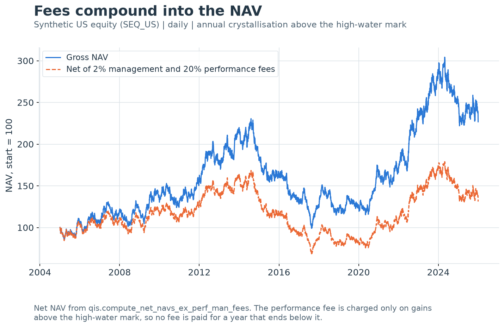

---
myst:
  html_meta:
    description: >-
      How qis converts prices to returns and back to NAVs, forms excess-of-cash returns, deducts
      management and high-water-mark performance fees, and levers or de-levers returns, with the
      day-count and timing convention of each helper.
---

# Returns, NAVs, excess returns, fees and leverage

*Author: [Artur Sepp](https://github.com/ArturSepp)*

Implemented in [qis — Quantitative Investment Strategies](https://github.com/ArturSepp/QuantInvestStrats).
Software citation: [CITATION.cff](https://github.com/ArturSepp/QuantInvestStrats/blob/main/CITATION.cff).

A return transform maps a price or NAV path to period returns, or period returns back to a level
path, under a stated return basis, sampling grid, day count and timing. This chapter specifies the
transforms that sit between raw prices and every statistic in qis: return types and resampling,
NAV reconstruction, excess returns over cash, net-of-fee NAVs with a high-water mark, and
constant-leverage financing. Every formula is the one the code computes; where it departs from a
textbook convention, the difference is stated.

## Overview

Simple and log returns, total and per-annum returns, annualisation and the definition of excess
returns are set out in [Notation and conventions](notation_and_conventions.md). This chapter builds
on those definitions without repeating their derivations, and answers five implementation
questions:

1. **On which grid is a return formed?** `qis.to_returns` samples prices on the `freq` grid first
   and differences second, so `freq` is the return frequency.
2. **How is a level path rebuilt from returns**, and what happens to the first observation, to
   gaps and to missing asset returns inside a portfolio?
3. **Which excess-return NAV is computed?** Compounding $r_t-r^f_t$ is not the ratio of the asset
   NAV to a cash NAV. Every qis excess helper compounds the difference.
4. **How are fees charged?** A management fee accrues ACT/365 on gross asset value; a performance
   fee accrues on gains above a high-water mark and crystallises at calendar period ends.
5. **How are leverage and financing applied?** Through a constant debt-to-equity ratio, with the
   annual financing rate known at the start of each period divided by the number of periods per
   year.

| Task | qis entry point | Section |
|---|---|---|
| Prices to returns on a chosen grid | `qis.to_returns`, `qis.prices_at_freq` | [Return types](#return-types-and-the-sampling-grid) |
| Returns to NAV levels | `qis.returns_to_nav`, `qis.log_returns_to_nav` | [Levels](#from-returns-back-to-levels) |
| Portfolio return from weights | `qis.to_portfolio_returns` | [Portfolio returns](#portfolio-returns-from-lagged-weights) |
| Excess returns and excess NAVs | `qis.compute_excess_returns`, `qis.compute_excess_return_navs` | [Cash](#cash-and-excess-returns) |
| Net-of-fee NAV | `qis.compute_net_navs_ex_perf_man_fees` | [Fees](#management-and-performance-fees) |
| Lever, de-lever, implied leverage | `qis.lever_returns`, `qis.delever_returns`, `qis.implied_leverage` | [Leverage](#leverage-and-financing) |
| Which day count applies where | all of the above | [Day counts](#day-count-and-timing-conventions) |

## Inputs, notation, and assumptions

| Convention | This article |
|---|---|
| Return basis | Simple returns (`ReturnTypes.RELATIVE`) unless stated; log, difference and level modes are defined below; excess returns subtract an ACT/365 cash accrual from simple returns |
| Sampling grid | The input index, or the `freq` grid when given: prices are sampled at `freq` boundaries before differencing |
| Annualisation | Per-annum returns use $Y$ = days/365.25; cash and fees accrue ACT/365; leverage financing uses the annual rate divided by $\mathrm{AN}$; `compute_sampled_vols` scales by $\sqrt{\mathrm{AN}}$ |
| Mean adjustment | None in return, NAV, fee and leverage transforms; `estimate_vol` removes the sample mean at 20 or more observations and none below 20 |
| Timing | A return dated $t$ covers $(t-1,t]$; cash accrued over it, in the excess helpers and in the backtest cash leg alike, uses the rate known on the return date $t-1$, as does leverage financing; backtest carry uses the latest quote at or before $t$; `to_portfolio_returns` lags weights by one row; interpolated returns up to a report date use data up to that date |
| Output units | Decimal returns; NAVs start at 1 unless `init_value` or `terminal_value` rescales them |
| qis default | `to_returns(is_log_returns=False, return_type=ReturnTypes.RELATIVE, freq=None, ffill_nans=True, drop_first=False, is_first_zero=False)`, `returns_to_nav(init_period=0)`, fees `man_fee=0.01, perf_fee=0.2, perf_fee_frequency='YE'`, `interpolate_infrequent_returns(span=12, is_to_log_returns=False, vol_adjustment=1.0)` |

| Symbol or input | Meaning | Units and convention |
|---|---|---|
| $d_t$ | Calendar date of observation $t$ | As in chapter 1 |
| $\delta_t=(d_t-d_{t-1})/365$ | ACT/365 accrual fraction between consecutive return dates | Years; $\delta=0$ on the first return date |
| $S_t$ | Signed level (a rate or spread) for the difference and level modes | Units of the input |
| $y_{(q)}$, $d^{y}_{q}$ | The $q$-th quote of an annual rate series and its date | Decimal annual rate |
| $q_t$ | Position of the latest rate quote dated on or before $d_t$ | Integer; the period ending $t$ uses quote $q_{t-1}$ |
| $V_t$ | NAV rebuilt from returns | Starts at 1 unless rescaled |
| $t'$ | Running date index inside a product or sum | Same grid as $t$ |
| $\omega$ | Return scale of `prices_to_scaled_nav` | Default 0.5 |
| $O_t$ | Assets whose weighted return is observed at $t$ | Set of asset indices |
| $B_t$ | Cash NAV, the compounded cash return | Starts at 1 |
| $C_{t-1}$ | Cash balance of a backtest | NAV currency |
| $r^{\mathrm{long}}_t$, $r^{\mathrm{short}}_t$ | Returns of the long and short legs | Simple |
| $\mathrm{GAV}_t$, $\mathrm{NAV}_t$, $\mathrm{HWM}_t$, $\mathrm{PF}_t$ | Gross asset value, net asset value, high-water mark, accrued performance fee | Currency units, base 100 at the first date |
| $G_t$ | Gross NAV: gross returns compounded with no fees | Base 100 |
| $f_{\mathrm{man}}$, $f_{\mathrm{perf}}$ | Annual management fee and performance-fee rate | Decimals, e.g. 0.02 and 0.20 |
| $\chi_t$ | Crystallisation indicator | 1 on a crystallisation date, else 0 |
| $L$, $E$ | Debt divided by equity; equity | Nonnegative; $L=0.5$ is 1.5x assets/equity |
| $c_t$ | Financing cost per return period | $y_{(q_{t-1})}/\mathrm{AN}$ |
| $r^{A}_t$, $r^{V}_t$ | Unlevered asset return and levered vehicle return | Simple |
| $\hat\sigma$ | Output of `estimate_vol` | Per period, not annualised |
| $\ell^{\mathrm{rep}}_b$, $d_{(b)}$ | Reported log return $b=0,\ldots,K$ and its report date | $\log(1+r)$ of a reported simple return |
| $m_b$ | Number of pivot dates in the report interval ending at report $b$ | Count |
| $r^{\mathrm{piv}}_j$, $e_j$ | Pivot return on pivot date $j$ and its normalised innovation | $\sum_j e_j=0$ and $\sum_j e_j^2=m_b-1$ in each interval |
| $\hat v_b$ | EWM variance of the reported returns per pivot period | Squared log return per pivot period |
| $\hat\ell_j$ | Interpolated log return on pivot date $j$ | Decimal |
| $\kappa$ | The `vol_adjustment` argument of `interpolate_infrequent_returns` | Default 1 |
| $n$, $\gamma$ | Number of component NAVs and their common growth factor | Count; dimensionless |

Inputs are pandas objects with a `DatetimeIndex`; columns are assets or strategies. Prices and
NAVs must be positive for the ratio and log modes. `to_returns` and the fee helper sort rows into
chronological order before any fill, difference or recursion. A rate series is an annual decimal
rate on its own calendar: it need not share the return index, and the helpers align it as
described below.

## Methodology

### Return types and the sampling grid

**Definition (return types).** On the sampled grid, `qis.to_returns` maps a level $S_t$ to one of
five `qis.ReturnTypes`:

| Member | Value at $t$ | Valid when |
|---|---|---|
| `RELATIVE` (default) | $S_t/S_{t-1}-1$ | Both endpoints finite and positive |
| `LOG` | $\log(S_t/S_{t-1})$ | Both endpoints finite and positive |
| `DIFFERENCE` | $S_t-S_{t-1}$ | Both endpoints finite; signed levels allowed |
| `LEVEL` | $S_t$ | $S_t$ finite |
| `LEVEL0` | $S_{t-1}$ | $S_{t-1}$ finite |

A return whose endpoints fail the validity rule is missing; the first row is missing in every
mode except `LEVEL`. `DIFFERENCE` is the change of a rate or spread, where a ratio has no meaning.
`LEVEL` and `LEVEL0` are not returns: they place the end-of-period and start-of-period level on the
return index, so that another quantity can be divided by the level at the start of its period.
`is_log_returns=True` overrides `return_type` and always produces log returns. The two return
conventions and their aggregation properties are standard (Campbell, Lo and MacKinlay, 1997).

**Sampling first, differencing second.** With `freq` set, `qis.prices_at_freq` builds the calendar
boundaries of `freq` inside the first and last dates of the input, for example every month-end
for `'ME'`, including a month-end that falls on a weekend. The level at a boundary is the last
observation dated on or before it. Returns are then formed between consecutive boundaries, so a
month-end return equals the product of the daily gross returns inside the month, by the
telescoping identity of [chapter 1](notation_and_conventions.md#simple-and-log-returns).
Resampling the returns afterwards, for instance by summing daily simple returns, gives a different
number. The first and last partial periods are dropped unless `include_start_date` or
`include_end_date` adds the first or last observation date as an extra, irregular grid point.

**Forward-fill policy.** With `ffill_nans=True`, the default, a missing price is replaced by the
latest earlier price: a gap produces a zero return followed by the whole catch-up move in the
period after it. With `freq` set, the fill runs on the source grid before the boundaries are
sampled and again after. With `ffill_nans=False` the gap stays missing and removes both returns it
bounds.

> **Pitfall.** When the inferred frequency of the input index already equals `freq`, for example
> month-end prices passed with `freq='ME'`, `prices_at_freq` returns the input unchanged, missing
> values included, whatever `ffill_nans` says. This is deliberate and documented: on its own grid
> a missing value is a missing observation, and filling it would manufacture a zero return. A
> missing month-end price then removes the two monthly returns it bounds, where `freq=None` fills
> it. Pass `freq=None` for data already on the target grid when the fill is intended.

**First observation.** `drop_first=True` removes the first row. `is_first_zero=True` sets to zero
the missing return immediately before each column's first observed return, so that a NAV rebuilt
from the result starts on the first price date. If both are set, `is_first_zero` wins and nothing
is dropped. `to_returns` accepts unknown keyword arguments, so that callers forwarding a shared
keyword dictionary do not fail, but does not use them: each one raises a `UserWarning` that names
it and the closest documented argument. A misspelt `is_log_return=True` therefore returns simple
returns with a warning that `is_log_returns` was probably meant.

### From returns back to levels

**Definition (NAV from simple returns).** For a pandas input, `qis.returns_to_nav` computes

$$
V_t=\prod_{t'\le t}\,(1+r_{t'}),
$$

where a missing return inside the observed range adds no growth and the NAV is carried flat;
leading and trailing missing values stay missing. The first level depends on `init_period`:

- `init_period=0` (default): if the first observed return is preceded by a missing row, that row
  is set to zero and the NAV equals 1 there. If the series starts with an observed return $r_1$,
  the first level is $1+r_1$, so the first return is compounded into the first level.
- `init_period=1`: the first observed return is set to zero and discarded.
- `first_date`: every observed return dated on or before `first_date` is set to zero; this takes
  precedence over `init_period`.

`init_value` rescales the path so that its first level equals `init_value`; `terminal_value`
rescales it so that its last level equals `terminal_value` and takes precedence. `freq` samples
the finished NAV at calendar boundaries. `is_log_returns=True` applies `expm1` first.
`constant_trade_level=True` replaces compounding by summation, $V_t=1+\sum_{t'\le t}r_{t'}$: the
P&L of a constant notional of one, with gains neither reinvested nor losses replenished.

**Identity (log returns).** On data with no missing values, `qis.log_returns_to_nav` returns
$\exp\big(\sum_{t'\le t}\ell_{t'}\big)$, which equals
`returns_to_nav(returns=log_returns, is_log_returns=True)`.

**Proof.** $\exp\big(\sum_{t'}\ell_{t'}\big)=\prod_{t'}e^{\ell_{t'}}=\prod_{t'}\big(1+(e^{\ell_{t'}}-1)\big)$,
`expm1` computes $e^{\ell}-1$, and with no leading missing row the default `init_period=0` of
`returns_to_nav` changes nothing. $\square$

The two functions differ at gaps and at the start: `log_returns_to_nav` skips a missing log return
in the running sum but leaves the output missing on that date, and its `init_period` defaults to
`None`, so nothing is zeroed.

**Scaled and long-short NAVs.** `qis.prices_to_scaled_nav` compounds a fraction $\omega$ of each
return, $V_t=\prod_{t'\le t}(1+\omega\,r_{t'})$ with `scale=0.5` by default and a zero first
return. This is an exposure rebalanced every period to $\omega$ times the NAV, not the power
$(P_t/P_0)^{\omega}$ of the price. Since
$\log(1+\omega r)-\omega\log(1+r)\approx\tfrac12\omega(1-\omega)r^2$, the rebalanced NAV sits above
that power by about $\tfrac12\omega(1-\omega)\sum_{t'}r_{t'}^2$ in logs for $0<\omega<1$.

`qis.long_short_to_relative_nav` joins the two price series on the union of their dates,
forward-fills them, and compounds the return difference,

$$
V_t=\prod_{t'\le t}\big(1+r^{\mathrm{long}}_{t'}-r^{\mathrm{short}}_{t'}\big),
$$

with the first observed difference set to zero. This is the NAV of a position that is long one
unit of NAV in one leg and short the same amount in the other, reset every period. It is not the
price ratio $P^{\mathrm{long}}_t/P^{\mathrm{short}}_t$; the proposition in the
[cash section](#cash-and-excess-returns) measures the gap, with $r^{\mathrm{short}}$ in place of
$r^f$.

The per-annum statistics of a level path are those of the chapter 1 section
[Total and per-annum returns](notation_and_conventions.md#total-and-per-annum-returns).
`qis.compute_total_return` uses the first and last finite level of each column, with a warning
when an endpoint is missing, and returns a missing value for a one-row input.
`qis.to_total_returns` wraps it as a Series indexed by asset. `qis.compute_num_years` is
$\max(\text{days},1)/365.25$. `qis.compute_pa_return` compounds for $Y>1$ and, for $Y\le 1$,
returns the total return, or $\mathrm{TR}/Y$ when `annualize_less_1y=True`.

### Portfolio returns from lagged weights

**Definition (portfolio return).** `qis.to_portfolio_returns(weights, returns)` shifts the weights
frame down by one row and computes

$$
r_{p,t}=\sum_{i\in O_t} w_{i,t-1}\,r_{i,t},
\qquad
O_t=\{i:\ w_{i,t-1}\,r_{i,t}\ \text{is observed}\},
$$

with $r_{p,t}$ missing when $O_t$ is empty. The weights are multiplied with the returns by date
label, so the two frames must share one index; weights on rebalancing dates only must be
reindexed and forward-filled to the return dates first, otherwise every unmatched date is
missing. The first row is missing because it has no lagged weight.

The missing-value rule is exact: a missing term contributes zero and **the remaining weights are
not renormalised**. With weights $(0.5,0.5)$ and returns $(2\%,\text{missing})$ the portfolio
return is $1\%$, not $2\%$. This models an untradeable asset whose weight earned nothing for the
day. It is wrong when a missing value means that the data vendor dropped a price; drop the row or
renormalise the weights before the call. Chapter 1 derives the weighted sum as the return of a
unit holding with realised weights $w_{i,t-1}$; with target weights the same formula describes a
portfolio rebalanced to target every period.

`qis.portfolio_returns_to_nav(returns)` expects per-asset return contributions. It sums each row
with the same rules as `to_portfolio_returns`, so a fully missing row has a missing aggregate
return, and compounds the sums. With the default `init_period=1` the first row's aggregate is set
to zero whether or not it is observed: the NAV is one on the first date and that row's
contribution is discarded. The NAV is carried flat through a fully missing row inside the history
and ends at the last row with an observed contribution.

### Cash and excess returns

Chapter 1 defines the [cash return and the excess return](notation_and_conventions.md#excess-returns-and-cash).
The implementation contract is the following.

**Definition (excess return as implemented).** Let the rate series have quotes
$y_{(1)},y_{(2)},\ldots$ dated $d^{y}_1<d^{y}_2<\cdots$, and let $q_t$ be the position of the latest
quote dated on or before $d_t$. `qis.compute_excess_returns(returns, rates_data)` computes

$$
r^f_t=y_{(q_{t-1})}\,\delta_t,
\qquad
\tilde r_t=r_t-r^f_t .
$$

The rate of the period $(t-1,t]$ is the one known on the return date $t-1$: the rate series is
first aligned to the return grid by the latest quote on or before each date, and then lagged by
one period **of the return grid**, whatever its own calendar. When the rate lives on the return
grid, $y_{(q_{t-1})}$ is the rate dated $t-1$, as chapter 1 states; with daily quotes and monthly
returns each month is charged the quote of the previous month-end. The accrual $\delta_t$ counts
calendar days between consecutive return dates, so the first return date accrues exactly nothing,
whatever the rate. A period that starts before the first quote has a missing excess return.

**Proposition (a rate series that starts on the first return date is enough).** If the rate
series has a quote dated $d_0$, the first return date, then every $r^f_t$ is defined, and it is
unchanged by any extension of the series to dates before $d_0$.

**Proof.** For $t\ge1$, $d_{t-1}\ge d_0$, so the latest quote on or before $d_{t-1}$ exists and is
dated in $[d_0,d_{t-1}]$; quotes dated before $d_0$ are never the latest. For $t=0$,
$\delta_0=0$ and $r^f_0=0$. $\square$

The excess helpers differ in what they return; all use this lag and day count.

| Helper | Returns |
|---|---|
| `qis.compute_excess_returns(returns, rates_data)` | $\tilde r_t$ on the return index |
| `qis.compute_excess_return_navs(prices, rates_data, first_date=None)` | $\prod_{t'\le t}(1+\tilde r_{t'})$ from 1, from the simple returns of `prices` with a zero first return |
| `qis.compute_pa_excess_compounded_returns(returns, rates_data, first_date=None, annualize_less_1y=False)` | $R_{\mathrm{pa}}$ of that excess NAV, compounded from the date that opens the first period with a known excess return and with $Y$ = days/365.25 counted from the same date; each DataFrame column on its own window |
| `qis.get_excess_returns_nav(prices, funding_rate, freq='B')` | The excess NAV on the `freq` grid, one on the first date so that the first period's excess return is compounded, then rescaled so that its last level equals the last price |
| `qis.compute_returns_dict(prices, perf_params)` | `'P.a. excess return'` from `compute_pa_excess_compounded_returns` when `perf_params.rates_data` is set, else the per-annum return; `'An. log return ex'` is its log |

**Rates that start late.** When the first quote is dated after the first return date, the periods
before it have no excess return. `compute_pa_excess_compounded_returns`, and through it the
`'P.a. excess return'` of `compute_returns_dict` and of the performance tables, then compounds
from the date that opens the first period with a known rate and divides by the years elapsed from
that date, with a warning. It counts the missing periods neither as flat nor in $Y$, so the
compounding window and $Y$ always agree. `compute_excess_return_navs` carries its NAV flat over
those periods. A rate series quoted from the first price date on, as the proposition shows, avoids
the shorter window entirely.

**Proposition (compounded excess versus ratio of NAVs).** Let $B_T=\prod_{t\le T}(1+r^f_t)$ be the
cash NAV. For each period,

$$
(1+r_t-r^f_t)-\frac{1+r_t}{1+r^f_t}=\frac{r^f_t\,(r_t-r^f_t)}{1+r^f_t},
$$

and to second order in returns

$$
\log\prod_{t\le T}(1+r_t-r^f_t)-\log\frac{\prod_{t\le T}(1+r_t)}{B_T}\approx\sum_{t\le T}r^f_t\,(r_t-r^f_t).
$$

The two excess NAVs agree only if, in every period, the cash return is zero or the asset return
equals it.

**Proof.** Over the common denominator $1+r^f_t$, the numerator is
$(1+r_t-r^f_t)(1+r^f_t)-(1+r_t)=r_t r^f_t-(r^f_t)^2$. For the second statement, expand
$\log(1+x)\approx x-x^2/2$ in both logarithms:
$\big(r-r^f\big)-\tfrac12\big(r-r^f\big)^2-\big(r-\tfrac12r^2\big)+\big(r^f-\tfrac12(r^f)^2\big)=r\,r^f-(r^f)^2$,
and sum over $t$. $\square$

Every qis excess helper computes the compounded difference, the left-hand product. In the
terminology of performance measurement (Bacon, 2008), qis compounds arithmetic excess returns
$r_t-r^f_t$, while the ratio of NAVs compounds geometric excess returns $(1+r_t)/(1+r^f_t)-1$. The
ratio of NAVs has no helper; compute it as
`qis.returns_to_nav(returns) / qis.returns_to_nav(cash_returns)`.
With a monthly cash return of 0.4% and a mean monthly excess return of 0.5%, the gap is about
$12\times0.004\times0.005$, or 2.4 bp a year; at 12% cash and a 2% monthly excess return it is
about 24 bp a year.

> **Insight.** The compounded difference is the NAV of an investor who holds exposure equal to
> current equity, borrows that notional at the cash rate, and earns nothing on the equity: a
> futures overlay on non-interest-bearing collateral. The ratio $P_t/(P_0B_t)$ is the asset valued
> in units of the cash account, a change of numéraire that compares buy-and-hold wealth with
> buy-and-hold cash. A Sharpe ratio computed on either is legitimate; mixing them across a report
> is not.

### Management and performance fees

`qis.compute_net_return_ex_perf_man_fees(gross_return, man_fee, perf_fee, perf_fee_frequency)`
runs one investor's fee account from inception.

**Definition (fee recursion as implemented).** Set
$\mathrm{GAV}_0=\mathrm{NAV}_0=\mathrm{HWM}_0=100$. For $t\ge1$,

$$
\begin{aligned}
\mathrm{GAV}^{-}_t&=\mathrm{GAV}_{t-1}\,\big(1+r_t-f_{\mathrm{man}}\,\delta_t\big),\\
\mathrm{PF}_t&=f_{\mathrm{perf}}\,\max\big(\mathrm{GAV}^{-}_t-\mathrm{HWM}_{t-1},\,0\big),\\
\mathrm{NAV}_t&=\mathrm{GAV}^{-}_t-\mathrm{PF}_t,\\
\mathrm{HWM}_t&=\chi_t\max\big(\mathrm{NAV}_t,\mathrm{HWM}_{t-1}\big)+(1-\chi_t)\,\mathrm{HWM}_{t-1},\\
\mathrm{GAV}_t&=\mathrm{GAV}^{-}_t-\chi_t\,\mathrm{PF}_t .
\end{aligned}
$$

The output is the net return $\mathrm{NAV}_t/\mathrm{NAV}_{t-1}-1$, zero on the first date.

The recursion reads as follows. The management fee accrues ACT/365 as a simple deduction
$f_{\mathrm{man}}\delta_t$ from the period's gross return, charged on the start-of-period gross
asset value; that value still contains any performance fee accrued since the last
crystallisation. The performance fee accrues every period against the high-water mark fixed at
the last crystallisation, so the NAV between crystallisations is net of the fee that would be paid
if the period ended now. On a crystallisation date the accrued fee is paid out of gross asset
value, so $\mathrm{GAV}_t=\mathrm{NAV}_t$ carries forward, and the mark is raised to the post-fee
NAV if that is a new high.

**Crystallisation dates.** qis builds the calendar period ends of `perf_fee_frequency`, `'YE'` by
default, between the first and last dates, and maps each to the last observation dated on or
before it; $\chi_t=1$ on those observations for $t\ge1$. A year-end on a weekend therefore
crystallises on the last business day observed. If the history ends between period ends, the
final partial period's fee is accrued in the NAV but not crystallised. The input index must be
unique and is sorted first.

**Proposition (fee bounds and a monotone high-water mark).** Suppose $f_{\mathrm{man}}\ge0$,
$0\le f_{\mathrm{perf}}\le1$, $r_t\ge-1$ and $1+r_t-f_{\mathrm{man}}\delta_t\ge0$ for all $t$. Let
$G_t=100\prod_{t'\le t}(1+r_{t'})$ be the gross NAV. Then for every $t$,

$$
\mathrm{HWM}_t\ge\mathrm{HWM}_{t-1}
\qquad\text{and}\qquad
\mathrm{NAV}_t\le\mathrm{GAV}^{-}_t\le G_t .
$$

**Proof.** The mark is either unchanged or replaced by $\max(\mathrm{NAV}_t,\mathrm{HWM}_{t-1})$,
so it never falls, and it stays at or above 100. For the bound, induct on
$0\le\mathrm{GAV}_{t-1}\le G_{t-1}$, which holds at $t=1$. Because $f_{\mathrm{man}}\delta_t\ge0$,
$\mathrm{GAV}_{t-1}\ge0$ and $1+r_t\ge0$,

$$
0\le\mathrm{GAV}^{-}_t\le(1+r_t)\,\mathrm{GAV}_{t-1}\le(1+r_t)\,G_{t-1}=G_t,
$$

where the lower bound is the last assumption. $\mathrm{PF}_t\ge0$ gives
$\mathrm{NAV}_t\le\mathrm{GAV}^{-}_t$. The carried value $\mathrm{GAV}_t$ is either
$\mathrm{GAV}^{-}_t$ or $\mathrm{NAV}_t$, and
$\mathrm{NAV}_t\ge\min\big(\mathrm{GAV}^{-}_t,\,(1-f_{\mathrm{perf}})\mathrm{GAV}^{-}_t+f_{\mathrm{perf}}\mathrm{HWM}_{t-1}\big)\ge0$.
Hence $0\le\mathrm{GAV}_t\le G_t$ and the induction continues. $\square$

> **Insight.** The bound holds for levels, not for returns. When a loss removes a performance fee
> accrued earlier in the fee period, the accrual is released and the net return exceeds the gross
> return. With gross asset value 110 against a mark of 100 and $f_{\mathrm{perf}}=20\%$, the NAV
> is 108; a gross move of $-5\%$ takes gross asset value to 104.5, the accrued fee to 0.9 and the
> NAV to 103.6, a net return of $-4.07\%$.

The model has one investor, no subscriptions or redemptions, no equalisation or series
accounting, and no hurdle rate. `qis.compute_net_navs_ex_perf_man_fees(navs, ...)` forward-fills
the gross NAVs, takes simple returns, applies the recursion column by column, and rebuilds a net
NAV. Each column runs its own fee account from its first observed NAV: the net NAV is missing
before that date and one on it, and the column's result equals that of the column passed alone on
its observed range.



[Open full-resolution preview](images/handbook_fee_navs.png).

The exhibit applies the recursion with $f_{\mathrm{man}}=2\%$, $f_{\mathrm{perf}}=20\%$ and annual
crystallisation to the synthetic US equity index, rebased to 100. Gross assets grow to 226.8 and
the net NAV to 131.2, a compound 4.0% a year against 1.3%: fees take two thirds of the gross
return. The gap widens fastest in rising years, when both fees are charged, and keeps widening in
falling years through the management fee alone. A falling year also leaves the high-water mark in
place, so the recovery that follows is free of performance fees only up to that mark.

### Leverage and financing

**Identity (constant leverage).** A vehicle with equity $E$ borrows $LE$ at a periodic cost $c_t$
and holds $(1+L)E$ of an asset returning $r^A_t$. Its return is

$$
r^V_t=(1+L)\,r^A_t-L\,c_t,
\qquad
r^A_t=\frac{r^V_t+L\,c_t}{1+L}.
$$

**Proof.** End-of-period equity is $(1+L)E(1+r^A_t)-LE(1+c_t)=E\big(1+(1+L)r^A_t-Lc_t\big)$. Solve
for $r^A_t$; $1+L\ge1$ is never zero. $\square$

`qis.lever_returns` implements the forward identity and `qis.delever_returns` the inverse; the
[de-levering section of the private-asset chapter](private_asset_unsmoothing.md#de-levering-the-financing-identity)
discusses when the inverse is economically meaningful. Both use simple returns. The periodic cost
is

$$
c_t=\frac{y_{(q_{t-1})}}{\mathrm{AN}},
$$

the rate known at the start of the period: a Series of annual rates is sorted, and the period
ending on return date $t$ is charged the latest quote dated on or before the previous return date
$t-1$. A quote dated on a return date applies from the next period. The first return date takes
the latest quote dated strictly before it, and is missing when there is none; so is every return
whose period starts before the first quote. Up to qis 5.30.3 the quote dated on the return date
itself was used. A scalar `financing_rate` is constant. $\mathrm{AN}$ is
`periods_per_year`, or, when it is `None`, the factor inferred from the return index and rounded to
an integer; an irregular index falls back to 252 with a warning. There is no day count: every
period costs $y/\mathrm{AN}$ whatever its length. `leverage=0` returns a copy of the input, even
without financing data. The leverage must be a finite nonnegative real and `periods_per_year` a
positive integer.

**Proposition (lever and de-lever round trip).** For $L\ge0$, the same financing input and the
same $\mathrm{AN}$, `delever_returns(lever_returns(r))` equals `r` and
`lever_returns(delever_returns(r))` equals `r` on every date with an available financing quote.

**Proof.** Both helpers compute the same $c_t$ from the same inputs. Then
$\big((1+L)r_t-Lc_t+Lc_t\big)/(1+L)=r_t$ and
$(1+L)\big(r_t+Lc_t\big)/(1+L)-Lc_t=r_t$. $\square$

In floating point the round trip is exact to about $10^{-16}$. It fails if the two calls infer
different $\mathrm{AN}$ values or receive different rate series.

**Definition (implied leverage).** `qis.implied_leverage(levered_returns, unlevered_returns)`
inner-joins the two series, drops dates where either is missing and, if at least 10 joint
observations remain, returns

$$
\hat L=\hat\beta-1,
\qquad
\hat\beta=\frac{\widehat{\operatorname{Cov}}(r^A,r^V)}{\widehat{\operatorname{Var}}(r^A)},
$$

the ordinary least-squares slope with an intercept, both moments with `ddof=1`. With fewer than 10
joint observations it returns a missing value. A DataFrame of levered returns gives a Series named
`implied_leverage`.

**Proposition (what the slope identifies).** If $r^V_t=(1+L)r^A_t-Lc_t$ holds exactly, then in
every sample

$$
\hat L=L-L\,\frac{\widehat{\operatorname{Cov}}(r^A,c)}{\widehat{\operatorname{Var}}(r^A)},
$$

so $\hat L=L$ exactly when $c_t$ is constant.

**Proof.** Sample covariance is bilinear:
$\widehat{\operatorname{Cov}}(r^A,r^V)=(1+L)\widehat{\operatorname{Var}}(r^A)-L\,\widehat{\operatorname{Cov}}(r^A,c)$.
Divide by $\widehat{\operatorname{Var}}(r^A)$ and subtract one. $\square$

Any other difference between the two vehicles, such as security selection, fees, a financing
spread or a discount to NAV, adds its covariance with $r^A$ to the numerator. Reporting lags or
smoothing in either series also bias the contemporaneous slope: smoothing the levered series
attenuates it, while smoothing the regressor can inflate it; see
[private-asset unsmoothing](private_asset_unsmoothing.md).

### Day-count and timing conventions

Three day counts coexist, and rates are aligned either as known at the start of the period or as
the latest quote at its end. The table records what each helper does, as verified against the
code. $C_{t-1}$ is the backtest cash balance and $V_{t-1}$ its NAV.

| Helper | Year basis | Rate applied to the period ending $t$ | Accrual |
|---|---|---|---|
| `qis.compute_num_years`, `qis.compute_pa_return`, `qis.compute_returns_dict`, per-annum step of `qis.compute_pa_excess_compounded_returns` | 365.25-day years | None | $Y$ = days/365.25 |
| `qis.adjust_component_navs_to_portfolio` | 365.25-day years | None | Exponent days/365.25 |
| `qis.compute_excess_returns`, and through it `qis.compute_excess_return_navs`, `qis.compute_pa_excess_compounded_returns`, `qis.compute_returns_dict` | ACT/365 | $y_{(q_{t-1})}$: known at $t-1$ on the return grid | $y_{(q_{t-1})}\delta_t$ |
| `qis.get_excess_returns_nav` | ACT/365 on the `freq` grid | $y_{(q_{t-1})}$: known at $t-1$ on the `freq` grid | $y_{(q_{t-1})}\delta_t$ |
| `qis.backtest_model_portfolio`, `funding_rate` | ACT/365 | $y_{(q_{t-1})}$: known at $t-1$ on the price grid | $C_{t-1}\,y_{(q_{t-1})}\delta_t$ on cash |
| `qis.backtest_model_portfolio`, `management_fee` | ACT/365 | Constant | $f_{\mathrm{man}}\delta_t V_{t-1}$ deducted from cash |
| `qis.backtest_model_portfolio`, `instruments_carry` | ACT/365 | Latest quote, no lag | Carry rate times $\delta_t$ on current notional |
| `qis.compute_net_return_ex_perf_man_fees`, `qis.compute_net_navs_ex_perf_man_fees` | ACT/365 | Constant | $f_{\mathrm{man}}\delta_t$ subtracted from $r_t$ |
| `qis.lever_returns`, `qis.delever_returns` | Periods per year | $y_{(q_{t-1})}$: known at $t-1$ on the return grid | $y_{(q_{t-1})}/\mathrm{AN}$, independent of period length |
| `qis.compute_sampled_vols` | $\sqrt{\mathrm{AN}}$ inferred from the return index | None | None |
| `qis.interpolate_infrequent_returns` | Pivot periods; `annualization_factor` sets no time scale | None | None |

The ACT/365 helpers all go through the internal `qis.utils.df_ops.multiply_df_by_dt`, which aligns
the rate series to the target dates by the latest quote on or before each date, shifts the aligned
series by `lag` observations of the target grid, and multiplies by calendar days over 365, with
exactly zero on the first target date. The excess helpers and the backtest funding call it with
`lag=1`, and the backtest carry with `lag=0`.

The cash leg of a backtest and the cash subtracted by the excess helpers are therefore the same
number: on the [chapter 1 example](notation_and_conventions.md#worked-example), a cash-only
backtest earns $3.65\%\times31/365$ in March, which is what `compute_excess_returns` subtracts.
A cash balance held over $(t-1,t]$ earns the rate fixed when the period starts; the quote dated
$t$, 7.3% in that example, is not yet known then. A funding series that starts after the first
price date leaves the backtest NAV missing from the first period without a known rate, with a
warning. The leverage helpers also charge the rate known at $t-1$, but as a per-period cost with
no day count. Backtest carry is the one rate that still uses the latest quote at or before $t$.

### Short-sample volatility

**Definition.** For each column with $T$ finite observations, `qis.estimate_vol` returns

$$
\hat\sigma=
\begin{cases}
s(x), & T\ge20,\\
\sqrt{\tfrac{1}{T}\sum_{t=1}^{T}x_t^2}, & 1\le T<20,
\end{cases}
$$

and a missing value when $T=0$. Missing rows do not count towards $T$. The root mean square below
20 observations avoids spending a degree of freedom on the mean, and assumes a zero mean.

**Identity.** $\tfrac{1}{T}\sum_{t=1}^{T}x_t^2=\tfrac{T-1}{T}\,s(x)^2+\bar x^2$.

**Proof.** Write $x_t=(x_t-\bar x)+\bar x$ and square; the cross term sums to zero, and
$\sum_t(x_t-\bar x)^2=(T-1)s(x)^2$. $\square$

> **Pitfall.** The estimator is discontinuous at 20 observations. Crossing the threshold swaps a
> raw second moment, which contains $\bar x^2$, for a demeaned variance. For returns with drift the
> estimate drops when one observation is added: nineteen returns of 1% have $\hat\sigma=1\%$, twenty
> have $\hat\sigma=0$. The jump is material whenever $\lvert\bar x\rvert$ is comparable with
> $s(x)/\sqrt{T}$, that is, whenever the mean is statistically visible in the window.

`qis.compute_sampled_vols(prices, freq_vol='ME', freq_return=None)` forms returns on the
`freq_return` grid (the input grid when `None`), splits them into windows ending at each `freq_vol`
boundary, applies `estimate_vol` to each window and multiplies by $\sqrt{\mathrm{AN}}$, with
$\mathrm{AN}$ inferred from the return index. Each window is right-closed: it runs from just after
the previous boundary to the current one, so a return dated exactly on a boundary closes the
window that ends there and is counted once. Business-day returns in monthly windows give 20 to 23
observations and the demeaned branch, but on an exchange calendar a month with a holiday can have
19 and switch to the root mean square. Weekly returns in quarterly windows and monthly returns in
annual windows always fall below 20. The estimator therefore depends on the pair of grids and on
the holiday calendar, not only on the data.

### Interpolating infrequent returns

`qis.interpolate_infrequent_returns(infrequent_returns, pivot_returns, span=12,
annualization_factor=260, is_to_log_returns=False, vol_adjustment=1.0)` places an infrequently
reported return series, such as quarterly private-asset returns, on the grid of a frequent pivot
series, and returns it on the pivot index. A DataFrame is handled column by column after dropping
each column's missing values; a Series must have none.

**Definition (method as implemented).** Let $\ell^{\mathrm{rep}}_0,\ldots,\ell^{\mathrm{rep}}_K$ be
the reported log returns at report dates $d_{(0)}<\cdots<d_{(K)}$: the reported returns themselves
when `is_to_log_returns=True`, and $\log(1+r)$ of the reported simple returns otherwise. Each report
is placed on the last pivot date on or before its report date, and report 0 only sets the starting
level. The interval ending at report $b$ holds the $m_b$ pivot dates after the previous report's
pivot date, up to and including its own. On those dates

$$
\hat\ell_j=\frac{\ell^{\mathrm{rep}}_b}{m_b}+\kappa\,\sqrt{\hat v_b}\,e_j,
\qquad
\hat v_b=\lambda\,\hat v_{b-1}+(1-\lambda)\,\frac{(\ell^{\mathrm{rep}}_b)^2}{m_b},
$$

with $\hat v_1=(\ell^{\mathrm{rep}}_1)^2/m_1$ and $\lambda=1-2/(N+1)$, where $N$ = `span` counts
reports. The innovations $e_j$ are the pivot returns $r^{\mathrm{piv}}_j$ of the interval, demeaned
and scaled so that $\sum_j e_j=0$ and $\sum_j e_j^2=m_b-1$; a missing pivot return has $e_j=0$. The
output is $\hat\ell_j$ in log mode and $\exp(\hat\ell_j)-1$ in the default simple mode. Pivot dates
up to the first placed report and after the last one are missing. A report interval that holds no
pivot date, as with weekly reports on a monthly pivot, is merged with the next one.

This is a discretised Brownian bridge on the log NAV. Conditional on its two endpoints, a Brownian
motion sampled at $m$ equal steps has increments equal to the average increment plus demeaned
independent Gaussian increments, whose sum of squares has expectation $m-1$ times the step
variance. The method keeps that structure, fixes the sum of squares at its expectation, and takes
the shape of the deviations from the pivot, so that the interpolated series moves with a real
market.

**Identity (reported returns are matched).** Over every report interval,
$\sum_j\hat\ell_j=\ell^{\mathrm{rep}}_b$. In the simple mode the interpolated simple returns
therefore compound exactly to the reported simple return, and in the log mode they sum to it.

**Proof.** $\sum_j e_j=0$, so $\sum_j\hat\ell_j=m_b\,\ell^{\mathrm{rep}}_b/m_b$. In the simple mode
$\prod_j\big(1+(e^{\hat\ell_j}-1)\big)=e^{\ell^{\mathrm{rep}}_b}=1+r^{\mathrm{rep}}_b$. $\square$

**Proposition (sum of squares).** Over the interval ending at report $b$,

$$
\sum_j\hat\ell_j^2=\frac{(\ell^{\mathrm{rep}}_b)^2}{m_b}+\kappa^2\,\hat v_b\,(m_b-1).
$$

With `span=1` and $\kappa=1$ the right-hand side is $(\ell^{\mathrm{rep}}_b)^2$: the realised
quadratic variation of the interpolated path over each interval equals the squared reported
return, the square-root-of-time rule on the pivot clock.

**Proof.** Expand the square. The cross term is
$2\kappa\sqrt{\hat v_b}\,(\ell^{\mathrm{rep}}_b/m_b)\sum_je_j=0$ and $\sum_je_j^2=m_b-1$. With
$N=1$, $\lambda=0$ and $\hat v_b=(\ell^{\mathrm{rep}}_b)^2/m_b$. $\square$

**Proposition (second moments under a Brownian motion).** Let the log NAV be a Brownian motion
whose increment over one pivot period has mean $\mu$ and variance $v$, and let $\hat v_b=v$ and
$\kappa=1$. Then over each interval the interpolated log returns have the expected sum of squares
$m_b(v+\mu^2)$ and the average expected cross-product over distinct pairs $\mu^2$ of the true
increments: no added variance and, on average, no serial correlation.

**Proof.** $\ell^{\mathrm{rep}}_b$ has mean $m_b\mu$ and variance $m_bv$, so
$\mathbb{E}\big[(\ell^{\mathrm{rep}}_b)^2\big]=m_bv+m_b^2\mu^2$, and the previous proposition gives
$\mathbb{E}\big[\sum_j\hat\ell_j^2\big]=v+m_b\mu^2+v(m_b-1)$. For distinct pairs,
$\sum_{i\ne j}e_ie_j=\big(\sum_je_j\big)^2-\sum_je_j^2=-(m_b-1)$ and $\sum_{i\ne j}(e_i+e_j)=0$, so
the average of $\hat\ell_i\hat\ell_j$ over the $m_b(m_b-1)$ ordered pairs is
$(\ell^{\mathrm{rep}}_b)^2/m_b^2-v/m_b$, whose expectation is $\mu^2$. $\square$

The interval ending at report $b$ uses the pivot returns inside it and the reports up to and
including $b$ only, so the interpolated history up to $d_{(b)}$ does not change when later data
arrive: it is point in time as of each report date, though not before it, since the reported
return is known only at the end of its interval. Both the bridge variance and the reported-return
variance are measured per pivot period, so `annualization_factor` sets no time scale and the path
is the same for every value of it; the bridge volatility per year is
$\kappa\sqrt{\mathrm{AN}\,\hat v_b}$ with $\mathrm{AN}$ = `annualization_factor`.

qis 5.30.3 and earlier used the standardised pivot return as a level deviation around
a linear path, with full-sample moments, a scale read in units of `annualization_factor` calendar
days, and `vol_adjustment=1.15`. Those interpolated returns summed rather than compounded in the
default mode and were over-dispersed, with a lag-one autocorrelation near $-0.5$; the current
method does not reproduce them.

Reported returns of appraisal-based vehicles are themselves smoothed
(Getmansky, Lo and Makarov, 2004); interpolation does not remove that smoothing. A `vol_adjustment`
above one adds variance to the bridge but not the serial dependence that smoothing removed.

### Additive component NAVs and spliced histories

**Definition.** `qis.adjust_component_navs_to_portfolio(portfolio_nav, component_navs)` rescales
each of $n$ component NAVs by a common growth factor,

$$
\tilde V_{c,t}=V_{c,t}\,\gamma^{\,Y_t},
\qquad
\gamma=\frac{1+R^{P}_{\mathrm{pa}}/n}{1+\bar R_{\mathrm{pa}}},
$$

where $R^{P}_{\mathrm{pa}}$ is the portfolio's per-annum return, $\bar R_{\mathrm{pa}}$ the mean of
the components' per-annum returns ignoring missing values, and $Y_t$ the days since the portfolio's
first date over 365.25. `qis.portfolio_navs_to_additive(grouped_nav, portfolio_name)` applies it to
the non-portfolio columns of one frame and returns the portfolio column followed by the adjusted
components.

**Identity.** If the history spans more than one year and every component is observed on the
portfolio's first and last dates, the adjusted per-annum returns sum to the portfolio's:
$\sum_c\tilde R_{c,\mathrm{pa}}=R^{P}_{\mathrm{pa}}$.

**Proof.** For $Y>1$, $1+\tilde R_{c,\mathrm{pa}}=\big(V_{c,T}\gamma^{Y}/V_{c,0}\big)^{1/Y}=(1+R_{c,\mathrm{pa}})\gamma$.
Summing over $c$ gives $n(1+\bar R_{\mathrm{pa}})\gamma=n+R^{P}_{\mathrm{pa}}$. $\square$

The component NAVs do not sum to the portfolio NAV; only their per-annum returns add up. For a
history of one year or less, `compute_pa_return` returns total returns and the identity holds only
approximately. The adjustment is a display device, not an attribution.

`qis.bfill_timeseries(df_newer, df_older, freq='B', fill_method=None, is_prices=False)` extends a
newer history backwards with an older one, column by column: dates before the newer column's first
observation come from the older column. With `is_prices=True` the splice is made in return space,
older returns up to the first newer return followed by newer returns, and the NAV is rebuilt
backwards from the newer column's last level, $P_t=P^{\mathrm{new}}_T\prod_{t<t'\le T}(1+r_{t'})^{-1}$.
Recent levels are preserved and older levels rescaled.

## Worked example

The first block checks the sampling grid and the portfolio missing-value rule. Prices growing
0.1% per business day from 1 January 2024 produce month-end returns of 2.12%, 2.12% and 2.22% for
February, March and April: 21, 21 and 22 business days of growth. The March boundary is Sunday
31 March, sampled at Friday 29 March. A price path 100, missing, 110, 99 has returns 0%, 10% and
$-10\%$ under the default fill, but the same data passed with `freq='ME'` loses two returns.

```python
import numpy as np
import pandas as pd
import qis

days = pd.bdate_range('2024-01-01', '2024-04-30')
prices = pd.Series(100.0 * 1.001 ** np.arange(len(days)), index=days, name='asset')
monthly = qis.to_returns(prices=prices, freq='ME', drop_first=True)
assert list(monthly.index.strftime('%Y-%m-%d')) == ['2024-02-29', '2024-03-31', '2024-04-30']
np.testing.assert_allclose(monthly.to_numpy(), 1.001 ** np.array([21, 21, 22]) - 1.0,
                           rtol=1e-12)

gappy = pd.Series([100.0, np.nan, 110.0, 99.0],
                  index=pd.date_range('2024-01-31', periods=4, freq='ME'))
filled = qis.to_returns(prices=gappy)
same_grid = qis.to_returns(prices=gappy, freq='ME')
np.testing.assert_allclose(filled.iloc[1:].to_numpy(), [0.0, 0.1, -0.1], atol=1e-12)
assert same_grid.iloc[1:3].isna().all() and abs(same_grid.iloc[3] + 0.1) < 1e-12

weights = pd.DataFrame(0.5, index=gappy.index[:2], columns=['a', 'b'])
asset_returns = pd.DataFrame([[0.0, 0.0], [0.02, np.nan]], index=gappy.index[:2],
                             columns=['a', 'b'])
portfolio = qis.to_portfolio_returns(weights=weights, returns=asset_returns)
assert abs(portfolio.iloc[1] - 0.01) < 1e-15  # not renormalised to 2%
```

The fee example uses three calendar years of 365 days each, gross returns of 25%, $-10\%$ and 30%,
a 2% management fee and a 20% performance fee crystallised at year-end. By hand:

| Year | $\mathrm{GAV}^{-}_t$ | $\mathrm{PF}_t$ | $\mathrm{NAV}_t$ | $\mathrm{HWM}_t$ | $G_t$ |
|---|---:|---:|---:|---:|---:|
| 2021 | $1.23\times100=123$ | $0.2\times23=4.6$ | 118.4 | 118.4 | 125 |
| 2022 | $0.88\times118.4=104.192$ | 0 | 104.192 | 118.4 | 112.5 |
| 2023 | $1.28\times104.192=133.366$ | $0.2\times14.966=2.993$ | 130.373 | 130.373 | 146.25 |

Net returns are 18.4%, $-12.0\%$ and 25.13%. No fee is charged in 2023 on the recovery from
104.2 to 118.4, only on the gain above the mark. An independent loop reproduces these numbers and,
over 36 monthly gross returns, reproduces qis exactly. On that path the gross NAV ends the three years at 95.62, 109.36 and
117.63, the net NAV at 93.72, 104.06 and 108.60, and the mark rises from 100 to 104.06 and then
108.60. In 7 of the 36 months the net return exceeds the gross return, which is the accrual
release of the insight above. A second fund with the same gross path from its twelfth month-end
on runs its own fee account from its first NAV: in a two-column frame its net NAV is missing
before that date, one on it, and equal to the net NAV computed on its own range.

```python
dates = pd.to_datetime(['2020-12-31', '2021-12-31', '2022-12-31', '2023-12-31'])
gross = pd.Series([0.0, 0.25, -0.10, 0.30], index=dates, name='fund')
net = qis.compute_net_return_ex_perf_man_fees(gross_return=gross, man_fee=0.02, perf_fee=0.20,
                                              perf_fee_frequency='YE')
net_nav = 100.0 * (1.0 + net).cumprod()
np.testing.assert_allclose(net_nav.to_numpy(), [100.0, 118.4, 104.192, 130.372608], rtol=1e-12)
np.testing.assert_allclose(net.iloc[1:].to_numpy(), [0.184, -0.12, 0.25127273], atol=1e-8)
assert (net_nav <= 100.0 * (1.0 + gross).cumprod() + 1e-12).all()


def fee_loop(returns, man_fee, perf_fee, is_crystallisation):
    """Independent implementation of the high-water-mark recursion."""
    gav, hwm, navs, marks = 100.0, 100.0, [100.0], [100.0]
    for t in range(1, len(returns)):
        accrual = man_fee * (returns.index[t] - returns.index[t - 1]).days / 365.0
        gav = gav * (1.0 + returns.iloc[t] - accrual)
        nav = gav - perf_fee * max(gav - hwm, 0.0)
        if is_crystallisation[t]:
            hwm = max(nav, hwm)
            gav = nav
        navs.append(nav)
        marks.append(hwm)
    return np.array(navs), np.array(marks)


annual_nav, annual_hwm = fee_loop(gross, 0.02, 0.20, np.ones(len(gross), dtype=bool))
np.testing.assert_allclose(annual_nav, net_nav.to_numpy(), rtol=1e-12)
np.testing.assert_allclose(annual_hwm, [100.0, 118.4, 118.4, 130.372608], rtol=1e-12)

month_ends = pd.date_range('2020-12-31', '2023-12-31', freq='ME')
rng = np.random.default_rng(20260725)
monthly_gross = pd.Series(
    np.r_[0.0, 0.012 + 0.03 * rng.standard_normal(len(month_ends) - 1)], index=month_ends)
loop_nav, loop_hwm = fee_loop(monthly_gross, 0.02, 0.20, month_ends.month == 12)
qis_net = qis.compute_net_return_ex_perf_man_fees(gross_return=monthly_gross, man_fee=0.02,
                                                  perf_fee=0.20, perf_fee_frequency='YE')
np.testing.assert_allclose(100.0 * (1.0 + qis_net).cumprod().to_numpy(), loop_nav, rtol=1e-12)
gross_nav = 100.0 * np.cumprod(1.0 + monthly_gross.to_numpy())
np.testing.assert_allclose(gross_nav[[12, 24, 36]], [95.62, 109.36, 117.63], atol=0.005)
np.testing.assert_allclose(loop_nav[[12, 24, 36]], [93.72, 104.06, 108.60], atol=0.005)
np.testing.assert_allclose(np.unique(loop_hwm.round(2)), [100.0, 104.06, 108.60])
assert np.all(np.diff(loop_hwm) >= 0.0) and np.all(loop_nav <= gross_nav + 1e-9)
assert int((qis_net > monthly_gross).sum()) == 7

funds = pd.DataFrame({'early': gross_nav, 'late': np.r_[np.full(12, np.nan), gross_nav[12:]]},
                     index=month_ends)
fund_nets = qis.compute_net_navs_ex_perf_man_fees(navs=funds, man_fee=0.02, perf_fee=0.20)
late_alone = qis.compute_net_navs_ex_perf_man_fees(navs=funds['late'].dropna(), man_fee=0.02,
                                                   perf_fee=0.20)
np.testing.assert_allclose(fund_nets['early'].to_numpy(), loop_nav / 100.0, rtol=1e-12)
assert fund_nets['late'].iloc[:12].isna().all() and fund_nets['late'].iloc[12] == 1.0
np.testing.assert_allclose(fund_nets['late'].iloc[12:].to_numpy(), late_alone.to_numpy(),
                           rtol=1e-14)
```

The excess example uses two years of 10% returns and a flat 4% cash rate on an annual grid.
Compounding the difference gives $1.06^2=1.1236$, while the ratio of the asset NAV to the cash NAV
is $1.21/1.0816=1.1187$. The per-period gap is $0.04\times0.06/1.04=0.231\%$, as the proposition
states, and the terminal gap is 0.489%. The per-annum excess return reported by qis is the
compounded one, 6.00% over $730/365.25$ years. The rate series starts on the first price date,
which by the proposition is enough: `compute_returns_dict`, the path of the performance tables,
reports the same 6.00%, and an earlier start of the rate series changes nothing. A cash-only
backtest on the three-date cash series of chapter 1 earns in March the 3.65% quoted at the end of
February, exactly the cash return that `compute_excess_returns` subtracts.

```python
dates = pd.to_datetime(['2020-12-31', '2021-12-31', '2022-12-31'])
returns = pd.Series([0.0, 0.10, 0.10], index=dates)
rates = pd.Series(0.04, index=dates)
excess_nav = qis.compute_excess_return_navs(prices=qis.returns_to_nav(returns), rates_data=rates)
cash_returns = -qis.compute_excess_returns(returns=0.0 * returns, rates_data=rates).fillna(0.0)
ratio_nav = qis.returns_to_nav(returns) / qis.returns_to_nav(cash_returns)
np.testing.assert_allclose(excess_nav.to_numpy(), [1.0, 1.06, 1.1236], atol=1e-12)
np.testing.assert_allclose(ratio_nav.to_numpy(), [1.0, 1.1 / 1.04, 1.21 / 1.0816], atol=1e-12)
np.testing.assert_allclose(1.06 - 1.1 / 1.04, 0.04 * 0.06 / 1.04, atol=1e-15)
assert abs((excess_nav.iloc[-1] - ratio_nav.iloc[-1]) - 0.004887) < 1e-6
pa_excess = qis.compute_pa_excess_compounded_returns(returns=returns, rates_data=rates)
assert abs(pa_excess - (1.1236 ** (365.25 / 730.0) - 1.0)) < 1e-12
assert abs(pa_excess - 0.06) < 1e-4

label = qis.PerfStat.PA_EXCESS_RETURN.to_str()
for cash in (rates, pd.Series(0.04, index=pd.date_range('2019-12-31', periods=4, freq='YE'))):
    summary = qis.compute_returns_dict(prices=qis.returns_to_nav(returns),
                                       perf_params=qis.PerfParams(rates_data=cash))
    assert abs(summary[label] - pa_excess) < 1e-14

chapter1_cash = pd.Series([0.0365, 0.0365, 0.073], index=pd.to_datetime(
    ['2024-01-31', '2024-02-29', '2024-03-31']))
cash_only = qis.backtest_model_portfolio(
    prices=pd.DataFrame({'asset': 100.0}, index=chapter1_cash.index), weights={'asset': 0.0},
    funding_rate=chapter1_cash, is_rebalanced_at_first_date=True).get_portfolio_nav()
subtracted = -qis.compute_excess_returns(returns=0.0 * chapter1_cash, rates_data=chapter1_cash)
np.testing.assert_allclose(cash_only.pct_change().iloc[1:], subtracted.iloc[1:], atol=1e-15)
assert abs(cash_only.iloc[-1] / cash_only.iloc[-2] - 1.0 - 0.0365 * 31 / 365) < 1e-15
```

The leverage example checks the identity by hand, the round trip, and the implied-leverage
proposition. An asset return of 2% with $L=0.5$ and 4.8% financing, 0.4% a month, gives a vehicle
return of $1.5\times2\%-0.5\times0.4\%=2.8\%$. Over the 36 monthly returns above, financed at 1% in
2021 and 5% afterwards, each month's rate quoted at the previous month-end so that it is known when
the month starts, the round trip recovers the asset returns to $10^{-15}$. With constant
financing the implied leverage is exactly 0.5; with the time-varying rate it is 0.4946, which the
covariance identity reproduces; with nine observations it is missing.

```python
one = pd.Series([0.02], index=month_ends[1:2])
vehicle = qis.lever_returns(returns=one, leverage=0.5, financing_rate=0.048, periods_per_year=12)
assert abs(vehicle.iloc[0] - 0.028) < 1e-15

asset = monthly_gross.iloc[1:].rename('asset')
# each month's rate is quoted at the previous month-end: the rate known when the month starts
financing = pd.Series(np.where(asset.index.year == 2021, 0.01, 0.05),
                      index=asset.index - pd.offsets.MonthEnd(1))
levered = qis.lever_returns(returns=asset, leverage=0.5, financing_rate=financing,
                            periods_per_year=12)
np.testing.assert_allclose(levered, 1.5 * asset - 0.5 * financing.to_numpy() / 12.0, atol=1e-15)
round_trip = qis.delever_returns(returns=levered, leverage=0.5, financing_rate=financing,
                                 periods_per_year=12)
np.testing.assert_allclose(round_trip, asset, atol=1e-15)

constant = qis.lever_returns(returns=asset, leverage=0.5, financing_rate=0.048,
                             periods_per_year=12)
assert abs(qis.implied_leverage(constant, asset) - 0.5) < 1e-12
implied = qis.implied_leverage(levered, asset)
x, c = asset.to_numpy(), financing.to_numpy() / 12.0
assert abs(implied - (0.5 - 0.5 * np.cov(x, c, ddof=1)[0, 1] / np.var(x, ddof=1))) < 1e-12
assert abs(implied - 0.4946) < 1e-4
assert np.isnan(qis.implied_leverage(constant.iloc[:9], asset))
```

The volatility example shows the discontinuity of the short-sample estimator and checks the
second-moment identity.

```python
flat = np.full(20, 0.01)
assert abs(qis.estimate_vol(flat[:19]) - 0.01) < 1e-15  # root mean square
assert abs(qis.estimate_vol(flat)) < 1e-15  # demeaned standard deviation
draws = 0.005 + 0.02 * np.random.default_rng(20260725).standard_normal(19)
np.testing.assert_allclose(qis.estimate_vol(draws) ** 2,
                           18.0 / 19.0 * np.var(draws, ddof=1) + draws.mean() ** 2, rtol=1e-12)
```

The interpolation example places 20 quarterly returns, reported on the last business day of each
quarter, on a business-day pivot of five years. The interpolated simple returns compound exactly
to each reported return, while summing them misses by up to 0.32%. Truncating both inputs at the
tenth report leaves the history up to it unchanged, and `annualization_factor=12` gives the same
path as the default 260. With `span=1` the sum of squared daily log returns equals that of the 19
quarterly log returns, 0.0398, so both give a root mean square of 8.99% a year on the pivot clock.
At the default span of 12 reports the daily log returns have a volatility of 11.6% a year: the EWM
variance is seeded with the first quarter, 8.3%, the second largest of the sample. Their lag-one
autocorrelation is 0.03.

```python
rng = np.random.default_rng(20260725)
business_days = pd.bdate_range('2019-01-01', '2023-12-29')
pivot = pd.Series(0.01 * rng.standard_normal(len(business_days)), index=business_days,
                  name='pivot')
quarter_ends = pd.date_range('2019-03-29', '2023-12-29', freq='BQE')
reported = pd.Series(0.02 + 0.04 * rng.standard_normal(len(quarter_ends)), index=quarter_ends,
                     name='fund')
daily = qis.interpolate_infrequent_returns(infrequent_returns=reported, pivot_returns=pivot)
assert daily.index.equals(business_days)
compounded = (1.0 + daily.fillna(0.0)).cumprod().reindex(quarter_ends).pct_change().iloc[1:]
np.testing.assert_allclose(compounded, reported.iloc[1:], atol=1e-14)
summed = daily.fillna(0.0).cumsum().reindex(quarter_ends).diff().iloc[1:]
assert abs(np.max(np.abs(summed - reported.iloc[1:])) - 0.0032) < 5e-5

cutoff = quarter_ends[9]
early = qis.interpolate_infrequent_returns(infrequent_returns=reported.loc[:cutoff],
                                           pivot_returns=pivot.loc[:cutoff])
pd.testing.assert_series_equal(daily.loc[:cutoff], early, rtol=0.0, atol=0.0)
monthly_factor = qis.interpolate_infrequent_returns(infrequent_returns=reported,
                                                    pivot_returns=pivot, annualization_factor=12)
pd.testing.assert_series_equal(daily, monthly_factor, rtol=0.0, atol=0.0)

log_reported = np.log1p(reported.iloc[1:])
exact = np.log1p(qis.interpolate_infrequent_returns(infrequent_returns=reported,
                                                    pivot_returns=pivot, span=1).dropna())
np.testing.assert_allclose((exact ** 2).sum(), (log_reported ** 2).sum(), rtol=1e-12)
assert abs((log_reported ** 2).sum() - 0.0398) < 5e-5
assert abs(np.sqrt(252.0 * np.mean(exact ** 2)) - 0.0899) < 5e-5

log_daily = np.log1p(daily.dropna())
assert abs(log_daily.std() * np.sqrt(252.0) - 0.116) < 5e-4
assert abs(log_reported.iloc[0] - 0.083) < 5e-4
assert sorted(np.abs(log_reported))[-2] == abs(log_reported.iloc[0])
assert abs(daily.dropna().autocorr(1) - 0.03) < 5e-3
```

## Implementation in qis

| Quantity | Formula | qis entry point |
|---|---|---|
| Return types | $S_t/S_{t-1}-1$, $\log(S_t/S_{t-1})$, $S_t-S_{t-1}$, $S_t$, $S_{t-1}$ | `qis.ReturnTypes` members `RELATIVE`, `LOG`, `DIFFERENCE`, `LEVEL`, `LEVEL0` |
| Returns on a grid | Sample at `freq` boundaries, then difference | `qis.to_returns(prices, is_log_returns, return_type, freq, ffill_nans, drop_first, is_first_zero)` |
| Levels on a grid | Last observation on or before each boundary | `qis.prices_at_freq(prices, freq, include_start_date, include_end_date, ffill_nans)` |
| NAV from returns | $\prod(1+r)$, or $1+\sum r$ | `qis.returns_to_nav(returns, init_period=0, constant_trade_level=False, ...)` |
| NAV from log returns | $\exp(\sum\ell)$ | `qis.log_returns_to_nav(log_returns, init_period=None)` |
| Scaled NAV | $\prod(1+\omega\,r)$ | `qis.prices_to_scaled_nav(prices, scale=0.5)` |
| Long-short NAV | $\prod(1+r^{\mathrm{long}}-r^{\mathrm{short}})$ | `qis.long_short_to_relative_nav(long_price, short_price)` |
| Portfolio return | $\sum_{i\in O_t}w_{i,t-1}r_{i,t}$, no renormalisation | `qis.to_portfolio_returns(weights, returns)` |
| Portfolio NAV from contributions | $\prod(1+\sum_i\text{contribution}_{i,t})$, first row zero, fully missing rows missing | `qis.portfolio_returns_to_nav(returns, init_period=1)` |
| Total return, years, per-annum return | $\mathrm{TR}$, $Y$ = days/365.25, $R_{\mathrm{pa}}$ | `qis.compute_total_return`, `qis.to_total_returns`, `qis.compute_num_years`, `qis.compute_pa_return` |
| Return summary | Total, per-annum, per-annum excess and log versions | `qis.compute_returns_dict(prices, perf_params)` |
| Excess return | $r_t-y_{(q_{t-1})}\delta_t$ | `qis.compute_excess_returns(returns, rates_data)` |
| Excess NAV | $\prod(1+\tilde r)$ | `qis.compute_excess_return_navs`, `qis.get_excess_returns_nav` |
| Per-annum excess return | $R_{\mathrm{pa}}$ of $\prod(1+\tilde r)$ over the window with known cash | `qis.compute_pa_excess_compounded_returns` |
| Net-of-fee returns and NAV | The fee recursion | `qis.compute_net_return_ex_perf_man_fees`, `qis.compute_net_navs_ex_perf_man_fees` |
| Lever, de-lever | $(1+L)r^A-Lc$ and its inverse, $c=y/\mathrm{AN}$ | `qis.lever_returns`, `qis.delever_returns` |
| Implied leverage | $\hat\beta-1$, at least 10 joint observations | `qis.implied_leverage(levered_returns, unlevered_returns)` |
| Short-sample volatility | $s(x)$ at $T\ge20$, root mean square below | `qis.estimate_vol(sampled_returns)` |
| Sampled volatility | `estimate_vol` per right-closed window times $\sqrt{\mathrm{AN}}$ | `qis.compute_sampled_vols(prices, freq_vol='ME', freq_return=None)` |
| Interpolated returns | $\hat\ell_j=\ell^{\mathrm{rep}}_b/m_b+\kappa\sqrt{\hat v_b}\,e_j$ | `qis.interpolate_infrequent_returns(span=12, is_to_log_returns=False, vol_adjustment=1.0)` |
| Additive component NAVs | $V_{c,t}\gamma^{Y_t}$ | `qis.adjust_component_navs_to_portfolio`, `qis.portfolio_navs_to_additive` |
| Spliced history | Older returns before the newer start | `qis.bfill_timeseries(df_newer, df_older, freq='B', is_prices=False)` |
| Rate accrual | As-of alignment, lag on the target grid, days/365, zero on the first date | internal `qis.utils.df_ops.multiply_df_by_dt(df, dates, lag)` |
| Backtest funding and fees | ACT/365; funding at the rate known at $t-1$ | `qis.backtest_model_portfolio(funding_rate, management_fee)` |

The return, NAV, excess, fee and leverage helpers are in
[returns.py](https://github.com/ArturSepp/QuantInvestStrats/blob/main/src/qis/perfstats/returns.py);
the interpolation and splicing helpers are in
[timeseries_bfill.py](https://github.com/ArturSepp/QuantInvestStrats/blob/main/src/qis/perfstats/timeseries_bfill.py);
the rate accrual helper is in
[df_ops.py](https://github.com/ArturSepp/QuantInvestStrats/blob/main/src/qis/utils/df_ops.py);
and the backtest cash recursion is in
[backtester.py](https://github.com/ArturSepp/QuantInvestStrats/blob/main/src/qis/portfolio/backtester.py).

## Interpretation and limitations

- A return is defined only with its grid. `to_returns(freq=...)` samples levels at calendar
  boundaries; partial first and last periods are dropped by default, and input already on the
  `freq` grid keeps its missing values by design.
- `returns_to_nav` with the default `init_period=0` compounds a first observed return into the
  first level. Start return series with a missing or zero row, or pass `first_date`, when the first
  NAV must be one.
- `to_portfolio_returns` treats a missing asset return as a zero return on an unchanged weight. It
  never renormalises, and it needs weights on the return index.
- The excess helpers compound $r-r^f$; the ratio of NAVs is a different, equally valid quantity.
  Cash over $(t-1,t]$ accrues the rate known at $t-1$ on the return grid, in the excess helpers and
  the backtest cash leg alike. A rate series quoted from the first price date on covers every
  period; a later start shortens the window of the per-annum excess return, with a warning.
- The fee model covers one investor from inception with annual, or other calendar, crystallisation.
  It has no flows, equalisation, hurdle or series accounting. A column that starts later runs its
  own account from its first NAV.
- Leverage assumes constant debt to equity and one financing rate, applied without a day count and
  at the rate known at the start of each period. `implied_leverage` identifies $L$ only when
  financing is constant and the vehicles differ by leverage alone.
- `estimate_vol` switches estimator at 20 observations, and `compute_sampled_vols` inherits the
  switch through the pair of grids.
- `interpolate_infrequent_returns` reproduces every reported return exactly and is point in time
  as of each report date, but the path between reports is a model: its variance comes from an EWM
  of the reported returns and its timing from the pivot. Use it in risk models, aggregate it to
  the reporting frequency before comparing volatilities, and do not report it as performance.

## See also

- [Notation and conventions](notation_and_conventions.md): return definitions, per-annum returns
  and the excess-return definition this chapter implements.
- [Reporting frequency and annualisation](frequency_convention_note.md) and
  [incomplete and mixed-frequency data](incomplete_and_mixed_frequency_data.md).
- [Private-asset unsmoothing and de-levering](private_asset_unsmoothing.md).
- [Portfolio backtesting](portfolio_backtesting.md): the cash recursion that uses the funding and
  fee conventions tabulated above.
- [The performance-statistic catalogue](performance_statistics.md) and
  [Sharpe ratios: conventions and inference](performance_analytics_and_sharpe.md).
- [Drawdowns and time under water](drawdowns.md) and
  [Risk-adjusted returns and volatility targeting](risk_adjusted_returns.md).
- {doc}`to_returns API <api/generated/qis.to_returns>`,
  {doc}`returns_to_nav API <api/generated/qis.returns_to_nav>`,
  {doc}`compute_excess_returns API <api/generated/qis.compute_excess_returns>`,
  {doc}`compute_net_navs_ex_perf_man_fees API <api/generated/qis.compute_net_navs_ex_perf_man_fees>`
  and {doc}`lever_returns API <api/generated/qis.lever_returns>`.
- [Bibliography](bibliography.md).

## References

1. Bacon, C. R. (2008). *Practical Portfolio Performance Measurement and Attribution*, 2nd edition. Wiley. Return calculation, excess-return conventions and fee-adjusted performance.
2. Campbell, J. Y., Lo, A. W., and MacKinlay, A. C. (1997). *The Econometrics of Financial Markets*. Princeton University Press. Simple and log returns, their aggregation and moment estimation.
3. Getmansky, M., Lo, A. W., and Makarov, I. (2004). An econometric model of serial correlation and illiquidity in hedge fund returns. *Journal of Financial Economics*, 74(3), 529–609. [DOI: 10.1016/j.jfineco.2004.04.001](https://doi.org/10.1016/j.jfineco.2004.04.001). Smoothing of reported returns, relevant to interpolating infrequent series.
4. Sepp, A. qis: Performance analytics, portfolio backtesting, risk analysis, and factsheet reporting in Python. [Software citation metadata](https://github.com/ArturSepp/QuantInvestStrats/blob/main/CITATION.cff).
