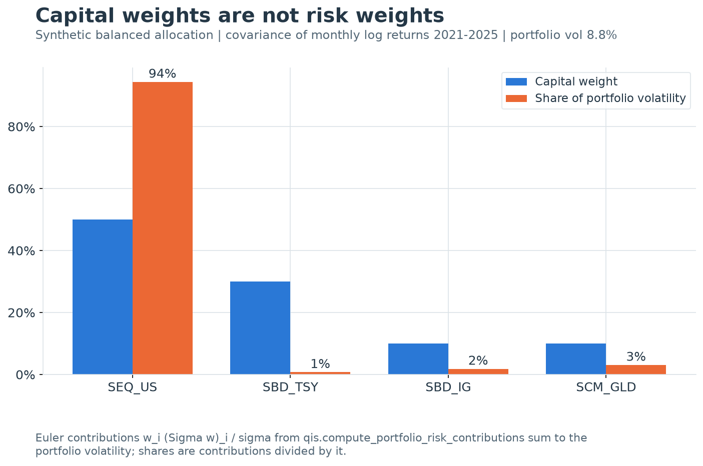

---
myst:
  html_meta:
    description: >-
      Euler decomposition of portfolio volatility, active risk and normal value at risk into
      additive position contributions, and the exact contracts of the qis covariance, EWM and
      VaR functions that compute them.
---

# Portfolio risk and Euler contributions

*Author: [Artur Sepp](https://github.com/ArturSepp)*

Implemented in [qis — Quantitative Investment Strategies](https://github.com/ArturSepp/QuantInvestStrats).
Software citation: [CITATION.cff](https://github.com/ArturSepp/QuantInvestStrats/blob/main/CITATION.cff).

A risk contribution assigns to each position a part of a portfolio risk measure so that the parts
add up to the whole. For volatility, and for any risk measure that scales linearly with position
size, Euler's theorem gives the additive split that is consistent with marginal analysis: a
position contributes its weight times the marginal risk of that weight. This chapter derives the
decomposition for total and active risk, carries it to exponentially weighted covariances and to
normal value at risk, and states what each qis function computes, including where an
implementation departs from the textbook definition.

## Overview

The chapter is the reference for Euler contributions in qis. The
[tracking-error chapter](tracking_error_and_risk.md) applies the same identity to active weights,
and the [portfolio-breadth chapter](portfolio_breadth.md) turns absolute Euler shares into an
effective number of risk contributors; neither result is repeated here.

| Question | qis entry point | Output |
|---|---|---|
| How much of portfolio volatility does each position carry? | `compute_portfolio_risk_contributions` | Euler contributions in volatility units, summing to $\sigma_p$ |
| What share of the risk is that? | `compute_portfolio_risk_contribution_ratios`, `compute_group_portfolio_risk_contribution_ratios` | Signed shares summing to one |
| How does each active position drive tracking error? | `RiskModel.compute_marginal_tre_at_date`, `compute_benchmark_portfolio_risk_contributions` | Euler contributions summing to $\mathrm{TE}$ |
| How has portfolio volatility evolved? | `compute_portfolio_vol`, `PortfolioData.compute_portfolio_vol` | Point-in-time EWM volatility of the held weights |
| What is the one-day 99% loss under normality? | `compute_portfolio_correlated_var_by_groups`, `compute_portfolio_independent_var_by_ac` | Diversified and undiversified VaR from one covariance |
| Which instruments drove realised P&L volatility? | `PortfolioData.get_instruments_pnl_risk_attribution` | Ex-post Euler shares of the P&L variance, summing to one |

Three results carry the chapter: Euler's theorem makes contributions add up exactly; the
contribution of a position equals its standalone risk times its correlation with the portfolio,
so hedges contribute negatively; and the sum of standalone risks bounds diversified risk from
above, which is why an undiversified VaR is never below a correlated one for the same inputs.

## Inputs, notation, and assumptions

| Convention | This article |
|---|---|
| Return basis | Static contributions take $\Sigma$ as supplied; the VaR functions use log returns; `compute_portfolio_vol` uses the caller's returns; `PortfolioData.compute_portfolio_vol` and the P&L shares use simple returns |
| Sampling grid | The covariance's own grid; `freq='B'` for the VaR functions; `W-WED` for `PortfolioData.compute_portfolio_vol` |
| Annualisation | None for contributions and VaR, which keep the units of $\Sigma$ or of one period; `annualize=True` multiplies the variance by $\mathrm{AN}$, so the volatility scales by $\sqrt{\mathrm{AN}}$; the VaR cap converts annual volatilities to one day with $\mathrm{AN}=252$ |
| Mean adjustment | None by default: EWM second moments about zero (`MeanAdjType.NONE`); P&L risk shares are sample covariances about the sample means |
| Timing | Static weights and $\Sigma$ share one date; EWM volatility pairs $w_{t-1}$ with $\hat\Sigma_t$, which includes $r_t$; the VaR functions pair $w_t$ with $\hat\Sigma_t$; every recursion starts from a zero matrix, so no estimate uses a later observation |
| Output units | Contributions in the volatility units of $\Sigma$; ratios dimensionless and summing to one; VaR as a decimal fraction of NAV per period; VaR limits in basis points |
| qis default | `compute_portfolio_vol(span=None, ewm_lambda=0.94, annualize=False, weight_lag=1)`; VaR functions `freq='B'`, `vol_span=33`; `limit_weights_to_max_var_limit(max_var_limit_bp=25.0, annualization_factor=252.0)` |

| Symbol or input | Meaning | Units and convention |
|---|---|---|
| $w$, $w_i$ | Weight vector; weight of asset $i$ | Signed decimal fractions of NAV, aligned to the covariance labels |
| $w_p$, $w_b$, $d$ | Portfolio, benchmark and active weights, $d=w_p-w_b$ | As in the tracking-error chapter |
| $n$ | Number of assets in the covariance universe | Count |
| $\Sigma$ | Covariance matrix of asset returns | Symmetric positive semi-definite; its units carry to every result |
| $\sigma_i$, $\sigma_p$, $\sigma_b$ | Asset, portfolio and benchmark volatility | $\sigma_i=\sqrt{\Sigma_{ii}}$, $\sigma_p=\sqrt{w^{\top}\Sigma w}$ |
| $\mathrm{MRC}_i$ | Marginal risk contribution | Volatility per unit of weight |
| $\mathrm{RC}_i$ | Euler risk contribution | Volatility units; sums to $\sigma_p$ |
| $c_i$ | Euler contribution to tracking error | Volatility units; sums to $\mathrm{TE}$ |
| $\kappa_i$ | Percentage contribution, $\mathrm{RC}_i/\sigma_p$ | Dimensionless; sums to one; may be negative or exceed one |
| $\beta_{i,p}$, $\rho_{i,p}$ | Beta and correlation of asset $i$ with the portfolio | Dimensionless |
| $g$, $\mathcal{A}_g$ | Group label; set of assets in group $g$ | A partition of the covariance universe |
| $f$, $\theta$ | A risk measure of the weights; a positive scalar | Used in Euler's theorem |
| $h$ | Finite-difference step | Weight units |
| $K$, $B$ | Number of factors; loading matrix | $K\times n$ in `contributions.py`, $n\times K$ in `RiskModel` |
| $\Sigma_x$, $\Psi$ | Factor covariance; diagonal residual variance | Units of $\Sigma$ |
| $e$, $m$ | Active factor exposures $Bd$; gradient of active variance | $K$-vector; $n$-vector |
| $\hat\Sigma_t$, $\hat\Sigma_0$ | EWM covariance at $t$; its seed before the first observation | $\hat\Sigma_t$ includes $r_t r_t^{\top}$; $\hat\Sigma_0=0$ unless `covar0` is passed |
| $\delta$ | Tolerance on the weight of the seed | Dimensionless |
| $z_{0.99}$ | One-sided 99% standard normal quantile | 2.3263 in qis (`VAR99`) |
| $\mathrm{VaR}$, $L$ | Value at risk; portfolio loss $-r_p$ | Decimal fraction of NAV over one period |
| $L_{\mathrm{bp}}$ | VaR limit per instrument | Basis points of NAV |
| $\mathrm{DR}$ | Diversification ratio | Dimensionless, at least one |
| $x_{i,t}$, $x_{p,t}$ | P&L contribution of instrument $i$; portfolio P&L | Decimal fraction of the preceding NAV |

The covariance is an input, not an estimate made by the contribution functions: its units,
frequency, return basis and information set are the caller's.
`compute_portfolio_risk_contributions` and its two ratio variants align a labelled weight Series
to the covariance index, fill missing weights with zero and silently drop weights outside the
covariance universe. `RiskModel` instead rejects material out-of-universe weights in strict mode.
Contributions are defined for $\sigma_p>0$; a non-positive quadratic form, which a covariance that
is not positive semi-definite can produce, returns zeros. Dated covariance matrices for these
functions and for `RiskModel` are usually produced by `qis.estimate_rolling_ewma_covar`, which
returns one annualised matrix per rebalancing date; its estimator is the subject of the
[covariance chapter](covariance_correlation_pca.md). Before an asset's first return that
estimator leaves its row and column NaN. The contribution functions treat an asset with a NaN
variance as unavailable: at zero weight it is ignored and receives a zero contribution, and when
held all contributions are NaN, because the portfolio's risk is unknown.

## Methodology

### Portfolio variance and volatility

**Definition.** For weights $w$ and covariance $\Sigma$, the portfolio variance and volatility are

$$
\sigma_p^2=w^{\top}\Sigma w=\sum_{i=1}^{n}\sum_{j=1}^{n}w_i w_j\Sigma_{ij},
\qquad
\sigma_p=\sqrt{w^{\top}\Sigma w}.
$$

If $r$ has covariance $\Sigma$, then $\operatorname{Var}(w^{\top}r)=w^{\top}\Sigma w$, so
$\sigma_p$ is the volatility of the portfolio return for fixed weights. With realised weights
$w_{t-1}$ it is the volatility of $r_{p,t}=\sum_i w_{i,t-1}r_{i,t}$ as in the
[aggregation identity](notation_and_conventions.md). The function $w\mapsto\sigma_p(w)$ is a
seminorm: $\sigma_p(w)=\lVert\Sigma^{1/2}w\rVert_2$.

### Euler's theorem and marginal contributions

**Proposition (Euler's theorem).** Let $f$ be differentiable and positively homogeneous of
degree $k$, that is $f(\theta w)=\theta^{k}f(w)$ for all $\theta>0$. Then

$$
\sum_{i=1}^{n}w_i\,\frac{\partial f}{\partial w_i}(w)=k\,f(w).
$$

**Proof.** Differentiate both sides of $f(\theta w)=\theta^{k}f(w)$ with respect to $\theta$ and
set $\theta=1$. The left side gives $\sum_i w_i\,\partial_i f(w)$ by the chain rule; the right
side gives $k f(w)$. $\square$

Volatility is homogeneous of degree one, $\sigma_p(\theta w)=\theta\sigma_p(w)$; variance is of
degree two. Doubling every position doubles volatility, so volatility can be split in proportion
to marginal risk.

**Proposition (marginal risk contribution).** For $\sigma_p>0$,

$$
\mathrm{MRC}_i=\frac{\partial\sigma_p}{\partial w_i}=\frac{(\Sigma w)_i}{\sigma_p}.
$$

**Proof.** Since $\Sigma$ is symmetric, $\partial(w^{\top}\Sigma w)/\partial w=2\Sigma w$. By the
chain rule, $\partial\sigma_p/\partial w=\tfrac{1}{2}(w^{\top}\Sigma w)^{-1/2}\,2\Sigma w
=\Sigma w/\sigma_p$. $\square$

**Definition.** The Euler risk contribution and the percentage contribution of asset $i$ are

$$
\mathrm{RC}_i=w_i\,\mathrm{MRC}_i=\frac{w_i(\Sigma w)_i}{\sigma_p},
\qquad
\kappa_i=\frac{\mathrm{RC}_i}{\sigma_p}=\frac{w_i(\Sigma w)_i}{w^{\top}\Sigma w}.
$$

**Proposition (full allocation).** $\sum_i\mathrm{RC}_i=\sigma_p$ and $\sum_i\kappa_i=1$.

**Proof.** Apply Euler's theorem with $k=1$ to $f=\sigma_p$, or directly:
$\sum_i w_i(\Sigma w)_i/\sigma_p=w^{\top}\Sigma w/\sigma_p=\sigma_p$. Divide by $\sigma_p$ for
the shares. $\square$

The allocation is exact, not a first-order approximation: the contributions of the current
weights add up to the current volatility. What is first-order is the *change*: a small trade
$\Delta w_i$ changes $\sigma_p$ by about $\mathrm{MRC}_i\,\Delta w_i$, not by the change in
$\mathrm{RC}_i$. [Tasche (2008)](https://arxiv.org/abs/0708.2542) shows that for a positively
homogeneous, differentiable risk measure the Euler allocation is the only one compatible with
return-on-risk performance measurement: increasing a position whose return-to-marginal-risk ratio
exceeds the portfolio's improves the portfolio ratio.

**Identity (beta and correlation form).** With $\beta_{i,p}=\operatorname{Cov}(r_i,r_p)/\sigma_p^2$
and $\rho_{i,p}$ the correlation of $r_i$ with $r_p$,

$$
\kappa_i=w_i\,\beta_{i,p},
\qquad
\mathrm{RC}_i=w_i\,\sigma_i\,\rho_{i,p}.
$$

**Proof.** $\operatorname{Cov}(r_i,r_p)=\operatorname{Cov}(r_i,\sum_j w_j r_j)=(\Sigma w)_i$, which
equals $\rho_{i,p}\sigma_i\sigma_p$. Substitute into the definitions. $\square$

A contribution is therefore the standalone risk $\lvert w_i\rvert\sigma_i$ scaled by a signed
correlation with the portfolio. It never exceeds the standalone risk in absolute value.



[Open full-resolution preview](images/handbook_risk_contributions.png).

The exhibit applies `qis.compute_portfolio_risk_contributions` to a 50/30/10/10 allocation to
synthetic US equity, Treasuries, investment-grade credit and gold, with the covariance of monthly
log returns over 2021–2025. The portfolio volatility is 8.8%. Equity holds half of the capital
and 94% of the risk; the Treasury sleeve, with 30% of the capital, contributes 1%, because its
volatility is a third of equity's and its correlation with equity is slightly negative, −0.16.
A balanced capital allocation can be an equity allocation in risk terms.

### Interpretation as expected loss contributions

[Litterman (1996)](#references) reads the largest contributions as the portfolio's hot spots and a
negative contribution as a hedge: increasing that position lowers volatility at the margin.
[Qian (2006)](#references) gives percentage contributions a direct loss interpretation.

**Proposition (loss contributions under normality).** Let $r$ be jointly normal with zero mean and
let $L=-r_p$ be the portfolio loss. For every loss level $\ell$,

$$
\mathbb{E}\!\left[-w_i r_i\,\middle|\,L=\ell\right]=\kappa_i\,\ell .
$$

**Proof.** The pair $(-w_i r_i,L)$ is bivariate normal with zero means, so
$\mathbb{E}[-w_i r_i\mid L=\ell]=\operatorname{Cov}(-w_i r_i,L)\,\ell/\operatorname{Var}(L)$.
The covariance is $w_i(\Sigma w)_i$ and the variance is $\sigma_p^2$. $\square$

A percentage contribution is the expected share of a portfolio loss, of any size, borne by the
position. Risk budgets therefore "add up" to loss budgets, not only to a variance decomposition.

**Identity (best hedge).** Holding the other weights fixed, the volatility-minimising weight of
asset $i$ and the contribution there are

$$
w_i^{\mathrm{hedge}}=w_i-\frac{(\Sigma w)_i}{\Sigma_{ii}},
\qquad
\mathrm{RC}_i\big(w^{\mathrm{hedge}}\big)=0 .
$$

**Proof.** $\sigma_p^2$ is a convex quadratic in $w_i$ with derivative $2(\Sigma w)_i$, and
changing $w_i$ by $\Delta$ changes $(\Sigma w)_i$ by $\Sigma_{ii}\Delta$. The derivative vanishes
at $\Delta=-(\Sigma w)_i/\Sigma_{ii}$, where the marginal, hence the Euler, contribution is
zero. $\square$

### Percentage contributions, groups and hedges

For a partition of the assets into groups $\mathcal{A}_g$, group contributions are sums of asset
contributions, $\kappa_g=\sum_{i\in\mathcal{A}_g}\kappa_i$, and still sum to one. This differs
from the standalone risk of a group, $\sigma_p$ evaluated on the group's weights alone, which
omits cross-group covariance and is not additive.

A contribution is negative exactly when $w_i\beta_{i,p}<0$: a long position in an asset that
moves against the portfolio, or a short in one that moves with it. Because the shares sum to one,
a negative share forces the others above one in total; with a hedge, a group of risk assets
typically carries more than 100% of the risk.

> **Insight.** A hedge can reduce volatility while its own standalone volatility is large. Its
> Euler contribution is negative, and the positions it hedges carry more than the whole
> portfolio risk between them. Standalone shares, which are always positive, report the hedge
> as a source of risk instead.

Risk budgeting chooses weights so that $\kappa_i$ equals a prescribed budget $b_i$; risk parity is
the case $b_i=1/n$ ([Roncalli, 2013](#references)). qis computes the diagnostics; constructing such
portfolios belongs to the `optimalportfolios` package.

### Benchmark-relative contributions

For active weights $d=w_p-w_b$ and $\mathrm{TE}=\sqrt{d^{\top}\Sigma d}$, Euler's theorem gives
contributions

$$
c_i=\frac{d_i(\Sigma d)_i}{\mathrm{TE}},
\qquad
\sum_i c_i=\mathrm{TE},
$$

because $\mathrm{TE}$ is the portfolio volatility of the vector $d$. The dated implementation is
`RiskModel.compute_marginal_tre_at_date`, column `mcte`, documented with its alignment policy,
grouping and zero-TE convention in the [tracking-error chapter](tracking_error_and_risk.md).
`compute_benchmark_portfolio_risk_contributions` returns the same $c_i$ for one covariance
matrix: it aligns both weight vectors to the covariance labels (a missing label is a zero weight,
a label outside the covariance is dropped), forms $d$ and applies
`compute_portfolio_risk_contributions` to it. The result is in covariance order, a zero benchmark
gives the Euler split of the portfolio itself, and a zero tracking error gives zeros, as in
`RiskModel`. With `is_independent_risk=True` it returns the standalone active risks
$\lvert d_i\rvert\sigma_i$ instead. Despite the argument name, these are not contributions under
a diagonal covariance, which would be $d_i^2\sigma_i^2$ divided by the diagonal tracking error;
their sum bounds $\mathrm{TE}$ from above by the undiversified-risk proposition below.

Earlier qis versions divided $d_i(\Sigma d)_i$ by the benchmark volatility
$\sigma_b=\sqrt{w_b^{\top}\Sigma w_b}$ instead of by $\mathrm{TE}$. Those figures had the same
shares but summed to $\mathrm{TE}^2/\sigma_b$, were undefined for a zero benchmark, and aligned
only the portfolio weights to the covariance. Multiplying the current output by
$\mathrm{TE}/\sigma_b$ reproduces them.

### Factor-model decomposition of active risk

Two internal helpers in `qis.portfolio.risk.contributions`, `calculate_active_risk_squared` and
`calculate_marginal_active_risk`, decompose active *variance* under a factor model. Their
`asset_betas` argument is a $K\times n$ array, one row per factor, so the active factor exposures
are $e=Bd$. With factor covariance $\Sigma_x$ and residual variances
$\Psi=\operatorname{diag}(\psi_1,\ldots,\psi_n)$ they return

$$
\mathrm{TE}^2=e^{\top}\Sigma_x e+d^{\top}\Psi d,
\qquad
m=\underbrace{2B^{\top}\Sigma_x e}_{\text{systematic}}
+\underbrace{2\Psi d}_{\text{idiosyncratic}}
=\nabla_{w_p}\mathrm{TE}^2 .
$$

The implied asset covariance is $B^{\top}\Sigma_x B+\Psi$. Both functions take arrays, apply no
label alignment and no annualisation. `calculate_marginal_active_risk` returns the tuple
$(m,\ m^{\mathrm{sys}},\ m^{\mathrm{idio}})$: marginal active *variance*, including the factor 2.

**Identity (degree-two Euler).** $\sum_i d_i m_i=2\,\mathrm{TE}^2$, so
$d_i m_i/(2\,\mathrm{TE})$ are Euler contributions to $\mathrm{TE}$ and $d_i m_i/(2\,\mathrm{TE}^2)$
are shares summing to one; the systematic and idiosyncratic parts split each contribution.

**Proof.** $\mathrm{TE}^2$ is homogeneous of degree two in $d$; apply Euler's theorem with
$k=2$. $\square$

`RiskModel` stores `factor_loadings` as $n\times K$ (assets by factors), the transpose of this
orientation. Its `mcte_systematic` and `mcte_residual` columns equal
$d_i m^{\mathrm{sys}}_i/(2\,\mathrm{TE})$ and $d_i m^{\mathrm{idio}}_i/(2\,\mathrm{TE})$, where
$\mathrm{TE}$ comes from the supplied full covariance; the two agree when that covariance equals
$B^{\top}\Sigma_x B+\Psi$.

### Time-varying portfolio volatility from EWM covariances

`compute_portfolio_vol` runs the EWM covariance recursion on the rows $t=1,\ldots,T$ of the
aligned return panel and, by default, contracts each matrix with the previous row's weights:

$$
\hat\Sigma_t=(1-\lambda)\,r_t r_t^{\top}+\lambda\,\hat\Sigma_{t-1},
\qquad
\hat\Sigma_0=0,
\qquad
\hat\sigma^2_{p,t}=w_{t-1}^{\top}\,\hat\Sigma_t\,w_{t-1},
$$

with $\lambda=1-2/(N+1)$ when `span` $N$ is given and `ewm_lambda` otherwise; the default
$\lambda=0.94$ is the RiskMetrics daily decay ([J.P. Morgan and Reuters, 1996](#references)). With
`annualize=True` the variance is multiplied by $\mathrm{AN}$, inferred from the weights' index,
and `is_return_vol=True` returns $\sqrt{\mathrm{AN}\,\hat\sigma^2_{p,t}}$. The weights applied
over $(t-1,t]$ meet a covariance updated by the return $r_t$ they earn. The estimate is the EWM
variance of the held portfolio as of $t$, not a forecast for $(t,t+1]$; that forecast pairs
$w_t$ with $\hat\Sigma_t$ and is what `weight_lag=0` returns. Missing returns and weights are set
to zero before the recursion, so a gap decays the covariance rather than holding it; for that
reason the `nan_backfill` argument has no effect. The optional `mean_adj_type` demeans the
returns first: `MeanAdjType.EXPANDING` and `MeanAdjType.EWMA` are point in time, while
`MeanAdjType.INSAMPLE` subtracts the full-sample mean and is forward-looking.

**Implementation contract (seed).** The recursion starts from the zero matrix before the first
row, so the estimate on a date uses the returns up to that date and nothing later. The requested
decay, from `span` or `ewm_lambda`, applies to every step. `init_type` seeds only the running
mean of the optional mean adjustment. `compute_portfolio_var_np`, the Numba kernel underneath,
accepts an explicit seed `covar0`, for example a covariance estimated on a window that ends before
the sample starts.

**Proposition (weight of the seed).** Unrolling the recursion,

$$
\hat\Sigma_t=(1-\lambda)\sum_{k=0}^{t-1}\lambda^{k}\,r_{t-k}r_{t-k}^{\top}
+\lambda^{t}\,\hat\Sigma_0 ,
$$

so the seed's weight at row $t$ is $\lambda^{t}$, which falls below $\delta$ once
$t\ge\log\delta/\log\lambda$.

**Proof.** Substitute the recursion into itself $t$ times; each substitution multiplies the
remaining seed term by $\lambda$. $\square$

**Identity (warm-up bias of the zero seed).** If the returns have zero mean and a constant
covariance $\Sigma$, the zero-seeded estimate satisfies

$$
\mathbb{E}\big[\hat\Sigma_t\big]=\big(1-\lambda^{t}\big)\,\Sigma .
$$

**Proof.** Take expectations in the unrolled recursion with $\hat\Sigma_0=0$. Each term has
$\mathbb{E}[r_{t-k}r_{t-k}^{\top}]=\Sigma$, and the weights sum to
$(1-\lambda)\sum_{k=0}^{t-1}\lambda^{k}=1-\lambda^{t}$. $\square$

For $N=33$, $\lambda=0.9412$ and the seed weight falls below 1% after 76 observations. On the
second observation the zero-seeded volatility is on average $\sqrt{1-\lambda^{2}}\approx34\%$ of
the stationary level.

> **Pitfall.** A point-in-time recursion is biased low until the seed has decayed, so the first
> spans of `compute_portfolio_vol` and of both VaR functions understate risk. Discard at least
> $\log\delta/\log\lambda$ leading observations, for example with the `time_period` argument of
> the VaR functions, or pass a pre-sample covariance as `covar0`. Do not seed with an estimate
> from the same sample: its final state carries information from the end of the sample into
> every early estimate. Earlier qis versions did exactly that, seeding with the full-sample final
> state at the fixed decay 0.94.

`PortfolioData.compute_portfolio_vol(time_period=None, freq='W-WED', span=13)` applies this to a
backtest: simple instrument returns on the `freq` grid, realised weights forward-filled to the
same dates, `annualize=True`, and beside it the EWM volatility of the portfolio's simple NAV
returns on the same grid. The two columns, `instrument weighted vol` and `strategy returns vol`,
use one return basis and one warm-up; they differ by weight drift and rebalancing between grid
dates, by costs and fees, and because the first applies the latest weights to the whole
covariance memory while the second weights each past return by the weights then held.

For dated covariance matrices estimated elsewhere, the `PortfolioData` methods
`compute_ex_anti_portfolio_vol_implied_by_covar` and `compute_risk_contributions_implied_by_covar`
evaluate $\sigma_p$ and $\mathrm{RC}_i$ with point-in-time weights. With `freq=None` they evaluate
each covariance date with the input weights (the realised weights when the input was not a
DataFrame) as of that date: the latest weights dated at or before it, and zero before the first
weight date, the policy of `RiskModel`. With `freq` set they evaluate each date of the realised
weights on that grid with the latest covariance at or before it. `normalise=True` rescales each
row of contributions to sum to one. Earlier qis versions matched `freq=None` weights to
covariance dates by exact date only and reported zero risk wherever the two calendars differed.

### Parametric value at risk

**Definition.** If the one-period portfolio loss is $L=-r_p\sim\mathcal{N}(0,\sigma_p^2)$, the
99% value at risk is the 99% quantile of $L$:

$$
\mathrm{VaR}_{0.99}=z_{0.99}\,\sigma_p,
\qquad
z_{0.99}=\Phi^{-1}(0.99)=2.32635\ldots
$$

qis fixes $z_{0.99}$ at 2.3263. The assumptions are normality, a zero mean and a one-period
horizon; a non-zero mean would subtract the expected return, and fat tails make the normal
quantile too small ([Jorion, 2006](#references)). Because $\mathrm{VaR}_{0.99}$ is a fixed
multiple of $\sigma_p$, it inherits the Euler decomposition: $z_{0.99}\mathrm{RC}_i$ are component
VaRs summing to the portfolio VaR, and $z_{0.99}\mathrm{MRC}_i$ is the marginal VaR.

The two qis VaR functions compute log returns on `freq` (default `B`), run the zero-seeded EWM
covariance recursion of span `vol_span` (default 33) on the dates shared by weights and returns,
and apply no annualisation:

$$
\mathrm{VaR}^{\mathrm{corr}}_{g,t}=z_{0.99}\sqrt{w_{g,t}^{\top}\,\hat\Sigma_{g,t}\,w_{g,t}},
\qquad
\mathrm{VaR}^{\mathrm{ind}}_{i,t}=z_{0.99}\,\lvert w_{i,t}\rvert\,\hat\sigma_{i,t},
\qquad
\hat\sigma_{i,t}^{2}=\big(\hat\Sigma_t\big)_{ii}.
$$

Both figures pair the weights of date $t$ with the covariance of the returns up to $t$, both
known at $t$: they are the one-period VaR of the current positions. The undiversified figure uses
the diagonal of the same $\hat\Sigma_t$ as the correlated one, not a separate volatility
estimate. `compute_portfolio_correlated_var_by_groups` evaluates the first on each group's own
weights and covariance, $w_g$ and $\hat\Sigma_g$, through `compute_portfolio_vol(weight_lag=0)`,
plus a `Total` column over all assets; without `group_data` it returns one column, `Total VAR`.
Group figures are standalone and do not add to the total. `compute_portfolio_independent_var_by_ac`
returns the instrument figures and their sums by group, with the total as the sum over all
instruments. That sum assumes every pair of positions is perfectly aligned; it is the
undiversified figure, not a figure for independent assets, which would be
$z_{0.99}\sqrt{\sum_i w_i^2\hat\sigma_i^2}$.

**Proposition (undiversified bound and subadditivity).** For any weights and any valid covariance,

$$
\sigma_p(w)\;\le\;\sum_g\sigma_p(w_g)\;\le\;\sum_{i=1}^{n}\lvert w_i\rvert\,\sigma_i ,
$$

where $w_g$ keeps the weights of group $g$ and sets the others to zero. Multiplying by
$z_{0.99}$, the correlated total VaR is at most the sum of correlated group VaRs, which is at most
the sum of standalone VaRs. Equality in the outer bound holds when every pair of held positions
has $\rho_{ij}\operatorname{sign}(w_i w_j)=1$.

**Proof.** $\sigma_p(w)=\lVert\Sigma^{1/2}w\rVert_2$ is a seminorm and $w=\sum_g w_g$, so the
triangle inequality gives the first bound; applying it again within each group, to single-asset
vectors with $\sigma_p(w_i e_i)=\lvert w_i\rvert\sigma_i$, gives the second. Alternatively,
$\sigma_p=\sum_i w_i\sigma_i\rho_{i,p}\le\sum_i\lvert w_i\rvert\sigma_i$ because
$\lvert\rho_{i,p}\rvert\le1$. $\square$

Normal VaR is subadditive because it is proportional to a standard deviation; a quantile of a
non-elliptical loss distribution need not be. The ratio of the two figures,

$$
\mathrm{DR}=\frac{\sum_i\lvert w_i\rvert\sigma_i}{\sigma_p}\ \ge 1,
$$

is the diversification ratio of
[Choueifaty and Coignard (2008)](https://doi.org/10.3905/JPM.2008.35.1.40), written with absolute
weights.

> **Insight.** The proposition holds for one pair $(w,\hat\Sigma)$, and the two qis functions share
> that pair on every date, warm-up and rebalancing dates included: same weights, same returns,
> same seed, same decay. The reported undiversified VaR is therefore never below the correlated
> one, and their ratio is the diversification ratio on each date. Earlier qis versions lagged the
> correlated figure's weights and seeded it from the full sample, so the order could invert.

`limit_weights_to_max_var_limit(weights, vols, max_var_limit_bp=25.0, annualization_factor=252.0)`
takes volatilities $\sigma_i$ annualised with $\mathrm{AN}$, converts them to one period with
$\sqrt{\mathrm{AN}}$, and caps each weight whose standalone one-period VaR exceeds the limit:

$$
\mathrm{VaR}^{\mathrm{bp}}_i=10^{4}\,z_{0.99}\,\lvert w_i\rvert\,\frac{\sigma_i}{\sqrt{\mathrm{AN}}},
\qquad
w_i\leftarrow\operatorname{sign}(w_i)\,\frac{L_{\mathrm{bp}}\sqrt{\mathrm{AN}}}{10^{4}z_{0.99}\,\sigma_i}
\quad\text{if }\mathrm{VaR}^{\mathrm{bp}}_i>L_{\mathrm{bp}} .
$$

The cap is per instrument and ignores correlation. The default $\mathrm{AN}=252$ is the factor qis
applies to business-day returns, so volatilities from `compute_ewm_vol(..., annualize=True)` on a
`B` grid convert back to one day exactly. The former default of 260 understated the one-day VaR by
the factor $\sqrt{252/260}\approx0.985$ and let a capped position run about 1.6% above the limit;
pass `annualization_factor=260` to reproduce it.

### Realised P&L risk attribution

A backtest records the arithmetic P&L contribution $x_{i,t}=w_{i,t-1}r_{i,t}$, with realised
weights and simple returns, and $x_{p,t}=\sum_i x_{i,t}$ is the portfolio return when there are
no costs or fees. The ex-post counterpart of the Euler decomposition replaces $\Sigma$ by the
sample covariance of these P&L series.

**Proposition (ex-post Euler decomposition).** With sample covariances,

$$
\sum_i\frac{\widehat{\operatorname{Cov}}(x_i,x_p)}{s(x_p)}=s(x_p),
\qquad
\sum_i\frac{\widehat{\operatorname{Cov}}(x_i,x_p)}{s(x_p)^2}=1 .
$$

**Proof.** The sample covariance is bilinear, so
$\sum_i\widehat{\operatorname{Cov}}(x_i,x_p)=\widehat{\operatorname{Cov}}(x_p,x_p)=s(x_p)^2$.
$\square$

The ex-post Euler share of instrument $i$ is the regression slope of its P&L on the portfolio
P&L. `PortfolioData.get_instruments_pnl_risk_attribution` returns these shares, computed on the
gross P&L of `get_instruments_pnl` with missing values counted as zero, and they are the
`AttributionMetric.PNL_RISK` panels of the strategy factsheet ('P&L Risk Attribution,
sum=100%'). The divisor of the covariance cancels, so the shares do not depend on `ddof`;
multiplied by $s(x_p)$ they are contributions to the realised P&L volatility. A hedge that lowered
the realised volatility has a negative share, and the factsheet panel then shows both tails. A
portfolio P&L without variance has no risk to attribute and returns NaN.

With `is_standalone=True` the method returns the *standalone* volatility shares that earlier qis
versions reported by default:

$$
\hat\sigma^{0}_i=\sqrt{\frac{1}{T_i}\sum_{t:\,x_{i,t}\ne0}\big(x_{i,t}-\bar x_i\big)^2},
\qquad
\text{share}_i=\frac{\hat\sigma^{0}_i}{\sum_j\hat\sigma^{0}_j},
$$

where the sum runs over the $T_i$ dates with a non-zero contribution and the standard deviation
uses `ddof=0`. These shares are non-negative, ignore correlation and sum to one by normalisation
only. The standalone volatilities add up to more than the portfolio volatility whenever the
instruments are imperfectly correlated, so no risk measure is being allocated, and a hedge
appears with a positive share.

## Worked example

### A three-asset portfolio with a hedge

An equity sleeve, a credit sleeve and a hedge have annualised volatilities of 20%, 10% and 15%.
Equity and credit have correlation 0.5; the hedge has correlation −0.6 with equity and −0.2 with
credit. Weights are 50%, 30% and 20%. By hand, $\Sigma w=(0.0194,\ 0.0074,\ -0.0054)$ and

$$
\sigma_p^2=0.5\cdot0.0194+0.3\cdot0.0074-0.2\cdot0.0054=0.01084,
\qquad
\sigma_p\approx10.41\%.
$$

The Euler contributions are 9.32%, 2.13% and −1.04% of NAV, summing to 10.41%; the percentage
contributions are 89.5%, 20.5% and −10.0%, so the two risk assets carry 110.0% of the risk. The
marginal contribution of the hedge is $-0.0054/0.1041\approx-0.0519$: adding one percentage point
of hedge lowers volatility by about 0.052 percentage points. The best hedge is
$0.2+0.0054/0.0225=44\%$, where volatility falls to 9.77%. The standalone risks are 10%, 3% and
3%, giving standalone shares of 62.5%, 18.75% and 18.75% and a diversification ratio of 1.537.
On a one-day horizon ($\sqrt{252}$), the correlated 99% VaR is 1.53% of NAV against 2.34%
undiversified; a 100 bp per-instrument VaR limit caps only the equity weight, at 34.12%.

```python
from math import isclose, sqrt

import numpy as np
import pandas as pd
import qis

assets = ['Equity', 'Credit', 'Hedge']
vols = np.array([0.20, 0.10, 0.15])
corr = np.array([[1.0, 0.5, -0.6],
                 [0.5, 1.0, -0.2],
                 [-0.6, -0.2, 1.0]])
covar = pd.DataFrame(np.outer(vols, vols) * corr, index=assets, columns=assets)
w = pd.Series([0.5, 0.3, 0.2], index=assets)

# hand arithmetic: Sigma w, portfolio volatility and the Euler contributions
sigma_w = np.array([0.0194, 0.0074, -0.0054])
np.testing.assert_allclose(covar.to_numpy() @ w.to_numpy(), sigma_w, atol=1e-15)
port_vol = sqrt(0.5 * 0.0194 + 0.3 * 0.0074 - 0.2 * 0.0054)
assert isclose(port_vol ** 2, 0.01084, abs_tol=1e-15)

rc = qis.compute_portfolio_risk_contributions(w=w, covar=covar)
np.testing.assert_allclose(rc.to_numpy(), w.to_numpy() * sigma_w / port_vol, atol=1e-15)
np.testing.assert_allclose(rc.to_numpy(), [0.093166, 0.021323, -0.010373], atol=5e-7)
assert isclose(rc.sum(), port_vol, abs_tol=1e-15) and rc['Hedge'] < 0.0

ratios = qis.compute_portfolio_risk_contribution_ratios(weights=w, covar=covar)
np.testing.assert_allclose(ratios.to_numpy(), np.array([0.0097, 0.00222, -0.00108]) / 0.01084,
                           atol=1e-14)
groups = pd.Series(['Risk assets', 'Risk assets', 'Hedges'], index=assets)
group_ratios = qis.compute_group_portfolio_risk_contribution_ratios(
    weights=w, covar=covar, groups=groups)
assert isclose(group_ratios['Risk assets'], 0.01192 / 0.01084, abs_tol=1e-14)
assert isclose(group_ratios.sum(), 1.0, abs_tol=1e-14)

# marginal contribution of the hedge against a central finite difference
def portfolio_vol(x: np.ndarray) -> float:
    return float(np.sqrt(x @ covar.to_numpy() @ x))

step = np.array([0.0, 0.0, 1e-6])
finite_difference = (portfolio_vol(w.to_numpy() + step)
                     - portfolio_vol(w.to_numpy() - step)) / 2e-6
assert isclose(finite_difference, -0.0054 / port_vol, abs_tol=1e-9)
assert isclose(finite_difference, -0.051866, abs_tol=5e-7)

# best hedge: the Euler contribution of the hedge vanishes there
best = w.copy()
best['Hedge'] = 0.2 + 0.0054 / 0.0225
assert isclose(best['Hedge'], 0.44, abs_tol=1e-12)
assert isclose(qis.compute_portfolio_risk_contributions(w=best, covar=covar)['Hedge'], 0.0,
               abs_tol=1e-15)
assert isclose(portfolio_vol(best.to_numpy()), sqrt(0.009544), abs_tol=1e-12)

# standalone risks, diversification ratio and one-day 99% VaR
standalone = np.abs(w.to_numpy()) * vols
np.testing.assert_allclose(standalone, [0.10, 0.03, 0.03], atol=1e-15)
assert isclose(standalone.sum() / port_vol, 1.5368, abs_tol=5e-5)
an = qis.get_annualization_factor('B')  # 252 business days
var_corr = 2.3263 * port_vol / sqrt(an)
var_undiversified = 2.3263 * standalone.sum() / sqrt(an)
risk_assets_vol = portfolio_vol(np.array([0.5, 0.3, 0.0]))  # sqrt(0.0139)
assert isclose(risk_assets_vol, sqrt(0.0139), abs_tol=1e-15)
assert port_vol <= risk_assets_vol + 0.03 <= standalone.sum()
assert isclose(var_corr, 0.01526, abs_tol=5e-6)
assert isclose(var_undiversified, 0.02345, abs_tol=5e-6)

capped = qis.limit_weights_to_max_var_limit(weights=w.to_numpy(), vols=vols,
                                            max_var_limit_bp=100.0)
np.testing.assert_allclose(capped, [100.0 * sqrt(252) / (23263.0 * 0.20), 0.3, 0.2], rtol=1e-12)
assert isclose(capped[0], 0.34120, abs_tol=5e-6)
```

### Active and factor-model contributions

Take a benchmark of 60% equity and 40% credit, so the active weights are $(-0.1,\ -0.1,\ 0.2)$.
By hand, $\Sigma d=(-0.0086,\ -0.0026,\ 0.0066)$, $d^{\top}\Sigma d=0.00244$ and
$\mathrm{TE}\approx4.94\%$; the benchmark volatility is $\sqrt{0.0208}\approx14.42\%$. The Euler
TE contributions are 1.74%, 0.53% and 2.67%: the hedge, which lowers total risk, is the largest
source of active risk. `compute_benchmark_portfolio_risk_contributions` returns the same three
numbers as `RiskModel`, also for a benchmark Series in another order or without its zero `Hedge`
entry; the former benchmark-volatility scaling would have reported them summing to
$\mathrm{TE}^2/\sigma_b\approx1.69\%$. Its standalone option returns 2%, 1% and 3%.

For the factor version, two factors load on the assets with rows $(1,\ 0.4,\ -0.3)$ and
$(0,\ 0.5,\ 1)$, factor variances 0.03 and 0.01 and residual variances 0.01, 0.004 and 0.0125.
The active exposures are $e=(-0.2,\ 0.15)$, so $e^{\top}\Sigma_x e=0.001425$,
$d^{\top}\Psi d=0.00064$ and $\mathrm{TE}^2=0.002065$ ($\mathrm{TE}\approx4.54\%$). The systematic
gradient is $(-0.012,\ -0.0033,\ 0.0066)$ and the idiosyncratic one $(-0.002,\ -0.0008,\ 0.005)$.

```python
w_b = pd.Series([0.6, 0.4, 0.0], index=assets)
d = w - w_b
sigma_d = np.array([-0.0086, -0.0026, 0.0066])  # hand arithmetic
np.testing.assert_allclose(covar.to_numpy() @ d.to_numpy(), sigma_d, atol=1e-15)
te, bench_vol = sqrt(0.00244), sqrt(0.0208)
assert isclose(float(d @ covar @ d), 0.00244, abs_tol=1e-15)

date = pd.Timestamp('2024-12-31')
mcte = qis.RiskModel(covar={date: covar}).compute_marginal_tre_at_date(
    benchmark_weights=w_b, portfolio_weights=w, date=date)['mcte']
np.testing.assert_allclose(mcte.to_numpy(), d.to_numpy() * sigma_d / te, atol=1e-15)
assert isclose(mcte.sum(), te, abs_tol=1e-15) and mcte.idxmax() == 'Hedge'

np.testing.assert_allclose(mcte.to_numpy(), [0.017410, 0.005264, 0.026723], atol=5e-7)

active = qis.compute_benchmark_portfolio_risk_contributions(
    w_portfolio=w, w_benchmark=w_b, covar=covar)
np.testing.assert_allclose(active.to_numpy(), mcte.to_numpy(), atol=1e-15)
assert isclose(active.sum(), te, abs_tol=1e-15)
reordered = w_b[['Hedge', 'Credit', 'Equity']].drop('Hedge')  # zero weight left out
aligned = qis.compute_benchmark_portfolio_risk_contributions(
    w_portfolio=w, w_benchmark=reordered, covar=covar)
assert aligned.index.tolist() == assets
np.testing.assert_allclose(aligned.to_numpy(), active.to_numpy(), atol=1e-15)
former_level = active * te / bench_vol  # the former benchmark-volatility scaling
assert isclose(former_level.sum(), 0.016918, abs_tol=5e-7)
standalone_active = qis.compute_benchmark_portfolio_risk_contributions(
    w_portfolio=w, w_benchmark=w_b, covar=covar, is_independent_risk=True)
np.testing.assert_allclose(standalone_active.to_numpy(), [0.02, 0.01, 0.03], atol=1e-15)
assert standalone_active.sum() >= te

# internal factor-model helpers: loadings are K x n (one row per factor)
from qis.portfolio.risk.contributions import (calculate_active_risk_squared,
                                              calculate_marginal_active_risk)

loadings = np.array([[1.0, 0.4, -0.3],
                     [0.0, 0.5, 1.0]])
factor_covar = np.diag([0.03, 0.01])
residual_var = np.array([0.01, 0.004, 0.0125])
wp_np, wb_np, d_np = w.to_numpy(), w_b.to_numpy(), d.to_numpy()
te2 = calculate_active_risk_squared(portfolio_weights=wp_np, benchmark_weights=wb_np,
                                    asset_betas=loadings, factor_covar=factor_covar,
                                    idiosyncratic_var=residual_var)
assert isclose(te2, 0.001425 + 0.00064, abs_tol=1e-15)
gradient, systematic, idiosyncratic = calculate_marginal_active_risk(
    portfolio_weights=wp_np, benchmark_weights=wb_np, asset_betas=loadings,
    factor_covar=factor_covar, idiosyncratic_var=residual_var)
np.testing.assert_allclose(systematic, [-0.012, -0.0033, 0.0066], atol=1e-15)
np.testing.assert_allclose(idiosyncratic, [-0.002, -0.0008, 0.005], atol=1e-15)
model_covar = loadings.T @ factor_covar @ loadings + np.diag(residual_var)
np.testing.assert_allclose(gradient, 2.0 * model_covar @ d_np, atol=1e-15)
assert isclose(float(d_np @ gradient), 2.0 * te2, abs_tol=1e-15)  # degree-two Euler

# RiskModel takes the n x K transpose and reports the same split of Euler TE contributions
factor_names = ['Market', 'Rates']
factor_model = qis.RiskModel(
    covar={date: pd.DataFrame(model_covar, index=assets, columns=assets)},
    factor_loadings={date: pd.DataFrame(loadings.T, index=assets, columns=factor_names)},
    factor_covar={date: pd.DataFrame(factor_covar, index=factor_names, columns=factor_names)},
    residual_vars={date: pd.Series(residual_var, index=assets)})
split = factor_model.compute_marginal_tre_at_date(benchmark_weights=w_b, portfolio_weights=w,
                                                  date=date)
te_model = sqrt(te2)
np.testing.assert_allclose(split['mcte_systematic'], d_np * systematic / (2 * te_model),
                           atol=1e-15)
np.testing.assert_allclose(split['mcte_residual'], d_np * idiosyncratic / (2 * te_model),
                           atol=1e-15)
assert isclose(split['mcte'].sum(), te_model, abs_tol=1e-15)
```

### EWM portfolio volatility and its seed

The next two blocks use three instruments of the frozen synthetic universe, `SEQ_US`, `SBD_TSY`
and `SCM_GLD`, on business days from 2022-01-03 to 2024-12-31, with constant weights of 50%, 30%
and 20% and a span of 33 days. The first estimate is zero because the lagged first weight is
missing. On the second date, 2022-01-05, `compute_portfolio_vol` reports an annualised volatility
of 1.93%. The estimate rests on two squared returns, and the zero seed still carries the weight
$\lambda^{2}=0.886$, so by the warm-up identity it is on average about a third of the stationary
level. Seeding the recursion with the final state of a full-sample EWM covariance at decay 0.94,
as earlier qis versions did, reports 8.21% on that date instead: a closer number obtained with
returns up to 2024-12-31. After 100 observations the two paths agree within 0.11%, and on
2024-12-31 both give 8.49%. Removing the later returns leaves every earlier estimate unchanged.

```python
from qis.datasets import generate_synthetic_prices

tickers = ['SEQ_US', 'SBD_TSY', 'SCM_GLD']
prices = generate_synthetic_prices(start='2022-01-03', end='2024-12-31',
                                   apply_quirks=False)[tickers]
returns = qis.to_returns(prices=prices, is_log_returns=True, drop_first=True)
weights = pd.DataFrame(np.tile([0.5, 0.3, 0.2], (len(returns), 1)),
                       index=returns.index, columns=tickers)
span = 33
decay = 1.0 - 2.0 / (span + 1.0)
port_var = qis.compute_portfolio_vol(returns=returns, weights=weights, span=span,
                                     is_return_vol=False)

r = returns.to_numpy()
w_lag = weights.shift(1).fillna(0.0).to_numpy()


def ewm_path(seed: np.ndarray, lam: float) -> list:
    state, path = seed, []
    for row in r:
        state = (1.0 - lam) * np.outer(row, row) + lam * state
        path.append(state)
    return path


point_in_time = np.array([x @ s @ x for x, s in zip(w_lag, ewm_path(np.zeros((3, 3)), decay))])
np.testing.assert_allclose(port_var.to_numpy(), point_in_time, rtol=1e-12, atol=1e-18)
ann_pit = np.sqrt(252.0 * port_var.to_numpy())
assert port_var.iloc[0] == 0.0 and port_var.index[1] == pd.Timestamp('2022-01-05')
assert isclose(ann_pit[1], 0.0193, abs_tol=5e-5) and isclose(ann_pit[-1], 0.0849, abs_tol=5e-5)
assert isclose(decay ** 2, 0.886, abs_tol=5e-4)
assert np.log(0.01) / np.log(decay) < 76.0 < np.log(0.01) / np.log(decay) + 1.0

# point in time: the estimates up to a date do not depend on later returns
truncated = qis.compute_portfolio_vol(returns=returns.iloc[:60], weights=weights.iloc[:60],
                                      span=span, is_return_vol=False)
np.testing.assert_allclose(truncated.to_numpy(), port_var.iloc[:60].to_numpy(), rtol=1e-12,
                           atol=0.0)
annualised = qis.compute_portfolio_vol(returns=returns, weights=weights, span=span,
                                       annualize=True)
assert isclose(annualised.iloc[-1], ann_pit[-1], rel_tol=1e-12)  # AN = 252 on a 'B' index
```

The Numba kernel `compute_portfolio_var_np` takes the seed as `covar0`. Passing the final state of
the full-sample recursion reproduces the former look-ahead path.

```python
full_sample_seed = ewm_path(np.zeros((3, 3)), 0.94)[-1]
seeded = np.array([x @ s @ x for x, s in zip(w_lag, ewm_path(full_sample_seed, decay))])
np.testing.assert_allclose(
    qis.compute_portfolio_var_np(returns=r, weights=w_lag, span=span, covar0=full_sample_seed),
    seeded, rtol=1e-12, atol=1e-18)

ann_seeded = np.sqrt(252.0 * seeded)
assert isclose(ann_seeded[1], 0.0821, abs_tol=5e-5)
assert np.max(np.abs(ann_seeded[100:] / ann_pit[100:] - 1.0)) < 0.0011
assert isclose(ann_seeded[-1], ann_pit[-1], rel_tol=1e-12)
```

### Correlated and undiversified VaR through time

On the same inputs, the one-day 99% VaR on 2024-12-31 is 1.244% of NAV correlated and 1.830%
undiversified, a ratio of 1.471; both reproduce from one zero-seeded EWM covariance and the
weights of the same date. From the 101st observation on, the ratio stays between 1.30 and 2.15,
and on every date, the warm-up included, the undiversified figure is at least the correlated one.

```python
var_corr = qis.compute_portfolio_correlated_var_by_groups(
    prices=prices, weights=weights, vol_span=span)['Total VAR']
instrument_var, var_undiversified = qis.compute_portfolio_independent_var_by_ac(
    prices=prices, weights=weights, vol_span=span)

covars = ewm_path(np.zeros((3, 3)), decay)
w_now = weights.to_numpy()  # the weights of each date, not lagged
expected_corr = [2.3263 * sqrt(x @ s @ x) for x, s in zip(w_now, covars)]
expected_undiversified = [2.3263 * float(np.abs(x) @ np.sqrt(np.diag(s)))
                          for x, s in zip(w_now, covars)]
np.testing.assert_allclose(var_corr.to_numpy(), expected_corr, rtol=1e-10)
np.testing.assert_allclose(var_undiversified.to_numpy(), expected_undiversified, rtol=1e-10)
assert isclose(var_corr.iloc[-1], 0.01244, abs_tol=5e-6)
assert isclose(var_undiversified.iloc[-1], 0.01830, abs_tol=5e-6)

ratio = (var_undiversified / var_corr).iloc[100:]
assert ratio.min() > 1.30 and ratio.max() < 2.15
assert (var_undiversified - var_corr).min() >= -1e-15  # the bound holds on every date
```

### Standalone versus Euler shares of realised P&L

A quarterly rebalanced backtest of the same weights, invested from the first date, has a daily
P&L volatility of 0.557%. `get_instruments_pnl_risk_attribution` reports the ex-post Euler
shares, the slopes of each instrument's P&L on the portfolio P&L: 90.5%, −1.9% and 11.3%. The
Treasury sleeve hedged the equity risk in this sample. The standalone shares, still available
with `is_standalone=True`, are 64.9%, 13.0% and 22.0% and report the hedge as 13% of the risk.

```python
portfolio = qis.backtest_model_portfolio(
    prices=prices, weights={'SEQ_US': 0.5, 'SBD_TSY': 0.3, 'SCM_GLD': 0.2},
    rebalancing_freq='QE', is_rebalanced_at_first_date=True)
euler_shares = portfolio.get_instruments_pnl_risk_attribution()

pnl = portfolio.get_instruments_pnl()
total_pnl = pnl.sum(axis=1)
nav_returns = portfolio.get_portfolio_nav().pct_change().iloc[1:]
np.testing.assert_allclose(nav_returns.to_numpy(), total_pnl.iloc[1:].to_numpy(), atol=1e-14)
slopes = pnl.apply(lambda x: np.cov(x, total_pnl)[0, 1]) / total_pnl.var()
np.testing.assert_allclose(euler_shares.to_numpy(), slopes.to_numpy(), atol=1e-12)
assert isclose(euler_shares.sum(), 1.0, abs_tol=1e-12)
np.testing.assert_allclose(euler_shares.to_numpy(), [0.905, -0.019, 0.113], atol=5e-4)
assert isclose(total_pnl.std(), 0.00557, abs_tol=5e-6)

standalone_shares = portfolio.get_instruments_pnl_risk_attribution(is_standalone=True)
nonzero_std = pnl.replace({0.0: np.nan}).std(ddof=0)
np.testing.assert_allclose(standalone_shares.to_numpy(),
                           (nonzero_std / nonzero_std.sum()).to_numpy(), atol=1e-14)
np.testing.assert_allclose(standalone_shares.to_numpy(), [0.649, 0.130, 0.220], atol=5e-4)
```

## Implementation in qis

| Quantity | Formula | qis entry point |
|---|---|---|
| Euler contribution | $w_i(\Sigma w)_i/\sigma_p$ | `qis.compute_portfolio_risk_contributions(w, covar)` |
| Percentage contribution | $\kappa_i=\mathrm{RC}_i/\sigma_p$ | `qis.compute_portfolio_risk_contribution_ratios(weights, covar)` |
| Group percentage contribution | $\sum_{i\in\mathcal{A}_g}\kappa_i$ | `qis.compute_group_portfolio_risk_contribution_ratios(weights, covar, groups)` |
| Euler TE contribution, dated | $d_i(\Sigma d)_i/\mathrm{TE}$ | `qis.RiskModel.compute_marginal_tre_at_date`, column `mcte` |
| Euler TE contribution, one matrix | $d_i(\Sigma d)_i/\mathrm{TE}$, or $\lvert d_i\rvert\sigma_i$ | `qis.compute_benchmark_portfolio_risk_contributions(..., is_independent_risk=False)` |
| Factor active variance | $e^{\top}\Sigma_x e+d^{\top}\Psi d$ | internal `qis.portfolio.risk.contributions.calculate_active_risk_squared` |
| Gradient of active variance | $2B^{\top}\Sigma_x e+2\Psi d$ | internal `qis.portfolio.risk.contributions.calculate_marginal_active_risk` |
| EWM portfolio variance path | $w_t^{\top}\hat\Sigma_t w_t$ on the rows passed, $\hat\Sigma_0$ from `covar0` or zero | `qis.compute_portfolio_var_np(returns, weights, span=None, ewm_lambda=0.94, covar0=None)` |
| EWM portfolio volatility | $\sqrt{\mathrm{AN}\,w_{t-1}^{\top}\hat\Sigma_t w_{t-1}}$; $w_t$ with `weight_lag=0` | `qis.compute_portfolio_vol(..., annualize=True, weight_lag=1)` |
| Correlated VaR by group | $z_{0.99}\sqrt{w_{g,t}^{\top}\hat\Sigma_{g,t}w_{g,t}}$ | `qis.compute_portfolio_correlated_var_by_groups` |
| Undiversified VaR | $z_{0.99}\lvert w_{i,t}\rvert\hat\sigma_{i,t}$ and group sums | `qis.compute_portfolio_independent_var_by_ac` |
| VaR weight cap | $\lvert w_i\rvert\le L_{\mathrm{bp}}\sqrt{\mathrm{AN}}/(10^{4}z_{0.99}\sigma_i)$, $\mathrm{AN}=252$ | `qis.limit_weights_to_max_var_limit` |
| Backtest EWM volatility | as above, simple returns, `W-WED`, span 13 | `PortfolioData.compute_portfolio_vol` |
| Backtest VaR | the two VaR functions on realised weights | `PortfolioData.compute_portfolio_vars(is_correlated=True, freq='B', vol_span=33)` |
| Covariance-implied risk | $\sigma_p$ and $\mathrm{RC}_i$ with as-of weights | `PortfolioData.compute_ex_anti_portfolio_vol_implied_by_covar`, `PortfolioData.compute_risk_contributions_implied_by_covar` |
| Ex-post Euler P&L risk share | $\widehat{\operatorname{Cov}}(x_i,x_p)/s(x_p)^2$ | `PortfolioData.get_instruments_pnl_risk_attribution`, `qis.AttributionMetric.PNL_RISK` |
| Standalone P&L risk share | $\hat\sigma^{0}_i/\sum_j\hat\sigma^{0}_j$ | `PortfolioData.get_instruments_pnl_risk_attribution(is_standalone=True)` |

Container contracts:

- The three static contribution functions accept a Series with a DataFrame covariance, aligned by
  label, or two NumPy arrays, checked by shape; any other combination raises `ValueError`. The
  result has the container type of the weights. The group function requires a labelled `groups`
  Series covering every covariance asset, returns groups in first-seen order and names the result
  `risk_contribution`.
- `compute_benchmark_portfolio_risk_contributions` accepts a DataFrame covariance with each weight
  vector either a Series, aligned by label, or an array in covariance order, and returns a Series
  in covariance order; with three arrays it returns an array.
- `compute_portfolio_var_np` is Numba-compiled and applies no lag: pass weights already lagged.
  `compute_portfolio_vol` aligns weights and returns on their common dates and columns, lags the
  weights by `weight_lag` rows and fills missing values with zero before calling it.
- `compute_portfolio_correlated_var_by_groups` returns a DataFrame;
  `compute_portfolio_independent_var_by_ac` returns the instrument DataFrame and the aggregate,
  which is a Series when `group_data` is `None`. Both run the recursion on the dates common to
  weights and returns and apply `time_period` after estimation, so the warm-up can lie before the
  window.
- `VAR99 = 2.3263` is a module constant of `qis.portfolio.risk.ewm_covar_risk`, not an export.

Sources:
[contributions.py](https://github.com/ArturSepp/QuantInvestStrats/blob/main/src/qis/portfolio/risk/contributions.py),
[ewm_covar_risk.py](https://github.com/ArturSepp/QuantInvestStrats/blob/main/src/qis/portfolio/risk/ewm_covar_risk.py),
[risk_model.py](https://github.com/ArturSepp/QuantInvestStrats/blob/main/src/qis/portfolio/risk/risk_model.py)
and [portfolio_data.py](https://github.com/ArturSepp/QuantInvestStrats/blob/main/src/qis/portfolio/portfolio_data.py).
The contribution tests are in
[contributions_test.py](https://github.com/ArturSepp/QuantInvestStrats/blob/main/src/qis/portfolio/risk/tests/contributions_test.py)
and
[benchmark_risk_contributions_te_test.py](https://github.com/ArturSepp/QuantInvestStrats/blob/main/src/qis/portfolio/risk/tests/benchmark_risk_contributions_te_test.py);
the point-in-time and VaR-consistency tests are in
[ewm_covar_risk_point_in_time_test.py](https://github.com/ArturSepp/QuantInvestStrats/blob/main/src/qis/portfolio/risk/tests/ewm_covar_risk_point_in_time_test.py).

API reference:

- {doc}`compute_portfolio_risk_contributions <api/generated/qis.compute_portfolio_risk_contributions>`
- {doc}`compute_portfolio_risk_contribution_ratios <api/generated/qis.compute_portfolio_risk_contribution_ratios>`
- {doc}`compute_group_portfolio_risk_contribution_ratios <api/generated/qis.compute_group_portfolio_risk_contribution_ratios>`
- {doc}`compute_benchmark_portfolio_risk_contributions <api/generated/qis.compute_benchmark_portfolio_risk_contributions>`
- {doc}`compute_portfolio_vol <api/generated/qis.compute_portfolio_vol>`
- {doc}`compute_portfolio_correlated_var_by_groups <api/generated/qis.compute_portfolio_correlated_var_by_groups>`
- {doc}`compute_portfolio_independent_var_by_ac <api/generated/qis.compute_portfolio_independent_var_by_ac>`
- {doc}`RiskModel <api/generated/qis.RiskModel>` and {doc}`PortfolioData <api/generated/qis.PortfolioData>`

## Interpretation and limitations

- Contributions are only as good as the covariance. An estimation error in $\Sigma$ moves every
  contribution, and a small portfolio volatility makes percentage contributions unstable because
  they divide by $\sigma_p^2$.
- Euler contributions describe the current portfolio at the margin. They do not say what
  volatility would be without a position: removing a position changes $\sigma_p$ by an amount
  that is neither its contribution nor its standalone risk.
- Negative and above-100% shares are features, not errors. Absolute shares, as used by the
  breadth diagnostics, measure concentration and lose the hedge sign.
- `compute_benchmark_portfolio_risk_contributions` and `RiskModel.compute_marginal_tre_at_date`
  return the same Euler TE contributions; `RiskModel` adds dated weights, strict universe checks,
  grouping and the factor split.
- The EWM volatility path is point in time but starts from a zero seed, so it is biased low during
  the warm-up. Drop the first $\log\delta/\log\lambda$ observations or pass a pre-sample
  `covar0`. With the default `weight_lag=1` it pairs held weights with a covariance that includes
  the period's return, a descriptive estimate rather than a forecast.
- Normal VaR assumes a zero mean and Gaussian losses over one period. It understates tail losses
  of fat-tailed or option-like positions, and its subadditivity is a property of the normal model.
- The `independent` VaR is the undiversified, perfectly aligned bound. It shares weights and
  covariance with the correlated VaR on every date, so the two figures can be compared on any
  date and their ratio is the diversification ratio.
- The factsheet's P&L risk attribution panel shows ex-post Euler shares of the portfolio P&L
  variance: they add up to 100%, hedges are negative, and they describe the realised sample, not
  the current portfolio. `is_standalone=True` gives the non-additive standalone view, which treats
  zero-P&L days as missing and uses `ddof=0`.

## See also

- [Tracking error and benchmark-relative risk](tracking_error_and_risk.md)
- [Portfolio breadth and allocation efficiency](portfolio_breadth.md)
- [Covariance, correlation and principal components](covariance_correlation_pca.md)
- [Exponentially weighted estimators](ewm_estimators.md)
- [Factor risk models](factor_risk_models.md)
- [Risk-adjusted returns and volatility targeting](risk_adjusted_returns.md)
- [Portfolio backtesting](portfolio_backtesting.md)
- [Notation and conventions](notation_and_conventions.md)

## References

1. Litterman, R. (1996). Hot Spots and Hedges. *Goldman Sachs Risk Management Series*. Introduces marginal risk contributions, hot spots and best hedges.
2. Qian, E. (2006). On the Financial Interpretation of Risk Contribution: Risk Budgets Do Add Up. *Journal of Investment Management*, 4(4), 41–51. Interprets percentage contributions as expected shares of a loss.
3. Tasche, D. (2008). Capital allocation to business units and sub-portfolios: the Euler principle. Working paper. [arXiv:0708.2542](https://arxiv.org/abs/0708.2542). Establishes the Euler allocation principle for homogeneous risk measures.
4. Roncalli, T. (2013). *Introduction to Risk Parity and Budgeting*. Chapman & Hall/CRC. Develops risk budgeting and risk parity on Euler contributions.
5. Jorion, P. (2006). *Value at Risk: The New Benchmark for Managing Financial Risk*, 3rd edition. McGraw-Hill. The reference for parametric, marginal and component VaR.
6. Choueifaty, Y., and Coignard, Y. (2008). Toward Maximum Diversification. *The Journal of Portfolio Management*, 35(1), 40–51. [DOI: 10.3905/JPM.2008.35.1.40](https://doi.org/10.3905/JPM.2008.35.1.40). Defines the diversification ratio.
7. J.P. Morgan and Reuters (1996). *RiskMetrics — Technical Document*, 4th edition. J.P. Morgan. Source of the 0.94 daily decay used as the qis default.
8. Sepp, A. qis: Performance analytics, portfolio backtesting, risk analysis, and factsheet reporting in Python. [Software citation metadata](https://github.com/ArturSepp/QuantInvestStrats/blob/main/CITATION.cff).
