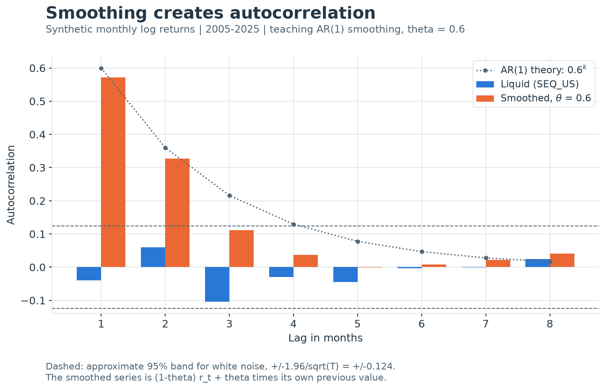

---
myst:
  html_meta:
    description: >-
      Autocorrelation of return series and its qis estimators: the full-sample ACF and lagged
      Pearson correlations, EWM autocorrelation paths, block-sum autocorrelation at longer
      horizons, and the Dimson beta for stale prices.
---

# Serial dependence and autocorrelation

*Author: [Artur Sepp](https://github.com/ArturSepp)*

Implemented in [qis — Quantitative Investment Strategies](https://github.com/ArturSepp/QuantInvestStrats).
Software citation: [CITATION.cff](https://github.com/ArturSepp/QuantInvestStrats/blob/main/CITATION.cff).

Serial dependence is correlation between a series and its own past. For a covariance-stationary
series it is summarised by the autocorrelation function $\rho_k$, the correlation between
observations $k$ periods apart. In return data it matters for three reasons: it changes how
volatility scales with the horizon, it biases betas when prices are stale, and it is the
fingerprint of smoothed or illiquid marks. This chapter defines the estimators qis implements,
states exactly where each departs from the textbook definition, and gives their sampling error.

## Overview

qis answers five questions about serial dependence:

| Question | Estimator | qis entry point |
|---|---|---|
| Is there autocorrelation at lags $1,\dots,K$ over the whole sample? | Standard sample ACF and PACF | `qis.estimate_acf_from_path`, `qis.estimate_acf_from_paths` |
| The same, with each lag as a Pearson correlation of overlapping segments | Lagged Pearson correlation | `qis.compute_autocorr_df` and the `compute_path_*` kernels |
| How does autocorrelation evolve through time? | Ratio of EWM moments | `qis.compute_ewm_vector_autocorr_df`, `qis.compute_ewm_matrix_autocorr_df`, `qis.ewm_xy_convolution` |
| Does the dependence persist at longer horizons? | Lag-one correlation of non-overlapping block sums | `qis.compute_autocorrelation_at_int_periods` |
| Does a stale asset understate its market exposure? | Dimson aggregated-coefficient beta | `qis.estimate_dimson_beta` |

Four results organise the chapter. First, the two full-sample estimators differ by an exact,
computable correction: the lagged Pearson version is larger in magnitude by roughly $T/(T-k)$,
and it equals one at every lag for a pure trend. Second, under independence every sample
autocorrelation has standard error close to $1/\sqrt{T}$, and an EWM autocorrelation with span
$N$ has standard error close to $1/\sqrt{N}$. Third, an AR(1) series with coefficient $\phi$ has
$\rho_k=\phi^k$, and its long-horizon variance is $(1+\phi)/(1-\phi)$ times the
square-root-of-time extrapolation; an appraisal-smoothing filter is exactly such a process,
which hides volatility on the reporting grid but not at long horizons. Fourth, when an
asset responds to the market with a lag, a regression on lagged market returns recovers the
total exposure, which is also the beta a long-horizon investor experiences.

## Inputs, notation, and assumptions

| Convention | This article |
|---|---|
| Return basis | Any stationary series; examples use periodic returns. For the Dimson beta, asset and market on the same basis (both total or both excess) |
| Sampling grid | The input's own index: a lag $k$ counts rows, not calendar time. Block sums use `span` rows; `ewm_xy_convolution` uses $h=\mathrm{AN}$ of `freq` rows |
| Annualisation | None: autocorrelations and betas are dimensionless. $\mathrm{AN}$ enters only through the variance-ratio scaling of $\sqrt{\mathrm{AN}}\,s(x)$ |
| Mean adjustment | Standard ACF: full-sample mean. Lagged Pearson: each overlapping segment's own mean. EWM: an EWM mean or none, per function. Dimson: OLS intercept |
| Timing | Full-sample estimators are descriptive. EWM estimates at $t$ use rows up to $t$: their states are seeded at zero by default, and a full-sample seed that looks ahead is available only on request |
| Output units | Correlations in $[-1,1]$; EWM ratios can leave that range; betas in asset return per unit of market return; t-statistics |
| qis default | `compute_autocorr_df(num_lags=20)`; `estimate_acf_from_path(nlags=10)`; `compute_ewm_vector_autocorr_df(span=30, lag=1)`; `estimate_dimson_beta(num_lags=3, min_obs=36)` |

| Symbol or input | Meaning | Units and convention |
|---|---|---|
| $x_t$, $t=1,\dots,T$ | Observed series, one column of the input | Units of the data |
| $k$, $K$ | Lag, and number of lags requested (`num_lags`, `nlags`) | Rows of the index |
| $\gamma_k$, $\rho_k$ | Population autocovariance and autocorrelation at lag $k$ | $\rho_0=1$, $\rho_{-k}=\rho_k$ |
| $\hat\rho^{\mathrm{acf}}_k$ | Standard sample ACF, full-sample mean and variance | statsmodels `acf` |
| $\hat\rho^{\mathrm{P}}_k$ | Lagged Pearson correlation of overlapping segments | `compute_path_lagged_corr` |
| $\bar x$, $\bar x^{+}_k$, $\bar x^{-}_k$ | Full-sample mean; means of $x_{k+1},\dots,x_T$ and of $x_1,\dots,x_{T-k}$ | Units of $x$ |
| $\check x_t$, $Q$, $d^{\pm}_k$, $Q^{\pm}_k$ | $x_t-\bar x$; its sum of squares; segment-mean shifts $\bar x^{\pm}_k-\bar x$; segment sums of squares about their own means | Units of $x$ and its square |
| $\hat\gamma_k$, $\xi_i$ | Standard sample autocovariance with divisor $T$; arbitrary real weights in a quadratic form | Units of $x^2$; dimensionless |
| $Q_{\mathrm{BP}}$, $Q_{\mathrm{LB}}$ | Box–Pierce and Ljung–Box statistics | Approximately $\chi^2_K$ under the null |
| $\phi$, $\eta_t$ | AR(1) coefficient and innovation | $\lvert\phi\rvert<1$; $\eta_t$ white noise |
| $\theta$ | Smoothing parameter of an appraisal filter | $0\le\theta<1$ |
| $h$, $S^{(h)}_t$ | Horizon in rows, and the sum of $h$ consecutive observations | Rows; units of $x$ |
| $\mathrm{VR}(h)$ | Variance ratio $\operatorname{Var}(S^{(h)}_t)/(h\gamma_0)$ | Dimensionless |
| $B_j$, $\rho^{(h)}_1$ | Non-overlapping $h$-row block sums; their lag-one autocorrelation | Units of $x$; dimensionless |
| $\omega_j$ | Weights of a moving-average smoothing filter | Non-negative, summing to one |
| $z_t$ | Demeaned input of an EWM estimator | Units of $x$ |
| $\hat\gamma^{\lambda}_{k,t}$, $\tilde\rho_{k,t}$ | EWM lag-$k$ cross moment and EWM autocorrelation ratio | Ratio dimensionless |
| $n$, $\Gamma_{k,t}$, $\Psi_t$ | Number of columns; EWM lag-$k$ cross-moment matrix; elementwise ratio matrix | $n\times n$ |
| $\bar\psi^{\mathrm{diag}}_t$, $\bar\psi^{\mathrm{off}}_t$ | Aggregated diagonal and off-diagonal of $\Psi_t$ | Columns `diagonal`, `off-diag` |
| $\mathbb{E}^{\lambda}_t$, $\hat\rho^{(h)}_{1,t}$ | EWM average through $t$; EWM estimate of $\rho^{(h)}_1$ in `ewm_xy_convolution` | Ratio dimensionless |
| $m_t$, $\sigma_m$ | Market return and its volatility | Same grid as the asset |
| $L$, $\beta_k$, $\beta_{\mathrm{D}}$ | Number of market lags; slope on $m_{t-k}$; Dimson beta $\sum_{k=0}^{L}\beta_k$ | `num_lags`; dimensionless |
| $\hat b$, $X$ | OLS coefficient vector $(\hat\alpha,\hat\beta_0,\dots,\hat\beta_L)^{\top}$ and design matrix $[1,m_t,\dots,m_{t-L}]$ | Rows are joint observations |
| $\beta_{\mathrm{lag}}$, $t_{\mathrm{lag}}$ | Sum of the lagged slopes and its classical t-statistic | Columns `sum_lag_beta`, `t_sum_lag` |
| $\mathrm{se}_{\mathrm{D}}$, $t_{\mathrm{D}}$ | Classical standard error and t-statistic of $\beta_{\mathrm{D}}$ | Columns `se_beta_dimson`, `t_beta_dimson` |
| $c_k$, $a$, $e_t$ | True exposure to $m_{t-k}$, intercept and noise of a data-generating model | Dimensionless; return units |
| $\beta(h)$ | Beta of $h$-period aggregate returns | Dimensionless |
| $\iota_{\mathrm{lag}}$, $\iota_{\mathrm{D}}$ | Selectors of the lagged slopes, $(0,0,1,\dots,1)^{\top}$, and of all slopes, $(0,1,\dots,1)^{\top}$ | Length $L+2$ |

Population results assume covariance stationarity and finite variance; the sampling results
state their own additional assumptions. Every lag counts rows of the index as supplied, so the
calendar meaning of a lag is the grid's: one row is a business day on `B` and a month on `ME`.
Resample to the intended grid first. Filling gaps manufactures dependence: a forward-filled
return repeats a value and adds positive autocorrelation, and a forward-filled price (the
default in `qis.to_returns`) produces a zero return followed by a catch-up return, which is the
staleness the Dimson regression detects.

## Methodology

### Autocovariance and autocorrelation

**Definition.** A series is covariance stationary if $\mathbb{E}x_t=\mu$ and
$\operatorname{Cov}(x_t,x_{t-k})=\gamma_k$ do not depend on $t$. Its autocorrelation function is

$$
\rho_k=\frac{\gamma_k}{\gamma_0}=\frac{\operatorname{Cov}(x_t,x_{t-k})}{\operatorname{Var}(x_t)},
\qquad k=0,1,2,\dots
$$

The matrix $[\rho_{\lvert i-j\rvert}]_{i,j=1}^{K}$ is the correlation matrix of
$(x_t,\dots,x_{t-K+1})$, so it is positive semi-definite. The partial autocorrelation at lag $k$
is the coefficient on $x_{t-k}$ in the population regression of $x_t$ on
$x_{t-1},\dots,x_{t-k}$: the dependence at lag $k$ not already explained by shorter lags.

### Two sample estimators

**Definition (standard sample ACF).** With the full-sample mean $\bar x$,

$$
\hat\rho^{\mathrm{acf}}_k=
\frac{\sum_{t=k+1}^{T}(x_t-\bar x)(x_{t-k}-\bar x)}{\sum_{t=1}^{T}(x_t-\bar x)^2}.
$$

The numerator has $T-k$ terms and the denominator $T$. This is the statsmodels `acf` with its
default `adjusted=False`, which `qis.estimate_acf_from_path` calls. That function also returns
the partial autocorrelations from statsmodels `pacf`, whose default method is Yule–Walker with
adjusted autocovariances (`ywadjusted`).

**Definition (lagged Pearson correlation).** qis's own estimator correlates the two overlapping
segments $(x_{k+1},\dots,x_T)$ and $(x_1,\dots,x_{T-k})$, each about its own mean:

$$
\hat\rho^{\mathrm{P}}_k=
\frac{\sum_{t=k+1}^{T}(x_t-\bar x^{+}_k)(x_{t-k}-\bar x^{-}_k)}
{\sqrt{\sum_{t=k+1}^{T}(x_t-\bar x^{+}_k)^2\;\sum_{t=1}^{T-k}(x_t-\bar x^{-}_k)^2}},
\qquad \hat\rho^{\mathrm{P}}_0=1 .
$$

This is `np.corrcoef(x[k:], x[:-k])` inside `qis.compute_path_lagged_corr`. For an
autocorrelation lag 0 is one by definition; applied to two different arrays, the same kernel
returns their contemporaneous correlation at lag 0.

**Identity (Pearson versus standard ACF).** Let $\check x_t=x_t-\bar x$,
$Q=\sum_{t=1}^{T}\check x_t^2$, $d^{\pm}_k=\bar x^{\pm}_k-\bar x$, and let $Q^{+}_k$ and $Q^{-}_k$ be the
sums of squares of the two segments about their own means. Then

$$
\hat\rho^{\mathrm{P}}_k=
\frac{Q\,\hat\rho^{\mathrm{acf}}_k-(T-k)\,d^{+}_k d^{-}_k}{\sqrt{Q^{+}_k\,Q^{-}_k}},
\qquad Q^{+}_k\le Q,\quad Q^{-}_k\le Q .
$$

**Proof.** Write $x_t-\bar x^{+}_k=\check x_t-d^{+}_k$ and $x_{t-k}-\bar x^{-}_k=\check x_{t-k}-d^{-}_k$. Because
$\sum_{t=k+1}^{T}\check x_t=(T-k)d^{+}_k$ and $\sum_{t=k+1}^{T}\check x_{t-k}=(T-k)d^{-}_k$, expanding the
product gives $\sum_{t=k+1}^{T}\check x_t\check x_{t-k}-(T-k)d^{+}_kd^{-}_k$, and the first sum is
$Q\,\hat\rho^{\mathrm{acf}}_k$. A segment's sum of squares about its own mean is at most its sum
of squares about $\bar x$, which is at most $Q$. $\square$

The identity separates the two differences:

- **Denominator.** For a stationary series $Q^{\pm}_k\approx Q\,(T-k)/T$, so
  $\hat\rho^{\mathrm{P}}_k\approx\hat\rho^{\mathrm{acf}}_k\,T/(T-k)$. The relative gap is
  $k/(T-k)$: 0.05% at lag 1 with $T=2000$, but 25% at lag 12 in a five-year monthly sample
  ($T=60$).
- **Numerator.** Under stationarity $d^{\pm}_k$ are of order $T^{-1/2}$ and the mean-shift term is
  negligible. Under a trend the two segments have different means and the term dominates. For
  the pure trend $x_t=t$, $\hat\rho^{\mathrm{P}}_k=1$ at every lag, because the segments are exact
  affine images of each other, whereas $\hat\rho^{\mathrm{acf}}_k$ with $T=100$ is 0.97, 0.85 and
  0.70 at lags 1, 5 and 10.

The standard ACF has one structural advantage. Padding $\check x_t$ with zeros outside $1,\dots,T$
gives
$\sum_{i,j}\xi_i\xi_j\hat\gamma_{\lvert i-j\rvert}=T^{-1}\sum_t\big(\sum_i\xi_i\check x_{t-i}\big)^2\ge0$
for $\hat\gamma_k=T^{-1}\sum_{t>k}\check x_t\check x_{t-k}$, so its autocorrelation sequence is always a valid
(positive semi-definite) one. The lagged Pearson sequence carries no such guarantee: in short
samples with many lags its Toeplitz matrix often has a negative eigenvalue.

> **Pitfall.** Do not feed lagged Pearson autocorrelations into Yule–Walker equations, a
> long-run variance or a portmanteau test. Those need the standard ACF, which
> `qis.estimate_acf_from_path` returns. Never compute either estimator on price levels: a
> trending level gives autocorrelations near one at every lag whatever the returns do.

Missing values are treated differently. `qis.estimate_acf_from_path` drops NaNs first, so a lag
then counts non-missing observations and gaps are compressed. The `compute_path_*` kernels do
not handle NaNs: a NaN anywhere in a segment makes that lag NaN.

### Sampling error and portmanteau tests

**Proposition (sampling error under independence).** If $x_t$ is iid with finite variance, then
for fixed $K$ the vector $\sqrt{T}\,(\hat\rho_1,\dots,\hat\rho_K)$ is asymptotically standard
normal with identity covariance, for either estimator. An approximate 95% band for a single lag
is $\pm1.96/\sqrt{T}$.

**Proof.** Take $\mu=0$ without loss of generality. The products $x_tx_{t-k}$ have variance
$\sigma^4$, and $\mathbb{E}[x_tx_{t-k}x_sx_{s-j}]=0$ unless $t=s$ and $k=j$, because otherwise
some index appears exactly once. The products are therefore uncorrelated across $t$ and across
lags, and the lag-$k$ sum $\sum_{t>k}x_tx_{t-k}$ has variance $(T-k)\sigma^4$; a central limit
theorem for $K$-dependent sequences gives joint normality. The denominators converge to
$\sigma^2$, the mean corrections are of order $1/T$, and the two estimators differ by the
factor $1+O(k/T)$. $\square$

The band is $\pm0.25$ for 60 monthly returns, $\pm0.18$ for 120, and $\pm0.04$ for ten years of
daily data. The independence assumption matters for the band: if $x_t$ is a martingale
difference with conditional heteroskedasticity, the same computation gives
$T\operatorname{Var}(\hat\rho_k)\to\mathbb{E}[x_t^2x_{t-k}^2]/\sigma^4
=1+\operatorname{Cov}(x_t^2,x_{t-k}^2)/\sigma^4$, which exceeds one when volatility clusters.
Daily returns therefore show "significant" autocorrelations against $1/\sqrt{T}$ bands more often
than they should. [Lo and MacKinlay (1988)](https://doi.org/10.1093/rfs/1.1.41) build their
variance-ratio test with a heteroskedasticity-consistent variance for this reason.

**Definition (portmanteau statistics).** To test $\rho_1=\dots=\rho_K=0$ jointly,

$$
Q_{\mathrm{BP}}=T\sum_{k=1}^{K}\big(\hat\rho^{\mathrm{acf}}_k\big)^2,
\qquad
Q_{\mathrm{LB}}=T(T+2)\sum_{k=1}^{K}\frac{\big(\hat\rho^{\mathrm{acf}}_k\big)^2}{T-k},
$$

both approximately $\chi^2_K$ under an iid null. The Box–Pierce statistic follows from the
proposition above ([Box and Pierce, 1970](https://doi.org/10.1080/01621459.1970.10481180), who
also show that residuals of a fitted ARMA($p$,$q$) model lose $p+q$ degrees of freedom). The
Ljung–Box weights $(T+2)/(T-k)$ correct the small-sample variance of the standard ACF and make
the $\chi^2$ approximation markedly better in short samples
([Ljung and Box, 1978](https://doi.org/10.1093/biomet/65.2.297)).

qis does not compute either statistic. Use `statsmodels.stats.diagnostic.acorr_ljungbox`
(statsmodels is a qis dependency), or apply the formula to the output of
`qis.estimate_acf_from_path`, as the worked example does. Substituting lagged Pearson
correlations would inflate the lag-$k$ term by roughly $\big(T/(T-k)\big)^2$.

### The AR(1) benchmark

**Proposition (AR(1) autocorrelation; Hamilton, 1994).** Let
$x_t-\mu=\phi(x_{t-1}-\mu)+\eta_t$ with $\lvert\phi\rvert<1$, where $\eta_t$ is white noise with
variance $\sigma_\eta^2$, uncorrelated with $x_{t-1},x_{t-2},\dots$. Then

$$
\gamma_0=\frac{\sigma_\eta^2}{1-\phi^2},
\qquad
\rho_k=\phi^{k},\quad k\ge0,
$$

and the partial autocorrelation is $\phi$ at lag 1 and zero at every longer lag.

**Proof.** Multiply the recursion by $x_{t-k}-\mu$ for $k\ge1$ and take expectations. The
innovation is uncorrelated with $x_{t-k}$, so $\gamma_k=\phi\gamma_{k-1}$, and by induction
$\gamma_k=\phi^k\gamma_0$. At $k=0$, $\gamma_0=\phi^2\gamma_0+\sigma_\eta^2$. In the regression of
$x_t$ on $x_{t-1},\dots,x_{t-k}$ the coefficients $(\phi,0,\dots,0)$ leave the residual $\eta_t$,
which is uncorrelated with every regressor, so they are the population coefficients.
$\square$

The [reporting-frequency chapter](frequency_convention_note.md) gives the variance ratio of the
sum $S^{(h)}_t$ of $h$ consecutive observations of a stationary series (it writes $k$ periods and
lag $j$ for the $h$ and $k$ used here):

$$
\mathrm{VR}(h)=\frac{\operatorname{Var}(S^{(h)}_t)}{h\,\gamma_0}
=1+2\sum_{k=1}^{h-1}\Big(1-\frac{k}{h}\Big)\rho_k .
$$

**Proposition (variance ratio of an AR(1)).** For an AR(1) series,

$$
\mathrm{VR}(h)=\frac{1+\phi}{1-\phi}-\frac{2\phi\,(1-\phi^{h})}{h\,(1-\phi)^2}
\;\longrightarrow\;\frac{1+\phi}{1-\phi}\quad(h\to\infty).
$$

**Proof.** Substitute $\rho_k=\phi^k$. The sum
$\sum_{k=1}^{h-1}(h-k)\phi^k=\phi\,[h(1-\phi)-(1-\phi^h)]/(1-\phi)^2$ holds at $h=1$, where both
sides vanish, and passes from $h$ to $h+1$ because both sides increase by
$\phi(1-\phi^h)/(1-\phi)$. Dividing by $h$, doubling and adding one gives the formula, since
$1+2\phi/(1-\phi)=(1+\phi)/(1-\phi)$. $\square$

With $\mathrm{AN}$ periods per year, the population annual volatility of log returns is
$\sqrt{\mathrm{AN}}\,\sigma\sqrt{\mathrm{VR}(\mathrm{AN})}$, not $\sqrt{\mathrm{AN}}\,\sigma$.
For monthly data:

| Monthly $\phi$ | $\mathrm{VR}(12)$ | $\sqrt{\mathrm{VR}(12)}$ | Limit $\sqrt{(1+\phi)/(1-\phi)}$ |
|---:|---:|---:|---:|
| 0.1 | 1.202 | 1.096 | 1.106 |
| 0.2 | 1.448 | 1.203 | 1.225 |
| 0.3 | 1.755 | 1.325 | 1.363 |
| 0.5 | 2.667 | 1.633 | 1.732 |

A monthly lag-one autocorrelation of 0.3 therefore means that $\sqrt{12}\,s(x)$ understates the
annual volatility by a factor 1.325, and a Sharpe ratio annualised by $\sqrt{12}$ overstates the
annual one by the same factor; [Lo (2002)](https://doi.org/10.2469/faj.v58.n4.2453) derives the
general correction.

**Proposition (smoothing preserves long-run variance).** Let a reported return follow the
appraisal filter $x_t=(1-\theta)r_t+\theta x_{t-1}$ with $0\le\theta<1$, where the economic
return $r_t$ is iid with mean $\mu$ and variance $\sigma^2$. Then $x_t$ is an AR(1) with
$\phi=\theta$ and mean $\mu$, and

$$
\operatorname{Var}(x_t)=\sigma^2\,\frac{1-\theta}{1+\theta},
\qquad
\lim_{h\to\infty}\frac{\operatorname{Var}(S^{(h)}_t)}{h}=\sigma^2 .
$$

**Proof.** The filter is an AR(1) with innovation $\eta_t=(1-\theta)(r_t-\mu)$, so the previous
propositions apply with $\sigma_\eta^2=(1-\theta)^2\sigma^2$. Then
$\gamma_0=(1-\theta)^2\sigma^2/(1-\theta^2)=\sigma^2(1-\theta)/(1+\theta)$, and
$\operatorname{Var}(S^{(h)}_t)/h=\gamma_0\,\mathrm{VR}(h)\to\gamma_0(1+\theta)/(1-\theta)=\sigma^2$.
$\square$

Appraisal smoothing (Geltner, 1991) thus hides volatility at the reporting frequency, by the
factor $\sqrt{(1-\theta)/(1+\theta)}$ (0.58 at $\theta=0.5$), but not at long horizons. The
same holds for the finite moving-average smoothing of
[Getmansky, Lo and Makarov (2004)](https://doi.org/10.1016/j.jfineco.2004.04.001), whose
weights $\omega_j\ge0$ also sum to one: the long-run variance is
$(\sum_j\omega_j)^2\sigma^2=\sigma^2$, while the reported variance is
$\sigma^2\sum_j\omega_j^2\le\sigma^2$. The AR(1) inversion
$r_t=(x_t-\theta x_{t-1})/(1-\theta)$ of the
[private-asset unsmoothing chapter](private_asset_unsmoothing.md) recovers $r_t$ exactly; its
diagnostic $1/(1-\theta)$ multiplies the filter numerator, while the ratio of the two
volatilities is $\sqrt{(1+\theta)/(1-\theta)}$.

> **Insight.** A positive lag-one autocorrelation in a series that should be close to a
> martingale, such as a fund NAV or a private-asset index, is more often a measurement artefact
> (stale marks, appraisal smoothing, asynchronous closes) than an exploitable forecast. The
> Dimson regression below separates the two: a stale series loads on lagged market returns.



[Open full-resolution preview](images/handbook_smoothed_acf.png).

The exhibit applies the smoothing filter with $\theta=0.6$ to the monthly log returns of the
synthetic US equity index and estimates both autocorrelation functions with
`qis.compute_autocorr_df`. The liquid series stays inside the white-noise band
$\pm1.96/\sqrt{T}=\pm0.124$ at every lag. The smoothed series has a lag-one autocorrelation of
0.57 against the theoretical $\theta=0.6$, and follows $\theta^k$ until it enters the band at lag
three. Nothing about the underlying returns changed; the dependence is created by the filter.

### Autocorrelation at longer horizons

**Definition (block autocorrelation).** Split the series into non-overlapping blocks of $h$
rows with sums $B_1,B_2,\dots$ The block autocorrelation is
$\rho^{(h)}_1=\operatorname{Corr}(B_j,B_{j-1})$.

**Identity (block autocorrelation and variance ratios).** For a stationary series,

$$
\rho^{(h)}_1=\frac{\mathrm{VR}(2h)}{\mathrm{VR}(h)}-1 .
$$

**Proof.** Two adjacent blocks form one block of $2h$ rows, so
$\operatorname{Var}(B_{j-1}+B_j)=2\operatorname{Var}(B_j)+2\operatorname{Cov}(B_j,B_{j-1})$.
Divide by $2\operatorname{Var}(B_j)$ and use
$\operatorname{Var}(S^{(h)}_t)=h\gamma_0\mathrm{VR}(h)$. $\square$

For an AR(1), the observation $s$ rows from the end of one block and the observation $s'$ rows
into the next are $s+s'-1$ rows apart, so the covariance of adjacent blocks is
$\gamma_0\sum_{s=1}^{h}\sum_{s'=1}^{h}\phi^{s+s'-1}=\gamma_0\,\phi(1-\phi^h)^2/(1-\phi)^2$ and

$$
\rho^{(h)}_1=\frac{\phi\,(1-\phi^h)^2}{(1-\phi)^2\,h\,\mathrm{VR}(h)}
\approx\frac{\phi}{h\,(1-\phi^2)}\quad\text{for large } h .
$$

At $\phi=0.3$ this is 0.300, 0.076, 0.016 and 0.005 for $h=1$, 5, 21 and 63. Short-memory
dependence dies out like $1/h$ at long horizons. A block autocorrelation that stays large at a
long horizon therefore points to slow dynamics, such as trends or slow mean reversion, that
lag-one statistics on the fine grid do not reveal. The price is sampling error: only $T/h$
blocks are available, so the band widens to $\pm1.96\sqrt{h/T}$, or $\pm0.18$ for monthly
($h=21$) blocks of ten years of daily data.

`qis.compute_autocorrelation_at_int_periods(data, span=h)` implements the definition with three
contract details:

- Blocks are formed by the internal helper `qis.utils.df_freq.df_resample_at_int_index`, which
  counts back from the last row, so the last block is complete and the first holds the
  remaining $T \bmod h$ rows. That short first block is included.
- With `is_returns=True` a block value is the sum of the block with NaNs counted as zero;
  with `is_returns=False` it is the last value of the block, for levels.
- The lag-one correlation is the lagged Pearson estimator. The `demean=True` step subtracts the
  full-sample block mean first, which cannot change a Pearson correlation; the argument is kept
  for compatibility. `span` is the block length in rows, not an EWM span. The reserved argument
  `ewma_smoothin_span` has no implementation: any value other than `None` raises
  `NotImplementedError` naming it.

### EWM autocorrelation through time

**Definition (EWM autocorrelation, vector).** For a demeaned series $z_t$, decay $\lambda$ and lag
$k$, qis runs, for $t\ge k$,

$$
\begin{aligned}
\hat\gamma^{\lambda}_{k,t}&=(1-\lambda)\,z_{t-k}z_t+\lambda\,\hat\gamma^{\lambda}_{k,t-1},\\
\hat\gamma^{\lambda}_{0,t}&=(1-\lambda)\,z_t^2+\lambda\,\hat\gamma^{\lambda}_{0,t-1},\\
\tilde\rho_{k,t}&=\hat\gamma^{\lambda}_{k,t}\big/\hat\gamma^{\lambda}_{0,t},
\end{aligned}
$$

and reports a missing value for $t<k$, and wherever $\hat\gamma^{\lambda}_{0,t}$ is not positive.
Both moments are seeded at zero, so the estimate is point in time. The zero seeds give numerator
and denominator the same warm-up factor $1-\lambda^{t-k+1}$, which cancels in the ratio: from its
first date $\tilde\rho_{k,t}$ is the ratio of the normalised EWM averages over the rows seen so
far. `qis.compute_ewm_vector_autocorr` is the kernel and does not demean;
`is_normalize=False` returns $\hat\gamma^{\lambda}_{k,t}$ instead of the ratio, and a non-finite
update is handled by `nan_backfill` (by default both states carry forward). In qis 5.30.3 and
earlier the second moment was seeded at the full-sample variance of the column (`np.nanvar`,
with `ddof=0`), a look-ahead whose weight decays like $\lambda^{t-k+1}$ and which pulled the
early estimates towards zero; `var_init_type=qis.InitType.VAR` still selects it.
`qis.compute_ewm_vector_autocorr_df(data, span=N)` first sets $z_t=x_t-\bar x^{\lambda}_t$, where
$\bar x^{\lambda}_t$ is `qis.compute_ewm` with the same span, seeded at the first observation and
including $x_t$; that mean is point in time.

$\tilde\rho_{k,t}$ is a ratio of an EWM estimate of $\gamma_k$ to an EWM estimate of $\gamma_0$,
not a Pearson correlation: it divides by the current second moment only. It can therefore
exceed one in magnitude, for example when a persistent stretch is followed by a smaller
observation.

**Proposition (EWM sampling error).** If $z_t$ is iid with mean zero and variance $\sigma^2$, the
seed is ignored and $\hat\gamma^{\lambda}_{0,t}$ is replaced by $\sigma^2$, then for $k\ge1$

$$
\operatorname{Var}\big(\tilde\rho_{k,t}\big)\approx\frac{1-\lambda}{1+\lambda}=\frac{1}{N}.
$$

**Proof.** Unrolled, $\hat\gamma^{\lambda}_{k,t}=(1-\lambda)\sum_{s\ge0}\lambda^s z_{t-s}z_{t-s-k}$.
As in the iid proposition the products are uncorrelated with variance $\sigma^4$, so the
variance is $(1-\lambda)^2\sigma^4\sum_{s\ge0}\lambda^{2s}=\sigma^4(1-\lambda)/(1+\lambda)$. With
$\lambda=1-2/(N+1)$, $(1-\lambda)/(1+\lambda)=1/N$. $\square$

An EWM autocorrelation with the default span 30 has a 95% band of about $\pm0.36$ even when
nothing is there. Its path is dominated by noise unless the span is in the hundreds.

**Definition (EWM lagged cross moments, matrix).** For an $n$-vector $z_t$,

$$
\begin{aligned}
\Gamma_{k,t}&=(1-\lambda)\,z_{t-k}z_t^{\top}+\lambda\,\Gamma_{k,t-1},\\
\Gamma_{0,t}&=(1-\lambda)\,z_tz_t^{\top}+\lambda\,\Gamma_{0,t-1},\\
\Psi_t&=\Gamma_{k,t}\oslash\Gamma_{0,t}\quad\text{(elementwise)},
\end{aligned}
$$

with both states seeded at zero, or both at `covar0` in the kernel
`qis.compute_ewm_matrix_autocorr`. Element $(i,j)$ of $\Psi_t$ is the EWM co-movement of past
$z_i$ with current $z_j$, divided by the EWM contemporaneous co-movement of $z_i$ and $z_j$. On
the diagonal it is the vector estimator of each column. Both outputs are missing for $t<k$.

Off the diagonal, $\Psi_t[i,j]$ is **not a correlation**. Its denominator is a covariance, which
can be close to zero or change sign, so the ratio is unbounded: for two unrelated assets it is
the ratio of two noise terms. It reads as a lead–lag ratio, the lagged co-movement per unit of
contemporaneous co-movement. The output aggregates $\Psi_t$ to two numbers per date:

- `aggregation_type='mean'`: the diagonal mean
  $\bar\psi^{\mathrm{diag}}_t=n^{-1}\sum_i\Psi_t[i,i]$ and the off-diagonal mean
  $\bar\psi^{\mathrm{off}}_t=\big(n(n-1)\big)^{-1}\sum_{i\ne j}\Psi_t[i,j]$. NaN entries are
  counted as zero in the sums, which still divide by the full counts. With $n=1$ there is no
  off-diagonal entry and $\bar\psi^{\mathrm{off}}_t$ is missing.
- `aggregation_type='median'`: the median of the diagonal, and the median of the **whole**
  matrix, diagonal included, as the second number.

`qis.compute_ewm_matrix_autocorr_df(data, ewm_lambda=0.94, mean_adj_type=MeanAdjType.EWMA)`
forward-fills, drops rows with any remaining NaN, demeans with the chosen `qis.MeanAdjType`
(EWMA with the same $\lambda$ and a first-observation seed by default) and returns the columns
`diagonal` and `off-diag`. With the default demeaning its output is point in time: a run on a
prefix of the sample reproduces the prefix of the full run. `MeanAdjType.INSAMPLE` breaks that.

**Definition (EWM horizon autocorrelation).** `qis.ewm_xy_convolution` with
`convolution_type=qis.ConvolutionType.AUTO_CORR` sets $h=\mathrm{AN}$ of `freq` from
`qis.get_annualization_factor` and treats it as a whole number of rows, with the input assumed
daily; a frequency whose factor is not a whole number, such as `'3QE'`, is rejected.
With the rolling sum $S^{(h)}_t$ of the last $h$ rows, it reports the EWM correlation of each
$h$-row sum with the preceding, non-overlapping one,

$$
\hat\rho^{(h)}_{1,t}=
\frac{\mathbb{E}^{\lambda}_t\big[S^{(h)}_{t-h}S^{(h)}_t\big]}
{\sqrt{\mathbb{E}^{\lambda}_t\big[(S^{(h)}_{t-h})^2\big]\,
\mathbb{E}^{\lambda}_t\big[(S^{(h)}_t)^2\big]}},
\qquad \lambda=1-\frac{2}{h+1},
$$

where $\mathbb{E}^{\lambda}_t$ is the EWM recursion started at the first row where its input is
finite (zero-based row $2h-1$ for the numerator). When $h=1$ the decay is 0.2 and returns are
not summed. All three moments are seeded at zero, so every estimate is point in time. In qis
5.30.3 and earlier the two second moments were seeded at their full-sample means, the
`InitType.MEAN` default of `qis.compute_ewm_cross_xy`, and frequencies whose factor is a float,
such as `'ME'` and `'YE'`, failed because $h$ reached pandas `rolling` and `shift` as a float;
`var_init_type=qis.InitType.MEAN` still selects the look-ahead seed. `mean_adj_type` defaults to
`MeanAdjType.NONE`, so moments are about zero. `is_ra_returns=True` first divides returns by an
EWM volatility ($\lambda=0.94$) lagged one row, which is point in time, and
`estimates_smoothing_lambda` smooths the output with a further EWM.

This is a genuine correlation, bounded by one, and an EWM estimate of $\rho^{(h)}_1$. Its span
equals the horizon, however, so each estimate averages overlapping products over about $h$ rows
drawn from about $3h$ rows of data: roughly one or two independent pairs of $h$-period returns.
Treat it as a descriptive indicator, not an estimate with a $1/\sqrt{N}$ error.

### Stale prices and the Dimson beta

When an asset's reported price reacts to market news with a delay, its return loads on past
market returns, and the contemporaneous regression beta understates the exposure.
[Dimson (1979)](https://doi.org/10.1016/0304-405X%2879%2990013-8) proposed summing the slopes on
lagged, contemporaneous and leading market returns. qis implements the lag side, which is the
relevant one when the asset is stale relative to a liquid market index.

**Definition (Dimson beta, as implemented).** On the rows where $r_t$ and all $L+1$ market terms
exist, fit by OLS

$$
r_t=\alpha+\sum_{k=0}^{L}\beta_k\,m_{t-k}+\varepsilon_t,
\qquad
\beta_{\mathrm{D}}=\sum_{k=0}^{L}\hat\beta_k,
\qquad
\beta_{\mathrm{lag}}=\iota_{\mathrm{lag}}^{\top}\hat b=\sum_{k=1}^{L}\hat\beta_k,
$$

with $\hat b=(\hat\alpha,\hat\beta_0,\dots,\hat\beta_L)^{\top}$ and design matrix $X$. The
coefficient covariance is the classical one,

$$
\widehat{\operatorname{Cov}}(\hat b)=\hat\sigma_\varepsilon^2\,(X^{\top}X)^{-1},
\qquad
\hat\sigma_\varepsilon^2=\frac{\sum_t\hat\varepsilon_t^2}{T-L-2},
$$

and the two reported tests are

$$
t_{\mathrm{lag}}=\frac{\beta_{\mathrm{lag}}}
{\sqrt{\iota_{\mathrm{lag}}^{\top}\widehat{\operatorname{Cov}}(\hat b)\,\iota_{\mathrm{lag}}}},
\qquad
t_{\mathrm{D}}=\frac{\beta_{\mathrm{D}}}{\mathrm{se}_{\mathrm{D}}},
\qquad
\mathrm{se}_{\mathrm{D}}=\sqrt{\iota_{\mathrm{D}}^{\top}\widehat{\operatorname{Cov}}(\hat b)\,\iota_{\mathrm{D}}},
$$

where $T$ is the number of joint observations (`n_obs`). The statistic $t_{\mathrm{lag}}$ tests
whether the lagged loadings sum to zero, which is the staleness hypothesis; $\mathrm{se}_{\mathrm{D}}$
gives a confidence interval for the total exposure. The standard errors are homoskedastic and not
HAC. `qis.estimate_dimson_beta` returns one row per asset with `beta_0` ($\hat\beta_0$),
`beta_dimson`, `smoothing_ratio` ($\beta_{\mathrm{D}}/\hat\beta_0$, NaN when
$\lvert\hat\beta_0\rvert\le10^{-8}$), `t_beta_0`, `sum_lag_beta`, `t_sum_lag`, `ar1` (the lag-one
Pearson autocorrelation of $r_t$ on the regression sample), the centred `r2`, `n_obs`, and, after
these, `se_beta_dimson` and `t_beta_dimson`, which were added after qis 5.30.3.

**Proposition (lag regression recovers the total exposure).** Let
$r_t=a+\sum_{k\ge0}c_k\,m_{t-k}+e_t$ with $\sum_k\lvert c_k\rvert<\infty$, $m_t$ iid with variance
$\sigma_m^2>0$, and $e_t$ uncorrelated with $m_s$ for all $s$. Then the population OLS
coefficients on $(1,m_t,\dots,m_{t-L})$ are $\beta_k=c_k$ for $k\le L$. Hence
$\beta_{\mathrm{D}}=\sum_{k=0}^{L}c_k$, which equals the total exposure $\sum_kc_k$ once $L$
covers every non-zero $c_k$, while the contemporaneous-only regression ($L=0$) has slope $c_0$.
If $e_t\equiv0$ and $c_k=0$ for $k>L$, OLS reproduces the $c_k$ exactly in any sample with a
full-rank design.

**Proof.** The regressors $m_t,\dots,m_{t-L}$ are mutually uncorrelated with common variance
$\sigma_m^2$, so the population normal equations are diagonal and
$\beta_k=\operatorname{Cov}(r_t,m_{t-k})/\sigma_m^2=c_k$. Omitted lags beyond $L$ and the noise
are uncorrelated with every included regressor, so they do not bias the included slopes. In
the exact case $r_t$ lies in the column span of the design, the residual is zero, and a
full-rank design has a unique solution. $\square$

**Proposition (Dimson beta as long-horizon beta).** Under the same model with finitely many
non-zero $c_k$, the beta of $h$-period aggregate asset returns on $h$-period aggregate market
returns is

$$
\beta(h)=\sum_{k\ge0}c_k\Big(1-\frac{k}{h}\Big)^{+}\;\longrightarrow\;\sum_{k\ge0}c_k
\quad(h\to\infty).
$$

**Proof.** $\operatorname{Cov}\big(\sum_{t=1}^{h}r_t,\sum_{s=1}^{h}m_s\big)
=\sigma_m^2\sum_kc_k\,\#\{(t,s)\in\{1,\dots,h\}^2:t-k=s\}=\sigma_m^2\sum_kc_k(h-k)^{+}$, and
$\operatorname{Var}\big(\sum_{s=1}^{h}m_s\big)=h\sigma_m^2$. $\square$

So $\hat\beta_0$ is the beta measured on the reporting grid and $\beta_{\mathrm{D}}$ is the beta a
long-horizon holder experiences. With $c=(0.6,0.4)$, $\beta(1)=0.6$, $\beta(3)=0.867$ and
$\beta(12)=0.967$. If the reported return is the appraisal filter of the previous section
applied to an economic return with market beta $\beta$, the exposures are
$c_k=\beta(1-\theta)\theta^k$, infinitely many, and the truncated Dimson beta is
$\beta(1-\theta^{L+1})$: with $\theta=0.5$ and the default $L=3$ it captures 93.75% of the
exposure, and the smoothing ratio is $(1-\theta^{L+1})/(1-\theta)=1.875$ rather than 2.

[Scholes and Williams (1977)](https://doi.org/10.1016/0304-405X%2877%2990041-1) treat
non-synchronous trading of both the asset and the index. Their estimator combines slopes from
separate regressions on the lagged, contemporaneous and leading market return and divides by
one plus twice the market's lag-one autocorrelation. qis does not implement it.

> **Pitfall.** The Dimson t-statistics use classical standard errors. The residuals of a stale
> series are themselves smoothed, hence autocorrelated, and classical errors are then too small.
> Treat `t_sum_lag` as a screening statistic, or refit with HAC errors
> ([Newey and West, 1987](https://www.nber.org/papers/t0055)).

## Worked example

The first block constructs a stale asset exactly: $r_t=0.6\,m_t+0.4\,m_{t-1}$, with no noise and
240 monthly market returns drawn from a fixed-seed normal distribution. By the proposition above,
the regression with $L=3$ lags must return $\hat\beta_0=0.6$, $\beta_{\mathrm{D}}=1.0$, lagged
slopes 0.4, 0 and 0, and a smoothing ratio of $1/0.6=1.667$, on $T=237$ joint observations. The
regression on $m_t$ alone gives 0.5997, not exactly 0.6: in a finite sample the omitted
$m_{t-1}$ is not exactly orthogonal to $m_t$. The lag-one autocorrelation of the stale series is
0.490, against the population value $0.6\cdot0.4/(0.6^2+0.4^2)=0.462$. With zero residuals the
t-statistics are meaningless, so the block then adds noise and checks `t_sum_lag` (8.69) and the
standard error of the Dimson beta, 0.053 around $\beta_{\mathrm{D}}=0.989$ ($t_{\mathrm{D}}=18.8$),
against the classical formulas computed directly with numpy. Without lags the Dimson beta is the
contemporaneous one, so `t_beta_dimson` equals `t_beta_0`.

```python
import numpy as np
import pandas as pd
import qis

rng = np.random.default_rng(20260725)
dates = pd.date_range('2006-01-31', periods=240, freq='ME')
market = pd.Series(0.045 * rng.standard_normal(240), index=dates, name='market')
stale = (0.6 * market + 0.4 * market.shift(1)).rename('stale')

dimson = qis.estimate_dimson_beta(asset_returns=stale, market_returns=market, num_lags=3)
row = dimson.loc['stale']
np.testing.assert_allclose(row['beta_0'], 0.6, atol=1e-10)
np.testing.assert_allclose(row['beta_dimson'], 1.0, atol=1e-10)
np.testing.assert_allclose(row['sum_lag_beta'], 0.4, atol=1e-10)
np.testing.assert_allclose(row['smoothing_ratio'], 1.0 / 0.6, atol=1e-9)
assert row['n_obs'] == 237

# The contemporaneous-only regression is the sample slope of r_t on m_t.
only_contemporaneous = qis.estimate_dimson_beta(
    asset_returns=stale, market_returns=market, num_lags=0).loc['stale']
joint = pd.concat([stale, market], axis=1).dropna().to_numpy()
slope = np.cov(joint[:, 0], joint[:, 1])[0, 1] / np.var(joint[:, 1], ddof=1)
np.testing.assert_allclose(only_contemporaneous['beta_0'], slope, atol=1e-12)
assert abs(slope - 0.5997) < 5e-5
assert only_contemporaneous['sum_lag_beta'] == 0.0 and np.isnan(only_contemporaneous['t_sum_lag'])
np.testing.assert_allclose(only_contemporaneous['t_beta_dimson'],
                           only_contemporaneous['t_beta_0'], rtol=1e-12)
assert abs(row['ar1'] - 0.490) < 5e-4 and abs(row['ar1'] - 0.24 / 0.52) < 0.05

# With noise, t_sum_lag is the classical (non-HAC) t-statistic of the summed lagged slopes.
noisy = (stale + 0.02 * pd.Series(rng.standard_normal(240), index=dates)).rename('noisy')
fit = qis.estimate_dimson_beta(asset_returns=noisy, market_returns=market, num_lags=3)
lags = pd.concat({f'lag_{k}': market.shift(k) for k in range(4)}, axis=1)
data = pd.concat([noisy, lags], axis=1).dropna()
X = np.column_stack([np.ones(len(data)), data.iloc[:, 1:].to_numpy()])
y = data['noisy'].to_numpy()
coef, *_ = np.linalg.lstsq(X, y, rcond=None)
resid = y - X @ coef
cov = resid @ resid / (len(y) - X.shape[1]) * np.linalg.inv(X.T @ X)
selector = np.array([0.0, 0.0, 1.0, 1.0, 1.0])
t_lag = selector @ coef / np.sqrt(selector @ cov @ selector)
np.testing.assert_allclose(fit.loc['noisy', 't_sum_lag'], t_lag, rtol=1e-10)
np.testing.assert_allclose(fit.loc['noisy', 'beta_dimson'], coef[1:].sum(), rtol=1e-10)
assert abs(t_lag - 8.69) < 0.01
iota_d = np.array([0.0, 1.0, 1.0, 1.0, 1.0])
se_d = np.sqrt(iota_d @ cov @ iota_d)
np.testing.assert_allclose(fit.loc['noisy', 'se_beta_dimson'], se_d, rtol=1e-10)
np.testing.assert_allclose(fit.loc['noisy', 't_beta_dimson'], coef[1:].sum() / se_d, rtol=1e-10)
assert abs(se_d - 0.053) < 5e-4 and abs(coef[1:].sum() - 0.989) < 5e-4
assert abs(coef[1:].sum() / se_d - 18.8) < 0.05
```

The second block simulates an AR(1) with $\phi=0.5$ for $T=2000$ observations after a burn-in of
100, from the same seed. `qis.compute_autocorr_df` must equal an independent numpy computation
of the lagged Pearson correlation at every lag. The lag-one estimate is 0.538: about two
standard errors, $\sqrt{(1-\phi^2)/T}\approx0.019$, above $\phi$. Even 2,000 observations pin
down a lag-one autocorrelation only to about $\pm0.04$. The first call compiles the numba kernel
and takes several seconds.

```python
phi, T = 0.5, 2000
rng = np.random.default_rng(20260725)
shocks = rng.standard_normal(T + 100)
path = np.zeros(T + 100)
for t in range(1, T + 100):
    path[t] = phi * path[t - 1] + shocks[t]
ar1 = pd.Series(path[100:], index=pd.bdate_range('2015-01-01', periods=T), name='ar1')
x = ar1.to_numpy()

pearson = qis.compute_autocorr_df(ar1, num_lags=6)
by_numpy = [1.0] + [np.corrcoef(x[k:], x[:-k])[0, 1] for k in range(1, 6)]
np.testing.assert_allclose(pearson.to_numpy(), by_numpy, atol=1e-12)
assert list(pearson.index) == [0, 1, 2, 3, 4, 5]
assert abs(pearson[1] - 0.538) < 5e-4
assert abs(pearson[1] - phi) < 0.05  # generous: two standard errors are 0.039
np.testing.assert_allclose(pearson.loc[1:3], phi ** np.arange(1, 4), atol=0.05)
```

The third block compares the two full-sample estimators and computes a Ljung–Box statistic,
which qis does not provide, from the qis ACF output. The standard ACF matches the textbook
formula; the gap to the Pearson version is below $2\times10^{-4}$ at lags 1 to 5 and satisfies
the identity exactly. The partial autocorrelations beyond lag 1 lie inside the
$\pm1.96/\sqrt{T}=\pm0.044$ band, as an AR(1) requires. $Q_{\mathrm{LB}}$ over five lags is 818.6
for the AR(1) path and 6.2 for its iid innovations, against a 5% critical value of 11.07.

```python
from statsmodels.stats.diagnostic import acorr_ljungbox

acf, pacf = qis.estimate_acf_from_path(ar1, nlags=5)
u = x - x.mean()
standard = [np.sum(u[k:] * u[:-k]) / np.sum(u ** 2) for k in range(1, 6)]
np.testing.assert_allclose(acf.to_numpy(), standard, atol=1e-12)
assert np.max(np.abs(pearson.to_numpy()[1:] - acf.to_numpy())) < 2e-4

for k in range(1, 6):  # the Pearson-versus-ACF identity, lag by lag
    head, tail = x[k:], x[:-k]
    shift = (T - k) * (head.mean() - x.mean()) * (tail.mean() - x.mean())
    q_head = np.sum((head - head.mean()) ** 2)
    q_tail = np.sum((tail - tail.mean()) ** 2)
    identity = (np.sum(u ** 2) * acf[k] - shift) / np.sqrt(q_head * q_tail)
    np.testing.assert_allclose(identity, pearson[k], atol=1e-12)

band = 1.96 / np.sqrt(T)
assert abs(pacf[1] - pearson[1]) < 1e-3 and np.all(np.abs(pacf.to_numpy()[1:]) < band)


def ljung_box(rho, n):
    lags = np.arange(1, len(rho) + 1)
    return n * (n + 2) * np.sum(np.asarray(rho) ** 2 / (n - lags))


q_ar1 = ljung_box(acf, T)
q_iid = ljung_box(qis.estimate_acf_from_path(pd.Series(shocks[100:]), nlags=5)[0], T)
np.testing.assert_allclose(q_ar1, acorr_ljungbox(x, lags=[5])['lb_stat'].iloc[0], rtol=1e-10)
assert abs(q_ar1 - 818.6) < 0.1 and abs(q_iid - 6.2) < 0.1
```

The fourth block forms 200 non-overlapping ten-row block sums of the same path. The qis value
0.039 equals the numpy lag-one correlation of the block sums; the AR(1) population value
$\mathrm{VR}(20)/\mathrm{VR}(10)-1$ is 0.077, well inside the $\pm1.96/\sqrt{200}=\pm0.139$ band.
Because $T$ is a multiple of $h$ here, there is no short first block.

```python
h = 10
block = qis.compute_autocorrelation_at_int_periods(data=ar1.to_frame(), span=h)
sums = x.reshape(-1, h).sum(axis=1)
np.testing.assert_allclose(block['ar1'], np.corrcoef(sums[1:], sums[:-1])[0, 1], atol=1e-12)


def variance_ratio(phi, h):
    return (1 + phi) / (1 - phi) - 2 * phi * (1 - phi ** h) / (h * (1 - phi) ** 2)


theory = variance_ratio(phi, 2 * h) / variance_ratio(phi, h) - 1
assert abs(block['ar1'] - 0.039) < 5e-4 and abs(theory - 0.077) < 5e-4
```

The last block runs the EWM vector estimator with span $N=60$ and checks it against the recursion
written out in numpy with zero seeds; the first row has no lagged pair and is missing. The
estimator is point in time: run on the first 250 rows alone it reproduces those rows exactly.
The full-sample variance seed of qis 5.30.3 and earlier, still available as
`var_init_type=qis.InitType.VAR`, is not: its prefix run differs by up to 0.008, and by
$4.5\times10^{-6}$ at the 250th row, as the seed's weight decays. That seed also pulls the first
estimates towards zero, 0.009, 0.013 and 0.028 at rows 2 to 4 against 0.37, 0.45 and 0.40 with
the zero seed. After row 500 the two agree, and the path averages 0.520 with a standard deviation
of 0.097 over time, the same order as $1/\sqrt{N}=0.13$.

```python
span = 60
lam = 1.0 - 2.0 / (span + 1.0)
ewm_path = qis.compute_ewm_vector_autocorr_df(ar1, span=span)

z = x - qis.compute_ewm(x, span=span)  # point-in-time EWM mean, first-observation seed
cross, second = 0.0, 0.0  # zero seeds for both moments
by_hand = np.full(T, np.nan)
for t in range(1, T):
    cross = (1 - lam) * z[t - 1] * z[t] + lam * cross
    second = (1 - lam) * z[t] ** 2 + lam * second
    by_hand[t] = cross / second
np.testing.assert_allclose(ewm_path.to_numpy(), by_hand, atol=1e-12)
assert np.isnan(ewm_path.iloc[0])

prefix = qis.compute_ewm_vector_autocorr_df(ar1.iloc[:250], span=span)
assert (prefix - ewm_path.iloc[:250]).abs().max() < 1e-12  # point in time

former = qis.compute_ewm_vector_autocorr_df(ar1, span=span, var_init_type=qis.InitType.VAR)
former_prefix = qis.compute_ewm_vector_autocorr_df(ar1.iloc[:250], span=span,
                                                   var_init_type=qis.InitType.VAR)
gap = (former_prefix - former.iloc[:250]).abs()
assert 0.005 < gap.max() < 0.01 and gap.iloc[-1] < 1e-5  # look-ahead that decays
np.testing.assert_allclose(former.iloc[2:5], [0.009, 0.013, 0.028], atol=5e-4)
np.testing.assert_allclose(ewm_path.iloc[2:5], [0.37, 0.45, 0.40], atol=5e-3)
assert (former.iloc[500:] - ewm_path.iloc[500:]).abs().max() < 1e-6
assert abs(ewm_path.iloc[500:].mean() - 0.520) < 5e-4
assert abs(ewm_path.iloc[500:].std() - 0.097) < 5e-4
```

## Implementation in qis

| Quantity | Formula | qis entry point |
|---|---|---|
| Standard ACF and PACF, one series | $\hat\rho^{\mathrm{acf}}_k$, $k=1,\dots,K$; Yule–Walker PACF | `qis.estimate_acf_from_path(path, nlags=10)` returns `(acf, pacf)` indexed by lag |
| The same across columns | Per column, plus the cross-column mean and standard deviation | `qis.estimate_acf_from_paths(paths, nlags=10, is_pacf=True)` returns the PACF by default |
| Lagged Pearson correlation of two arrays | $\hat\rho^{\mathrm{P}}_k$ of `a1` against lagged `a2`, lags $0,\dots,K-1$; lag 0 is the contemporaneous correlation | `qis.compute_path_lagged_corr(a1, a2, num_lags=20)` |
| The same at chosen lags | $\hat\rho^{\mathrm{P}}_k$ for $k$ in `lags` (each $\ge0$) | `qis.compute_path_lagged_corr_given_lags(a1, a2, lags=(1, 5, 10))` |
| Lagged Pearson autocorrelation, arrays | $\hat\rho^{\mathrm{P}}_k$ per column; shape $K\times n$, or length $K$ for 1-D input | `qis.compute_path_autocorr(a, num_lags=20)` |
| The same at chosen lags | $\hat\rho^{\mathrm{P}}_k$ per column; shape $n\times$ `len(lags)`, transposed relative to the row above | `qis.compute_path_autocorr_given_lags(a, lags=(1, 5, 10))` |
| Lagged Pearson autocorrelation, pandas | $\hat\rho^{\mathrm{P}}_k$ indexed by lag $0,\dots,K-1$ | `qis.compute_autocorr_df(df, num_lags=20)` |
| Block autocorrelation | $\hat\rho^{(h)}_1$ of end-aligned $h$-row block sums | `qis.compute_autocorrelation_at_int_periods(data, span=30)` |
| EWM autocorrelation, vector | $\tilde\rho_{k,t}=\hat\gamma^{\lambda}_{k,t}/\hat\gamma^{\lambda}_{0,t}$, zero seeds | `qis.compute_ewm_vector_autocorr(a, ewm_lambda=0.94, lag=1, var_init_type=qis.InitType.ZERO)`, `qis.compute_ewm_vector_autocorr_df(data, span=30)` |
| EWM lagged cross moments, matrix | $\bar\psi^{\mathrm{diag}}_t$, $\bar\psi^{\mathrm{off}}_t$ from $\Psi_t$ | `qis.compute_ewm_matrix_autocorr(a, ewm_lambda=0.94)` returns a tuple; `qis.compute_ewm_matrix_autocorr_df(data)` |
| EWM horizon autocorrelation | $\hat\rho^{(h)}_{1,t}$ with $h=\mathrm{AN}$ of `freq`, zero seeds | `qis.ewm_xy_convolution(returns, freq, convolution_type=qis.ConvolutionType.AUTO_CORR, var_init_type=qis.InitType.ZERO)` |
| Dimson beta | $\hat\beta_0$, $\beta_{\mathrm{D}}$, $\beta_{\mathrm{D}}/\hat\beta_0$, $\mathrm{se}_{\mathrm{D}}$, classical t-statistics | `qis.estimate_dimson_beta(asset_returns, market_returns, num_lags=3, min_obs=36)` |

The estimators live in
[auto_corr.py](https://github.com/ArturSepp/QuantInvestStrats/blob/main/src/qis/models/linear/auto_corr.py),
[ewm_convolution.py](https://github.com/ArturSepp/QuantInvestStrats/blob/main/src/qis/models/linear/ewm_convolution.py)
and
[dimson_beta.py](https://github.com/ArturSepp/QuantInvestStrats/blob/main/src/qis/models/unsmoothing/dimson_beta.py);
the EWM recursions they use are in
[ewm.py](https://github.com/ArturSepp/QuantInvestStrats/blob/main/src/qis/models/linear/ewm.py).
API pages: {doc}`compute_autocorr_df <api/generated/qis.compute_autocorr_df>`,
{doc}`estimate_acf_from_path <api/generated/qis.estimate_acf_from_path>`,
{doc}`compute_autocorrelation_at_int_periods <api/generated/qis.compute_autocorrelation_at_int_periods>`,
{doc}`compute_ewm_vector_autocorr_df <api/generated/qis.compute_ewm_vector_autocorr_df>`,
{doc}`compute_ewm_matrix_autocorr_df <api/generated/qis.compute_ewm_matrix_autocorr_df>`,
{doc}`ewm_xy_convolution <api/generated/qis.ewm_xy_convolution>` and
{doc}`estimate_dimson_beta <api/generated/qis.estimate_dimson_beta>`.

Contract details not visible in the formulas:

- `estimate_acf_from_path` and `estimate_acf_from_paths` drop NaNs and return NaN unless more
  than $2K$ finite observations remain. `estimate_acf_from_paths` returns a table indexed
  $0,\dots,K$, including lag 0, with the mean and the population standard deviation (`ddof=0`)
  across columns, named `mean` and `std`. Its default `is_pacf=True` returns partial
  autocorrelations; pass `is_pacf=False` for the ACF.
- `compute_path_lagged_corr` with `a1` $\ne$ `a2` is a lead–lag correlation: entry $k$ is
  $\operatorname{Corr}(a_{1,t},a_{2,t-k})$, and entry 0 the contemporaneous correlation. The
  autocorrelation kernels keep lag 0 at one, and the `*_given_lags` variants accept lag 0.
- The `compute_path_*` kernels are numba-compiled; the first call in a session compiles them.
  `compute_autocorr_df` accepts an `axis` argument for compatibility and ignores it.
- `compute_ewm_vector_autocorr` and `compute_ewm_matrix_autocorr` report NaN for the first `lag`
  rows; the vector version also where the second moment is zero, and the matrix version for the
  off-diagonal mean of a single column.
- `estimate_dimson_beta` builds its lags with `market_returns.shift(k)` on the market's own
  index before aligning, so the market must be on the asset's grid. An asset with fewer than
  `max(min_obs, num_lags + 3)` joint observations gets a NaN row with its `n_obs`. With
  `num_lags=0` there is no lagged slope: `sum_lag_beta` is zero, `t_sum_lag` is NaN, and
  `beta_dimson` and `t_beta_dimson` equal `beta_0` and `t_beta_0`.

## Interpretation and limitations

- **Full sample versus point in time.** `estimate_acf_from_path`, the `compute_path_*` kernels,
  `compute_autocorrelation_at_int_periods` and `estimate_dimson_beta` are full-sample,
  descriptive statistics. The EWM estimators are point in time with their defaults, which seed
  every state at zero. `MeanAdjType.INSAMPLE`, `var_init_type=qis.InitType.VAR` in the vector
  version and `var_init_type=qis.InitType.MEAN` in `ewm_xy_convolution` reintroduce full-sample
  information; the effect decays like $\lambda^t$ but is real in the first few spans.
- **Significance.** Judge a sample autocorrelation against $1/\sqrt{T}$ at best, and against a
  wider heteroskedasticity-consistent band for daily returns. With 60 monthly returns, a lag-one
  autocorrelation of 0.2 is not distinguishable from zero.
- **Cause.** Positive autocorrelation can come from smoothing, stale prices, asynchronous
  closes, or genuine momentum in returns. A significant `t_sum_lag` in the Dimson
  regression points to staleness; its absence with a positive $\hat\rho_1$ points elsewhere.
- **Scaling.** Correct annualised volatility and Sharpe ratios with $\mathrm{VR}(\mathrm{AN})$, or
  measure at the horizon of interest. Both are estimates: $\mathrm{VR}$ built from sample
  autocorrelations inherits their noise.
- **Off-diagonal EWM ratios.** `off-diag` from `compute_ewm_matrix_autocorr_df` is a mean of
  unbounded ratios, not an average cross-autocorrelation. A few pairs with near-zero
  contemporaneous covariance can dominate it; the median aggregation is more robust but mixes
  in the diagonal.
- **Horizon convolution.** In `ewm_xy_convolution` the horizon, lag and EWM span are all the one
  number $h=\mathrm{AN}$ of `freq`, counted in rows of an input assumed daily: `freq='ME'` means
  12 rows, not one month, whatever the grid of the input. A frequency whose factor is not a whole
  number of rows is rejected rather than rounded.
- **Dimson truncation.** The default $L=3$ recovers a finite lag structure exactly but truncates
  an AR-type smoothing filter, so $\beta_{\mathrm{D}}$ still understates the total exposure of a
  heavily smoothed series. Its t-statistics are classical, not HAC.

## See also

- [Notation and conventions](notation_and_conventions.md)
- [Performance statistics and reporting frequency](frequency_convention_note.md): the variance
  ratio
- [Private-asset unsmoothing and de-levering](private_asset_unsmoothing.md)
- [Exponentially weighted estimators](ewm_estimators.md)
- [Regression and HAC inference](regression_and_hac.md)
- [Alpha, beta and benchmark-relative performance](benchmark_relative_performance.md)
- [Incomplete and mixed-frequency data](incomplete_and_mixed_frequency_data.md)
- [Bibliography](bibliography.md)

## References

1. Box, G. E. P., and Pierce, D. A. (1970). Distribution of Residual Autocorrelations in Autoregressive-Integrated Moving Average Time Series Models. *Journal of the American Statistical Association*, 65(332), 1509–1526. [DOI: 10.1080/01621459.1970.10481180](https://doi.org/10.1080/01621459.1970.10481180). The portmanteau statistic and its degrees of freedom for fitted models.
2. Dimson, E. (1979). Risk Measurement When Shares Are Subject to Infrequent Trading. *Journal of Financial Economics*, 7(2), 197–226. [DOI: 10.1016/0304-405X(79)90013-8](https://doi.org/10.1016/0304-405X%2879%2990013-8). The aggregated-coefficient beta for stale prices.
3. Geltner, D. (1991). Smoothing in Appraisal-Based Returns. *Journal of Real Estate Finance and Economics*, 4(3), 327–345. The appraisal filter behind the smoothing proposition.
4. Getmansky, M., Lo, A. W., and Makarov, I. (2004). An econometric model of serial correlation and illiquidity in hedge fund returns. *Journal of Financial Economics*, 74(3), 529–609. [DOI: 10.1016/j.jfineco.2004.04.001](https://doi.org/10.1016/j.jfineco.2004.04.001). Serial correlation as a measure of illiquidity and smoothing in fund returns.
5. Hamilton, J. D. (1994). *Time Series Analysis*. Princeton University Press. Autoregressive processes and the sampling theory of autocorrelations.
6. Ljung, G. M., and Box, G. E. P. (1978). On a Measure of Lack of Fit in Time Series Models. *Biometrika*, 65(2), 297–303. [DOI: 10.1093/biomet/65.2.297](https://doi.org/10.1093/biomet/65.2.297). The small-sample corrected portmanteau statistic.
7. Lo, A. W. (2002). The Statistics of Sharpe Ratios. *Financial Analysts Journal*, 58(4), 36–52. [DOI: 10.2469/faj.v58.n4.2453](https://doi.org/10.2469/faj.v58.n4.2453). Annualisation of Sharpe ratios under serial correlation.
8. Lo, A. W., and MacKinlay, A. C. (1988). Stock Market Prices Do Not Follow Random Walks: Evidence from a Simple Specification Test. *Review of Financial Studies*, 1(1), 41–66. [DOI: 10.1093/rfs/1.1.41](https://doi.org/10.1093/rfs/1.1.41). The variance ratio and its heteroskedasticity-consistent test.
9. Newey, W. K., and West, K. D. (1987). A Simple, Positive Semi-Definite, Heteroskedasticity and Autocorrelation Consistent Covariance Matrix. *Econometrica*, 55(3), 703–708. [Working paper and published-version record](https://www.nber.org/papers/t0055). HAC standard errors for regressions with autocorrelated residuals.
10. Scholes, M., and Williams, J. (1977). Estimating Betas from Nonsynchronous Data. *Journal of Financial Economics*, 5(3), 309–327. [DOI: 10.1016/0304-405X(77)90041-1](https://doi.org/10.1016/0304-405X%2877%2990041-1). Beta estimation when both asset and index trade asynchronously.
11. Sepp, A. qis: Performance analytics, portfolio backtesting, risk analysis, and factsheet reporting in Python. [Software citation metadata](https://github.com/ArturSepp/QuantInvestStrats/blob/main/CITATION.cff).
