---
myst:
  html_meta:
    description: >-
      Compare 22 unhedged bond and equity index pairs using supplied FX spots and
      held-out index-implied FX, with paired scatterplots, tracking errors and provenance.
---

# Unhedged index replication

*Author: [Artur Sepp](https://github.com/ArturSepp)*

Implemented in [qis — Quantitative Investment Strategies](https://github.com/ArturSepp/QuantInvestStrats).
Software citation: [CITATION.cff](https://github.com/ArturSepp/QuantInvestStrats/blob/main/CITATION.cff).

Unhedged index replication translates a provider's total-return index into another
quotation currency without adding a currency hedge. This study compares the same QIS
calculation under two FX inputs: the supplied generic spot panel and a separately labelled
FX series implied by a different index family.

## Overview

Twenty-two matched pairs were confirmed through Bloomberg index names, currencies and
identifiers: nineteen bond comparisons and three MSCI country net-total-return comparisons.
The main sample contains 69 monthly returns, January 2021–September 2026, corresponding to
NAV endpoints of 31 December 2020 and 30 September 2026.

With the existing spot panel, annual tracking errors range from 112.5 to 133.1 basis points.
For the nineteen bonds, substituting FX implied by another index family reduces tracking
error below 0.8 bp p.a. The equity diagnostic errors are 4.38 bp for the UK, 0.30 bp for
Japan and 0.05 bp for Switzerland. Independent payoff and NAV-level checks agree with QIS.

These results support a common FX-input mismatch rather than a conversion-algebra error.
The held-out diagnostic is not an independently observed FX quote or a direct WMR
replication. It withholds the tested family, not a later time period.

Observation cutoff is 30 September 2026. The original analysis and chart review were
performed on 2 October 2026. This documentation does not change production inputs,
cash-rate timing or QIS defaults.

## Inputs, notation, and assumptions

| Convention | This article |
|---|---|
| Return basis | Monthly simple provider total returns; no cash subtraction, hedge carry or additional implementation costs |
| Sampling grid | Calendar month ends; 69 common observations January 2021–September 2026 |
| Annualisation | $\mathrm{af}=12$ for sample tracking error; geometric returns use elapsed calendar days divided by 365.25 |
| Mean adjustment | Sample error mean removed for tracking error; descriptive OLS includes an intercept |
| Timing | Realised spot change over the same asset-return period; no lag of the realised FX return |
| Output units | Input returns are decimals; scatterplots show percent; TE and CAGR differences are annual bp |
| qis default | Cash-rate lag remains 1; this study sets hedge ratio 0 and computes total returns, so cash subtraction is disabled |

| Symbol or input | Meaning | Units and convention |
|---|---|---|
| $P_t$ | USD unhedged base-index level | Provider total-return level |
| $S_t$ | FX cross | Reference-currency units per USD |
| $r_t^L$, $r_t^{FX}$ | USD base return and FX cross return | Simple returns over $(t-1,t]$ |
| $R_t^Q$, $R_t^B$ | QIS reconstruction and observed reference-currency index return | Simple monthly returns |
| $A_t$, $C_t$ | USD and reference-currency levels of the diagnostic anchor family | Same-provider, same-universe unhedged pair |
| $r_t^A$, $r_t^C$ | USD and reference-currency returns of the diagnostic anchor family | Simple returns over $(t-1,t]$ |
| $S_t^D$ | Normalised index-implied FX cross | Relative FX level, not an executable quote |
| $e_t$, $\bar e$, $n$ | QIS minus observed error, its mean and paired count | Monthly decimal returns |
| $a$, $b$ | Descriptive regression intercept and slope | Monthly return units and dimensionless slope |
| $G_Q$, $G_B$, $\tau$ | Compounded gross returns and elapsed horizon | Products of gross returns; horizon in years |

### Index identity and data policy

The study uses native daily `PX_LAST` levels of total-return indices, fetched without
resampling, filling or corporate-action adjustments at acquisition. Month-end observations
are taken before forming simple returns. Benchmark return gaps are not filled or nowcast.
FX quotes are as-of aligned; leading values are not filled from future observations.
Valid zeros are retained. The partial 1 October observation is excluded.

The CMA portfolio's `Hedged` flag is not evidence of the vendor index's hedge construction.
Full Bloomberg names and currency identifiers were checked directly. Both members of
every bond pair below are explicitly unhedged. All tickers have the suffix `Index`.

| Bond family | USD base | CHF target | EUR target | GBP target |
|---|---|---|---|---|
| Global aggregate | LEGATRUU Index | LEGATRCU Index | LEGATREU Index | LEGATRGU Index |
| Global government | LGTRTRUU Index | LGTRTRCU Index | LGTRTREU Index | LGTRTRGU Index |
| Global IG corporate | LGCPTRUU Index | LGCPTRCU Index | LGCPTREU Index | LGCPTRGU Index |
| Global high yield | I23059US Index | I23059CH Index | I23059EU Index | I23059GB Index |
| EM hard-currency bonds | I04386US Index | I04386CH Index | I04386EU Index | I04386GB Index |
| Global inflation-linked 1–10Y | I21247US Index | I21247CH Index | I21247EU Index | I21247GB Index |

Global Aggregate also supplies a JPY comparison: `LEGATRUU Index` against `I00038JP Index`.
`LEGATRJU Index` resolved as an alias of the same JPY index in this acquisition.

| Equity family | USD base | Native-currency target | Currency |
|---|---|---|---|
| MSCI UK net total return | NDDUUK Index | NDDLUK Index | GBP |
| MSCI Japan net total return | NDDUJN Index | NDDLJN Index | JPY |
| MSCI Switzerland net total return | NDDUSZ Index | NDDLSZ Index | CHF |

The equity pairs use the same provider, country universe and net-return convention.
Guessed global-equity currency tickers that did not resolve were not substituted.

### The two FX inputs

1. **Supplied spot panel.** Existing generic `EURUSD`, `GBPUSD`, `CHFUSD` and `JPYUSD`
   quotes, held as USD per currency unit. QIS inverts the corresponding quote to obtain
   reference currency per USD. This is the existing input under test, not a new WMR series.
2. **Different-family index-implied FX.** A normalised ratio of two unhedged index
   quotations from a separate family. The tested target and USD base are excluded from
   their own anchor. This deliberately tests cross-family currency consistency.

Bloomberg's fixed-income methodology specifies WMR 4 p.m. London FX for currency
translation [1]. The documented WMCO/WMCD access tickers did not resolve on the local
terminal [2]. The reason was not established, and no independent WMR history was acquired.

## Methodology

### Unhedged currency translation

**Identity.** With no hedge, the reference-currency return is

$$
R_t^Q
=\frac{P_tS_t}{P_{t-1}S_{t-1}}-1
=(1+r_t^L)(1+r_t^{FX})-1.
$$

**Proof.** Reference-currency wealth is the USD index level multiplied by the reference
units per USD. Its ratio between consecutive endpoints factors into the asset gross
return and FX gross return. $\square$

The realised FX move uses the same two valuation endpoints as the asset return.
Opening-period information is required for a decision or hedge notional, not for
measuring the realised unhedged payoff.

> **Pitfall.** Adding the asset and FX returns omits their interaction. Shifting the
> realised FX return by one month values the asset over a different currency interval.
> Both deliberate defects fail all 22 pair checks in this study.

Domestic short-rate values do not enter this total-return calculation. Zeroing the rates
or changing `cash_rate_lag` from 1 to 0 leaves every result unchanged. This invariance is
not a recommendation to change cash timing in an excess-return or hedge-carry calculation.

### Different family FX diagnostic

**Identity.** If two unhedged quotations of an anchor family differ only in currency
translation, their normalised ratio gives the relative currency cross:

$$
S_t^D=\frac{C_t/A_t}{C_0/A_0},
\qquad
1+r_t^{FX,D}
=\frac{1+r_t^{C}}{1+r_t^{A}}.
$$

**Proof.** The two anchor levels share the same underlying index wealth. Taking their
ratio cancels that wealth and retains relative currency valuation. Constant starting
index scales disappear from consecutive ratios. $\square$

This identity is conditional on matched index construction. The observed cross-family
agreement is evidence for that consistency, not proof of independently executable FX.

| Tested family | Currency | Anchor USD index | Anchor currency index |
|---|---|---|---|
| Global aggregate | CHF | LGTRTRUU Index | LGTRTRCU Index |
| Global aggregate | EUR | LGTRTRUU Index | LGTRTREU Index |
| Global aggregate | GBP | LGTRTRUU Index | LGTRTRGU Index |
| Global government | CHF | LEGATRUU Index | LEGATRCU Index |
| Global government | EUR | LEGATRUU Index | LEGATREU Index |
| Global government | GBP | LEGATRUU Index | LEGATRGU Index |
| Global aggregate | JPY | NDDUJN Index | NDDLJN Index |
| Other bond families and Swiss equities | CHF | LEGATRUU Index | LEGATRCU Index |
| Other bond families | EUR | LEGATRUU Index | LEGATREU Index |
| Other bond families and UK equities | GBP | LEGATRUU Index | LEGATRGU Index |
| Japan equities | JPY | LEGATRUU Index | I00038JP Index |

QIS receives USD-per-reference quotes, so the diagnostic cross is inverted before
constructing `FxRatesData`. No regression-based correction is applied to returns.
In particular, using the tested pair's own ratio would make the test tautological
and is explicitly prohibited.

### Fit and tracking error

**Definition.** The descriptive regression uses the observed monthly return as the
horizontal variable and the QIS reconstruction as the vertical variable:

$$
R_t^Q=a+bR_t^B+\varepsilon_t.
$$

Reported $R^2$ measures fitted co-movement with an intercept. The 45-degree line
represents exact replication. The regression is not a forecasting model.

**Definition.** For either FX input, replication errors are $e_t=R_t^Q-R_t^B$.
Annualised sample tracking error is

$$
\operatorname{TE}
=\sqrt{\mathrm{af}}\,
\sqrt{\frac{1}{n-1}\sum_{t=1}^{n}(e_t-\bar e)^2},
\qquad \mathrm{af}=12.
$$

Basis-point figures multiply decimal returns by 10,000. Mean absolute error (MAE)
and root mean squared error (RMSE) are monthly measures; neither is tracking error.

### Compounded return differences

**Definition.** With a NAV anchor at the preceding month end, annual geometric return
difference is

$$
\Delta_{\mathrm{CAGR}}
=10000\left(G_Q^{1/\tau}-G_B^{1/\tau}\right).
$$

The horizon uses elapsed days divided by 365.25, retaining the first earned return.
A small CAGR difference can coexist with large monthly tracking error if currency
discrepancies subsequently reverse.

## Worked example

### Synthetic FX sensitivity

A USD asset rises from 100 to 102. The supplied USD-per-CHF quote rises from 1.10
to 1.20. A separate synthetic index family rises from 100 to 101 in USD and falls
from 100 to 99 in CHF. Its ratio supplies the different-family diagnostic.

| Input | Supplied spots | Synthetic index-implied FX |
|---|---:|---:|
| USD asset return | 2% | 2% |
| CHF per USD return | −8.333333% | −1.980198% |
| Unhedged CHF asset return | −6.5% | −0.019802% |

This teaching example illustrates sensitivity to FX inputs. It does not estimate
the empirical provider's fixing or use the tested asset as its own anchor.

~~~python
from math import isclose
import pandas as pd
import qis

dates = pd.to_datetime(['2020-12-31', '2021-01-31'])
asset_usd = pd.Series([100.0, 102.0], index=dates)
anchor_usd = pd.Series([100.0, 101.0], index=dates)
anchor_chf = pd.Series([100.0, 99.0], index=dates)
quotes = {
    'Supplied spots': pd.Series([1.10, 1.20], index=dates),
    'Index-implied diagnostic': anchor_usd / anchor_chf,
}
translated = {}
for label, usd_per_chf in quotes.items():
    spots = pd.DataFrame({'USD': 1.0, 'CHF': usd_per_chf})
    fx = qis.FxRatesData(fx_spots=spots, domestic_rates=spots * 0.0)
    _, returns = fx.compute_performance_of_local_ccy_asset_in_reference_ccy(
        asset_price_local_ccy=asset_usd, hedge_ratio=0.0,
        local_ccy='USD', reference_ccy='CHF', freq='ME',
        is_log_returns=False, is_excess_returns=False, cash_rate_lag=1,
    )
    translated[label] = float(returns.iloc[-1])
assert isclose(translated['Supplied spots'], -0.065, abs_tol=1e-12)
assert isclose(translated['Index-implied diagnostic'],
               1.02 * 0.99 / 1.01 - 1.0, abs_tol=1e-12)
~~~

### Empirical comparison on the common sample

Both inputs use exactly the same 69 monthly observations for every pair. In the
table, **Spot** means supplied generic FX and **Diagnostic** means held-out
index-implied FX. TE and ΔCAGR are in annual basis points; $R^2$ is dimensionless.
Near-one values displayed as 1.00000000 are rounded, not a claim of exact replication.

| Target index | Spot $R^2$ | Diagnostic $R^2$ | Spot TE | Diagnostic TE | Spot ΔCAGR | Diagnostic ΔCAGR |
|---|---:|---:|---:|---:|---:|---:|
| LEGATRCU Index | 0.94063567 | 1.00000000 | 131.920 | 0.017 | -0.111 | -0.000 |
| LEGATREU Index | 0.95361218 | 0.99999782 | 112.513 | 0.771 | +1.579 | +0.033 |
| LEGATRGU Index | 0.93797344 | 0.99999835 | 126.840 | 0.658 | +2.559 | +0.025 |
| LGTRTRCU Index | 0.94074038 | 1.00000000 | 131.823 | 0.017 | -0.109 | +0.000 |
| LGTRTREU Index | 0.95551438 | 0.99999792 | 112.547 | 0.770 | +1.524 | -0.032 |
| LGTRTRGU Index | 0.94295850 | 0.99999848 | 126.610 | 0.657 | +2.497 | -0.025 |
| LGCPTRCU Index | 0.95153518 | 1.00000000 | 132.055 | 0.013 | -0.113 | -0.001 |
| LGCPTREU Index | 0.96121783 | 1.00000000 | 112.693 | 0.011 | +1.604 | -0.000 |
| LGCPTRGU Index | 0.94452115 | 0.99999978 | 127.203 | 0.251 | +2.612 | +0.013 |
| I23059CH Index | 0.96787453 | 1.00000000 | 132.332 | 0.015 | -0.117 | -0.001 |
| I23059EU Index | 0.96797038 | 1.00000000 | 112.877 | 0.008 | +1.668 | +0.000 |
| I23059GB Index | 0.94540239 | 0.99999979 | 127.046 | 0.248 | +2.716 | +0.014 |
| I04386CH Index | 0.96566642 | 1.00000000 | 132.336 | 0.013 | -0.114 | +0.000 |
| I04386EU Index | 0.96836912 | 1.00000000 | 113.200 | 0.009 | +1.628 | +0.001 |
| I04386GB Index | 0.96013845 | 0.99999985 | 127.939 | 0.250 | +2.650 | +0.014 |
| I21247CH Index | 0.94910018 | 1.00000000 | 132.106 | 0.016 | -0.115 | -0.001 |
| I21247EU Index | 0.94936948 | 1.00000000 | 112.645 | 0.016 | +1.637 | +0.001 |
| I21247GB Index | 0.90811462 | 0.99999965 | 126.626 | 0.248 | +2.666 | +0.013 |
| NDDLUK Index | 0.98232509 | 0.99998019 | 129.996 | 4.379 | +3.092 | +0.130 |
| NDDLJN Index | 0.99078879 | 0.99999995 | 128.017 | 0.301 | +2.115 | -0.010 |
| NDDLSZ Index | 0.98893746 | 1.00000000 | 133.064 | 0.046 | -0.123 | -0.002 |
| I00038JP Index | 0.96179755 | 0.99999977 | 125.367 | 0.297 | +1.894 | +0.009 |

### Shared currency discrepancies across bond families

The six bond families imply almost the same FX move each month. The table reports
the mean monthly cross-sectional standard deviation of those six implied returns.
The last column is the annualised time-series sample standard deviation of the
average supplied-minus-implied FX return.

| Currency | Bond families | Cross-family FX dispersion, monthly bp | Existing minus implied FX dispersion, annual bp |
|---|---:|---:|---:|
| CHF | 6 | 0.0030 | 131.75 |
| EUR | 6 | 0.0720 | 112.30 |
| GBP | 6 | 0.0644 | 125.52 |

This supports a common input discrepancy across index families. It does not identify
the exact quote timestamp, data field, rounding policy or historical revision responsible.
The largest supplied-spot errors occur in historical months, not only at the latest cutoff.

### Full common support

Each full-history row uses complete common support of the index pair, the supplied FX
panel and its different-family anchor, with zero internal missing months. It can therefore
start later than the target index itself. Both methods use the same dates within each row.
TE is in annual basis points.

| Target index | First return | Last return | Months | Spot TE | Diagnostic TE |
|---|---|---|---:|---:|---:|
| LEGATRCU Index | 2000-10-31 | 2026-09-30 | 312 | 130.233 | 0.711 |
| LEGATREU Index | 2000-10-31 | 2026-09-30 | 312 | 108.106 | 1.078 |
| LEGATRGU Index | 2000-10-31 | 2026-09-30 | 312 | 115.573 | 1.008 |
| LGTRTRCU Index | 2000-10-31 | 2026-09-30 | 312 | 130.088 | 0.710 |
| LGTRTREU Index | 2000-10-31 | 2026-09-30 | 312 | 108.104 | 1.078 |
| LGTRTRGU Index | 2000-10-31 | 2026-09-30 | 312 | 115.637 | 1.008 |
| LGCPTRCU Index | 2000-10-31 | 2026-09-30 | 312 | 130.312 | 0.710 |
| LGCPTREU Index | 2000-10-31 | 2026-09-30 | 312 | 108.158 | 0.259 |
| LGCPTRGU Index | 2000-10-31 | 2026-09-30 | 312 | 115.704 | 0.642 |
| I23059CH Index | 2001-01-31 | 2026-09-30 | 309 | 139.797 | 46.717 |
| I23059EU Index | 2001-01-31 | 2026-09-30 | 309 | 112.506 | 29.151 |
| I23059GB Index | 2001-01-31 | 2026-09-30 | 309 | 122.949 | 51.031 |
| I04386CH Index | 2001-09-30 | 2026-09-30 | 301 | 127.165 | 0.775 |
| I04386EU Index | 2001-09-30 | 2026-09-30 | 301 | 103.254 | 0.265 |
| I04386GB Index | 2001-09-30 | 2026-09-30 | 301 | 113.006 | 0.519 |
| I21247CH Index | 2007-02-28 | 2026-09-30 | 236 | 126.313 | 0.822 |
| I21247EU Index | 2007-02-28 | 2026-09-30 | 236 | 99.785 | 0.299 |
| I21247GB Index | 2007-02-28 | 2026-09-30 | 236 | 113.839 | 0.520 |
| NDDLUK Index | 1999-01-31 | 2026-09-30 | 333 | 117.822 | 11.884 |
| NDDLJN Index | 1999-01-31 | 2026-09-30 | 333 | 119.970 | 11.197 |
| NDDLSZ Index | 1999-02-28 | 2026-09-30 | 332 | 134.989 | 11.277 |
| I00038JP Index | 1999-01-31 | 2026-09-30 | 333 | 119.079 | 11.257 |

### Scatterplots and cumulative differences

Each exhibit uses `qis.plot_scatter` with a linear fit and intercept. Both scatterplots
put the observed index return on the horizontal axis. The left plot uses supplied FX;
the centre plot uses the held-out diagnostic. The right plot shows each reconstructed
NAV divided by the observed NAV, minus one. All figures use the common recent sample.
Their footer reports the supplied-spot metrics; the centre legend reports diagnostic metrics.

#### Global aggregate in CHF

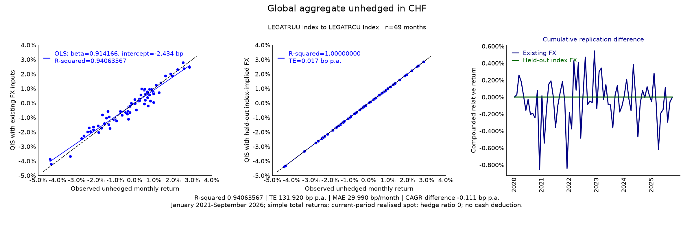

Figure 1. LEGATRUU Index translated to LEGATRCU Index. Supplied spots give
$R^2=0.94063567$ and TE 131.920 bp p.a.
The different-family FX diagnostic gives $R^2=1.00000000$
and TE 0.017 bp p.a. The FX anchor is
LGTRTRUU Index paired with LGTRTRCU Index.

#### Global aggregate in EUR

Figure 2. LEGATRUU Index translated to LEGATREU Index. Supplied spots give
$R^2=0.95361218$ and TE 112.513 bp p.a.
The different-family FX diagnostic gives $R^2=0.99999782$
and TE 0.771 bp p.a. The FX anchor is
LGTRTRUU Index paired with LGTRTREU Index.

#### Global aggregate in GBP

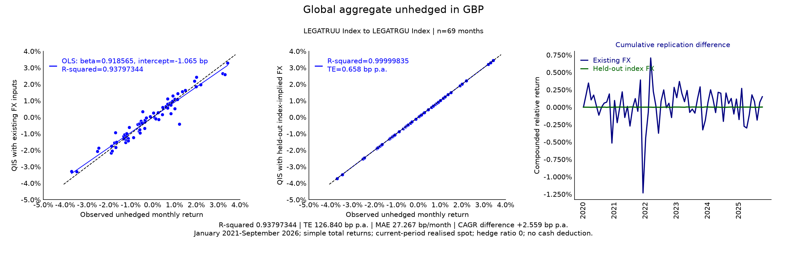

Figure 3. LEGATRUU Index translated to LEGATRGU Index. Supplied spots give
$R^2=0.93797344$ and TE 126.840 bp p.a.
The different-family FX diagnostic gives $R^2=0.99999835$
and TE 0.658 bp p.a. The FX anchor is
LGTRTRUU Index paired with LGTRTRGU Index.

#### Global government in CHF

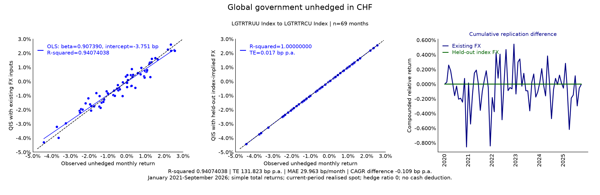

Figure 4. LGTRTRUU Index translated to LGTRTRCU Index. Supplied spots give
$R^2=0.94074038$ and TE 131.823 bp p.a.
The different-family FX diagnostic gives $R^2=1.00000000$
and TE 0.017 bp p.a. The FX anchor is
LEGATRUU Index paired with LEGATRCU Index.

#### Global government in EUR

Figure 5. LGTRTRUU Index translated to LGTRTREU Index. Supplied spots give
$R^2=0.95551438$ and TE 112.547 bp p.a.
The different-family FX diagnostic gives $R^2=0.99999792$
and TE 0.770 bp p.a. The FX anchor is
LEGATRUU Index paired with LEGATREU Index.

#### Global government in GBP

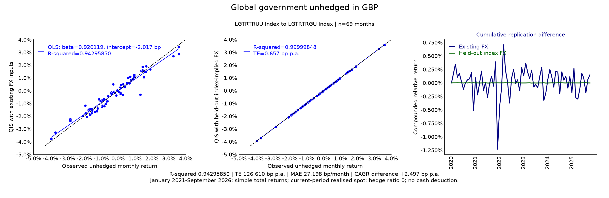

Figure 6. LGTRTRUU Index translated to LGTRTRGU Index. Supplied spots give
$R^2=0.94295850$ and TE 126.610 bp p.a.
The different-family FX diagnostic gives $R^2=0.99999848$
and TE 0.657 bp p.a. The FX anchor is
LEGATRUU Index paired with LEGATRGU Index.

#### Global IG corporate in CHF

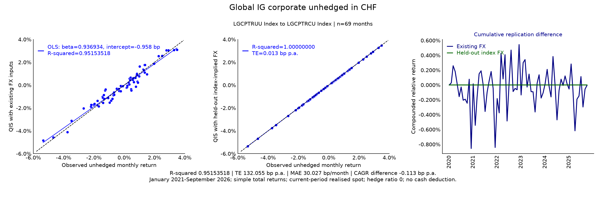

Figure 7. LGCPTRUU Index translated to LGCPTRCU Index. Supplied spots give
$R^2=0.95153518$ and TE 132.055 bp p.a.
The different-family FX diagnostic gives $R^2=1.00000000$
and TE 0.013 bp p.a. The FX anchor is
LEGATRUU Index paired with LEGATRCU Index.

#### Global IG corporate in EUR

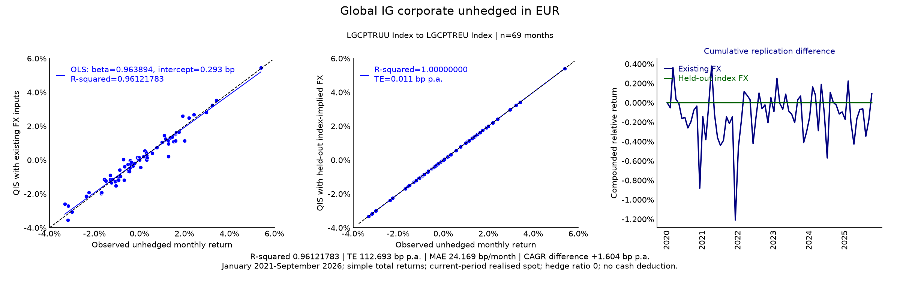

Figure 8. LGCPTRUU Index translated to LGCPTREU Index. Supplied spots give
$R^2=0.96121783$ and TE 112.693 bp p.a.
The different-family FX diagnostic gives $R^2=1.00000000$
and TE 0.011 bp p.a. The FX anchor is
LEGATRUU Index paired with LEGATREU Index.

#### Global IG corporate in GBP

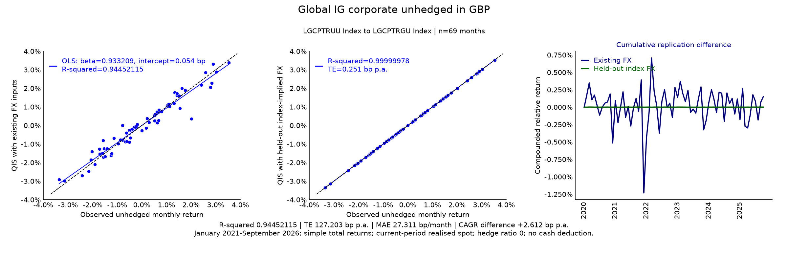

Figure 9. LGCPTRUU Index translated to LGCPTRGU Index. Supplied spots give
$R^2=0.94452115$ and TE 127.203 bp p.a.
The different-family FX diagnostic gives $R^2=0.99999978$
and TE 0.251 bp p.a. The FX anchor is
LEGATRUU Index paired with LEGATRGU Index.

#### Global high yield in CHF

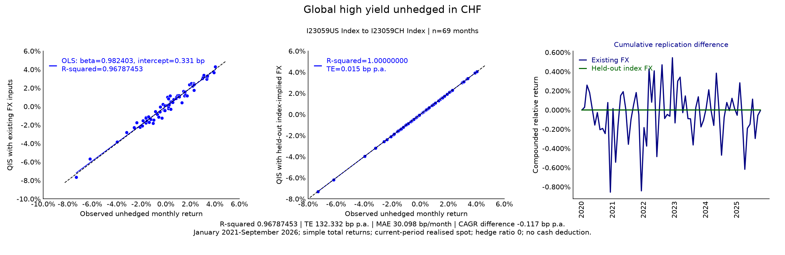

Figure 10. I23059US Index translated to I23059CH Index. Supplied spots give
$R^2=0.96787453$ and TE 132.332 bp p.a.
The different-family FX diagnostic gives $R^2=1.00000000$
and TE 0.015 bp p.a. The FX anchor is
LEGATRUU Index paired with LEGATRCU Index.

#### Global high yield in EUR

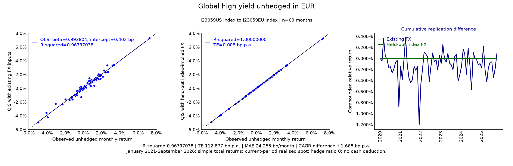

Figure 11. I23059US Index translated to I23059EU Index. Supplied spots give
$R^2=0.96797038$ and TE 112.877 bp p.a.
The different-family FX diagnostic gives $R^2=1.00000000$
and TE 0.008 bp p.a. The FX anchor is
LEGATRUU Index paired with LEGATREU Index.

#### Global high yield in GBP

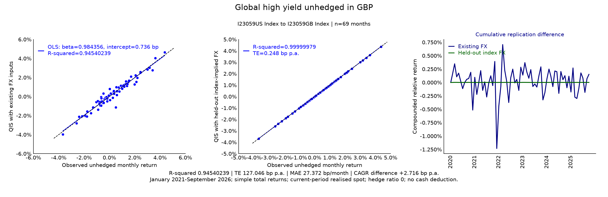

Figure 12. I23059US Index translated to I23059GB Index. Supplied spots give
$R^2=0.94540239$ and TE 127.046 bp p.a.
The different-family FX diagnostic gives $R^2=0.99999979$
and TE 0.248 bp p.a. The FX anchor is
LEGATRUU Index paired with LEGATRGU Index.

#### EM hard-currency bonds in CHF

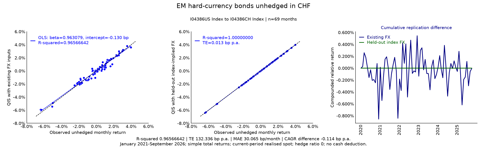

Figure 13. I04386US Index translated to I04386CH Index. Supplied spots give
$R^2=0.96566642$ and TE 132.336 bp p.a.
The different-family FX diagnostic gives $R^2=1.00000000$
and TE 0.013 bp p.a. The FX anchor is
LEGATRUU Index paired with LEGATRCU Index.

#### EM hard-currency bonds in EUR

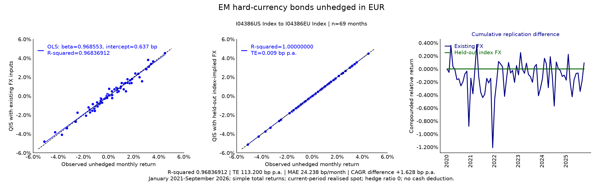

Figure 14. I04386US Index translated to I04386EU Index. Supplied spots give
$R^2=0.96836912$ and TE 113.200 bp p.a.
The different-family FX diagnostic gives $R^2=1.00000000$
and TE 0.009 bp p.a. The FX anchor is
LEGATRUU Index paired with LEGATREU Index.

#### EM hard-currency bonds in GBP

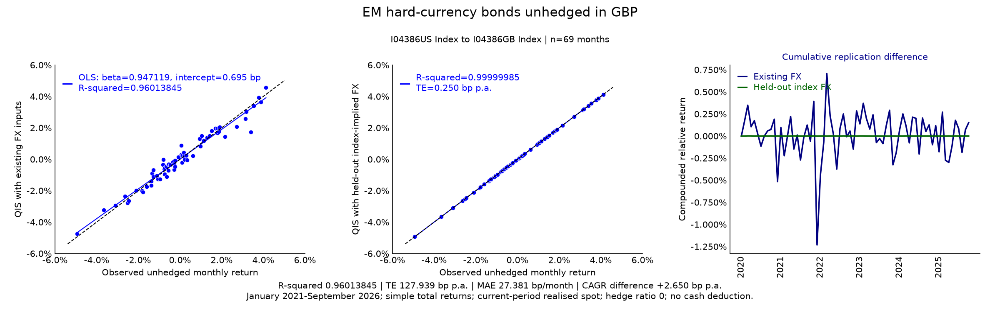

Figure 15. I04386US Index translated to I04386GB Index. Supplied spots give
$R^2=0.96013845$ and TE 127.939 bp p.a.
The different-family FX diagnostic gives $R^2=0.99999985$
and TE 0.250 bp p.a. The FX anchor is
LEGATRUU Index paired with LEGATRGU Index.

#### Global inflation-linked 1-10Y in CHF

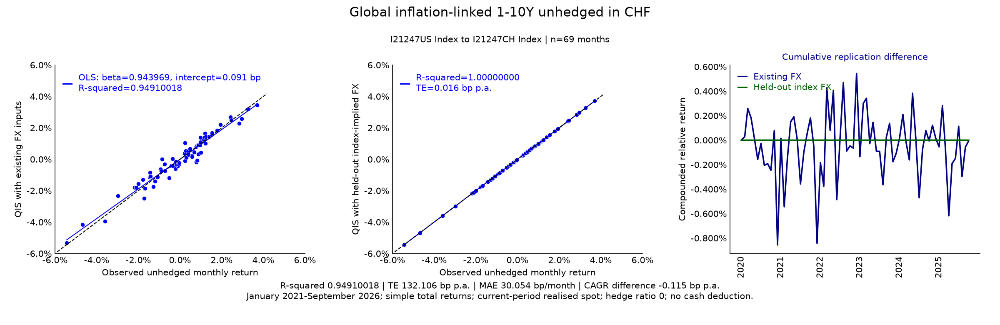

Figure 16. I21247US Index translated to I21247CH Index. Supplied spots give
$R^2=0.94910018$ and TE 132.106 bp p.a.
The different-family FX diagnostic gives $R^2=1.00000000$
and TE 0.016 bp p.a. The FX anchor is
LEGATRUU Index paired with LEGATRCU Index.

#### Global inflation-linked 1-10Y in EUR

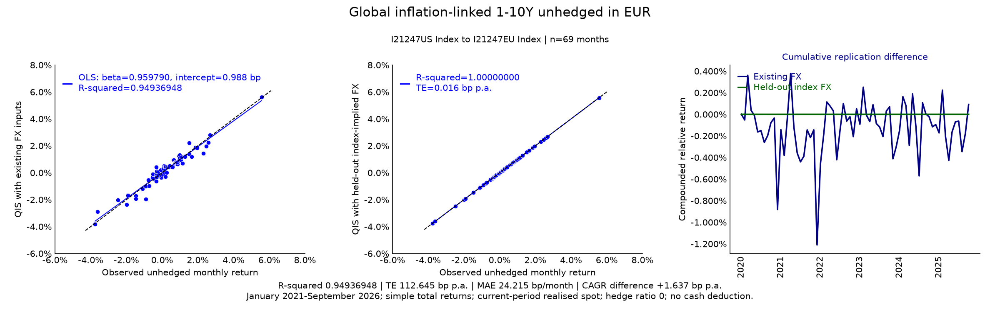

Figure 17. I21247US Index translated to I21247EU Index. Supplied spots give
$R^2=0.94936948$ and TE 112.645 bp p.a.
The different-family FX diagnostic gives $R^2=1.00000000$
and TE 0.016 bp p.a. The FX anchor is
LEGATRUU Index paired with LEGATREU Index.

#### Global inflation-linked 1-10Y in GBP

Figure 18. I21247US Index translated to I21247GB Index. Supplied spots give
$R^2=0.90811462$ and TE 126.626 bp p.a.
The different-family FX diagnostic gives $R^2=0.99999965$
and TE 0.248 bp p.a. The FX anchor is
LEGATRUU Index paired with LEGATRGU Index.

#### UK equities in GBP

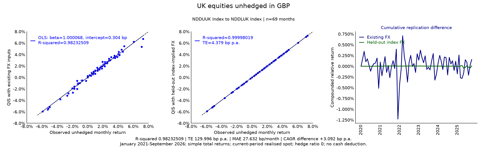

Figure 19. NDDUUK Index translated to NDDLUK Index. Supplied spots give
$R^2=0.98232509$ and TE 129.996 bp p.a.
The different-family FX diagnostic gives $R^2=0.99998019$
and TE 4.379 bp p.a. The FX anchor is
LEGATRUU Index paired with LEGATRGU Index.

#### Japan equities in JPY

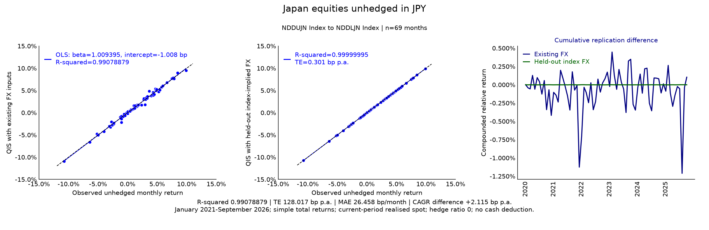

Figure 20. NDDUJN Index translated to NDDLJN Index. Supplied spots give
$R^2=0.99078879$ and TE 128.017 bp p.a.
The different-family FX diagnostic gives $R^2=0.99999995$
and TE 0.301 bp p.a. The FX anchor is
LEGATRUU Index paired with I00038JP Index.

#### Swiss equities in CHF

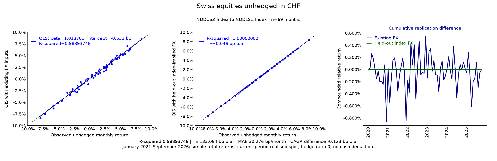

Figure 21. NDDUSZ Index translated to NDDLSZ Index. Supplied spots give
$R^2=0.98893746$ and TE 133.064 bp p.a.
The different-family FX diagnostic gives $R^2=1.00000000$
and TE 0.046 bp p.a. The FX anchor is
LEGATRUU Index paired with LEGATRCU Index.

#### Global aggregate in JPY

Figure 22. LEGATRUU Index translated to I00038JP Index. Supplied spots give
$R^2=0.96179755$ and TE 125.367 bp p.a.
The different-family FX diagnostic gives $R^2=0.99999977$
and TE 0.297 bp p.a. The FX anchor is
NDDUJN Index paired with NDDLJN Index.

## Implementation in qis

The public calculation is
`qis.FxRatesData.compute_performance_of_local_ccy_asset_in_reference_ccy`,
with `hedge_ratio=0.0`, `is_excess_returns=False`, `freq='ME'` and
`is_log_returns=False`. The method returns a reference-currency NAV and return series.
The [FX container source](https://github.com/ArturSepp/QuantInvestStrats/blob/main/src/qis/market_data/fx_rates_data.py)
owns this implementation. Regression figures use `qis.plot_scatter`, tracking error uses
`qis.compute_te_ir_errors`, and annual geometric returns use `qis.compute_pa_return`.

The original private analysis used QIS 5.33.1. Its FX implementation SHA-256 was
`46cb6d994fb9a5f20f1a2114abe952050e1097c9ca14808771714bc0e7fe1f09`.
The [analytics registry](https://github.com/ArturSepp/QuantInvestStrats/blob/main/tools/docs_analytics/manifest.json)
records input hashes, all 44 aggregate rows, the 22 pair identities, currency diagnostics,
original runtime identity and frozen figure hashes. The original analysis date,
preview generation time and current bundle generation time are separate records.

The repository-only
[case-study producer](https://github.com/ArturSepp/QuantInvestStrats/blob/main/tools/docs_analytics/unhedged_index_case_study.py)
preserves the reviewed previews and reconstructs the aggregate tables offline.
The default bundle does not refit or fetch undistributed vendor observations:

~~~console
python -m tools.docs_analytics.run --all --output-dir /local/new-complete-bundle
python -m tools.docs_analytics.publish --verify --repo /path/to/checkout
~~~

For an authorised, hash-matched private derived panel, the separate command is:

~~~console
python -m tools.docs_analytics.unhedged_index_case_study --source-csv /private/monthly_comparison.csv --output-dir /local/new-private-recheck
~~~

That command rechecks both FX methods on the recent 69-month panel, including an
separate other-family anchor, QIS payoff reconstruction, regression fit, sample tracking
error and geometric returns. It does not claim to refetch daily index levels, obtain
WMR quotes or refit undistributed full histories. Raw histories, FX quotes and private
mandate results remain outside the repository.

Use the prescribed interpreter and C-local setup in
[the contributor instructions](https://github.com/ArturSepp/QuantInvestStrats/blob/main/AGENTS.md)
and the [analytics tool guide](https://github.com/ArturSepp/QuantInvestStrats/blob/main/tools/docs_analytics/README.md).
Independent original checks covered direct NAV translation, simple/log equivalence,
zero-rate and cash-lag invariance, and rejection of an omitted cross-product or lagged
realised FX return. Full-history records retain that original review.

## Interpretation and limitations

- The strongest inference is that a common FX-input discrepancy explains most of the
  supplied-spot mismatch. Exact fixing-time causation remains unverified.
- The diagnostic is based on observed index ratios from another family. It is not an
  independent WMR feed, an executable currency quote, or temporal out-of-sample validation.
- Provider rounding, calculation conventions and historical revisions can explain residual
  diagnostic error. UK equities retain 4.38 bp p.a. tracking error.
- A global multicurrency USD index already embeds constituent-currency effects. Changing
  its quotation currency translates the same unhedged wealth; it does not isolate a single
  underlying currency exposure or reconstruct a constituent-level hedge.
- These are provider total returns. Net-dividend equity and bond coupon conventions remain
  unchanged; there is no extra fee or cash deduction.
- In a full opening-principal hedge the direct FX term cancels, while the asset/FX
  cross-product remains. Generic-versus-index FX discrepancies can therefore be much more
  visible here than in the [earlier hedged study](hedged_index_replication.md).
- Public reproduction covers aggregate and frozen-image integrity. Private refits require
  the authorised panel; vendor history revisions require a new reviewed snapshot.
- No production FX substitution, fitted return correction, cash-lag change or default
  parameter change is made by this study.

> **Insight.** A direct replication test needs independently observed FX fixings aligned
> with the provider's currency convention. Index-implied FX is useful for isolating the
> input-consistency problem while that independent history is unavailable.

## See also

- [FX hedging and market-data boundaries](fx_hedging_and_market_data.md)
- [Hedged index replication](hedged_index_replication.md)
- [Cash rate timing and FX adjustments](cash_rate_timing_and_fx_adjustments.md)
- [Returns and NAVs](returns_and_navs.md)
- [Tracking error and benchmark-relative risk](tracking_error_and_risk.md)
- [Regression and HAC](regression_and_hac.md)
- [Notation and conventions](notation_and_conventions.md)

## References

1. Bloomberg Index Services Limited (2026). *Bloomberg Fixed Income Index Methodology*, 8 January. [Methodology PDF](https://assets.bbhub.io/professional/sites/10/Bloomberg-Index-Publications-Fixed-Income-Index-Methodology.pdf). Appendix 2: currency returns; Appendix 12: index identification.
2. LSEG. *Access WMR Benchmark Rates Via Bloomberg*. [Access guide](https://www.lseg.com/content/dam/ftse-russell/en_us/documents/methodology/access-wmr-rates-via-bloomberg.pdf). WMCO/WMCD identifiers and access instructions.
3. Sepp, A. qis: Performance analytics, portfolio backtesting, risk analysis, and factsheet reporting in Python. [Software citation metadata](https://github.com/ArturSepp/QuantInvestStrats/blob/main/CITATION.cff).
