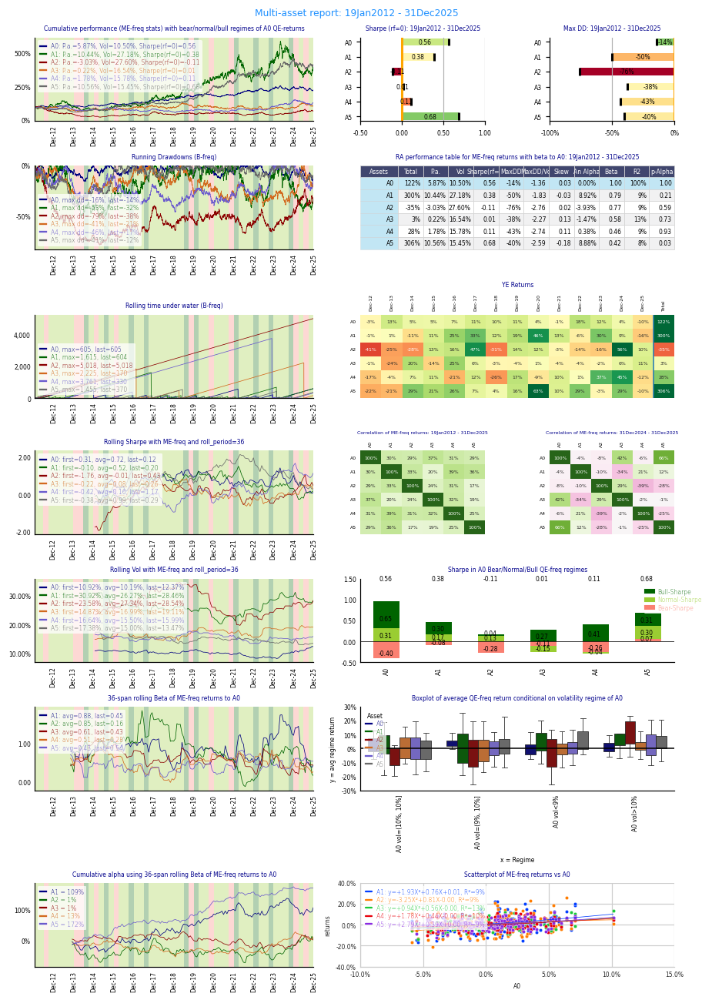
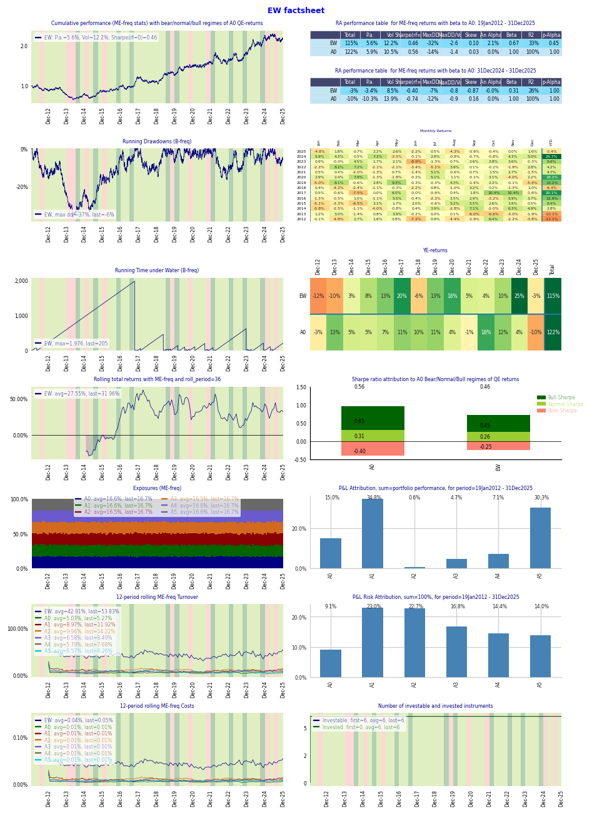
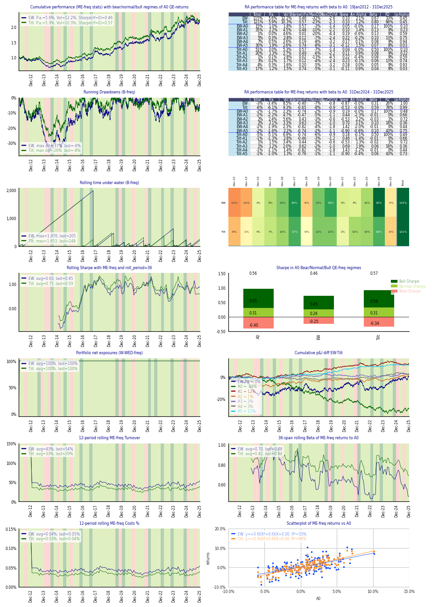
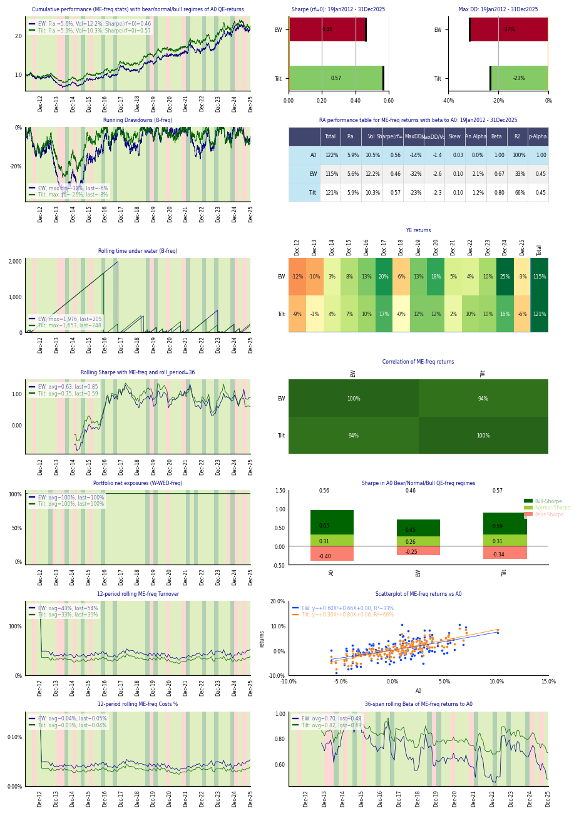

# Factsheet gallery

Every image below is a real `qis` factsheet, each produced by a single `qis.factsheet(...)` call
from one synthetic correlated-GBM price panel (no live data needed). All four are reported at
**monthly** frequency — and note that every panel states the frequency at which it was computed:
cumulative and rolling statistics on the monthly (`ME`) grid, drawdowns and time-under-water on the
native business-day (`B`) grid, regimes on the quarterly (`QE`) grid. Changing `reporting_frequency`
recalibrates all of it; see [reporting_frequencies.md](reporting_frequencies.md).

## Multi-asset universe

A full tearsheet for a set of instruments against a benchmark: cumulative performance with
bull / bear / normal regimes, a risk-adjusted performance table, rolling volatility / Sharpe / beta,
drawdowns and time-under-water, year-on-year returns, correlations over the full and trailing
windows, and regime-conditional statistics.



```python
qis.factsheet(prices, benchmark='SPY', reporting_frequency='monthly', file_name='universe')
```

## Single strategy

A backtested strategy against its benchmark: performance and drawdowns, rolling statistics,
exposures through time, rolling turnover and cost, and P&L / risk attribution across holdings.



```python
qis.factsheet(portfolio, benchmark_prices=spy, reporting_frequency='monthly', file_name='strategy')
```

## Strategy vs. benchmark

Two books side by side (here an equal-weight portfolio against a tilt), with their cumulative
difference, comparative drawdowns, rolling betas and the regime decomposition — for judging one
strategy relative to another.



```python
qis.factsheet(multi_portfolio, kind='strategy_benchmark', reporting_frequency='monthly', file_name='vs_benchmark')
```

## Multiple strategies

A set of strategies on shared axes — cumulative performance, a combined risk-adjusted table,
rolling Sharpe, cross-strategy correlation and regime statistics — for comparing several books at
once.



```python
qis.factsheet(multi_portfolio, reporting_frequency='monthly', file_name='strategies')
```

---

All four pages were produced with the defaults; pass `time_period=...` to restrict the window, or
swap `reporting_frequency` to `'daily'`, `'weekly'` or `'quarterly'` to re-render the same book at a
different cadence with every statistic recalibrated. See [factsheets.md](factsheets.md) for the
full-control API and [reporting_frequencies.md](reporting_frequencies.md) for the convention.
