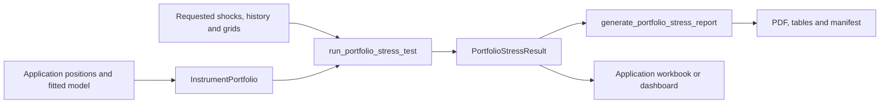

# Instrument portfolio valuation and stress reports

The public interface is `qis.portfolio.stress`. The same objects are exported
from `qis.portfolio` and `qis`. `InstrumentPortfolio` represents a dated
absolute-position snapshot; the existing `PortfolioData` continues to represent
portfolio/backtest history.

An application supplies contract terms, actual quotes and a fitted `qis.RiskModel`.
QIS values those holdings under factor shocks, computes current local exposures,
ranks historical scenarios and renders a result. The application owns data
acquisition, factor estimation, contract interpretation and lending decisions.

## Executable public example

This synthetic example uses no estimator or data-provider package.

```python
import numpy as np
import pandas as pd
from qis import (
    RiskModel, FactorGroupSpec, Underlying, ResponseBasis,
    InstrumentLeg, InstrumentType, PortfolioHolding, InstrumentPortfolio,
    StressScenarios, ShockConvention, ScenarioMode, run_portfolio_stress_test,
)

date = pd.Timestamp("2026-08-31")
factors = ["Credit", "Credit EM"]
responses = ["bond_proxy"]
betas = pd.DataFrame([[1.0, 1.0]], index=responses, columns=factors)
factor_cov = pd.DataFrame([[0.01, 0.004], [0.004, 0.01]],
                          index=factors, columns=factors)
residual = pd.Series([0.0025], index=responses)
asset_cov = betas @ factor_cov @ betas.T
asset_cov += pd.DataFrame(np.diag(residual), index=responses, columns=responses)
model = RiskModel(
    covar={date: asset_cov},
    factor_loadings={date: betas},
    factor_covar={date: factor_cov},
    residual_vars={date: residual},
    factor_groups={
        "credit_family": FactorGroupSpec("credit_family", ("Credit", "Credit EM")),
    },
)
quote = Underlying("actual_contract", 100.0, "USD", "bond_proxy",
                   ResponseBasis.REFERENCE)
portfolio = InstrumentPortfolio(
    holdings=(
        PortfolioHolding(
            "source_future_1", "Short future", observed_mtm=0.0,
            legs=(InstrumentLeg(InstrumentType.FUTURE, "actual_contract",
                                quantity=-2.0, multiplier=10.0),)),
    ),
    underlyings={quote.quote_id: quote},
    risk_model=model,
    risk_date=date,
    valuation_date=date,
    reference_currency="USD",
    reporting_denominator=1_000.0,
    denominator_label="Investment capital",
)
scenarios = StressScenarios(
    pd.DataFrame({"credit_family": [-0.10, 0.0, 0.10]},
                 index=["Credit down", "Unchanged", "Credit up"]),
    mode=ScenarioMode.CONDITIONAL,
    convention=ShockConvention.SIMPLE,
)
result = run_portfolio_stress_test(portfolio, scenarios)
assert result.valuations["requested"].portfolio_pnl.loc["Unchanged"] == 0.0
assert np.isclose(result.valuations["requested"].portfolio_pnl.loc["Credit down"], 195.0)
assert np.isclose(result.factor_exposures["Credit"], -2_000.0)
assert np.isclose(result.factor_betas["Credit"], -2.0)
```

The total Credit-family bump of -10% gives each member a -5% simple return.
The beta-one-plus-beta-one underlying moves to `100 * 0.95**2 = 90.25`.
The short future earns `-2 * 10 * (90.25 - 100) = 195`.
Its zero source MTM does not remove its -2,000 dollar exposure to each factor.

To write the result to a **fresh** directory:

```python
from qis import StressReportConfig, generate_portfolio_stress_report

# Supply a new output directory outside the source checkout.
# artifacts = generate_portfolio_stress_report(
#     result, output_dir, StressReportConfig(title="Portfolio stress", model_label="My model"))
```

The renderer takes the completed result and optional plain-data diagnostics. It
does not access the portfolio's payoffs, refit a model or obtain prices.

## Objects and ownership

| Object | Responsibility |
|---|---|
| `RiskModel` | Dated response covariance, factor loadings/covariance, residual variance and optional factor groups. |
| `Underlying` | Actual quote ID, positive baseline price, currency, fitted response ID and response currency basis. |
| `InstrumentLeg` | Primitive type, signed units, positive multiplier and option strike. |
| `PortfolioHolding` | Original position ID/name, observed mark, legs or one custom composite and boundary policy. |
| `InstrumentPortfolio` | Exact model/position dates, registries, currency conversions and reporting denominator. |
| `PayoffContext` | Read-only copies of scenario/baseline quotes, FX, shocks and response maps for composites. |
| `StressScenarios` | Requested anchors, return convention and independent/conditional completion. |
| `PortfolioStressResult` | Computed valuations, exposures, risk, grids, coverage and copied model inputs. |
| `StressReportConfig` | Labels, selected plots, caller-supplied R-squared and fitted clustering diagnostics. |
| `StressReportArtifacts` | PDF, CSV tables, optional numerical workbook, manifest and optional previews. |

Workflow:



QIS has no dependency on ROSAA, FS, OptimalPortfolios, FactorLasso or a vendor.
An upstream consumer may use `optimalportfolios.build_risk_model` as an adapter,
but this is not a requirement of the public interface.

## Valuation conventions

All factor shocks are decimal **log returns** at the portfolio evaluator.
`StressScenarios` can accept simple-return instructions and convert them
explicitly. Scenario batches have rows as unique scenario IDs and columns as
factor IDs. Direct evaluation requires a complete finite vector; unknown,
missing or duplicate labels fail. A single vector is a labelled Series:

- `portfolio.get_mtm(delta_f)`: stressed values by original holding.
- `portfolio.get_pnl(delta_f)`: changes from the observed marks.
- `portfolio.evaluate(factor_log_shocks)`: batch values, P&L and baseline audit.

For a funded asset in reference currency, with `g = beta dot delta_f`:

`V(f) = observed_mtm * exp(g)`

`PnL(f) = observed_mtm * expm1(g)`.

A funded holding has exactly one `DELTA_1` leg. Its observed mark is the
authoritative size; supplied units remain contract/audit information and their
sign must agree with the mark. A zero mark is zero funded exposure. Cash can use
an explicitly deterministic response ID of `None`; it is never silently
assigned to an unknown ticker.

Primitive local model values, with signed quantity q and multiplier m:

| Type | Local modeled payoff |
|---|---|
| CALL | q m max(S - K, 0) |
| PUT | q m max(K - S, 0) |
| FUTURE | q m (F - F0) |
| DELTA_1 | Funded response scaled from the observed mark. |

A derivative's stressed value is:

`observed_mtm + model_payoff(f) - model_payoff(0)`.

This preserves observed MTM at zero shock even when it is negative or includes
time value that the intrinsic model omits. The basis offset is constant in
reference currency. It is not an estimate of remaining option premium,
liquidation proceeds, margin cash or lending value.

Quotes must be strictly positive for this initial multiplicative shock policy.
A nonpositive futures quote fails explicitly; additive quote models are outside
this version. Full option pricing, theta, volatility surfaces and barrier path
simulation are also outside the primitive contract.

## FX and actual quotes versus response proxies

`Underlying.response_id` identifies a fitted response row in the RiskModel.
The actual quote ID, spot and strike units remain distinct. Several actual
contracts can share the same continuous-futures or asset proxy response.

- `ResponseBasis.REFERENCE`: the fitted response already includes reference
  currency conversion. Subtract the quote-currency FX response before applying
  the shock to a local strike.
- `ResponseBasis.LOCAL`: the fitted response describes the quote directly.
  Convert its payoff separately at stressed FX.

`fx_rates["EUR"]`, for a USD portfolio, is an `Underlying` quoted in USD per EUR,
for example 1.20. FX entries themselves use `ResponseBasis.REFERENCE` and are
quoted in the portfolio reference currency. Reference/reference FX is one and
is not supplied. An actual currency pair can be represented by its local pair
quote and an explicitly estimated pair-return response; quote direction is a
caller responsibility.

Local payoff conversion happens exactly once. The current derivative includes
both spot sensitivity and the FX sensitivity of the modeled intrinsic payoff,
without stressing the constant mark basis offset.

## Local risk and kink policies

The engine builds a **holding-by-shared-response dollar Jacobian**. It aggregates
these response sensitivities before calling the canonical RiskModel exposure,
volatility and Euler-contribution methods. A stock, option and future referring
to the same fitted response share its residual risk; it is not replicated on
every synthetic leg.

The reporting denominator is a positive amount chosen by the application. It
changes percentage P&L, reported betas and volatility ratios, never holdings or
cash P&L. Label it factually, for example "Gross assets" or "Investment capital";
it is not automatically debt-net NAV.

Current risk fields:

- `annual_total_vol`: local risk from the supplied authoritative response covariance.
- `annual_systematic_vol`: factor-block component.
- `annual_residual_vol`: shared-response residual component.
- `annual_factor_model_vol`: total of the factor and residual variance components.
- `local_vol_horizon`: authoritative total volatility scaled by sqrt(horizon_years).
- `factor_betas`: current factor currency sensitivities divided by the reporting denominator.

The authoritative covariance and factor/residual views are shown separately.
If the upstream model makes them inconsistent, the engine does not replace one
with the other. This is current local risk, not a distribution of a nonlinear
contract's complete tail payoff.

`KinkPolicy.LEFT`, `RIGHT` and `MIDPOINT` specify a common one-sided **quote**
derivative across all vanilla legs of a holding:

- Continuing accumulator proxy: Q calls minus LQ puts; favorable boundary uses RIGHT.
- Continuing decumulator proxy: Q puts minus LQ calls; favorable boundary uses LEFT.

This is equivalence of a remaining-quantity intrinsic payoff proxy, not a claim
to reproduce an accumulator's path state, fixing schedule or physical delivery.

## Composite payoff extension

A custom object implements public `HoldingPayoff`:

- `implementation_id`: stable implementation/version identifier.
- `coverage`: approximation and missing state description.
- `boundary_policy`: derivative convention at strikes, barriers or basket ties.
- `evaluate(context)`: finite reference-currency Series with exactly the scenario index.
- `response_jacobian(context)`: current dollar derivative with exactly the shared response IDs.

The `PayoffContext` properties return defensive copies. They include actual
local quotes, quote currencies, baseline quotes, reference-per-local FX,
baseline FX, complete factor/response log shocks and quote/FX response
Jacobians. A composite can use these public mappings without private QIS
imports. If a composite cannot supply current sensitivities, it can raise
`NotImplementedError`: direct valuation remains usable, while full stress
analysis fails explicitly rather than silently assigning zero risk.

Retain contract parameters and application policy in the holding's plain
metadata or a caller-owned input manifest. QIS records identity, coverage and
boundary declarations; it does not serialize executable private implementations.
Worst-of baskets, terminal barriers and TARF approximations remain consumer
implementations whose path-state and settlement limitations must be declared.

## Factor-family splits and aggregation

Model definitions can supply `FactorGroupSpec` via `RiskModel.factor_groups`.
The group key must differ from any fitted factor name and members must exist at
every model date. Default weights split equally; explicit nonnegative weights
must sum to one and are never silently normalized.

For a family bump x with weights w:

- SIMPLE: each member gets `log1p(w * x)`.
- LOG: each member gets `w * x`.

Thus equal splitting of a -10% simple family bump gives two -5% simple member
bumps, not two -10% bumps and not half of `log(0.9)`.
The expanded factors are fixed **jointly** during conditional completion.
A family instruction conflicting with a supplied member instruction fails.

`RiskModel.compute_factor_group_exposures_at_date` reports both the **sum of
member exposures** and the **weighted local sensitivity to a split family bump**.
These answer different questions. No factor covariance, residual or historical
vector is collapsed by this display grouping. Economic family definitions and
the choice to split a particular scenario belong to the caller's model spec.

A grid is another `StressScenarios` object, supplied under a descriptive key
in `factor_grids`. Its row index is preserved, including an explicit axis name.
Use numeric row labels equal to the total requested bump when plotting a
sensitivity curve. Scenario and grid requests follow exactly the same expansion
and valuation functions.

A caller can pin a particular row's completion with
`scenario_modes={"level target": ScenarioMode.CONDITIONAL}`. This is useful
when a factor price-target request must keep conditional co-moves on both the
requested and comparison pages. Other rows retain their independent/conditional
comparison policy. Use the existing `price_target_log_shock` helper to convert
a factor level target into an explicit log anchor; no economic policy is
inferred from the row's name.

## Historical replay and attribution

Monthly history must have a unique DatetimeIndex, at most one observation per
month and exactly the model factors. Incomplete vectors and dates after the
position date are excluded with a coverage record. Infinite returns or duplicate
months fail. Every eligible vector is applied to **current holdings and betas**,
then exact portfolio P&L is ranked. The result is not the client's historical
investment return and has no assigned scenario probability.

Funded-asset factor attribution preserves the existing exact QIS exponential
projection. For derivatives, factor contributions use the current Jacobian;
a separate "Nonlinear payoff adjustment" reconciles those contributions to
exact scenario P&L. There is no logarithm or P&L division by derivative MTM.

Ordinary funded portfolios retain existing baseline Gaussian conditional-factor
plus shared-residual grid bands. Their horizon and central probability are
explicit. Nonlinear/derivative grids show deterministic intrinsic curves with
an unavailable-band status and no quadratic fit.

## Report subjects and audit exports

Nine core pages cover requested scenarios, conditional scenarios, worst historical
months, current exposures/risk, holding factor contributors, sensitivity curves,
response loadings/R-squared, fitted cluster dendrograms and correlation/methodology.
The layout preserves the original stress-report titles and explanatory notes;
`model_name="MATF"` gives the MATF titles without a private model dependency.

Page four contains an annualised factor-model risk table and **family Euler
volatility contributions**. Each family sums its signed constituent contributions;
scenario split weights are not used. Ungrouped factors remain separate. Overlapping
scenario groups have no unique additive partition and display atomic factor terms.
The supplied asset-covariance risk remains a separate exported view if it differs
from the factor-model total. Derivative risk uses current shared-response Jacobians.

Page six calls QIS scatter plots and `fit_multivariate_ols` for through-zero
quadratic fits on funded-asset scenario grids. Existing conditional bands stay
centred on exact scenario valuations. Neither bands nor quadratic fits are inferred
for derivative portfolios. Credit grids retain the caller's total-family split.
Page seven includes signed beta colours, fitted R-squared, annual systematic and
residual volatility, Rest of assets, and Portfolio rows. Rest uses full-denominator
weights, not a renormalised sleeve. Portfolio R-squared is an absolute-response-
exposure-weighted average of available fitted R-squared, not a portfolio regression.

The parser can add a tenth page with `StressReportConfig(appendix_table=...,
appendix_title=..., appendix_subtitle=..., appendix_notes=(...))`. QIS displays the
supplied preformatted DataFrame and footnotes; it invents no source-quality,
collateral or coverage rules. The table supports up to 24 rows and ten data columns.
Use `None` to omit the page. The complete source audit can remain a separate export.

All table exports retain every scenario, holding and grid. PDF limits are 12
scenario rows, ten contributors, six factor panels, four grid panels and 20 unit
response rows plus aggregate rows. All fitted factors appear in model order.
Missing R-squared and fitted trees are labelled unavailable. The caller supplies
names, diagnostics and original topology; the renderer never estimates them.
`PortfolioStressResult.report_diagnostics` retains numerical Euler tables, unit
response risk, loading aggregates and quadratic coefficients before rendering.
Those exhibits, the displayed loading table and optional parser appendix are also
exported to Excel and CSV.

The workbook is a numerical result export, not an editable payoff calculator.
The CSV-to-table mapping, conventions, snapshot dates and SHA-256 artifact hashes
are recorded in `manifest.json`. Existing output directories are rejected.

## Consumer adoption

ROSAA/UAE adapters should construct funded holdings and convert their fitted
snapshot into a RiskModel, preserving current scenarios and diagnostic inputs.
MATF definitions should provide economic family membership, including the
reviewed Credit simple-bump split, rather than introducing MATF imports in QIS.

JSR should retain source holding/account IDs and actual contract quantities,
map continuing accumulators/decumulators to vanilla legs, and supply explicit
composites for terminal KO, worst-of FCNs and declared TARF approximations.
Settlement/delivery and collateral staircases remain application outputs.

FS should map actual signed contract quantities and multipliers to FUTURE legs,
using continuous contracts only as response proxies. Cash and collateral are
separate funded holdings; future notional is not added to portfolio value.
